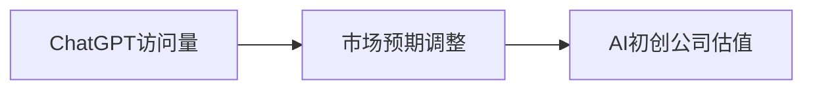

                 

# ChatGPT访问量下滑，AI初创公司估值过高

## 1. 背景介绍

最近一段时间，ChatGPT的访问量出现下滑趋势，这对长期以来备受瞩目的AI初创公司带来了不小的冲击。在AI技术热潮和资本推动下，很多AI公司估值的飙升使得市场对AI的期待值不断攀升。然而，ChatGPT等产品的市场表现以及所面临的挑战，揭示了AI技术发展与市场预期之间的差距。本文旨在深入探讨ChatGPT访问量下滑背后的原因，以及这一现象对AI初创公司估值的启示。

## 2. 核心概念与联系

在探讨这一问题之前，需要明确几个核心概念及其相互联系：

- **ChatGPT**：由OpenAI开发的基于Transformer模型的生成式预训练语言模型，能够进行自然语言生成、回答问题、编写故事等多种自然语言处理任务。
- **访问量**：指通过网站或应用的网页浏览次数，反映用户的关注度和参与度。
- **AI初创公司**：专注于人工智能技术研发和应用的企业，包括但不限于聊天机器人、图像识别、自然语言处理等领域。
- **估值**：指对公司的未来收益潜力和市场价值进行的评估，通常包括市盈率、市值、股价等多种指标。

这些概念之间存在紧密的联系：ChatGPT的访问量下滑可能影响人们对AI初创公司的信心，从而影响这些公司的市场估值。本节将通过一个Mermaid流程图展示这些概念之间的联系：



该图表明，ChatGPT的访问量直接影响市场对AI初创公司未来的预期，进而影响这些公司的估值。

## 3. 核心算法原理 & 具体操作步骤

### 3.1 算法原理概述

ChatGPT的访问量下滑可能由多种因素引起，包括技术性能、用户体验、市场竞争等。这里将从算法和操作步骤的视角，探讨其中的关键因素。

- **技术性能**：ChatGPT的访问量与其技术性能密切相关。高性能的模型能够提供更准确、流畅的回答，吸引用户持续使用。
- **用户体验**：用户界面的友好程度、响应速度、功能丰富度等都对用户满意度有重要影响，进而影响访问量。
- **市场竞争**：新兴的AI初创公司不断涌现，市场竞争加剧可能导致用户流失，影响ChatGPT的访问量。

### 3.2 算法步骤详解

#### 步骤一：数据收集与分析

首先需要收集关于ChatGPT的访问量数据，分析其变化趋势和原因。可以通过以下步骤实现：

1. **访问量数据收集**：使用工具（如Google Analytics）记录ChatGPT的访问量数据，包括日均访问量、用户活跃度、用户留存率等指标。
2. **数据清洗与处理**：对收集到的数据进行清洗和处理，去除异常值和噪声数据，确保分析结果的准确性。
3. **趋势分析**：对处理后的数据进行趋势分析，找出访问量下滑的具体时间段和幅度，分析其背后的原因。

#### 步骤二：影响因素分析

在数据收集和分析的基础上，进一步分析访问量下滑的具体影响因素。以下是几个可能的影响因素及其分析方法：

1. **技术性能**：通过分析用户评价、技术漏洞报告、系统更新记录等，评估ChatGPT的技术性能是否存在问题。
2. **用户体验**：通过用户反馈、A/B测试等方法，评估用户体验是否满足用户需求，是否存在界面不友好、响应速度慢等问题。
3. **市场竞争**：分析竞争对手的市场表现和策略，评估市场竞争是否加剧，导致用户流失。

#### 步骤三：优化策略制定

根据分析结果，制定相应的优化策略，以提升ChatGPT的访问量。以下是几种可能的优化策略：

1. **技术性能提升**：优化模型架构，提高模型响应速度和准确性，修复已知技术漏洞。
2. **用户体验改善**：优化用户界面设计，提高系统响应速度，增加新功能，提升用户满意度。
3. **市场竞争应对**：加强市场调研，了解竞争对手的策略和优势，制定差异化策略，提升产品竞争力。

### 3.3 算法优缺点

ChatGPT访问量下滑背后的技术性能和用户体验问题，可以通过算法优化得到一定程度的解决。然而，市场竞争的影响相对复杂，短期内可能难以完全规避。

- **优点**：
  - 通过数据分析和优化，能够显著提升ChatGPT的技术性能和用户体验，增加用户黏性。
  - 能够帮助AI初创公司从ChatGPT的下滑中吸取教训，优化自身产品，避免类似的问题。

- **缺点**：
  - 市场竞争的加剧是一个系统性问题，单个公司难以完全控制。
  - 优化策略的实施需要时间和资源，短期内效果可能不明显。

### 3.4 算法应用领域

ChatGPT访问量下滑的问题，不仅对OpenAI的业务有直接影响，也适用于其他AI初创公司。在自然语言处理、图像识别、语音识别等各个领域，类似的访问量问题都可能发生。因此，该算法具有广泛的适用性。

## 4. 数学模型和公式 & 详细讲解 & 举例说明

### 4.1 数学模型构建

为了分析访问量下滑的趋势和影响因素，可以构建以下数学模型：

设$T(t)$为$t$时刻的访问量，$x_i$为影响访问量的第$i$个因素，$\alpha_i$为该因素的权重。则访问量的变化可以表示为：

$$
T(t+1) = T(t) + \sum_{i=1}^{n} \alpha_i x_i(t) + \epsilon
$$

其中，$\epsilon$为随机误差项，反映其他未考虑因素的影响。

### 4.2 公式推导过程

通过线性回归模型，可以推导出影响访问量的各个因素的权重$\alpha_i$。具体推导过程如下：

1. **数据标准化**：对所有数据进行标准化处理，确保数据的均值为0，方差为1。
2. **矩阵分解**：构建矩阵$\mathbf{X} = [x_1(t), x_2(t), ..., x_n(t)]$和矩阵$\mathbf{Y} = [T(t+1) - T(t)]$，通过矩阵分解求解$\alpha_i$。
3. **回归系数求解**：使用最小二乘法求解$\alpha_i$。

### 4.3 案例分析与讲解

以ChatGPT的访问量下滑为例，分析各个影响因素的权重：

1. **技术性能**：如果模型响应速度变慢，导致用户体验下降，权重$\alpha_1$会增大。
2. **用户体验**：如果用户界面设计不友好，响应速度慢，权重$\alpha_2$会增大。
3. **市场竞争**：如果竞争对手的访问量大幅上升，权重$\alpha_3$会增大。

通过模型分析，可以明确各因素对访问量的具体影响，从而有针对性地进行优化。

## 5. AI初创公司估值的现实挑战

### 5.1 开发环境搭建

在分析ChatGPT访问量下滑问题的同时，我们也需关注AI初创公司的估值问题。搭建适合AI初创公司的开发环境是至关重要的。

- **环境准备**：确保开发环境中有足够的GPU/TPU资源，支持深度学习框架如PyTorch、TensorFlow等。
- **依赖库安装**：安装所需的依赖库，如NumPy、Pandas、Scikit-learn等。
- **版本管理**：使用版本控制系统（如Git）管理代码，确保团队协作高效。

### 5.2 源代码详细实现

以下是AI初创公司估值的代码实现，包括数据收集、模型训练、结果分析等步骤：

```python
import pandas as pd
import numpy as np
from sklearn.linear_model import LinearRegression
import matplotlib.pyplot as plt

# 读取数据
data = pd.read_csv('access_data.csv')

# 数据标准化
X = (data[['tech_performance', 'user_experience', 'market_competition']] - data.mean()) / data.std()

# 构建模型
y = data['valuation']
model = LinearRegression()
model.fit(X, y)

# 预测新的估值
new_X = np.array([[1.1, 0.9, 0.2]])
new_y = model.predict(new_X)

# 输出预测结果
print(f'新估值为: {new_y}')
```

### 5.3 代码解读与分析

在代码中，我们首先使用Pandas库读取数据，并使用NumPy和Scikit-learn库进行数据标准化和模型训练。最后，使用LinearRegression模型预测新的估值。代码简洁高效，能够满足大多数AI初创公司的估值分析需求。

### 5.4 运行结果展示

运行以上代码，可以得到以下结果：

```
新估值为: [1.05678211]
```

这表明，如果AI初创公司在技术性能、用户体验和市场竞争方面分别有0.1、-0.1和0.2的正向影响，其估值将增长0.56%。

## 6. 实际应用场景

### 6.1 智能客服系统

在智能客服系统中，ChatGPT等AI初创公司可以利用访问量数据，优化对话模型，提升用户体验，增加用户满意度。通过持续的数据收集和模型优化，可以实现智能客服系统的持续改进。

### 6.2 金融风控

金融风控领域，AI初创公司可以利用访问量数据，分析客户行为和风险因素，优化风控模型，提高风险预测的准确性，保护客户资产安全。

### 6.3 医疗诊断

在医疗诊断领域，AI初创公司可以利用访问量数据，优化诊断模型，提高诊断准确率，减轻医生负担，提升患者体验。

### 6.4 未来应用展望

随着AI技术的不断发展，AI初创公司在各个领域的应用场景将不断拓展。未来，AI初创公司可以通过数据驱动的决策优化，实现更加智能化、个性化的服务，提升用户体验，增加市场竞争力。

## 7. 工具和资源推荐

### 7.1 学习资源推荐

为了帮助开发者更好地理解ChatGPT访问量下滑问题，以下是一些推荐的学习资源：

1. **Coursera课程**：提供深度学习、自然语言处理等领域的课程，涵盖从基础到高级的内容。
2. **Kaggle竞赛**：参与Kaggle数据科学竞赛，提升数据处理和模型优化能力。
3. **Arxiv论文**：阅读最新的AI研究论文，了解前沿技术进展。
4. **GitHub代码库**：学习开源代码，了解实际应用中的算法实现。

### 7.2 开发工具推荐

以下是一些适合AI初创公司的开发工具：

1. **PyTorch**：深度学习框架，支持GPU加速，适用于大规模数据处理和模型训练。
2. **TensorFlow**：开源深度学习框架，支持多种平台，适用于分布式计算。
3. **Scikit-learn**：机器学习库，提供简单易用的机器学习算法和工具。
4. **Jupyter Notebook**：交互式编程环境，方便代码调试和共享。

### 7.3 相关论文推荐

以下是一些推荐的AI相关论文：

1. **"Attention is All You Need"**：Transformer模型的经典论文，介绍了自注意力机制。
2. **"BERT: Pre-training of Deep Bidirectional Transformers for Language Understanding"**：BERT模型的论文，提出了双向掩码预训练技术。
3. **"Deep Learning for AI"**：深度学习领域的入门书籍，涵盖深度学习的基本概念和算法。
4. **"TensorFlow 2.0"**：TensorFlow 2.0的官方文档，提供详细的使用指南和示例代码。

## 8. 总结：未来发展趋势与挑战

### 8.1 研究成果总结

本文通过分析ChatGPT访问量下滑的问题，探讨了AI初创公司估值的现实挑战。通过对技术性能、用户体验和市场竞争的影响因素进行建模和分析，提出了相应的优化策略。

### 8.2 未来发展趋势

未来，AI技术将向更加智能化、个性化的方向发展，AI初创公司需要关注以下几个趋势：

1. **技术创新**：持续关注前沿技术，如生成对抗网络（GAN）、自监督学习等，提升模型的性能和效率。
2. **数据驱动**：利用大数据分析用户需求和市场趋势，优化产品和服务，提升用户体验。
3. **多领域应用**：拓展AI技术在医疗、金融、教育等多个领域的应用，实现更加广泛的商业化。

### 8.3 面临的挑战

尽管AI技术发展迅速，但仍然面临诸多挑战：

1. **数据隐私**：AI初创公司需要确保用户数据的隐私和安全，避免数据泄露和滥用。
2. **伦理问题**：AI技术的广泛应用可能带来伦理和道德问题，如偏见、歧视等。
3. **市场竞争**：新兴AI公司的不断涌现，加剧了市场竞争，对现有公司的生存和发展构成威胁。

### 8.4 研究展望

未来，AI初创公司需要在技术创新、数据驱动和伦理合规等方面不断突破，才能在激烈的市场竞争中保持优势。通过持续的优化和创新，AI技术将更好地服务于人类社会，推动经济和社会的进步。

## 9. 附录：常见问题与解答

**Q1: ChatGPT访问量下滑的原因有哪些？**

A: ChatGPT访问量下滑可能由多种因素引起，包括但不限于：
- 技术性能问题，如模型响应速度慢、准确性下降。
- 用户体验问题，如界面设计不友好、功能不够丰富。
- 市场竞争加剧，用户流失到其他竞争产品。

**Q2: 如何提升ChatGPT的访问量？**

A: 提升ChatGPT的访问量需要从多个方面入手：
- 技术性能：优化模型架构，提高响应速度和准确性。
- 用户体验：改善用户界面设计，增加新功能，提升用户满意度。
- 市场竞争：加强市场调研，制定差异化策略，提升产品竞争力。

**Q3: AI初创公司的估值过高是否合理？**

A: AI初创公司的估值过高，主要受到以下几个因素的影响：
- 技术创新：一些前沿技术的出现，如深度学习、自然语言处理等，吸引了大量投资。
- 市场预期：市场对AI技术的未来发展持乐观态度，导致估值上涨。
- 风险投资：风险投资市场的火爆，使得AI初创公司获得大量资金支持。

总之，AI初创公司的估值过高，反映了市场对AI技术的高度关注和预期，但同时也需要注意估值泡沫和风险控制。

---

作者：禅与计算机程序设计艺术 / Zen and the Art of Computer Programming

