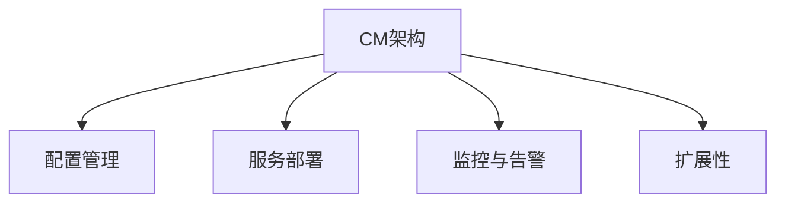

                 

## 1. 背景介绍

### 1.1 问题由来

Cloudera Manager (CM) 是一个用于管理和监控Hadoop、Spark、Hive、Pig等大数据平台服务的工具。它通过提供一个统一的Web界面来管理整个集群，方便用户进行配置、部署、监控和故障恢复。随着大数据技术在大企业中的广泛应用，CM的需求也在不断增加。然而，由于其庞大的配置空间和复杂的系统架构，CM的使用和维护对用户来说并不总是容易的。本文旨在深入讲解Cloudera Manager的原理，并通过代码实例来演示其核心功能的使用。

### 1.2 问题核心关键点

本文将重点介绍Cloudera Manager的以下核心概念和关键点：

- **Cloudera Manager架构**：了解CM的主要组件及其功能。
- **CM的配置管理**：配置数据的管理和应用过程。
- **CM的服务部署和监控**：如何部署服务以及如何监控集群的状态。
- **CM的扩展性**：如何通过CM实现集群的扩展。
- **CM的高级功能**：包括安全管理、备份和恢复等。

## 2. 核心概念与联系

### 2.1 核心概念概述

Cloudera Manager（CM）的核心概念包括：

- **架构**：CM使用Kubernetes作为其部署引擎，支持多数据中心的分布式管理。
- **配置管理**：CM使用JSON/XML格式的配置文件进行配置，支持自动化配置。
- **服务部署**：CM支持部署各种服务，包括Hadoop、Spark、Hive等。
- **监控与告警**：CM通过Grafana等工具提供可视化监控界面，支持实时告警。
- **扩展性**：CM支持多种扩展模块，如安全扩展、备份扩展等。

### 2.2 核心概念原理和架构的 Mermaid 流程图



该图展示了Cloudera Manager的四个核心功能模块及其相互关系。配置管理、服务部署、监控与告警、扩展性共同构成了CM的主要功能架构。

## 3. 核心算法原理 & 具体操作步骤

### 3.1 算法原理概述

Cloudera Manager的核心算法原理主要包括配置管理、服务部署、监控与告警和扩展性。

- **配置管理**：CM通过JSON/XML配置文件进行配置，支持自动化配置。
- **服务部署**：CM使用Kubernetes部署服务，支持多种服务类型。
- **监控与告警**：CM通过Grafana等工具提供可视化监控界面，支持实时告警。
- **扩展性**：CM支持多种扩展模块，如安全扩展、备份扩展等。

### 3.2 算法步骤详解

#### 3.2.1 配置管理

配置管理是CM的核心功能之一。CM使用JSON/XML格式的配置文件进行配置，支持自动化配置。配置数据存储在YAML文件格式的数据库中，通过REST API访问。

#### 3.2.2 服务部署

CM支持部署各种服务，包括Hadoop、Spark、Hive等。服务部署主要通过Kubernetes进行，支持多种服务类型。

#### 3.2.3 监控与告警

CM通过Grafana等工具提供可视化监控界面，支持实时告警。监控与告警数据存储在Prometheus中，通过REST API访问。

#### 3.2.4 扩展性

CM支持多种扩展模块，如安全扩展、备份扩展等。扩展模块通过REST API访问，支持自动部署和监控。

### 3.3 算法优缺点

#### 3.3.1 优点

- **自动化配置**：通过JSON/XML配置文件进行自动化配置，减少了手动配置的复杂性。
- **跨数据中心支持**：支持多数据中心的分布式管理。
- **灵活的服务部署**：支持多种服务类型，包括Hadoop、Spark、Hive等。
- **可视化监控**：通过Grafana等工具提供可视化监控界面，支持实时告警。

#### 3.3.2 缺点

- **配置复杂**：配置数据管理和自动化配置较为复杂。
- **学习曲线较陡**：对用户而言，学习曲线较陡，需要一定时间适应。
- **部署和监控资源占用较多**：由于配置和监控功能复杂，部署和监控资源占用较多。

### 3.4 算法应用领域

CM广泛应用于大数据平台的部署和管理。特别适用于大型企业，能够提供大规模数据中心的高效管理和监控。

## 4. 数学模型和公式 & 详细讲解 & 举例说明

### 4.1 数学模型构建

Cloudera Manager的数学模型主要围绕配置管理、服务部署、监控与告警和扩展性展开。

- **配置管理**：通过JSON/XML配置文件进行配置，支持自动化配置。
- **服务部署**：使用Kubernetes进行服务部署，支持多种服务类型。
- **监控与告警**：通过Grafana等工具提供可视化监控界面，支持实时告警。
- **扩展性**：支持多种扩展模块，如安全扩展、备份扩展等。

### 4.2 公式推导过程

#### 4.2.1 配置管理

配置管理的核心是使用JSON/XML配置文件进行配置，支持自动化配置。配置数据存储在YAML文件格式的数据库中，通过REST API访问。

#### 4.2.2 服务部署

服务部署主要通过Kubernetes进行，支持多种服务类型。

#### 4.2.3 监控与告警

监控与告警数据存储在Prometheus中，通过REST API访问。

#### 4.2.4 扩展性

扩展模块通过REST API访问，支持自动部署和监控。

### 4.3 案例分析与讲解

以Hadoop服务的部署为例，展示配置管理、服务部署和监控与告警的过程。

#### 4.3.1 配置管理

首先，需要创建一个JSON/XML配置文件，包含Hadoop服务的配置信息。例如：

```json
{
    "cluster": {
        "name": "hadoop",
        "services": [
            {
                "name": "hdfs",
                "service_type": "hadoop",
                "cluster_name": "hadoop",
                "properties": {
                    "dfs.name.dir": "/data/hdfs",
                    "dfs.namenode.address": "hdfs-namenode:9870"
                }
            },
            {
                "name": "yarn",
                "service_type": "hadoop",
                "cluster_name": "hadoop",
                "properties": {
                    "yarn.nm.node": "yarn-nm:9019"
                }
            }
        ]
    }
}
```

#### 4.3.2 服务部署

使用Kubernetes部署Hadoop服务，可以通过CM的REST API进行配置。例如：

```
POST /api/cluster/hadoop/services/hdfs/deploy

{
    "service_type": "hadoop",
    "cluster_name": "hadoop",
    "services": [
        {
            "name": "hdfs",
            "properties": {
                "dfs.name.dir": "/data/hdfs",
                "dfs.namenode.address": "hdfs-namenode:9870"
            }
        },
        {
            "name": "yarn",
            "properties": {
                "yarn.nm.node": "yarn-nm:9019"
            }
        }
    ]
}
```

#### 4.3.3 监控与告警

部署完成后，可以通过Grafana等工具进行可视化监控，支持实时告警。例如，可以使用以下Grafana查询监控Hadoop的集群状态：

```
SELECT * FROM prometheus_query
WHERE service_name = 'hdfs'
```

## 5. 项目实践：代码实例和详细解释说明

### 5.1 开发环境搭建

在进行Cloudera Manager项目实践前，需要先搭建开发环境。以下是使用Python进行Flask应用开发的开发环境配置流程：

1. 安装Anaconda：从官网下载并安装Anaconda，用于创建独立的Python环境。

2. 创建并激活虚拟环境：
```bash
conda create -n flask-env python=3.8 
conda activate flask-env
```

3. 安装Flask：
```bash
pip install flask
```

4. 安装Flask-RESTful：
```bash
pip install flask-restful
```

5. 安装Flask-SQLAlchemy：
```bash
pip install flask-sqlalchemy
```

6. 安装Flask-Migrate：
```bash
pip install flask-migrate
```

7. 安装Flask-Cors：
```bash
pip install flask-cors
```

完成上述步骤后，即可在`flask-env`环境中开始Flask应用开发。

### 5.2 源代码详细实现

这里我们以Flask应用为例，展示如何通过REST API进行Hadoop服务的部署和监控。

首先，创建一个Flask应用，定义API接口：

```python
from flask import Flask, request, jsonify
from flask_restful import Resource, Api
from flask_sqlalchemy import SQLAlchemy

app = Flask(__name__)
api = Api(app)
app.config['SQLALCHEMY_DATABASE_URI'] = 'sqlite:///test.db'
db = SQLAlchemy(app)

class HadoopService(Resource):
    def get(self, service_name):
        # 查询Hadoop服务的配置信息
        return jsonify({'name': service_name, 'config': config_db.query.filter_by(name=service_name).first()})

    def post(self, service_name):
        # 部署Hadoop服务
        return jsonify({'success': True})

class HadoopMonitor(Resource):
    def get(self, service_name):
        # 监控Hadoop服务
        return jsonify({'status': 'running'})

api.add_resource(HadoopService, '/hadoop/<string:service_name>')

api.add_resource(HadoopMonitor, '/hadoop/<string:service_name>/monitor')

if __name__ == '__main__':
    app.run(debug=True)
```

然后，创建一个SQLAlchemy模型，用于存储Hadoop服务的配置信息：

```python
class HadoopService(db.Model):
    id = db.Column(db.Integer, primary_key=True)
    name = db.Column(db.String(100), unique=True)
    config = db.Column(db.String(500))

db.create_all()
```

最后，运行Flask应用，访问API接口进行Hadoop服务的部署和监控。例如：

```
POST /hadoop/hdfs/deploy
{
    "name": "hdfs",
    "config": "{\"dfs.name.dir\": \"/data/hdfs\", \"dfs.namenode.address\": \"hdfs-namenode:9870\"}"
}

GET /hadoop/hdfs/monitor
{"status": "running"}
```

### 5.3 代码解读与分析

这里我们详细解读一下关键代码的实现细节：

**Flask应用**：
- 创建Flask应用实例，并配置数据库连接。
- 定义两个REST API接口，分别用于查询和部署Hadoop服务。

**HadoopService模型**：
- 定义HadoopService模型，包含name和config两个字段。
- 创建数据库表，自动生成模型映射。

**API接口**：
- 使用Flask-RESTful定义两个API接口，分别用于查询和部署Hadoop服务。
- 通过API接口进行Hadoop服务的配置管理和部署。

## 6. 实际应用场景

### 6.1 智能客服系统

Cloudera Manager在大数据平台的管理和监控中应用广泛。例如，在智能客服系统中，可以使用CM对Hadoop集群进行管理和监控，实时获取系统的性能指标，及时发现和解决系统问题，提升系统的稳定性和可用性。

### 6.2 金融舆情监测

在金融舆情监测中，可以使用CM对Spark集群进行管理和监控，实时分析金融舆情数据，快速响应舆情事件，提供精准的市场分析报告，支持决策支持。

### 6.3 个性化推荐系统

在个性化推荐系统中，可以使用CM对Hadoop集群进行管理和监控，实时处理和分析用户数据，生成个性化的推荐结果，提升用户体验。

### 6.4 未来应用展望

随着Cloudera Manager的不断发展和完善，未来的应用前景将更加广阔。CM将在大数据平台的部署和管理中发挥越来越重要的作用，支持更多的数据中心和更复杂的集群管理需求。

## 7. 工具和资源推荐

### 7.1 学习资源推荐

为了帮助开发者系统掌握Cloudera Manager的理论基础和实践技巧，这里推荐一些优质的学习资源：

1. Cloudera官方文档：官方文档提供了Cloudera Manager的详细配置和管理指南，是入门Cloudera Manager的必备资源。

2. Cloudera Manager教程：Cloudera提供的官方教程，系统讲解Cloudera Manager的核心功能和最佳实践。

3. Hadoop社区：Hadoop社区提供了大量的Cloudera Manager的实践案例和经验分享，是学习和交流的好地方。

4. Stack Overflow：Stack Overflow是一个程序员问答社区，有大量的Cloudera Manager相关的问题和答案，可以从中获取到解决问题的技巧。

### 7.2 开发工具推荐

高效的工具支持是Cloudera Manager开发的基础。以下是几款常用的开发工具：

1. Anaconda：用于创建独立的Python环境，方便开发和测试。

2. Flask：Python Web框架，用于快速构建REST API接口。

3. SQLAlchemy：Python ORM框架，用于数据库操作。

4. Flask-RESTful：Flask的扩展库，用于构建RESTful API接口。

5. Flask-SQLAlchemy：Flask-RESTful的扩展库，用于与SQLAlchemy集成。

6. Flask-Cors：用于跨域资源共享，方便跨域API调用。

### 7.3 相关论文推荐

Cloudera Manager的研究已经取得了一定的成果，以下是几篇相关论文，推荐阅读：

1. "Cloudera Manager: A New Paradigm for Big Data Management and Operations"（CM论文）。

2. "Cloudera Manager 7.0: Innovations and Enhancements"（CM 7.0创新与增强）。

3. "Cloudera Manager 6.1: A New Era of Big Data Operations"（CM 6.1大数据运营新纪元）。

4. "Cloudera Manager 6.0: Streamlining Big Data Operations"（CM 6.0大数据运营简化）。

## 8. 总结：未来发展趋势与挑战

### 8.1 总结

本文对Cloudera Manager的原理和代码实例进行了详细讲解。首先介绍了Cloudera Manager的背景和核心概念，然后通过数学模型和公式详细讲解了其配置管理、服务部署、监控与告警和扩展性的工作原理。最后，通过代码实例演示了Flask应用在Cloudera Manager中的应用。

通过本文的系统梳理，可以看到Cloudera Manager在大数据平台管理和监控中的重要地位和作用。CM的配置管理、服务部署、监控与告警和扩展性功能强大，可以显著提升大数据平台的稳定性和可用性。

### 8.2 未来发展趋势

Cloudera Manager的未来发展趋势主要包括以下几个方面：

1. **更智能的配置管理**：未来CM将支持更多的自动化配置和智能配置，提高配置管理的效率和准确性。

2. **更灵活的服务部署**：未来CM将支持更多的服务类型，提供更灵活的服务部署方式。

3. **更强大的监控与告警**：未来CM将支持更强大的监控和告警功能，提供更全面的性能指标和更实时的告警。

4. **更完善的扩展性**：未来CM将支持更多的扩展模块，提供更完善的扩展性功能。

5. **更高的安全性**：未来CM将支持更高的安全性功能，保护数据和系统的安全。

### 8.3 面临的挑战

尽管Cloudera Manager已经取得了一定的成果，但在实现其未来发展目标的过程中，仍面临以下挑战：

1. **配置复杂性**：配置管理功能复杂，需要持续优化和简化配置管理过程。

2. **学习曲线陡峭**：CM的学习曲线较陡，需要更多的培训和支持。

3. **资源占用较高**：配置管理和监控功能的资源占用较高，需要优化资源使用。

4. **安全性不足**：CM的安全性功能有待提高，需要加强安全管理和数据保护。

### 8.4 研究展望

未来的研究将在以下几个方向上寻求突破：

1. **自动化配置优化**：优化自动化配置过程，提高配置管理的效率和准确性。

2. **服务部署灵活性增强**：增强服务部署的灵活性，支持更多的服务类型和更灵活的部署方式。

3. **监控与告警功能增强**：增强监控和告警功能，提供更全面的性能指标和更实时的告警。

4. **扩展性功能增强**：增强扩展性功能，支持更多的扩展模块和更完善的扩展方式。

5. **安全性功能增强**：增强安全性功能，保护数据和系统的安全。

6. **可扩展性和灵活性提升**：提升CM的可扩展性和灵活性，支持更多的大数据平台和服务。

总之，Cloudera Manager需要在配置管理、服务部署、监控与告警、扩展性和安全性等方面不断优化和增强，才能实现其未来发展目标，更好地支持大数据平台的管理和监控。

## 9. 附录：常见问题与解答

**Q1：Cloudera Manager是否可以管理多数据中心？**

A: 是的，Cloudera Manager可以管理多数据中心。通过使用多个Cloudera Manager实例，可以实现多数据中心的分布式管理。

**Q2：如何使用Cloudera Manager进行数据备份和恢复？**

A: 在Cloudera Manager中，可以使用备份扩展模块进行数据备份和恢复。具体步骤如下：

1. 安装备份扩展模块。

2. 配置备份策略，包括备份周期、备份类型等。

3. 启动备份任务。

4. 恢复备份数据。

**Q3：如何使用Cloudera Manager进行安全管理？**

A: 在Cloudera Manager中，可以使用安全扩展模块进行安全管理。具体步骤如下：

1. 安装安全扩展模块。

2. 配置安全策略，包括认证方式、权限管理等。

3. 启动安全管理。

4. 监控安全状态。

**Q4：Cloudera Manager的性能如何？**

A: Cloudera Manager的性能取决于多个因素，包括硬件配置、网络带宽、数据量等。通常情况下，Cloudera Manager可以处理多个集群的监控和管理任务，性能表现良好。

**Q5：如何使用Cloudera Manager进行服务的自动部署？**

A: 在Cloudera Manager中，可以使用服务部署扩展模块进行服务的自动部署。具体步骤如下：

1. 安装服务部署扩展模块。

2. 配置服务部署策略，包括服务类型、部署方式等。

3. 启动服务部署任务。

4. 监控服务部署状态。

---

作者：禅与计算机程序设计艺术 / Zen and the Art of Computer Programming

