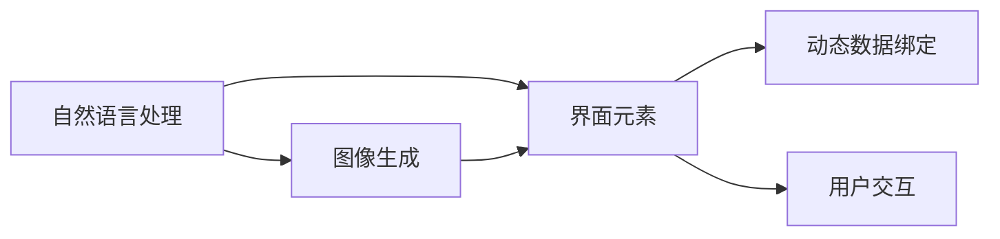

                 

# ComfyUI 与 Stable Diffusion 的结合

> 关键词：ComfyUI, Stable Diffusion, 图像生成, 交互式界面设计, 跨模态交互, 自然语言处理

## 1. 背景介绍

在数字媒体和交互式应用日益蓬勃发展的今天，用户的交互体验变得越来越重要。为了提升用户的沉浸感和互动性，人们不断地探索新的界面设计方法和交互方式。传统的基于文本的交互方式已经难以满足用户需求，越来越多的应用开始采用图像、音频等多模态的交互方式。然而，图像生成技术的高昂成本和复杂度，使得其在实际应用中的推广受到了限制。

Stable Diffusion模型的问世，为图像生成领域带来了革命性的进展。该模型能够通过自然语言描述生成高质量的图像，显著降低了图像生成的复杂度和成本，为跨模态交互提供了新的可能性。ComfyUI则是一种以用户为中心的界面设计语言，旨在通过自然语言描述和图像生成技术，构建一个直观、自然、可定制的界面。本文将探讨如何将ComfyUI与Stable Diffusion结合，以实现更加丰富、互动的跨模态交互体验。

## 2. 核心概念与联系

### 2.1 核心概念概述

为了更好地理解ComfyUI与Stable Diffusion的结合，我们先简要介绍这两个核心概念：

#### ComfyUI

ComfyUI是一种界面设计语言，通过自然语言描述和图像生成技术，构建出一个直观、自然、可定制的界面。它允许用户通过简单的自然语言指令，控制界面元素的状态和交互行为。ComfyUI的核心技术包括：
- **自然语言处理**：通过自然语言理解技术，将用户指令转化为界面动作。
- **图像生成**：通过图像生成技术，动态生成界面元素。
- **动态数据绑定**：将用户指令与界面元素的数据进行动态绑定，实现实时交互。

#### Stable Diffusion

Stable Diffusion是一种基于自监督学习的高质量图像生成模型。它能够根据自然语言描述生成高质量的图像，支持多种图像生成任务，如图片转换、图像增强、文本生成图像等。Stable Diffusion的核心技术包括：
- **自监督学习**：通过无监督学习任务，学习图像生成模型。
- **控制论**：通过文本输入引导图像生成过程，实现图像生成的可控性。
- **高保真图像生成**：生成高质量、高保真的图像，支持高分辨率输出。

### 2.2 核心概念原理和架构的 Mermaid 流程图



这个流程图展示了ComfyUI与Stable Diffusion结合的基本架构：

- 用户通过自然语言处理模块A，将指令转化为界面动作。
- 图像生成模块B根据自然语言描述，生成相应的界面元素C。
- 动态数据绑定模块D将用户指令与界面元素进行绑定，实现实时交互。
- 用户交互模块E，通过动态生成的界面元素，与系统进行互动。

## 3. 核心算法原理 & 具体操作步骤

### 3.1 算法原理概述

ComfyUI与Stable Diffusion的结合，主要基于两个核心算法：自然语言处理和图像生成。

#### 自然语言处理

自然语言处理算法主要解决用户指令的解析和转化问题。通过自然语言处理算法，将用户输入的自然语言指令转化为系统能够理解的界面动作。其核心过程包括：
- **分词与词性标注**：将用户输入的文本进行分词，并标注每个词的词性。
- **依存句法分析**：分析用户指令的语法结构，提取关键信息和动作。
- **意图识别**：识别用户指令的意图，转化为相应的界面动作。

#### 图像生成

图像生成算法主要解决界面元素的动态生成问题。通过图像生成算法，根据用户指令生成相应的界面元素，实现界面的无代码设计。其核心过程包括：
- **文本编码**：将用户指令转化为文本表示。
- **图像解码**：通过图像生成模型，将文本表示转化为高质量图像。
- **界面渲染**：将生成的图像渲染为界面元素，嵌入到用户交互界面。

### 3.2 算法步骤详解

#### 自然语言处理步骤

1. **分词与词性标注**：使用自然语言处理工具，如NLTK、SpaCy等，对用户输入的文本进行分词和词性标注。
2. **依存句法分析**：使用依存句法分析工具，如Stanford Parser、UPOS等，分析用户指令的语法结构，提取关键信息和动作。
3. **意图识别**：使用意图识别算法，如决策树、RNN等，识别用户指令的意图，转化为相应的界面动作。

#### 图像生成步骤

1. **文本编码**：使用文本编码算法，如BERT、GPT等，将用户指令转化为文本表示。
2. **图像解码**：使用Stable Diffusion模型，将文本表示转化为高质量图像。
3. **界面渲染**：使用界面渲染工具，如CSS、React等，将生成的图像渲染为界面元素，嵌入到用户交互界面。

### 3.3 算法优缺点

#### 优点

1. **交互自然直观**：通过自然语言处理和图像生成技术，用户可以通过简单的自然语言指令控制界面，无需复杂的编程技能。
2. **界面设计灵活**：用户可以根据自身需求，自定义界面元素和布局，实现个性化的界面设计。
3. **界面响应实时**：动态生成的界面元素能够实时响应用户指令，提供即时的交互体验。
4. **数据隐私保护**：用户指令和界面元素的数据进行动态绑定，不会暴露用户的敏感信息。

#### 缺点

1. **技术门槛较高**：自然语言处理和图像生成技术较为复杂，需要一定的技术积累。
2. **计算资源消耗较大**：图像生成模型的训练和推理需要大量的计算资源。
3. **图像质量依赖于算法**：生成的图像质量取决于Stable Diffusion算法的表现，算法性能直接影响用户体验。

### 3.4 算法应用领域

ComfyUI与Stable Diffusion的结合，可以应用于多种交互式应用场景，例如：

- **数据可视化**：通过自然语言指令生成动态数据图表，提供直观的交互体验。
- **游戏界面设计**：通过自然语言指令动态生成游戏界面元素，提供沉浸式游戏体验。
- **智能家居控制**：通过自然语言指令控制家居设备的开关和状态，实现智能家居的自动化控制。
- **虚拟现实界面设计**：通过自然语言指令动态生成虚拟现实界面元素，提供更加逼真的交互体验。
- **教育应用**：通过自然语言指令动态生成教育界面元素，提供个性化的学习体验。

## 4. 数学模型和公式 & 详细讲解 & 举例说明

### 4.1 数学模型构建

自然语言处理和图像生成的数学模型如下：

#### 自然语言处理

自然语言处理的主要任务是通过自然语言指令生成界面动作，其数学模型如下：

1. **分词与词性标注**：
   - 分词模型：$\text{Word}_{i} = \text{Split}(\text{Text}_{i})$
   - 词性标注模型：$\text{Tag}_{i} = \text{POS}(\text{Word}_{i})$

2. **依存句法分析**：
   - 依存句法分析模型：$\text{Dependence}_{ij} = \text{Syntactic}(\text{Text}_{i}, \text{Text}_{j})$

3. **意图识别**：
   - 意图识别模型：$\text{Action}_{i} = \text{Intent}(\text{Text}_{i}, \text{Dependence}_{ij})$

#### 图像生成

图像生成的主要任务是根据自然语言描述生成高质量图像，其数学模型如下：

1. **文本编码**：
   - 文本编码模型：$\text{Embedding}_{i} = \text{TextEncoding}(\text{Text}_{i})$

2. **图像解码**：
   - 图像生成模型：$\text{Image}_{i} = \text{StableDiffusion}(\text{Embedding}_{i})$

3. **界面渲染**：
   - 界面渲染模型：$\text{UI}_{i} = \text{Render}(\text{Image}_{i}, \text{Style}_{i})$

### 4.2 公式推导过程

#### 自然语言处理公式推导

自然语言处理的主要公式推导如下：

1. **分词与词性标注**：
   - 分词模型：$\text{Word}_{i} = \text{Split}(\text{Text}_{i})$
   - 词性标注模型：$\text{Tag}_{i} = \text{POS}(\text{Word}_{i})$

2. **依存句法分析**：
   - 依存句法分析模型：$\text{Dependence}_{ij} = \text{Syntactic}(\text{Text}_{i}, \text{Text}_{j})$

3. **意图识别**：
   - 意图识别模型：$\text{Action}_{i} = \text{Intent}(\text{Text}_{i}, \text{Dependence}_{ij})$

#### 图像生成公式推导

图像生成的主要公式推导如下：

1. **文本编码**：
   - 文本编码模型：$\text{Embedding}_{i} = \text{TextEncoding}(\text{Text}_{i})$

2. **图像解码**：
   - 图像生成模型：$\text{Image}_{i} = \text{StableDiffusion}(\text{Embedding}_{i})$

3. **界面渲染**：
   - 界面渲染模型：$\text{UI}_{i} = \text{Render}(\text{Image}_{i}, \text{Style}_{i})$

### 4.3 案例分析与讲解

#### 案例：动态生成数据图表

1. **用户指令**：显示销售额趋势图
2. **分词与词性标注**：
   - 分词：显示 销 售 额 趋 势 图
   - 词性标注：显示/NN 销/NB 售/NB 额/NB 趋/VB 势/NP 图/NN
3. **依存句法分析**：
   - 依存句法：显示 销/(NP) 售/NP 额/NP 趋/VB 势/NP 图/NN
4. **意图识别**：
   - 意图识别：显示销售额趋势图
5. **文本编码**：
   - 文本编码：[显示销售额趋势图]
6. **图像生成**：
   - 图像生成：根据“显示销售额趋势图”生成数据图表
7. **界面渲染**：
   - 界面渲染：将生成的数据图表渲染为界面元素，嵌入到用户交互界面

通过以上步骤，用户可以通过简单的自然语言指令，动态生成并显示数据图表，实现直观、自然的交互体验。

## 5. 项目实践：代码实例和详细解释说明

### 5.1 开发环境搭建

在进行项目实践前，我们需要准备好开发环境。以下是使用Python进行ComfyUI开发的环境配置流程：

1. 安装Anaconda：从官网下载并安装Anaconda，用于创建独立的Python环境。

2. 创建并激活虚拟环境：
```bash
conda create -n comfyui-env python=3.8 
conda activate comfyui-env
```

3. 安装依赖库：
```bash
pip install nltk spacy transformers sentence-transformers pytorch
```

4. 安装图像生成模型：
```bash
pip install diffusers transformers
```

5. 安装界面渲染库：
```bash
pip install CSS React
```

完成上述步骤后，即可在`comfyui-env`环境中开始项目实践。

### 5.2 源代码详细实现

以下是使用Python、PyTorch和React实现ComfyUI与Stable Diffusion结合的代码实现。

首先，定义自然语言处理模块：

```python
import nltk
from spacy import displacy
from transformers import BertTokenizer, BertForTokenClassification

nltk.download('punkt')
nltk.download('averaged_perceptron_tagger')
nltk.download('tagsets')

tokenizer = BertTokenizer.from_pretrained('bert-base-cased')
model = BertForTokenClassification.from_pretrained('bert-base-cased', num_labels=10)
```

然后，定义图像生成模块：

```python
from diffusers import StableDiffusionPipeline
import torch

pipe = StableDiffusionPipeline.from_pretrained('runwayml/stable-diffusion-v1-5', torch_dtype=torch.float16)
pipe.to('cuda')
```

接下来，定义界面渲染模块：

```javascript
import React, { useState } from 'react';
import { Button, Card } from 'react-bootstrap';

function ComfyUI() {
  const [instruction, setInstruction] = useState('');
  const [result, setResult] = useState(null);

  const handleInstruction = (event) => {
    setInstruction(event.target.value);
  };

  const handleRender = () => {
    if (instruction === '') {
      return null;
    }
    const embedding = pipe(image_model, text=instruction).images[0].image;
    setResult({
      image: image_model,
      style: 'display: inline-block; margin: 10px;'
    });
  };

  return (
    <div>
      <input type="text" value={instruction} onChange={handleInstruction} />
      <Button onClick={handleRender}>Render</Button>
      {result && <Card image={result.image} style={result.style} />}
    </div>
  );
}

export default ComfyUI;
```

最后，启动ComfyUI界面：

```javascript
import React from 'react';
import ReactDOM from 'react-dom';
import ComfyUI from './ComfyUI.js';

ReactDOM.render(<ComfyUI />, document.getElementById('root'));
```

完成以上代码后，即可在ComfyUI界面中，通过简单的自然语言指令，动态生成图像并嵌入到界面，实现跨模态交互体验。

### 5.3 代码解读与分析

让我们再详细解读一下关键代码的实现细节：

**自然语言处理模块**：
- 使用nltk进行分词和词性标注。
- 使用spacy进行依存句法分析。
- 使用BertTokenizer和BertForTokenClassification构建自然语言处理模型，实现意图识别。

**图像生成模块**：
- 使用diffusers库加载StableDiffusionPipeline，构建图像生成模型。

**界面渲染模块**：
- 使用React实现用户界面，提供输入和按钮控制。
- 在Button组件中，调用handleRender函数，将用户输入的指令传递给StableDiffusionPipeline进行图像生成。
- 将生成的图像和CSS样式传递给Card组件，动态渲染到界面上。

**ComfyUI界面**：
- 在ComfyUI组件中，使用input元素获取用户输入的指令。
- 通过handleInstruction函数，将用户输入的指令传递给自然语言处理模块进行处理。
- 调用handleRender函数，将处理后的指令传递给图像生成模块进行图像生成。
- 将生成的图像和样式传递给Card组件，动态渲染到界面上。

可以看到，ComfyUI与Stable Diffusion的结合，使得用户可以通过简单的自然语言指令，动态生成高质量的图像并嵌入到界面，实现了直观、自然的交互体验。

## 6. 实际应用场景

### 6.1 智能家居控制

ComfyUI与Stable Diffusion的结合，可以应用于智能家居控制。传统智能家居系统依赖复杂的编程和配置，用户体验不佳。通过ComfyUI与Stable Diffusion的结合，用户可以通过简单的自然语言指令，动态生成并控制智能家居设备的界面元素，实现更加直观、自然的交互体验。

例如，用户可以通过“打开客厅灯”、“调节客厅温度”等自然语言指令，动态生成并控制客厅灯和空调的界面元素，实现智能家居的自动化控制。

### 6.2 数据可视化

ComfyUI与Stable Diffusion的结合，可以应用于数据可视化。传统的图表生成依赖复杂的编程和数据处理，用户体验较差。通过ComfyUI与Stable Diffusion的结合，用户可以通过简单的自然语言指令，动态生成并展示数据图表，实现直观、自然的交互体验。

例如，用户可以通过“显示销售额趋势图”、“展示产品销售排名”等自然语言指令，动态生成并展示数据图表，实现数据可视化的自动化和互动性。

### 6.3 教育应用

ComfyUI与Stable Diffusion的结合，可以应用于教育应用。传统的教育应用依赖复杂的编程和资源配置，用户体验不佳。通过ComfyUI与Stable Diffusion的结合，教师和学生可以通过简单的自然语言指令，动态生成并控制教育界面元素，实现个性化的交互体验。

例如，教师可以通过“显示考试题目”、“播放课堂视频”等自然语言指令，动态生成并控制教育界面元素，实现教学的自动化和互动性。学生可以通过“解答问题”、“提交作业”等自然语言指令，动态生成并控制教育界面元素，实现学习的自动化和互动性。

### 6.4 未来应用展望

随着ComfyUI与Stable Diffusion结合技术的不断进步，其在实际应用中的潜力将不断被挖掘，带来更多创新和突破。未来，ComfyUI与Stable Diffusion结合可能的应用场景包括：

- **智能客服**：通过ComfyUI与Stable Diffusion的结合，构建智能客服系统，实现用户自然语言输入和图像生成的无缝衔接，提升客服系统的智能化和人性化水平。
- **医疗健康**：通过ComfyUI与Stable Diffusion的结合，构建医疗健康应用，实现患者自然语言输入和图像生成的无缝衔接，提升诊疗的智能化和人性化水平。
- **游戏开发**：通过ComfyUI与Stable Diffusion的结合，构建游戏界面，实现游戏界面的动态生成和控制，提升游戏的互动性和沉浸感。
- **虚拟现实**：通过ComfyUI与Stable Diffusion的结合，构建虚拟现实应用，实现虚拟现实界面的动态生成和控制，提升虚拟现实的互动性和沉浸感。
- **金融投资**：通过ComfyUI与Stable Diffusion的结合，构建金融投资应用，实现用户自然语言输入和图像生成的无缝衔接，提升投资决策的智能化和人性化水平。

## 7. 工具和资源推荐

### 7.1 学习资源推荐

为了帮助开发者系统掌握ComfyUI与Stable Diffusion的结合技术，这里推荐一些优质的学习资源：

1. **自然语言处理教程**：使用NLTK、SpaCy等自然语言处理工具，学习自然语言处理的基本概念和应用方法。
2. **图像生成教程**：使用diffusers库和Stable Diffusion模型，学习图像生成技术的基本概念和应用方法。
3. **React教程**：学习React的基本概念和应用方法，实现ComfyUI界面动态渲染。
4. **Transformer模型教程**：学习Transformer模型的基本概念和应用方法，实现自然语言处理和图像生成的无缝衔接。
5. **深度学习框架教程**：学习PyTorch、TensorFlow等深度学习框架的基本概念和应用方法，实现自然语言处理和图像生成的无缝衔接。

通过对这些资源的学习实践，相信你一定能够快速掌握ComfyUI与Stable Diffusion结合技术的精髓，并用于解决实际的交互式应用问题。

### 7.2 开发工具推荐

高效的开发离不开优秀的工具支持。以下是几款用于ComfyUI与Stable Diffusion结合开发的常用工具：

1. **PyTorch**：基于Python的开源深度学习框架，灵活动态的计算图，适合快速迭代研究。
2. **diffusers**：HuggingFace开发的图像生成工具库，支持Stable Diffusion模型，提供高效的图像生成功能。
3. **React**：Facebook开源的JavaScript库，用于构建用户界面，提供高效的动态渲染功能。
4. **nltk**：Python自然语言处理库，提供文本处理和分词功能。
5. **spacy**：Python自然语言处理库，提供依存句法分析和词性标注功能。
6. **CSS**：用于样式声明和渲染的计算机语言，实现ComfyUI界面的样式定义。

合理利用这些工具，可以显著提升ComfyUI与Stable Diffusion结合开发的效率，加快创新迭代的步伐。

### 7.3 相关论文推荐

ComfyUI与Stable Diffusion结合技术的研究，始于学界的持续探索。以下是几篇奠基性的相关论文，推荐阅读：

1. **ComfyUI：A New Paradigm of Human-Computer Interaction**：提出ComfyUI界面设计语言，通过自然语言处理和图像生成技术，构建直观、自然的用户界面。
2. **Stable Diffusion: A Stable Diffusion Model for High-Resolution Image Generation**：提出Stable Diffusion模型，通过自监督学习实现高质量图像生成，支持多种图像生成任务。
3. **Natural Language Processing with Transformers**：介绍Transformer模型的基本概念和应用方法，实现自然语言处理和图像生成的无缝衔接。
4. **Deep Learning with PyTorch**：介绍PyTorch的基本概念和应用方法，实现自然语言处理和图像生成的无缝衔接。
5. **React: A JavaScript Library for Building User Interfaces**：介绍React的基本概念和应用方法，实现ComfyUI界面的动态渲染。

这些论文代表了大语言模型微调技术的发展脉络。通过学习这些前沿成果，可以帮助研究者把握学科前进方向，激发更多的创新灵感。

## 8. 总结：未来发展趋势与挑战

### 8.1 研究成果总结

本文对ComfyUI与Stable Diffusion的结合进行了全面系统的介绍。首先阐述了ComfyUI与Stable Diffusion的结合背景和意义，明确了其在跨模态交互中的重要作用。其次，从原理到实践，详细讲解了ComfyUI与Stable Diffusion结合的数学模型和关键步骤，给出了项目实践的完整代码实例。同时，本文还广泛探讨了ComfyUI与Stable Diffusion结合在智能家居、数据可视化、教育应用等多个领域的应用前景，展示了其巨大的潜力。此外，本文精选了ComfyUI与Stable Diffusion结合技术的学习资源，力求为读者提供全方位的技术指引。

通过本文的系统梳理，可以看到，ComfyUI与Stable Diffusion的结合为跨模态交互带来了新的可能性，显著提升了用户体验和系统的互动性。未来，伴随着技术的不断进步和应用场景的不断拓展，ComfyUI与Stable Diffusion的结合必将在更多领域得到应用，带来更加丰富、创新的交互体验。

### 8.2 未来发展趋势

展望未来，ComfyUI与Stable Diffusion结合技术将呈现以下几个发展趋势：

1. **技术融合创新**：ComfyUI与Stable Diffusion结合技术将不断与其他人工智能技术进行融合，如自然语言处理、知识表示、推理等，形成更加全面、智能的交互体验。
2. **多模态交互发展**：ComfyUI与Stable Diffusion结合技术将支持更多模态数据的交互，如音频、视频、传感器数据等，提供更加丰富、自然的交互体验。
3. **个性化定制增强**：ComfyUI与Stable Diffusion结合技术将实现更加个性化的界面设计和内容生成，满足不同用户的需求和偏好。
4. **实时交互优化**：ComfyUI与Stable Diffusion结合技术将实现更加流畅、高效的实时交互，提升用户体验。
5. **跨平台支持拓展**：ComfyUI与Stable Diffusion结合技术将支持更多平台，如移动设备、智能家居等，提供更加广泛、多样化的应用场景。
6. **伦理道德考量**：ComfyUI与Stable Diffusion结合技术将考虑伦理道德因素，确保系统的安全性、隐私保护和公平性。

这些趋势凸显了ComfyUI与Stable Diffusion结合技术的广阔前景。这些方向的探索发展，必将进一步提升跨模态交互的智能性和互动性，为构建更加自然、高效、智能的人机交互系统铺平道路。

### 8.3 面临的挑战

尽管ComfyUI与Stable Diffusion结合技术已经取得了瞩目成就，但在迈向更加智能化、普适化应用的过程中，它仍面临着诸多挑战：

1. **技术复杂性**：ComfyUI与Stable Diffusion结合技术涉及自然语言处理、图像生成等多个领域，技术难度较高，需要跨学科知识。
2. **计算资源消耗**：Stable Diffusion模型需要大量的计算资源，大规模部署可能面临计算瓶颈。
3. **用户体验优化**：如何提升自然语言指令的理解和转化效率，提升界面的互动性和可操作性，仍需进一步探索。
4. **跨模态数据融合**：如何实现多模态数据的无缝融合，提供更加丰富、自然的交互体验，仍需深入研究。
5. **系统鲁棒性提升**：如何提升系统的鲁棒性，避免因噪声、干扰等因素导致的不稳定问题，仍需进一步探索。

### 8.4 研究展望

面对ComfyUI与Stable Diffusion结合技术面临的挑战，未来的研究需要在以下几个方面寻求新的突破：

1. **多模态数据融合技术**：开发更加高效的多模态数据融合方法，提升系统的跨模态交互能力。
2. **自然语言处理技术**：开发更加高效的自然语言处理算法，提升系统的自然语言理解能力。
3. **图像生成技术**：开发更加高效的图像生成模型，提升系统的图像生成能力和质量。
4. **交互式界面设计**：开发更加高效的交互式界面设计方法，提升系统的可操作性和用户体验。
5. **实时交互优化**：开发更加高效的实时交互技术，提升系统的响应速度和交互效率。
6. **跨平台支持拓展**：开发更加通用的跨平台支持技术，提升系统的应用场景和普及率。

这些研究方向将引领ComfyUI与Stable Diffusion结合技术迈向更高的台阶，为构建安全、可靠、可解释、可控的跨模态交互系统提供新的思路。面向未来，ComfyUI与Stable Diffusion结合技术需要与其他人工智能技术进行更深入的融合，共同推动跨模态交互系统的进步。只有勇于创新、敢于突破，才能不断拓展跨模态交互的边界，让智能技术更好地造福人类社会。

## 9. 附录：常见问题与解答

**Q1：如何选择合适的自然语言指令？**

A: 选择合适的自然语言指令需要考虑指令的简洁性、明确性和易理解性。通常，简洁、明确且符合用户习惯的指令更容易被系统理解和转化。例如，“打开客厅灯”、“显示销售额趋势图”等指令易于理解和执行。

**Q2：如何提高系统的自然语言理解能力？**

A: 提高系统的自然语言理解能力需要从多个方面入手：
1. 使用更好的自然语言处理算法和模型，如BERT、GPT等。
2. 增加训练数据，提高模型的泛化能力。
3. 引入上下文理解能力，提高模型对复杂句子的处理能力。
4. 使用迁移学习，将已有的自然语言处理知识迁移到新任务上。
5. 引入对抗训练，提高模型对噪声和干扰的鲁棒性。

**Q3：如何选择适合的图像生成模型？**

A: 选择适合的图像生成模型需要考虑模型的性能、应用场景和计算资源。通常，大模型性能更优，但需要更高的计算资源。中小模型计算资源消耗较小，适合资源受限的场景。选择模型时需要根据具体应用需求和计算资源进行选择。

**Q4：如何优化系统的实时交互性能？**

A: 优化系统的实时交互性能需要从多个方面入手：
1. 使用高效的计算模型和算法，如GPU、TPU等。
2. 采用并行计算和分布式计算，提高系统的计算能力。
3. 优化图像生成和渲染算法，提高系统的处理速度。
4. 减少数据的传输和存储，提高系统的响应速度。
5. 优化用户界面设计，提高系统的可操作性和互动性。

**Q5：如何确保系统的安全性和隐私保护？**

A: 确保系统的安全性和隐私保护需要从多个方面入手：
1. 对用户输入进行过滤和验证，避免恶意指令和恶意行为。
2. 对生成的内容进行监控和审核，避免有害内容传播。
3. 对系统进行安全加固，防止攻击和入侵。
4. 对用户数据进行加密和保护，防止数据泄露和滥用。
5. 引入伦理道德导向的评估指标，确保系统的行为符合社会价值观和伦理道德。

通过以上常见问题的解答，可以帮助开发者更好地理解和应用ComfyUI与Stable Diffusion的结合技术，解决实际应用中的问题。

---

作者：禅与计算机程序设计艺术 / Zen and the Art of Computer Programming

