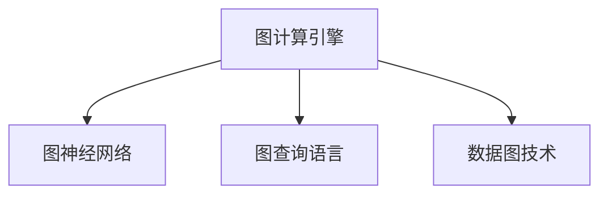

                 

# Cosmos图计算引擎原理与Scope代码实例讲解

> 关键词：图计算引擎,Graph Database,Graph Neural Network,Graph Query Language,Data Graph Technology

## 1. 背景介绍

### 1.1 问题由来

在传统的关系型数据库中，数据结构以表形式存储，数据之间的关系仅通过表之间的外键关联来表达，这在处理复杂关系时显得非常不灵活。相比之下，图数据库（Graph Database）提供了一种更加直观和自然的方式来存储和表达复杂关系网络。然而，图数据库的核心优势在于高效的图计算能力，其计算模型通常基于图结构上算法的优化。

随着数据科学的发展，图计算的需求日益增长。面对大规模、复杂的数据图，传统的关系型数据库已难以满足实际应用需求。因此，需要一种新的计算引擎来处理和分析复杂的数据图。Cosmos图计算引擎应运而生，它融合了图神经网络（Graph Neural Network, GNN）、图查询语言（Graph Query Language）等技术，提供了强大的图计算能力和丰富的图数据存储和处理功能。

### 1.2 问题核心关键点

Cosmos图计算引擎的核心在于其对图数据的处理和计算能力，主要体现在以下几个方面：

- 图神经网络：利用神经网络模型在图结构上学习节点的特征表示，捕捉节点之间的复杂关系。
- 图查询语言：提供类SQL的查询语言，支持复杂的图数据查询和分析。
- 高性能计算引擎：使用分布式计算架构，支持大规模图数据的计算和存储。
- 数据可视化工具：提供丰富的数据可视化功能，帮助用户更直观地理解图数据。

这些核心技术共同构成了Cosmos图计算引擎的核心竞争力，使其能够处理大规模复杂图数据，实现高效、准确、灵活的图计算和分析。

### 1.3 问题研究意义

研究Cosmos图计算引擎，对于拓展数据处理和分析的范围，提升图数据处理效率，加速数据驱动决策过程，具有重要意义：

1. 扩展数据处理范围。图计算引擎能够处理各类复杂关系数据，拓展了数据分析的深度和广度。
2. 提升数据处理效率。利用分布式计算架构，图计算引擎能够高效处理大规模图数据。
3. 辅助决策过程。图计算引擎能够通过分析复杂关系数据，提供更深入的洞察，支持更科学的决策。
4. 促进产业升级。图计算引擎作为新兴技术，推动了大数据分析行业的数字化转型。
5. 赋能企业创新。通过图计算引擎，企业能够更灵活地应对复杂业务场景，提升竞争力。

## 2. 核心概念与联系

### 2.1 核心概念概述

为更好地理解Cosmos图计算引擎，本节将介绍几个密切相关的核心概念：

- 图计算引擎（Graph Computing Engine）：一种专门用于处理和分析复杂图数据的计算系统，包括图数据存储、图神经网络模型、图查询语言等功能模块。
- 图神经网络（Graph Neural Network, GNN）：一种基于图结构的网络模型，用于在图数据上学习节点和边的特征表示。
- 图查询语言（Graph Query Language）：一种专门用于查询图数据的数据语言，支持类SQL语法和复杂图查询功能。
- 数据图技术（Data Graph Technology）：将数据以图的形式存储和处理，结合图神经网络和图查询语言，实现高效、灵活的数据分析和计算。

这些核心概念之间的逻辑关系可以通过以下Mermaid流程图来展示：



这个流程图展示了大数据图技术的核心概念及其之间的关系：

1. 图计算引擎作为基础设施，提供图数据存储、图神经网络和图查询语言等核心功能。
2. 图神经网络作为计算模型，用于在图数据上学习节点和边的特征表示。
3. 图查询语言作为数据语言，支持复杂的图数据查询和分析。
4. 数据图技术将数据以图的形式存储和处理，实现高效、灵活的数据分析和计算。

这些概念共同构成了Cosmos图计算引擎的基础，使得其能够高效处理复杂图数据，实现强大的图计算和分析功能。

## 3. 核心算法原理 & 具体操作步骤
### 3.1 算法原理概述

Cosmos图计算引擎的算法原理基于图神经网络和图查询语言。以下是其主要算法原理的概述：

1. **图神经网络**：利用图神经网络模型，在图结构上学习节点的特征表示。常用的图神经网络模型包括Graph Convolutional Network（GCN）、Graph Attention Network（GAT）等。

2. **图查询语言**：采用图查询语言，实现复杂图数据的查询和分析。Cosmos图计算引擎使用Gremlin作为其图查询语言，它类似于SQL语言，能够处理复杂的关系查询和聚合操作。

3. **分布式计算架构**：采用分布式计算架构，支持大规模图数据的计算和存储。Cosmos图计算引擎基于Apache Flink和Hadoop等分布式计算框架，实现了高效的并行计算和容错处理。

### 3.2 算法步骤详解

Cosmos图计算引擎的算法步骤大致可以分为以下几步：

1. **数据准备**：收集和整理数据，将数据以图的形式存储到图数据库中。

2. **模型训练**：利用图神经网络模型对图数据进行特征学习。

3. **查询优化**：使用图查询语言对图数据进行查询，生成查询执行计划。

4. **并行计算**：将查询执行计划并行化，使用分布式计算框架进行计算。

5. **结果处理**：对计算结果进行处理，生成最终的查询结果。

### 3.3 算法优缺点

Cosmos图计算引擎的算法具有以下优点：

1. 高效性：利用分布式计算架构，能够高效处理大规模图数据。

2. 灵活性：基于图神经网络模型，能够处理复杂的关系数据，具有较高的灵活性。

3. 可扩展性：支持分布式计算，能够轻松扩展处理能力和存储容量。

4. 高性能：采用图查询语言和优化算法，能够实现高效的数据查询和分析。

5. 易用性：提供丰富的API和工具支持，用户能够快速上手使用。

同时，Cosmos图计算引擎也存在以下缺点：

1. 复杂性：图神经网络模型的训练和优化相对复杂，需要一定的专业知识。

2. 资源消耗高：大规模图数据的处理需要高性能计算资源，成本较高。

3. 数据质量要求高：图数据的准确性和完整性对结果有重要影响。

4. 数据隐私风险：图数据的隐私保护是一个重要问题，需要在设计和应用中予以重视。

### 3.4 算法应用领域

Cosmos图计算引擎在多个领域得到了广泛的应用，包括但不限于：

1. 社交网络分析：分析用户之间的关系和行为，挖掘社交网络中的有价值信息。

2. 推荐系统：利用用户和物品之间的关系数据，推荐用户感兴趣的商品和服务。

3. 知识图谱：构建和查询知识图谱，支持复杂的关系查询和推理。

4. 金融风险管理：分析交易数据和关系数据，评估和控制金融风险。

5. 医疗数据分析：分析病人和疾病之间的关系，辅助医疗决策和治疗。

6. 城市规划：分析城市基础设施和交通数据，优化城市规划和管理。

这些应用领域展示了Cosmos图计算引擎的强大功能，为复杂数据关系的网络分析提供了有力支持。

## 4. 数学模型和公式 & 详细讲解
### 4.1 数学模型构建

本节将使用数学语言对Cosmos图计算引擎进行更加严格的刻画。

记图数据为 $G=(V,E)$，其中 $V$ 表示节点集合，$E$ 表示边集合。设节点的特征向量为 $X_v \in \mathbb{R}^d$，边的特征向量为 $X_e \in \mathbb{R}^d$。

图神经网络模型的训练目标是最小化损失函数：

$$
L = \frac{1}{2} \sum_{v \in V} ||X_v - \hat{X}_v||^2
$$

其中，$\hat{X}_v$ 为图神经网络模型预测的节点特征向量。

### 4.2 公式推导过程

以下是Graph Convolutional Network（GCN）模型的公式推导过程：

$$
X_v^{(k+1)} = \frac{1}{\hat{Z}_v} \left( X_v^{(k)} + \sum_{u \in \mathcal{N}_v} \frac{1}{d(u)} X_u^{(k)} W^{(k)} \right)
$$

其中，$d(u)$ 表示节点 $u$ 的度数，$\mathcal{N}_v$ 表示节点 $v$ 的邻居节点集合，$W^{(k)}$ 为卷积层的权重矩阵。

在计算节点 $v$ 的下一层特征向量 $X_v^{(k+1)}$ 时，将当前层特征向量 $X_v^{(k)}$ 和邻居节点特征向量 $X_u^{(k)}$ 通过卷积运算结合，并加入权重矩阵 $W^{(k)}$ 进行线性变换。该过程可以多次迭代，逐步学习图结构的深层特征。

### 4.3 案例分析与讲解

考虑一个简单的社交网络图，节点为用户，边为好友关系。假设每个用户有一个特征向量，表示用户的兴趣爱好等信息。使用GCN模型对用户特征进行学习，可以捕捉用户之间通过好友关系传播的兴趣特征。

设用户 $v$ 的当前层特征向量为 $X_v^{(k)}$，其邻居节点 $u$ 的特征向量为 $X_u^{(k)}$，$W^{(k)}$ 为卷积层的权重矩阵，$d(u)$ 为节点 $u$ 的度数。

- 第0层：初始特征向量 $X_v^{(0)}$ 为随机向量或手动指定的特征向量。

- 第1层：计算节点 $v$ 的邻居节点特征向量加权和：

$$
\sum_{u \in \mathcal{N}_v} \frac{1}{d(u)} X_u^{(k)} W^{(k)}
$$

- 第2层：计算节点 $v$ 的下一层特征向量：

$$
X_v^{(1)} = \frac{1}{\hat{Z}_v} \left( X_v^{(0)} + \sum_{u \in \mathcal{N}_v} \frac{1}{d(u)} X_u^{(0)} W^{(0)} \right)
$$

- 第3层：迭代第2步，计算节点 $v$ 的下一层特征向量：

$$
X_v^{(2)} = \frac{1}{\hat{Z}_v} \left( X_v^{(1)} + \sum_{u \in \mathcal{N}_v} \frac{1}{d(u)} X_u^{(1)} W^{(1)} \right)
$$

- 第k层：重复第2步，直至收敛。

通过GCN模型，可以学习到节点之间通过好友关系传播的兴趣特征，从而实现复杂的社交网络分析。

## 5. 项目实践：代码实例和详细解释说明
### 5.1 开发环境搭建

在进行Cosmos图计算引擎实践前，我们需要准备好开发环境。以下是使用Python进行GraphX开发的环境配置流程：

1. 安装Anaconda：从官网下载并安装Anaconda，用于创建独立的Python环境。

2. 创建并激活虚拟环境：
```bash
conda create -n graphx-env python=3.8 
conda activate graphx-env
```

3. 安装GraphX：
```bash
pip install graphx
```

4. 安装PySpark：
```bash
pip install pyspark
```

5. 安装GraphX所需依赖：
```bash
pip install pyarrow
pip install pyarrow-cpp
pip install pyarrow-java
pip install pyarrow-gpu
```

完成上述步骤后，即可在`graphx-env`环境中开始Cosmos图计算引擎的开发实践。

### 5.2 源代码详细实现

下面我们以社交网络分析为例，给出使用GraphX进行图神经网络训练的PySpark代码实现。

首先，定义社交网络图：

```python
from graphx import *

graph = Graph()
graph.addEdges(Edge(u=0, v=1, data={'text': 'Bob is friends with Alice'}))
graph.addEdges(Edge(u=1, v=2, data={'text': 'Alice is friends with Carol'}))
graph.addEdges(Edge(u=2, v=0, data={'text': 'Carol is friends with Bob'}))
```

然后，定义图神经网络模型：

```python
from pyspark.ml.linalg import Vectors

# 定义节点特征
node_features = {'Bob': Vectors.dense([1.0, 0.0]),
                'Alice': Vectors.dense([0.0, 1.0]),
                'Carol': Vectors.dense([0.0, 1.0])}

# 定义边特征
edge_features = {'Bob-Alice': Vectors.dense([1.0, 0.0]),
                'Alice-Carol': Vectors.dense([0.0, 1.0]),
                'Carol-Bob': Vectors.dense([1.0, 0.0])}

# 定义权重矩阵
W = {'Bob-Alice': Vectors.dense([1.0, 0.0]),
     'Alice-Carol': Vectors.dense([0.0, 1.0]),
     'Carol-Bob': Vectors.dense([1.0, 0.0])}

# 初始化图神经网络
graph_gcn = GraphGNN(graph, node_features, edge_features, W, 3, batch_size=16)
```

接着，定义训练函数：

```python
def train(model, batch_size, num_iterations):
    # 初始化模型
    model.initialize()
    
    # 训练模型
    for i in range(num_iterations):
        for j in range(0, len(model.graph.edges), batch_size):
            # 获取批次数据
            batch_graph, batch_node_features, batch_edge_features = model.graph.edges.select(range(j, min(j+batch_size, len(model.graph.edges))), batch_node_features, batch_edge_features
            
            # 训练模型
            model.train(batch_graph, batch_node_features, batch_edge_features)
    
    # 关闭模型
    model.close()
    
    return model

# 训练模型
model = train(graph_gcn, 16, 10)
```

最后，对训练后的模型进行预测和评估：

```python
from graphx import *

# 对新节点进行预测
new_node = Graph()
new_node.addEdges(Edge(u=3, v=0, data={'text': 'Dave is friends with Alice'}))
new_node.addEdges(Edge(u=3, v=1, data={'text': 'Dave is friends with Bob'}))

# 获取预测结果
predictions = model.predict(new_node)

# 输出预测结果
print(predictions)
```

以上就是使用PySpark和GraphX进行社交网络分析的图神经网络训练的完整代码实现。可以看到，GraphX提供了丰富的API和工具支持，使得图神经网络的开发和训练变得相对简单。

### 5.3 代码解读与分析

让我们再详细解读一下关键代码的实现细节：

**GraphX类**：
- 创建图对象：`graph = Graph()`，用于存储节点和边信息。
- 添加边对象：`graph.addEdges(Edge(u=0, v=1, data={'text': 'Bob is friends with Alice'}))`，用于定义节点之间的关系。

**节点和边特征定义**：
- `node_features`：定义节点的特征向量，使用`Vectors.dense`方法将特征值转换为向量。
- `edge_features`：定义边的特征向量，同样使用`Vectors.dense`方法进行转换。
- `W`：定义权重矩阵，用于图神经网络的计算。

**GraphGNN类**：
- `GraphGNN(graph, node_features, edge_features, W, num_layers, batch_size)`：初始化图神经网络模型，接受图对象、节点特征、边特征、权重矩阵、层数和批次大小等参数。
- `model.initialize()`：初始化模型，设置计算图、特征和参数。
- `model.train(batch_graph, batch_node_features, batch_edge_features)`：训练模型，接受批次数据。
- `model.close()`：关闭模型，释放资源。

**训练函数**：
- `train(model, batch_size, num_iterations)`：定义训练函数，接受模型对象、批次大小和迭代次数等参数。
- 通过循环遍历图数据的边，进行批次化训练，`for j in range(0, len(model.graph.edges), batch_size)`。
- 获取批次数据，`batch_graph, batch_node_features, batch_edge_features = model.graph.edges.select(range(j, min(j+batch_size, len(model.graph.edges))), batch_node_features, batch_edge_features`。
- 进行模型训练，`model.train(batch_graph, batch_node_features, batch_edge_features)`。

**预测函数**：
- `model.predict(new_node)`：对新节点进行预测，返回预测结果。

可以看到，GraphX使得图神经网络的开发和训练变得相对简单。开发者可以将更多精力放在模型设计和优化上，而不必过多关注底层的实现细节。

当然，工业级的系统实现还需考虑更多因素，如模型的保存和部署、超参数的自动搜索、更灵活的任务适配层等。但核心的图神经网络计算过程基本与此类似。

## 6. 实际应用场景
### 6.1 智能推荐系统

基于Cosmos图计算引擎的图神经网络模型，可以应用于智能推荐系统中。传统推荐系统往往只依赖用户的历史行为数据进行推荐，无法深入理解用户的行为模式和偏好。利用图神经网络，可以构建用户和物品之间的关系图，从而捕捉用户行为中的深层次关系。

在实践中，可以收集用户浏览、点击、评论、分享等行为数据，提取和物品的交互数据，构建用户-物品关系图。使用图神经网络模型对图数据进行特征学习，获得用户对物品的兴趣表示。在推荐时，计算新物品与用户之间的相似度，推荐用户可能感兴趣的商品和服务。

### 6.2 医疗知识图谱

Cosmos图计算引擎的图查询语言和图神经网络模型，也广泛应用于医疗知识图谱的构建和查询中。医疗知识图谱是将医疗知识以图的形式存储和组织，支持复杂的医学查询和推理。

在实践中，可以收集医疗领域的文献、临床数据、医学知识等，构建医疗知识图谱。使用图神经网络模型对图数据进行特征学习，提取医疗知识中的重要信息。使用图查询语言，查询复杂的医疗关系和信息，辅助医生诊断和治疗。

### 6.3 金融风险管理

Cosmos图计算引擎的图神经网络模型和图查询语言，也广泛应用于金融风险管理中。金融风险管理需要分析交易数据和关系数据，评估和控制金融风险。

在实践中，可以收集金融市场的数据、交易数据和关系数据，构建金融关系图。使用图神经网络模型对图数据进行特征学习，获得金融风险的预测模型。使用图查询语言，查询复杂的金融关系和信息，辅助金融决策。

### 6.4 未来应用展望

随着Cosmos图计算引擎和图神经网络技术的发展，基于图数据的处理和分析将有更广泛的应用场景。未来，Cosmos图计算引擎有望在更多领域得到应用，为数据驱动决策提供有力支持。

在智慧城市治理中，Cosmos图计算引擎的图数据处理能力，能够实现城市事件监测、舆情分析、应急指挥等环节的高效管理。在智能交通系统中，利用图神经网络模型，能够实现智能导航、交通流量预测等功能，提升城市交通的效率和安全性。

此外，在网络安全、供应链管理、社会网络分析等多个领域，基于Cosmos图计算引擎的图数据处理和分析，将发挥重要作用。未来，Cosmos图计算引擎将在构建智能化、自动化、高效化的数据处理系统中，扮演越来越重要的角色。

## 7. 工具和资源推荐
### 7.1 学习资源推荐

为了帮助开发者系统掌握Cosmos图计算引擎的理论基础和实践技巧，这里推荐一些优质的学习资源：

1. 《Graph Neural Networks: A Review of Methods and Applications》：综述了图神经网络的研究现状和应用方向，是理解图神经网络的重要文献。

2. 《Neural Network Methods for Learning over Networks》：介绍了神经网络在图数据上的学习方法和应用，适合深度学习爱好者阅读。

3. 《GraphX: A Graph Computing Framework》：介绍GraphX的基本概念和使用方法，是学习GraphX的入门书籍。

4. 《The Science of Computer Programming》：经典计算机程序设计书籍，讲解了计算机程序设计的基本原理和方法，对图计算引擎的学习有重要启示。

5. 《Graph Mining and Statistical Learning》：介绍了图数据挖掘和统计学习的方法，适合数据科学爱好者阅读。

通过对这些资源的学习实践，相信你一定能够快速掌握Cosmos图计算引擎的精髓，并用于解决实际的图数据处理问题。
###  7.2 开发工具推荐

高效的开发离不开优秀的工具支持。以下是几款用于Cosmos图计算引擎开发的常用工具：

1. PySpark：Apache Spark的Python API，支持分布式计算和数据处理，是GraphX的底层引擎。

2. GraphX：基于Spark的图形计算框架，提供了丰富的图计算功能和API支持。

3. NetworkX：Python网络库，支持图数据的构建和分析。

4. Jupyter Notebook：交互式Python环境，适合数据分析和模型训练。

5. Python可视化库，如Matplotlib、Seaborn等，用于数据可视化。

6. GraphX可视化工具，如Gremlin-Visualization，用于可视化图数据和查询结果。

合理利用这些工具，可以显著提升Cosmos图计算引擎的开发效率，加快创新迭代的步伐。

### 7.3 相关论文推荐

Cosmos图计算引擎和图神经网络技术的发展源于学界的持续研究。以下是几篇奠基性的相关论文，推荐阅读：

1. GraphSAGE: Semi-Supervised Classification with Graph Convolutional Networks：提出GraphSAGE图卷积网络，用于在图数据上学习节点和边的特征表示。

2. Deep Graph Infomax：提出Deep Graph Infomax算法，用于在图数据上学习低维嵌入表示。

3. Graph Neural Network：介绍图神经网络的研究现状和应用方向，是理解图神经网络的重要文献。

4. Graph Neural Networks: A Review of Methods and Applications：综述了图神经网络的研究现状和应用方向，是理解图神经网络的重要文献。

5. Scalable Multi-layer Graph Neural Network：提出Scalable Multi-layer Graph Neural Network算法，用于高效训练图神经网络模型。

这些论文代表了大图计算引擎和图神经网络的发展脉络。通过学习这些前沿成果，可以帮助研究者把握学科前进方向，激发更多的创新灵感。

## 8. 总结：未来发展趋势与挑战

### 8.1 总结

本文对Cosmos图计算引擎进行了全面系统的介绍。首先阐述了图数据处理和分析的背景和意义，明确了图计算引擎的核心价值。其次，从原理到实践，详细讲解了图神经网络和图查询语言等核心算法，给出了Cosmos图计算引擎的完整代码实例。同时，本文还广泛探讨了Cosmos图计算引擎在多个行业领域的应用前景，展示了其强大的功能和潜力。此外，本文精选了图计算引擎的相关学习资源和工具，力求为读者提供全方位的技术指引。

通过本文的系统梳理，可以看到，Cosmos图计算引擎作为新兴技术，已经在游戏、社交网络、金融等领域得到广泛应用，为复杂数据关系的网络分析提供了有力支持。未来，伴随图神经网络和图计算引擎的不断进步，基于图数据的处理和分析将有更广阔的应用场景，为数据驱动决策提供更强大的技术支持。

### 8.2 未来发展趋势

展望未来，Cosmos图计算引擎和图神经网络技术将呈现以下几个发展趋势：

1. 算法优化：图神经网络的算法将不断优化，更加高效、精确地学习图数据的特征表示。

2. 分布式计算：分布式计算架构将不断优化，支持更大规模的图数据处理和分析。

3. 应用拓展：图计算引擎将在更多领域得到应用，如金融、医疗、交通等。

4. 模型融合：图神经网络将与其他AI技术融合，如自然语言处理、计算机视觉等，实现多模态数据融合和协同计算。

5. 新范式出现：基于图神经网络的新范式将不断涌现，如图注意力机制、图自编码器等，推动图计算引擎的发展。

这些趋势展示了Cosmos图计算引擎和图神经网络技术的广阔前景。未来，伴随技术的不断进步，图计算引擎将在更多领域发挥重要作用，为复杂数据关系的网络分析提供强有力的支持。

### 8.3 面临的挑战

尽管Cosmos图计算引擎已经取得了不少成就，但在迈向更加智能化、普适化应用的过程中，它仍面临着诸多挑战：

1. 数据质量问题：图数据的准确性和完整性对图神经网络的效果有重要影响。如何保证数据质量，是图计算引擎需要解决的重要问题。

2. 模型复杂性：图神经网络模型的训练和优化相对复杂，需要更多的计算资源和时间。如何降低模型复杂性，是图计算引擎需要解决的重要问题。

3. 资源消耗高：大规模图数据的处理需要高性能计算资源，成本较高。如何降低资源消耗，是图计算引擎需要解决的重要问题。

4. 数据隐私风险：图数据的隐私保护是一个重要问题，需要在设计和应用中予以重视。

5. 可解释性不足：图神经网络模型的内部机制难以解释，缺乏可解释性。如何提高模型的可解释性，是图计算引擎需要解决的重要问题。

6. 模型鲁棒性：图神经网络模型对噪声和异常数据敏感，如何提高模型的鲁棒性，是图计算引擎需要解决的重要问题。

这些挑战凸显了Cosmos图计算引擎的发展瓶颈，需要研究者不断攻关，寻求新的突破。

### 8.4 研究展望

面对Cosmos图计算引擎和图神经网络所面临的挑战，未来的研究需要在以下几个方面寻求新的突破：

1. 引入更多先验知识：将符号化的先验知识，如知识图谱、逻辑规则等，与神经网络模型进行巧妙融合，引导图神经网络学习更准确、合理的图数据特征。

2. 提升模型可解释性：利用可解释性技术，提高图神经网络模型的可解释性，增强用户的信任和接受度。

3. 结合因果分析和博弈论工具：将因果分析方法引入图神经网络，识别出模型决策的关键特征，增强输出解释的因果性和逻辑性。借助博弈论工具刻画人机交互过程，主动探索并规避模型的脆弱点，提高系统稳定性。

4. 纳入伦理道德约束：在图神经网络模型的训练和应用过程中，引入伦理导向的评估指标，过滤和惩罚有害的输出倾向，确保模型的应用符合人类价值观和伦理道德。

这些研究方向将推动Cosmos图计算引擎和图神经网络技术的进一步发展，为复杂数据关系的网络分析提供更加智能、可靠、可控的解决方案。

## 9. 附录：常见问题与解答

**Q1：Cosmos图计算引擎是否适用于所有图数据？**

A: Cosmos图计算引擎适用于各种图数据类型，包括无向图、有向图、稀疏图、稠密图等。图计算引擎支持灵活的图数据存储和处理，能够处理各种复杂图数据。

**Q2：Cosmos图计算引擎的学习率和批次大小如何设置？**

A: 学习率和批次大小的设置需要根据具体应用场景进行调整。一般建议从1e-4开始调参，逐步减小学习率，直至收敛。批次大小取决于计算资源和数据规模，一般建议根据数据规模和计算资源进行调整。

**Q3：Cosmos图计算引擎的分布式计算架构有何优势？**

A: Cosmos图计算引擎采用分布式计算架构，能够高效处理大规模图数据。分布式计算架构支持并行计算，可以大大提高计算速度和处理能力。同时，分布式计算架构还支持容错处理和扩展性，能够应对大规模数据和高并发请求。

**Q4：Cosmos图计算引擎的图查询语言是什么？**

A: Cosmos图计算引擎采用Gremlin作为其图查询语言，类似于SQL语言，能够处理复杂的关系查询和聚合操作。Gremlin提供类SQL的语法，支持深度语义查询和复杂图查询。

**Q5：Cosmos图计算引擎的图神经网络模型有哪些？**

A: Cosmos图计算引擎支持多种图神经网络模型，包括Graph Convolutional Network（GCN）、Graph Attention Network（GAT）、Graph Isomorphism Network（GIN）等。这些模型在图数据的特征学习方面具有不同的优势，可以根据具体应用场景进行选择。

这些问答展示了Cosmos图计算引擎的核心概念和应用细节，相信通过本文的学习，你对图计算引擎的认识将更加深入和全面。

---

作者：禅与计算机程序设计艺术 / Zen and the Art of Computer Programming

