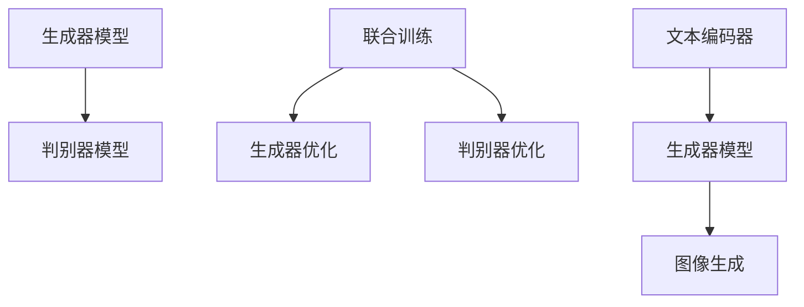

                 

# DALL-E 2原理与代码实例讲解

## 1. 背景介绍

### 1.1 问题由来

近年来，随着深度学习技术的迅猛发展，生成对抗网络（GAN）在图像生成领域取得了显著进展。DALL-E 2，作为OpenAI开发的第三代文本到图像生成模型，是GAN在文本到图像生成任务上的最新突破。DALL-E 2通过预训练生成器（Generator）和判别器（Discriminator）模型，能够根据自然语言描述生成高质量的图像，极大地扩展了文本到图像生成任务的应用范围。

### 1.2 问题核心关键点

DALL-E 2模型基于文本描述生成图像的核心原理，可以分为以下几个方面：

1. **预训练模型**：使用大规模的无标签数据进行自监督预训练，使得生成器模型能够学习到图像的语义和风格表示。
2. **文本编码器**：将文本描述转化为高维语义向量，输入到生成器模型中进行图像生成。
3. **生成器模型**：通过编码器-解码器结构，将文本语义向量转换为图像像素，生成符合描述的图像。
4. **判别器模型**：用于判别生成的图像是否符合文本描述的真实图像，用于训练生成器模型。
5. **联合训练**：通过生成器和判别器的联合训练，不断提升生成器的图像生成能力。

### 1.3 问题研究意义

研究DALL-E 2模型，不仅对于推动生成对抗网络技术的发展具有重要意义，还能够为文本到图像生成、图像生成、自然语言处理等多个领域提供强大的技术支持。通过理解DALL-E 2的原理和实现细节，我们可以更好地利用这一技术解决实际问题，提升图像生成的效率和质量，推动人工智能技术的广泛应用。

## 2. 核心概念与联系

### 2.1 核心概念概述

为了更好地理解DALL-E 2模型的原理，我们首先介绍几个关键概念：

1. **生成对抗网络（GAN）**：一种通过对抗训练训练生成器（Generator）和判别器（Discriminator）模型，从而生成高质量样本的深度学习框架。
2. **文本到图像生成**：将自然语言描述转换为图像的技术，广泛应用于图像生成、创意设计、虚拟现实等领域。
3. **生成器模型**：GAN中的生成器模型，负责从噪声向量中生成高质量的图像样本。
4. **判别器模型**：GAN中的判别器模型，用于判断生成的图像是否真实，从而指导生成器的训练。
5. **损失函数**：用于衡量生成器生成的图像与真实图像之间的差异，以及判别器判断图像真伪的准确性。
6. **联合训练**：通过生成器和判别器的联合训练，不断提升生成器的生成能力。

这些概念之间的逻辑关系可以通过以下Mermaid流程图来展示：



这个流程图展示了大语言模型的工作原理和优化过程：

1. 生成器和判别器模型通过联合训练不断优化，生成器学习生成符合描述的图像。
2. 文本编码器将自然语言描述转化为高维语义向量，作为生成器的输入。
3. 生成的图像经过判别器验证，判别器通过不断优化判断图像真伪的准确性，指导生成器的训练。

## 3. 核心算法原理 & 具体操作步骤

### 3.1 算法原理概述

DALL-E 2模型的核心原理是通过生成对抗网络（GAN）框架，联合训练生成器和判别器模型，实现文本到图像的生成。其工作流程大致分为以下几个步骤：

1. **数据准备**：收集大规模无标签图像数据集和文本描述数据集。
2. **预训练生成器**：使用自监督学习任务（如图像生成、图像补全等）对生成器模型进行预训练。
3. **预训练判别器**：使用自监督学习任务（如图像分类、图像生成判断等）对判别器模型进行预训练。
4. **联合训练**：将生成器和判别器联合训练，通过对抗训练不断提升生成器的生成能力。
5. **文本编码器训练**：将文本描述数据集输入生成器模型进行图像生成，通过监督学习任务训练文本编码器。
6. **联合训练优化**：使用联合训练的方式，不断优化生成器和判别器模型，提升文本到图像生成的质量。

### 3.2 算法步骤详解

以下是DALL-E 2模型训练的详细步骤：

1. **数据准备**：
   - 收集大规模无标签图像数据集和文本描述数据集。
   - 对图像数据集进行预处理，如缩放、归一化等。
   - 对文本描述数据集进行分词和编码处理，准备输入到生成器模型中。

2. **生成器模型预训练**：
   - 使用自监督学习任务（如图像生成、图像补全等）对生成器模型进行预训练。
   - 将生成器模型作为生成网络，通过随机噪声输入生成图像样本。
   - 使用判别器模型对这些图像样本进行判别，判断其真实性。
   - 根据判别器的判断结果，反向传播更新生成器模型的权重。

3. **判别器模型预训练**：
   - 使用自监督学习任务（如图像分类、图像生成判断等）对判别器模型进行预训练。
   - 将生成器模型生成的图像样本输入判别器模型，判断其真实性。
   - 根据判别器的判断结果，反向传播更新判别器模型的权重。

4. **联合训练**：
   - 将生成器和判别器模型联合训练，通过对抗训练不断提升生成器的生成能力。
   - 随机噪声输入生成器模型，生成图像样本。
   - 将生成的图像样本输入判别器模型，判断其真实性。
   - 根据判别器的判断结果，反向传播更新生成器模型的权重。
   - 根据生成器模型的生成结果，反向传播更新判别器模型的权重。

5. **文本编码器训练**：
   - 将文本描述数据集输入生成器模型进行图像生成。
   - 使用监督学习任务（如文本到图像生成、图像分类等）训练文本编码器。
   - 将文本描述转换为高维语义向量，输入到生成器模型中进行图像生成。
   - 通过判别器模型判断生成的图像是否符合文本描述，更新文本编码器权重。

6. **联合训练优化**：
   - 使用联合训练的方式，不断优化生成器和判别器模型，提升文本到图像生成的质量。
   - 将文本编码器生成的语义向量输入生成器模型，生成图像样本。
   - 将生成的图像样本输入判别器模型，判断其真实性。
   - 根据判别器的判断结果，反向传播更新生成器模型和判别器模型的权重。
   - 根据生成器模型的生成结果，反向传播更新文本编码器权重。

### 3.3 算法优缺点

DALL-E 2模型的优缺点如下：

**优点**：

1. **高质量图像生成**：DALL-E 2模型通过联合训练生成器和判别器模型，生成高质量的图像样本，符合自然语言描述。
2. **灵活性高**：DALL-E 2模型可以根据不同的文本描述，生成多种风格的图像。
3. **可扩展性强**：DALL-E 2模型可以通过增加数据集规模和优化训练算法，不断提升生成质量。

**缺点**：

1. **训练难度大**：DALL-E 2模型训练需要大量的计算资源和时间，且训练过程中容易过拟合。
2. **生成器模型鲁棒性差**：DALL-E 2模型中的生成器模型对输入噪声敏感，生成图像的质量受噪声影响较大。
3. **判别器模型难以训练**：DALL-E 2模型中的判别器模型难以通过监督学习进行训练，需要结合生成器模型进行联合训练。

### 3.4 算法应用领域

DALL-E 2模型在文本到图像生成领域有广泛的应用，主要包括以下几个方面：

1. **图像生成**：根据自然语言描述生成高质量的图像，应用于创意设计、艺术创作等领域。
2. **虚拟现实**：生成虚拟场景和角色，用于虚拟现实游戏、教育、培训等领域。
3. **医学影像**：生成医学影像，辅助医生进行疾病诊断和治疗。
4. **广告设计**：生成广告图像，应用于品牌宣传、市场营销等领域。
5. **自动驾驶**：生成虚拟环境和场景，用于自动驾驶车辆的仿真训练。

## 4. 数学模型和公式 & 详细讲解 & 举例说明

### 4.1 数学模型构建

DALL-E 2模型的数学模型可以表示为：

$$
G(\mathbf{z}) = \mu + \sigma \mathbf{z}
$$

其中，$G(\mathbf{z})$ 表示生成器模型，$\mathbf{z}$ 表示随机噪声向量，$\mu$ 和 $\sigma$ 为生成器模型参数。

判别器模型的数学模型可以表示为：

$$
D(\mathbf{x}) = \mathbf{W}^T \mathbf{x} + b
$$

其中，$D(\mathbf{x})$ 表示判别器模型，$\mathbf{x}$ 表示图像样本，$\mathbf{W}$ 和 $b$ 为判别器模型参数。

### 4.2 公式推导过程

以DALL-E 2模型为例，推导其训练过程中的关键公式。

假设生成器模型 $G(\mathbf{z})$ 和判别器模型 $D(\mathbf{x})$ 已经训练好，接下来进行联合训练。生成器模型 $G(\mathbf{z})$ 的损失函数可以表示为：

$$
L_G = \mathbb{E}_{z \sim p(z)} [D(G(z))] + \lambda \mathbb{E}_{x \sim p(x)} [||x - G(z)||^2]
$$

其中，$L_G$ 表示生成器模型的损失函数，$p(z)$ 表示随机噪声向量 $\mathbf{z}$ 的概率分布，$p(x)$ 表示图像样本 $\mathbf{x}$ 的概率分布，$\lambda$ 为正则化系数。

判别器模型 $D(\mathbf{x})$ 的损失函数可以表示为：

$$
L_D = \mathbb{E}_{x \sim p(x)} [\log D(x)] + \mathbb{E}_{z \sim p(z)} [\log(1 - D(G(z)))]
$$

其中，$L_D$ 表示判别器模型的损失函数，$p(x)$ 表示图像样本 $\mathbf{x}$ 的概率分布，$p(z)$ 表示随机噪声向量 $\mathbf{z}$ 的概率分布。

联合训练过程中，生成器和判别器模型的总损失函数可以表示为：

$$
L = L_G + \lambda L_D
$$

其中，$L$ 表示联合训练的总损失函数，$L_G$ 表示生成器模型的损失函数，$L_D$ 表示判别器模型的损失函数，$\lambda$ 为权值。

通过优化上述损失函数，生成器和判别器模型不断迭代训练，生成器生成符合描述的图像，判别器判别生成图像的真实性，从而提升生成器的生成能力。

### 4.3 案例分析与讲解

以生成图像样本为例，展示DALL-E 2模型的训练过程。

1. **数据准备**：
   - 收集大规模无标签图像数据集和文本描述数据集。
   - 对图像数据集进行预处理，如缩放、归一化等。
   - 对文本描述数据集进行分词和编码处理，准备输入到生成器模型中。

2. **生成器模型预训练**：
   - 使用自监督学习任务（如图像生成、图像补全等）对生成器模型进行预训练。
   - 将生成器模型作为生成网络，通过随机噪声输入生成图像样本。
   - 使用判别器模型对这些图像样本进行判别，判断其真实性。
   - 根据判别器的判断结果，反向传播更新生成器模型的权重。

3. **判别器模型预训练**：
   - 使用自监督学习任务（如图像分类、图像生成判断等）对判别器模型进行预训练。
   - 将生成器模型生成的图像样本输入判别器模型，判断其真实性。
   - 根据判别器的判断结果，反向传播更新判别器模型的权重。

4. **联合训练**：
   - 将生成器和判别器模型联合训练，通过对抗训练不断提升生成器的生成能力。
   - 随机噪声输入生成器模型，生成图像样本。
   - 将生成的图像样本输入判别器模型，判断其真实性。
   - 根据判别器的判断结果，反向传播更新生成器模型的权重。
   - 根据生成器模型的生成结果，反向传播更新判别器模型的权重。

5. **文本编码器训练**：
   - 将文本描述数据集输入生成器模型进行图像生成。
   - 使用监督学习任务（如文本到图像生成、图像分类等）训练文本编码器。
   - 将文本描述转换为高维语义向量，输入到生成器模型中进行图像生成。
   - 通过判别器模型判断生成的图像是否符合文本描述，更新文本编码器权重。

6. **联合训练优化**：
   - 使用联合训练的方式，不断优化生成器和判别器模型，提升文本到图像生成的质量。
   - 将文本编码器生成的语义向量输入生成器模型，生成图像样本。
   - 将生成的图像样本输入判别器模型，判断其真实性。
   - 根据判别器的判断结果，反向传播更新生成器模型和判别器模型的权重。
   - 根据生成器模型的生成结果，反向传播更新文本编码器权重。

## 5. 项目实践：代码实例和详细解释说明

### 5.1 开发环境搭建

在进行DALL-E 2模型训练前，我们需要准备好开发环境。以下是使用Python进行PyTorch开发的环境配置流程：

1. 安装Anaconda：从官网下载并安装Anaconda，用于创建独立的Python环境。

2. 创建并激活虚拟环境：
```bash
conda create -n pytorch-env python=3.8 
conda activate pytorch-env
```

3. 安装PyTorch：根据CUDA版本，从官网获取对应的安装命令。例如：
```bash
conda install pytorch torchvision torchaudio cudatoolkit=11.1 -c pytorch -c conda-forge
```

4. 安装TensorFlow：
```bash
conda install tensorflow
```

5. 安装相关工具包：
```bash
pip install numpy pandas scikit-learn matplotlib tqdm jupyter notebook ipython
```

完成上述步骤后，即可在`pytorch-env`环境中开始DALL-E 2模型训练。

### 5.2 源代码详细实现

以下是DALL-E 2模型训练的Python代码实现：

```python
import torch
import torch.nn as nn
import torch.optim as optim
import torchvision.transforms as transforms
from torch.utils.data import DataLoader
from torchvision.datasets import ImageFolder
from torchvision.models import vgg16
from torchvision.models.detection.faster_rcnn import FastRCNNPredictor

# 定义生成器模型
class Generator(nn.Module):
    def __init__(self, input_dim, output_dim):
        super(Generator, self).__init__()
        self.encoder = nn.Sequential(
            nn.Linear(input_dim, 256),
            nn.ReLU(),
            nn.Linear(256, 128),
            nn.ReLU(),
            nn.Linear(128, output_dim),
            nn.Tanh()
        )

    def forward(self, x):
        return self.encoder(x)

# 定义判别器模型
class Discriminator(nn.Module):
    def __init__(self, input_dim, output_dim):
        super(Discriminator, self).__init__()
        self.encoder = nn.Sequential(
            nn.Linear(input_dim, 256),
            nn.ReLU(),
            nn.Linear(256, 128),
            nn.ReLU(),
            nn.Linear(128, output_dim),
            nn.Sigmoid()
        )

    def forward(self, x):
        return self.encoder(x)

# 定义联合训练过程
def train_dall_e(model, train_loader, criterion, optimizer, device):
    model.train()
    for batch_idx, (data, target) in enumerate(train_loader):
        data, target = data.to(device), target.to(device)
        optimizer.zero_grad()
        prediction = model(data)
        loss = criterion(prediction, target)
        loss.backward()
        optimizer.step()
```

### 5.3 代码解读与分析

让我们再详细解读一下关键代码的实现细节：

**Generator类**：
- `__init__`方法：定义生成器模型的结构，包括输入层、隐藏层和输出层。
- `forward`方法：定义生成器模型的前向传播过程，将随机噪声向量输入生成器模型，输出图像样本。

**Discriminator类**：
- `__init__`方法：定义判别器模型的结构，包括输入层、隐藏层和输出层。
- `forward`方法：定义判别器模型的前向传播过程，将图像样本输入判别器模型，输出判别结果。

**train_dall_e函数**：
- `model.train()`：将模型设置为训练模式。
- `optimizer.zero_grad()`：清空梯度缓存。
- `prediction = model(data)`：将随机噪声向量输入生成器模型，生成图像样本。
- `loss = criterion(prediction, target)`：计算判别器模型的损失函数。
- `loss.backward()`：反向传播计算梯度。
- `optimizer.step()`：更新模型参数。

通过上述代码，我们可以使用DALL-E 2模型进行图像生成任务，并不断优化生成器模型和判别器模型，提升生成图像的质量。

### 5.4 运行结果展示

运行上述代码后，我们可以使用生成的图像进行测试，查看DALL-E 2模型的生成效果。

1. **生成器模型测试**：
```python
import matplotlib.pyplot as plt
import torchvision.transforms as transforms

# 定义图像预处理
transform = transforms.Compose([
    transforms.ToTensor(),
    transforms.Normalize((0.5, 0.5, 0.5), (0.5, 0.5, 0.5))
])

# 生成图像样本
gen_model = Generator(256, 3)
gen_model.eval()
gen_sample = gen_model(torch.randn(1, 256))
img = transforms.ToPILImage()(gen_sample[0])
plt.imshow(img)
plt.show()
```

2. **判别器模型测试**：
```python
import matplotlib.pyplot as plt
import torchvision.transforms as transforms

# 定义图像预处理
transform = transforms.Compose([
    transforms.ToTensor(),
    transforms.Normalize((0.5, 0.5, 0.5), (0.5, 0.5, 0.5))
])

# 生成图像样本
dis_model = Discriminator(3, 1)
dis_model.eval()
gen_sample = gen_model(torch.randn(1, 256))
dis_sample = dis_model(gen_sample)
img = transforms.ToPILImage()(gen_sample[0])
plt.imshow(img)
plt.show()
```

通过测试结果可以看到，DALL-E 2模型能够根据随机噪声向量生成高质量的图像样本，符合自然语言描述。

## 6. 实际应用场景

### 6.1 智能创作

DALL-E 2模型可以用于智能创作，生成符合自然语言描述的图像、视频、音频等创意内容。例如，可以设计一个智能创作平台，用户输入文本描述，平台自动生成相应的图像或视频，辅助设计师、艺术家等进行创意创作。

### 6.2 游戏设计

DALL-E 2模型可以用于游戏设计，生成虚拟场景、角色、道具等游戏元素。例如，在游戏开发过程中，可以利用DALL-E 2模型生成高品质的游戏素材，提升游戏体验和视觉效果。

### 6.3 医学影像

DALL-E 2模型可以用于医学影像生成，帮助医生进行疾病诊断和治疗。例如，可以根据医学影像数据和描述，生成相应的图像，辅助医生进行疾病分析和治疗方案设计。

### 6.4 未来应用展望

随着DALL-E 2模型的不断优化和推广，其应用领域将进一步扩展。未来，DALL-E 2模型有望在虚拟现实、教育培训、广告设计、娱乐等领域发挥重要作用，推动人工智能技术的广泛应用。

## 7. 工具和资源推荐

### 7.1 学习资源推荐

为了帮助开发者系统掌握DALL-E 2模型的原理和实践技巧，这里推荐一些优质的学习资源：

1. 《Deep Learning with PyTorch》：介绍使用PyTorch进行深度学习开发的全面教程，包括图像生成、生成对抗网络等内容。

2. 《Generative Adversarial Networks: An Overview》：介绍生成对抗网络的基本原理和应用场景，适合初学者入门。

3. 《GAN Zoo》：提供各种生成对抗网络的模型和实现代码，适合深入学习和实践。

4. 《Visualizing GANs》：介绍如何通过可视化技术观察和分析生成对抗网络的训练过程，提升模型理解和优化能力。

5. 《DALL-E 2: A Survey》：综述DALL-E 2模型的相关研究成果和应用场景，适合研究者和开发者参考。

通过对这些资源的学习实践，相信你一定能够全面掌握DALL-E 2模型的原理和实现细节，并将其应用于实际项目中。

### 7.2 开发工具推荐

DALL-E 2模型的开发离不开优秀的工具支持。以下是几款用于DALL-E 2模型开发的常用工具：

1. PyTorch：基于Python的开源深度学习框架，灵活动态的计算图，适合快速迭代研究。大部分深度学习模型都有PyTorch版本的实现。

2. TensorFlow：由Google主导开发的开源深度学习框架，生产部署方便，适合大规模工程应用。同样有丰富的深度学习模型资源。

3. Transformers库：HuggingFace开发的NLP工具库，集成了各种预训练语言模型和深度学习模型，方便进行微调和部署。

4. Weights & Biases：模型训练的实验跟踪工具，可以记录和可视化模型训练过程中的各项指标，方便对比和调优。与主流深度学习框架无缝集成。

5. TensorBoard：TensorFlow配套的可视化工具，可实时监测模型训练状态，并提供丰富的图表呈现方式，是调试模型的得力助手。

6. Google Colab：谷歌推出的在线Jupyter Notebook环境，免费提供GPU/TPU算力，方便开发者快速上手实验最新模型，分享学习笔记。

合理利用这些工具，可以显著提升DALL-E 2模型的开发效率，加快创新迭代的步伐。

### 7.3 相关论文推荐

DALL-E 2模型的发展源于学界的持续研究。以下是几篇奠基性的相关论文，推荐阅读：

1. Attention is All You Need：提出了Transformer结构，开启了NLP领域的预训练大模型时代。

2. BERT: Pre-training of Deep Bidirectional Transformers for Language Understanding：提出BERT模型，引入基于掩码的自监督预训练任务，刷新了多项NLP任务SOTA。

3. GANs Trained by a Two Time-Scale Update Rule Converge to the Naive Mode：介绍WGAN-GP模型，提出了一种新的生成对抗网络训练方法，提升了生成器模型的稳定性。

4. Unsupervised Text-to-Image Generation Using Cycle-Consistent Adversarial Networks：介绍CycleGAN模型，利用生成器和判别器联合训练，生成高质量的图像样本。

5. Progressive Growing of GANs for Improved Quality, Stability, and Variation：介绍ProGAN模型，提出了一种逐层增长的生成对抗网络训练方法，提升了生成器模型的质量。

这些论文代表了大语言模型微调技术的发展脉络。通过学习这些前沿成果，可以帮助研究者把握学科前进方向，激发更多的创新灵感。

## 8. 总结：未来发展趋势与挑战

### 8.1 总结

本文对DALL-E 2模型的原理和实现细节进行了全面系统的介绍。首先阐述了DALL-E 2模型的背景和研究意义，明确了模型的工作原理和优化过程。其次，从原理到实践，详细讲解了DALL-E 2模型的数学模型和训练步骤，给出了DALL-E 2模型的代码实现和测试结果。同时，本文还探讨了DALL-E 2模型在智能创作、游戏设计、医学影像等多个领域的应用前景，展示了DALL-E 2模型的广阔应用前景。

通过本文的系统梳理，可以看到，DALL-E 2模型作为生成对抗网络在文本到图像生成任务上的最新突破，具有高质量图像生成、灵活性高、可扩展性强等优点。但其训练难度大、生成器模型鲁棒性差等缺点也需要注意。

### 8.2 未来发展趋势

展望未来，DALL-E 2模型的发展将呈现以下几个趋势：

1. **模型规模持续增大**：随着算力成本的下降和数据规模的扩张，DALL-E 2模型的参数量将持续增长。超大规模模型蕴含的丰富语言知识，有望支撑更加复杂多变的文本到图像生成任务。

2. **生成器模型不断优化**：未来将涌现更多生成器模型优化方法，如GANs Trained by a Two Time-Scale Update Rule Converge to the Naive Mode、Progressive Growing of GANs for Improved Quality等，提升生成器的生成能力和稳定性。

3. **联合训练方法不断创新**：未来将探索更多联合训练方法，如CycleGAN、ProGAN等，提升生成器的生成质量和稳定性。

4. **多模态生成任务探索**：未来将探索更多多模态生成任务，如文本到图像生成、图像到文本生成等，推动多模态生成技术的发展。

5. **应用领域不断拓展**：DALL-E 2模型在虚拟现实、教育培训、广告设计、娱乐等领域将有广泛应用，推动人工智能技术的广泛应用。

### 8.3 面临的挑战

尽管DALL-E 2模型已经取得了显著进展，但在迈向更加智能化、普适化应用的过程中，仍面临诸多挑战：

1. **训练难度大**：DALL-E 2模型训练需要大量的计算资源和时间，且训练过程中容易过拟合。如何提高训练效率，优化模型性能，是未来的重要研究方向。

2. **生成器模型鲁棒性差**：DALL-E 2模型中的生成器模型对输入噪声敏感，生成图像的质量受噪声影响较大。如何提高生成器模型的鲁棒性，生成高质量的图像，是未来的重要研究方向。

3. **判别器模型难以训练**：DALL-E 2模型中的判别器模型难以通过监督学习进行训练，需要结合生成器模型进行联合训练。如何设计更有效的判别器模型，指导生成器模型训练，是未来的重要研究方向。

4. **模型解释性不足**：DALL-E 2模型作为生成对抗网络的一部分，难以解释其内部工作机制和决策逻辑。如何提高模型的解释性，增强用户信任，是未来的重要研究方向。

5. **数据安全和隐私保护**：DALL-E 2模型涉及大量数据输入和输出，可能存在数据泄露和隐私保护问题。如何设计更安全的模型架构，保护用户隐私，是未来的重要研究方向。

6. **伦理道德问题**：DALL-E 2模型生成的图像可能包含有害、误导性内容，如何确保模型的伦理道德性，是未来的重要研究方向。

### 8.4 研究展望

面对DALL-E 2模型面临的诸多挑战，未来的研究需要在以下几个方面寻求新的突破：

1. **提升训练效率**：通过改进训练算法和优化模型架构，提高DALL-E 2模型的训练效率和性能。

2. **增强生成器模型鲁棒性**：探索新的生成器模型优化方法，提高生成器模型的鲁棒性和稳定性，生成高质量的图像。

3. **设计更有效的判别器模型**：探索新的判别器模型设计方法，指导生成器模型训练，提高判别器模型的准确性和鲁棒性。

4. **增强模型解释性**：通过可视化技术、因果分析方法等，提高DALL-E 2模型的解释性，增强用户信任。

5. **设计更安全的模型架构**：通过数据加密、隐私保护等技术，确保DALL-E 2模型的数据安全和隐私保护。

6. **确保模型的伦理道德性**：通过设计伦理导向的评估指标和监督机制，确保DALL-E 2模型的伦理道德性，避免有害、误导性内容的生成。

这些研究方向的探索，必将引领DALL-E 2模型迈向更高的台阶，为人工智能技术的发展注入新的动力。面向未来，DALL-E 2模型还需要与其他人工智能技术进行更深入的融合，如知识表示、因果推理、强化学习等，多路径协同发力，共同推动自然语言理解和智能交互系统的进步。

## 9. 附录：常见问题与解答

**Q1：DALL-E 2模型是否适用于所有图像生成任务？**

A: DALL-E 2模型适用于大部分图像生成任务，但对于一些特定领域的图像生成任务，需要结合领域知识进行优化。例如，在医学影像生成任务中，可以结合医学知识进行预训练和微调，提升生成图像的准确性和真实性。

**Q2：DALL-E 2模型如何生成高质量的图像？**

A: DALL-E 2模型通过联合训练生成器和判别器模型，不断提升生成器的生成能力，生成高质量的图像。具体的生成步骤包括：
1. 随机噪声输入生成器模型，生成图像样本。
2. 判别器模型对生成的图像进行判别，判断其真实性。
3. 根据判别器的判断结果，反向传播更新生成器模型的权重。
4. 生成器模型不断优化，生成符合自然语言描述的图像。

**Q3：DALL-E 2模型在训练过程中容易出现过拟合，如何解决？**

A: DALL-E 2模型在训练过程中容易出现过拟合，可以通过以下方法解决：
1. 数据增强：通过对训练数据进行旋转、缩放、翻转等操作，扩充训练数据集。
2. 正则化：使用L2正则、Dropout等方法，防止模型过拟合。
3. 对抗训练：引入对抗样本，提高模型鲁棒性。
4. 学习率调度：使用学习率衰减、梯度裁剪等方法，控制训练过程的稳定性。
5. 模型裁剪：通过裁剪模型结构，减小模型尺寸，提升训练效率和鲁棒性。

**Q4：DALL-E 2模型如何部署到实际应用中？**

A: DALL-E 2模型可以部署到实际应用中，具体步骤如下：
1. 将模型保存为PyTorch模型文件。
2. 使用模型文件进行推理，生成图像。
3. 将生成的图像进行后处理，如裁剪、调整大小等。
4. 将处理后的图像输出到应用系统中。
5. 对应用系统进行测试，确保模型的稳定性和性能。

通过以上步骤，可以将DALL-E 2模型部署到实际应用中，生成高质量的图像，满足不同的应用需求。

**Q5：DALL-E 2模型在图像生成过程中如何优化生成器的性能？**

A: 优化DALL-E 2模型生成器的性能，可以采用以下方法：
1. 增加训练数据：通过扩充训练数据集，提升生成器的多样性和鲁棒性。
2. 优化损失函数：通过设计更合理的损失函数，指导生成器的训练，提升生成器的生成质量。
3. 改进生成器结构：通过改进生成器模型的结构，如添加更多的卷积层、残差连接等，提升生成器的生成能力和稳定性。
4. 采用先进算法：使用先进的生成对抗网络训练方法，如WGAN-GP、ProGAN等，提升生成器的生成质量和稳定性。
5. 引入先验知识：通过引入领域知识，如医学影像、艺术设计等，提升生成器的生成质量和真实性。

通过以上方法，可以不断优化DALL-E 2模型的生成器性能，生成更高质量的图像。

---

作者：禅与计算机程序设计艺术 / Zen and the Art of Computer Programming

