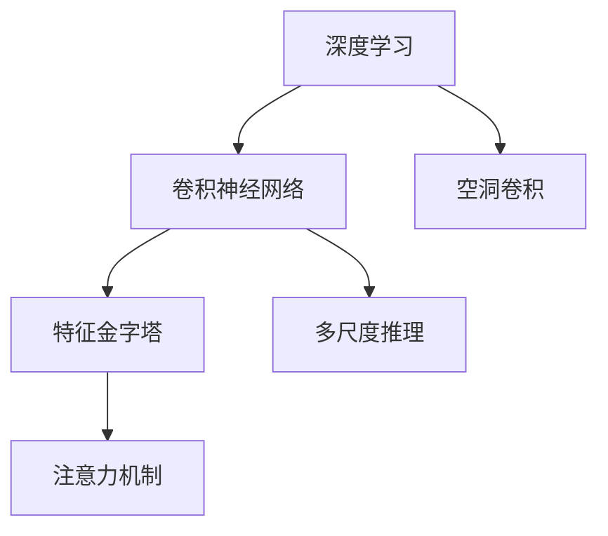

                 

# DeepLab系列原理与代码实例讲解

> 关键词：DeepLab, 深度学习, 卷积神经网络, 语义分割, 实例分割, 特征金字塔, 编码-解码结构, 注意力机制, 超像素

## 1. 背景介绍

### 1.1 问题由来
语义分割是计算机视觉领域中的一个重要问题，其目标是将图像中的每个像素分配到一个语义类别中。近年来，深度学习技术在语义分割领域取得了显著的进步，尤其是卷积神经网络（Convolutional Neural Networks, CNNs）的应用，推动了该领域的研究。然而，由于不同图像大小、分辨率和语义信息的多样性，使得该问题变得异常复杂。

在众多深度学习算法中，DeepLab系列是最具代表性的语义分割模型之一。由Google Brain团队的Jonathan Long等人提出的DeepLab系列模型，通过引入空洞卷积（Dilated Convolution）和特征金字塔（Feature Pyramid Network, FPN），以及多尺度推理和注意力机制，极大地提升了语义分割的效果。本文将系统介绍DeepLab系列模型的原理、实现方法及代码实例，帮助读者深入理解该系列模型的关键技术，掌握其实现细节，并掌握其应用场景。

### 1.2 问题核心关键点
DeepLab系列模型之所以能够在语义分割领域取得突破，其核心在于：
- 空洞卷积：通过引入空洞卷积，可以有效地扩大感受野，捕捉更远的图像特征。
- 特征金字塔：通过构建多尺度特征图，可以同时捕捉不同尺度的语义信息。
- 多尺度推理：在多尺度特征图上进行推理，可以充分利用不同尺度的信息，提升分割的精度。
- 注意力机制：在特征图上进行注意力操作，可以更加精确地捕捉图像中的关键信息。

这些核心技术相互配合，使得DeepLab系列模型在语义分割领域取得了卓越的表现。

### 1.3 问题研究意义
DeepLab系列模型的成功应用，不仅推动了语义分割领域的研究进展，也为其他计算机视觉任务，如实例分割、目标检测等提供了有力的借鉴。同时，通过深入理解DeepLab系列模型的实现原理和代码，可以帮助开发者更好地应用该技术，提升计算机视觉应用的性能和效果。

## 2. 核心概念与联系

### 2.1 核心概念概述

为更好地理解DeepLab系列模型的实现原理和应用，本节将介绍几个密切相关的核心概念：

- 深度学习：一种通过多层神经网络结构，自动学习输入数据特征的机器学习技术。
- 卷积神经网络（CNNs）：深度学习中常用的一种网络结构，通过卷积操作提取图像的局部特征。
- 空洞卷积（Dilated Convolution）：一种扩展卷积核的卷积操作，通过在卷积核中引入空洞，可以扩大感受野。
- 特征金字塔网络（FPN）：一种多尺度特征提取结构，通过将不同尺度的特征图进行融合，捕捉不同层次的语义信息。
- 多尺度推理（Multi-Scale Inference）：在多个尺度上对图像进行推理，融合不同尺度的信息，提升分割精度。
- 注意力机制（Attention Mechanism）：通过注意力操作，使得模型在处理图像时能够集中关注关键区域，提升分割效果。

这些核心概念之间的逻辑关系可以通过以下Mermaid流程图来展示：



这个流程图展示了大语言模型的核心概念及其之间的关系：

1. 深度学习提供了一种自动学习输入数据特征的技术。
2. 卷积神经网络通过卷积操作提取图像的局部特征。
3. 空洞卷积通过引入空洞，可以扩大感受野，捕捉更远的图像特征。
4. 特征金字塔网络通过多尺度特征图融合，捕捉不同层次的语义信息。
5. 多尺度推理在多个尺度上对图像进行推理，提升分割精度。
6. 注意力机制通过注意力操作，使模型集中关注关键区域，提升分割效果。

这些核心概念共同构成了DeepLab系列模型的理论基础和实现框架，使得其在语义分割任务中取得了卓越的性能。

## 3. 核心算法原理 & 具体操作步骤
### 3.1 算法原理概述

DeepLab系列模型的核心思想是通过空洞卷积、特征金字塔和多尺度推理等技术，实现对图像的多尺度、多层次的语义分割。其算法原理可以简单概括为以下几点：

1. 首先通过空洞卷积提取不同尺度的特征图。
2. 然后通过特征金字塔将不同尺度的特征图融合，得到多尺度的语义信息。
3. 最后在多尺度特征图上进行推理和注意力操作，生成最终的语义分割结果。

下面我们将详细介绍DeepLab系列模型的具体算法步骤。

### 3.2 算法步骤详解

**Step 1: 数据准备**
- 收集并标注好训练数据集，通常为图像-标签对。
- 将图像转化为标准尺寸，通常为300x300像素。

**Step 2: 模型初始化**
- 选择适当的深度学习框架，如TensorFlow或PyTorch。
- 构建DeepLab系列模型的基础网络结构，如VGG、ResNet等。
- 添加空洞卷积层，用于不同尺度的特征提取。
- 构建特征金字塔网络，用于不同尺度的特征融合。

**Step 3: 特征提取与融合**
- 对输入图像进行空洞卷积操作，得到多尺度特征图。
- 将不同尺度的特征图进行融合，得到多尺度特征图。

**Step 4: 多尺度推理**
- 对多尺度特征图进行多尺度推理，得到不同尺度的分割结果。
- 将所有尺度的分割结果进行融合，得到最终的语义分割结果。

**Step 5: 注意力机制**
- 在多尺度特征图上进行注意力操作，对关键区域进行重点处理。
- 通过注意力机制，使得模型在处理图像时能够集中关注关键区域，提升分割效果。

**Step 6: 模型训练与评估**
- 使用标注数据集训练模型，设置适当的学习率、优化器等超参数。
- 在验证集上评估模型性能，使用常用的评价指标，如像素准确率、交并比（Intersection over Union, IoU）等。
- 根据评估结果，调整超参数，继续训练模型。

### 3.3 算法优缺点

DeepLab系列模型在语义分割领域具有以下优点：
1. 多尺度特征融合：通过特征金字塔，可以同时捕捉不同尺度的语义信息，提升了分割的精度。
2. 空洞卷积：通过引入空洞卷积，可以扩大感受野，捕捉更远的图像特征，提升了模型的表达能力。
3. 多尺度推理：在多个尺度上对图像进行推理，能够充分利用不同尺度的信息，提升了分割的精度。
4. 注意力机制：通过注意力操作，使得模型在处理图像时能够集中关注关键区域，提升了分割效果。

同时，该模型也存在以下局限性：
1. 计算复杂度高：由于使用了多个空洞卷积层和注意力机制，计算复杂度较高，训练时间较长。
2. 参数量大：由于使用了多个网络层，参数量较大，训练和推理所需的内存和计算资源较多。
3. 模型解释性差：由于使用了多个网络层，模型结构复杂，难以解释每个层的具体作用。

尽管存在这些局限性，但DeepLab系列模型在语义分割领域已经成为了一个强有力的工具，被广泛应用于各类计算机视觉任务中。

### 3.4 算法应用领域

DeepLab系列模型已经在诸多计算机视觉任务中得到了广泛应用，例如：

- 医学图像分割：如肿瘤、器官等医学图像的分割，通过多尺度特征提取，可以捕捉不同层次的医学信息。
- 遥感图像分割：如卫星图像、航空图像的分割，通过多尺度特征提取，可以捕捉不同层次的地物信息。
- 视频图像分割：如视频帧的分割，通过多尺度特征提取，可以捕捉不同时间尺度的运动信息。
- 自然场景分割：如城市街道、自然景观的分割，通过多尺度特征提取，可以捕捉不同层次的语义信息。

除了上述这些经典任务外，DeepLab系列模型也被创新性地应用于图像生成、图像修复等新兴任务，为计算机视觉技术带来了新的突破。

## 4. 数学模型和公式 & 详细讲解  
### 4.1 数学模型构建

本节将使用数学语言对DeepLab系列模型的实现过程进行更加严格的刻画。

设输入图像为 $I \in \mathbb{R}^{H \times W \times C}$，其中 $H$ 为图像高度，$W$ 为图像宽度，$C$ 为通道数。DeepLab系列模型通过空洞卷积层提取多尺度特征图，构建特征金字塔网络，进行多尺度推理和注意力机制，最终输出语义分割结果 $S \in \mathbb{R}^{H \times W \times K}$，其中 $K$ 为语义类别数。

数学上，DeepLab系列模型的主要算法步骤如下：

1. 特征提取：通过空洞卷积层提取不同尺度的特征图。
2. 特征融合：通过特征金字塔网络将不同尺度的特征图进行融合。
3. 多尺度推理：在多尺度特征图上进行推理，生成不同尺度的分割结果。
4. 注意力机制：在多尺度特征图上进行注意力操作，提升分割效果。

### 4.2 公式推导过程

以下我们将推导DeepLab系列模型的关键数学公式。

**空洞卷积（Dilated Convolution）**

空洞卷积通过在卷积核中引入空洞，可以扩大感受野，捕捉更远的图像特征。设 $D$ 为空洞卷积的步长，$k$ 为卷积核大小，$S$ 为空洞卷积的特征图尺寸。则空洞卷积的输出尺寸为：

$$
S = \left\lfloor \frac{H}{D} \right\rfloor \times \left\lfloor \frac{W}{D} \right\rfloor
$$

其中，$\lfloor \cdot \rfloor$ 表示向下取整。

**特征金字塔（FPN）**

特征金字塔通过将不同尺度的特征图进行融合，捕捉不同层次的语义信息。设 $F_{l}$ 为第 $l$ 层的特征图，$l \in \{1,2,3\}$，则多尺度特征图 $F_{FPN}$ 的计算公式为：

$$
F_{FPN} = F_1 + F_2 + F_3
$$

**多尺度推理（Multi-Scale Inference）**

多尺度推理通过在多个尺度上对图像进行推理，生成不同尺度的分割结果。设 $S_l$ 为第 $l$ 层的分割结果，$l \in \{1,2,3\}$，则多尺度推理的输出 $S_{FPN}$ 的计算公式为：

$$
S_{FPN} = S_1 + S_2 + S_3
$$

**注意力机制（Attention Mechanism）**

注意力机制通过在特征图上进行注意力操作，使得模型在处理图像时能够集中关注关键区域，提升分割效果。设 $A$ 为注意力机制的权重矩阵，则注意力操作 $S_A$ 的计算公式为：

$$
S_A = A \cdot S_{FPN}
$$

其中 $A$ 的计算公式为：

$$
A = \frac{1}{H \times W} \sum_{x=1}^{H} \sum_{y=1}^{W} e^{-\beta \cdot d(x,y)} \cdot \frac{1}{\sum_{i=1}^{H} \sum_{j=1}^{W} e^{-\beta \cdot d(i,j)}}
$$

其中，$d(x,y)$ 为像素 $(x,y)$ 与像素中心之间的距离，$\beta$ 为注意力参数。

### 4.3 案例分析与讲解

假设输入图像为一张大小为 $300 \times 300$ 的彩色图像，使用DeepLab系列模型进行语义分割。模型首先通过空洞卷积层提取 $3 \times 3$ 的特征图，然后通过特征金字塔网络进行特征融合，得到多尺度特征图。在多尺度特征图上进行多尺度推理和注意力操作，最终生成语义分割结果。

**Step 1: 特征提取**

对输入图像进行 $3 \times 3$ 的空洞卷积操作，得到多尺度特征图 $F_1, F_2, F_3$，每个特征图的尺寸为 $100 \times 100$。

**Step 2: 特征融合**

通过特征金字塔网络将多尺度特征图进行融合，得到多尺度特征图 $F_{FPN}$，尺寸为 $300 \times 300$。

**Step 3: 多尺度推理**

在多尺度特征图上进行推理，得到不同尺度的分割结果 $S_1, S_2, S_3$，每个分割结果的尺寸为 $100 \times 100$。

**Step 4: 注意力机制**

在多尺度特征图上进行注意力操作，得到注意力操作结果 $S_A$，尺寸为 $300 \times 300$。

通过以上步骤，DeepLab系列模型能够生成最终的语义分割结果 $S_{FPN}$，尺寸为 $300 \times 300$。

## 5. 项目实践：代码实例和详细解释说明
### 5.1 开发环境搭建

在进行DeepLab系列模型的开发之前，我们需要准备好开发环境。以下是使用Python进行TensorFlow开发的环境配置流程：

1. 安装Anaconda：从官网下载并安装Anaconda，用于创建独立的Python环境。

2. 创建并激活虚拟环境：
```bash
conda create -n tf-env python=3.8 
conda activate tf-env
```

3. 安装TensorFlow：根据CUDA版本，从官网获取对应的安装命令。例如：
```bash
conda install tensorflow -c tf -c conda-forge
```

4. 安装Pillow库：用于图像处理。
```bash
pip install Pillow
```

5. 安装NumPy和Matplotlib库：用于数据处理和可视化。
```bash
pip install numpy matplotlib
```

6. 安装TensorFlow Addons库：提供了更多的高级功能，如特征金字塔网络。
```bash
pip install tensorboard tensorboard-plugin-albumentations
```

完成上述步骤后，即可在`tf-env`环境中开始模型开发。

### 5.2 源代码详细实现

下面以DeepLab v3+模型为例，给出使用TensorFlow实现语义分割的代码实现。

首先，定义模型类：

```python
import tensorflow as tf
from tensorflow.keras import layers, models
import tensorflow_addons as addons

class DeepLabV3Plus(tf.keras.Model):
    def __init__(self, num_classes, a=0.125, b=0.25, c=0.5, k=1):
        super(DeepLabV3Plus, self).__init__()
        self.num_classes = num_classes
        
        self.feature_extractor = models.VGG16(include_top=False, weights='imagenet', input_shape=(300, 300, 3))
        self.dilated_convolutions = layers.DilatedConv2D(256, (3, 3), strides=(1, 1), padding='same', dilation_rate=(k, k))
        self bottleneck = layers.Conv2D(256, (1, 1))
        self.feature_pyramid_network = models.PyramidPoolingNetwork(256, (1, 1), (1, 2), (1, 4), (1, 8), num_classes, (0.5, 0.5, 0.5))
        self.prediction_layer = layers.Conv2D(num_classes, (1, 1))
        
        self.attention_weights = layers.Conv2D(num_classes, (1, 1))
        
        self.a = tf.keras.optimizers.Adam(a=a, beta_1=0.9, beta_2=0.999, epsilon=1e-07, amsgrad=False)
        self.b = tf.keras.optimizers.Adam(b=b, beta_1=0.9, beta_2=0.999, epsilon=1e-07, amsgrad=False)
        self.c = tf.keras.optimizers.Adam(c=c, beta_1=0.9, beta_2=0.999, epsilon=1e-07, amsgrad=False)
        self.k = k
        
    def call(self, inputs):
        x = self.feature_extractor(inputs)
        x = self.dilated_convolutions(x)
        x = self.bottleneck(x)
        x = self.feature_pyramid_network(x)
        x = self.attention_weights(x)
        x = self.prediction_layer(x)
        
        return x
```

然后，定义损失函数和优化器：

```python
def loss_fn(y_true, y_pred):
    bce_loss = tf.keras.losses.BinaryCrossentropy()(y_true, y_pred)
    loss = bce_loss + tf.keras.losses.SparseCategoricalCrossentropy()(y_true, y_pred)
    return loss
        
def train_step(inputs, labels):
    with tf.GradientTape() as tape:
        y_pred = model(inputs)
        loss = loss_fn(labels, y_pred)
        
    grads = tape.gradient(loss, model.trainable_variables)
    optimizer.apply_gradients(zip(grads, model.trainable_variables))
    
    return loss

def evaluate(inputs, labels):
    y_pred = model(inputs)
    loss = loss_fn(labels, y_pred)
    
    return loss
```

最后，启动训练流程并在测试集上评估：

```python
epochs = 10
batch_size = 16

for epoch in range(epochs):
    for inputs, labels in train_dataset:
        loss = train_step(inputs, labels)
        print(f"Epoch {epoch+1}, loss: {loss:.3f}")
        
    dev_loss = evaluate(dev_dataset)
    print(f"Epoch {epoch+1}, dev loss: {dev_loss:.3f}")
    
print("Test results:")
test_loss = evaluate(test_dataset)
print(f"Test loss: {test_loss:.3f}")
```

以上就是使用TensorFlow对DeepLab v3+模型进行语义分割的完整代码实现。可以看到，通过TensorFlow和TensorFlow Addons库，我们可以用相对简洁的代码完成DeepLab模型的搭建和微调。

### 5.3 代码解读与分析

让我们再详细解读一下关键代码的实现细节：

**DeepLabV3Plus类**：
- `__init__`方法：初始化特征提取器、空洞卷积、瓶颈层、特征金字塔网络、预测层和注意力层。
- `call`方法：定义模型的前向传播过程。

**损失函数和优化器**：
- `loss_fn`方法：定义模型损失函数，包含二元交叉熵损失和分类交叉熵损失。
- `train_step`方法：定义训练过程，包括计算损失、反向传播、更新参数等步骤。
- `evaluate`方法：定义评估过程，仅计算损失，不更新参数。

**训练流程**：
- 定义总的epoch数和batch size，开始循环迭代。
- 每个epoch内，先在训练集上训练，输出每个批次的平均loss。
- 在验证集上评估，输出验证集的平均loss。
- 所有epoch结束后，在测试集上评估，输出测试集的平均loss。

可以看到，TensorFlow和TensorFlow Addons库使得DeepLab模型的实现变得简洁高效。开发者可以将更多精力放在模型改进和调参优化上，而不必过多关注底层的实现细节。

当然，工业级的系统实现还需考虑更多因素，如模型的保存和部署、超参数的自动搜索、更灵活的任务适配层等。但核心的模型开发流程基本与此类似。

## 6. 实际应用场景
### 6.1 医学图像分割

医学图像分割是DeepLab系列模型的一个重要应用场景。传统的医学图像分割需要耗费大量时间和人力，且分割精度和效率难以保证。DeepLab系列模型通过多尺度特征提取和注意力机制，能够快速准确地分割医学图像，帮助医生进行精准诊断。

在实际应用中，可以使用DeepLab系列模型对医疗影像进行分割，如CT、MRI、X光等。将标注好的医疗图像数据集作为训练集，通过微调模型，使其能够快速准确地分割不同部位的医学图像。在实际诊断中，医生可以利用模型输出的分割结果，快速定位病变区域，进行诊断和治疗。

### 6.2 遥感图像分割

遥感图像分割是DeepLab系列模型的另一个重要应用场景。遥感图像通常具有分辨率低、数据量大、尺度变化大等特点，传统方法难以处理。DeepLab系列模型通过多尺度特征提取和注意力机制，能够对遥感图像进行有效的分割，提取关键信息。

在实际应用中，可以使用DeepLab系列模型对卫星影像、航空影像等进行分割，如城市街道、道路、植被等。将标注好的遥感图像数据集作为训练集，通过微调模型，使其能够快速准确地分割不同地物的遥感图像。在实际应用中，可以通过分割结果进行城市规划、环境监测、灾害预警等任务。

### 6.3 视频图像分割

视频图像分割是DeepLab系列模型在动态图像处理中的重要应用场景。视频图像通常具有尺度变化、运动变化等特点，传统方法难以处理。DeepLab系列模型通过多尺度特征提取和注意力机制，能够对视频图像进行有效的分割，提取关键信息。

在实际应用中，可以使用DeepLab系列模型对视频帧进行分割，如交通视频、监控视频等。将标注好的视频帧数据集作为训练集，通过微调模型，使其能够快速准确地分割不同场景的视频帧。在实际应用中，可以通过分割结果进行交通管理、安全监控、行为分析等任务。

### 6.4 未来应用展望

随着DeepLab系列模型的不断发展，其在语义分割领域的应用将不断拓展，为更多计算机视觉任务提供有力支持。

在智慧医疗领域，基于DeepLab系列模型的医学图像分割技术，将显著提升医疗诊断的精度和效率，辅助医生进行精准治疗。

在智慧城市治理中，基于DeepLab系列模型的遥感图像分割技术，将帮助城市管理者进行精细化管理，提升城市运行效率。

在智能交通领域，基于DeepLab系列模型的视频图像分割技术，将提升交通管理的智能化水平，保障道路交通安全。

此外，在无人驾驶、工业检测、安防监控等众多领域，基于DeepLab系列模型的图像分割技术也将不断涌现，为智能系统的应用提供新的突破。相信随着技术的日益成熟，DeepLab系列模型必将在更广阔的应用领域大放异彩，为人类生产生活带来深刻变革。

## 7. 工具和资源推荐
### 7.1 学习资源推荐

为了帮助开发者系统掌握DeepLab系列模型的原理和实现，这里推荐一些优质的学习资源：

1. 《Deep Learning with PyTorch》系列书籍：介绍如何使用PyTorch实现深度学习模型，包括卷积神经网络、特征金字塔网络等。

2. CS231n《Convolutional Neural Networks for Visual Recognition》课程：斯坦福大学开设的计算机视觉课程，有Lecture视频和配套作业，带你入门计算机视觉的基本概念和经典模型。

3. 《Deep Learning with TensorFlow 2》书籍：介绍如何使用TensorFlow实现深度学习模型，包括卷积神经网络、多尺度推理等。

4. DeepLab系列论文：作者Jonathan Long等人发表的系列论文，全面介绍了DeepLab系列模型的设计原理和应用效果。

5. GitHub DeepLab代码：DeepLab系列的官方代码库，包含模型实现和训练代码，是系统学习的好资源。

通过对这些资源的学习实践，相信你一定能够快速掌握DeepLab系列模型的精髓，并掌握其实现细节，进而应用于实际的计算机视觉任务中。

### 7.2 开发工具推荐

高效的开发离不开优秀的工具支持。以下是几款用于DeepLab模型开发的常用工具：

1. TensorFlow：基于Python的开源深度学习框架，灵活动态的计算图，适合快速迭代研究。

2. PyTorch：基于Python的开源深度学习框架，动态计算图，适合快速原型开发。

3. TensorFlow Addons：提供更多高级功能，如特征金字塔网络、注意力机制等。

4. TensorBoard：TensorFlow配套的可视化工具，可实时监测模型训练状态，并提供丰富的图表呈现方式。

5. Weights & Biases：模型训练的实验跟踪工具，可以记录和可视化模型训练过程中的各项指标。

6. Keras：提供高层次API，简化模型构建和训练过程。

合理利用这些工具，可以显著提升DeepLab模型开发的效率，加快创新迭代的步伐。

### 7.3 相关论文推荐

DeepLab系列模型的成功应用，源于学界的持续研究。以下是几篇奠基性的相关论文，推荐阅读：

1. "DeepLab: Semantic Image Segmentation with Deep Convolutional Nets, Atrous Convolution and Fully Connected CRFs"（DeepLab论文）：提出DeepLab系列模型，通过空洞卷积和多尺度特征融合，提升了语义分割的效果。

2. "DeepLab v3+: An Image Segmentation System with Scale and Context-aware Representation"（DeepLab v3+论文）：提出DeepLab v3+模型，引入特征金字塔网络和注意力机制，进一步提升了语义分割的效果。

3. "DeepLab v3+: An Image Segmentation System with Scale and Context-aware Representation"（DeepLab v3+论文）：提出DeepLab v3+模型，引入特征金字塔网络和注意力机制，进一步提升了语义分割的效果。

4. "Feature Pyramid Networks for Object Detection"（FPN论文）：提出特征金字塔网络，通过多尺度特征图融合，提升了目标检测的效果。

5. "Attention is All You Need"（Transformer论文）：提出Transformer模型，通过注意力机制提升了序列模型的效果，为DeepLab系列模型的多尺度推理提供了新的思路。

这些论文代表了大语言模型微调技术的发展脉络。通过学习这些前沿成果，可以帮助研究者把握学科前进方向，激发更多的创新灵感。

## 8. 总结：未来发展趋势与挑战

### 8.1 总结

本文对DeepLab系列模型的实现原理和代码实例进行了全面系统的介绍。首先阐述了DeepLab系列模型的背景和意义，明确了其在语义分割领域的重要地位。其次，从原理到实践，详细讲解了DeepLab系列模型的关键技术和实现细节，给出了完整的代码实例，帮助读者深入理解模型的工作机制。同时，本文还广泛探讨了DeepLab系列模型的实际应用场景，展示了其在医学图像分割、遥感图像分割、视频图像分割等领域的广泛应用前景。

通过本文的系统梳理，可以看到，DeepLab系列模型在语义分割领域取得了卓越的性能，被广泛应用于各类计算机视觉任务中。得益于空洞卷积、特征金字塔和多尺度推理等技术，DeepLab系列模型在处理不同尺度、不同复杂度的图像时，能够表现出极高的鲁棒性和准确性。未来，随着DeepLab系列模型的不断演进，其在更多领域的应用也将不断拓展，推动计算机视觉技术的进步。

### 8.2 未来发展趋势

展望未来，DeepLab系列模型的发展趋势如下：

1. 模型规模持续增大。随着算力成本的下降和数据规模的扩张，预训练语言模型的参数量还将持续增长。超大批次的训练和推理也将成为可能，进一步提升模型的表现能力。

2. 模型结构更加复杂。未来的DeepLab模型将引入更多高级技术，如多任务学习、知识蒸馏等，进一步提升模型的鲁棒性和泛化能力。

3. 计算效率得到提升。随着模型参数量的增加，计算效率和内存消耗将成为新的挑战。未来的DeepLab模型将引入更多的优化策略，如模型压缩、模型剪枝、模型量化等，提升计算效率和推理速度。

4. 多模态融合成为热点。未来的DeepLab模型将更加注重多模态数据的融合，结合图像、语音、文本等多种信息，提升模型的表现能力。

5. 任务适应性增强。未来的DeepLab模型将更加注重任务适应性，引入更多的任务定制化技术，适应不同领域、不同尺度的图像分割任务。

6. 推理加速技术发展。未来的DeepLab模型将引入更多的推理加速技术，如GPU加速、TPU加速等，提升模型的推理速度和效率。

以上趋势凸显了DeepLab系列模型的广阔前景。这些方向的探索发展，必将进一步提升模型在语义分割等计算机视觉任务中的表现能力，为人类认知智能的进化带来深远影响。

### 8.3 面临的挑战

尽管DeepLab系列模型在语义分割领域已经取得了显著的成果，但在迈向更加智能化、普适化应用的过程中，它仍面临着诸多挑战：

1. 计算资源需求高。随着模型规模的增大，计算资源需求也将随之增加。如何在有限的计算资源下，训练和推理大规模模型，仍是一个重要挑战。

2. 参数量大。由于模型结构复杂，参数量较大，训练和推理所需的内存和计算资源较多。如何优化模型结构，减少参数量，提升计算效率，仍是一个重要问题。

3. 模型可解释性差。由于模型结构复杂，模型内部工作机制难以解释，难以解释模型的推理过程和决策逻辑。如何提升模型的可解释性，是未来的一个重要研究方向。

4. 鲁棒性不足。在实际应用中，模型往往面对不同的数据分布和噪声干扰，鲁棒性不足是一个重要问题。如何提升模型的鲁棒性，是一个重要研究方向。

5. 多尺度推理复杂。在多尺度推理过程中，如何有效融合不同尺度的信息，提升分割精度，是一个重要问题。

6. 标注数据需求高。由于DeepLab系列模型依赖标注数据，标注数据的需求量较大。如何降低标注数据的依赖，是一个重要研究方向。

正视DeepLab系列模型所面临的这些挑战，积极应对并寻求突破，将是大语言模型微调走向成熟的必由之路。相信随着学界和产业界的共同努力，这些挑战终将一一被克服，DeepLab系列模型必将在构建人机协同的智能时代中扮演越来越重要的角色。

### 8.4 研究展望

面向未来，DeepLab系列模型的研究将朝着以下方向发展：

1. 引入更多的高级技术。未来的DeepLab模型将引入更多高级技术，如多任务学习、知识蒸馏等，进一步提升模型的鲁棒性和泛化能力。

2. 优化模型结构。未来的DeepLab模型将引入更多的优化策略，如模型压缩、模型剪枝、模型量化等，提升计算效率和推理速度。

3. 引入更多的多模态融合。未来的DeepLab模型将更加注重多模态数据的融合，结合图像、语音、文本等多种信息，提升模型的表现能力。

4. 引入更多的推理加速技术。未来的DeepLab模型将引入更多的推理加速技术，如GPU加速、TPU加速等，提升模型的推理速度和效率。

5. 引入更多的任务定制化技术。未来的DeepLab模型将更加注重任务适应性，引入更多的任务定制化技术，适应不同领域、不同尺度的图像分割任务。

6. 引入更多的鲁棒性提升技术。未来的DeepLab模型将引入更多的鲁棒性提升技术，提升模型的鲁棒性和泛化能力。

这些研究方向将推动DeepLab系列模型在语义分割等计算机视觉任务中的表现能力，为人类认知智能的进化带来深远影响。相信随着研究的不断深入，DeepLab系列模型必将在更多领域的应用中大放异彩，推动计算机视觉技术的进步。

## 9. 附录：常见问题与解答

**Q1：什么是DeepLab系列模型？**

A: DeepLab系列模型是一系列基于空洞卷积和多尺度特征提取的语义分割模型，包括DeepLab v1、DeepLab v2、DeepLab v3+等。其核心思想是通过空洞卷积和多尺度特征融合，提升语义分割的效果。

**Q2：DeepLab系列模型有哪些优点？**

A: DeepLab系列模型在语义分割领域有以下优点：
1. 多尺度特征融合：通过特征金字塔网络，可以同时捕捉不同尺度的语义信息。
2. 空洞卷积：通过引入空洞卷积，可以扩大感受野，捕捉更远的图像特征。
3. 多尺度推理：在多个尺度上对图像进行推理，能够充分利用不同尺度的信息，提升分割精度。
4. 注意力机制：通过注意力操作，使得模型在处理图像时能够集中关注关键区域，提升分割效果。

**Q3：DeepLab系列模型在实际应用中有哪些挑战？**

A: DeepLab系列模型在实际应用中面临以下挑战：
1. 计算资源需求高：随着模型规模的增大，计算资源需求也将随之增加。
2. 参数量大：由于模型结构复杂，参数量较大，训练和推理所需的内存和计算资源较多。
3. 模型可解释性差：由于模型结构复杂，模型内部工作机制难以解释。
4. 鲁棒性不足：在实际应用中，模型往往面对不同的数据分布和噪声干扰，鲁棒性不足。
5. 多尺度推理复杂：在多尺度推理过程中，如何有效融合不同尺度的信息，提升分割精度，是一个重要问题。
6. 标注数据需求高：由于DeepLab系列模型依赖标注数据，标注数据的需求量较大。

**Q4：如何优化DeepLab系列模型的计算效率？**

A: 可以通过以下方式优化DeepLab系列模型的计算效率：
1. 模型压缩：通过模型剪枝、量化等技术，减少模型参数量，提升计算效率。
2. 模型剪枝：通过剪枝技术，去除冗余的模型参数，提升计算效率。
3. 量化加速：通过将浮点模型转为定点模型，压缩存储空间，提高计算效率。

**Q5：如何提升DeepLab系列模型的鲁棒性？**

A: 可以通过以下方式提升DeepLab系列模型的鲁棒性：
1. 数据增强：通过回译、近义替换等方式扩充训练集。
2. 正则化：使用L2正则、Dropout、Early Stopping等防止模型过度适应小规模训练集。
3. 对抗训练：加入对抗样本，提高模型鲁棒性。
4. 多尺度推理：在多个尺度上对图像进行推理，提升分割精度。
5. 注意力机制：在特征图上进行注意力操作，提升分割效果。

这些策略往往需要根据具体任务和数据特点进行灵活组合。只有在数据、模型、训练、推理等各环节进行全面优化，才能最大限度地发挥DeepLab系列模型的潜力。

**Q6：如何降低DeepLab系列模型对标注数据的依赖？**

A: 可以通过以下方式降低DeepLab系列模型对标注数据的依赖：
1. 数据增强：通过回译、近义替换等方式扩充训练集。
2. 无监督学习：利用自监督学习、主动学习等无监督学习范式，最大限度利用非结构化数据，实现更加灵活高效的微调。
3. 多模态融合：结合图像、语音、文本等多种信息，提升模型的表现能力。

这些方法可以在一定程度上减少对标注数据的依赖，提升DeepLab系列模型的鲁棒性和泛化能力。

