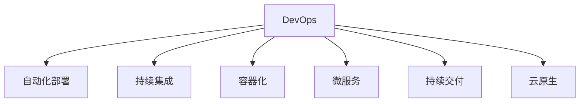

                 

# DevOps实践：自动化部署和持续集成

> 关键词：DevOps, 自动化部署, 持续集成, 容器化, 云原生, 微服务, 持续交付

## 1. 背景介绍

### 1.1 问题由来
在软件开发过程中，传统的方法往往是瀑布式的开发模式：需求分析 -> 设计 -> 编码 -> 测试 -> 部署 -> 维护。这种方式的缺陷在于环节过多，沟通成本高，且每次部署都会带来巨大的风险。而随着技术的进步，企业对软件的交付效率和质量提出了更高的要求，DevOps（Dev+Ops）应运而生，通过自动化和持续集成的方法，大大提升了软件开发和部署的效率和质量。

### 1.2 问题核心关键点
DevOps的核心思想是自动化和持续集成，即通过自动化工具链，将软件开发、测试、部署和运维等各个环节进行紧密结合，实现快速交付、频繁迭代和持续改进。其核心要素包括：

- 自动化工具：自动化测试、自动化构建、自动化部署等，减少人为干预，提升开发效率。
- 持续集成：在每次代码提交后，自动触发构建和测试流程，确保代码的稳定性和可靠性。
- 持续交付：将通过测试的代码，快速部署到生产环境，提升软件交付速度。
- 持续监控：实时监控系统运行状态，及时发现问题并进行修复。
- 云原生：采用容器化、微服务、云服务等新兴技术，实现更高效、灵活的软件架构。

这些核心要素通过合理的工具链和流程设计，构建出高效的软件交付体系，满足现代企业对软件交付和运维的需求。

## 2. 核心概念与联系

### 2.1 核心概念概述

为更好地理解DevOps实践，本节将介绍几个密切相关的核心概念：

- DevOps：一种将软件开发和运维进行紧密结合的文化和实践。
- 自动化部署：通过脚本或工具，自动化地将软件部署到生产环境。
- 持续集成：在每次代码提交后，自动触发构建和测试流程，快速发现问题。
- 容器化：将应用程序及其依赖打包到容器中，以实现跨平台、易于部署的目标。
- 微服务：将大型应用拆分为多个小型、独立的服务，每个服务独立运行和更新。
- 持续交付：在经过测试和验证后，将软件快速部署到生产环境，确保其稳定可靠。
- 云原生：采用云平台、容器、微服务、微服务等新兴技术，构建高效、灵活的软件架构。

这些核心概念之间的逻辑关系可以通过以下Mermaid流程图来展示：



这个流程图展示了几大核心概念及其之间的关系：

1. DevOps是DevOps实践的核心，将开发和运维紧密结合，提升软件交付效率和质量。
2. 自动化部署和持续集成是DevOps的两个关键环节，通过自动化工具链，实现快速构建、测试和部署。
3. 容器化、微服务是实现DevOps的技术手段，提高软件部署的灵活性和可扩展性。
4. 持续交付是DevOps的重要目标，通过快速部署、实时反馈，提升软件交付的稳定性和可靠性。
5. 云原生技术为DevOps提供了更高效、灵活的软件架构支持。

这些概念共同构成了DevOps的实践框架，使其能够通过自动化和持续集成的方法，实现高效的软件交付和运维。

## 3. 核心算法原理 & 具体操作步骤
### 3.1 算法原理概述

DevOps实践的核心在于自动化和持续集成，其基本流程可以概括为以下几个步骤：

1. 代码管理：使用版本控制系统(Git、SVN等)管理代码库，确保代码的变更可追溯和可管理。
2. 自动化构建：通过脚本或工具链(如Jenkins、GitLab CI/CD等)，自动化地编译代码、构建依赖库和打包二进制文件。
3. 自动化测试：在每次代码提交后，自动触发测试流程，包括单元测试、集成测试、系统测试等，确保代码质量。
4. 自动化部署：将通过测试的代码部署到生产环境，自动化地完成配置、部署、扩容等操作。
5. 持续监控：实时监控系统运行状态，及时发现问题并进行修复，确保系统稳定运行。

### 3.2 算法步骤详解

以下是对DevOps实践的详细步骤进行详细的讲解：

**Step 1: 环境搭建**
- 安装必要的工具和软件，如Git、Jenkins、Docker、Kubernetes等。
- 配置好环境变量，确保工具链可以正常工作。
- 设置版本控制系统，如Git，并创建代码仓库，添加项目所需文件。

**Step 2: 自动化构建**
- 定义构建脚本或使用CI/CD工具链，如Jenkins，自动触发构建流程。
- 配置构建环境，如安装依赖库、编译工具等。
- 设置构建参数，如构建路径、构建日志等，保证构建过程可追溯。

**Step 3: 自动化测试**
- 定义测试用例和测试脚本，如单元测试、集成测试、性能测试等。
- 配置测试环境，如配置虚拟环境、准备测试数据等。
- 使用CI/CD工具链，如Jenkins，自动触发测试流程，生成测试报告。

**Step 4: 自动化部署**
- 定义部署脚本或使用CI/CD工具链，如Jenkins，自动触发部署流程。
- 配置部署环境，如服务器配置、环境变量等。
- 使用容器化技术，如Docker，打包应用程序和依赖库。
- 使用Kubernetes等容器编排工具，自动部署应用程序，管理服务扩容和负载均衡。

**Step 5: 持续监控**
- 配置监控工具，如Prometheus、Grafana等，实时监控系统运行状态。
- 定义监控指标和告警规则，确保系统稳定性。
- 设置告警通知机制，如邮件、短信、即时通讯等，及时发现问题并进行修复。

以上是DevOps实践的基本流程，通过自动化和持续集成的方法，大大提升了软件交付和运维的效率和质量。

### 3.3 算法优缺点

DevOps实践具有以下优点：
1. 提升交付效率：通过自动化和持续集成的方法，快速构建、测试和部署代码，缩短了软件开发周期。
2. 提高代码质量：自动化测试流程确保了每次提交的代码质量，减少了人为错误。
3. 减少运维成本：自动化部署和监控方法减少了人工干预，降低了运维成本。
4. 快速反馈和迭代：持续集成和持续交付方式，可以快速发现问题并及时修复，确保软件稳定性。

同时，DevOps实践也存在一定的局限性：
1. 技术门槛高：自动化和持续集成需要一定的技术储备，对于初学者较为困难。
2. 工具链复杂：多种工具和工具链的整合可能增加复杂性，需要专门的技术支持和维护。
3. 数据安全问题：自动化流程中涉及大量的敏感数据，需要严格的数据安全措施。
4. 项目管理复杂：DevOps涉及多个团队的协作，项目管理难度较大。
5. 初期投入大：初期搭建自动化流程和监控系统需要较大的投入。

尽管存在这些局限性，但就目前而言，DevOps已经成为软件开发和运维的最佳实践，能够有效提升软件交付效率和质量。

### 3.4 算法应用领域

DevOps实践已经在各行各业得到了广泛的应用，涵盖了软件开发、运维管理、生产部署等各个环节，例如：

- 软件开发：通过持续集成和持续交付，快速构建、测试和部署软件，缩短开发周期。
- 运维管理：通过自动化部署和持续监控，确保系统稳定运行，减少运维成本。
- 生产部署：使用容器化、微服务等新兴技术，快速部署和扩容服务，提升应用可用性。
- 数据管理：通过自动化测试和持续监控，确保数据质量和完整性，保障数据安全。
- 安全审计：通过自动化流程和监控机制，实时发现和修复安全漏洞，提升系统安全性。

除了上述这些经典应用外，DevOps还被创新性地应用于更多场景中，如DevSecOps、DevOps as Code等，为软件交付和运维带来了全新的思路和方法。

## 4. 数学模型和公式 & 详细讲解 & 举例说明
### 4.1 数学模型构建

以下介绍DevOps实践的数学模型构建过程：

**Step 1: 代码管理**
- 使用版本控制系统，如Git，管理代码库，确保代码变更可追溯。
- 定义版本标签，如Major.Minor.Patch，便于版本控制和发布。

**Step 2: 自动化构建**
- 定义构建脚本或CI/CD流程，如Jenkins，自动化触发构建流程。
- 配置构建环境，如安装依赖库、编译工具等。
- 定义构建参数，如构建路径、构建日志等，确保构建过程可追溯。

**Step 3: 自动化测试**
- 定义测试用例和测试脚本，如单元测试、集成测试、性能测试等。
- 配置测试环境，如配置虚拟环境、准备测试数据等。
- 使用CI/CD工具链，如Jenkins，自动触发测试流程，生成测试报告。

**Step 4: 自动化部署**
- 定义部署脚本或CI/CD流程，如Jenkins，自动化触发部署流程。
- 配置部署环境，如服务器配置、环境变量等。
- 使用容器化技术，如Docker，打包应用程序和依赖库。
- 使用容器编排工具，如Kubernetes，自动部署应用程序，管理服务扩容和负载均衡。

**Step 5: 持续监控**
- 配置监控工具，如Prometheus、Grafana等，实时监控系统运行状态。
- 定义监控指标和告警规则，确保系统稳定性。
- 设置告警通知机制，如邮件、短信、即时通讯等，及时发现问题并进行修复。

### 4.2 公式推导过程

以下是对DevOps实践的公式推导过程进行详细讲解：

**Step 1: 代码管理**
- 定义代码变更日志，记录每次变更的版本、作者、日期等信息。
- 定义版本标签，如Major.Minor.Patch，便于版本控制和发布。

**Step 2: 自动化构建**
- 定义构建脚本或CI/CD流程，如Jenkins，自动化触发构建流程。
- 配置构建环境，如安装依赖库、编译工具等。
- 定义构建参数，如构建路径、构建日志等，确保构建过程可追溯。

**Step 3: 自动化测试**
- 定义测试用例和测试脚本，如单元测试、集成测试、性能测试等。
- 配置测试环境，如配置虚拟环境、准备测试数据等。
- 使用CI/CD工具链，如Jenkins，自动触发测试流程，生成测试报告。

**Step 4: 自动化部署**
- 定义部署脚本或CI/CD流程，如Jenkins，自动化触发部署流程。
- 配置部署环境，如服务器配置、环境变量等。
- 使用容器化技术，如Docker，打包应用程序和依赖库。
- 使用容器编排工具，如Kubernetes，自动部署应用程序，管理服务扩容和负载均衡。

**Step 5: 持续监控**
- 配置监控工具，如Prometheus、Grafana等，实时监控系统运行状态。
- 定义监控指标和告警规则，确保系统稳定性。
- 设置告警通知机制，如邮件、短信、即时通讯等，及时发现问题并进行修复。

### 4.3 案例分析与讲解

以一个简单的Web应用项目为例，介绍DevOps实践的具体实现：

**项目背景：**
开发一个简单的Web应用，包含用户注册、登录、文章发布等功能。项目团队包括前端开发、后端开发、测试和运维等多个团队，需要高效地进行代码协作和软件交付。

**Step 1: 代码管理**
- 使用Git进行代码库管理，创建项目仓库，添加前端、后端、测试等代码。
- 定义代码提交规范，如代码格式、命名规范等，确保代码质量。
- 配置版本标签，如v1.0.0、v1.0.1等，便于版本控制和发布。

**Step 2: 自动化构建**
- 定义Jenkins构建脚本，自动化触发构建流程。
- 配置构建环境，如安装Node.js、Python、Django等依赖库，编译前端代码。
- 设置构建参数，如构建路径、构建日志等，确保构建过程可追溯。

**Step 3: 自动化测试**
- 定义单元测试、集成测试和性能测试用例，如单元测试覆盖主要模块，集成测试测试前后端集成，性能测试测试系统负载。
- 配置测试环境，如使用Docker创建虚拟测试环境，准备测试数据。
- 使用Jenkins自动化触发测试流程，生成测试报告，记录测试结果和问题。

**Step 4: 自动化部署**
- 定义Jenkins部署脚本，自动化触发部署流程。
- 配置部署环境，如配置服务器IP、端口等，准备部署文件。
- 使用Docker容器化技术，打包应用程序和依赖库，生成Docker镜像。
- 使用Kubernetes容器编排工具，自动部署应用程序，管理服务扩容和负载均衡。

**Step 5: 持续监控**
- 配置Prometheus和Grafana监控工具，实时监控系统运行状态。
- 定义监控指标和告警规则，如CPU使用率、内存使用率、请求响应时间等，确保系统稳定性。
- 设置告警通知机制，如邮件、短信、即时通讯等，及时发现问题并进行修复。

通过上述步骤，该项目团队能够高效地进行代码协作和软件交付，快速构建、测试和部署Web应用，确保软件质量和安全。

## 5. 项目实践：代码实例和详细解释说明
### 5.1 开发环境搭建

在进行DevOps实践前，我们需要准备好开发环境。以下是使用Jenkins进行DevOps实践的环境配置流程：

1. 安装Jenkins：从官网下载并安装Jenkins，创建Jenkins Home，安装插件。
2. 配置Jenkins Home：设置Jenkins Home目录、Web端口等，确保Jenkins服务可以正常启动。
3. 安装所需插件：从插件管理界面安装必要的插件，如Git、Docker、Prometheus、Grafana等。
4. 配置源代码仓库：在Jenkins中配置Git仓库，添加项目所需代码。
5. 配置CI/CD流程：定义Jenkins构建脚本，配置构建参数，定义CI/CD流程。

完成上述步骤后，即可在Jenkins环境中开始DevOps实践。

### 5.2 源代码详细实现

下面我们以Jenkins自动化构建为例，给出Jenkins CI/CD流程的详细实现。

首先，定义Jenkins的构建脚本，实现构建和测试流程：

```python
from jenkins import Jenkins
from jenkins.model import JenkinsFile

# 连接Jenkins服务器
server = Jenkins('http://localhost:8080', 'admin', 'admin')

# 定义构建脚本
build_script = '''
import h2

def build():
    print("开始构建")
    # 定义构建任务
    sh("echo '构建中...' >> build.log")
    # 执行构建命令
    sh("npm install && npm run build")
    # 执行测试命令
    sh("npm test --reporter spec-reporter")
    # 定义构建结果
    build_status = "SUCCESS"
    h2.response_200("构建成功")
    return build_status

# 提交构建脚本到Jenkins
job = server.create_job('my-job', JenkinsFile(build_script))
job.set_build_environment('build_script', build_script)
```

然后，定义Jenkins的CI/CD流程，实现自动化构建和测试：

```python
from jenkins.api import Jenkins
from jenkins.model import Jenkinsfile

# 连接Jenkins服务器
server = Jenkins('http://localhost:8080', 'admin', 'admin')

# 定义Jenkinsfile
jobfile = Jenkinsfile('jobfile.yml')

# 提交Jenkinsfile到Jenkins
job = server.create_job('my-job', Jenkinsfile=jobfile)

# 设置触发器
job.set_build_triggers(ci triggering event: 'git commit')

# 配置构建环境
job.set_build_environment('build_script', build_script)
```

最后，在Jenkins中启动构建流程，并在测试集上评估：

```python
# 启动构建流程
job.build()

# 在测试集上评估构建结果
test_results = server.get_build_results(job.get_build('last-succeeded'))
print(test_results)
```

以上就是使用Jenkins进行自动化构建的完整代码实现。可以看到，通过Jenkins的强大封装，我们可以用相对简洁的代码完成构建任务的自动化流程。

### 5.3 代码解读与分析

让我们再详细解读一下关键代码的实现细节：

**构建脚本：**
- 定义构建任务，包括编译代码、执行测试等。
- 通过h2库定义构建结果，确保构建结果可追溯。

**Jenkinsfile：**
- 定义Jenkins构建流程，通过Jenkinsfile实现自动化构建和测试。
- 设置触发器，如git commit触发，确保每次代码提交后自动触发构建。
- 配置构建环境，如build_script，确保构建任务可执行。

**触发器：**
- 通过Jenkins触发器，实现自动化构建和测试流程，确保构建任务按时触发。

通过上述代码，我们可以看到，Jenkins作为自动化构建的工具，能够高效地实现构建任务的自动化，显著提升开发效率。

当然，工业级的系统实现还需考虑更多因素，如构建日志管理、构建失败通知、构建结果分析等。但核心的构建范式基本与此类似。

## 6. 实际应用场景
### 6.1 持续集成环境

持续集成环境是DevOps实践的核心之一，通过自动化构建和测试流程，快速发现和修复代码问题，确保软件质量。

**应用场景：**
- 软件开发团队需要将代码提交到Git仓库，自动触发构建和测试流程。
- 每次构建任务完成后，生成测试报告，记录测试结果和问题。
- 构建任务失败时，及时通知开发团队进行修复。

**实践：**
- 使用Jenkins、GitLab CI/CD等工具，自动化触发构建和测试流程。
- 配置构建环境，如安装依赖库、编译工具等。
- 定义构建参数，如构建路径、构建日志等，确保构建过程可追溯。

### 6.2 持续交付流程

持续交付流程是DevOps实践的重要环节，通过自动化部署流程，快速将软件发布到生产环境，提升软件交付速度。

**应用场景：**
- 软件开发团队需要将通过测试的代码，自动部署到生产环境。
- 自动配置服务器环境，准备部署文件。
- 使用容器化技术，如Docker，打包应用程序和依赖库。
- 使用容器编排工具，如Kubernetes，自动部署应用程序，管理服务扩容和负载均衡。

**实践：**
- 使用Jenkins、GitLab CI/CD等工具，自动化触发部署流程。
- 配置部署环境，如配置服务器IP、端口等，准备部署文件。
- 使用Docker容器化技术，打包应用程序和依赖库，生成Docker镜像。
- 使用Kubernetes容器编排工具，自动部署应用程序，管理服务扩容和负载均衡。

### 6.3 持续监控体系

持续监控体系是DevOps实践的重要保障，通过实时监控系统运行状态，及时发现和修复问题，确保系统稳定性。

**应用场景：**
- 实时监控系统运行状态，如CPU使用率、内存使用率、请求响应时间等。
- 定义监控指标和告警规则，确保系统稳定性。
- 设置告警通知机制，如邮件、短信、即时通讯等，及时发现问题并进行修复。

**实践：**
- 使用Prometheus、Grafana等工具，实时监控系统运行状态。
- 定义监控指标和告警规则，如CPU使用率、内存使用率、请求响应时间等，确保系统稳定性。
- 设置告警通知机制，如邮件、短信、即时通讯等，及时发现问题并进行修复。

## 7. 工具和资源推荐
### 7.1 学习资源推荐

为了帮助开发者系统掌握DevOps实践的理论基础和实践技巧，这里推荐一些优质的学习资源：

1. 《DevOps实践》系列博文：由DevOps技术专家撰写，深入浅出地介绍了DevOps实践的各个环节和核心思想。

2. DevOps专家系列课程：如《DevOps学习指南》、《CI/CD实践》等，通过实际案例和工具演示，帮助开发者快速上手DevOps实践。

3. Jenkins官方文档：详细介绍了Jenkins的安装、配置和使用，是Jenkins用户的重要参考资料。

4. Docker官方文档：提供了Docker的安装、配置和使用指南，是容器化技术的入门必读。

5. Kubernetes官方文档：提供了Kubernetes的安装、配置和使用指南，是容器编排技术的入门必读。

通过对这些资源的学习实践，相信你一定能够快速掌握DevOps实践的精髓，并用于解决实际的开发和运维问题。

### 7.2 开发工具推荐

高效的开发离不开优秀的工具支持。以下是几款用于DevOps实践开发的常用工具：

1. Jenkins：开源的自动化构建和持续集成工具，支持多种插件和插件管理。
2. GitLab CI/CD：GitLab提供的CI/CD工具链，支持版本控制、构建、测试、部署等各个环节。
3. Docker：轻量级的容器化技术，支持跨平台部署和容器编排。
4. Kubernetes：开源的容器编排工具，支持分布式部署、服务管理、负载均衡等功能。
5. Prometheus：开源的监控工具，支持实时监控、告警和数据可视化。
6. Grafana：开源的数据可视化工具，支持与Prometheus集成，实时展示监控数据。
7. Git：开源的版本控制系统，支持分布式管理和分支协作。

合理利用这些工具，可以显著提升DevOps实践的开发效率，加快创新迭代的步伐。

### 7.3 相关论文推荐

DevOps实践已经在学界得到了广泛的研究，以下是几篇奠基性的相关论文，推荐阅读：

1. 《The Twelve-Factor App: Principles for Building Software as a Service》：阐述了十二个构建云计算应用的要素，是DevOps实践的重要理论基础。
2. 《CI/CD: The Automation of Software Delivery》：介绍了CI/CD的自动化流程，是DevOps实践的入门必读。
3. 《Continuous Delivery: Reliable Software Releases through Automated Testing》：介绍了持续交付的实践，是DevOps实践的重要参考。
4. 《DevOps as Code: Automation, Monitoring, and Security》：介绍了DevOps as Code的概念和实践，是DevOps自动化运维的重要参考。
5. 《The State of DevOps 2021 Report》：提供了一份关于DevOps状态的报告，展示了DevOps实践在企业中的实际应用效果。

这些论文代表了大规模自动化运维的发展脉络。通过学习这些前沿成果，可以帮助研究者把握学科前进方向，激发更多的创新灵感。

## 8. 总结：未来发展趋势与挑战

### 8.1 总结

本文对DevOps实践进行了全面系统的介绍。首先阐述了DevOps实践的核心思想和关键要素，明确了自动化和持续集成的重要性。其次，从原理到实践，详细讲解了DevOps实践的数学模型和具体步骤，给出了DevOps实践的代码实例。同时，本文还广泛探讨了DevOps实践在软件开发、运维管理、生产部署等各个环节的应用场景，展示了DevOps实践的广泛适用性和强大生命力。此外，本文精选了DevOps实践的学习资源和工具，力求为读者提供全方位的技术指引。

通过本文的系统梳理，可以看到，DevOps实践已经成为软件开发和运维的最佳实践，能够通过自动化和持续集成的方法，实现高效的软件交付和运维。未来，伴随DevOps技术的不断演进，相信能够更好地支撑软件交付的智能化和自动化，为软件开发和运维带来革命性的变化。

### 8.2 未来发展趋势

展望未来，DevOps实践将继续朝着以下方向发展：

1. 自动化水平提升：通过进一步自动化和智能化，实现更高效的自动化构建、测试和部署流程。
2. 持续交付体系完善：通过容器化、微服务等技术，实现更灵活、高效的软件交付。
3. 持续监控体系优化：通过实时监控、告警机制的完善，提升系统稳定性和运维效率。
4. 容器化技术发展：通过容器技术的发展，实现更轻量级、更高效的软件部署和运维。
5. 云计算平台应用：通过云计算平台，实现更便捷、更灵活的软件交付和运维。
6. DevOps as Code普及：通过DevOps as Code的方式，实现自动化运维的持续改进和优化。

这些发展趋势将使得DevOps实践在软件开发和运维中发挥更大的作用，带来更高效、更可靠的软件交付体系。

### 8.3 面临的挑战

尽管DevOps实践已经取得了显著成效，但在迈向更加智能化、普适化应用的过程中，仍面临以下挑战：

1. 工具链复杂度：多种工具和工具链的整合可能增加复杂性，需要专门的技术支持和维护。
2. 数据安全问题：自动化流程中涉及大量的敏感数据，需要严格的数据安全措施。
3. 项目管理难度：DevOps涉及多个团队的协作，项目管理难度较大。
4. 技术门槛高：自动化和持续集成需要一定的技术储备，对于初学者较为困难。
5. 初期投入大：初期搭建自动化流程和监控系统需要较大的投入。

尽管存在这些挑战，但通过不断改进和优化，DevOps实践仍具有广阔的发展前景。

### 8.4 研究展望

面对DevOps实践所面临的挑战，未来的研究需要在以下几个方面寻求新的突破：

1. 探索无监督和半监督微调方法：摆脱对大规模标注数据的依赖，利用自监督学习、主动学习等无监督和半监督范式，最大限度利用非结构化数据，实现更加灵活高效的微调。
2. 研究参数高效和计算高效的微调范式：开发更加参数高效的微调方法，在固定大部分预训练参数的同时，只更新极少量的任务相关参数。同时优化微调模型的计算图，减少前向传播和反向传播的资源消耗，实现更加轻量级、实时性的部署。
3. 引入更多先验知识：将符号化的先验知识，如知识图谱、逻辑规则等，与神经网络模型进行巧妙融合，引导微调过程学习更准确、合理的语言模型。同时加强不同模态数据的整合，实现视觉、语音等多模态信息与文本信息的协同建模。
4. 结合因果分析和博弈论工具：将因果分析方法引入微调模型，识别出模型决策的关键特征，增强输出解释的因果性和逻辑性。借助博弈论工具刻画人机交互过程，主动探索并规避模型的脆弱点，提高系统稳定性。
5. 纳入伦理道德约束：在模型训练目标中引入伦理导向的评估指标，过滤和惩罚有偏见、有害的输出倾向。同时加强人工干预和审核，建立模型行为的监管机制，确保输出符合人类价值观和伦理道德。

这些研究方向将引领DevOps实践技术迈向更高的台阶，为构建安全、可靠、可解释、可控的智能系统铺平道路。面向未来，DevOps技术还需要与其他人工智能技术进行更深入的融合，如知识表示、因果推理、强化学习等，多路径协同发力，共同推动软件开发和运维技术的进步。只有勇于创新、敢于突破，才能不断拓展DevOps实践的边界，让自动化运维技术更好地造福人类社会。

## 9. 附录：常见问题与解答

**Q1：什么是DevOps？**

A: DevOps是一种将软件开发和运维进行紧密结合的文化和实践。它通过自动化和持续集成的方法，提升软件开发和运维的效率和质量。

**Q2：DevOps的优点和缺点是什么？**

A: DevOps的优点包括提升交付效率、提高代码质量、减少运维成本、快速反馈和迭代等。缺点包括技术门槛高、工具链复杂、数据安全问题、项目管理难度大等。

**Q3：如何使用Jenkins实现自动化构建和测试？**

A: 在Jenkins中配置源代码仓库，定义构建脚本和CI/CD流程，设置构建环境，配置触发器和构建参数，即可实现自动化构建和测试流程。

**Q4：DevOps中持续监控的重要性是什么？**

A: 持续监控是DevOps实践的重要保障，通过实时监控系统运行状态，及时发现和修复问题，确保系统稳定性。

**Q5：DevOps的未来发展趋势是什么？**

A: DevOps未来将继续朝着自动化水平提升、持续交付体系完善、持续监控体系优化、容器化技术发展、云计算平台应用、DevOps as Code普及等方向发展。

---

作者：禅与计算机程序设计艺术 / Zen and the Art of Computer Programming

