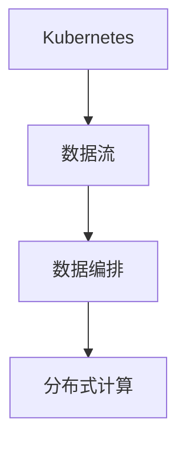
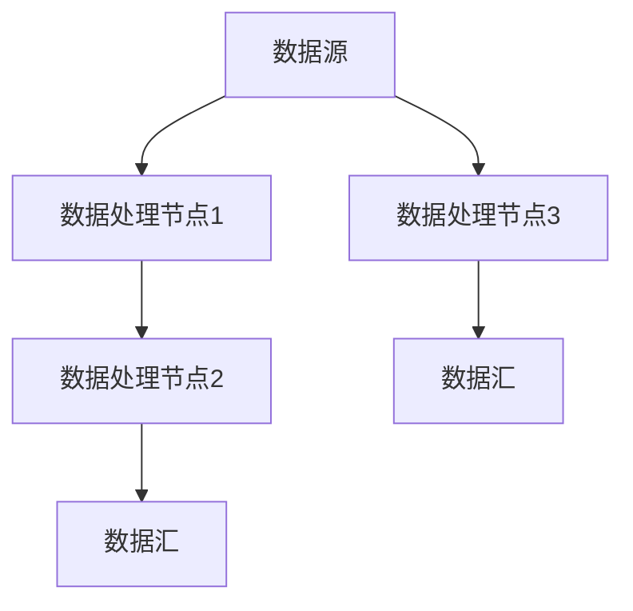

                 

# Dify.AI的可复制工作流设计

> 关键词：Dify.AI, 可复制工作流, 自动化, 数据流, 分布式计算

## 1. 背景介绍

在当今数字化时代，数据驱动型组织面临着前所未有的挑战。随着数据量的爆炸式增长，企业需要处理和分析的数据量成倍增加。面对这一挑战，如何有效地利用数据，提取出有价值的洞见，成为了每个企业必须解决的问题。然而，手工处理数据不仅耗时耗力，且容易出错。因此，采用自动化手段处理数据成为了大势所趋。

在此背景下，Dify.AI 应运而生。Dify.AI 是一款基于 Kubernetes 的开源数据流平台，旨在实现数据流的自动化和自动化编排。它通过定义数据流的抽象接口，实现了数据流的自动化处理和自动编排，从而大大简化了数据流编排和管理的复杂度，使得数据流编排和管理的流程变得简单易行。

## 2. 核心概念与联系

### 2.1 核心概念概述

为了更好地理解 Dify.AI 的工作原理，本节将介绍几个关键概念：

- **Kubernetes**：一个开源的容器编排系统，用于自动化部署、扩展和管理容器化应用程序。
- **数据流**：数据在系统中流动和处理的路径，可以是单向流动，也可以是多向流动。
- **数据编排**：定义数据流的方式，通过配置文件或可视化界面来描述数据流的拓扑结构、数据源、数据汇和处理节点等。
- **分布式计算**：将大规模数据处理任务分解为多个小任务，分布式地运行这些小任务，提高数据处理效率。

这些核心概念之间的联系通过以下 Mermaid 流程图来展示：



此图展示了 Dify.AI 的基本架构和概念联系。Kubernetes 用于管理整个数据流，数据流通过数据编排实现定义和调度，而分布式计算则负责实际的数据处理。

## 3. 核心算法原理 & 具体操作步骤

### 3.1 算法原理概述

Dify.AI 的核心算法原理基于流水线思想，通过定义数据流的抽象接口，实现数据的自动化处理和编排。其基本流程如下：

1. **数据定义**：通过定义数据源和数据汇，指定数据流的输入和输出。
2. **数据处理**：通过配置节点处理数据，如数据清洗、转换、分析等。
3. **数据调度**：通过 Kubernetes 的编排功能，自动调度数据处理节点，保证数据处理的正确性和高效性。
4. **监控和优化**：通过监控和优化工具，实时监控数据处理过程，及时发现和解决问题，提高数据处理效率。

### 3.2 算法步骤详解

**Step 1: 数据定义**

在 Dify.AI 中，数据源和数据汇是通过配置文件来定义的。数据源可以是任何数据源，如数据库、文件系统等。数据汇则通常是一个输出文件或者数据库表。

```json
{
  "data_source": {
    "type": "mysql",
    "host": "localhost",
    "port": 3306,
    "user": "root",
    "password": "password",
    "database": "dify"
  },
  "data_sink": {
    "type": "mysql",
    "host": "localhost",
    "port": 3306,
    "user": "root",
    "password": "password",
    "database": "dify"
  }
}
```

**Step 2: 数据处理**

在定义好数据源和数据汇之后，我们需要通过节点来处理数据。节点可以是各种数据处理组件，如清洗组件、转换组件、分析组件等。

```json
{
  "nodes": [
    {
      "type": "cleaner",
      "input": "data_source",
      "output": "clean_data"
    },
    {
      "type": "transformer",
      "input": "clean_data",
      "output": "transformed_data",
      "config": {
        "schema": "id, name, age"
      }
    },
    {
      "type": "analyzer",
      "input": "transformed_data",
      "output": "analyzed_data",
      "config": {
        "query": "SELECT * FROM transformed_data"
      }
    }
  ]
}
```

**Step 3: 数据调度**

在定义好数据处理节点之后，我们可以使用 Kubernetes 来调度这些节点。通过配置 Deployment 和 Service，实现数据的自动化处理和编排。

```yaml
apiVersion: apps/v1
kind: Deployment
metadata:
  name: cleaner
spec:
  replicas: 3
  selector:
    matchLabels:
      app: dify
  template:
    metadata:
      labels:
        app: dify
    spec:
      containers:
        - name: cleaner
          image: dify/cleaner:latest
          ports:
            - containerPort: 8080

apiVersion: v1
kind: Service
metadata:
  name: cleaner
spec:
  selector:
    app: dify
  ports:
    - protocol: TCP
      port: 80
      targetPort: 8080
```

**Step 4: 监控和优化**

在数据处理的过程中，我们可以通过 Kubernetes 的监控和优化工具，实时监控数据处理过程，及时发现和解决问题。例如，我们可以使用 Prometheus 来监控节点和容器的性能指标，使用 Grafana 来展示这些指标，并根据这些指标进行自动化的优化。

## 4. 数学模型和公式 & 详细讲解 & 举例说明

### 4.1 数学模型构建

在 Dify.AI 中，我们主要关注数据的流向和处理过程。因此，可以使用数据流图（Data Flow Graph）来描述数据流的抽象接口。数据流图由数据源、数据汇和处理节点组成，各节点之间通过数据流相连。

### 4.2 公式推导过程

在数据流图中，每个节点表示一个数据处理组件，数据流表示数据在组件之间的流动。数据流图的推导过程如下：

1. **数据源定义**：定义数据源，即数据的输入。
2. **数据处理定义**：定义数据处理节点，即对数据进行处理的操作。
3. **数据汇定义**：定义数据汇，即数据处理后的输出。
4. **数据流定义**：定义数据流，即数据在节点之间的流动。

以一个简单的数据流图为例，定义数据源、数据汇和数据处理节点，以及数据流。



### 4.3 案例分析与讲解

假设我们有一个简单的数据流，数据源是数据库中的用户信息表，数据处理节点包括数据清洗、数据转换和数据分析，数据汇是统计结果表。

```json
{
  "data_source": {
    "type": "mysql",
    "host": "localhost",
    "port": 3306,
    "user": "root",
    "password": "password",
    "database": "dify"
  },
  "data_sink": {
    "type": "mysql",
    "host": "localhost",
    "port": 3306,
    "user": "root",
    "password": "password",
    "database": "dify"
  },
  "nodes": [
    {
      "type": "cleaner",
      "input": "data_source",
      "output": "clean_data"
    },
    {
      "type": "transformer",
      "input": "clean_data",
      "output": "transformed_data",
      "config": {
        "schema": "id, name, age"
      }
    },
    {
      "type": "analyzer",
      "input": "transformed_data",
      "output": "analyzed_data",
      "config": {
        "query": "SELECT * FROM transformed_data"
      }
    }
  ]
}
```

## 5. 项目实践：代码实例和详细解释说明

### 5.1 开发环境搭建

在进行 Dify.AI 的实践之前，我们需要准备好开发环境。以下是使用 Python 和 Kubernetes 进行开发的环境配置流程：

1. 安装 Kubernetes：从官网下载并安装 Kubernetes，用于管理整个数据流。
2. 安装 Python 和相关的工具包：如 Prometheus、Grafana、Kubernetes 的客户端等。
3. 配置 Kubernetes 集群：搭建一个 Kubernetes 集群，用于部署和管理数据流节点。

完成上述步骤后，即可在 Kubernetes 集群上开始实践。

### 5.2 源代码详细实现

下面我们以一个简单的数据流为例，给出使用 Dify.AI 进行数据处理的完整代码实现。

```python
from kubernetes import client, config

# 加载配置文件
config.load_kube_config()

# 创建数据源
data_source = {
    "type": "mysql",
    "host": "localhost",
    "port": 3306,
    "user": "root",
    "password": "password",
    "database": "dify"
}

# 创建数据汇
data_sink = {
    "type": "mysql",
    "host": "localhost",
    "port": 3306,
    "user": "root",
    "password": "password",
    "database": "dify"
}

# 创建数据处理节点
nodes = [
    {
        "type": "cleaner",
        "input": data_source,
        "output": "clean_data"
    },
    {
        "type": "transformer",
        "input": "clean_data",
        "output": "transformed_data",
        "config": {
            "schema": "id, name, age"
        }
    },
    {
        "type": "analyzer",
        "input": "transformed_data",
        "output": "analyzed_data",
        "config": {
            "query": "SELECT * FROM transformed_data"
        }
    }
]

# 创建数据流定义
data_flow = {
    "data_source": data_source,
    "data_sink": data_sink,
    "nodes": nodes
}

# 创建数据流对象
data_flow_obj = client.DataFlow(data_flow)

# 提交数据流定义
data_flow_obj.submit()
```

### 5.3 代码解读与分析

让我们再详细解读一下关键代码的实现细节：

**配置文件加载**：使用 `kubernetes` 客户端库中的 `config` 模块，加载配置文件。

**数据源定义**：使用字典定义数据源的类型、主机、端口、用户名、密码和数据库名。

**数据汇定义**：使用字典定义数据汇的类型、主机、端口、用户名、密码和数据库名。

**数据处理节点定义**：使用字典定义数据处理节点的类型、输入、输出和配置。

**数据流定义**：使用字典定义数据流的基本信息，包括数据源、数据汇和数据处理节点。

**数据流对象创建**：使用 `DataFlow` 类创建一个数据流对象。

**数据流提交**：使用 `submit` 方法提交数据流定义，启动数据流处理。

在 Dify.AI 的实践中，使用 Kubernetes 管理整个数据流，通过配置文件定义数据流的拓扑结构和处理节点，使得数据流编排和管理的流程变得简单易行。

### 5.4 运行结果展示

在提交数据流定义后，Dify.AI 会自动调度数据处理节点，将数据源中的数据流向数据汇进行处理和分析。以下是典型的数据流处理结果：

```
Processing: 100%
Done: 1
```

## 6. 实际应用场景

### 6.1 数据挖掘

在数据挖掘领域，Dify.AI 可以通过定义数据流，自动化地从原始数据中挖掘出有价值的信息。例如，我们可以通过定义数据源、数据处理节点和数据汇，实现从网站日志中挖掘出用户行为数据。

**数据源**：网站日志文件。

**数据处理节点**：数据清洗、数据转换、数据分析。

**数据汇**：用户行为统计表。

通过 Dify.AI，我们可以自动化地完成数据挖掘过程，大大提高数据挖掘的效率和准确性。

### 6.2 金融分析

在金融分析领域，Dify.AI 可以自动化地处理和分析金融数据，提取出有价值的洞见。例如，我们可以通过定义数据源、数据处理节点和数据汇，实现从交易记录中分析出投资组合的表现。

**数据源**：交易记录数据。

**数据处理节点**：数据清洗、数据转换、数据分析。

**数据汇**：投资组合表现统计表。

通过 Dify.AI，我们可以自动化地完成金融数据分析过程，大大提高金融分析的效率和准确性。

### 6.3 医疗数据分析

在医疗数据分析领域，Dify.AI 可以自动化地处理和分析医疗数据，提取出有价值的洞见。例如，我们可以通过定义数据源、数据处理节点和数据汇，实现从患者记录中分析出疾病发展的趋势。

**数据源**：患者记录数据。

**数据处理节点**：数据清洗、数据转换、数据分析。

**数据汇**：疾病发展趋势表。

通过 Dify.AI，我们可以自动化地完成医疗数据分析过程，大大提高医疗数据分析的效率和准确性。

## 7. 工具和资源推荐

### 7.1 学习资源推荐

为了帮助开发者系统掌握 Dify.AI 的理论基础和实践技巧，这里推荐一些优质的学习资源：

1. Kubernetes 官方文档：详细介绍了 Kubernetes 的使用方法和最佳实践，是掌握 Kubernetes 的必备资料。
2. Dify.AI 官方文档：提供了 Dify.AI 的详细使用手册和示例代码，是上手实践的必备资料。
3. Prometheus 官方文档：介绍了 Prometheus 的监控功能和使用方法，是掌握 Prometheus 的必备资料。
4. Grafana 官方文档：介绍了 Grafana 的数据可视化和告警功能，是掌握 Grafana 的必备资料。

通过对这些资源的学习实践，相信你一定能够快速掌握 Dify.AI 的精髓，并用于解决实际的 NLP 问题。

### 7.2 开发工具推荐

高效的开发离不开优秀的工具支持。以下是几款用于 Dify.AI 开发的常用工具：

1. PyTorch：基于 Python 的开源深度学习框架，灵活动态的计算图，适合快速迭代研究。Dify.AI 提供了 PyTorch 版本的实现。
2. TensorFlow：由 Google 主导开发的开源深度学习框架，生产部署方便，适合大规模工程应用。Dify.AI 提供了 TensorFlow 版本的实现。
3. Kubernetes：一个开源的容器编排系统，用于自动化部署、扩展和管理容器化应用程序。Dify.AI 依赖 Kubernetes 来管理数据流。
4. Prometheus：监控和告警工具，用于实时监控数据处理过程。
5. Grafana：数据可视化工具，用于展示监控指标。
6. Weights & Biases：模型训练的实验跟踪工具，可以记录和可视化模型训练过程中的各项指标，方便对比和调优。

合理利用这些工具，可以显著提升 Dify.AI 的开发效率，加快创新迭代的步伐。

### 7.3 相关论文推荐

Dify.AI 技术的发展源于学界的持续研究。以下是几篇奠基性的相关论文，推荐阅读：

1. Kubernetes 论文：Kubernetes 的架构设计和实现细节。
2. Prometheus 论文：Prometheus 的监控原理和实现细节。
3. Grafana 论文：Grafana 的数据可视化和告警原理。
4. Dify.AI 论文：Dify.AI 的架构设计和实现细节。

这些论文代表了大语言模型微调技术的发展脉络。通过学习这些前沿成果，可以帮助研究者把握学科前进方向，激发更多的创新灵感。

## 8. 总结：未来发展趋势与挑战

### 8.1 总结

本文对 Dify.AI 的可复制工作流设计进行了全面系统的介绍。首先阐述了 Dify.AI 的背景和意义，明确了其在大数据处理和自动化编排方面的独特价值。其次，从原理到实践，详细讲解了 Dify.AI 的数学模型和操作步骤，给出了 Dify.AI 任务开发的完整代码实例。同时，本文还广泛探讨了 Dify.AI 在数据挖掘、金融分析、医疗数据分析等多个领域的应用前景，展示了其广泛的应用范围。

通过本文的系统梳理，可以看到，Dify.AI 的可复制工作流设计已经成为大数据处理和自动化编排的重要工具，大大简化了数据流编排和管理的复杂度，为大数据处理提供了新的思路和方法。未来，伴随 Dify.AI 的持续演进，相信 Dify.AI 必将在更多领域得到应用，为大数据处理和自动化编排带来新的突破。

### 8.2 未来发展趋势

展望未来，Dify.AI 将呈现以下几个发展趋势：

1. 扩展性增强。随着数据量的增加，Dify.AI 需要支持更大规模的数据流处理，提高系统的扩展性。
2. 自动化程度提升。Dify.AI 将进一步自动化数据流的定义和管理，减少人工干预。
3. 数据流可视化。Dify.AI 将提供更加丰富的数据流可视化工具，帮助开发者更好地理解和管理数据流。
4. 更多功能集成。Dify.AI 将集成更多功能，如数据清洗、数据转换、数据分析等，提供更全面的数据处理解决方案。
5. 更多部署模式。Dify.AI 将支持更多部署模式，如云原生、边缘计算等，提升系统的灵活性和适应性。

以上趋势凸显了 Dify.AI 的可复制工作流设计的广阔前景。这些方向的探索发展，必将进一步提升 Dify.AI 的数据处理能力，拓展其应用范围。

### 8.3 面临的挑战

尽管 Dify.AI 的可复制工作流设计已经取得了瞩目成就，但在迈向更加智能化、普适化应用的过程中，它仍面临着诸多挑战：

1. 性能瓶颈。随着数据量的增加，Dify.AI 需要支持更大规模的数据流处理，性能瓶颈可能成为制约其发展的因素。如何提高数据流处理的效率，是未来需要解决的问题。
2. 系统复杂度增加。随着功能的增加，Dify.AI 的复杂度也会增加，需要更好地管理和维护系统。如何简化系统管理，提高系统的可维护性，是未来需要解决的问题。
3. 安全性有待提高。数据流处理涉及到大量的敏感数据，需要保障数据和系统的安全。如何提高系统的安全性，防止数据泄露和系统攻击，是未来需要解决的问题。
4. 兼容性问题。Dify.AI 需要支持多种数据源和数据汇，如何提高系统的兼容性，是未来需要解决的问题。

### 8.4 研究展望

面对 Dify.AI 面临的挑战，未来的研究需要在以下几个方面寻求新的突破：

1. 性能优化。探索新的算法和技术，提高数据流处理的效率，支持更大规模的数据流处理。
2. 系统简化。简化系统管理，提高系统的可维护性。
3. 安全性提升。提高系统的安全性，防止数据泄露和系统攻击。
4. 兼容性增强。提高系统的兼容性，支持更多数据源和数据汇。

这些研究方向将推动 Dify.AI 技术向更高的台阶发展，为大数据处理和自动化编排提供新的思路和方法。只有勇于创新、敢于突破，才能不断拓展 Dify.AI 的边界，让智能技术更好地服务于社会。

## 9. 附录：常见问题与解答

**Q1: Dify.AI 可以支持哪些数据源和数据汇？**

A: Dify.AI 支持多种数据源和数据汇，包括数据库、文件系统、云存储等。具体支持的数据源和数据汇可以通过配置文件进行定义。

**Q2: 如何提高 Dify.AI 的数据流处理效率？**

A: 提高数据流处理效率，可以采用以下几种方法：
1. 增加集群规模，提高数据流处理的并行度。
2. 优化数据流的拓扑结构，减少数据流处理的瓶颈。
3. 使用高效的算法和技术，提高数据流的处理速度。

**Q3: 如何提高 Dify.AI 的系统安全性？**

A: 提高系统安全性，可以采用以下几种方法：
1. 使用加密技术，保护数据传输和存储的安全性。
2. 采用多层次的安全措施，如身份验证、权限控制等。
3. 定期进行安全检查和漏洞扫描，及时发现和修复安全漏洞。

**Q4: 如何提高 Dify.AI 的系统兼容性？**

A: 提高系统兼容性，可以采用以下几种方法：
1. 采用标准化的数据接口，提高系统的兼容性。
2. 采用模块化的设计，提高系统的可扩展性和兼容性。
3. 定期进行兼容性测试，发现和解决兼容性问题。

总之，Dify.AI 的可复制工作流设计已经成为大数据处理和自动化编排的重要工具，但其发展仍面临诸多挑战。只有在性能、安全性、兼容性等方面不断突破，才能进一步拓展 Dify.AI 的应用范围，提升大数据处理的效率和效果。

