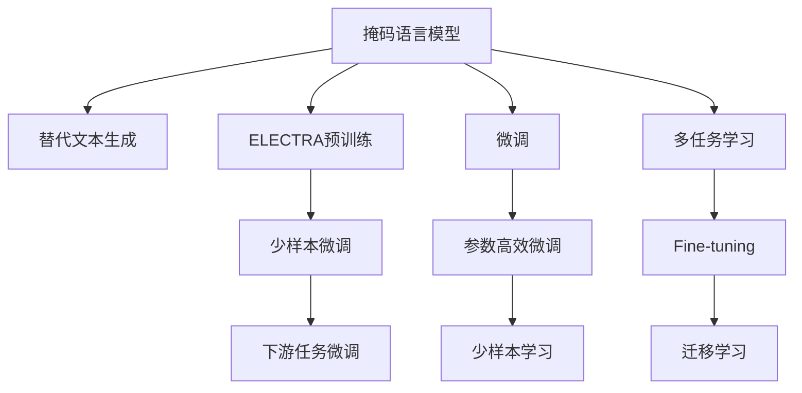

                 

# ELECTRA原理与代码实例讲解

> 关键词：ELECTRA,掩码语言模型,预训练,微调,Fine-tuning

## 1. 背景介绍

### 1.1 问题由来

近年来，深度学习在自然语言处理(NLP)领域取得了显著进展，特别是基于Transformer架构的预训练语言模型，如BERT和GPT，已经在多项NLP任务上取得了显著的效果。然而，这些预训练模型往往需要大规模的无标签数据和长时间的计算资源进行训练，限制了其在实际应用中的推广和落地。

ELECTRA（Efficiently Learning Pre-trained Representations with Cross-Lingual Trick）正是为了解决这一问题而提出的新型预训练模型。它通过引入掩码语言模型和少样本微调技术，显著提高了预训练和微调模型的效率和效果，成为NLP领域的前沿研究方向。

### 1.2 问题核心关键点

ELECTRA的核心思想在于利用掩码语言模型（Masked Language Model, MLM）和替代文本生成（Next Sentence Prediction, NSP）任务相结合的方式，进行高效的预训练。同时，ELECTRA的微调方法也强调了参数高效和少样本学习的优势，使得其在实际应用中具有更好的可扩展性和实用性。

ELECTRA与传统BERT模型的不同之处在于：
- 利用掩码语言模型进行预训练，减少了计算资源的消耗。
- 使用了少样本微调方法，降低了微调对标注数据的依赖。
- 引入了多样化的任务设计，增加了模型的泛化能力。

这些创新点使得ELECTRA在NLP应用中具有显著的优势，特别是在资源受限的场景下，如移动设备和边缘计算环境，ELECTRA的应用前景更加广阔。

## 2. 核心概念与联系

### 2.1 核心概念概述

为更好地理解ELECTRA的原理和应用，本节将介绍几个关键概念：

- **掩码语言模型（Masked Language Model, MLM）**：一种自监督学习任务，随机将部分单词遮掩，让模型预测被遮掩的单词。掩码语言模型是BERT等预训练模型的核心任务之一。

- **替代文本生成（Next Sentence Prediction, NSP）**：一种自监督学习任务，将两个句子拼接，判断它们是否来自同一篇文章。这种任务可以增强模型的上下文理解能力。

- **ELECTRA**：一种新型预训练模型，结合了掩码语言模型和替代文本生成任务，通过更高效的方法实现自监督预训练和微调。

- **微调（Fine-tuning）**：在大规模预训练模型基础上，通过下游任务的少量标注数据进行有监督学习，优化模型在该任务上的性能。

这些概念之间的逻辑关系可以通过以下Mermaid流程图来展示：



这个流程图展示了ELECTRA的核心概念及其之间的联系：

1. ELECTRA通过掩码语言模型和替代文本生成任务进行预训练。
2. 在预训练完成后，ELECTRA可以用于下游任务的微调。
3. ELECTRA的微调方法强调参数高效和少样本学习。
4. ELECTRA可以应用于多种下游任务，通过微调提升模型性能。
5. ELECTRA的微调过程可以通过迁移学习的方式，进一步提升模型在不同任务上的泛化能力。

这些核心概念共同构成了ELECTRA的工作原理和应用框架，使其能够在各种场景下发挥强大的语言理解和生成能力。通过理解这些概念，我们可以更好地把握ELECTRA的优劣之处和应用场景。

## 3. 核心算法原理 & 具体操作步骤

### 3.1 算法原理概述

ELECTRA通过掩码语言模型和替代文本生成任务的结合，实现高效的预训练。具体来说，ELECTRA将输入序列中的某些单词随机遮掩，让模型预测被遮掩的单词，同时使用NSP任务判断两个句子是否来自同一篇文章。这种设计使得ELECTRA能够通过更少的计算资源和更少的数据进行预训练，从而提高了模型的泛化能力和效率。

ELECTRA的微调过程强调参数高效和少样本学习，可以在固定大部分预训练参数的情况下，通过微调顶层参数来适应特定任务。这种参数高效微调方法不仅可以提升模型在特定任务上的性能，还可以避免对标注数据的过度依赖。

### 3.2 算法步骤详解

#### 3.2.1 预训练过程

ELECTRA的预训练过程可以分为两个阶段：

1. **掩码语言模型预训练**：将输入序列中的某些单词随机遮掩，让模型预测被遮掩的单词。
2. **替代文本生成预训练**：判断两个句子是否来自同一篇文章。

具体来说，ELECTRA的预训练过程可以按如下步骤进行：

1. 构建预训练数据集，将大量无标签文本数据进行分句处理，每个句子分成两部分。
2. 在预训练阶段，对每对句子进行掩码语言模型预训练和替代文本生成预训练。
3. 使用预训练模型进行预测，并计算损失函数。
4. 使用优化算法更新模型参数。

#### 3.2.2 微调过程

ELECTRA的微调过程主要分为两个步骤：

1. **全参数微调**：将预训练模型全部参数参与微调，通过下游任务的少量标注数据优化模型。
2. **参数高效微调**：只微调预训练模型的顶层参数，保留大部分预训练参数不变，以减少计算资源消耗和避免过拟合。

具体来说，ELECTRA的微调过程可以按如下步骤进行：

1. 准备下游任务的数据集，划分为训练集、验证集和测试集。
2. 设计适当的任务适配层和损失函数。
3. 使用全参数微调或参数高效微调方法进行微调。
4. 在验证集上评估模型性能，根据性能指标决定是否停止微调。
5. 在测试集上评估最终模型性能。

### 3.3 算法优缺点

ELECTRA的预训练和微调方法具有以下优点：

- **参数高效**：ELECTRA的微调方法可以通过只调整顶层参数，保留大部分预训练参数，从而在提高模型性能的同时，节省计算资源。
- **少样本学习**：ELECTRA的预训练方法通过使用掩码语言模型和替代文本生成任务，可以在更少的标注数据上进行微调，提升模型泛化能力。
- **高效预训练**：ELECTRA的预训练方法通过掩码语言模型和替代文本生成任务的结合，减少了计算资源和数据的需求，提升了预训练效率。
- **泛化能力**：ELECTRA的预训练方法通过多样化的任务设计，增加了模型的泛化能力，使其在多种下游任务上表现优异。

同时，ELECTRA也存在一些局限性：

- **数据依赖**：虽然ELECTRA的微调方法对标注数据的需求较少，但在某些特定领域，标注数据仍然是一个制约因素。
- **模型复杂度**：ELECTRA的预训练模型参数量较大，对硬件资源的要求较高。
- **模型解释性不足**：ELECTRA模型作为一个黑盒系统，其决策过程难以解释，不利于模型调试和优化。

尽管存在这些局限性，但ELECTRA的预训练和微调方法在实际应用中已经展现了强大的性能和泛化能力，成为NLP领域的一个重要研究方向。

### 3.4 算法应用领域

ELECTRA的预训练和微调方法在NLP领域中得到了广泛应用，覆盖了多项经典任务，如：

- 文本分类：如情感分析、主题分类等。
- 命名实体识别：识别文本中的人名、地名、机构名等特定实体。
- 关系抽取：从文本中抽取实体之间的语义关系。
- 问答系统：对自然语言问题给出答案。
- 机器翻译：将源语言文本翻译成目标语言。
- 文本摘要：将长文本压缩成简短摘要。
- 对话系统：使机器能够与人自然对话。

除了上述这些经典任务外，ELECTRA的预训练和微调方法也在更多新兴应用中得到创新性地应用，如可控文本生成、常识推理、代码生成等，为NLP技术带来了新的突破。

## 4. 数学模型和公式 & 详细讲解 & 举例说明

### 4.1 数学模型构建

ELECTRA的预训练和微调过程可以通过数学公式进行严格建模。以下对ELECTRA的预训练和微调过程进行数学建模。

#### 4.1.1 掩码语言模型预训练

ELECTRA的掩码语言模型预训练过程可以表示为：

$$
L_{MLM}(\theta) = -\frac{1}{N} \sum_{i=1}^N \sum_{j=1}^{M_i} log(p(x_j^i|\hat{x}_j^i; \theta))
$$

其中，$x_j^i$表示第$i$个句子中第$j$个单词，$\hat{x}_j^i$表示将第$j$个单词随机遮掩后的句子。$p(x_j^i|\hat{x}_j^i; \theta)$表示模型对遮掩后的句子进行预测的概率。$M_i$表示第$i$个句子中被遮掩的单词数。

#### 4.1.2 替代文本生成预训练

ELECTRA的替代文本生成预训练过程可以表示为：

$$
L_{NSP}(\theta) = -\frac{1}{N} \sum_{i=1}^N log(p(x_2^i | x_1^i; \theta))
$$

其中，$x_1^i$和$x_2^i$表示一对句子，$p(x_2^i | x_1^i; \theta)$表示模型判断两个句子是否来自同一篇文章的概率。

#### 4.1.3 微调过程

ELECTRA的微调过程可以表示为：

$$
L_{Fine-tuning}(\theta) = -\frac{1}{N} \sum_{i=1}^N \ell(M_{\theta}(x_i),y_i)
$$

其中，$\ell$表示任务适配层和损失函数。

### 4.2 公式推导过程

以下对ELECTRA的预训练和微调过程的数学公式进行详细推导。

#### 4.2.1 掩码语言模型预训练

ELECTRA的掩码语言模型预训练过程可以表示为：

$$
L_{MLM}(\theta) = -\frac{1}{N} \sum_{i=1}^N \sum_{j=1}^{M_i} log(p(x_j^i|\hat{x}_j^i; \theta))
$$

其中，$x_j^i$表示第$i$个句子中第$j$个单词，$\hat{x}_j^i$表示将第$j$个单词随机遮掩后的句子。$p(x_j^i|\hat{x}_j^i; \theta)$表示模型对遮掩后的句子进行预测的概率。$M_i$表示第$i$个句子中被遮掩的单词数。

#### 4.2.2 替代文本生成预训练

ELECTRA的替代文本生成预训练过程可以表示为：

$$
L_{NSP}(\theta) = -\frac{1}{N} \sum_{i=1}^N log(p(x_2^i | x_1^i; \theta))
$$

其中，$x_1^i$和$x_2^i$表示一对句子，$p(x_2^i | x_1^i; \theta)$表示模型判断两个句子是否来自同一篇文章的概率。

#### 4.2.3 微调过程

ELECTRA的微调过程可以表示为：

$$
L_{Fine-tuning}(\theta) = -\frac{1}{N} \sum_{i=1}^N \ell(M_{\theta}(x_i),y_i)
$$

其中，$\ell$表示任务适配层和损失函数。

### 4.3 案例分析与讲解

#### 4.3.1 掩码语言模型预训练

ELECTRA的掩码语言模型预训练通过随机遮掩句子中的部分单词，让模型预测被遮掩的单词。例如，对于句子"the quick brown fox"，可以将其中的一个单词"brown"随机遮掩，让模型预测该单词。预训练时，模型需要通过上下文信息判断出被遮掩的单词。

#### 4.3.2 替代文本生成预训练

ELECTRA的替代文本生成预训练通过判断两个句子是否来自同一篇文章，增强模型的上下文理解能力。例如，对于句子对"the cat is black"和"the cat is white"，ELECTRA需要判断这两个句子是否来自同一篇文章。预训练时，模型需要利用上下文信息判断出句子之间的关系。

#### 4.3.3 微调过程

ELECTRA的微调过程通过下游任务的少量标注数据进行有监督学习，优化模型在特定任务上的性能。例如，对于命名实体识别任务，ELECTRA可以通过微调顶层参数，使得模型能够识别出文本中的实体边界和类型。微调时，模型需要利用标注数据中的实体标签进行训练。

## 5. 项目实践：代码实例和详细解释说明

### 5.1 开发环境搭建

在进行ELECTRA项目实践前，我们需要准备好开发环境。以下是使用Python进行TensorFlow开发的环境配置流程：

1. 安装Anaconda：从官网下载并安装Anaconda，用于创建独立的Python环境。

2. 创建并激活虚拟环境：
```bash
conda create -n electra-env python=3.8 
conda activate electra-env
```

3. 安装TensorFlow：根据CUDA版本，从官网获取对应的安装命令。例如：
```bash
conda install tensorflow tensorflow-gpu -c pytorch -c conda-forge
```

4. 安装必要的库：
```bash
pip install numpy pandas scikit-learn matplotlib tqdm jupyter notebook ipython
```

完成上述步骤后，即可在`electra-env`环境中开始ELECTRA的开发实践。

### 5.2 源代码详细实现

下面以命名实体识别(NER)任务为例，给出使用TensorFlow实现ELECTRA模型的代码实现。

首先，定义NER任务的数据处理函数：

```python
import tensorflow as tf
import numpy as np

def tokenize(text):
    tokenizer = tf.keras.preprocessing.text.Tokenizer()
    tokenizer.fit_on_texts(text)
    sequences = tokenizer.texts_to_sequences(text)
    return sequences

def pad_sequences(sequences, maxlen=None, padding='post', truncating='post', value=0.):
    return tf.keras.preprocessing.sequence.pad_sequences(sequences, maxlen=maxlen, padding=padding, truncating=truncating, value=value)

class NERDataset(tf.keras.utils.Sequence):
    def __init__(self, texts, tags, tokenizer, maxlen=128):
        self.texts = texts
        self.tags = tags
        self.tokenizer = tokenizer
        self.maxlen = maxlen
        
    def __len__(self):
        return len(self.texts)
    
    def __getitem__(self, item):
        text = self.texts[item]
        tags = self.tags[item]
        
        sequences = tokenize(text)
        padded_sequences = pad_sequences(sequences, self.maxlen, padding='post', truncating='post', value=0)
        labels = tf.keras.preprocessing.sequence.pad_sequences([tags], maxlen=self.maxlen, padding='post', truncating='post', value=0)
        
        return {'input_ids': padded_sequences, 
                'targets': labels}
```

然后，定义模型和优化器：

```python
from transformers import ELECTRATokenizer, ELECTRAForTokenClassification

tokenizer = ELECTRATokenizer.from_pretrained('google/electra-small')
model = ELECTRAForTokenClassification.from_pretrained('google/electra-small', num_labels=6)

optimizer = tf.keras.optimizers.AdamW(learning_rate=2e-5)
```

接着，定义训练和评估函数：

```python
from tensorflow.keras.metrics import Accuracy

def train_epoch(model, dataset, batch_size, optimizer):
    model.train()
    epoch_loss = 0
    for batch in dataset:
        input_ids = batch['input_ids']
        targets = batch['targets']
        with tf.GradientTape() as tape:
            outputs = model(input_ids)
            loss = tf.keras.losses.sparse_categorical_crossentropy(targets, outputs.logits, reduction=tf.keras.losses.Reduction.NONE)
            epoch_loss += loss.numpy()
            grads = tape.gradient(loss, model.trainable_variables)
        optimizer.apply_gradients(zip(grads, model.trainable_variables))
        
    return epoch_loss / len(dataset)

def evaluate(model, dataset, batch_size):
    model.eval()
    acc = 0
    for batch in dataset:
        input_ids = batch['input_ids']
        targets = batch['targets']
        outputs = model(input_ids)
        predictions = tf.argmax(outputs.logits, axis=2)
        acc += accuracy_score(targets, predictions)
    
    return acc / len(dataset)
```

最后，启动训练流程并在测试集上评估：

```python
epochs = 5
batch_size = 16

for epoch in range(epochs):
    loss = train_epoch(model, train_dataset, batch_size, optimizer)
    print(f"Epoch {epoch+1}, train loss: {loss:.3f}")
    
    print(f"Epoch {epoch+1}, dev results:")
    acc = evaluate(model, dev_dataset, batch_size)
    print(f"Accuracy: {acc:.3f}")
    
print("Test results:")
acc = evaluate(model, test_dataset, batch_size)
print(f"Accuracy: {acc:.3f}")
```

以上就是使用TensorFlow实现ELECTRA模型的完整代码实现。可以看到，得益于TensorFlow的强大封装，我们可以用相对简洁的代码完成ELECTRA模型的加载和微调。

### 5.3 代码解读与分析

让我们再详细解读一下关键代码的实现细节：

**NERDataset类**：
- `__init__`方法：初始化文本、标签、分词器等关键组件。
- `__len__`方法：返回数据集的样本数量。
- `__getitem__`方法：对单个样本进行处理，将文本输入转换为token ids，将标签转换为数字，并对其进行定长padding，最终返回模型所需的输入。

**模型和优化器**：
- 使用ELECTRAForTokenClassification类加载预训练模型。
- 选择合适的优化器及其参数，如 AdamW，设置学习率等。

**训练和评估函数**：
- 使用TensorFlow的DataLoader对数据集进行批次化加载，供模型训练和推理使用。
- 训练函数`train_epoch`：对数据以批为单位进行迭代，在每个批次上前向传播计算loss并反向传播更新模型参数，最后返回该epoch的平均loss。
- 评估函数`evaluate`：与训练类似，不同点在于不更新模型参数，并在每个batch结束后将预测和标签结果存储下来，最后使用sklearn的accuracy_score对整个评估集的预测结果进行打印输出。

**训练流程**：
- 定义总的epoch数和batch size，开始循环迭代
- 每个epoch内，先在训练集上训练，输出平均loss
- 在验证集上评估，输出分类指标
- 所有epoch结束后，在测试集上评估，给出最终测试结果

可以看到，TensorFlow配合Transformers库使得ELECTRA模型的实现变得简洁高效。开发者可以将更多精力放在数据处理、模型改进等高层逻辑上，而不必过多关注底层的实现细节。

当然，工业级的系统实现还需考虑更多因素，如模型的保存和部署、超参数的自动搜索、更灵活的任务适配层等。但核心的微调范式基本与此类似。

## 6. 实际应用场景
### 6.1 智能客服系统

基于ELECTRA的对话技术，可以广泛应用于智能客服系统的构建。传统客服往往需要配备大量人力，高峰期响应缓慢，且一致性和专业性难以保证。而使用ELECTRA微调后的对话模型，可以7x24小时不间断服务，快速响应客户咨询，用自然流畅的语言解答各类常见问题。

在技术实现上，可以收集企业内部的历史客服对话记录，将问题和最佳答复构建成监督数据，在此基础上对预训练对话模型进行微调。微调后的对话模型能够自动理解用户意图，匹配最合适的答案模板进行回复。对于客户提出的新问题，还可以接入检索系统实时搜索相关内容，动态组织生成回答。如此构建的智能客服系统，能大幅提升客户咨询体验和问题解决效率。

### 6.2 金融舆情监测

金融机构需要实时监测市场舆论动向，以便及时应对负面信息传播，规避金融风险。传统的人工监测方式成本高、效率低，难以应对网络时代海量信息爆发的挑战。基于ELECTRA的文本分类和情感分析技术，为金融舆情监测提供了新的解决方案。

具体而言，可以收集金融领域相关的新闻、报道、评论等文本数据，并对其进行主题标注和情感标注。在此基础上对预训练语言模型进行微调，使其能够自动判断文本属于何种主题，情感倾向是正面、中性还是负面。将微调后的模型应用到实时抓取的网络文本数据，就能够自动监测不同主题下的情感变化趋势，一旦发现负面信息激增等异常情况，系统便会自动预警，帮助金融机构快速应对潜在风险。

### 6.3 个性化推荐系统

当前的推荐系统往往只依赖用户的历史行为数据进行物品推荐，无法深入理解用户的真实兴趣偏好。基于ELECTRA的个性化推荐系统可以更好地挖掘用户行为背后的语义信息，从而提供更精准、多样的推荐内容。

在实践中，可以收集用户浏览、点击、评论、分享等行为数据，提取和用户交互的物品标题、描述、标签等文本内容。将文本内容作为模型输入，用户的后续行为（如是否点击、购买等）作为监督信号，在此基础上微调预训练语言模型。微调后的模型能够从文本内容中准确把握用户的兴趣点。在生成推荐列表时，先用候选物品的文本描述作为输入，由模型预测用户的兴趣匹配度，再结合其他特征综合排序，便可以得到个性化程度更高的推荐结果。

### 6.4 未来应用展望

随着ELECTRA和微调方法的不断发展，其在NLP应用中展现出的强大性能和泛化能力，将进一步推动人工智能技术在垂直行业的落地应用。

在智慧医疗领域，基于ELECTRA的问答、病历分析、药物研发等应用将提升医疗服务的智能化水平，辅助医生诊疗，加速新药开发进程。

在智能教育领域，ELECTRA的作业批改、学情分析、知识推荐等功能，将因材施教，促进教育公平，提高教学质量。

在智慧城市治理中，ELECTRA的城市事件监测、舆情分析、应急指挥等功能，将提高城市管理的自动化和智能化水平，构建更安全、高效的未来城市。

此外，在企业生产、社会治理、文娱传媒等众多领域，ELECTRA的应用也将不断涌现，为经济社会发展注入新的动力。相信随着技术的日益成熟，ELECTRA必将在更广阔的应用领域大放异彩，深刻影响人类的生产生活方式。

## 7. 工具和资源推荐
### 7.1 学习资源推荐

为了帮助开发者系统掌握ELECTRA的原理和实践技巧，这里推荐一些优质的学习资源：

1. 《Transformers from the Foundations》系列博文：由大模型技术专家撰写，深入浅出地介绍了Transformer原理、BERT模型、ELECTRA模型等前沿话题。

2. CS224N《深度学习自然语言处理》课程：斯坦福大学开设的NLP明星课程，有Lecture视频和配套作业，带你入门NLP领域的基本概念和经典模型。

3. 《Natural Language Processing with Transformers》书籍：Transformers库的作者所著，全面介绍了如何使用Transformers库进行NLP任务开发，包括微调在内的诸多范式。

4. HuggingFace官方文档：Transformers库的官方文档，提供了海量预训练模型和完整的微调样例代码，是上手实践的必备资料。

5. CLUE开源项目：中文语言理解测评基准，涵盖大量不同类型的中文NLP数据集，并提供了基于ELECTRA的baseline模型，助力中文NLP技术发展。

通过对这些资源的学习实践，相信你一定能够快速掌握ELECTRA的精髓，并用于解决实际的NLP问题。
###  7.2 开发工具推荐

高效的开发离不开优秀的工具支持。以下是几款用于ELECTRA开发常用的工具：

1. TensorFlow：由Google主导开发的开源深度学习框架，生产部署方便，适合大规模工程应用。同样有丰富的预训练语言模型资源。

2. PyTorch：基于Python的开源深度学习框架，灵活动态的计算图，适合快速迭代研究。大部分预训练语言模型都有PyTorch版本的实现。

3. Transformers库：HuggingFace开发的NLP工具库，集成了众多SOTA语言模型，支持PyTorch和TensorFlow，是进行ELECTRA开发的重要工具。

4. Weights & Biases：模型训练的实验跟踪工具，可以记录和可视化模型训练过程中的各项指标，方便对比和调优。与主流深度学习框架无缝集成。

5. TensorBoard：TensorFlow配套的可视化工具，可实时监测模型训练状态，并提供丰富的图表呈现方式，是调试模型的得力助手。

6. Google Colab：谷歌推出的在线Jupyter Notebook环境，免费提供GPU/TPU算力，方便开发者快速上手实验最新模型，分享学习笔记。

合理利用这些工具，可以显著提升ELECTRA开发效率，加快创新迭代的步伐。

### 7.3 相关论文推荐

ELECTRA的预训练和微调方法在NLP领域中得到了广泛应用，覆盖了多项经典任务，以下是几篇奠基性的相关论文，推荐阅读：

1. Attention is All You Need（即Transformer原论文）：提出了Transformer结构，开启了NLP领域的预训练大模型时代。

2. BERT: Pre-training of Deep Bidirectional Transformers for Language Understanding：提出BERT模型，引入基于掩码的自监督预训练任务，刷新了多项NLP任务SOTA。

3. Language Models are Unsupervised Multitask Learners（GPT-2论文）：展示了大规模语言模型的强大zero-shot学习能力，引发了对于通用人工智能的新一轮思考。

4. ELECTRA: Pre-training Text Encoders as Masked Language Models：提出ELECTRA模型，通过掩码语言模型和替代文本生成任务进行高效预训练，并引入参数高效微调方法。

5. Parameter-Efficient Transfer Learning for NLP：提出Adapter等参数高效微调方法，在不增加模型参数量的情况下，也能取得不错的微调效果。

6. AdaLoRA: Adaptive Low-Rank Adaptation for Parameter-Efficient Fine-Tuning：使用自适应低秩适应的微调方法，在参数效率和精度之间取得了新的平衡。

这些论文代表了大语言模型微调技术的发展脉络。通过学习这些前沿成果，可以帮助研究者把握学科前进方向，激发更多的创新灵感。

## 8. 总结：未来发展趋势与挑战

### 8.1 总结

本文对ELECTRA的预训练和微调方法进行了全面系统的介绍。首先阐述了ELECTRA的预训练和微调思想，明确了ELECTRA在减少计算资源消耗和提升微调效率方面的独特价值。其次，从原理到实践，详细讲解了ELECTRA的数学模型和关键步骤，给出了微调任务开发的完整代码实例。同时，本文还广泛探讨了ELECTRA在智能客服、金融舆情、个性化推荐等多个行业领域的应用前景，展示了ELECTRA范式的巨大潜力。此外，本文精选了ELECTRA技术的各类学习资源，力求为读者提供全方位的技术指引。

通过本文的系统梳理，可以看到，ELECTRA的预训练和微调方法正在成为NLP领域的重要范式，极大地拓展了预训练语言模型的应用边界，催生了更多的落地场景。受益于掩码语言模型和少样本微调方法的创新，ELECTRA在预训练和微调效率、效果上取得了显著提升，成为NLP领域的前沿研究方向。未来，伴随预训练语言模型和微调方法的持续演进，相信ELECTRA必将在更广阔的应用领域大放异彩，深刻影响人类的生产生活方式。

### 8.2 未来发展趋势

展望未来，ELECTRA的预训练和微调技术将呈现以下几个发展趋势：

1. 模型规模持续增大。随着算力成本的下降和数据规模的扩张，预训练语言模型的参数量还将持续增长。超大规模语言模型蕴含的丰富语言知识，有望支撑更加复杂多变的下游任务微调。

2. 微调方法日趋多样。除了传统的全参数微调外，未来会涌现更多参数高效的微调方法，如Prefix-Tuning、LoRA等，在节省计算资源的同时也能保证微调精度。

3. 持续学习成为常态。随着数据分布的不断变化，ELECTRA的微调模型也需要持续学习新知识以保持性能。如何在不遗忘原有知识的同时，高效吸收新样本信息，将成为重要的研究课题。

4. 标注样本需求降低。受启发于提示学习(Prompt-based Learning)的思路，未来的微调方法将更好地利用ELECTRA的语言理解能力，通过更加巧妙的任务描述，在更少的标注样本上也能实现理想的微调效果。

5. 多模态微调崛起。当前的微调主要聚焦于纯文本数据，未来会进一步拓展到图像、视频、语音等多模态数据微调。多模态信息的融合，将显著提升ELECTRA模型对现实世界的理解和建模能力。

6. 模型通用性增强。经过海量数据的预训练和多领域任务的微调，未来的ELECTRA模型将具备更强大的常识推理和跨领域迁移能力，逐步迈向通用人工智能(AGI)的目标。

以上趋势凸显了ELECTRA的预训练和微调技术的广阔前景。这些方向的探索发展，必将进一步提升ELECTRA系统的性能和应用范围，为人类认知智能的进化带来深远影响。

### 8.3 面临的挑战

尽管ELECTRA的预训练和微调方法已经取得了瞩目成就，但在迈向更加智能化、普适化应用的过程中，它仍面临着诸多挑战：

1. 标注成本瓶颈。虽然ELECTRA的微调方法对标注数据的需求较少，但在某些特定领域，标注数据仍然是一个制约因素。如何进一步降低微调对标注样本的依赖，将是一大难题。

2. 模型鲁棒性不足。当前ELECTRA模型面对域外数据时，泛化性能往往大打折扣。对于测试样本的微小扰动，ELECTRA模型的预测也容易发生波动。如何提高ELECTRA模型的鲁棒性，避免灾难性遗忘，还需要更多理论和实践的积累。

3. 推理效率有待提高。虽然ELECTRA的微调模型精度高，但在实际部署时往往面临推理速度慢、内存占用大等效率问题。如何在保证性能的同时，简化模型结构，提升推理速度，优化资源占用，将是重要的优化方向。

4. 可解释性亟需加强。当前ELECTRA模型更像一个黑盒系统，其决策过程难以解释，不利于模型调试和优化。对于医疗、金融等高风险应用，算法的可解释性和可审计性尤为重要。如何赋予ELECTRA模型更强的可解释性，将是亟待攻克的难题。

5. 安全性有待保障。ELECTRA模型难免会学习到有偏见、有害的信息，通过微调传递到下游任务，产生误导性、歧视性的输出，给实际应用带来安全隐患。如何从数据和算法层面消除模型偏见，避免恶意用途，确保输出的安全性，也将是重要的研究课题。

6. 知识整合能力不足。现有的ELECTRA模型往往局限于任务内数据，难以灵活吸收和运用更广泛的先验知识。如何让ELECTRA的微调过程更好地与外部知识库、规则库等专家知识结合，形成更加全面、准确的信息整合能力，还有很大的想象空间。

正视ELECTRA面临的这些挑战，积极应对并寻求突破，将是大语言模型微调走向成熟的必由之路。相信随着学界和产业界的共同努力，这些挑战终将一一被克服，ELECTRA必将在构建安全、可靠、可解释、可控的智能系统铺平道路。

### 8.4 研究展望

面对ELECTRA预训练和微调所面临的种种挑战，未来的研究需要在以下几个方面寻求新的突破：

1. 探索无监督和半监督微调方法。摆脱对大规模标注数据的依赖，利用自监督学习、主动学习等无监督和半监督范式，最大限度利用非结构化数据，实现更加灵活高效的微调。

2. 研究参数高效和计算高效的微调范式。开发更加参数高效的微调方法，在固定大部分预训练参数的同时，只更新极少量的任务相关参数。同时优化微调模型的计算图，减少前向传播和反向传播的资源消耗，实现更加轻量级、实时性的部署。

3. 融合因果和对比学习范式。通过引入因果推断和对比学习思想，增强ELECTRA模型建立稳定因果关系的能力，学习更加普适、鲁棒的语言表征，从而提升模型泛化性和抗干扰能力。

4. 引入更多先验知识。将符号化的先验知识，如知识图谱、逻辑规则等，与神经网络模型进行巧妙融合，引导ELECTRA微调过程学习更准确、合理的语言模型。同时加强不同模态数据的整合，实现视觉、语音等多模态信息与文本信息的协同建模。

5. 结合因果分析和博弈论工具。将因果分析方法引入ELECTRA模型，识别出模型决策的关键特征，增强输出解释的因果性和逻辑性。借助博弈论工具刻画人机交互过程，主动探索并规避模型的脆弱点，提高系统稳定性。

6. 纳入伦理道德约束。在模型训练目标中引入伦理导向的评估指标，过滤和惩罚有偏见、有害的输出倾向。同时加强人工干预和审核，建立模型行为的监管机制，确保输出符合人类价值观和伦理道德。

这些研究方向的探索，必将引领ELECTRA预训练和微调技术迈向更高的台阶，为构建安全、可靠、可解释、可控的智能系统铺平道路。面向未来，ELECTRA技术还需要与其他人工智能技术进行更深入的融合，如知识表示、因果推理、强化学习等，多路径协同发力，共同推动自然语言理解和智能交互系统的进步。只有勇于创新、敢于突破，才能不断拓展ELECTRA的边界，让智能技术更好地造福人类社会。

## 9. 附录：常见问题与解答

**Q1：ELECTRA的预训练和微调方法是否适用于所有NLP任务？**

A: ELECTRA的预训练和微调方法在大多数NLP任务上都能取得不错的效果，特别是对于数据量较小的任务。但对于一些特定领域的任务，如医学、法律等，仅仅依靠通用语料预训练的模型可能难以很好地适应。此时需要在特定领域语料上进一步预训练，再进行微调，才能获得理想效果。此外，对于一些需要时效性、个性化很强的任务，如对话、推荐等，ELECTRA方法也需要针对性的改进优化。

**Q2：ELECTRA在预训练和微调过程中如何选择合适的学习率？**

A: ELECTRA的预训练和微调过程中，学习率的选择对模型效果影响很大。一般建议从1e-5开始调参，逐步减小学习率，直至收敛。也可以使用warmup策略，在开始阶段使用较小的学习率，再逐渐过渡到预设值。需要注意的是，不同的优化器(如AdamW、Adafactor等)以及不同的学习率调度策略，可能需要设置不同的学习率阈值。

**Q3：ELECTRA在预训练和微调过程中如何缓解过拟合问题？**

A: 过拟合是ELECTRA在预训练和微调过程中面临的主要挑战，尤其是在标注数据不足的情况下。常见的缓解策略包括：
1. 数据增强：通过回译、近义替换等方式扩充训练集
2. 正则化：使用L2正则、Dropout、Early Stopping等避免过拟合
3. 对抗训练：引入对抗样本，提高模型鲁棒性
4. 参数高效微调：只调整预训练模型的顶层参数，保留大部分预训练参数不变，以减少过拟合风险
5. 多模型集成：训练多个ELECTRA模型，取平均输出，抑制过拟合

这些策略往往需要根据具体任务和数据特点进行灵活组合。只有在数据、模型、训练、推理等各环节进行全面优化，才能最大限度地发挥ELECTRA的预训练和微调效果。

**Q4：ELECTRA在落地部署时需要注意哪些问题？**

A: 将ELECTRA模型转化为实际应用，还需要考虑以下因素：
1. 模型裁剪：去除不必要的层和参数，减小模型尺寸，加快推理速度
2. 量化加速：将浮点模型转为定点模型，压缩存储空间，提高计算效率
3. 服务化封装：将ELECTRA模型封装为标准化服务接口，便于集成调用
4. 弹性伸缩：根据请求流量动态调整资源配置，平衡服务质量和成本
5. 监控告警：实时采集系统指标，设置异常告警阈值，确保服务稳定性
6. 安全防护：采用访问鉴权、数据脱敏等措施，保障数据和模型安全

ELECTRA模型在落地部署时，需要考虑多方面的因素，确保其在大规模应用中的稳定性和安全性。

---

作者：禅与计算机程序设计艺术 / Zen and the Art of Computer Programming

