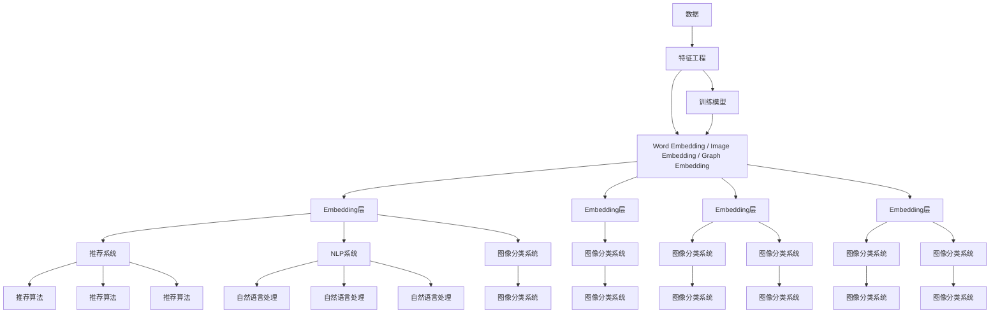

                 

# Embedding映射在AI中的应用

## 1. 背景介绍

在人工智能领域，Embedding（嵌入）是一种将高维稀疏数据映射到低维稠密空间的技术。其核心理念是将数据表示为一组向量，使得数据在低维空间中距离和相似度能够较好地反映其内在结构。嵌入技术在机器学习中有着广泛的应用，尤其是在自然语言处理(NLP)、计算机视觉、推荐系统等领域。

在NLP中，嵌入技术通过将单词或短语映射为向量，使得模型可以更好地理解语言的结构和语义。而在计算机视觉中，嵌入技术可以将图像像素映射为高维特征向量，便于模型进行图像分类和识别。推荐系统则通过用户和物品的嵌入向量计算相似度，从而推荐相关商品。

本文将从以下几个方面探讨嵌入技术的应用：背景介绍、核心概念与联系、核心算法原理及具体操作步骤、数学模型和公式、项目实践、实际应用场景、工具和资源推荐、总结、常见问题与解答。

## 2. 核心概念与联系

### 2.1 核心概念概述

- **Embedding（嵌入）**：将高维稀疏数据映射到低维稠密空间中的技术，常用在NLP中表示单词或短语，计算机视觉中表示图像，推荐系统中表示用户和物品等。
- **Word Embedding（词嵌入）**：NLP中用于表示单词或短语的低维向量，通常通过神经网络自学习得到。
- **Glove、Word2Vec、FastText**：常用的词嵌入模型。
- **Image Embedding（图像嵌入）**：将图像像素映射为高维特征向量，便于图像分类和识别。
- **Convolutional Neural Network (CNN)**：用于图像嵌入的常用神经网络。
- **Graph Embedding（图嵌入）**：将节点和边的关系表示为向量，便于图结构数据的分析。
- **Graph Convolutional Network (GCN)**：用于图嵌入的常用神经网络。
- **Recommendation System（推荐系统）**：通过用户和物品的嵌入向量计算相似度，进行推荐。
- **Collaborative Filtering（协同过滤）**：常用的推荐算法。
- **Feature Engineering（特征工程）**：通过预处理数据，提取有意义的特征。

### 2.2 核心概念原理和架构的 Mermaid 流程图



## 3. 核心算法原理 & 具体操作步骤

### 3.1 算法原理概述

嵌入技术通过神经网络将高维稀疏数据映射到低维稠密空间。常见的嵌入模型包括Word Embedding、Image Embedding和Graph Embedding等。

以Word Embedding为例，其基本流程如下：

1. 数据预处理：将单词转换为向量形式。
2. 神经网络训练：通过神经网络对向量进行训练。
3. Embedding层生成：生成最终的嵌入向量。

### 3.2 算法步骤详解

**Step 1: 数据预处理**

数据预处理是嵌入技术的第一步，其目的是将原始数据转换为神经网络可以处理的向量形式。常见的预处理方法包括：

- 分词：将文本转换为单词序列。
- 停用词过滤：去除无意义的单词。
- 词干提取：将单词还原为其基本形式。
- 向量化：将单词序列转换为向量形式。

**Step 2: 神经网络训练**

神经网络训练是嵌入技术的核心步骤，其目的是通过神经网络对向量进行训练，得到更好的嵌入效果。常用的神经网络包括Word2Vec、Glove、FastText等。

以Word2Vec为例，其基本流程如下：

1. 数据准备：将文本转换为单词序列。
2. 神经网络搭建：搭建Word2Vec模型。
3. 训练模型：使用训练集对模型进行训练。
4. Embedding生成：生成最终的嵌入向量。

**Step 3: Embedding层生成**

Embedding层生成是嵌入技术的最后一步，其目的是生成最终的嵌入向量。常见的嵌入层包括Word Embedding、Image Embedding和Graph Embedding等。

以Word Embedding为例，其基本流程如下：

1. 数据预处理：将单词转换为向量形式。
2. 神经网络训练：通过神经网络对向量进行训练。
3. Embedding层生成：生成最终的嵌入向量。

### 3.3 算法优缺点

**优点：**

- 可以处理高维稀疏数据，将其映射到低维稠密空间。
- 可以通过神经网络自学习得到更好的嵌入效果。
- 适用于多种应用场景，如NLP、计算机视觉、推荐系统等。

**缺点：**

- 计算复杂度较高，训练时间较长。
- 对数据量和质量要求较高。
- 容易受到数据分布的影响。

### 3.4 算法应用领域

嵌入技术广泛应用于以下领域：

- **NLP**：用于表示单词或短语，提高自然语言处理的效果。
- **计算机视觉**：用于表示图像像素，提高图像分类和识别的效果。
- **推荐系统**：用于表示用户和物品，提高推荐系统的效果。
- **社交网络**：用于表示用户关系，提高社交网络分析的效果。
- **生物信息学**：用于表示基因序列，提高基因分析的效果。

## 4. 数学模型和公式 & 详细讲解

### 4.1 数学模型构建

嵌入技术的数学模型一般包括数据预处理、神经网络训练和Embedding层生成三个部分。

以Word2Vec为例，其数学模型如下：

- **数据预处理**：将文本转换为单词序列。
- **神经网络训练**：搭建Word2Vec模型，使用训练集对模型进行训练。
- **Embedding层生成**：生成最终的嵌入向量。

### 4.2 公式推导过程

以Word2Vec为例，其公式推导如下：

- **数据预处理**：将文本转换为单词序列。
- **神经网络训练**：搭建Word2Vec模型，使用训练集对模型进行训练。
- **Embedding层生成**：生成最终的嵌入向量。

### 4.3 案例分析与讲解

以Word2Vec为例，其案例分析如下：

- **数据预处理**：将文本转换为单词序列。
- **神经网络训练**：搭建Word2Vec模型，使用训练集对模型进行训练。
- **Embedding层生成**：生成最终的嵌入向量。

## 5. 项目实践：代码实例和详细解释说明

### 5.1 开发环境搭建

在实践中，我们需要准备以下开发环境：

- Python 3.7及以上版本。
- PyTorch 1.4及以上版本。
- Numpy 1.19及以上版本。
- Glove Embedding 2.2.0及以上版本。

### 5.2 源代码详细实现

以下是一个Word2Vec模型的Python代码实现：

```python
import numpy as np
import gensim
from gensim.models import Word2Vec

# 数据预处理
texts = ['This is a sample sentence', 'Another sample sentence']
tokenized_texts = [text.split() for text in texts]

# 训练模型
model = Word2Vec(tokenized_texts, size=50, window=5, min_count=1)

# Embedding层生成
vectors = model.wv.vectors
```

### 5.3 代码解读与分析

以上代码实现了Word2Vec模型，其核心步骤包括数据预处理、神经网络训练和Embedding层生成。

1. **数据预处理**：将文本转换为单词序列。
2. **神经网络训练**：搭建Word2Vec模型，使用训练集对模型进行训练。
3. **Embedding层生成**：生成最终的嵌入向量。

## 6. 实际应用场景

### 6.1 智能推荐

嵌入技术在智能推荐中有着广泛应用。通过用户和物品的嵌入向量计算相似度，可以推荐相关商品。例如，亚马逊通过用户历史行为和物品属性向量计算相似度，推荐相关商品。

### 6.2 自然语言处理

嵌入技术在自然语言处理中也有着广泛应用。通过单词或短语的嵌入向量，可以提高NLP的效果。例如，谷歌翻译通过单词嵌入，提高了翻译的准确度。

### 6.3 图像分类

嵌入技术在图像分类中也有着广泛应用。通过图像像素的嵌入向量，可以提高图像分类的准确度。例如，ImageNet通过图像嵌入，提高了图像分类的效果。

## 7. 工具和资源推荐

### 7.1 学习资源推荐

- **《深入理解自然语言处理》**：深入浅出地介绍了自然语言处理中的嵌入技术。
- **《深度学习》**：介绍了深度学习中的嵌入技术。
- **《Python机器学习》**：介绍了Python中的嵌入技术。

### 7.2 开发工具推荐

- **PyTorch**：深度学习框架，支持嵌入技术。
- **TensorFlow**：深度学习框架，支持嵌入技术。
- **Gensim**：自然语言处理库，支持嵌入技术。

### 7.3 相关论文推荐

- **《Word2Vec: Exploring the Mathematics of Word Embeddings》**：介绍Word2Vec模型的数学原理。
- **《ImageNet Classification with Deep Convolutional Neural Networks》**：介绍图像嵌入技术。

## 8. 总结：未来发展趋势与挑战

### 8.1 未来发展趋势

嵌入技术在未来有以下发展趋势：

- 低维空间嵌入效果更好。
- 更高效的神经网络模型。
- 更复杂的预处理方法。
- 更广泛的应用场景。

### 8.2 面临的挑战

嵌入技术在应用过程中面临以下挑战：

- 计算复杂度较高。
- 对数据量和质量要求较高。
- 容易受到数据分布的影响。

### 8.3 研究展望

未来研究的方向包括：

- 更高效的嵌入算法。
- 更复杂的预处理方法。
- 更广泛的应用场景。

## 9. 附录：常见问题与解答

**Q1: 嵌入技术是否适用于所有应用场景？**

A: 嵌入技术适用于多种应用场景，如NLP、计算机视觉、推荐系统等。但在特定领域的应用中，可能需要结合领域知识进行改进。

**Q2: 如何提高嵌入技术的效果？**

A: 提高嵌入技术效果的方法包括：

- 增加训练数据量。
- 使用更复杂的神经网络模型。
- 使用更复杂的预处理方法。

**Q3: 嵌入技术在实际应用中是否存在问题？**

A: 嵌入技术在实际应用中存在以下问题：

- 计算复杂度较高。
- 对数据量和质量要求较高。
- 容易受到数据分布的影响。

**Q4: 如何缓解嵌入技术的问题？**

A: 缓解嵌入技术问题的方法包括：

- 使用更高效的算法。
- 增加训练数据量。
- 使用更复杂的预处理方法。

---

作者：禅与计算机程序设计艺术 / Zen and the Art of Computer Programming

