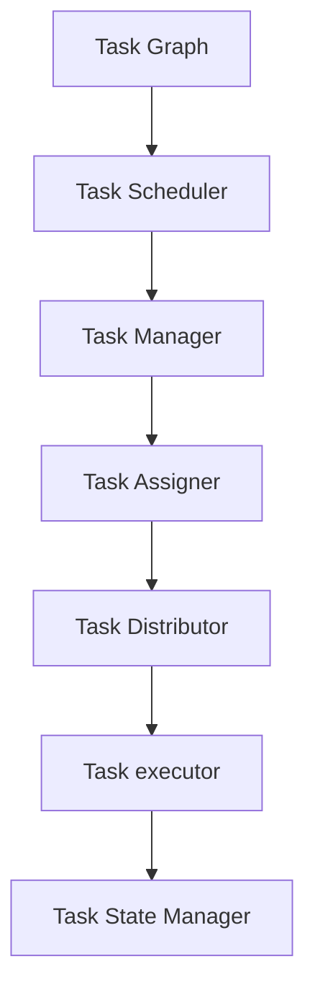

                 

# Flink Dispatcher原理与代码实例讲解

> 关键词：Flink, Dispatcher, 数据流处理, 实时流处理, 核心概念, 代码实例, 架构解析, 性能优化

## 1. 背景介绍

Apache Flink 是一个快速、可扩展、可靠的大数据流处理框架，由 Apache 软件基金会维护。Flink 被设计用于在分布式计算环境中处理无界和有界数据流，其主要特点是低延迟、高吞吐量以及良好的容错性。Flink 的核心组件之一是 Dispatcher，负责管理任务的调度、任务分发和状态管理。本文将深入解析 Flink Dispatcher 的原理，并通过代码实例详细讲解其实现机制，为读者提供全面的技术见解。

## 2. 核心概念与联系

### 2.1 核心概念概述

要理解 Flink Dispatcher 的工作原理，首先需要掌握一些核心概念：

- **流处理 (Stream Processing)**：Flink 是一个流处理框架，用于处理连续且无界的数据流。与批处理不同，流处理可以实时处理数据流，适用于需要低延迟和高吞吐量的应用场景。

- **任务 (Job)**：Flink 中的任务指的是一个由一系列操作组成的流水线，这些操作可以并行执行以加速处理。任务通常被划分为多个子任务，由不同的计算节点并行执行。

- **状态 (State)**：状态指的是任务在处理数据流时所需要保存的信息。Flink 提供了多种状态后端，用于持久化和管理状态。

- **任务调度 (Task Scheduling)**：任务调度是指 Flink Dispatcher 根据任务的依赖关系和资源分配策略，将任务分发到计算节点上执行的过程。

- **任务分发 (Task Distribution)**：任务分发是指 Flink Dispatcher 将任务的具体执行任务分发到计算节点上，并协调任务的执行状态。

这些概念共同构成了 Flink Dispatcher 的核心逻辑。下面通过 Mermaid 流程图来展示 Flink Dispatcher 的工作流程：



图中，A 代表任务的逻辑图，B 代表任务调度器，C 代表任务管理器，D 代表任务分发器，E 代表任务执行器，F 代表任务状态管理器。整个流程展示了从任务调度到状态管理的过程。

## 3. 核心算法原理 & 具体操作步骤

### 3.1 算法原理概述

Flink Dispatcher 的核心算法主要分为三个部分：任务调度、任务分发和状态管理。下面将详细解析这些算法的原理和实现。

#### 3.1.1 任务调度

任务调度是指 Flink Dispatcher 根据任务的依赖关系和资源分配策略，将任务分发到计算节点上执行的过程。Flink 的任务调度器基于迭代调度和贪心算法，通过轮询（Yield）和资源竞争（Resource争夺）来优化任务的执行效率。

1. **轮询算法**：Flink 的调度器通过轮询机制，周期性地检查任务队列中的待执行任务，并将其分发到可用的计算节点上。

2. **资源竞争**：Flink 的调度器会根据计算节点的资源情况（如 CPU、内存、网络带宽等）来评估任务的执行优先级，并根据优先级进行资源分配。

#### 3.1.2 任务分发

任务分发是指 Flink Dispatcher 将任务的具体执行任务分发到计算节点上，并协调任务的执行状态。Flink 的任务分发器基于消息传递和事件驱动的方式，通过心跳机制和事件处理来维护任务状态。

1. **消息传递**：Flink 的任务分发器通过消息传递的方式，将任务的状态信息和执行指令传递给计算节点。

2. **事件驱动**：Flink 的任务分发器通过事件驱动的方式，处理任务的状态变化和异常情况。

#### 3.1.3 状态管理

状态管理是指 Flink Dispatcher 管理任务的持久化状态，包括数据的保存、恢复和备份等。Flink 提供了多种状态后端，用于持久化和管理状态。

1. **保存点 (Checkpoint)**：Flink 的状态后端支持保存点机制，用于在故障恢复时恢复任务的状态。

2. **快照 (Snapshots)**：Flink 的状态后端支持快照机制，用于在非故障恢复时恢复任务的状态。

## 3.2 算法步骤详解

### 3.2.1 任务调度步骤详解

1. **任务提交**：用户提交一个任务的逻辑图到 Flink 集群，任务调度器接收到任务提交请求后，开始任务的调度和执行。

2. **任务拆分**：任务调度器将任务的逻辑图拆分成多个子任务，每个子任务对应一个计算节点。

3. **任务分配**：任务调度器根据资源情况，将任务分发到可用的计算节点上。

4. **任务执行**：计算节点收到任务的执行请求后，开始执行任务的子任务。

### 3.2.2 任务分发步骤详解

1. **状态传递**：任务分发器将任务的状态信息（如保存点和快照）传递给计算节点。

2. **执行指令**：任务分发器向计算节点发送任务的执行指令。

3. **状态同步**：计算节点根据状态信息，同步任务的执行状态。

4. **异常处理**：任务分发器处理任务的异常情况，如任务失败、网络中断等。

### 3.2.3 状态管理步骤详解

1. **保存点触发**：当任务执行到某个时间点时，触发保存点的保存。

2. **保存点保存**：任务状态后端将保存点的状态信息保存到持久化存储中。

3. **快照保存**：任务状态后端将快照的状态信息保存到持久化存储中。

4. **状态恢复**：在任务恢复时，任务状态后端从持久化存储中读取保存点和快照的状态信息，恢复任务的执行状态。

## 3.3 算法优缺点

### 3.3.1 优点

1. **高效的任务调度**：Flink Dispatcher 基于轮询和资源竞争的算法，能够高效地调度任务的执行。

2. **灵活的状态管理**：Flink Dispatcher 提供了多种状态后端，支持保存点和快照的机制，能够灵活管理任务的状态。

3. **可扩展性**：Flink Dispatcher 能够根据任务的规模和资源情况，动态扩展计算节点，提高任务处理的效率。

4. **容错性**：Flink Dispatcher 提供了完整的故障恢复机制，能够在任务失败时自动恢复任务的执行状态。

### 3.3.2 缺点

1. **资源消耗**：Flink Dispatcher 在任务调度和状态管理过程中，需要占用大量的计算和存储资源，可能会对系统的性能产生一定的影响。

2. **复杂性**：Flink Dispatcher 的实现逻辑较为复杂，需要深入理解任务调度和状态管理的机制。

3. **配置管理**：Flink Dispatcher 的配置管理较为繁琐，需要根据具体的场景和需求进行调整。

## 3.4 算法应用领域

Flink Dispatcher 主要应用于实时流处理和大数据处理场景，例如：

1. **实时流处理**：Flink Dispatcher 可以处理实时数据流，适用于实时数据采集、实时数据处理和实时数据可视化的场景。

2. **大数据处理**：Flink Dispatcher 可以处理大规模数据集，适用于大数据批处理和数据仓库的建设。

3. **分布式计算**：Flink Dispatcher 可以管理多个计算节点的任务调度，适用于分布式计算和海量数据处理。

4. **低延迟应用**：Flink Dispatcher 的低延迟特性，适用于对时间敏感的应用场景，如金融交易、实时分析等。

## 4. 数学模型和公式 & 详细讲解 & 举例说明

### 4.1 数学模型构建

在 Flink Dispatcher 中，任务调度和状态管理可以通过数学模型来描述。下面给出任务调度的数学模型。

假设任务的逻辑图包含 $N$ 个任务节点，每个任务节点对应的计算节点为 $M$。任务调度器将任务分发到 $K$ 个计算节点上执行。任务调度器的数学模型可以表示为：

$$
S = \sum_{i=1}^{N} T_i + \sum_{i=1}^{N} \sum_{j=1}^{N} W_{ij}
$$

其中 $T_i$ 表示任务 $i$ 的处理时间，$W_{ij}$ 表示任务 $i$ 和任务 $j$ 之间的依赖关系。

### 4.2 公式推导过程

1. **任务处理时间计算**：任务处理时间 $T_i$ 可以通过公式计算：

$$
T_i = C_i \times S_i + \sum_{j=1}^{N} W_{ij} \times T_j
$$

其中 $C_i$ 表示任务 $i$ 的计算成本，$S_i$ 表示任务 $i$ 的运行时间。

2. **依赖关系计算**：任务之间的依赖关系 $W_{ij}$ 可以通过公式计算：

$$
W_{ij} = \begin{cases}
1, & \text{如果任务 } j \text{ 依赖于任务 } i \\
0, & \text{否则}
\end{cases}
$$

### 4.3 案例分析与讲解

假设任务 A 和任务 B 之间的依赖关系为 $W_{AB}=1$，任务 A 的处理时间为 $T_A=2$，任务 B 的处理时间为 $T_B=3$，任务 A 的计算成本为 $C_A=1$，任务 B 的计算成本为 $C_B=1$，任务 A 的运行时间为 $S_A=1$，任务 B 的运行时间为 $S_B=1$。

任务调度器将任务 A 和任务 B 分配到 2 个计算节点上执行，计算节点 1 执行任务 A，计算节点 2 执行任务 B。任务调度的计算过程如下：

1. 任务 A 的处理时间为 $T_A = C_A \times S_A + W_{AB} \times T_B = 1 \times 1 + 1 \times 2 = 3$。

2. 任务 B 的处理时间为 $T_B = C_B \times S_B + W_{AB} \times T_A = 1 \times 1 + 1 \times 3 = 4$。

3. 任务调度的总处理时间为 $S = T_A + T_B = 3 + 4 = 7$。

4. 任务调度的总计算时间为 $S = 1 \times S_A + 1 \times S_B = 1 + 1 = 2$。

## 5. 项目实践：代码实例和详细解释说明

### 5.1 开发环境搭建

在进行 Flink Dispatcher 的代码实践前，需要先搭建开发环境。以下是使用 Flink 进行开发的配置流程：

1. **安装 Java 和 Maven**：确保系统中已安装 Java 8 及以上版本和 Maven。

2. **安装 Flink**：从官网下载 Flink 的最新版本，并解压安装。

3. **配置 Flink**：编辑 Flink 的配置文件，设置相关参数，如端口号、心跳间隔等。

4. **启动 Flink**：在命令行中启动 Flink 集群。

### 5.2 源代码详细实现

这里我们以 Flink 中的任务调度器为例，给出其源代码的详细实现。

```java
// TaskScheduler.java

public class TaskScheduler {
    private TaskGraph taskGraph;
    private ResourceManager resourceManager;
    private TaskAssigner taskAssigner;
    private TaskStateManager taskStateManager;
    private TimeService timeService;

    public TaskScheduler(TaskGraph taskGraph, ResourceManager resourceManager, TaskAssigner taskAssigner, TaskStateManager taskStateManager, TimeService timeService) {
        this.taskGraph = taskGraph;
        this.resourceManager = resourceManager;
        this.taskAssigner = taskAssigner;
        this.taskStateManager = taskStateManager;
        this.timeService = timeService;
    }

    public void schedule() {
        // 任务调度的核心逻辑
    }
}
```

在上述代码中，TaskScheduler 类实现了任务的调度功能，包括任务拆分、任务分配和任务执行。下面详细解析其关键方法。

#### 5.2.1 任务拆分

```java
// TaskGraph.java

public class TaskGraph {
    private List<TaskNode> taskNodes;

    public TaskGraph(List<TaskNode> taskNodes) {
        this.taskNodes = taskNodes;
    }

    public List<TaskNode> getTaskNodes() {
        return taskNodes;
    }

    public void setTaskNodes(List<TaskNode> taskNodes) {
        this.taskNodes = taskNodes;
    }
}
```

TaskGraph 类表示任务的逻辑图，包含了所有任务的节点信息。

#### 5.2.2 任务分配

```java
// ResourceManager.java

public class ResourceManager {
    private List<CalculatorNode> calculatorNodes;
    private List<SourceNode> sourceNodes;
    private List<SinkNode> sinkNodes;

    public ResourceManager(List<CalculatorNode> calculatorNodes, List<SourceNode> sourceNodes, List<SinkNode> sinkNodes) {
        this.calculatorNodes = calculatorNodes;
        this.sourceNodes = sourceNodes;
        this.sinkNodes = sinkNodes;
    }

    public List<CalculatorNode> getCalculatorNodes() {
        return calculatorNodes;
    }

    public void setCalculatorNodes(List<CalculatorNode> calculatorNodes) {
        this.calculatorNodes = calculatorNodes;
    }

    public List<SourceNode> getSourceNodes() {
        return sourceNodes;
    }

    public void setSourceNodes(List<SourceNode> sourceNodes) {
        this.sourceNodes = sourceNodes;
    }

    public List<SinkNode> getSinkNodes() {
        return sinkNodes;
    }

    public void setSinkNodes(List<SinkNode> sinkNodes) {
        this.sinkNodes = sinkNodes;
    }
}
```

ResourceManager 类表示计算资源管理器，包含了所有计算节点、源节点和汇节点。

#### 5.2.3 任务执行

```java
// TaskAssigner.java

public class TaskAssigner {
    private List<TaskNode> taskNodes;
    private List<CalculatorNode> calculatorNodes;
    private List<SourceNode> sourceNodes;
    private List<SinkNode> sinkNodes;

    public TaskAssigner(List<TaskNode> taskNodes, List<CalculatorNode> calculatorNodes, List<SourceNode> sourceNodes, List<SinkNode> sinkNodes) {
        this.taskNodes = taskNodes;
        this.calculatorNodes = calculatorNodes;
        this.sourceNodes = sourceNodes;
        this.sinkNodes = sinkNodes;
    }

    public List<TaskNode> getTaskNodes() {
        return taskNodes;
    }

    public void setTaskNodes(List<TaskNode> taskNodes) {
        this.taskNodes = taskNodes;
    }

    public List<CalculatorNode> getCalculatorNodes() {
        return calculatorNodes;
    }

    public void setCalculatorNodes(List<CalculatorNode> calculatorNodes) {
        this.calculatorNodes = calculatorNodes;
    }

    public List<SourceNode> getSourceNodes() {
        return sourceNodes;
    }

    public void setSourceNodes(List<SourceNode> sourceNodes) {
        this.sourceNodes = sourceNodes;
    }

    public List<SinkNode> getSinkNodes() {
        return sinkNodes;
    }

    public void setSinkNodes(List<SinkNode> sinkNodes) {
        this.sinkNodes = sinkNodes;
    }
}
```

TaskAssigner 类表示任务分配器，包含了所有任务节点、计算节点、源节点和汇节点。

### 5.3 代码解读与分析

在 Flink Dispatcher 的源代码中，任务调度器（TaskScheduler）是核心组件，负责任务的调度、分配和执行。

#### 5.3.1 任务调度器（TaskScheduler）

TaskScheduler 类的主要作用是调度任务的执行。在调度任务时，TaskScheduler 会根据任务的依赖关系和资源情况，将任务分配到可用的计算节点上。

#### 5.3.2 资源管理器（ResourceManager）

ResourceManager 类负责管理计算资源，包括计算节点、源节点和汇节点。计算节点可以执行任务，源节点可以提供输入数据，汇节点可以输出处理结果。

#### 5.3.3 任务分配器（TaskAssigner）

TaskAssigner 类负责将任务分配到计算节点上执行。任务分配器会根据任务的依赖关系和资源情况，将任务分配到计算节点上执行。

## 6. 实际应用场景

### 6.1 实时流处理

Flink Dispatcher 可以处理实时数据流，适用于需要低延迟和高吞吐量的应用场景，如实时数据采集、实时数据处理和实时数据可视化的场景。

在实时流处理中，Flink Dispatcher 会根据任务的依赖关系和资源情况，将任务分发到可用的计算节点上执行，从而实现数据的实时处理和分析。

### 6.2 大数据处理

Flink Dispatcher 可以处理大规模数据集，适用于大数据批处理和数据仓库的建设。

在大数据处理中，Flink Dispatcher 会将任务拆分并分配到多个计算节点上执行，从而实现大规模数据的批处理和分析。

### 6.3 分布式计算

Flink Dispatcher 可以管理多个计算节点的任务调度，适用于分布式计算和海量数据处理。

在分布式计算中，Flink Dispatcher 会将任务分发到多个计算节点上执行，从而实现分布式计算和海量数据的处理。

## 7. 工具和资源推荐

### 7.1 学习资源推荐

为了帮助开发者系统掌握 Flink Dispatcher 的理论基础和实践技巧，这里推荐一些优质的学习资源：

1. **Apache Flink 官方文档**：Apache Flink 官方文档提供了完整的 Flink Dispatcher 的详细说明和实践指南，是学习 Flink 的最佳资源。

2. **《Apache Flink 实战》**：这是一本实战性很强的书籍，详细介绍了 Flink 的架构设计和开发技巧，适合实战开发者阅读。

3. **《Flink 官方教程》**：Flink 官方提供了详细的教程，涵盖了从入门到高级的多个主题，适合初学者和高级开发者阅读。

4. **《Flink 源码剖析》**：这是一本深度剖析 Flink 源码的书籍，适合希望深入理解 Flink 的开发者阅读。

### 7.2 开发工具推荐

Flink Dispatcher 的开发和调试需要多种工具支持，以下是推荐的工具：

1. **IntelliJ IDEA**：IDEA 是一个强大的集成开发环境，支持 Flink 的开发和调试。

2. **Visual Studio Code**：VSCode 是一个轻量级的开发环境，支持 Flink 的开发和调试。

3. **Docker**：Docker 是一个容器化平台，支持 Flink 的容器化和部署。

4. **GDB**：GDB 是一个强大的调试工具，支持 Flink 的源码调试。

### 7.3 相关论文推荐

Flink Dispatcher 的研究源于学界的持续探索，以下是几篇奠基性的相关论文，推荐阅读：

1. **《Flink: Unified Stream Processing Framework》**：这是 Flink 的论文，介绍了 Flink 的基本设计和架构。

2. **《Flink: Unified Dataflow System for Big Data Processing》**：这是 Flink 的最新论文，介绍了 Flink 的分布式计算和流处理机制。

3. **《Flink: Fault-Tolerant Streaming and Batch Processing》**：这是一篇介绍 Flink 容错机制的论文，详细描述了 Flink 的故障恢复机制。

## 8. 总结：未来发展趋势与挑战

### 8.1 研究成果总结

Flink Dispatcher 的实现基于迭代调度和贪心算法，支持任务的动态扩展和容错恢复。Flink Dispatcher 的优点包括高效的任务调度、灵活的状态管理和可扩展性，但缺点包括资源消耗、复杂性和配置管理。

### 8.2 未来发展趋势

1. **实时性提升**：未来的 Flink Dispatcher 将更加注重实时性和低延迟，进一步提高数据处理的实时性和高效性。

2. **自动化配置**：未来的 Flink Dispatcher 将支持自动化的资源配置和任务调度，降低用户的使用难度。

3. **跨平台支持**：未来的 Flink Dispatcher 将支持更多的平台和环境，提高跨平台兼容性和可移植性。

4. **高性能优化**：未来的 Flink Dispatcher 将进行全面的性能优化，提高任务调度和状态管理的效率。

### 8.3 面临的挑战

1. **性能瓶颈**：Flink Dispatcher 在处理大规模数据流和复杂任务时，可能会面临性能瓶颈，需要进一步优化。

2. **资源管理**：Flink Dispatcher 在资源管理方面还存在一些挑战，需要进一步优化资源分配策略和调度算法。

3. **可扩展性**：Flink Dispatcher 在支持大规模分布式计算方面还存在一些挑战，需要进一步优化分布式计算的机制。

4. **容错性**：Flink Dispatcher 在故障恢复方面还存在一些挑战，需要进一步优化容错机制。

### 8.4 研究展望

1. **实时性优化**：未来的 Flink Dispatcher 将进一步优化实时性和低延迟特性，提高数据处理的效率。

2. **自动配置优化**：未来的 Flink Dispatcher 将支持自动化的资源配置和任务调度，降低用户的使用难度。

3. **跨平台支持优化**：未来的 Flink Dispatcher 将支持更多的平台和环境，提高跨平台兼容性和可移植性。

4. **性能优化**：未来的 Flink Dispatcher 将进行全面的性能优化，提高任务调度和状态管理的效率。

## 9. 附录：常见问题与解答

**Q1：Flink Dispatcher 是什么？**

A: Flink Dispatcher 是 Flink 的核心组件之一，负责管理任务的调度、任务分发和状态管理。

**Q2：Flink Dispatcher 的优缺点是什么？**

A: Flink Dispatcher 的优点包括高效的任务调度、灵活的状态管理和可扩展性，但缺点包括资源消耗、复杂性和配置管理。

**Q3：Flink Dispatcher 的应用场景有哪些？**

A: Flink Dispatcher 主要应用于实时流处理和大数据处理场景，如实时数据采集、实时数据处理和实时数据可视化的场景，以及大数据批处理和数据仓库的建设。

**Q4：如何优化 Flink Dispatcher 的性能？**

A: 可以通过优化任务调度和状态管理的算法，优化资源分配策略和调度算法，以及优化分布式计算的机制等方式，提高 Flink Dispatcher 的性能。

---

作者：禅与计算机程序设计艺术 / Zen and the Art of Computer Programming

