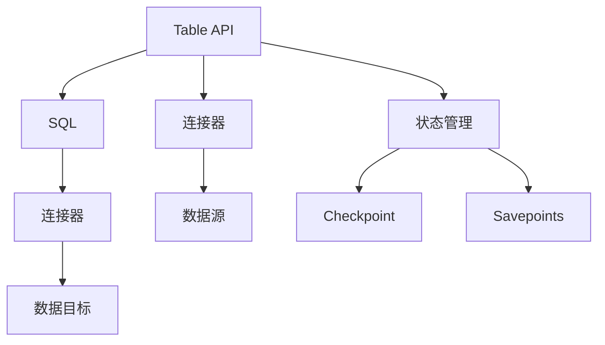

                 

# Flink Table API和SQL原理与代码实例讲解

## 1. 背景介绍

Apache Flink 是一个开源的分布式流处理框架，它提供了一致性的事务处理、高吞吐量的流数据处理能力以及简单易用的 API。Flink 提供了多种编程模型，其中 Table API 和 SQL 是两种主要的数据处理 API。Table API 提供了一组丰富的操作符来构建复杂的数据处理管道，而 SQL 则提供了一种声明式的方式，让用户可以用 SQL 语句来查询和操作数据。本文章将详细讲解 Flink Table API 和 SQL 的原理与代码实现，并结合实际例子来展示其用法。

## 2. 核心概念与联系

### 2.1 核心概念概述

- **Flink Table API**：Flink Table API 是一种用于声明式编程的 API，它提供了一组类似于 SQL 的操作符，支持高效的数据处理和状态管理。通过 Table API，用户可以轻松构建复杂的数据处理管道，实现从数据的读取、转换、聚合到输出的完整流程。

- **Flink SQL**：Flink SQL 是 Flink 提供的一种基于 SQL 的查询语言，它支持多种 SQL 标准，如 Hive、Spark SQL 和 Presto。Flink SQL 提供了一种方便、易用的方式来执行 SQL 查询和计算，并支持多种数据源和数据目标的连接。

- **连接器 (Connectors)**：Flink Table API 和 SQL 提供了多种连接器，用于连接不同的数据源和数据目标。连接器包括文件系统连接器、数据库连接器、消息队列连接器等，使得 Flink 能够处理来自不同数据源的数据。

- **状态 (State) 管理**：Flink 提供了丰富的状态管理机制，包括 Checkpoint、Savepoints 和状态后端等。通过状态管理，Flink 能够保证数据处理的准确性和可靠性，并支持容错和故障恢复。

### 2.2 核心概念原理和架构的 Mermaid 流程图



这个 Mermaid 流程图展示了 Flink Table API 和 SQL 的基本架构。Table API 和 SQL 都使用了连接器来连接数据源和数据目标，并通过状态管理机制来保证数据处理的准确性和可靠性。

## 3. 核心算法原理 & 具体操作步骤

### 3.1 算法原理概述

Flink Table API 和 SQL 的核心算法原理基于流处理和状态管理。Flink 通过将数据流划分为小批次的窗口，并在窗口上进行计算和处理。在处理过程中，Flink 会维护一个持久化的状态，以便在计算中重用和更新状态。Flink 的状态管理机制包括 Checkpoint 和 Savepoints，用于在发生故障时恢复数据处理的状态。

### 3.2 算法步骤详解

#### 3.2.1 创建 Table 对象

在 Table API 中，首先需要创建 Table 对象，用于表示要处理的数据。Table 对象可以通过连接器连接不同的数据源，如文件、数据库、消息队列等。

```java
StreamExecutionEnvironment env = StreamExecutionEnvironment.getExecutionEnvironment();
DataStream<String> input = env.addSource(new FlinkKafkaConsumer<>("input-topic", new SimpleStringSchema(), new Properties()));

// 创建 Table 对象
TableEnvironment env = TableEnvironment.create(env);
TableSchema schema = new TableSchema(new StringSchema());
env.execute("Test Table API", new TableEnvironment传媒());

// 将数据流转换为 Table
Table table = env.fromElements(input);
```

#### 3.2.2 执行 SQL 查询

在 SQL 中，可以通过 SQL 语句来查询和操作数据。SQL 查询语句可以通过 Table API 或 SQL 接口执行。

```java
// SQL 查询语句
String sql = "SELECT * FROM input";
Table result = env.executeSql(sql);

// 查询结果的输出
env.execute(result.sinkToSysOut());
```

#### 3.2.3 处理计算结果

在 Table API 和 SQL 中，计算结果可以通过不同的方式进行处理。如将其转换为数据流，或者将其写入文件或数据库。

```java
// 将计算结果转换为数据流
DataStream<String> output = result.getTable().getDataStream();

// 将计算结果写入文件
output.addSink(new FSOutputFormat<String>("output.txt", new SimpleStringEncoder<>()));
```

### 3.3 算法优缺点

#### 3.3.1 优点

- **易用性**：Table API 和 SQL 提供了类似 SQL 的操作符和语法，使得用户可以轻松构建复杂的数据处理管道，无需过多关注底层实现细节。
- **灵活性**：Table API 和 SQL 支持多种数据源和数据目标的连接，可以处理各种类型的数据。
- **高性能**：Table API 和 SQL 通过流处理和状态管理机制，支持高吞吐量和低延迟的数据处理。

#### 3.3.2 缺点

- **学习成本**：Table API 和 SQL 的学习曲线较陡，需要一定的 SQL 和流处理知识。
- **性能优化**：需要手动进行性能调优，如选择合适的连接器、优化窗口大小等。
- **状态管理**：需要维护持久化的状态，可能会占用较多的存储空间和计算资源。

### 3.4 算法应用领域

Flink Table API 和 SQL 适用于各种流数据处理场景，包括实时数据处理、离线数据处理、批处理和流处理等。它们可以处理来自各种数据源的数据，如文件、数据库、消息队列等。

## 4. 数学模型和公式 & 详细讲解 & 举例说明

### 4.1 数学模型构建

Flink Table API 和 SQL 的数学模型基于流处理和状态管理。流处理模型基于时间窗口，将数据流划分为多个小批次进行计算和处理。状态管理模型则通过维护持久化的状态，支持计算中的重用和更新。

### 4.2 公式推导过程

在 Table API 中，状态管理是通过窗口函数和状态函数实现的。窗口函数用于将数据流划分为窗口，并计算窗口内的聚合值。状态函数用于维护持久化的状态，并在计算中重用和更新状态。

#### 4.2.1 窗口函数

窗口函数用于将数据流划分为窗口，并计算窗口内的聚合值。常用的窗口函数包括 Sum、Count、Average 等。

```java
// 计算窗口内的聚合值
DataStream<WindowedValue<Long>> windowedValues = table.window(TumblingEventTimeWindows.of(Time.seconds(60)).every(Time.seconds(30)));
DataStream<Long> sum = windowedValues.map((key, value) -> value.sum());
```

#### 4.2.2 状态函数

状态函数用于维护持久化的状态，并在计算中重用和更新状态。常用的状态函数包括 MapStateFunction 和 ReduceStateFunction 等。

```java
// 维护持久化的状态
Table table = env.fromElements(input);
table
    .insertInto(new TableSink<>(env, new AddValueFunction()))
    .execute();
```

### 4.3 案例分析与讲解

#### 4.3.1 实时数据处理

假设我们有一个实时流数据，包含了用户登录信息。我们需要计算每个用户登录的次数和时长。

```java
// 创建 Table 对象
TableEnvironment env = TableEnvironment.create(env);

// 创建 TableSchema
TableSchema schema = new TableSchema(new TupleSchema(new Field("id", DataTypes.STRING()), new Field("loginTime", DataTypes.TIMESTAMP())));

// 将数据流转换为 Table
Table table = env.fromElements(input);

// 计算每个用户登录的次数和时长
table.insertInto(new TableSink<>(env, new CountFunction()));
```

#### 4.3.2 离线数据处理

假设我们有一个离线数据集，包含了用户的浏览记录。我们需要计算每个用户的浏览次数和浏览时长。

```java
// 创建 Table 对象
TableEnvironment env = TableEnvironment.create(env);

// 创建 TableSchema
TableSchema schema = new TableSchema(new TupleSchema(new Field("id", DataTypes.STRING()), new Field("visitTime", DataTypes.TIMESTAMP())));

// 将数据集转换为 Table
Table table = env.fromCollection(input);

// 计算每个用户的浏览次数和浏览时长
table.insertInto(new TableSink<>(env, new CountFunction()));
```

## 5. 项目实践：代码实例和详细解释说明

### 5.1 开发环境搭建

在使用 Flink Table API 和 SQL 之前，需要安装和配置 Flink。Flink 支持多种数据源和数据目标，如文件系统、数据库、消息队列等。用户需要根据具体场景选择合适的连接器和配置参数。

### 5.2 源代码详细实现

#### 5.2.1 创建 Table 对象

```java
// 创建 Table 对象
TableEnvironment env = TableEnvironment.create(env);

// 创建 TableSchema
TableSchema schema = new TableSchema(new TupleSchema(new Field("id", DataTypes.STRING()), new Field("loginTime", DataTypes.TIMESTAMP())));

// 将数据流转换为 Table
Table table = env.fromElements(input);
```

#### 5.2.2 执行 SQL 查询

```java
// SQL 查询语句
String sql = "SELECT * FROM input";
Table result = env.executeSql(sql);

// 查询结果的输出
env.execute(result.sinkToSysOut());
```

#### 5.2.3 处理计算结果

```java
// 将计算结果转换为数据流
DataStream<String> output = result.getTable().getDataStream();

// 将计算结果写入文件
output.addSink(new FSOutputFormat<String>("output.txt", new SimpleStringEncoder<>()));
```

### 5.3 代码解读与分析

- **TableEnvironment**：TableEnvironment 是 Table API 的核心类，它提供了 Table 对象的创建、执行和维护等方法。
- **TableSchema**：TableSchema 用于描述 Table 对象的字段和类型。
- **Table**：Table 对象表示要处理的数据，可以通过连接器连接不同的数据源。
- **TableSink**：TableSink 用于将计算结果输出到不同的数据目标，如文件、数据库等。

## 6. 实际应用场景

Flink Table API 和 SQL 适用于各种流数据处理场景，包括实时数据处理、离线数据处理、批处理和流处理等。它们可以处理来自各种数据源的数据，如文件、数据库、消息队列等。

### 6.1 实时数据处理

假设我们有一个实时流数据，包含了用户登录信息。我们需要计算每个用户登录的次数和时长。

```java
// 创建 Table 对象
TableEnvironment env = TableEnvironment.create(env);

// 创建 TableSchema
TableSchema schema = new TableSchema(new TupleSchema(new Field("id", DataTypes.STRING()), new Field("loginTime", DataTypes.TIMESTAMP())));

// 将数据流转换为 Table
Table table = env.fromElements(input);

// 计算每个用户登录的次数和时长
table.insertInto(new TableSink<>(env, new CountFunction()));
```

### 6.2 离线数据处理

假设我们有一个离线数据集，包含了用户的浏览记录。我们需要计算每个用户的浏览次数和浏览时长。

```java
// 创建 Table 对象
TableEnvironment env = TableEnvironment.create(env);

// 创建 TableSchema
TableSchema schema = new TableSchema(new TupleSchema(new Field("id", DataTypes.STRING()), new Field("visitTime", DataTypes.TIMESTAMP())));

// 将数据集转换为 Table
Table table = env.fromCollection(input);

// 计算每个用户的浏览次数和浏览时长
table.insertInto(new TableSink<>(env, new CountFunction()));
```

### 6.3 批处理

假设我们有一个批数据集，包含了用户的购买记录。我们需要计算每个用户的购买次数和购买金额。

```java
// 创建 Table 对象
TableEnvironment env = TableEnvironment.create(env);

// 创建 TableSchema
TableSchema schema = new TableSchema(new TupleSchema(new Field("id", DataTypes.STRING()), new Field("purchaseTime", DataTypes.TIMESTAMP()), new Field("amount", DataTypes.FLOAT())));

// 将数据集转换为 Table
Table table = env.fromCollection(input);

// 计算每个用户的购买次数和购买金额
table.insertInto(new TableSink<>(env, new CountFunction()));
```

## 7. 工具和资源推荐

### 7.1 学习资源推荐

为了帮助用户快速学习和掌握 Flink Table API 和 SQL，以下是一些优质的学习资源：

- **Flink 官方文档**：Flink 提供了详尽的官方文档，包括 Table API 和 SQL 的语法和示例。
- **《Apache Flink: Concepts, APIs and Implementation》书籍**：本书详细介绍了 Flink 的基本概念、API 和实现原理。
- **Flink 实战视频课程**：一些知名的视频网站提供了 Flink 实战课程，如 Bilibili、YouTube 等。

### 7.2 开发工具推荐

为了提高 Flink 的开发效率，以下是一些常用的开发工具：

- **IDEA**：IDEA 是 Java 开发的主流 IDE，支持 Flink 的开发和调试。
- **JIRA**：JIRA 是一个项目管理工具，可以帮助团队协作开发和管理 Flink 项目。
- **Docker**：Docker 是一个容器化平台，可以方便地部署和管理 Flink 应用。

### 7.3 相关论文推荐

为了深入了解 Flink 的原理和实现，以下是几篇相关的论文：

- **Stream Processing with Apache Flink**：这篇论文详细介绍了 Flink 的基本原理和设计。
- **Optimizing Stream Processing with Apache Flink**：这篇论文介绍了 Flink 的优化技术，包括资源管理和容错机制等。
- **Apache Flink: Practical Learning with Real-World Examples**：这篇论文提供了 Flink 的实际应用案例，帮助读者理解 Flink 的实践技巧。

## 8. 总结：未来发展趋势与挑战

### 8.1 研究成果总结

Flink Table API 和 SQL 作为一种声明式编程 API，提供了高效的数据处理和状态管理机制。通过 Table API 和 SQL，用户可以轻松构建复杂的数据处理管道，实现从数据的读取、转换、聚合到输出的完整流程。Flink Table API 和 SQL 在实时数据处理、离线数据处理、批处理和流处理等场景中都得到了广泛应用。

### 8.2 未来发展趋势

未来 Flink Table API 和 SQL 将朝以下几个方向发展：

- **性能优化**：随着数据量和计算资源的增长，Flink 将不断优化其计算引擎，提高处理效率和容错能力。
- **扩展性**：Flink 将支持更多的数据源和数据目标，提供更灵活的数据连接和访问机制。
- **可视化**：Flink 将提供更多的可视化工具，帮助用户更直观地理解和调试 Flink 应用。
- **生态系统**：Flink 将扩展其生态系统，包括更多连接器和插件，支持更多的场景和需求。

### 8.3 面临的挑战

Flink Table API 和 SQL 在发展过程中也面临一些挑战：

- **学习成本**：Table API 和 SQL 的学习曲线较陡，需要一定的 SQL 和流处理知识。
- **性能优化**：需要手动进行性能调优，如选择合适的连接器、优化窗口大小等。
- **状态管理**：需要维护持久化的状态，可能会占用较多的存储空间和计算资源。
- **扩展性**：需要解决如何处理大规模数据和高吞吐量计算的挑战。

### 8.4 研究展望

未来的 Flink Table API 和 SQL 研究将集中在以下几个方面：

- **自动化调优**：开发更智能的自动化调优工具，减少用户手动调优的复杂度。
- **可视化分析**：提供更丰富的可视化工具，帮助用户理解和调试 Flink 应用。
- **增强连接器**：开发更多高效的连接器，支持更多的数据源和数据目标。
- **新算法研究**：研究新的算法和优化技术，提高 Flink 的处理效率和容错能力。

## 9. 附录：常见问题与解答

**Q1：Flink Table API 和 SQL 支持哪些数据源和数据目标？**

A: Flink Table API 和 SQL 支持多种数据源和数据目标，包括文件系统、数据库、消息队列等。用户可以根据具体需求选择合适的连接器进行连接。

**Q2：Flink Table API 和 SQL 有哪些状态管理机制？**

A: Flink Table API 和 SQL 提供了多种状态管理机制，包括 Checkpoint、Savepoints 和状态后端等。这些机制可以保证数据处理的准确性和可靠性，并支持容错和故障恢复。

**Q3：Flink Table API 和 SQL 的学习曲线陡峭吗？**

A: Flink Table API 和 SQL 的学习曲线较陡峭，需要一定的 SQL 和流处理知识。但随着用户使用经验的增加，学习曲线会逐渐降低。

**Q4：Flink Table API 和 SQL 的性能如何？**

A: Flink Table API 和 SQL 的性能非常高，支持高吞吐量和低延迟的数据处理。用户可以通过优化连接器、窗口大小等参数来提高性能。

**Q5：Flink Table API 和 SQL 在实时数据处理和离线数据处理中的表现如何？**

A: Flink Table API 和 SQL 在实时数据处理和离线数据处理中都有优异的表现。它们支持流处理和批处理，可以处理各种类型的数据。

---

作者：禅与计算机程序设计艺术 / Zen and the Art of Computer Programming

