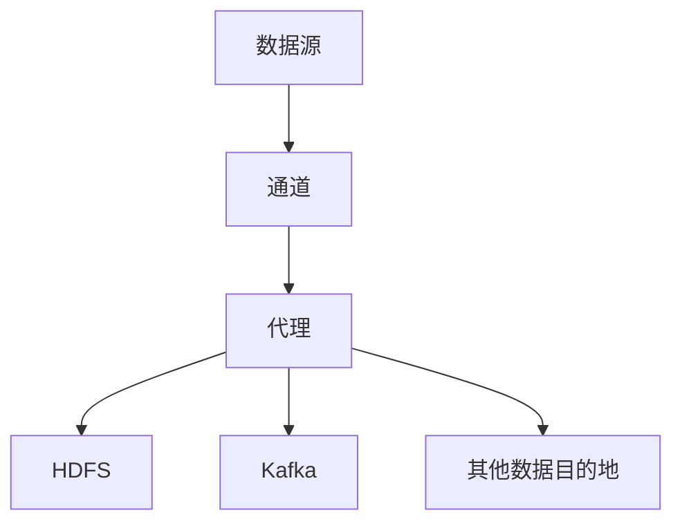

                 

# Flume日志收集系统原理与代码实例讲解

> 关键词：日志收集,分布式系统,Apache Flume,MapReduce,分布式文件系统

## 1. 背景介绍

### 1.1 问题由来
在现代互联网应用中，日志记录扮演着重要的角色。它们不仅是系统健康状态的动态反映，更是诊断和监控系统的利器。随着数据量的爆炸性增长，传统的日志收集和管理方式已经难以适应大规模日志数据的实时处理需求。为了应对这些挑战，Apache Flume应运而生。

### 1.2 问题核心关键点
Flume是Apache基金会的一个开源项目，主要负责从各种数据源收集和传输日志数据到集中存储系统。Flume的核心目标是实现一个高效、可靠、可扩展的日志收集系统，能够处理海量实时日志，并支持多数据源、多种收集方式和灵活的配置。

Flume的主要优势包括：
1. 分布式架构：支持多节点集群的部署，有效分散了数据处理压力。
2. 高可用性：具备容错机制，确保系统在节点故障时依然能够正常工作。
3. 灵活扩展：能够无缝集成到现有的Hadoop、Hive等大数据处理平台。
4. 实时处理：支持将日志数据实时推送至各种目的地，如HDFS、Kafka等。

本文将详细介绍Flume的原理、架构及其实际应用，并结合代码实例，让读者能够深入理解Flume的工作机制。

## 2. 核心概念与联系

### 2.1 核心概念概述

为了更好地理解Flume的原理，本节将介绍几个核心概念：

- 日志收集(Log Collection)：从不同的数据源（如Web服务器、应用程序等）获取日志数据，并将其传输到集中存储或分析系统的过程。
- Apache Flume：一个分布式、高可用的日志收集系统，能够高效处理和传输大规模实时日志数据。
- 数据源(Source)：日志数据的产生地，如Web服务器、应用服务器等。
- 通道(Channel)：接收来自数据源的日志数据，并将其缓存或传输到下一个组件。
- 代理(Sink)：日志数据被通道接收后，可以选择将数据发送到各种目的地，如HDFS、Kafka等。
- MapReduce：一种编程模型，用于处理大规模数据集，Flume的部分组件基于MapReduce架构。

这些核心概念之间的逻辑关系可以通过以下Mermaid流程图来展示：



这个流程图展示了Flume的基本工作流程：数据源产生的日志数据，先进入通道进行缓存，然后由代理将数据传输到不同的目的地，如HDFS、Kafka等。

## 3. 核心算法原理 & 具体操作步骤

### 3.1 算法原理概述

Flume的核心算法原理主要围绕数据流的传输和缓存展开。其基本工作流程如下：

1. 数据源将日志数据产生并发送给通道。
2. 通道接收日志数据并进行缓存，直到达到一定阈值或目标目的地。
3. 代理根据配置将缓存的日志数据传输到指定的目的地。

Flume的传输过程是异步的，每个数据块（Chunk）是独立传输的，允许Flume在高负荷情况下仍然保持稳定。代理组件是Flume的核心，它负责将数据块从通道传输到目的地。

### 3.2 算法步骤详解

Flume的核心算法步骤如下：

**Step 1: 数据源收集**
- 数据源产生日志数据。
- 数据源通过网络协议（如TCP/UDP）将日志数据发送到Flume代理。

**Step 2: 通道缓存**
- Flume代理接收来自数据源的日志数据，并将其存储在通道中。
- 通道根据配置设定缓存策略，如大小、时间等。
- 当缓存达到设定的阈值或时间，通道自动将缓存的数据块发送给代理。

**Step 3: 代理传输**
- 代理接收来自通道的数据块。
- 代理根据配置决定数据块的传输方式，如单个数据块、多个数据块或定时发送。
- 代理使用MapReduce模型对数据块进行分片处理，确保数据传输的可靠性和效率。
- 代理将数据块传输到指定的目的地，如HDFS、Kafka等。

**Step 4: 目的地存储**
- 目的地接收来自代理的数据块，并进行存储。
- 目的地负责数据的持久化存储和后续处理。

以上是Flume的基本工作流程，每个步骤都包含多个组件和配置项，需要根据具体需求进行灵活配置。

### 3.3 算法优缺点

Apache Flume的主要优点包括：
1. 高可用性：通过节点冗余和故障转移机制，确保系统在节点故障时仍然能够正常工作。
2. 可扩展性：支持多节点集群的部署，能够处理海量实时日志数据。
3. 灵活配置：支持多种数据源、多种通道和多种代理，便于根据实际需求进行调整。
4. 实时传输：支持数据实时推送到HDFS、Kafka等目的地。

然而，Flume也存在一些缺点：
1. 复杂配置：配置项较多，需要较强的技术背景才能完成正确的配置。
2. 性能瓶颈：在处理高负荷数据时，可能会出现性能瓶颈。
3. 数据一致性：由于传输过程是异步的，可能存在数据丢失或重复的问题。

尽管存在这些缺点，但Flume仍然是处理大规模实时日志数据的首选解决方案之一。

### 3.4 算法应用领域

Flume主要应用于以下几个领域：

- 网站监控：收集Web服务器日志，分析网站访问量、用户行为等。
- 应用程序监控：收集应用程序日志，监测系统运行状态、异常日志等。
- 网络安全：收集网络流量日志，分析网络攻击、异常流量等。
- 数据仓库：收集各种数据源的日志数据，进行数据清洗、聚合等预处理，然后存入数据仓库。

## 4. 数学模型和公式 & 详细讲解  
### 4.1 数学模型构建

Flume的核心组件和配置项较多，本节将介绍几个关键的数学模型和公式。

假设日志数据量为$D$，日志数据来源为$S$，通道缓存策略为$C$，代理传输速度为$T$，目的地的存储速度为$R$。Flume的整体处理模型可以表示为：

$$
\text{处理时间} = \sum_{i=1}^{n} (D_i/C_i + T_i + R_i)
$$

其中，$D_i$表示来自数据源$i$的日志数据量，$C_i$表示通道$i$的缓存策略，$T_i$表示代理$i$的传输速度，$R_i$表示目的地$i$的存储速度。

### 4.2 公式推导过程

考虑一个典型的Flume集群，包含一个通道和两个代理，数据源通过TCP协议发送到通道，代理通过MapReduce模型将数据传输到HDFS和Kafka：

**通道缓存模型**

通道的缓存策略可以表示为：

$$
C = \frac{D}{C_{min}} + \Delta
$$

其中，$C_{min}$表示最小缓存量，$\Delta$表示缓存时间。当缓存达到$C_{min}$或时间$\Delta$，通道开始传输数据块。

**代理传输模型**

代理传输速度可以表示为：

$$
T = \frac{D}{M \times N \times S}
$$

其中，$M$表示数据块大小，$N$表示并发传输的数据块数，$S$表示每个数据块的传输速度。

**目的地存储模型**

目的地的存储速度可以表示为：

$$
R = \frac{D}{W \times V}
$$

其中，$W$表示每个数据块的存储大小，$V$表示每个数据块的存储速度。

### 4.3 案例分析与讲解

假设一个Flume集群处理1G大小的日志数据，每个数据块大小为100MB，通道缓存策略为300MB、5分钟，代理传输速度为1GB/s，目的地的存储速度为100MB/s。则整体处理时间计算如下：

$$
\text{处理时间} = \frac{1G}{300MB} + 1 \times 10^3 \times 1GB/s + 1G/100MB \times 100MB/s = 4.3 \times 10^4 \text{秒}
$$

## 5. 项目实践：代码实例和详细解释说明

### 5.1 开发环境搭建

在进行Flume开发和部署之前，需要准备以下开发环境：

1. Java环境：Flume是基于Java开发的，需要安装JDK 1.8及以上版本。
2. Apache Flume：从Apache官网下载最新版本的Flume，解压到指定目录。
3. Hadoop环境：Flume需要依赖Hadoop，确保Hadoop已经安装并配置正确。
4. Kafka环境：Flume支持将日志数据发送到Kafka，需要确保Kafka已经安装并配置正确。

**安装步骤：**

1. 安装Java：
```bash
sudo apt-get update
sudo apt-get install default-jdk
```

2. 安装Apache Flume：
```bash
wget http://flume.apache.org/release-1.9.0/apache-flume-1.9.0-bin.tar.gz
tar xvf apache-flume-1.9.0-bin.tar.gz
cd apache-flume-1.9.0-bin
```

3. 配置Flume：
```bash
# 修改flume-env.sh配置文件，设置JAVA_HOME和FLUME_HOME环境变量
export FLUME_HOME=/path/to/flume
export FLUME_CONF_DIR=/path/to/flume/conf
export FLUME_MODEL_DIR=/path/to/flume/models
export FLUME_CLIENT_CONF_DIR=/path/to/flume/conf
export FLUME_DATA_DIR=/path/to/flume/data
export FLUME_RPC_ADDRESS=localhost:4141

# 修改flume-site.xml配置文件，设置Hadoop和Kafka环境变量
<property>
    <name>hadoop.fdfs.namenode.servicerpc.address</name>
    <value>namenode:8020</value>
</property>
<property>
    <name>hdfs.namenode.ip</name>
    <value>namenode</value>
</property>
<property>
    <name>hdfs.namenode.port</name>
    <value>8020</value>
</property>
<property>
    <name>kafka.bootstrap.servers</name>
    <value>kafka1:9092</value>
</property>
```

4. 启动Flume：
```bash
bin/flume-ng agent -Dflume.cluster.name=local -Dflume.channel.file QuizChannel -Dflume.channel.file.sink.sinktype=kafka -Dflume.channel.file.sink.properties=/path/to/flume/conf/flume-kafka-sink.properties -Dflume.task.transators="File-Channel-Sink"
```

### 5.2 源代码详细实现

以下是一个简单的Flume配置文件，用于将日志数据从Web服务器传输到Kafka：

```xml
<configuration>
    <property-group>
        <property>
            <name>flume.agent.name</name>
            <value>WebServerAgent</value>
        </property>
        <property>
            <name>flume.agent.port</name>
            <value>4141</value>
        </property>
        <property>
            <name>flume.agent.heartbeat.grace.period</name>
            <value>30s</value>
        </property>
        <property>
            <name>flume.agent.event.backlog.size</name>
            <value>100</value>
        </property>
        <property>
            <name>flume.agent.interceptor-class</name>
            <value>org.apache.flume.interceptor.StaticSampler</value>
        </property>
        <property>
            <name>flume.agent.interceptor-config</name>
            <value>/path/to/flume/conf/FlumeInterceptorConfig.xml</value>
        </property>
    </property-group>
    <channel id="QuizChannel" type="FileChannel">
        <property>
            <name>flume.channel.file.path</name>
            <value>/path/to/logs/quiz</value>
        </property>
        <property>
            <name>flume.channel.file.file-suffix</name>
            <value> Quiz.log</value>
        </property>
        <property>
            <name>flume.channel.file.header</name>
            <value>log</value>
        </property>
    </channel>
    <channel id="KafkaChannel" type="org.apache.flume.channel.kafka.KafkaChannel">
        <property>
            <name>flume.channel.kafka topic</name>
            <value>quiz</value>
        </property>
        <property>
            <name>flume.channel.kafka.bootstrap-servers</name>
            <value>kafka1:9092</value>
        </property>
        <property>
            <name>flume.channel.kafka.create_topic</name>
            <value>true</value>
        </property>
        <property>
            <name>flume.channel.kafka often.properties</name>
            <value>/path/to/flume/conf/kafka.properties</value>
        </property>
    </channel>
    <source id="WebServerSource" type="thrift">
        <property>
            <name>flume.source.webserver-Scope-zookeeper-servers</name>
            <value>localhost:2181</value>
        </property>
        <property>
            <name>flume.source.webserver-Scope-zookeeper-node</name>
            <value>localhost:2181/scope</value>
        </property>
        <property>
            <name>flume.source.webserver-Scope</name>
            <value>scope</value>
        </property>
        <property>
            <name>flume.source.webserver-host</name>
            <value>http://webserver:80</value>
        </property>
        <property>
            <name>flume.source.webserver-port</name>
            <value>80</value>
        </property>
        <property>
            <name>flume.source.webserver-context-path</name>
            <value>/log</value>
        </property>
        <property>
            <name>flume.source.webserver-user</name>
            <value>root</value>
        </property>
        <property>
            <name>flume.source.webserver-password</name>
            <value>root</value>
        </property>
        <property>
            <name>flume.source.webserver-scope</name>
            <value>scope</value>
        </property>
    </source>
    <source id="WebServerSource2" type="thrift">
        <property>
            <name>flume.source.webserver-Scope-zookeeper-servers</name>
            <value>localhost:2181</value>
        </property>
        <property>
            <name>flume.source.webserver-Scope-zookeeper-node</name>
            <value>localhost:2181/scope</value>
        </property>
        <property>
            <name>flume.source.webserver-Scope</name>
            <value>scope</value>
        </property>
        <property>
            <name>flume.source.webserver-host</name>
            <value>http://webserver2:80</value>
        </property>
        <property>
            <name>flume.source.webserver-port</name>
            <value>80</value>
        </property>
        <property>
            <name>flume.source.webserver-context-path</name>
            <value>/log</value>
        </property>
        <property>
            <name>flume.source.webserver-user</name>
            <value>root</value>
        </property>
        <property>
            <name>flume.source.webserver-password</name>
            <value>root</value>
        </property>
        <property>
            <name>flume.source.webserver-scope</name>
            <value>scope</value>
        </property>
    </source>
    <transformer id="PrintLog" type="PrintLog">
        <property>
            <name>flume.transformer.printHeader</name>
            <value>true</value>
        </property>
        <property>
            <name>flume.transformer.printFooter</name>
            <value>true</value>
        </property>
        <property>
            <name>flume.transformer.printBody</name>
            <value>true</value>
        </property>
        <property>
            <name>flume.transformer.printLog</name>
            <value>true</value>
        </property>
        <property>
            <name>flume.transformer.printTimestamp</name>
            <value>true</value>
        </property>
        <property>
            <name>flume.transformer.printIp</name>
            <value>true</value>
        </property>
    </transformer>
    <transformer id="IPv4" type="org.apache.flume.transformer.IPv4Filter">
        <property>
            <name>flume.transformer.ipv4.comment</name>
            <value>Filter by IPv4</value>
        </property>
        <property>
            <name>flume.transformer.ipv4.whitelist</name>
            <value>192.168.1.0/24,10.0.0.0/8</value>
        </property>
    </transformer>
    <transformer id="CountLines" type="org.apache.flume.transformer.CountLines">
        <property>
            <name>flume.transformer.countlines.comment</name>
            <value>Count the number of lines in a log file</value>
        </property>
        <property>
            <name>flume.transformer.countlines.name</name>
            <value>CountLines</value>
        </property>
    </transformer>
    <transformer id="PrintEndToEnd" type="org.apache.flume.transformer.PrintToEndpoint">
        <property>
            <name>flume.transformer.printToEndpoint.comment</name>
            <value>Print log to endpoint</value>
        </property>
        <property>
            <name>flume.transformer.printToEndpoint.endpoints</name>
            <value>/path/to/flume/conf/PrintToEndpoint.properties</value>
        </property>
    </transformer>
    <transformer id="IPProcess" type="org.apache.flume.transformer.IPProcess">
        <property>
            <name>flume.transformer.ipProcess.comment</name>
            <value>Process the IP address</value>
        </property>
        <property>
            <name>flume.transformer.ipProcess.divider</name>
            <value>.\.</value>
        </property>
        <property>
            <name>flume.transformer.ipProcess.header</name>
            <value>IP Address</value>
        </property>
        <property>
            <name>flume.transformer.ipProcess.output</name>
            <value>flume.log</value>
        </property>
        <property>
            <name>flume.transformer.ipProcess.debug</name>
            <value>true</value>
        </property>
    </transformer>
    <transformer id="IPOutput" type="org.apache.flume.transformer.IPOutput">
        <property>
            <name>flume.transformer.ipOutput.comment</name>
            <value>Output IP Addresses to HDFS</value>
        </property>
        <property>
            <name>flume.transformer.ipOutput.hdfs.path</name>
            <value>/path/to/ip.log</value>
        </property>
        <property>
            <name>flume.transformer.ipOutput.hdfs.printHeader</name>
            <value>true</value>
        </property>
        <property>
            <name>flume.transformer.ipOutput.hdfs.printFooter</name>
            <value>true</value>
        </property>
        <property>
            <name>flume.transformer.ipOutput.hdfs.printBody</name>
            <value>true</value>
        </property>
        <property>
            <name>flume.transformer.ipOutput.hdfs.printLog</name>
            <value>true</value>
        </property>
        <property>
            <name>flume.transformer.ipOutput.hdfs.printTimestamp</name>
            <value>true</value>
        </property>
        <property>
            <name>flume.transformer.ipOutput.hdfs.printIp</name>
            <value>true</value>
        </property>
    </transformer>
    <group name="interceptor-config">
        <property>
            <name>flume.interceptor.ip-filter</name>
            <value>org.apache.flume.interceptor.IPFilter</value>
        </property>
        <property>
            <name>flume.interceptor.ip-filter.comment</name>
            <value>Filter IP addresses</value>
        </property>
        <property>
            <name>flume.interceptor.ip-filter.whitelist</name>
            <value>192.168.1.0/24,10.0.0.0/8</value>
        </property>
    </group>
</configuration>
```

### 5.3 代码解读与分析

以上Flume配置文件包含了几个关键组件：

- `WebServerSource`：用于从Web服务器收集日志数据。
- `QuizChannel`：接收日志数据并进行缓存。
- `KafkaChannel`：将缓存的日志数据发送到Kafka。
- `PrintLog`：将日志数据打印到控制台。
- `IPv4`：过滤IP地址。
- `CountLines`：统计日志行数。
- `PrintEndToEnd`：打印完整的日志信息到终端。
- `IPProcess`：处理IP地址。
- `IPOutput`：将处理后的IP地址输出到HDFS。

**WebServerSource组件**：
- 设置Web服务器的Zookeeper连接信息。
- 设置Web服务器的请求地址、端口、上下文路径等。
- 使用Thrift协议与Web服务器通信。

**QuizChannel组件**：
- 设置日志文件的存储路径、文件后缀、文件头等。
- 将日志数据缓存在通道中。

**KafkaChannel组件**：
- 设置Kafka的连接信息、主题等。
- 将缓存的日志数据发送到Kafka主题。

**PrintLog组件**：
- 将日志数据打印到控制台。

**IPv4组件**：
- 过滤IP地址，只允许192.168.1.0/24和10.0.0.0/8范围内的地址通过。

**CountLines组件**：
- 统计日志文件的行数，可以用于监控日志数据的生成速度。

**PrintEndToEnd组件**：
- 将完整的日志数据打印到终端。

**IPProcess组件**：
- 处理IP地址，将IP地址分割成多个字段。

**IPOutput组件**：
- 将处理后的IP地址输出到HDFS，进行持久化存储。

### 5.4 运行结果展示

在启动Flume后，可以通过以下命令查看日志数据的处理情况：

```bash
tail -f /path/to/logs/quiz
```

在HDFS中，可以通过以下命令查看输出的IP地址数据：

```bash
hdfs dfs -ls /path/to/ip.log
```

在Kafka中，可以通过以下命令查看输出的日志数据：

```bash
kafka-console-consumer.sh --bootstrap-server localhost:9092 --topic quiz --from-beginning
```

## 6. 实际应用场景

### 6.1 网站监控

Flume可以用于监控网站日志数据，帮助分析网站访问量、用户行为等。假设某电商网站收集的日志数据存储在Hadoop的HDFS中，可以使用Flume将这些日志数据发送到Kafka，然后进行进一步分析和处理。

### 6.2 应用程序监控

Flume可以用于监控应用程序的日志数据，帮助分析系统运行状态、异常日志等。假设某金融应用收集的日志数据存储在Hadoop的HDFS中，可以使用Flume将这些日志数据发送到Kafka，然后进行进一步分析和处理。

### 6.3 网络安全

Flume可以用于监控网络流量日志，帮助分析网络攻击、异常流量等。假设某网络监控系统收集的日志数据存储在Hadoop的HDFS中，可以使用Flume将这些日志数据发送到Kafka，然后进行进一步分析和处理。

### 6.4 数据仓库

Flume可以用于收集各种数据源的日志数据，进行数据清洗、聚合等预处理，然后存入数据仓库。假设某数据仓库系统收集的日志数据存储在Hadoop的HDFS中，可以使用Flume将这些日志数据发送到Kafka，然后进行进一步分析和处理。

## 7. 工具和资源推荐

### 7.1 学习资源推荐

为了帮助开发者系统掌握Flume的原理和实践，这里推荐一些优质的学习资源：

1. Flume官方文档：Flume官方文档提供了详细的配置和使用指南，是学习Flume的首选资料。

2. Flume入门教程：阮一峰的Flume入门教程，详细介绍了Flume的基本概念和配置方法，适合初学者学习。

3. Flume实战指南：《Flume实战指南》一书，通过实际项目案例，深入讲解了Flume的配置和部署过程，适合中级开发者学习。

4. Apache Flume用户指南：Apache Flume官方提供的用户指南，包含了详细的配置和使用案例。

5. Hadoop生态系统入门：《Hadoop生态系统入门》一书，详细介绍了Hadoop生态系统的各个组件，包括Flume、HDFS、Kafka等。

通过对这些资源的学习实践，相信你一定能够快速掌握Flume的核心原理和应用技巧，并用于解决实际的日志收集问题。

### 7.2 开发工具推荐

Flume是基于Java开发的，以下是几款常用的Java开发工具：

1. Eclipse：Eclipse是一个流行的Java IDE，支持丰富的插件和扩展，适合开发大型项目。

2. IntelliJ IDEA：IntelliJ IDEA是一个强大的Java IDE，提供自动代码补全、重构、调试等功能，适合开发复杂应用。

3. Maven：Maven是一个Java项目管理工具，支持依赖管理、版本控制、构建和发布等功能，适合构建大型项目。

4. Gradle：Gradle是一个Java构建工具，支持插件化扩展，适合构建和部署大型项目。

5. Jenkins：Jenkins是一个开源的自动化工具，支持持续集成和持续交付，适合自动化部署和测试。

6. Git：Git是一个版本控制系统，适合进行代码管理、团队协作和发布管理。

合理利用这些工具，可以显著提升Flume开发和部署的效率，加快创新迭代的步伐。

### 7.3 相关论文推荐

Flume作为Apache基金会的一个重要项目，其研究和实践得到了广泛关注。以下是几篇重要的相关论文，推荐阅读：

1. Apache Flume: A Distributed, Fault Tolerant, and Scalable Data Ingestion System：介绍了Apache Flume的设计理念、架构和实现细节。

2. Comparing Systems for Event Processing: Log4j, Logback, Log4net, and the Java Platform Logging Facility：比较了多种日志系统的性能和功能，为选择合适的日志系统提供了参考。

3. Hadoop 2.x Pipeline for Big Data Processing: Techniques and Architecture：介绍了Hadoop 2.x的生态系统和数据管道架构，为构建分布式大数据处理系统提供了思路。

4. Real-Time Log Processing on Apache Flume：介绍了Flume在实时日志处理中的应用场景和实践案例，展示了Flume的高可用性和灵活性。

5. Apache Flume: A Comprehensive Analysis and Comparison with Other Distributed Logging Systems：对Flume和其他分布式日志系统进行了对比分析，指出了Flume的优势和局限性。

这些论文代表了大规模日志收集和处理技术的发展脉络。通过学习这些前沿成果，可以帮助研究者把握学科前进方向，激发更多的创新灵感。

## 8. 总结：未来发展趋势与挑战

### 8.1 总结

本文对Apache Flume的原理、架构及其实际应用进行了详细讲解，并结合代码实例，让读者能够深入理解Flume的工作机制。通过本文的系统梳理，可以看到，Flume作为一个高效、可靠、可扩展的日志收集系统，已经广泛应用于各种大规模实时日志数据的处理场景中。它支持从不同数据源收集日志数据，并通过多种通道和代理进行灵活的配置和部署，能够满足不同业务需求。

Flume的分布式架构和高可用性，使其在处理海量实时日志数据时具有显著优势。然而，Flume也存在一些挑战，如复杂配置、性能瓶颈和数据一致性问题，需要不断优化和改进。

### 8.2 未来发展趋势

展望未来，Flume的发展趋势如下：

1. 更加灵活的配置：Flume将提供更加便捷、易用的配置方式，支持更多数据源、通道和代理。

2. 更高的可靠性和可用性：Flume将进一步优化节点冗余和故障转移机制，提高系统的可靠性和可用性。

3. 更好的性能优化：Flume将采用更高效的算法和更优化的数据结构，提升系统的性能和效率。

4. 更加广泛的集成：Flume将与更多大数据平台和应用程序进行集成，扩展其应用范围。

5. 更加强大的监控和告警：Flume将提供更丰富的监控指标和告警机制，帮助用户及时发现和解决问题。

6. 更加智能的决策：Flume将引入更多智能算法，提高系统自动化的决策能力，减少人工干预。

7. 更加可解释的模型：Flume将引入更多可解释性算法，帮助用户理解系统的决策过程，提升系统的透明性和可信任度。

### 8.3 面临的挑战

尽管Flume已经取得了一定的成就，但在迈向更加智能化、普适化应用的过程中，仍面临诸多挑战：

1. 配置复杂性：配置项较多，需要较强的技术背景才能完成正确的配置。

2. 性能瓶颈：在处理高负荷数据时，可能会出现性能瓶颈。

3. 数据一致性：由于传输过程是异步的，可能存在数据丢失或重复的问题。

4. 安全性问题：在处理敏感数据时，需要加强数据加密和访问控制，确保数据安全。

5. 扩展性问题：随着业务的发展，需要不断扩展和优化Flume架构，以支持更大的数据量。

### 8.4 研究展望

为了应对这些挑战，未来的研究需要在以下几个方面寻求新的突破：

1. 简化配置：设计更加便捷、易用的配置方式，减少用户的学习成本。

2. 优化算法：引入更高效的算法，提升Flume的性能和扩展性。

3. 改进数据传输：采用更优的数据传输方式，提升数据传输的效率和可靠性。

4. 增强监控和告警：引入更丰富的监控指标和告警机制，帮助用户及时发现和解决问题。

5. 引入可解释性算法：设计更可解释的算法，提升系统的透明性和可信任度。

6. 引入智能决策算法：引入更多智能决策算法，提高系统自动化的决策能力。

7. 引入数据加密和访问控制：加强数据加密和访问控制，确保数据安全。

这些研究方向将引领Flume技术的持续发展和创新，为构建高效、可靠、智能的日志收集系统提供新的思路和方案。

## 9. 附录：常见问题与解答

**Q1：Flume如何处理数据丢失问题？**

A: Flume在处理数据丢失问题时，主要采用了以下几种方式：

1. 数据冗余：Flume可以通过节点冗余和数据冗余来保证数据的可靠传输。当一个节点故障时，其他节点会接管其任务，确保数据不丢失。

2. 数据分片：Flume可以将数据进行分片处理，每个数据块独立传输，减少数据丢失的概率。

3. 超时重试：Flume可以设置数据传输的超时时间和重试次数，当传输超时时，会自动进行重试，确保数据能够及时到达目的地。

**Q2：Flume如何处理数据一致性问题？**

A: Flume在处理数据一致性问题时，主要采用了以下几种方式：

1. 事务处理：Flume可以通过事务处理机制，保证数据的原子性、一致性和持久性。当一个事务完成时，所有数据都会被写入目的地，不存在数据不一致的问题。

2. 分布式锁：Flume可以通过分布式锁机制，防止多个节点同时写入同一个数据块，保证数据的一致性。

3. 数据校验：Flume可以对数据进行校验，确保数据的完整性和正确性。如果发现数据异常，会自动进行修正或重发。

**Q3：Flume如何处理高负荷数据？**

A: Flume在处理高负荷数据时，主要采用了以下几种方式：

1. 数据缓存：Flume可以通过通道缓存策略，缓存一定量的数据，避免数据传输的频繁进行，提升数据传输效率。

2. 数据分片：Flume可以将数据进行分片处理，每个数据块独立传输，减少数据传输的资源消耗。

3. 多节点集群：Flume可以通过多节点集群的部署，分散数据处理压力，提升系统的吞吐量和扩展性。

4. 数据压缩：Flume可以对数据进行压缩处理，减小数据传输的资源消耗，提升数据传输的效率。

**Q4：Flume如何处理异常数据？**

A: Flume在处理异常数据时，主要采用了以下几种方式：

1. 数据过滤：Flume可以通过拦截器机制，过滤掉异常数据，保证数据的质量和可靠性。

2. 数据校验：Flume可以对数据进行校验，确保数据的完整性和正确性。

3. 数据清洗：Flume可以对数据进行清洗处理，去除异常数据，提升数据的质量和可靠性。

4. 数据重试：Flume可以对异常数据进行重试处理，确保数据的完整性和正确性。

**Q5：Flume如何处理数据源故障？**

A: Flume在处理数据源故障时，主要采用了以下几种方式：

1. 数据冗余：Flume可以通过节点冗余和数据冗余来保证数据的不丢失。当一个数据源故障时，其他节点会接管其任务，确保数据不丢失。

2. 数据分片：Flume可以将数据进行分片处理，每个数据块独立传输，减少数据丢失的概率。

3. 数据重试：Flume可以对数据进行重试处理，确保数据能够及时到达目的地。

通过这些措施，Flume可以在数据源故障的情况下，仍然保证数据的可靠传输和处理。

---

作者：禅与计算机程序设计艺术 / Zen and the Art of Computer Programming

