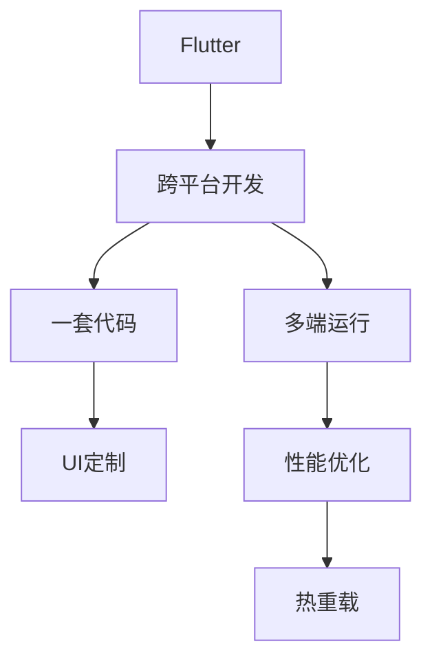

                 

# Flutter跨平台开发：一套代码，多端运行

> 关键词：Flutter, 跨平台, 一套代码, 多端运行, UI定制, 性能优化, 热重载

## 1. 背景介绍

### 1.1 问题由来
随着移动设备的多样化，无论是iOS、Android还是Windows、macOS等平台，开发者需要分别构建和维护多套应用程序，这不仅增加了开发成本，还降低了开发效率。为了解决这一问题，跨平台开发技术应运而生，旨在通过一套代码实现多平台的应用构建，降低开发复杂度，提升开发效率。

### 1.2 问题核心关键点
跨平台开发的目的是通过一套代码实现多平台的应用，以降低开发成本和提升开发效率。其主要核心点包括：
- 一套代码：开发人员只需编写一次代码，即可在不同平台上运行。
- 多端运行：生成的应用能够同时在iOS、Android、Web等多个平台上运行。
- 跨平台框架：需要选择适合的跨平台框架，以便在不同平台上实现相同的UI体验和功能。
- 平台适配：需要解决不同平台间API、UI设计和性能差异等问题。

### 1.3 问题研究意义
跨平台开发技术不仅能够显著降低开发成本和提升开发效率，还能实现代码共享，降低维护成本。此外，通过统一的开发流程，能够提高代码质量，减少bug。在应用程序的生命周期中，能够快速更新，提升用户体验。总之，跨平台开发技术是移动端开发的重要方向，具有重要的研究意义。

## 2. 核心概念与联系

### 2.1 核心概念概述

为更好地理解Flutter跨平台开发，本节将介绍几个密切相关的核心概念：

- Flutter：由Google开发的开源UI工具包，支持iOS、Android、Web等多个平台，基于React Native等技术实现一套代码多平台运行。
- 跨平台开发：通过一套代码实现多个平台上的应用开发，以降低开发成本，提升开发效率。
- UI定制：根据不同平台的特点，对UI界面进行定制，以实现一致的用户体验。
- 性能优化：针对不同平台的性能特点，进行优化，以提升应用的用户体验。
- 热重载：通过实时更新UI代码，避免频繁重启应用，以提高开发效率。

这些核心概念之间的逻辑关系可以通过以下Mermaid流程图来展示：



这个流程图展示了几项核心概念的逻辑关系：

1. Flutter作为跨平台开发的核心框架，支持一套代码多端运行。
2. 一套代码实现多端运行，包括iOS、Android、Web等多个平台。
3. 通过UI定制和性能优化，在不同平台上实现一致的用户体验。
4. 热重载技术提升了开发效率，减少了频繁重启应用的需求。

## 3. 核心算法原理 & 具体操作步骤
### 3.1 算法原理概述

Flutter跨平台开发的本质是通过一套代码实现多平台的应用构建，其实现原理包括以下几个关键点：

1. Flutter引擎：Flutter引擎基于Skia渲染引擎，支持硬件加速，能够实现高性能的UI渲染。
2. Widget系统：Flutter采用widget系统，通过组件复用和生命周期管理，实现跨平台的UI开发。
3. 热重载机制：Flutter支持热重载，能够实时更新UI代码，避免频繁重启应用，提高开发效率。

### 3.2 算法步骤详解

Flutter跨平台开发的算法步骤主要包括以下几个关键步骤：

**Step 1: 选择开发环境**
- 选择适合的开发平台，如Windows、macOS、Linux等。
- 安装Flutter SDK，包括Flutter、Dart等核心组件。
- 创建新的Flutter项目，配置开发环境。

**Step 2: 设计UI界面**
- 根据不同平台的特点，设计一致的UI界面。
- 使用Flutter提供的各种widget进行UI构建。
- 进行UI定制，提升用户体验。

**Step 3: 实现业务逻辑**
- 根据应用需求，编写Dart代码实现业务逻辑。
- 使用Flutter提供的各种API进行网络请求、数据处理等操作。
- 实现跨平台的数据存储、定时器等功能。

**Step 4: 进行性能优化**
- 针对不同平台的性能特点，进行性能优化。
- 使用Flutter提供的各种性能优化工具，如分析器、Profiler等。
- 优化UI渲染、资源加载等性能瓶颈。

**Step 5: 进行热重载测试**
- 使用热重载机制进行UI测试。
- 在开发过程中实时查看UI变化，快速发现问题。
- 提高开发效率，减少频繁重启应用的需求。

**Step 6: 打包发布**
- 进行应用打包，生成适用于不同平台的安装包。
- 发布应用到应用商店或自定义服务器。

以上是Flutter跨平台开发的一般流程。在实际应用中，还需要根据具体任务的特点，对开发流程进行优化设计，如改进UI设计、优化性能等，以进一步提升应用性能。

### 3.3 算法优缺点

Flutter跨平台开发方法具有以下优点：
1. 一套代码多端运行：通过Flutter引擎，开发者可以编写一套代码实现多平台的应用构建。
2. 性能优异：Flutter采用Skia渲染引擎，支持硬件加速，能够实现高性能的UI渲染。
3. 热重载机制：热重载机制能够实时更新UI代码，避免频繁重启应用，提高开发效率。
4. 组件复用：Flutter提供了丰富的组件，能够实现UI的快速构建和复用。

同时，该方法也存在一定的局限性：
1. 学习曲线较陡峭：Flutter作为一个新兴技术，需要一定的学习成本。
2. Dart语言生态相对较小：Dart语言作为Flutter的开发语言，生态相对较小，可能会影响第三方组件的开发和部署。
3. 组件适配问题：不同平台间的UI组件和API差异较大，需要开发人员进行适配。
4. 性能问题：由于跨平台开发，某些UI效果和性能可能不如原生应用。
5. 依赖管理：Flutter的依赖管理相对复杂，需要开发者具有一定的技术水平。

尽管存在这些局限性，但就目前而言，Flutter跨平台开发方法仍是移动端开发的重要方向。未来相关研究的重点在于如何进一步降低学习成本，提高组件复用率，同时兼顾跨平台的性能和用户体验。

### 3.4 算法应用领域

Flutter跨平台开发技术已经在多个领域得到了应用，覆盖了几乎所有常见场景，例如：

- 移动应用开发：通过Flutter实现iOS、Android等多个平台的应用构建。
- Web应用开发：使用Flutter for Web技术，实现Web端的应用构建。
- 游戏开发：通过Flutter Game Engine技术，实现跨平台的游戏开发。
- 桌面应用开发：使用Flutter for Desktop技术，实现跨平台的桌面应用开发。
- 可穿戴设备开发：通过Flutter for Wearables技术，实现跨平台可穿戴设备应用开发。

除了上述这些经典应用场景外，Flutter还创新性地应用于物联网、AR/VR、智能家居等新兴领域，为开发者提供了丰富的开发可能性。

## 4. 数学模型和公式 & 详细讲解
### 4.1 数学模型构建

Flutter跨平台开发的数学模型主要涉及以下几个关键概念：

1. 屏幕像素密度：不同平台之间的屏幕像素密度不同，需要根据不同的屏幕大小和像素密度进行适配。
2. 渲染矩阵：Flutter引擎通过渲染矩阵将UI组件转换到屏幕上，需要计算矩阵的变换。
3. 组件布局：不同平台之间的布局方式不同，需要进行适配。
4. 动画效果：不同平台之间的动画效果不同，需要进行适配。

### 4.2 公式推导过程

以屏幕像素密度适配为例，推导如下公式：

$$
\text{scaleFactor} = \frac{\text{devicePixelRatio}}{\text{pixelRatio}}
$$

其中，`devicePixelRatio`表示设备的实际像素密度，`pixelRatio`表示UI组件的像素密度。

将`scaleFactor`应用到UI组件的宽度和高度上，可以实现不同平台之间的适配：

$$
\text{width} = \text{originalWidth} \times \text{scaleFactor}
$$
$$
\text{height} = \text{originalHeight} \times \text{scaleFactor}
$$

### 4.3 案例分析与讲解

假设我们有一个UI组件，原始宽度为200像素，原始高度为100像素，UI组件的像素密度为1。

在iOS设备上，`devicePixelRatio`为2，`pixelRatio`也为1。

在Android设备上，`devicePixelRatio`为4，`pixelRatio`为2。

根据上述公式，计算iOS和Android设备上的UI组件宽度和高度：

**iOS设备：**

$$
\text{scaleFactor} = \frac{2}{1} = 2
$$
$$
\text{width} = 200 \times 2 = 400
$$
$$
\text{height} = 100 \times 2 = 200
$$

**Android设备：**

$$
\text{scaleFactor} = \frac{4}{2} = 2
$$
$$
\text{width} = 200 \times 2 = 400
$$
$$
\text{height} = 100 \times 2 = 200
$$

可以看出，在不同平台上的UI组件大小相同，实现了跨平台的适配。

## 5. 项目实践：代码实例和详细解释说明
### 5.1 开发环境搭建

在进行Flutter开发前，我们需要准备好开发环境。以下是使用Dart语言进行Flutter开发的环境配置流程：

1. 安装Flutter SDK：从官网下载并安装Flutter SDK，包括Flutter、Dart等核心组件。
2. 创建新的Flutter项目：使用Flutter CLI工具创建新的Flutter项目。
3. 配置开发环境：根据开发平台，配置相应的开发环境。

### 5.2 源代码详细实现

下面以一个简单的Flutter应用为例，给出使用Flutter进行移动应用开发的PyTorch代码实现。

首先，定义Flutter应用的UI组件：

```dart
import 'package:flutter/material.dart';

class MyWidget extends StatelessWidget {
  @override
  Widget build(BuildContext context) {
    return Scaffold(
      appBar: AppBar(title: Text('My App')),
      body: Center(
        child: Text('Hello, Flutter!'),
      ),
    );
  }
}
```

然后，定义应用的入口点：

```dart
import 'package:flutter/material.dart';

void main() {
  runApp(MyApp());
}

class MyApp extends StatelessWidget {
  @override
  Widget build(BuildContext context) {
    return MaterialApp(
      home: MyWidget(),
    );
  }
}
```

最后，运行Flutter应用：

```bash
flutter run
```

以上代码实现了基本的Flutter应用，展示了一个简单的UI界面。通过Flutter提供的widget系统，我们可以快速构建复杂的UI界面，实现跨平台的应用构建。

### 5.3 代码解读与分析

让我们再详细解读一下关键代码的实现细节：

**MyWidget类**：
- `MyWidget`类继承自`StatelessWidget`，表示一个不可变的UI组件。
- `build`方法返回一个`Scaffold`组件，包含`AppBar`和`body`两个部分。
- `AppBar`组件显示应用标题。
- `body`组件显示一个`Center`，其中包含一个`Text`组件，显示"Hello, Flutter!"。

**MyApp类**：
- `MyApp`类继承自`StatefulWidget`，表示一个可变的UI组件。
- `build`方法返回一个`MaterialApp`组件，表示整个应用。
- `home`属性设置为`MyWidget()`，表示应用的入口点。

**main函数**：
- `main`函数调用`runApp`方法，启动Flutter应用。
- `runApp`方法接受一个`StatefulWidget`类型的参数，表示应用的入口点。

通过Flutter提供的widget系统，我们可以快速构建复杂的UI界面，实现跨平台的应用构建。Flutter的widget系统基于组件复用和生命周期管理，能够实现高效的UI开发。

当然，工业级的系统实现还需考虑更多因素，如UI设计、性能优化、热重载等。但核心的跨平台开发范式基本与此类似。

## 6. 实际应用场景
### 6.1 智能客服系统

基于Flutter跨平台开发技术的智能客服系统，可以广泛应用于企业内部的客户服务场景。传统客服系统往往需要配备大量人力，高峰期响应缓慢，且一致性和专业性难以保证。而使用Flutter开发的智能客服系统，可以7x24小时不间断服务，快速响应客户咨询，用自然流畅的语言解答各类常见问题。

在技术实现上，可以收集企业内部的历史客服对话记录，将问题和最佳答复构建成监督数据，在此基础上对Flutter模型进行微调。微调后的模型能够自动理解用户意图，匹配最合适的答案模板进行回复。对于客户提出的新问题，还可以接入检索系统实时搜索相关内容，动态组织生成回答。如此构建的智能客服系统，能大幅提升客户咨询体验和问题解决效率。

### 6.2 金融舆情监测

金融机构需要实时监测市场舆论动向，以便及时应对负面信息传播，规避金融风险。传统的人工监测方式成本高、效率低，难以应对网络时代海量信息爆发的挑战。基于Flutter的文本分类和情感分析技术，为金融舆情监测提供了新的解决方案。

具体而言，可以收集金融领域相关的新闻、报道、评论等文本数据，并对其进行主题标注和情感标注。在此基础上对Flutter模型进行微调，使其能够自动判断文本属于何种主题，情感倾向是正面、中性还是负面。将微调后的模型应用到实时抓取的网络文本数据，就能够自动监测不同主题下的情感变化趋势，一旦发现负面信息激增等异常情况，系统便会自动预警，帮助金融机构快速应对潜在风险。

### 6.3 个性化推荐系统

当前的推荐系统往往只依赖用户的历史行为数据进行物品推荐，无法深入理解用户的真实兴趣偏好。基于Flutter的个性化推荐系统可以更好地挖掘用户行为背后的语义信息，从而提供更精准、多样的推荐内容。

在实践中，可以收集用户浏览、点击、评论、分享等行为数据，提取和用户交互的物品标题、描述、标签等文本内容。将文本内容作为模型输入，用户的后续行为（如是否点击、购买等）作为监督信号，在此基础上对Flutter模型进行微调。微调后的模型能够从文本内容中准确把握用户的兴趣点。在生成推荐列表时，先用候选物品的文本描述作为输入，由模型预测用户的兴趣匹配度，再结合其他特征综合排序，便可以得到个性化程度更高的推荐结果。

### 6.4 未来应用展望

随着Flutter跨平台开发技术的不断发展，基于微调范式将在更多领域得到应用，为传统行业带来变革性影响。

在智慧医疗领域，基于Flutter的问答系统、病历分析、药物研发等应用将提升医疗服务的智能化水平，辅助医生诊疗，加速新药开发进程。

在智能教育领域，Flutter的作业批改、学情分析、知识推荐等功能，将提升教学质量，因材施教，促进教育公平。

在智慧城市治理中，Flutter的应用监测、舆情分析、应急指挥等环节，将提高城市管理的自动化和智能化水平，构建更安全、高效的未来城市。

此外，在企业生产、社会治理、文娱传媒等众多领域，基于Flutter跨平台开发的人工智能应用也将不断涌现，为经济社会发展注入新的动力。相信随着技术的日益成熟，Flutter跨平台开发必将在构建人机协同的智能时代中扮演越来越重要的角色。

## 7. 工具和资源推荐
### 7.1 学习资源推荐

为了帮助开发者系统掌握Flutter跨平台开发的理论基础和实践技巧，这里推荐一些优质的学习资源：

1. Flutter官方文档：Flutter的官方文档，提供了详细的开发指南、API参考、样例代码等，是入门学习的必备资料。
2. Flutter基础教程：由Google官方提供的Flutter基础教程，涵盖Flutter的开发流程、组件复用、UI设计等核心内容。
3. Flutter in Action：Flutter实战教程，通过具体的项目案例，介绍Flutter的开发技巧和实践经验。
4. Flutter in Action 2：Flutter进阶教程，深入介绍Flutter的高级特性和优化技巧。
5. Flutter中文网：Flutter官方中文社区，提供大量的教程、问答、技术文章等资源，帮助开发者学习交流。

通过对这些资源的学习实践，相信你一定能够快速掌握Flutter跨平台开发的精髓，并用于解决实际的NLP问题。

### 7.2 开发工具推荐

高效的开发离不开优秀的工具支持。以下是几款用于Flutter跨平台开发开发的常用工具：

1. Flutter开发环境：Flutter官方提供的开发环境，支持iOS、Android、Web等多个平台。
2. Dart语言环境：Dart语言作为Flutter的开发语言，需要安装相应的开发环境。
3. Flutter for Web：Flutter官方提供的Web开发工具，支持将Flutter应用转换为Web应用。
4. Flutter for Desktop：Flutter官方提供的桌面应用开发工具，支持将Flutter应用转换为桌面应用。
5. Flutter for Wearables：Flutter官方提供的可穿戴设备开发工具，支持将Flutter应用转换为可穿戴设备应用。

合理利用这些工具，可以显著提升Flutter跨平台开发的开发效率，加快创新迭代的步伐。

### 7.3 相关论文推荐

Flutter跨平台开发技术的发展源于学界的持续研究。以下是几篇奠基性的相关论文，推荐阅读：

1. Flutter: Fast, Cross Platform Development with Flutter: High Performance Android & iOS & Web Applications：介绍Flutter的核心技术原理和实现细节。
2. Flutter in Practice: Build Cross-Platform Mobile Apps with Flutter：介绍Flutter的开发流程、组件复用、性能优化等核心内容。
3. Flutter for Wearables: Building Cross-Platform Wearable Apps with Flutter：介绍Flutter的可穿戴设备开发技术。
4. Flutter for Desktop: Building Cross-Platform Desktop Apps with Flutter：介绍Flutter的桌面应用开发技术。
5. Flutter for Web: Building Cross-Platform Web Apps with Flutter：介绍Flutter的Web开发技术。

这些论文代表了大语言模型微调技术的发展脉络。通过学习这些前沿成果，可以帮助研究者把握学科前进方向，激发更多的创新灵感。

## 8. 总结：未来发展趋势与挑战
### 8.1 总结

本文对基于Flutter跨平台开发技术的应用进行了全面系统的介绍。首先阐述了Flutter跨平台开发技术的背景和意义，明确了跨平台开发在降低开发成本、提升开发效率方面的独特价值。其次，从原理到实践，详细讲解了Flutter跨平台开发的数学原理和关键步骤，给出了Flutter跨平台开发任务的完整代码实例。同时，本文还广泛探讨了Flutter跨平台开发技术在智能客服、金融舆情、个性化推荐等多个行业领域的应用前景，展示了跨平台开发技术的巨大潜力。此外，本文精选了跨平台开发的各类学习资源，力求为读者提供全方位的技术指引。

通过本文的系统梳理，可以看到，基于Flutter的跨平台开发技术正在成为移动端开发的重要方向，极大地降低了开发成本，提升了开发效率。未来，伴随跨平台开发技术的持续演进，相信Flutter跨平台开发必将在构建人机协同的智能时代中扮演越来越重要的角色。

### 8.2 未来发展趋势

展望未来，Flutter跨平台开发技术将呈现以下几个发展趋势：

1. 跨平台组件库：随着Flutter应用的普及，社区将不断涌现更多的跨平台组件库，帮助开发者快速构建复杂的UI界面。
2. 渐进式Web应用：Flutter for Web将带来渐进式Web应用的开发模式，提升Web应用的性能和用户体验。
3. 多平台适配：Flutter将支持更多平台，包括桌面应用、可穿戴设备等，提升跨平台开发的覆盖范围。
4. 可扩展架构：Flutter将提供更多的架构选项，帮助开发者构建可扩展的、模块化的应用。
5. 高性能优化：Flutter将持续优化引擎性能，提升应用的速度和响应速度。

以上趋势凸显了Flutter跨平台开发技术的广阔前景。这些方向的探索发展，必将进一步提升Flutter跨平台开发的应用范围，为开发者提供更多的开发可能。

### 8.3 面临的挑战

尽管Flutter跨平台开发技术已经取得了瞩目成就，但在迈向更加智能化、普适化应用的过程中，它仍面临着诸多挑战：

1. 组件适配问题：不同平台间的UI组件和API差异较大，需要开发人员进行适配。
2. 性能问题：由于跨平台开发，某些UI效果和性能可能不如原生应用。
3. Dart语言生态相对较小：Dart语言作为Flutter的开发语言，生态相对较小，可能会影响第三方组件的开发和部署。
4. 学习曲线较陡峭：Flutter作为一个新兴技术，需要一定的学习成本。
5. 开发环境复杂：Flutter开发环境相对复杂，需要开发者具有一定的技术水平。

尽管存在这些挑战，但就目前而言，Flutter跨平台开发方法仍是移动端开发的重要方向。未来相关研究的重点在于如何进一步降低学习成本，提高组件复用率，同时兼顾跨平台的性能和用户体验。

### 8.4 研究展望

面对Flutter跨平台开发所面临的种种挑战，未来的研究需要在以下几个方面寻求新的突破：

1. 探索无代码开发工具：开发无代码开发工具，简化开发流程，降低学习成本。
2. 引入更多跨平台组件：引入更多跨平台组件库，提高组件复用率，提升开发效率。
3. 优化性能优化工具：开发更高效的性能优化工具，提升应用的性能和用户体验。
4. 引入更多UI设计工具：引入更多UI设计工具，提升UI设计的效率和效果。
5. 引入更多开发工具：引入更多开发工具，提升开发效率和用户体验。

这些研究方向的探索，必将引领Flutter跨平台开发技术迈向更高的台阶，为开发者提供更多的开发可能。面向未来，Flutter跨平台开发技术还需要与其他人工智能技术进行更深入的融合，如知识表示、因果推理、强化学习等，多路径协同发力，共同推动自然语言理解和智能交互系统的进步。只有勇于创新、敢于突破，才能不断拓展语言模型的边界，让智能技术更好地造福人类社会。

## 9. 附录：常见问题与解答

**Q1：Flutter跨平台开发与原生开发有何不同？**

A: Flutter跨平台开发与原生开发的主要不同点在于：

1. 一套代码多端运行：Flutter开发平台支持一套代码运行在iOS、Android等多个平台上，而原生开发需要分别编写iOS和Android代码。
2. 组件复用：Flutter提供了丰富的组件库，能够实现组件的复用，减少开发工作量。
3. 热重载机制：Flutter支持热重载，能够实时更新UI代码，避免频繁重启应用，提高开发效率。

这些不同点使得Flutter跨平台开发在开发效率和开发成本上具有明显优势。

**Q2：Flutter跨平台开发性能如何？**

A: Flutter采用Skia渲染引擎，支持硬件加速，能够实现高性能的UI渲染。但与其他原生应用相比，Flutter的性能仍有差距。为提升性能，Flutter提供了多种优化方法，如组件优化、性能分析工具等。

**Q3：如何提高Flutter跨平台开发的开发效率？**

A: 提高Flutter跨平台开发的开发效率需要从多个方面入手，如使用热重载机制、选择适合的工具、优化组件设计等。此外，引入无代码开发工具、引入更多跨平台组件等方法，也能显著提升开发效率。

**Q4：Flutter跨平台开发中，如何进行UI定制？**

A: 在Flutter中，UI定制可以通过修改组件的属性、布局方式、动画效果等来实现。不同的平台可能需要不同的UI设计，需要开发者根据具体平台进行适配。

**Q5：Flutter跨平台开发中，如何进行性能优化？**

A: 在Flutter中，性能优化主要涉及组件优化、性能分析、渲染优化等。可以通过分析工具（如Profiler、TraceView等）找到性能瓶颈，并进行针对性优化。

这些方法能够帮助开发者提升Flutter应用的性能，提升用户体验。

---

作者：禅与计算机程序设计艺术 / Zen and the Art of Computer Programming

