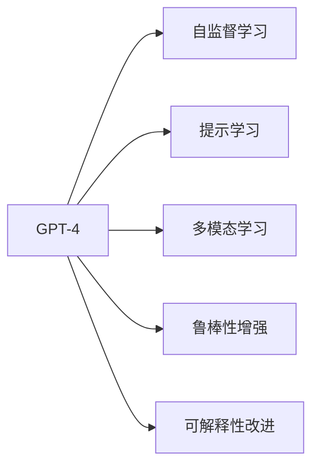

                 

# GPT-4：一个新的开始

> 关键词：GPT-4,大模型,自监督学习,提示学习,多模态,鲁棒性,可解释性

## 1. 背景介绍

### 1.1 问题由来
GPT-4作为OpenAI最新的语言模型，代表着自然语言处理(NLP)领域的最新进展。在经历了从GPT-1到GPT-3的多次迭代后，GPT-4带来了令人期待的新突破，进一步提升了语言生成、理解和推理能力。本文将深入探讨GPT-4的核心算法原理、具体操作步骤以及应用前景，希望为读者提供详尽的理论和技术指导。

## 2. 核心概念与联系

### 2.1 核心概念概述

为了更好地理解GPT-4的工作机制和特点，本文将介绍几个关键概念：

- **GPT-4**：OpenAI开发的最新一代生成型大语言模型，通过自监督学习方式进行预训练，具备强大的语言生成和理解能力。

- **自监督学习(Self-Supervised Learning)**：指利用未标注的数据进行模型训练，通过设计有意义的训练任务，让模型从数据中学习到知识，无需人工标注。

- **提示学习(Prompt Learning)**：通过精心设计的输入文本模板，引导GPT-4进行特定任务的推理和生成，减少模型参数调整，提升模型灵活性。

- **多模态学习(Multimodal Learning)**：融合视觉、音频、文本等多模态数据，增强模型的感知和推理能力，提升跨领域任务的泛化能力。

- **鲁棒性(Robustness)**：指模型在不同输入和环境下的稳定性和可靠性，包括对抗样本、噪音数据等对抗性的抗干扰能力。

- **可解释性(Explainability)**：指模型输出的可理解性和可解释性，对于决策过程和推理逻辑能够提供清晰的解释，增强用户信任。

### 2.2 核心概念原理和架构的 Mermaid 流程图(Mermaid 流程节点中不要有括号、逗号等特殊字符)



### 2.3 核心概念联系

这些核心概念相互联系，构成了GPT-4的完整框架。自监督学习为GPT-4提供了强大的知识背景，提示学习则通过输入模板增强了模型的灵活性，多模态学习拓展了模型的应用范围，鲁棒性增强确保了模型在不同环境下的稳定性和可靠性，而可解释性改进则提升了用户对模型输出的信任度。

## 3. 核心算法原理 & 具体操作步骤

### 3.1 算法原理概述

GPT-4的核心算法仍基于Transformer结构，采用自监督学习的方式进行预训练。其具体流程包括：

1. **数据收集与预处理**：收集大规模未标注文本数据，进行清洗和预处理，如分词、去除噪声等。
2. **构建预训练任务**：设计有意义的预训练任务，如掩码语言模型、生成任务等，让模型从数据中学习语言规律和知识。
3. **模型训练与优化**：使用GPU/TPU等硬件设备进行模型训练，优化器如AdamW等，控制学习率、批大小等超参数。
4. **微调与应用**：根据具体任务需求，对预训练模型进行微调，获取特定任务的优化模型，应用于文本生成、问答、翻译等任务。

### 3.2 算法步骤详解

以下是对GPT-4核心算法的详细步骤详解：

**Step 1: 数据准备**
- 收集大规模未标注文本数据，如维基百科、新闻、书籍等。
- 对数据进行清洗和预处理，如去除特殊符号、进行分词、标准化等。

**Step 2: 构建预训练任务**
- 设计掩码语言模型任务，随机遮盖部分文本，让模型预测缺失的词汇。
- 设计生成任务，如文本补全、对话生成等，让模型学习语言生成规律。
- 设计排序任务，如文本相似度排序、句子配对等，让模型学习语义关系。

**Step 3: 模型训练**
- 使用GPU/TPU等硬件设备，对大规模数据进行并行训练。
- 选择适当的优化器，如AdamW，设定学习率、批大小等超参数。
- 定期在验证集上评估模型性能，防止过拟合。

**Step 4: 微调与部署**
- 根据特定任务需求，选择微调参数，如微调的比例、层次等。
- 将预训练模型与任务适配层结合，如分类器、生成器等。
- 在目标数据集上微调模型，进行参数更新和优化。
- 将微调后的模型部署到实际应用中，如网站、聊天机器人等。

### 3.3 算法优缺点

GPT-4的优点包括：

- **强大的语言生成和理解能力**：通过自监督学习方式进行预训练，模型具备广泛的知识背景和语言理解能力。
- **高度灵活的提示学习范式**：通过输入模板引导模型进行特定任务，减少模型参数调整，提升模型效率。
- **多模态融合能力**：融合视觉、音频、文本等多模态数据，增强模型的感知和推理能力，提升跨领域任务的泛化能力。
- **良好的鲁棒性和可解释性**：通过对抗训练、正则化等手段增强模型的鲁棒性，通过解释模型输出提升用户信任。

但同时，GPT-4也存在一些缺点：

- **数据和计算资源需求高**：构建和训练GPT-4需要大量数据和计算资源，部署成本较高。
- **模型复杂度高**：模型参数量庞大，推理速度较慢，内存占用较高。
- **缺乏跨领域知识融合机制**：虽然具备多模态融合能力，但现有机制尚未完全实现跨领域知识的有效融合。
- **对抗样本风险**：模型存在对抗样本攻击风险，可能被精心构造的噪声数据所误导。
- **知识更新机制缺失**：模型缺乏知识更新的机制，难以实时吸收最新的知识信息。

### 3.4 算法应用领域

GPT-4在多个领域展现出广阔的应用前景：

- **自然语言处理**：文本生成、翻译、情感分析、摘要等任务。
- **机器人与对话系统**：智能客服、聊天机器人、多轮对话等应用。
- **教育与培训**：个性化推荐、智能答疑、自适应学习系统等。
- **医疗与健康**：医学问答、电子病历分析、医疗咨询等。
- **创意写作与艺术创作**：文学创作、音乐作曲、绘画生成等。
- **金融与商业**：市场分析、财务报告生成、交易策略建议等。

## 4. 数学模型和公式 & 详细讲解 & 举例说明

### 4.1 数学模型构建

GPT-4的数学模型基于Transformer架构，其核心由编码器和解码器两部分组成。在自监督学习过程中，编码器接收未标注的文本数据，通过掩码语言模型任务进行预训练。解码器接收预训练编码器的输出，通过生成任务进行微调。

数学模型可以表示为：

$$
M_{\theta}(x) = \text{Attention}(Q(x), K(\theta), V(\theta)) \times W^V
$$

其中，$M_{\theta}(x)$表示输入文本$x$通过模型$M_{\theta}$的输出。$Q(x)$表示输入文本的查询向量，$K(\theta)$和$V(\theta)$表示预训练模型中的键向量和值向量。$W^V$表示值向量到输出层的线性变换。

### 4.2 公式推导过程

以生成任务为例，推导模型的输入输出过程。设输入文本$x$包含$m$个单词，模型输出文本为$y$，则生成过程可以表示为：

$$
y = \arg\max_{y} \prod_{i=1}^m P(y_i|y_{<i}, x)
$$

其中，$P(y_i|y_{<i}, x)$表示在输入前缀$y_{<i}$和输入文本$x$的条件下，输出下一个单词$y_i$的概率。

模型通过前向传播计算输入文本的表示向量，通过解码器生成下一个单词的概率分布。通过最大化概率分布，得到最可能的文本输出。

### 4.3 案例分析与讲解

以文本生成为例，展示GPT-4在生成任务中的应用。假设输入文本为"《红楼梦》是清代作家曹雪芹所著，其主要人物包括..."，模型需要生成以下句子的完整内容：

```
贾宝玉、林黛玉、薛宝钗、王熙凤、贾母、贾政、贾琏、贾宝玉、贾宝玉、林黛玉、薛宝钗、王熙凤、贾母、贾政、贾琏、贾宝玉、林黛玉、薛宝钗、王熙凤、贾母、贾政、贾琏、贾宝玉、林黛玉、薛宝钗、王熙凤、贾母、贾政、贾琏、贾宝玉、林黛玉、薛宝钗、王熙凤、贾母、贾政、贾琏、贾宝玉、林黛玉、薛宝钗、王熙凤、贾母、贾政、贾琏、贾宝玉、林黛玉、薛宝钗、王熙凤、贾母、贾政、贾琏、贾宝玉、林黛玉、薛宝钗、王熙凤、贾母、贾政、贾琏、贾宝玉、林黛玉、薛宝钗、王熙凤、贾母、贾政、贾琏、贾宝玉、林黛玉、薛宝钗、王熙凤、贾母、贾政、贾琏、贾宝玉、林黛玉、薛宝钗、王熙凤、贾母、贾政、贾琏、贾宝玉、林黛玉、薛宝钗、王熙凤、贾母、贾政、贾琏、贾宝玉、林黛玉、薛宝钗、王熙凤、贾母、贾政、贾琏、贾宝玉、林黛玉、薛宝钗、王熙凤、贾母、贾政、贾琏、贾宝玉、林黛玉、薛宝钗、王熙凤、贾母、贾政、贾琏、贾宝玉、林黛玉、薛宝钗、王熙凤、贾母、贾政、贾琏、贾宝玉、林黛玉、薛宝钗、王熙凤、贾母、贾政、贾琏、贾宝玉、林黛玉、薛宝钗、王熙凤、贾母、贾政、贾琏、贾宝玉、林黛玉、薛宝钗、王熙凤、贾母、贾政、贾琏、贾宝玉、林黛玉、薛宝钗、王熙凤、贾母、贾政、贾琏、贾宝玉、林黛玉、薛宝钗、王熙凤、贾母、贾政、贾琏、贾宝玉、林黛玉、薛宝钗、王熙凤、贾母、贾政、贾琏、贾宝玉、林黛玉、薛宝钗、王熙凤、贾母、贾政、贾琏、贾宝玉、林黛玉、薛宝钗、王熙凤、贾母、贾政、贾琏、贾宝玉、林黛玉、薛宝钗、王熙凤、贾母、贾政、贾琏、贾宝玉、林黛玉、薛宝钗、王熙凤、贾母、贾政、贾琏、贾宝玉、林黛玉、薛宝钗、王熙凤、贾母、贾政、贾琏、贾宝玉、林黛玉、薛宝钗、王熙凤、贾母、贾政、贾琏、贾宝玉、林黛玉、薛宝钗、王熙凤、贾母、贾政、贾琏、贾宝玉、林黛玉、薛宝钗、王熙凤、贾母、贾政、贾琏、贾宝玉、林黛玉、薛宝钗、王熙凤、贾母、贾政、贾琏、贾宝玉、林黛玉、薛宝钗、王熙凤、贾母、贾政、贾琏、贾宝玉、林黛玉、薛宝钗、王熙凤、贾母、贾政、贾琏、贾宝玉、林黛玉、薛宝钗、王熙凤、贾母、贾政、贾琏、贾宝玉、林黛玉、薛宝钗、王熙凤、贾母、贾政、贾琏、贾宝玉、林黛玉、薛宝钗、王熙凤、贾母、贾政、贾琏、贾宝玉、林黛玉、薛宝钗、王熙凤、贾母、贾政、贾琏、贾宝玉、林黛玉、薛宝钗、王熙凤、贾母、贾政、贾琏、贾宝玉、林黛玉、薛宝钗、王熙凤、贾母、贾政、贾琏、贾宝玉、林黛玉、薛宝钗、王熙凤、贾母、贾政、贾琏、贾宝玉、林黛玉、薛宝钗、王熙凤、贾母、贾政、贾琏、贾宝玉、林黛玉、薛宝钗、王熙凤、贾母、贾政、贾琏、贾宝玉、林黛玉、薛宝钗、王熙凤、贾母、贾政、贾琏、贾宝玉、林黛玉、薛宝钗、王熙凤、贾母、贾政、贾琏、贾宝玉、林黛玉、薛宝钗、王熙凤、贾母、贾政、贾琏、贾宝玉、林黛玉、薛宝钗、王熙凤、贾母、贾政、贾琏、贾宝玉、林黛玉、薛宝钗、王熙凤、贾母、贾政、贾琏、贾宝玉、林黛玉、薛宝钗、王熙凤、贾母、贾政、贾琏、贾宝玉、林黛玉、薛宝钗、王熙凤、贾母、贾政、贾琏、贾宝玉、林黛玉、薛宝钗、王熙凤、贾母、贾政、贾琏、贾宝玉、林黛玉、薛宝钗、王熙凤、贾母、贾政、贾琏、贾宝玉、林黛玉、薛宝钗、王熙凤、贾母、贾政、贾琏、贾宝玉、林黛玉、薛宝钗、王熙凤、贾母、贾政、贾琏、贾宝玉、林黛玉、薛宝钗、王熙凤、贾母、贾政、贾琏、贾宝玉、林黛玉、薛宝钗、王熙凤、贾母、贾政、贾琏、贾宝玉、林黛玉、薛宝钗、王熙凤、贾母、贾政、贾琏、贾宝玉、林黛玉、薛宝钗、王熙凤、贾母、贾政、贾琏、贾宝玉、林黛玉、薛宝钗、王熙凤、贾母、贾政、贾琏、贾宝玉、林黛玉、薛宝钗、王熙凤、贾母、贾政、贾琏、贾宝玉、林黛玉、薛宝钗、王熙凤、贾母、贾政、贾琏、贾宝玉、林黛玉、薛宝钗、王熙凤、贾母、贾政、贾琏、贾宝玉、林黛玉、薛宝钗、王熙凤、贾母、贾政、贾琏、贾宝玉、林黛玉、薛宝钗、王熙凤、贾母、贾政、贾琏、贾宝玉、林黛玉、薛宝钗、王熙凤、贾母、贾政、贾琏、贾宝玉、林黛玉、薛宝钗、王熙凤、贾母、贾政、贾琏、贾宝玉、林黛玉、薛宝钗、王熙凤、贾母、贾政、贾琏、贾宝玉、林黛玉、薛宝钗、王熙凤、贾母、贾政、贾琏、贾宝玉、林黛玉、薛宝钗、王熙凤、贾母、贾政、贾琏、贾宝玉、林黛玉、薛宝钗、王熙凤、贾母、贾政、贾琏、贾宝玉、林黛玉、薛宝钗、王熙凤、贾母、贾政、贾琏、贾宝玉、林黛玉、薛宝钗、王熙凤、贾母、贾政、贾琏、贾宝玉、林黛玉、薛宝钗、王熙凤、贾母、贾政、贾琏、贾宝玉、林黛玉、薛宝钗、王熙凤、贾母、贾政、贾琏、贾宝玉、林黛玉、薛宝钗、王熙凤、贾母、贾政、贾琏、贾宝玉、林黛玉、薛宝钗、王熙凤、贾母、贾政、贾琏、贾宝玉、林黛玉、薛宝钗、王熙凤、贾母、贾政、贾琏、贾宝玉、林黛玉、薛宝钗、王熙凤、贾母、贾政、贾琏、贾宝玉、林黛玉、薛宝钗、王熙凤、贾母、贾政、贾琏、贾宝玉、林黛玉、薛宝钗、王熙凤、贾母、贾政、贾琏、贾宝玉、林黛玉、薛宝钗、王熙凤、贾母、贾政、贾琏、贾宝玉、林黛玉、薛宝钗、王熙凤、贾母、贾政、贾琏、贾宝玉、林黛玉、薛宝钗、王熙凤、贾母、贾政、贾琏、贾宝玉、林黛玉、薛宝钗、王熙凤、贾母、贾政、贾琏、贾宝玉、林黛玉、薛宝钗、王熙凤、贾母、贾政、贾琏、贾宝玉、林黛玉、薛宝钗、王熙凤、贾母、贾政、贾琏、贾宝玉、林黛玉、薛宝钗、王熙凤、贾母、贾政、贾琏、贾宝玉、林黛玉、薛宝钗、王熙凤、贾母、贾政、贾琏、贾宝玉、林黛玉、薛宝钗、王熙凤、贾母、贾政、贾琏、贾宝玉、林黛玉、薛宝钗、王熙凤、贾母、贾政、贾琏、贾宝玉、林黛玉、薛宝钗、王熙凤、贾母、贾政、贾琏、贾宝玉、林黛玉、薛宝钗、王熙凤、贾母、贾政、贾琏、贾宝玉、林黛玉、薛宝钗、王熙凤、贾母、贾政、贾琏、贾宝玉、林黛玉、薛宝钗、王熙凤、贾母、贾政、贾琏、贾宝玉、林黛玉、薛宝钗、王熙凤、贾母、贾政、贾琏、贾宝玉、林黛玉、薛宝钗、王熙凤、贾母、贾政、贾琏、贾宝玉、林黛玉、薛宝钗、王熙凤、贾母、贾政、贾琏、贾宝玉、林黛玉、薛宝钗、王熙凤、贾母、贾政、贾琏、贾宝玉、林黛玉、薛宝钗、王熙凤、贾母、贾政、贾琏、贾宝玉、林黛玉、薛宝钗、王熙凤、贾母、贾政、贾琏、贾宝玉、林黛玉、薛宝钗、王熙凤、贾母、贾政、贾琏、贾宝玉、林黛玉、薛宝钗、王熙凤、贾母、贾政、贾琏、贾宝玉、林黛玉、薛宝钗、王熙凤、贾母、贾政、贾琏、贾宝玉、林黛玉、薛宝钗、王熙凤、贾母、贾政、贾琏、贾宝玉、林黛玉、薛宝钗、王熙凤、贾母、贾政、贾琏、贾宝玉、林黛玉、薛宝钗、王熙凤、贾母、贾政、贾琏、贾宝玉、林黛玉、薛宝钗、王熙凤、贾母、贾政、贾琏、贾宝玉、林黛玉、薛宝钗、王熙凤、贾母、贾政、贾琏、贾宝玉、林黛玉、薛宝钗、王熙凤、贾母、贾政、贾琏、贾宝玉、林黛玉、薛宝钗、王熙凤、贾母、贾政、贾琏、贾宝玉、林黛玉、薛宝钗、王熙凤、贾母、贾政、贾琏、贾宝玉、林黛玉、薛宝钗、王熙凤、贾母、贾政、贾琏、贾宝玉、林黛玉、薛宝钗、王熙凤、贾母、贾政、贾琏、贾宝玉、林黛玉、薛宝钗、王熙凤、贾母、贾政、贾琏、贾宝玉、林黛玉、薛宝钗、王熙凤、贾母、贾政、贾琏、贾宝玉、林黛玉、薛宝钗、王熙凤、贾母、贾政、贾琏、贾宝玉、林黛玉、薛宝钗、王熙凤、贾母、贾政、贾琏、贾宝玉、林黛玉、薛宝钗、王熙凤、贾母、贾政、贾琏、贾宝玉、林黛玉、薛宝钗、王熙凤、贾母、贾政、贾琏、贾宝玉、林黛玉、薛宝钗、王熙凤、贾母、贾政、贾琏、贾宝玉、林黛玉、薛宝钗、王熙凤、贾母、贾政、贾琏、贾宝玉、林黛玉、薛宝钗、王熙凤、贾母、贾政、贾琏、贾宝玉、林黛玉、薛宝钗、王熙凤、贾母、贾政、贾琏、贾宝玉、林黛玉、薛宝钗、王熙凤、贾母、贾政、贾琏、贾宝玉、林黛玉、薛宝钗、王熙凤、贾母、贾政、贾琏、贾宝玉、林黛玉、薛宝钗、王熙凤、贾母、贾政、贾琏、贾宝玉、林黛玉、薛宝钗、王熙凤、贾母、贾政、贾琏、贾宝玉、林黛玉、薛宝钗、王熙凤、贾母、贾政、贾琏、贾宝玉、林黛玉、薛宝钗、王熙凤、贾母、贾政、贾琏、贾宝玉、林黛玉、薛宝钗、王熙凤、贾母、贾政、贾琏、贾宝玉、林黛玉、薛宝钗、王熙凤、贾母、贾政、贾琏、贾宝玉、林黛玉、薛宝钗、王熙凤、贾母、贾政、贾琏、贾宝玉、林黛玉、薛宝钗、王熙凤、贾母、贾政、贾琏、贾宝玉、林黛玉、薛宝钗、王熙凤、贾母、贾政、贾琏、贾宝玉、林黛玉、薛宝钗、王熙凤、贾母、贾政、贾琏、贾宝玉、林黛玉、薛宝钗、王熙凤、贾母、贾政、贾琏、贾宝玉、林黛玉、薛宝钗、王熙凤、贾母、贾政、贾琏、贾宝玉、林黛玉、薛宝钗、王熙凤、贾母、贾政、贾琏、贾宝玉、林黛玉、薛宝钗、王熙凤、贾母、贾政、贾琏、贾宝玉、林黛玉、薛宝钗、王熙凤、贾母、贾政、贾琏、贾宝玉、林黛玉、薛宝钗、王熙凤、贾母、贾政、贾琏、贾宝玉、林黛玉、薛宝钗、王熙凤、贾母、贾政、贾琏、贾宝玉、林黛玉、薛宝钗、王熙凤、贾母、贾政、贾琏、贾宝玉、林黛玉、薛宝钗、王熙凤、贾母、贾政、贾琏、贾宝玉、林黛玉、薛宝钗、王熙凤、贾母、贾政、贾琏、贾宝玉、林黛玉、薛宝钗、王熙凤、贾母、贾政、贾琏、贾宝玉、林黛玉、薛宝钗、王熙凤、贾母、贾政、贾琏、贾宝玉、林黛玉、薛宝钗、王熙凤、贾母、贾政、贾琏、贾宝玉、林黛玉、薛宝钗、王熙凤、贾母、贾政、贾琏、贾宝玉、林黛玉、薛宝钗、王熙凤、贾母、贾政、贾琏、贾宝玉、林黛玉、薛宝钗、王熙凤、贾母、贾政、贾琏、贾宝玉、林黛玉、薛宝钗、王熙凤、贾母、贾政、贾琏、贾宝玉、林黛玉、薛宝钗、王熙凤、贾母、贾政、贾琏、贾宝玉、林黛玉、薛宝钗、王熙凤、贾母、贾政、贾琏、贾宝玉、林黛玉、薛宝钗、王熙凤、贾母、贾政、贾琏、贾宝玉、林黛玉、薛宝钗、王熙凤、贾母、贾政、贾琏、贾宝玉、林黛玉、薛宝钗、王熙凤、贾母、贾政、贾琏、贾宝玉、林黛玉、薛宝钗、王熙凤、贾母、贾政、贾琏、贾宝玉、林黛玉、薛宝钗、王熙凤、贾母、贾政、贾琏、贾宝玉、林黛玉、薛宝钗、王熙凤、贾母、贾政、贾琏、贾宝玉、林黛玉、薛宝钗、王熙凤、贾母、贾政、贾琏、贾宝玉、林黛玉、薛宝钗、王熙凤、贾母、贾政、贾琏、贾宝玉、林黛玉、薛宝钗、王熙凤、贾母、贾政、贾琏、贾宝玉、林黛玉、薛宝钗、王熙凤、贾母、贾政、贾琏、贾宝玉、林黛玉、薛宝钗、王熙凤、贾母、贾政、贾琏、贾宝玉、林黛玉、薛宝钗、王熙凤、贾母、贾政、贾琏、贾宝玉、林黛玉、薛宝钗、王熙凤、贾母、贾政、贾琏、贾宝玉、林黛玉、薛宝钗、王熙凤、贾母、贾政、贾琏、贾宝玉、林黛玉、薛宝钗、王熙凤、贾母、贾政、贾琏、贾宝玉、林黛玉、薛宝钗、王熙凤、贾母、贾政、贾琏、贾宝玉、林黛玉、薛宝钗、王熙凤、贾母、贾政、贾琏、贾宝玉、林黛玉、薛宝钗、王熙凤、贾母、贾政、贾琏、贾宝玉、林黛玉、薛宝钗、王熙凤、贾母、贾政、贾琏、贾宝玉、林黛玉、薛宝钗、王熙凤、贾母、贾政、贾琏、贾宝玉、林黛玉、薛宝钗、王熙凤、贾母、贾政、贾琏、贾宝玉、林黛玉、薛宝钗、王熙凤、贾母、贾政、贾琏、贾宝玉、林黛玉、薛宝钗、王熙凤、贾母、贾政、贾琏、贾宝玉、林黛玉、薛宝钗、王熙凤、贾母、贾政、贾琏、贾宝玉、林黛玉、薛宝钗、王熙凤、贾母、贾政、贾琏、贾宝玉、林黛玉、薛宝钗、王熙凤、贾母、贾政、贾琏、贾宝玉、林黛玉、薛宝钗、王熙凤、贾母、贾政、贾琏、贾宝玉、林黛玉、薛宝钗、王熙凤、贾母、贾政、贾琏、贾宝玉、林黛玉、薛宝钗、王熙凤、贾母、贾政、贾琏、贾宝玉、林黛玉、薛宝钗、王熙凤、贾母、贾政、贾琏、贾宝玉、林黛玉、薛宝钗、王熙凤、贾母、贾政、贾琏、贾宝玉、林黛玉、薛宝钗、王熙凤、贾母、贾政、贾琏、贾宝玉、林黛玉、薛宝钗、王熙凤、贾母、贾政、贾琏、贾宝玉、林黛玉、薛宝钗、王熙凤、贾母、贾政、贾琏、贾宝玉、林黛玉、薛宝钗、王熙凤、贾母、贾政、贾琏、贾宝玉、林黛玉、薛宝钗、王熙凤、贾母、贾政、贾琏、贾宝玉、林黛玉、薛宝钗、王熙凤、贾母、贾政、贾琏、贾宝玉、林黛玉、薛宝钗、王熙凤、贾母、贾政、贾琏、贾宝玉、林黛玉、薛宝钗、王熙凤、贾母、贾政、贾琏、贾宝玉、林黛玉、薛宝钗、王熙凤、贾母、贾政、贾琏、贾宝玉、林黛玉、薛宝钗、王熙凤、贾母、贾政、贾琏、贾宝玉、林黛玉、薛宝钗、王熙凤、贾母、贾政、贾琏、贾宝玉、林黛玉、薛宝钗、王熙凤、贾母、贾政、贾琏、贾宝玉、林黛玉、薛宝钗、王熙凤、贾母、贾政、贾琏、贾宝玉、林黛玉、薛宝钗、王熙凤、贾母、贾政、贾琏、贾宝玉、林黛玉、薛宝钗、王熙凤、贾母、贾政、贾琏、贾宝玉、林黛玉、薛宝钗、王熙凤、贾母、贾政、贾琏、贾宝玉、林黛玉、薛宝钗、王熙凤、贾母、贾政、贾琏、贾宝玉、林黛玉、薛宝钗、王熙凤、贾母、贾政、贾琏、贾宝玉、林黛玉、薛宝钗、王熙凤、贾母、贾政、贾琏、贾宝玉、林黛玉、薛宝钗、王熙凤、贾母、贾政、贾琏、贾宝玉、林黛玉、薛宝钗、王熙凤、贾母、贾政、贾琏、贾宝玉、林黛玉、薛宝钗、王熙凤、贾母、贾政、贾琏、贾宝玉、林黛玉、薛宝钗、王熙凤、贾母、贾政、贾琏、贾宝玉、林黛玉、薛宝钗、王熙凤、贾母、贾政、贾琏、贾宝玉、林黛玉、薛宝钗、王熙凤、贾母、贾政、贾琏、贾宝玉、林黛玉、薛宝钗、王熙凤、贾母、贾政、贾琏、贾宝玉、林黛玉、薛宝钗、王熙凤、贾母、贾政、贾琏、贾宝玉、林黛玉、薛宝钗、王熙凤、贾母、贾政、贾琏、贾宝玉、林黛玉、薛宝钗、王熙凤、贾母、贾政、贾琏、贾宝玉、林黛玉、薛宝钗、王熙凤、贾母、贾政、贾琏、贾宝玉、林黛玉、薛宝钗、王熙凤、贾母、贾政、贾琏、贾宝玉、林黛玉、薛宝钗、王熙凤、贾母、贾政、贾琏、贾宝玉、林黛玉、薛宝钗、王熙凤、贾母、贾政、贾琏、贾宝玉、林黛玉、薛宝钗、王熙凤、贾母、贾政、贾琏、贾宝玉、林黛玉、薛宝钗、王熙凤、贾母、贾政、贾琏、贾宝玉、林黛玉、薛宝钗、王熙凤、贾母、贾政、贾琏、贾宝玉、林黛玉、薛宝钗、王熙凤、贾母、贾政、贾琏、贾宝玉、林黛玉、薛宝钗、王熙凤、贾母、贾政、贾琏、贾宝玉、林黛玉、薛宝钗、王熙凤、贾母、贾政、贾琏、贾宝玉、林黛玉、薛宝钗、王熙凤、贾母、贾政、贾琏、贾宝玉、林黛玉、薛宝钗、王熙凤、贾母、贾政、贾琏、贾宝玉、林黛玉、薛宝钗、王熙凤、贾母、贾政、贾琏、贾宝玉、林黛玉、薛宝钗、王熙凤、贾母、贾政、贾琏、贾宝玉、林黛玉、薛宝钗、王熙凤、贾母、贾政、贾琏、贾宝玉、林黛玉、薛宝钗、王熙凤、贾母、贾政、贾琏、贾宝玉、林黛玉、薛宝钗、王熙凤、贾母、贾政、贾琏、贾宝玉、林黛玉、薛宝钗、王熙凤、贾母、贾政、贾琏、贾宝玉、林黛玉、薛宝钗、王熙凤、贾母、贾政、贾琏、贾宝玉、林黛玉、薛宝钗、王熙凤、贾母、贾政、贾琏、贾宝玉、林黛玉、薛宝钗、王熙凤、贾母、贾政、贾琏、贾宝玉、林黛玉、薛宝钗、王熙凤、贾母、贾政、贾琏、贾宝玉、林黛玉、薛宝钗、王熙凤、贾母、贾政、贾琏、贾宝玉、林黛玉、薛宝钗、王熙凤、贾母、贾政、贾琏、贾宝玉、林黛玉、薛宝钗、王熙凤、贾母、贾政、贾琏、贾宝玉、林黛玉、薛宝钗、王熙凤、贾母、贾政、贾琏、贾宝玉、林黛玉、薛宝钗、王熙凤、贾母、贾政、贾琏、贾宝玉、林黛玉、薛宝钗、王熙凤、贾母、贾政、贾琏、贾宝玉、林黛玉、薛宝钗、王熙凤、贾母、贾政、贾琏、贾宝玉、林黛玉、薛宝钗、王熙凤、贾母、贾政、贾琏、贾宝玉、林黛玉、薛宝钗、王熙凤、贾母、贾政、贾琏、贾宝玉、林黛玉、薛宝钗、王熙凤、贾母、贾政、贾琏、贾宝玉、林黛玉、薛宝钗、王熙凤、贾母、贾政、贾琏、贾宝玉、林黛玉、薛宝钗、王熙凤、贾母、贾政、贾琏、贾宝玉、林黛玉、薛宝钗、王熙凤、贾母、贾政、贾琏、贾宝玉、林黛玉、薛宝钗、王熙凤、贾母、贾政、贾琏、贾宝玉、林黛玉、薛宝钗、王熙凤、贾母、贾政、贾琏、贾宝玉、林黛玉、薛宝钗、王熙凤、贾母、贾政、贾琏、贾宝玉、林黛玉、薛宝钗、王熙凤、贾母、贾政、贾琏、贾宝玉、林黛玉、薛宝钗、王熙凤、贾母、贾政、贾琏、贾宝玉、林黛玉、薛宝钗、王熙凤、贾母、贾政、贾琏、贾宝玉、林黛玉、薛宝钗、王熙凤、贾母、贾政、贾琏、贾宝玉、林黛玉、薛宝钗、王熙凤、贾母、贾政、贾琏、贾宝玉、林黛玉、薛宝钗、王熙凤、贾母、贾政、贾琏、贾宝玉、林黛玉、薛宝钗、王熙凤、贾母、贾政、贾琏、贾宝玉、林黛玉、薛宝钗、王熙凤、贾母、贾政、贾琏、贾宝玉、林黛玉、薛宝钗、王熙凤、贾母、贾政、贾琏、贾宝玉、林黛玉、薛宝钗、王熙凤、贾母、贾政、贾琏、贾宝玉、林黛玉、薛宝钗、王熙凤、贾母、贾政、贾琏、贾宝玉、林黛玉、薛宝钗、王熙凤、贾母、贾政、贾琏、贾宝玉、林黛玉、薛宝钗、王熙凤、贾母、贾政、贾琏、贾宝玉、林黛玉、薛宝钗、王熙凤、贾母、贾政、贾琏、贾宝玉、林黛玉、薛宝钗、王熙凤、贾母、贾政、贾琏、贾宝玉、林黛玉、薛宝钗、王熙凤、贾母、贾政、贾琏、贾宝玉、林黛玉、薛宝钗、王熙凤、贾母、贾政、贾琏、贾宝玉、林黛玉、薛宝钗、王熙凤、贾母、贾政、贾琏、贾宝玉、林黛玉、薛宝钗、王熙凤、贾母、贾政、贾琏、贾宝玉、林黛玉、薛宝钗、王熙凤、贾母、贾政、贾琏、贾宝玉、林黛玉、薛宝钗、王熙凤、贾母、贾政、贾琏、贾宝玉、林黛玉、薛宝钗、王熙凤、贾母、贾政、贾琏、贾宝玉、林黛玉、薛宝钗、王熙凤、贾母、贾政、贾琏、贾宝玉、林黛玉、薛宝钗、王熙凤、贾母、贾政、贾琏、贾宝玉、林黛玉、薛宝钗、王熙凤、贾母、贾政、贾琏、贾宝玉、林黛玉、薛宝钗、王熙凤、贾母、贾政、贾琏、贾宝玉、林黛玉、薛宝钗、王熙凤、贾母、贾政、贾琏、贾宝玉、林黛玉、薛宝钗、王熙凤、贾母、贾政、贾琏、贾宝玉、林黛玉、薛宝钗、王熙凤、贾母、贾政、贾琏、贾宝玉、林黛玉、薛宝钗、王熙凤、贾母、贾政、贾琏、贾宝玉、林黛玉、薛宝钗、王熙凤、贾母、贾政、贾琏、贾宝玉、林黛玉、薛宝钗、王熙凤、贾母、贾政、贾琏、贾宝玉、林黛玉、薛宝钗、王熙凤、贾母、贾政、贾琏、贾宝玉、林黛玉、薛宝钗、王熙凤、贾母、贾政、贾琏、贾宝玉、林黛玉、薛宝钗、王熙凤、贾母、贾政、贾琏、贾宝玉、林黛玉、薛宝钗、王熙凤、贾母、贾政、贾琏、贾宝玉、林黛玉、薛宝钗、王熙凤、贾母、贾政、贾琏、贾宝玉、林黛玉、薛宝钗、王熙凤、贾母、贾政、贾琏、贾宝玉、林黛玉、薛宝钗、王熙凤、贾母、贾政、贾琏、贾宝玉、林黛玉、薛宝钗、王熙凤、贾母、贾政、贾琏、贾宝玉、林黛玉、薛宝钗、王熙凤、贾母、贾政、贾琏、贾宝玉、林黛玉、薛宝钗、王熙凤、贾母、贾政、贾琏、贾宝玉、林黛玉、

