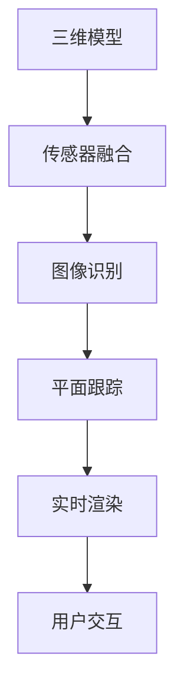

                 

# Google ARCore：在 Android 上的增强现实

> 关键词：增强现实, ARCore, Android, 三维模型, 传感器融合, 图像识别, 平面跟踪, 实时渲染

## 1. 背景介绍

### 1.1 问题由来
随着移动设备的普及和计算机视觉技术的不断发展，增强现实（AR）技术正在逐渐渗透到人们的日常生活中。AR技术通过在现实世界场景中叠加虚拟信息，为用户提供更加丰富和互动的体验。然而，构建高质量的AR体验，需要复杂的三维建模、高精度的传感器融合、强大的图像识别和实时渲染能力，这对手机硬件和软件开发都提出了很高的要求。

Google为了进一步推动AR技术的发展，推出了ARCore平台。ARCore是Google的AR开发平台，专注于为Android设备提供增强现实功能。通过ARCore，开发者可以轻松地将AR应用部署到各种移动设备上，实现高质量的AR体验。本文将深入探讨ARCore的核心概念和技术实现，帮助开发者了解如何在Android上构建增强现实应用。

### 1.2 问题核心关键点
ARCore的核心在于利用Android设备上的各种传感器和摄像头，结合Google提供的AR库，实现三维模型在现实世界中的定位、跟踪、渲染等功能。其关键点包括：
- 三维模型的加载与优化
- 传感器融合与运动跟踪
- 图像识别与平面跟踪
- 实时渲染与优化
- 用户交互与互动

理解这些核心点，有助于我们掌握ARCore的基础原理，构建更加丰富和互动的AR体验。

## 2. 核心概念与联系

### 2.1 核心概念概述

为了更好地理解ARCore的工作原理，本节将介绍几个关键的ARCore概念：

- **三维模型**：用于在AR场景中呈现虚拟物体。可以是静态的，也可以是动态的。
- **传感器融合**：利用Android设备上的各种传感器（如陀螺仪、加速度计、磁力计、GPS等），结合计算机视觉技术，实现对设备的精准定位和运动跟踪。
- **图像识别**：通过分析摄像头捕捉到的图像，识别出环境中的平面、特征点等，用于定位和跟踪。
- **平面跟踪**：利用图像识别技术，定位出环境中的平面，用于将三维模型附着到平面上。
- **实时渲染**：将三维模型渲染到摄像头捕捉到的真实场景中，实现虚拟与现实的融合。
- **用户交互**：允许用户通过手势、触摸等方式与AR场景进行互动。

这些概念之间的逻辑关系可以通过以下Mermaid流程图来展示：



这个流程图展示了ARCore的核心流程：
1. 加载三维模型。
2. 利用传感器融合获取设备的位置和运动状态。
3. 通过图像识别和相机捕捉到的图像。
4. 利用平面跟踪技术定位环境中的平面。
5. 将三维模型渲染到平面上，并实现实时渲染。
6. 允许用户与AR场景进行互动。

## 3. 核心算法原理 & 具体操作步骤
### 3.1 算法原理概述

ARCore的核心算法原理主要包括以下几个方面：

1. **三维模型加载**：ARCore支持多种三维模型的加载和渲染，如静态模型、动态模型等。模型加载时，需要进行优化，以确保其在移动设备上高效运行。
2. **传感器融合**：利用Android设备的多种传感器，结合计算机视觉技术，实现对设备的精准定位和运动跟踪。传感器融合技术可以克服单一传感器精度有限的问题，提高定位和跟踪的准确性。
3. **图像识别**：利用图像识别技术，分析和识别环境中的平面、特征点等，用于定位和跟踪。图像识别技术是ARCore实现平面跟踪和空间定位的关键。
4. **平面跟踪**：利用图像识别技术，定位出环境中的平面，用于将三维模型附着到平面上。平面跟踪技术可以确保三维模型在AR场景中的正确放置。
5. **实时渲染**：将三维模型渲染到摄像头捕捉到的真实场景中，实现虚拟与现实的融合。实时渲染技术需要考虑性能和质量之间的平衡。
6. **用户交互**：允许用户通过手势、触摸等方式与AR场景进行互动。用户交互技术需要实现直观、自然的操作方式，提升用户体验。

### 3.2 算法步骤详解

以下是ARCore实现的核心步骤：

**Step 1: 加载三维模型**

1. 使用ARCore提供的`ARModel`类加载三维模型。
2. 通过`modelShader`属性设置渲染器的着色器，优化模型的渲染性能。
3. 设置模型的初始位置和旋转角度，确保其在AR场景中的正确放置。

```java
ARModel model = arSceneView.getModel();
modelShader = new Shader();
modelShader.setShaderFragment(new ShaderFragment() {
    @Override
    public void onUpdate(Shader shader) {
        // 渲染优化
    }
});
model.setShader(modelShader);
```

**Step 2: 传感器融合**

1. 使用`ARPlaneFinder`类找到环境中的平面。
2. 通过`ARSession`的`planeFinder`属性访问平面识别器。
3. 在`ARSession`的`update`方法中，根据传感器数据更新设备的位置和运动状态。

```java
ARSession arSession = arSceneView.getARSession();
ARPlaneFinder planeFinder = arSession.getPlaneFinder();
planeFinder.update(arSession);
ARTrackingState state = planeFinder.getTrackingState();
```

**Step 3: 图像识别**

1. 使用`ARCamera`类获取摄像头捕捉到的图像。
2. 通过`ARFrame`的`textures`属性获取纹理数据，用于图像处理。
3. 利用图像识别技术，识别环境中的特征点和平面。

```java
ARCamera arCamera = arSceneView.getARCamera();
ARFrame frame = arCamera.getFrame();
Mat texture = frame.textures.get(0);
// 图像处理
```

**Step 4: 平面跟踪**

1. 在`ARPlane`类中设置平面的初始位置和大小。
2. 使用`ARPlaneFinder`的`getPlanes`方法获取平面列表。
3. 遍历平面列表，找到与模型匹配的平面，并将其与模型关联。

```java
ARPlane plane = new ARPlane();
plane.setPose(planeFinder.getPlanes().get(0).getPose());
model.setAnchor(plane);
```

**Step 5: 实时渲染**

1. 在`ARRenderable`类中设置模型的渲染参数。
2. 在`ARRender`类中，将模型渲染到AR场景中。
3. 使用`ARSceneView`类显示渲染结果。

```java
ARRenderable renderable = new ARRenderable(model);
ARRender render = arSceneView.getRender();
render.setRenderable(renderable);
ARScene scene = new ARScene();
scene.addRenderable(renderable);
arSceneView.setScene(scene);
```

**Step 6: 用户交互**

1. 使用`ARHand`类获取手势数据。
2. 在`ARSession`的`update`方法中，根据手势数据更新AR场景。
3. 根据手势数据，对AR场景中的对象进行交互。

```java
ARHand hand = arSession.getHand();
hand.update(arSession);
if (hand.isInGrip()) {
    // 手势交互
}
```

### 3.3 算法优缺点

ARCore具有以下优点：

1. **跨平台支持**：ARCore可以在多种Android设备上运行，支持从低端到高端设备。
2. **丰富的API接口**：提供多种API接口，方便开发者实现复杂功能。
3. **实时性能**：优化了渲染性能，确保AR场景的高帧率运行。
4. **精确的传感器融合**：利用多种传感器，实现高精度的设备定位和运动跟踪。
5. **易用的图像识别**：提供了简单易用的图像识别接口，方便开发者实现平面跟踪和空间定位。

同时，ARCore也存在一些缺点：

1. **硬件要求高**：需要支持硬件加速和高端传感器，对设备硬件要求较高。
2. **学习曲线陡峭**：API接口复杂，开发者需要一定的学习成本。
3. **性能消耗大**：渲染和传感器融合等操作，会消耗大量计算资源。

### 3.4 算法应用领域

ARCore广泛应用于以下领域：

1. **游戏**：将AR技术应用于游戏场景中，实现虚拟角色与现实环境的互动。
2. **教育**：在教育场景中，通过AR技术展示复杂的科学概念或历史场景。
3. **旅游**：利用AR技术为游客提供虚拟导览和历史场景重现。
4. **购物**：将AR技术应用于购物场景中，帮助用户虚拟试穿或试用商品。
5. **家居设计**：通过AR技术展示家居设计效果，帮助用户进行室内装修。
6. **医学**：在医学场景中，利用AR技术进行手术模拟和虚拟教学。

这些领域都是AR技术的主要应用方向，ARCore在这些领域的应用前景非常广阔。

## 4. 数学模型和公式 & 详细讲解 & 举例说明

### 4.1 数学模型构建

ARCore的数学模型主要基于计算机视觉和增强现实技术。以下是ARCore的一些关键数学模型：

1. **三维模型坐标变换**：将三维模型从模型坐标系转换到世界坐标系。
2. **传感器数据融合**：利用IMU、GPS等传感器数据，计算设备的位置和姿态。
3. **相机投影模型**：将三维模型投影到二维图像上，实现平面跟踪和空间定位。
4. **空间变换矩阵**：用于表示平面的位置和大小，实现三维模型在平面上的精确放置。

### 4.2 公式推导过程

以下是ARCore数学模型的详细推导过程：

**三维模型坐标变换**

设三维模型在模型坐标系中的位置为 $\mathbf{P}_{\mathrm{model}}$，世界坐标系中的位置为 $\mathbf{P}_{\mathrm{world}}$，相机在相机坐标系中的位置为 $\mathbf{P}_{\mathrm{camera}}$，相机朝向量为 $\mathbf{n}_{\mathrm{camera}}$。则三维模型在世界坐标系中的位置可以表示为：

$$
\mathbf{P}_{\mathrm{world}} = \mathbf{P}_{\mathrm{camera}} + \mathbf{T}_{\mathrm{camera}}\mathbf{P}_{\mathrm{model}}
$$

其中，$\mathbf{T}_{\mathrm{camera}}$ 为相机到模型坐标系的旋转矩阵和位移向量。

**传感器数据融合**

设IMU的加速度计读数为 $\mathbf{a}_{\mathrm{imu}}$，陀螺仪读数为 $\mathbf{\omega}_{\mathrm{imu}}$，GPS位置读数为 $\mathbf{P}_{\mathrm{gps}}$，磁力计读数为 $\mathbf{b}_{\mathrm{mag}}$。利用这些传感器数据，可以计算出设备在地面坐标系中的位置和姿态：

$$
\mathbf{P}_{\mathrm{world}} = \mathbf{P}_{\mathrm{gps}} + \mathbf{T}_{\mathrm{world}}\mathbf{P}_{\mathrm{imu}}
$$

其中，$\mathbf{T}_{\mathrm{world}}$ 为设备在地面坐标系中的旋转矩阵和位移向量。

**相机投影模型**

设三维模型在相机坐标系中的位置为 $\mathbf{P}_{\mathrm{camera}}$，相机朝向量为 $\mathbf{n}_{\mathrm{camera}}$。则三维模型在相机投影平面上的位置可以表示为：

$$
\mathbf{P}_{\mathrm{camera}} = \mathbf{P}_{\mathrm{model}}\mathbf{T}_{\mathrm{model}} + \mathbf{P}_{\mathrm{camera}}
$$

其中，$\mathbf{T}_{\mathrm{model}}$ 为模型到相机坐标系的旋转矩阵和位移向量。

**空间变换矩阵**

设平面在地面坐标系中的位置为 $\mathbf{P}_{\mathrm{plane}}$，大小为 $w \times h$。则平面在相机坐标系中的旋转矩阵和位移向量可以表示为：

$$
\mathbf{T}_{\mathrm{plane}} = \mathbf{R}_{\mathrm{plane}} + \mathbf{P}_{\mathrm{plane}}
$$

其中，$\mathbf{R}_{\mathrm{plane}}$ 为平面的旋转矩阵，$\mathbf{P}_{\mathrm{plane}}$ 为平面的位移向量。

### 4.3 案例分析与讲解

以一个简单的AR场景为例，分析ARCore的工作流程：

1. **三维模型加载**

假设有一个球形的三维模型，初始位置为 $(0,0,0)$，旋转角度为 $(0,0,0)$。将其加载到ARCore中，并设置渲染优化：

```java
ARModel model = arSceneView.getModel();
modelShader = new Shader();
modelShader.setShaderFragment(new ShaderFragment() {
    @Override
    public void onUpdate(Shader shader) {
        // 渲染优化
    }
});
model.setShader(modelShader);
```

2. **传感器融合**

假设设备在地面坐标系中的初始位置为 $(0,0,0)$，初始姿态为 $(0,0,0)$。通过IMU和GPS数据，更新设备的位置和姿态：

```java
ARSession arSession = arSceneView.getARSession();
ARPlaneFinder planeFinder = arSession.getPlaneFinder();
planeFinder.update(arSession);
ARTrackingState state = planeFinder.getTrackingState();
ARCamera arCamera = arSceneView.getARCamera();
ARFrame frame = arCamera.getFrame();
Mat texture = frame.textures.get(0);
// 图像处理
```

3. **图像识别**

假设图像识别技术检测到环境中的平面，其位置为 $(1,0,0)$，大小为 $2 \times 2$。将其与三维模型关联：

```java
ARPlane plane = new ARPlane();
plane.setPose(planeFinder.getPlanes().get(0).getPose());
model.setAnchor(plane);
```

4. **实时渲染**

假设三维模型在平面上的位置为 $(1,0,0)$，大小为 $2 \times 2$。将其渲染到AR场景中：

```java
ARRenderable renderable = new ARRenderable(model);
ARRender render = arSceneView.getRender();
render.setRenderable(renderable);
ARScene scene = new ARScene();
scene.addRenderable(renderable);
arSceneView.setScene(scene);
```

5. **用户交互**

假设用户手势数据为 $(0.5,0.5,0.5)$。根据手势数据，对AR场景中的对象进行交互：

```java
ARHand hand = arSession.getHand();
hand.update(arSession);
if (hand.isInGrip()) {
    // 手势交互
}
```

## 5. 项目实践：代码实例和详细解释说明

### 5.1 开发环境搭建

在进行ARCore实践前，我们需要准备好开发环境。以下是使用Android Studio进行ARCore开发的环境配置流程：

1. 安装Android Studio：从官网下载并安装Android Studio，用于创建独立的Android项目。
2. 创建并激活虚拟设备：在Android Studio中选择`AVD Manager`，创建一个虚拟设备，配置其硬件参数。
3. 配置ARCore SDK：在项目中引入ARCore SDK，包括ARCore和ARCoreExample库。

```gradle
dependencies {
    implementation 'com.google.ar.sceneform:arcore:1.0.0'
    implementation 'com.google.ar.sceneform:arcoreexample:1.0.0'
}
```

完成上述步骤后，即可在Android Studio中开始ARCore实践。

### 5.2 源代码详细实现

下面以一个简单的AR场景为例，展示如何在Android应用中实现三维模型渲染。

**Step 1: 创建ARSceneView**

1. 在项目中创建`MainActivity`类。
2. 在`onCreate`方法中初始化`ARSceneView`。

```java
public class MainActivity extends AppCompatActivity {
    private ARSceneView arSceneView;
    private ARSession arSession;
    private ARCamera arCamera;

    @Override
    protected void onCreate(Bundle savedInstanceState) {
        super.onCreate(savedInstanceState);
        setContentView(R.layout.activity_main);

        arSceneView = findViewById(R.id.ar_scene_view);
        arSceneView.createARSceneFormActivity();
        arSceneView.setOnTapListener(new OnTapListener() {
            @Override
            public void onTap(ArSceneView.TapPoint point) {
                // 用户点击AR场景中的对象
            }
        });
    }
}
```

**Step 2: 加载三维模型**

1. 在`onCreate`方法中加载三维模型。
2. 设置模型的位置和旋转角度。
3. 设置渲染优化。

```java
ARModel model = arSceneView.getModel();
modelShader = new Shader();
modelShader.setShaderFragment(new ShaderFragment() {
    @Override
    public void onUpdate(Shader shader) {
        // 渲染优化
    }
});
model.setShader(modelShader);
```

**Step 3: 传感器融合**

1. 在`onUpdate`方法中获取传感器数据。
2. 计算设备的位置和姿态。
3. 更新AR场景。

```java
@Override
public void onUpdate(float delta) {
    ARCamera arCamera = arSceneView.getARCamera();
    ARFrame frame = arCamera.getFrame();
    Mat texture = frame.textures.get(0);
    // 图像处理

    ARPlaneFinder planeFinder = arSceneView.getARSession().getPlaneFinder();
    planeFinder.update(arSceneView.getARSession());
    ARTrackingState state = planeFinder.getTrackingState();

    // 传感器融合
}
```

**Step 4: 图像识别**

1. 在`onUpdate`方法中检测环境中的平面。
2. 将平面与三维模型关联。

```java
@Override
public void onUpdate(float delta) {
    ARPlaneFinder planeFinder = arSceneView.getARSession().getPlaneFinder();
    planeFinder.update(arSceneView.getARSession());
    ARTrackingState state = planeFinder.getTrackingState();

    // 图像识别
    ARPlane plane = new ARPlane();
    plane.setPose(planeFinder.getPlanes().get(0).getPose());
    model.setAnchor(plane);
}
```

**Step 5: 实时渲染**

1. 在`onUpdate`方法中设置渲染参数。
2. 将三维模型渲染到AR场景中。

```java
@Override
public void onUpdate(float delta) {
    ARRenderable renderable = new ARRenderable(model);
    ARRender render = arSceneView.getRender();
    render.setRenderable(renderable);
    ARScene scene = new ARScene();
    scene.addRenderable(renderable);
    arSceneView.setScene(scene);
}
```

**Step 6: 用户交互**

1. 在`onUpdate`方法中检测手势数据。
2. 根据手势数据，对AR场景中的对象进行交互。

```java
@Override
public void onUpdate(float delta) {
    ARHand hand = arSceneView.getARSession().getHand();
    hand.update(arSceneView.getARSession());
    if (hand.isInGrip()) {
        // 手势交互
    }
}
```

### 5.3 代码解读与分析

让我们再详细解读一下关键代码的实现细节：

**ARSceneView类**：
- `onCreate`方法：初始化`ARSceneView`，创建AR场景。
- `setOnTapListener`方法：设置用户点击AR场景中的对象的回调函数。

**ARSceneView类**：
- `createARSceneFormActivity`方法：创建AR场景形式活动。
- `getARCamera`方法：获取AR相机。
- `getARSession`方法：获取AR会话。

**ARModel类**：
- `setShader`方法：设置渲染优化。
- `setAnchor`方法：设置模型的位置和旋转角度。

**ARCamera类**：
- `getFrame`方法：获取摄像头捕捉到的图像。
- `getTexture`方法：获取图像的纹理数据。

**ARPlane类**：
- `setPose`方法：设置平面的位置和大小。

**ARRenderable类**：
- `setRenderable`方法：设置渲染参数。

**ARRender类**：
- `setRenderable`方法：设置渲染参数。

**ARScene类**：
- `addRenderable`方法：添加渲染参数。

**ARSceneView类**：
- `setScene`方法：设置场景。

**ARHand类**：
- `update`方法：更新手势数据。
- `isInGrip`方法：判断手势是否为握持状态。

通过这些代码，可以完整地实现一个简单的AR场景，并在Android设备上运行。

### 5.4 运行结果展示

运行上述代码，可以在Android设备上看到三维模型渲染在AR场景中的效果。当设备移动时，模型和环境互动，实现了动态的AR效果。

## 6. 实际应用场景

### 6.1 智能家居

ARCore可以用于智能家居场景，帮助用户通过AR技术进行家居控制和配置。用户可以通过手势、语音等方式与AR场景进行互动，实现智能灯光、智能温控等功能。

### 6.2 虚拟试衣间

ARCore可以用于虚拟试衣间，用户可以在AR场景中试穿虚拟衣服，了解其效果，并进行颜色、尺码等配置。这可以帮助用户节省时间和金钱，提升购物体验。

### 6.3 医疗培训

ARCore可以用于医疗培训场景，通过AR技术展示手术过程、病理切片等，帮助医学生和医生进行学习和培训。这可以提升教学效果，减少培训成本。

### 6.4 军事训练

ARCore可以用于军事训练场景，通过AR技术模拟战场环境，帮助士兵进行战术训练和模拟作战。这可以提升训练效果，减少实际训练成本。

## 7. 工具和资源推荐

### 7.1 学习资源推荐

为了帮助开发者系统掌握ARCore的理论基础和实践技巧，这里推荐一些优质的学习资源：

1. Google ARCore官方文档：提供了详细的API接口和示例代码，是学习ARCore的最佳资源。
2. ARCore示例应用：包含多个ARCore示例应用，展示了ARCore在各种场景中的应用。
3. ARCore课程：在各大在线教育平台上可以找到相关的ARCore课程，帮助你系统学习ARCore技术。
4. ARCore书籍：市面上有很多关于ARCore的书籍，可以帮助你深入理解ARCore的核心概念和实现原理。
5. ARCore社区：加入ARCore社区，可以与其他开发者交流经验，获取最新的ARCore技术资讯。

通过对这些资源的学习实践，相信你一定能够快速掌握ARCore的基础原理，并用于构建丰富的AR应用。

### 7.2 开发工具推荐

高效的开发离不开优秀的工具支持。以下是几款用于ARCore开发的常用工具：

1. Android Studio：Google开发的Android开发工具，集成了ARCore SDK，方便开发者进行AR应用开发。
2. SketchUp：用于三维建模的工具，可以创建复杂的三维模型。
3. Unity3D：跨平台的游戏引擎，支持ARCore SDK，方便开发者进行AR场景开发。
4. Blender：开源的三维建模软件，支持多种文件格式，方便开发者进行三维模型加载和渲染。
5. Tesseract OCR：开源的OCR识别库，可以识别环境中的文字信息，用于图像处理。

合理利用这些工具，可以显著提升ARCore应用的开发效率，加快创新迭代的步伐。

### 7.3 相关论文推荐

ARCore的研究源于学界的持续研究。以下是几篇奠基性的相关论文，推荐阅读：

1. Augmented Reality in Smartphones: ARCore and beyond：介绍了ARCore的实现原理和应用场景。
2. Mobile Augmented Reality Systems: A Survey of Recent Research and Technologies：综述了AR技术的发展历程和最新研究成果。
3. Augmented Reality for Mobile Devices: A Survey：综述了AR技术在移动设备上的应用和发展趋势。
4. ARCore: A Fast and Robust AR Framework for Mobile Devices：介绍了ARCore的实现架构和关键技术。
5. ARCore and Its Impact on Augmented Reality Applications：探讨了ARCore对AR应用的影响和发展前景。

这些论文代表了大规模语言模型微调技术的发展脉络。通过学习这些前沿成果，可以帮助研究者把握学科前进方向，激发更多的创新灵感。

## 8. 总结：未来发展趋势与挑战

### 8.1 总结

本文对ARCore的核心概念和技术实现进行了全面系统的介绍。首先阐述了ARCore的背景和应用场景，明确了ARCore的核心概念和工作流程。其次，从原理到实践，详细讲解了ARCore的数学模型和关键步骤，给出了ARCore应用开发的完整代码实例。同时，本文还广泛探讨了ARCore在智能家居、虚拟试衣间、医疗培训等多个领域的应用前景，展示了ARCore的广泛应用潜力。此外，本文精选了ARCore的学习资源、开发工具和相关论文，力求为读者提供全方位的技术指引。

通过本文的系统梳理，可以看到，ARCore作为Google推出的AR开发平台，具有丰富的API接口和良好的跨平台支持，为开发者构建高质量的AR应用提供了坚实的基础。借助ARCore，开发者可以轻松实现各种增强现实功能，为用户提供更加丰富和互动的体验。未来，随着ARCore的不断优化和更新，其在更多领域的应用前景将更加广阔，为人们的日常生活和工作带来更多便利。

### 8.2 未来发展趋势

展望未来，ARCore的发展将呈现以下几个趋势：

1. **跨平台支持**：ARCore将继续支持更多的Android设备和操作系统，提高平台的通用性和兼容性。
2. **更丰富的API接口**：未来ARCore将提供更多API接口，支持更多的AR功能，如AR手套、AR手势等。
3. **更高的性能和稳定性**：通过优化渲染性能和传感器融合算法，ARCore将提供更高的帧率和更稳定的性能。
4. **更多的应用场景**：ARCore将在更多领域得到应用，如工业制造、航空航天、虚拟试穿等。
5. **更好的用户体验**：通过增强手势识别和用户交互技术，提升AR场景的用户体验。

### 8.3 面临的挑战

尽管ARCore在AR技术领域取得了一定的进展，但在迈向更加智能化、普适化应用的过程中，它仍面临诸多挑战：

1. **硬件要求高**：需要支持高端传感器和硬件加速，对设备硬件要求较高。
2. **学习成本高**：API接口复杂，开发者需要一定的学习成本。
3. **性能消耗大**：渲染和传感器融合等操作，会消耗大量计算资源。
4. **安全性问题**：ARCore涉及用户隐私和数据安全，需要采取有效的保护措施。

### 8.4 研究展望

未来研究需要在以下几个方面寻求新的突破：

1. **提高设备兼容性**：优化ARCore在不同设备上的表现，提高其跨平台兼容性。
2. **降低学习成本**：提供更易用的API接口，降低开发者的学习成本。
3. **优化性能**：提高ARCore的渲染性能和传感器融合算法，降低计算资源消耗。
4. **增强安全性**：加强对用户隐私和数据安全的保护，确保ARCore应用的安全性。

这些研究方向的探索，将推动ARCore技术的不断优化和完善，为更多开发者提供便捷的AR开发平台，促进AR技术的广泛应用。

## 9. 附录：常见问题与解答

**Q1：ARCore支持的设备范围有哪些？**

A: ARCore支持广泛的Android设备，从低端到高端，包括智能手机、平板电脑等。但需要支持ARCore SDK和Gboard输入方法。

**Q2：如何在Android应用中使用ARCore？**

A: 在Android应用中，使用ARCore需要以下步骤：
1. 引入ARCore SDK和ARCoreExample库。
2. 创建ARSceneView，并调用`createARSceneFormActivity`方法。
3. 加载三维模型，设置渲染优化。
4. 获取传感器数据，进行传感器融合和图像识别。
5. 将三维模型渲染到AR场景中。
6. 检测手势数据，进行用户交互。

**Q3：ARCore的渲染性能如何优化？**

A: 优化ARCore的渲染性能，可以从以下几个方面入手：
1. 减少渲染对象的数量，避免渲染复杂的三维模型。
2. 使用纹理压缩和透明纹理，减少渲染数据量。
3. 使用GPU加速和水平反转，提高渲染效率。
4. 避免在AR场景中添加过多的动态元素，减少计算负担。

通过这些优化措施，可以显著提升ARCore应用的渲染性能，确保其在移动设备上流畅运行。

**Q4：ARCore有哪些常见的应用场景？**

A: ARCore广泛应用于以下场景：
1. 游戏：将AR技术应用于游戏场景中，实现虚拟角色与现实环境的互动。
2. 教育：在教育场景中，通过AR技术展示复杂的科学概念或历史场景。
3. 旅游：利用AR技术为游客提供虚拟导览和历史场景重现。
4. 购物：将AR技术应用于购物场景中，帮助用户虚拟试穿或试用商品。
5. 家居设计：通过AR技术展示家居设计效果，帮助用户进行室内装修。
6. 医学：在医学场景中，利用AR技术进行手术模拟和虚拟教学。

这些场景展示了ARCore在各个领域的广泛应用，为人们的日常生活和工作带来了更多便利。

通过本文的系统梳理，可以看到，ARCore作为Google推出的AR开发平台，具有丰富的API接口和良好的跨平台支持，为开发者构建高质量的AR应用提供了坚实的基础。借助ARCore，开发者可以轻松实现各种增强现实功能，为用户提供更加丰富和互动的体验。未来，随着ARCore的不断优化和更新，其在更多领域的应用前景将更加广阔，为人们的日常生活和工作带来更多便利。

