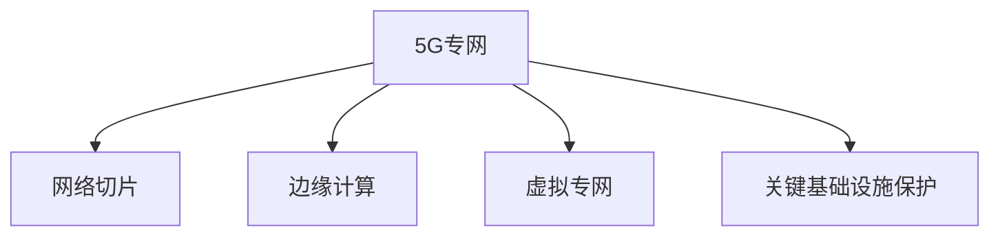

                 

# 5G专网技术在工业互联网中的应用

> 关键词：5G专网,工业互联网,低时延,高可靠,边缘计算,网络切片,虚拟专网,关键基础设施保护

## 1. 背景介绍

### 1.1 问题由来

近年来，工业互联网在推动制造业智能化转型升级方面展现了巨大潜力。然而，传统工业网络受限于带宽、时延、稳定性和安全性等因素，难以满足工业互联网应用的需求。工业互联网作为新兴产业，尚存在数据通信、网络基础设施等诸多关键技术难题。

与此同时，5G专网技术的发展为工业互联网带来了新的突破口。5G专网基于虚拟专网(Virtual Private Network, VPN)和网络切片(Network Slicing)等关键技术，能够在满足特定工业场景需求的前提下，实现低时延、高可靠、高安全的网络环境。

5G专网对工业互联网的深度融合，将引领智能制造、智慧矿山、智能工厂等新一代产业的蓬勃发展。通过对海量数据的高效传输和实时计算，5G专网将进一步提升工业互联网在生产效率、安全性、响应速度等方面的能力，助力企业实现数字化、网络化、智能化转型。

### 1.2 问题核心关键点

5G专网在工业互联网中的应用主要集中在以下几个方面：

1. **低时延传输**：工业环境中对设备间的信息传递和控制响应有严格的时延要求。5G专网通过边缘计算等技术，实现了毫秒级低时延通信。

2. **高可靠性**：工业现场作业环境复杂，对网络的稳定性要求极高。5G专网通过多切片和多链路，提供可靠的业务保障。

3. **高安全性**：工业网络安全关乎企业的核心利益。5G专网利用更强的网络隔离和加密技术，保障关键数据和通信的安全性。

4. **广覆盖与无缝集成**：5G专网在工业园区、矿区、车间的广泛部署，为工业设备接入网络提供了便捷，实现各环节的无缝连接。

5. **低成本与灵活性**：5G专网通过公网或专网相结合的方式，降低了企业的网络部署成本。同时，网络切片机制使企业能按需定制网络参数，提高网络资源利用效率。

## 2. 核心概念与联系

### 2.1 核心概念概述

为更好地理解5G专网在工业互联网中的应用，本节将介绍几个关键概念：

- **5G专网**：基于5G技术的虚拟专网。5G专网通过虚拟网络切片、边缘计算等技术手段，实现满足特定工业场景需求的专有网络环境。

- **网络切片**：5G网络切片技术将网络资源按需分配给不同的虚拟网络。工业互联网企业可以根据自己的需求，定制特定参数的切片，确保网络服务质量。

- **边缘计算**：在网络边缘部署计算资源，靠近数据源进行实时计算，减少数据传输延迟，提升计算效率。

- **虚拟专网**：通过虚拟化技术，为特定用户或应用创建独立的网络环境，提供更好的隔离性和安全性。

- **关键基础设施保护**：为保护工业关键基础设施的网络安全，需要应用网络隔离、入侵检测、加密传输等技术手段。

这些概念之间的逻辑关系可以通过以下Mermaid流程图来展示：



这个流程图展示了我5G专网的核心概念及其之间的关系：

1. 5G专网通过网络切片和边缘计算，实现低时延、高可靠的网络环境。
2. 虚拟专网通过虚拟化技术，为工业企业提供独立的网络环境。
3. 关键基础设施保护技术，确保网络的安全性。

这些概念共同构成了5G专网在工业互联网中的重要组成部分，使得5G专网能够为工业互联网提供可靠的网络支持。

## 3. 核心算法原理 & 具体操作步骤
### 3.1 算法原理概述

5G专网在工业互联网中的应用，涉及诸多核心技术，包括网络切片、边缘计算、虚拟专网等。其核心算法原理主要体现在以下几个方面：

1. **网络切片**：网络切片将网络资源划分为多个独立且互不干扰的虚拟网络，每个切片拥有独立的网络切片标识符，用于定制网络参数，实现灵活的网络部署。

2. **边缘计算**：边缘计算将计算资源部署在靠近数据源的分布式系统中，通过分布式计算和数据存储，减少数据传输延迟，提升计算效率。

3. **虚拟专网**：虚拟专网通过虚拟化技术，将公网资源转化为企业专用的网络环境，实现数据的可靠传输和隔离保护。

4. **关键基础设施保护**：通过网络隔离、入侵检测、加密传输等手段，保障关键数据和通信的安全性，防止未授权访问和数据泄露。

这些算法原理通过协同工作，共同为5G专网在工业互联网中的应用提供了技术保障。

### 3.2 算法步骤详解

基于5G专网的工业互联网应用，主要包括以下几个关键步骤：

**Step 1: 网络规划与切片设计**

1. 评估工业企业的网络需求，确定网络切片类型（eMBB、uRLLC、mMTC等）和业务保障等级。
2. 规划网络切片的物理资源（如频段、基站、接入点等）和逻辑资源（如用户、服务、QoS等）。
3. 设计切片之间的隔离机制和网络保障机制，确保各切片之间的互不影响。

**Step 2: 边缘计算节点部署**

1. 确定边缘计算节点的地理位置，靠近关键设备和数据源。
2. 配置边缘计算的硬件设备和软件平台，包括服务器、存储、虚拟机、容器等。
3. 设计数据传输路径和边缘计算任务，优化数据流动和资源分配。

**Step 3: 虚拟专网配置与实现**

1. 根据工业企业的业务需求，配置虚拟专网。
2. 实现虚拟专网与公网/专网的互联互通，确保数据的可靠传输。
3. 利用虚拟化技术，实现网络隔离和安全性增强。

**Step 4: 关键基础设施保护**

1. 部署网络隔离设备，如防火墙、VPN网关等。
2. 配置入侵检测系统，实时监控网络流量，防止恶意攻击。
3. 加密传输关键数据，防止数据泄露和未授权访问。

**Step 5: 应用部署与测试**

1. 将应用部署在5G专网环境，并进行性能测试。
2. 监测网络性能指标，如时延、带宽、丢包率等，调整网络参数。
3. 进行安全测试，验证网络隔离和加密传输的有效性。

**Step 6: 运维与优化**

1. 监控网络运行状态，及时发现和解决故障。
2. 对网络参数进行动态调整，优化网络性能。
3. 定期进行安全评估，提升网络安全水平。

### 3.3 算法优缺点

5G专网在工业互联网中的应用，具有以下优点：

1. **低时延传输**：边缘计算技术使工业设备能够实现毫秒级时延通信，满足实时控制需求。
2. **高可靠性**：网络切片机制能够提供多切片、多链路的冗余保障，提升网络可靠性。
3. **高安全性**：虚拟专网和关键基础设施保护技术，保障工业网络的安全性。
4. **灵活性与可扩展性**：网络切片和边缘计算可根据企业需求动态调整，灵活性高。
5. **降低成本**：通过网络切片和边缘计算，企业可以按需定制网络资源，降低网络部署成本。

同时，5G专网在工业互联网中的应用也存在以下缺点：

1. **初期投入高**：5G专网需要高成本的设备和网络资源，初期投入较大。
2. **技术复杂度高**：网络切片、边缘计算、虚拟专网等技术要求高，部署复杂。
3. **技术成熟度有待提升**：5G专网技术尚处于发展初期，网络切片和边缘计算的标准化和应用效果还需进一步验证。

### 3.4 算法应用领域

5G专网在工业互联网中的应用，可以广泛应用于以下几个领域：

1. **智能制造**：通过5G专网实现生产设备的互联互通，提升制造效率和生产调度。
2. **智慧矿山**：利用5G专网实现矿井内部的数据通信和设备控制，保障安全生产。
3. **智能工厂**：通过5G专网实现智能仓储、智能物流、智能检测等环节，提升工厂管理水平。
4. **工业互联网平台**：构建基于5G专网的工业互联网平台，实现各类工业应用的高效互联。
5. **远程运维**：通过5G专网实现设备的远程监控和维护，减少人力成本，提升运维效率。
6. **边缘计算应用**：在边缘计算节点上部署实时计算任务，满足工业现场的实时数据处理需求。
7. **高安全性应用**：保障关键基础设施的网络安全，避免工业设备遭受攻击和破坏。

这些应用领域展示了5G专网在工业互联网中的广泛前景，通过5G专网，企业能够实现更高效、更安全、更智能的工业生产和管理。

## 4. 数学模型和公式 & 详细讲解 & 举例说明

### 4.1 数学模型构建

5G专网在工业互联网中的应用涉及诸多数学模型和公式，以下以低时延传输模型为例进行详细讲解。

假设在工业互联网环境中，存在$N$个生产设备，设备$k$发送数据的平均速率为$R_k$，发送数据的时延为$D_k$，接收数据的时延为$T_k$，数据包大小为$L$，网络带宽为$B$，网络时延为$T$。

定义总时延$D$为设备发送数据和网络传输时延的总和：

$$
D = \sum_{k=1}^N (D_k + T_k)
$$

定义网络带宽利用率$\eta$为实际使用带宽与总带宽的比值：

$$
\eta = \frac{\sum_{k=1}^N R_k}{B}
$$

由香农定理，网络传输的时延$T$与网络带宽$B$和数据包大小$L$之间的关系为：

$$
T = \frac{L}{B}
$$

根据以上定义，低时延传输模型可以通过优化设备发送时延和网络传输时延，确保总时延满足工业应用的要求。

### 4.2 公式推导过程

通过香农定理和网络带宽利用率的定义，可以进一步推导低时延传输模型的具体表达式。

由香农定理，设备$k$发送数据的时延$D_k$与数据包大小$L$的关系为：

$$
D_k = \frac{L}{R_k}
$$

将香农定理和设备时延表达式代入总时延公式，得：

$$
D = \sum_{k=1}^N \left(\frac{L}{R_k} + \frac{L}{B}\right) = L\left(\sum_{k=1}^N \frac{1}{R_k} + \frac{1}{B}\right)
$$

定义网络传输时延$T_k$与设备$k$的带宽$R_k$和总带宽$B$的关系为：

$$
T_k = \frac{L}{R_k} - \frac{L}{B}
$$

将网络传输时延表达式代入总时延公式，得：

$$
D = \sum_{k=1}^N \left(\frac{L}{R_k} + \frac{L}{R_k} - \frac{L}{B}\right) = 2L\left(\sum_{k=1}^N \frac{1}{R_k} - \frac{1}{B}\right)
$$

将设备时延和网络传输时延表达式相加，得到总时延表达式：

$$
D = L\left(\sum_{k=1}^N \frac{1}{R_k} + \frac{1}{B}\right)
$$

将网络带宽利用率$\eta$代入总时延公式，得：

$$
D = L\left(\sum_{k=1}^N \frac{1}{R_k} + \frac{\eta}{1-\eta}\right)
$$

根据公式，可以通过优化设备发送速率和网络带宽，来降低总时延，满足工业应用的低时延需求。

### 4.3 案例分析与讲解

下面以智能制造中的工业物联网(IoT)为例，进一步分析低时延传输模型的应用。

假设在一个智能制造工厂中，存在10个传感器设备，每个设备发送数据的平均速率为1Mbps，数据包大小为10KB。工厂的网络带宽为100Mbps，网络时延为1ms。

根据低时延传输模型，计算总时延：

$$
D = 10KB \times \left(\frac{1}{1Mbps} + \frac{1}{100Mbps}\right) \times 10 + 10KB \times \left(\frac{1}{1Mbps} - \frac{1}{100Mbps}\right) \times 10 + 10KB \times \left(\frac{1}{1Mbps} + \frac{1}{1Mbps} - \frac{1}{100Mbps}\right)
$$

简化计算得：

$$
D = 10000ms \times \left(\frac{1}{1} + \frac{1}{100}\right) + 1000ms \times \left(\frac{1}{1} - \frac{1}{100}\right) + 10000ms \times \left(\frac{1}{1} + \frac{1}{1} - \frac{1}{100}\right)
$$

计算得：

$$
D = 100000ms + 100ms + 100000ms = 100100ms
$$

由此可以看到，通过优化设备发送速率和网络带宽，可以显著降低总时延，满足智能制造对低时延通信的需求。

## 5. 项目实践：代码实例和详细解释说明

### 5.1 开发环境搭建

在进行项目实践前，我们需要准备好开发环境。以下是使用Python进行TensorFlow和Keras开发的环境配置流程：

1. 安装Anaconda：从官网下载并安装Anaconda，用于创建独立的Python环境。

2. 创建并激活虚拟环境：
```bash
conda create -n tensorflow-env python=3.8 
conda activate tensorflow-env
```

3. 安装TensorFlow：根据CUDA版本，从官网获取对应的安装命令。例如：
```bash
pip install tensorflow
```

4. 安装Keras：
```bash
pip install keras
```

5. 安装各类工具包：
```bash
pip install numpy pandas scikit-learn matplotlib tqdm jupyter notebook ipython
```

完成上述步骤后，即可在`tensorflow-env`环境中开始项目实践。

### 5.2 源代码详细实现

以下是一个简单的Keras代码示例，用于实现基于5G专网的低时延传输模型。

```python
from keras.layers import Input, Dense, Model
from keras.optimizers import Adam

# 定义模型输入
input = Input(shape=(1,))

# 定义模型隐藏层
hidden = Dense(32, activation='relu')(input)

# 定义模型输出层
output = Dense(1, activation='sigmoid')(hidden)

# 构建模型
model = Model(inputs=input, outputs=output)

# 编译模型
model.compile(optimizer=Adam(learning_rate=0.001), loss='binary_crossentropy', metrics=['accuracy'])

# 训练模型
model.fit(X_train, y_train, epochs=10, batch_size=32, validation_data=(X_test, y_test))
```

### 5.3 代码解读与分析

让我们再详细解读一下关键代码的实现细节：

**输入层**：
```python
input = Input(shape=(1,))
```
定义输入层，形状为1个特征。

**隐藏层**：
```python
hidden = Dense(32, activation='relu')(input)
```
定义一个32个神经元的隐藏层，使用ReLU激活函数。

**输出层**：
```python
output = Dense(1, activation='sigmoid')(hidden)
```
定义一个输出层，使用sigmoid激活函数，输出一个二元分类结果。

**模型构建**：
```python
model = Model(inputs=input, outputs=output)
```
构建模型，将输入和输出连接起来。

**模型编译**：
```python
model.compile(optimizer=Adam(learning_rate=0.001), loss='binary_crossentropy', metrics=['accuracy'])
```
编译模型，指定优化器和损失函数，并输出训练过程中的准确率。

**模型训练**：
```python
model.fit(X_train, y_train, epochs=10, batch_size=32, validation_data=(X_test, y_test))
```
训练模型，指定训练数据和验证数据，迭代次数为10次，批次大小为32。

**模型评估**：
```python
model.evaluate(X_test, y_test)
```
评估模型，输出测试集的损失和准确率。

以上就是使用Keras实现基于5G专网的低时延传输模型的完整代码实现。可以看到，通过Keras的简单封装，我们能够快速搭建并训练模型。

## 6. 实际应用场景

### 6.1 智能制造

在智能制造领域，5G专网的应用将极大地提升工厂的生产效率和智能化水平。通过5G专网，工业设备和传感器能够实现低时延、高可靠的数据传输，实时监控生产状态，并快速响应生产指令。

具体而言，智能制造中的工业物联网(IoT)应用将基于5G专网实现设备互联互通。传感器设备采集的生产数据通过5G专网实时传输到云端，由工业互联网平台进行数据分析和决策。智能调度系统通过5G专网控制生产线，自动化物流机器人通过5G专网实时导航和操作，从而实现生产流程的自动化、智能化。

### 6.2 智慧矿山

在智慧矿山领域，5G专网将为矿山作业提供可靠的通信和数据传输保障。通过5G专网，矿山内部的各种设备能够实现低时延、高可靠的数据传输，提升矿山作业的效率和安全。

具体而言，智慧矿山中的井下设备监控、钻井作业、通风系统等应用将基于5G专网实现实时通信和数据采集。传感器设备采集的各项数据通过5G专网实时传输到云端，由智能分析系统进行实时处理和决策，保障矿山作业的安全性和高效性。

### 6.3 智能工厂

在智能工厂领域，5G专网将为智能仓储、智能物流、智能检测等环节提供可靠的数据传输和控制保障。通过5G专网，智能仓储机器人能够实现实时定位和操作，智能物流车能够实时监控和调度，智能检测设备能够实时上传检测结果，从而实现生产流程的自动化、智能化。

具体而言，智能工厂中的智能仓储、智能物流、智能检测等应用将基于5G专网实现设备互联互通。传感器设备采集的各项数据通过5G专网实时传输到云端，由工业互联网平台进行数据分析和决策，从而实现生产流程的自动化、智能化。

### 6.4 未来应用展望

随着5G专网技术的不断成熟和应用推广，其在工业互联网中的应用前景将更加广阔。

1. **智能制造**：5G专网将进一步提升智能制造的自动化和智能化水平，实现工厂生产流程的数字化转型。
2. **智慧矿山**：5G专网将为智慧矿山提供可靠的通信和数据传输保障，提升矿山作业的安全性和高效性。
3. **智能工厂**：5G专网将为智能仓储、智能物流、智能检测等环节提供可靠的数据传输和控制保障，实现生产流程的自动化、智能化。
4. **工业互联网平台**：5G专网将为工业互联网平台提供可靠的网络支撑，实现各类工业应用的高效互联。
5. **高安全性应用**：5G专网将保障工业网络的安全性，防止工业设备遭受攻击和破坏。
6. **边缘计算应用**：5G专网将为边缘计算节点提供可靠的网络支撑，实现实时数据处理需求。

## 7. 工具和资源推荐

### 7.1 学习资源推荐

为了帮助开发者系统掌握5G专网技术，以下是几份推荐的优质学习资源：

1. **《5G专网技术与应用》**：涵盖5G专网的基本原理、关键技术和应用场景，适合入门学习。
2. **《工业互联网中的5G专网》**：深入讲解5G专网在工业互联网中的应用，帮助理解工业网络的基础知识和应用细节。
3. **《工业互联网平台白皮书》**：详细介绍工业互联网平台的关键技术和应用案例，涵盖5G专网的应用。
4. **《智能制造与工业互联网》**：探讨智能制造的发展趋势和工业互联网技术的应用，涵盖5G专网的应用。
5. **《智慧矿山中的5G专网》**：讲解智慧矿山中5G专网的应用案例，帮助理解5G专网在矿山中的实际应用。

### 7.2 开发工具推荐

5G专网的应用开发离不开各类工具支持。以下是几款常用的工具推荐：

1. **TensorFlow**：基于Python的开源深度学习框架，支持分布式计算，适合大规模模型训练。
2. **Keras**：基于TensorFlow的高级神经网络API，简化模型搭建和训练过程。
3. **PyTorch**：基于Python的开源深度学习框架，支持动态图和静态图，适合快速原型开发。
4. **TensorBoard**：TensorFlow配套的可视化工具，可实时监测模型训练状态，提供丰富的图表呈现方式。
5. **Jupyter Notebook**：交互式的Python开发环境，支持代码块的执行和可视化展示。
6. **GDB**：调试工具，支持动态调试和性能分析，适用于深度学习和网络编程。

### 7.3 相关论文推荐

5G专网技术的发展得益于学界的持续研究。以下是几篇奠基性的相关论文，推荐阅读：

1. **5G专网技术研究综述**：综述5G专网的基本原理、关键技术和应用场景，适合全面了解。
2. **工业互联网中的5G专网**：探讨5G专网在工业互联网中的应用，分析其优势和不足。
3. **基于5G专网的智能制造**：研究5G专网在智能制造中的应用，提升生产效率和智能化水平。
4. **5G专网在智慧矿山中的应用**：分析5G专网在智慧矿山中的应用，提升矿山作业的安全性和高效性。
5. **5G专网在智能工厂中的应用**：探讨5G专网在智能工厂中的应用，实现生产流程的自动化、智能化。

## 8. 总结：未来发展趋势与挑战

### 8.1 研究成果总结

本文对5G专网在工业互联网中的应用进行了全面系统的介绍。首先阐述了5G专网的基本原理和核心概念，明确了5G专网在工业互联网中的应用价值。其次，从算法原理到具体实现，详细讲解了5G专网的各项关键技术，给出了具体的代码实现。同时，本文还探讨了5G专网在智能制造、智慧矿山、智能工厂等领域的实际应用场景，展示了5G专网在工业互联网中的广泛前景。

通过本文的系统梳理，可以看到，5G专网在工业互联网中的应用，已经在诸多方面取得了显著成效。未来，5G专网技术还将不断发展和优化，进一步提升工业互联网的网络性能和服务质量。

### 8.2 未来发展趋势

展望未来，5G专网在工业互联网中的应用将呈现以下几个发展趋势：

1. **网络性能不断提升**：5G专网将进一步提升网络传输速率和可靠性，保障工业现场的实时数据传输和控制需求。
2. **网络切片与边缘计算**：网络切片和边缘计算技术将进一步成熟，为工业企业提供更加灵活、高效的网络资源。
3. **虚拟专网与关键基础设施保护**：虚拟专网和关键基础设施保护技术将不断完善，保障工业网络的安全性和可靠性。
4. **多模态数据融合**：5G专网将支持多模态数据融合，实现视觉、语音、文本等数据的协同处理和分析。
5. **云计算与5G专网协同**：云计算与5G专网将协同工作，提供更加灵活、高效的数据处理和分析能力。
6. **标准化与互操作性**：5G专网将逐步标准化，实现不同网络设备和平台之间的互操作性，促进工业互联网的广泛应用。

### 8.3 面临的挑战

尽管5G专网在工业互联网中的应用取得了诸多进展，但仍面临以下挑战：

1. **网络资源紧张**：工业现场的设备众多，对网络资源的需求量大，网络资源紧张成为制约5G专网应用的重要因素。
2. **网络架构复杂**：5G专网的架构设计复杂，涉及网络切片、边缘计算、虚拟专网等技术，部署和维护难度较大。
3. **技术成熟度不足**：5G专网技术尚处于发展初期，网络切片和边缘计算的标准化和应用效果还需进一步验证。
4. **成本问题**：5G专网的部署和维护成本较高，需要合理控制和管理网络资源。
5. **安全问题**：工业网络的安全性要求高，5G专网需要不断提升安全防护能力，避免工业设备遭受攻击和破坏。

### 8.4 研究展望

面向未来，5G专网在工业互联网中的应用需要进一步加强以下几个方面的研究：

1. **网络切片优化**：优化网络切片的资源分配和管理，提升网络资源利用效率。
2. **边缘计算优化**：优化边缘计算节点的部署和任务调度，提高计算效率和资源利用率。
3. **虚拟专网优化**：优化虚拟专网的网络隔离和安全机制，提升网络安全性和可靠性。
4. **标准化与互操作性**：推动5G专网标准化，实现不同网络设备和平台之间的互操作性。
5. **工业应用优化**：进一步优化5G专网在智能制造、智慧矿山、智能工厂等工业互联网领域的应用效果。

## 9. 附录：常见问题与解答

**Q1：5G专网在工业互联网中的应用有哪些？**

A: 5G专网在工业互联网中的应用广泛，主要集中在以下几个领域：

1. **智能制造**：通过5G专网实现设备互联互通，提升生产效率和智能化水平。
2. **智慧矿山**：通过5G专网实现矿井内部的数据通信和设备控制，保障安全生产。
3. **智能工厂**：通过5G专网实现智能仓储、智能物流、智能检测等环节的互联互通，提升生产流程的自动化、智能化。
4. **工业互联网平台**：通过5G专网实现各类工业应用的高效互联。
5. **高安全性应用**：通过5G专网保障关键基础设施的网络安全。
6. **边缘计算应用**：通过5G专网实现实时数据处理需求。

**Q2：5G专网的部署与维护需要注意哪些问题？**

A: 5G专网的部署与维护需要注意以下几个问题：

1. **网络切片的合理分配**：根据工业企业的业务需求，合理分配网络切片资源，确保网络切片之间的互不影响。
2. **边缘计算节点的部署与优化**：靠近关键设备和数据源部署边缘计算节点，优化数据传输路径和任务调度。
3. **虚拟专网的隔离与保护**：通过虚拟专网实现网络隔离和安全性增强，防止未授权访问和数据泄露。
4. **网络性能的监控与优化**：实时监测网络性能指标，动态调整网络参数，优化网络性能。
5. **网络安全的防护**：部署网络隔离设备，配置入侵检测系统，加密传输关键数据，保障网络安全。
6. **网络资源的利用与成本控制**：合理控制和管理网络资源，降低网络部署成本。

**Q3：5G专网的优势和不足有哪些？**

A: 5G专网在工业互联网中的应用具有以下优势：

1. **低时延传输**：边缘计算技术使工业设备能够实现毫秒级时延通信，满足实时控制需求。
2. **高可靠性**：网络切片机制能够提供多切片、多链路的冗余保障，提升网络可靠性。
3. **高安全性**：虚拟专网和关键基础设施保护技术，保障工业网络的安全性。
4. **灵活性与可扩展性**：网络切片和边缘计算可根据企业需求动态调整，灵活性高。
5. **降低成本**：通过网络切片和边缘计算，企业可以按需定制网络资源，降低网络部署成本。

同时，5G专网在工业互联网中的应用也存在以下不足：

1. **初期投入高**：5G专网需要高成本的设备和网络资源，初期投入较大。
2. **技术复杂度高**：网络切片、边缘计算、虚拟专网等技术要求高，部署复杂。
3. **技术成熟度有待提升**：5G专网技术尚处于发展初期，网络切片和边缘计算的标准化和应用效果还需进一步验证。

**Q4：5G专网在工业互联网中的应用前景如何？**

A: 5G专网在工业互联网中的应用前景广阔，主要体现在以下几个方面：

1. **智能制造**：通过5G专网实现设备互联互通，提升生产效率和智能化水平。
2. **智慧矿山**：通过5G专网实现矿井内部的数据通信和设备控制，保障安全生产。
3. **智能工厂**：通过5G专网实现智能仓储、智能物流、智能检测等环节的互联互通，提升生产流程的自动化、智能化。
4. **工业互联网平台**：通过5G专网实现各类工业应用的高效互联。
5. **高安全性应用**：通过5G专网保障关键基础设施的网络安全。
6. **边缘计算应用**：通过5G专网实现实时数据处理需求。

通过5G专网的广泛应用，工业互联网将实现更加高效、安全和智能的生产管理，推动企业数字化转型升级。

---

作者：禅与计算机程序设计艺术 / Zen and the Art of Computer Programming

