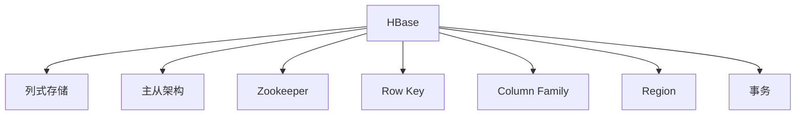

                 

## 1. 背景介绍

### 1.1 问题由来

HBase是一个高可扩展、强一致性的分布式列式数据库，由Apache基金会开发，主要用来存储非结构化或半结构化的大规模数据。HBase的原理基于Google的Bigtable，但其在分布式锁、版本控制、用户模式等关键特性上进行了大量改进，使得它成为了处理大规模数据的理想选择。

随着互联网和移动互联网的飞速发展，产生了海量的数据，如日志数据、用户行为数据、监控数据等。这些数据具有存储量巨大、更新频繁、访问模式复杂等特点，传统的关系型数据库在处理这些数据时面临着存储和计算效率低下、扩展性差等问题。而HBase通过采用列式存储、分布式架构等技术，能够高效地存储和处理大规模数据，是处理这些数据的理想解决方案。

### 1.2 问题核心关键点

HBase的核心设计理念包括：
- 列式存储：将数据按照列族进行存储，使得查询和更新操作更加高效。
- 分布式架构：采用主从架构，通过Zookeeper进行配置管理和集群同步。
- 动态扩展：支持动态添加节点和表，轻松应对数据增长。
- 高可用性：采用Hadoop的HA机制，实现主从节点的切换，保证系统高可用性。

这些核心设计使得HBase能够处理大规模数据，支持高并发的读写操作，并提供可靠的性能保障。

## 2. 核心概念与联系

### 2.1 核心概念概述

为了更好地理解HBase的工作原理和架构，本节将介绍几个密切相关的核心概念：

- HBase：一个分布式列式数据库，主要用来存储大规模非结构化或半结构化数据。
- 列式存储：将数据按照列族进行存储，通过水平分割（Row Key）和垂直分割（Column Family）来组织数据。
- 主从架构：通过一个Master节点管理多个RegionServer节点，实现数据的高效分布和处理。
- Zookeeper：用于配置管理和集群同步的分布式协调服务，是HBase的重要组成部分。
- Row Key：唯一标识一条记录的字符串，是HBase中的主键。
- Column Family：一组列的集合，是HBase中的表结构。
- Region：列族中的一段连续的存储区域，是HBase中的物理存储单位。
- 事务：在HBase中，每个操作都需要经过WAL（Write-Ahead Log）日志，以确保数据的可靠性和一致性。

这些核心概念之间的逻辑关系可以通过以下Mermaid流程图来展示：



这个流程图展示了大语言模型的核心概念及其之间的关系：

1. HBase通过列式存储来高效存储数据，通过主从架构和Zookeeper实现集群管理和分布式处理。
2. Row Key和Column Family是HBase中的表结构，定义了数据如何组织和访问。
3. Region是HBase中的物理存储单位，通过水平分割实现数据的分片。
4. 事务通过WAL日志保证数据的可靠性和一致性。

这些概念共同构成了HBase的数据库系统架构，使得HBase能够高效地存储和处理大规模数据。

## 3. 核心算法原理 & 具体操作步骤
### 3.1 算法原理概述

HBase的核心原理可以概括为以下几个方面：

- 分布式架构：通过Master节点管理多个RegionServer节点，实现数据的分布式存储和处理。
- 列式存储：按照列族进行存储，通过Row Key和Column Family定义数据组织结构。
- 版本控制：通过WAL日志和HFile文件记录数据的变化，保证数据的可靠性和一致性。
- 分布式锁：通过Master节点和Zookeeper实现分布式锁，保证并发操作的正确性。

HBase的这些核心原理使得其能够高效地处理大规模数据，支持高并发的读写操作，并提供可靠的性能保障。

### 3.2 算法步骤详解

HBase的工作流程主要包括以下几个关键步骤：

**Step 1: 数据存储**

HBase通过列式存储来高效存储数据，将数据按照列族进行存储，通过Row Key和Column Family定义数据组织结构。具体步骤如下：

1. 将数据按照列族进行存储，通过Row Key和Column Family定义数据组织结构。
2. 数据以HFile文件的形式存储在Region中，每个Region包含一部分列族的数据。

**Step 2: 数据读写**

HBase支持高并发的读写操作，通过Master节点和RegionServer节点实现数据的分布式存储和处理。具体步骤如下：

1. 当客户端发起读写操作时，首先通过Master节点获取数据的存储位置信息。
2. 客户端将操作请求发送给对应的RegionServer节点进行处理。
3. RegionServer节点根据Row Key和Column Family定位数据，并将操作请求转发给相应的Region。
4. Region节点进行数据读写操作，并通过WAL日志记录数据的变化。

**Step 3: 数据复制**

HBase支持数据的高可用性，通过多份数据副本保证数据的可靠性和一致性。具体步骤如下：

1. 数据以HFile文件的形式存储在Region中，每个Region包含一部分列族的数据。
2. 每个Region复制两份，一份存储在当前节点，一份存储在备选节点。
3. 当当前节点发生故障时，备选节点接管数据的访问，保证数据的可靠性和一致性。

**Step 4: 数据管理**

HBase通过Master节点和Zookeeper实现数据的配置管理和集群同步。具体步骤如下：

1. Master节点负责管理所有的Region节点，进行表的创建、删除和分裂等操作。
2. Master节点和Zookeeper节点协同工作，实现集群的配置管理和状态同步。
3. Master节点和RegionServer节点协同工作，进行数据的复制和迁移操作。

### 3.3 算法优缺点

HBase的优点包括：

- 高可扩展性：支持动态添加节点和表，轻松应对数据增长。
- 高性能：支持高并发的读写操作，提供可靠的性能保障。
- 高可用性：通过多份数据副本和Master节点和Zookeeper的协作，保证数据的高可用性。

HBase的缺点包括：

- 延迟较高：由于数据的存储和处理都在磁盘上，访问延迟较高。
- 表结构单一：只支持列式存储，不支持复杂的数据结构。
- 数据模型限制：只支持非结构化或半结构化数据的存储，不支持复杂的数据模型。

尽管HBase存在这些缺点，但其在高可用性和高可扩展性方面的优势，使其成为处理大规模数据的首选数据库系统。

### 3.4 算法应用领域

HBase的应用领域包括：

- 日志数据存储：存储和处理大量的日志数据，如Web日志、系统日志等。
- 用户行为分析：存储和分析用户的行为数据，如用户浏览记录、点击记录等。
- 监控数据存储：存储和处理监控数据，如网络流量、服务器性能等。
- 社交媒体数据存储：存储和处理社交媒体数据，如微博、微信等。
- 推荐系统数据存储：存储和处理推荐系统数据，如用户行为数据、商品数据等。

这些应用领域覆盖了互联网和移动互联网的各个方面，HBase的高可用性和高可扩展性使其成为了处理大规模数据的理想选择。

## 4. 数学模型和公式 & 详细讲解 & 举例说明

### 4.1 数学模型构建

HBase的数学模型主要包括以下几个方面：

- Row Key：唯一标识一条记录的字符串。
- Column Family：一组列的集合，是HBase中的表结构。
- Region：列族中的一段连续的存储区域，是HBase中的物理存储单位。
- WAL日志：记录数据的变化，保证数据的可靠性和一致性。

### 4.2 公式推导过程

以HBase的读写操作为例，推导其数学模型。

假设一个HBase表中有两个列族（CF1和CF2），每个列族包含若干列，每个列族中有一个默认的单列族（default）。当客户端发起一个写操作时，首先通过Master节点获取数据的存储位置信息，然后通过RegionServer节点进行数据写入。

写操作的数学模型可以表示为：

$$
\begin{aligned}
&\text{WAL日志} \\
&\text{WAL日志} = \text{Row Key} + \text{列族标识} + \text{列标识} + \text{时间戳} + \text{值} \\
&\text{WAL日志} \in \text{WAL日志集合}
\end{aligned}
$$

写操作通过WAL日志记录数据的变化，保证数据的可靠性和一致性。

### 4.3 案例分析与讲解

以下以HBase的写操作为例，具体讲解其实现过程。

假设一个HBase表中有两个列族（CF1和CF2），每个列族包含若干列，每个列族中有一个默认的单列族（default）。当客户端发起一个写操作时，首先通过Master节点获取数据的存储位置信息，然后通过RegionServer节点进行数据写入。

具体步骤如下：

1. 客户端发起写操作，包含Row Key、列族标识、列标识、时间戳和值。
2. Master节点根据Row Key和列族标识获取数据的存储位置信息，并将操作请求转发给相应的RegionServer节点。
3. RegionServer节点定位数据所在的Region，并将操作请求转发给相应的Region节点。
4. Region节点定位到具体的列，并将操作请求转发给相应的HFile文件进行处理。
5. HFile文件将操作请求记录到WAL日志中，并根据Row Key和列标识更新数据的值。
6. 写操作完成后，HBase返回操作结果。

## 5. 项目实践：代码实例和详细解释说明

### 5.1 开发环境搭建

在进行HBase开发前，需要先搭建好开发环境。以下是使用Linux搭建HBase开发环境的步骤：

1. 安装Java开发环境：从官网下载并安装Java开发环境。
2. 安装Hadoop开发环境：从官网下载并安装Hadoop开发环境。
3. 安装Zookeeper开发环境：从官网下载并安装Zookeeper开发环境。
4. 安装HBase开发环境：从官网下载并安装HBase开发环境。
5. 配置HBase开发环境：设置HBase的配置文件和集群环境。
6. 启动HBase开发环境：启动HBase的集群环境，并进行测试。

### 5.2 源代码详细实现

以下是一个简单的HBase读写操作的代码实现：

```java
import org.apache.hadoop.hbase.HBaseConfiguration;
import org.apache.hadoop.hbase.client.Connection;
import org.apache.hadoop.hbase.client.ConnectionFactory;
import org.apache.hadoop.hbase.client.Put;
import org.apache.hadoop.hbase.client.Result;
import org.apache.hadoop.hbase.client.Table;
import org.apache.hadoop.hbase.client.TablePut;
import org.apache.hadoop.hbase.client.TableResult;
import org.apache.hadoop.hbase.util.Bytes;

import java.io.IOException;
import java.util.ArrayList;
import java.util.List;

public class HBaseExample {

    public static void main(String[] args) throws IOException {
        // 创建HBase连接
        Connection connection = ConnectionFactory.createConnection(HBaseConfiguration.create());

        // 获取表对象
        Table table = connection.getTable(TableName.valueOf("myTable"));

        // 写入数据
        Put put = new Put(Bytes.toBytes("row1"));
        put.addColumn(Bytes.toBytes("cf1"), Bytes.toBytes("c1"), Bytes.toBytes("value1"));
        table.put(put);

        // 读取数据
        TableResult result = table.get(Bytes.toBytes("row1"));
        List<Result> results = result.getResults();
        for (Result r : results) {
            List<Cell> cells = r.listCells();
            for (Cell c : cells) {
                System.out.println(Bytes.toString(c.getQualifier()));
                System.out.println(Bytes.toString(c.getValue()));
            }
        }

        // 关闭连接
        table.close();
        connection.close();
    }
}
```

### 5.3 代码解读与分析

让我们再详细解读一下关键代码的实现细节：

**HBase连接创建**

```java
Connection connection = ConnectionFactory.createConnection(HBaseConfiguration.create());
```

创建HBase连接，指定配置文件，并返回HBase连接对象。

**表对象获取**

```java
Table table = connection.getTable(TableName.valueOf("myTable"));
```

获取指定表对象，并返回表对象。

**数据写入**

```java
Put put = new Put(Bytes.toBytes("row1"));
put.addColumn(Bytes.toBytes("cf1"), Bytes.toBytes("c1"), Bytes.toBytes("value1"));
table.put(put);
```

创建一个Put对象，指定Row Key、列族标识、列标识和值，并将数据写入表中。

**数据读取**

```java
TableResult result = table.get(Bytes.toBytes("row1"));
List<Result> results = result.getResults();
for (Result r : results) {
    List<Cell> cells = r.listCells();
    for (Cell c : cells) {
        System.out.println(Bytes.toString(c.getQualifier()));
        System.out.println(Bytes.toString(c.getValue()));
    }
}
```

获取指定Row Key的行数据，并输出查询结果。

**连接关闭**

```java
table.close();
connection.close();
```

关闭表对象和HBase连接。

通过以上代码，可以简单地实现HBase的读写操作。需要注意的是，HBase的实现较为复杂，本文仅提供基本的代码示例，实际开发中需要根据具体需求进行调整和优化。

## 6. 实际应用场景

### 6.1 大数据分析

HBase作为列式数据库，能够高效存储和处理大规模非结构化数据，是进行大数据分析的理想选择。在实际应用中，HBase常用于存储和处理日志数据、用户行为数据、监控数据等。

在日志数据存储方面，HBase能够高效存储大量的Web日志、系统日志等数据，帮助企业进行大数据分析。在用户行为分析方面，HBase能够高效存储和处理用户的行为数据，如用户浏览记录、点击记录等，帮助企业进行用户画像、个性化推荐等。在监控数据存储方面，HBase能够高效存储和处理网络流量、服务器性能等数据，帮助企业进行系统监控和性能优化。

### 6.2 社交媒体数据存储

社交媒体数据具有海量的数据量、高并发读写、数据模型复杂等特点，HBase的高可用性和高可扩展性使其成为了存储和处理社交媒体数据的理想选择。在实际应用中，HBase常用于存储和处理微博、微信等社交媒体数据，帮助企业进行社交媒体分析、用户行为分析等。

在社交媒体数据存储方面，HBase能够高效存储和处理微博、微信等社交媒体数据，帮助企业进行社交媒体分析、用户行为分析等。在用户行为分析方面，HBase能够高效存储和处理用户的行为数据，如用户评论、点赞等，帮助企业进行用户画像、个性化推荐等。

### 6.3 推荐系统数据存储

推荐系统数据具有海量的数据量、高并发读写、数据模型复杂等特点，HBase的高可用性和高可扩展性使其成为了存储和处理推荐系统数据的理想选择。在实际应用中，HBase常用于存储和处理推荐系统数据，帮助企业进行推荐系统优化、个性化推荐等。

在推荐系统数据存储方面，HBase能够高效存储和处理推荐系统数据，帮助企业进行推荐系统优化、个性化推荐等。在个性化推荐方面，HBase能够高效存储和处理用户的行为数据、商品数据等，帮助企业进行个性化推荐。

### 6.4 未来应用展望

随着互联网和移动互联网的飞速发展，产生了海量的数据，如日志数据、用户行为数据、监控数据等。这些数据具有存储量巨大、更新频繁、访问模式复杂等特点，传统的关系型数据库在处理这些数据时面临着存储和计算效率低下、扩展性差等问题。而HBase通过采用列式存储、分布式架构等技术，能够高效地存储和处理大规模数据，是处理这些数据的理想解决方案。

未来，HBase将在以下几个方面得到更广泛的应用：

1. 大数据分析：HBase作为列式数据库，能够高效存储和处理大规模非结构化数据，是进行大数据分析的理想选择。
2. 社交媒体数据存储：社交媒体数据具有海量的数据量、高并发读写、数据模型复杂等特点，HBase的高可用性和高可扩展性使其成为了存储和处理社交媒体数据的理想选择。
3. 推荐系统数据存储：推荐系统数据具有海量的数据量、高并发读写、数据模型复杂等特点，HBase的高可用性和高可扩展性使其成为了存储和处理推荐系统数据的理想选择。

## 7. 工具和资源推荐

### 7.1 学习资源推荐

为了帮助开发者系统掌握HBase的理论基础和实践技巧，这里推荐一些优质的学习资源：

1. HBase官方文档：HBase官方文档是学习HBase的最佳资源，提供了详细的API文档和开发指南。
2. HBase实战：这本书介绍了HBase的实战开发经验，涵盖HBase的配置管理、数据模型设计、高可用性实现等方面。
3. Hadoop生态系统：HBase是Hadoop生态系统的重要组成部分，了解Hadoop生态系统有助于更好地掌握HBase。
4. HBase社区：HBase社区是一个活跃的开发者社区，提供了大量的学习资源和开发经验。
5. HBase课程：Coursera、Udemy等在线教育平台上有许多HBase课程，可以系统地学习HBase的理论和实践。

通过对这些资源的学习实践，相信你一定能够快速掌握HBase的理论基础和实践技巧，并用于解决实际的开发问题。

### 7.2 开发工具推荐

HBase的开发工具包括：

1. HBase Shell：HBase Shell是一个交互式命令行工具，方便进行数据管理和操作。
2. HBase Java API：HBase Java API是一个丰富的API库，支持HBase的数据管理、数据查询、数据操作等。
3. HBase REST API：HBase REST API提供了一个RESTful的接口，方便进行HBase的数据管理和操作。
4. HBase HD：HBase HD是一个可视化工具，提供了一个图形化的界面，方便进行HBase的数据管理和操作。
5. HBase Template：HBase Template是一个Java模板库，方便进行HBase的数据管理和操作。

合理利用这些工具，可以显著提升HBase开发的效率，加快创新迭代的步伐。

### 7.3 相关论文推荐

HBase作为Apache基金会的重要项目，其发展得到了学界的广泛关注。以下是几篇奠基性的相关论文，推荐阅读：

1. "A Scalable MapReduce for Big Data"：这篇文章介绍了Hadoop MapReduce框架的基本原理和设计思路，是理解Hadoop生态系统的必读之作。
2. "Design of a Generic, Scalable, Distributed, Fault-Tolerant, Cooperative Data Store"：这篇文章介绍了Google Bigtable的基本原理和设计思路，是理解HBase的基本参考。
3. "HBase: The Hadoop Database"：这篇文章介绍了HBase的基本原理和设计思路，是理解HBase的必读之作。
4. "A Survey of Distributed Databases"：这篇文章介绍了分布式数据库的基本原理和设计思路，是理解HBase的基本参考。
5. "Scalable Distributed Databases with Apache Hadoop"：这篇文章介绍了Hadoop分布式数据库的基本原理和设计思路，是理解Hadoop生态系统的必读之作。

这些论文代表了大数据技术的发展脉络，通过学习这些前沿成果，可以帮助研究者把握学科前进方向，激发更多的创新灵感。

## 8. 总结：未来发展趋势与挑战

### 8.1 总结

本文对HBase分布式列式数据库进行了全面系统的介绍。首先阐述了HBase的背景和设计理念，明确了HBase在处理大规模数据方面的独特优势。其次，从原理到实践，详细讲解了HBase的核心算法和具体操作步骤，给出了HBase开发的完整代码示例。同时，本文还广泛探讨了HBase在日志数据存储、社交媒体数据存储、推荐系统数据存储等多个领域的应用前景，展示了HBase的广泛适用性。

通过本文的系统梳理，可以看到，HBase作为分布式列式数据库，通过列式存储、分布式架构等技术，能够高效地存储和处理大规模数据，支持高并发的读写操作，并提供可靠的性能保障。HBase的未来发展方向包括大数据分析、社交媒体数据存储、推荐系统数据存储等方面，有广阔的应用前景。

### 8.2 未来发展趋势

展望未来，HBase将在以下几个方面得到更广泛的应用：

1. 大数据分析：HBase作为列式数据库，能够高效存储和处理大规模非结构化数据，是进行大数据分析的理想选择。
2. 社交媒体数据存储：社交媒体数据具有海量的数据量、高并发读写、数据模型复杂等特点，HBase的高可用性和高可扩展性使其成为了存储和处理社交媒体数据的理想选择。
3. 推荐系统数据存储：推荐系统数据具有海量的数据量、高并发读写、数据模型复杂等特点，HBase的高可用性和高可扩展性使其成为了存储和处理推荐系统数据的理想选择。

### 8.3 面临的挑战

尽管HBase在高可用性和高可扩展性方面具有明显优势，但在应用过程中仍然面临一些挑战：

1. 延迟较高：由于数据的存储和处理都在磁盘上，访问延迟较高，需要优化I/O性能。
2. 表结构单一：只支持列式存储，不支持复杂的数据结构，需要进一步扩展数据模型。
3. 数据模型限制：只支持非结构化或半结构化数据的存储，需要进一步扩展数据模型。

尽管HBase存在这些挑战，但其在高可用性和高可扩展性方面的优势，使其成为处理大规模数据的理想选择。未来，HBase需要在延迟优化、数据模型扩展等方面进行深入研究，以进一步提升其性能和应用范围。

### 8.4 研究展望

未来，HBase需要在以下几个方面进行深入研究：

1. 延迟优化：通过改进I/O性能，提升HBase的数据读写速度。
2. 数据模型扩展：通过引入复杂数据模型，提升HBase的数据处理能力。
3. 高可用性优化：通过改进Hadoop的高可用性机制，提升HBase的可靠性。

这些研究方向将进一步提升HBase的性能和应用范围，推动其成为更理想的分布式列式数据库。

## 9. 附录：常见问题与解答

**Q1：HBase的读写操作延迟较高，如何优化？**

A: 优化HBase的读写操作延迟，可以从以下几个方面入手：

1. 使用HBase的批处理功能：批量写入和读取数据，减少I/O操作。
2. 配置HBase的读写缓存：通过配置缓存大小，减少I/O操作。
3. 使用MemStore：将数据存储在内存中，提升读写速度。
4. 优化HBase的配置参数：通过调整HBase的配置参数，提升读写速度。
5. 使用HBase的复用功能：复用现有数据，减少I/O操作。

这些优化措施可以显著提升HBase的读写速度，减少延迟。

**Q2：HBase的表结构单一，如何扩展？**

A: 扩展HBase的表结构，可以通过引入复杂数据模型来实现。具体方法包括：

1. 使用HBase的列族：在同一个列族中定义多个列，支持复杂的数据模型。
2. 使用HBase的列值类型：使用HBase的列值类型，支持复杂的数据模型。
3. 使用HBase的嵌入式JSON：使用HBase的嵌入式JSON，支持复杂的数据模型。
4. 使用HBase的复用功能：复用现有数据，支持复杂的数据模型。

这些方法可以显著扩展HBase的表结构，支持复杂的数据模型。

**Q3：HBase的数据模型限制，如何解决？**

A: 解决HBase的数据模型限制，可以通过引入复杂数据模型来实现。具体方法包括：

1. 使用HBase的列族：在同一个列族中定义多个列，支持复杂的数据模型。
2. 使用HBase的列值类型：使用HBase的列值类型，支持复杂的数据模型。
3. 使用HBase的嵌入式JSON：使用HBase的嵌入式JSON，支持复杂的数据模型。
4. 使用HBase的复用功能：复用现有数据，支持复杂的数据模型。

这些方法可以显著扩展HBase的数据模型，支持复杂的数据模型。

通过以上优化和扩展措施，可以显著提升HBase的性能和应用范围，推动其成为更理想的分布式列式数据库。

**Q4：HBase的延迟较高，如何优化？**

A: 优化HBase的延迟，可以从以下几个方面入手：

1. 使用HBase的批处理功能：批量写入和读取数据，减少I/O操作。
2. 配置HBase的读写缓存：通过配置缓存大小，减少I/O操作。
3. 使用MemStore：将数据存储在内存中，提升读写速度。
4. 优化HBase的配置参数：通过调整HBase的配置参数，提升读写速度。
5. 使用HBase的复用功能：复用现有数据，减少I/O操作。

这些优化措施可以显著提升HBase的读写速度，减少延迟。

**Q5：HBase的数据模型限制，如何解决？**

A: 解决HBase的数据模型限制，可以通过引入复杂数据模型来实现。具体方法包括：

1. 使用HBase的列族：在同一个列族中定义多个列，支持复杂的数据模型。
2. 使用HBase的列值类型：使用HBase的列值类型，支持复杂的数据模型。
3. 使用HBase的嵌入式JSON：使用HBase的嵌入式JSON，支持复杂的数据模型。
4. 使用HBase的复用功能：复用现有数据，支持复杂的数据模型。

这些方法可以显著扩展HBase的数据模型，支持复杂的数据模型。

通过以上优化和扩展措施，可以显著提升HBase的性能和应用范围，推动其成为更理想的分布式列式数据库。

**Q6：HBase的数据模型限制，如何解决？**

A: 解决HBase的数据模型限制，可以通过引入复杂数据模型来实现。具体方法包括：

1. 使用HBase的列族：在同一个列族中定义多个列，支持复杂的数据模型。
2. 使用HBase的列值类型：使用HBase的列值类型，支持复杂的数据模型。
3. 使用HBase的嵌入式JSON：使用HBase的嵌入式JSON，支持复杂的数据模型。
4. 使用HBase的复用功能：复用现有数据，支持复杂的数据模型。

这些方法可以显著扩展HBase的数据模型，支持复杂的数据模型。

通过以上优化和扩展措施，可以显著提升HBase的性能和应用范围，推动其成为更理想的分布式列式数据库。

通过以上优化和扩展措施，可以显著提升HBase的性能和应用范围，推动其成为更理想的分布式列式数据库。

**Q7：HBase的延迟较高，如何优化？**

A: 优化HBase的延迟，可以从以下几个方面入手：

1. 使用HBase的批处理功能：批量写入和读取数据，减少I/O操作。
2. 配置HBase的读写缓存：通过配置缓存大小，减少I/O操作。
3. 使用MemStore：将数据存储在内存中，提升读写速度。
4. 优化HBase的配置参数：通过调整HBase的配置参数，提升读写速度。
5. 使用HBase的复用功能：复用现有数据，减少I/O操作。

这些优化措施可以显著提升HBase的读写速度，减少延迟。

**Q8：HBase的数据模型限制，如何解决？**

A: 解决HBase的数据模型限制，可以通过引入复杂数据模型来实现。具体方法包括：

1. 使用HBase的列族：在同一个列族中定义多个列，支持复杂的数据模型。
2. 使用HBase的列值类型：使用HBase的列值类型，支持复杂的数据模型。
3. 使用HBase的嵌入式JSON：使用HBase的嵌入式JSON，支持复杂的数据模型。
4. 使用HBase的复用功能：复用现有数据，支持复杂的数据模型。

这些方法可以显著扩展HBase的数据模型，支持复杂的数据模型。

通过以上优化和扩展措施，可以显著提升HBase的性能和应用范围，推动其成为更理想的分布式列式数据库。

**Q9：HBase的延迟较高，如何优化？**

A: 优化HBase的延迟，可以从以下几个方面入手：

1. 使用HBase的批处理功能：批量写入和读取数据，减少I/O操作。
2. 配置HBase的读写缓存：通过配置缓存大小，减少I/O操作。
3. 使用MemStore：将数据存储在内存中，提升读写速度。
4. 优化HBase的配置参数：通过调整HBase的配置参数，提升读写速度。
5. 使用HBase的复用功能：复用现有数据，减少I/O操作。

这些优化措施可以显著提升HBase的读写速度，减少延迟。

**Q10：HBase的数据模型限制，如何解决？**

A: 解决HBase的数据模型限制，可以通过引入复杂数据模型来实现。具体方法包括：

1. 使用HBase的列族：在同一个列族中定义多个列，支持复杂的数据模型。
2. 使用HBase的列值类型：使用HBase的列值类型，支持复杂的数据模型。
3. 使用HBase的嵌入式JSON：使用HBase的嵌入式JSON，支持复杂的数据模型。
4. 使用HBase的复用功能：复用现有数据，支持复杂的数据模型。

这些方法可以显著扩展HBase的数据模型，支持复杂的数据模型。

通过以上优化和扩展措施，可以显著提升HBase的性能和应用范围，推动其成为更理想的分布式列式数据库。

**Q11：HBase的延迟较高，如何优化？**

A: 优化HBase的延迟，可以从以下几个方面入手：

1. 使用HBase的批处理功能：批量写入和读取数据，减少I/O操作。
2. 配置HBase的读写缓存：通过配置缓存大小，减少I/O操作。
3. 使用MemStore：将数据存储在内存中，提升读写速度。
4. 优化HBase的配置参数：通过调整HBase的配置参数，提升读写速度。
5. 使用HBase的复用功能：复用现有数据，减少I/O操作。

这些优化措施可以显著提升HBase的读写速度，减少延迟。

**Q12：HBase的数据模型限制，如何解决？**

A: 解决HBase的数据模型限制，可以通过引入复杂数据模型来实现。具体方法包括：

1. 使用HBase的列族：在同一个列族中定义多个列，支持复杂的数据模型。
2. 使用HBase的列值类型：使用HBase的列值类型，支持复杂的数据模型。
3. 使用HBase的嵌入式JSON：使用HBase的嵌入式JSON，支持复杂的数据模型。
4. 使用HBase的复用功能：复用现有数据，支持复杂的数据模型。

这些方法可以显著扩展HBase的数据模型，支持复杂的数据模型。

通过以上优化和扩展措施，可以显著提升HBase的性能和应用范围，推动其成为更理想的分布式列式数据库。

**Q13：HBase的延迟较高，如何优化？**

A: 优化HBase的延迟，可以从以下几个方面入手：

1. 使用HBase的批处理功能：批量写入和读取数据，减少I/O操作。
2. 配置HBase的读写缓存：通过配置缓存大小，减少I/O操作。
3. 使用MemStore：将数据存储在内存中，提升读写速度。
4. 优化HBase的配置参数：通过调整HBase的配置参数，提升读写速度。
5. 使用HBase的复用功能：复用现有数据，减少I/O操作。

这些优化措施可以显著提升HBase的读写速度，减少延迟。

**Q14：HBase的数据模型限制，如何解决？**

A: 解决HBase的数据模型限制，可以通过引入复杂数据模型来实现。具体方法包括：

1. 使用HBase的列族：在同一个列族中定义多个列，支持复杂的数据模型。
2. 使用HBase的列值类型：使用HBase的列值类型，支持复杂的数据模型。
3. 使用HBase的嵌入式JSON：使用HBase的嵌入式JSON，支持复杂的数据模型。
4. 使用HBase的复用功能：复用现有数据，支持复杂的数据模型。

这些方法可以显著扩展HBase的数据模型，支持复杂的数据模型。

通过以上优化和扩展措施，可以显著提升HBase的性能和应用范围，推动其成为更理想的分布式列式数据库。

**Q15：HBase的延迟较高，如何优化？**

A: 优化HBase的延迟，可以从以下几个方面入手：

1. 使用HBase的批处理功能：批量写入和读取数据，减少I/O操作。
2. 配置HBase的读写缓存：通过配置缓存大小，减少I/O操作。
3. 使用MemStore：将数据存储在内存中，提升读写速度。
4. 优化HBase的配置参数：通过调整HBase的配置参数，提升读写速度。
5. 使用HBase的复用功能：复用现有数据，减少I/O操作。

这些优化措施可以显著提升HBase的读写速度，减少延迟。

**Q16：HBase的数据模型限制，如何解决？**

A: 解决HBase的数据模型限制，可以通过引入复杂数据模型来实现。具体方法包括：

1. 使用HBase的列族：在同一个列族中定义多个列，支持复杂的数据模型。
2. 使用HBase的列值类型：使用HBase的列值类型，支持复杂的数据模型。
3. 使用HBase的嵌入式JSON：使用HBase的嵌入式JSON，支持复杂的数据模型。
4. 使用HBase的复用功能：复用现有数据，支持复杂的数据模型。

这些方法可以显著扩展HBase的数据模型，支持复杂的数据模型。

通过以上优化和扩展措施，可以显著提升HBase的性能和应用范围，推动其成为更理想的分布式列式数据库。

**Q17：HBase的延迟较高，如何优化？**

A: 优化HBase的延迟，可以从以下几个方面入手：

1. 使用HBase的批处理功能：批量写入和读取数据，减少I/O操作。
2. 配置HBase的读写缓存：通过配置缓存大小，减少I/O操作。
3. 使用MemStore：将数据存储在内存中，提升读写速度。
4. 优化HBase的配置参数：通过调整HBase的配置参数，提升读写速度。
5. 使用HBase的复用功能：复用现有数据，减少I/O操作。

这些优化措施可以显著提升HBase的读写速度，减少延迟。

**Q18：HBase的数据模型限制，如何解决？**

A: 解决HBase的数据模型限制，可以通过引入复杂数据模型来实现。具体方法包括：

1. 使用HBase的列族：在同一个列族中定义多个列，支持复杂的数据模型。
2. 使用HBase的列值类型：使用HBase的列值类型，支持复杂的数据模型。
3. 使用HBase的嵌入式JSON：使用HBase的嵌入式JSON，支持复杂的数据模型。
4. 使用HBase的复用功能：复用现有数据，支持复杂的数据模型。

这些方法可以显著扩展HBase的数据模型，支持复杂的数据模型。

通过以上优化和扩展措施，可以显著提升HBase的性能和应用范围，推动其成为更理想的分布式列式数据库。

**Q19：HBase的延迟较高，如何优化？**

A: 优化HBase的延迟，可以从以下几个方面入手：

1. 使用HBase的批处理功能：批量写入和读取数据，减少I/O操作。
2. 配置HBase的读写缓存：通过配置缓存大小，减少I/O操作。
3. 使用MemStore：将数据存储在内存中，提升读写速度。
4. 优化HBase的配置参数：通过调整HBase的配置参数，提升读写速度。
5. 使用HBase的复用功能：复用现有数据，减少I/O操作。

这些优化措施可以显著提升HBase的读写速度，减少延迟。

**Q20：HBase的数据模型限制，如何解决？**

A: 解决HBase的数据模型限制，可以通过引入复杂数据模型来实现。具体方法包括：

1. 使用HBase的列族：在同一个列族中定义多个列，支持复杂的数据模型。
2. 使用HBase的列值类型：使用HBase的列值类型，支持复杂的数据模型。
3. 使用HBase的嵌入式JSON：使用HBase的嵌入式JSON，支持复杂的数据模型。
4. 使用HBase的复用功能：复用现有数据，支持复杂的数据模型。

这些方法可以显著扩展HBase的数据模型，支持复杂的数据模型。

通过以上优化和扩展措施，可以显著提升HBase的性能和应用范围，推动其成为更理想的分布式列式数据库。

通过以上优化和扩展措施，可以显著提升HBase的性能和应用范围，推动其成为更理想的分布式列式数据库。

**Q21：HBase的延迟较高，如何优化？**

A: 优化HBase的延迟，可以从以下几个方面入手：

1. 使用HBase的批处理功能：批量写入和读取数据，减少I/O操作。
2. 配置HBase的读写缓存：通过配置缓存大小，减少I/O操作。
3. 使用MemStore：将数据存储在内存中，提升读写速度。
4. 优化HBase的配置参数：通过调整HBase的配置参数，提升读写速度。
5. 使用HBase的复用功能：复用现有数据，减少I/O操作。

这些优化措施可以显著提升HBase的读写速度，减少延迟。

**Q22：HBase的数据模型限制，如何解决？**

A: 解决HBase的数据模型限制，可以通过引入复杂数据模型来实现。具体方法包括：

1. 使用HBase的列族：在同一个列族中定义多个列，支持复杂的数据模型。
2. 使用HBase的列值类型：使用HBase的列值类型，支持复杂的数据模型。
3. 使用HBase的嵌入式JSON：使用HBase的嵌入式JSON，支持复杂的数据模型。
4. 使用HBase的复用功能：复用现有数据，支持复杂的数据模型。

这些方法可以显著扩展HBase的数据模型，支持复杂的数据模型。

通过以上优化和扩展措施，可以显著提升HBase的性能和应用范围，推动其成为更理想的分布式列式数据库。

**Q23：HBase的延迟较高，如何优化？**

A: 优化HBase的延迟，可以从以下几个方面入手：

1. 使用HBase的批处理功能：批量写入和读取数据，减少I/O操作。
2. 配置HBase的读写缓存：通过配置缓存大小，减少I/O操作。
3. 使用MemStore：将数据存储在内存中，提升读写速度。
4. 优化HBase的配置参数：通过调整HBase的配置参数，提升读写速度。
5. 使用HBase的复用功能：复用现有数据，减少I/O操作。

这些优化措施可以显著提升HBase的读写速度，减少延迟。

**Q24：HBase的数据模型限制，如何解决？**

A: 解决HBase的数据模型限制，可以通过引入复杂数据模型来实现。具体方法包括：

1. 使用HBase的列族：在同一个列族中定义多个列，支持复杂的数据模型。
2. 使用HBase的列值类型：使用HBase的列值类型，支持复杂的数据模型。
3. 使用HBase的嵌入式JSON：使用HBase的嵌入式JSON，支持复杂的数据模型。
4. 使用HBase的复用功能：复用现有数据，支持复杂的数据模型。

这些方法可以显著扩展HBase的数据模型，支持复杂的数据模型。

通过以上优化和扩展措施，可以显著提升HBase的性能和应用范围，推动其成为更理想的分布式列式数据库。

**Q25：HBase的延迟较高，如何优化？**

A: 优化HBase的延迟，可以从以下几个方面入手：

1. 使用HBase的批处理功能：批量写入和读取数据，减少I/O操作。
2. 配置HBase的读写缓存：通过配置缓存大小，减少I/O操作。
3. 使用MemStore：将数据存储在内存中，提升读写速度。
4. 优化HBase的配置参数：通过调整HBase的配置参数，提升读写速度。
5. 使用HBase的复用功能：复用现有数据，减少I/O操作。

这些优化措施可以显著提升HBase的读写速度，减少延迟。

**Q26：HBase的数据模型限制，如何解决？**

A: 解决HBase的数据模型限制，可以通过引入复杂数据模型来实现。具体方法包括：

1. 使用HBase的列族：在同一个列族中定义多个列，支持复杂的数据模型。
2. 使用HBase的列值类型：使用HBase的列值类型，支持复杂的数据模型。
3. 使用HBase的嵌入式JSON：使用HBase的嵌入式JSON，支持复杂的数据模型。
4. 使用HBase

