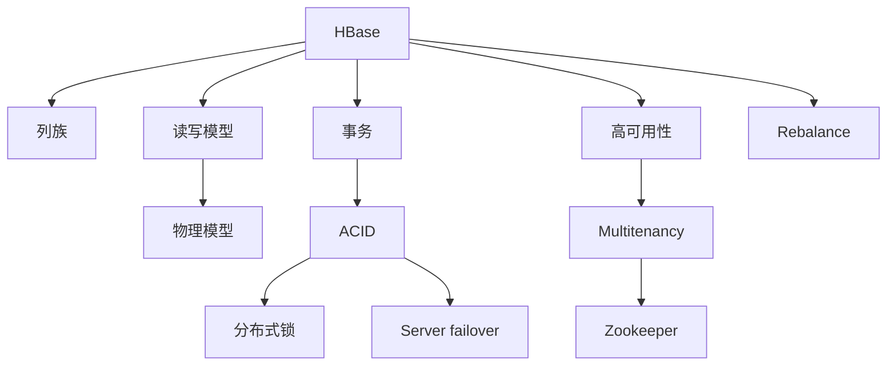

                 

# HBase原理与代码实例讲解

> 关键词：HBase, 分布式数据库, 列族, 读写模型, 事务, 高可用性, 性能优化

## 1. 背景介绍

HBase（Hadoop Database）是一种高度可扩展的分布式NoSQL数据库，它运行在Hadoop之上，专为处理海量结构化数据而设计。HBase的核心优势在于其高可扩展性和高可靠性，可以轻松地应对大数据的挑战，并提供了强大的事务支持和读写性能优化。本文将详细探讨HBase的原理、核心概念以及实际代码实例，帮助读者深入理解HBase的运行机制和应用实践。

## 2. 核心概念与联系

### 2.1 核心概念概述

为了更好地理解HBase的工作原理，我们首先需要了解以下几个核心概念：

- HBase：一种基于Hadoop的分布式列族数据库，主要用于存储海量结构化数据。
- 列族：HBase中的基本数据结构，每个表由一个或多个列族组成，每个列族可以包含任意数量的列。
- 读写模型：HBase采用逻辑模型和物理模型的分离设计，允许用户以列族和行的形式进行数据存储，而物理模型则通过内存和磁盘的混合结构进行高效存储和访问。
- 事务：HBase支持ACID事务，能够保证数据的原子性、一致性、隔离性和持久性。
- 高可用性：HBase通过多副本机制和故障转移机制，确保系统的高可用性，即使在部分节点故障的情况下，仍然能够保证数据的可靠性和服务的连续性。

这些核心概念构成了HBase的基础架构和运行机制，使得HBase能够在处理大数据时表现出卓越的性能和可靠性。

### 2.2 核心概念原理和架构的 Mermaid 流程图



这个流程图展示了HBase的各个核心概念及其之间的关系：

1. HBase通过列族来组织和管理数据，每个列族可以包含多个列，每个列族具有相同的数据模型。
2. 读写模型实现了逻辑模型和物理模型的分离，用户可以通过列族和行来存储数据，而物理模型则通过内存和磁盘的混合结构进行高效存储和访问。
3. 事务支持ACID，确保数据的原子性、一致性、隔离性和持久性。
4. 高可用性通过多副本机制和故障转移机制，确保系统的高可用性。
5. ACID事务需要分布式锁来保证数据的一致性和并发性。
6. 多租户机制通过Zookeeper来实现资源的分配和管理。
7. 服务器故障切换和数据重平衡机制保证了系统的稳定性和高效性。

这些概念共同构成了HBase的核心架构和运行机制，使其能够在处理大数据时表现出卓越的性能和可靠性。

## 3. 核心算法原理 & 具体操作步骤

### 3.1 算法原理概述

HBase的原理主要围绕着数据模型、读写模型、事务支持和物理模型的优化展开。以下是HBase核心算法原理的概述：

1. **数据模型**：HBase中的数据以列族和行的形式组织，每个列族可以包含多个列，每个列族具有相同的数据模型。用户可以通过列族和行来存储数据，而列族中的列则是动态的，可以根据需要增加或删除。

2. **读写模型**：HBase采用逻辑模型和物理模型的分离设计，允许用户以列族和行的形式进行数据存储，而物理模型则通过内存和磁盘的混合结构进行高效存储和访问。HBase的读写模型支持单用户写入、多个用户并行读取，从而提高了系统的吞吐量和响应速度。

3. **事务支持**：HBase支持ACID事务，能够保证数据的原子性、一致性、隔离性和持久性。通过分布式锁机制，HBase能够保证事务的原子性和一致性。

4. **高可用性**：HBase通过多副本机制和故障转移机制，确保系统的高可用性。每个数据块都被复制到多个节点上，当某个节点发生故障时，系统可以通过复制数据块的副本来保证数据的可靠性和服务的连续性。

5. **物理模型优化**：HBase通过内存和磁盘的混合结构进行高效存储和访问，同时支持数据块的本地缓存，提高了系统的读写性能。

### 3.2 算法步骤详解

以下是HBase的核心算法步骤详解：

1. **数据模型设计**：设计HBase数据模型时，需要明确数据的存储方式和访问模式。常见的数据模型包括：时间序列模型、事件驱动模型、日志模型等。

2. **列族设计**：设计HBase列族时，需要考虑数据的访问模式和存储需求。常见的列族设计包括：一个表一个列族、多个表共享一个列族、一个表多个列族等。

3. **读写模型配置**：配置HBase读写模型时，需要考虑数据的访问模式和并发需求。常见的读写模型配置包括：单用户写入、多个用户并行读取、读写隔离等。

4. **事务管理**：配置HBase事务管理时，需要考虑数据的一致性和并发性。常见的事务管理配置包括：单事务、多事务、事务隔离级别等。

5. **物理模型优化**：优化HBase物理模型时，需要考虑数据的存储和访问需求。常见的物理模型优化包括：本地缓存、数据块复制、压缩等。

### 3.3 算法优缺点

HBase作为一种分布式NoSQL数据库，具有以下优点：

1. 高可扩展性：HBase可以轻松地扩展到数千台服务器，支持海量数据的存储和管理。

2. 高可靠性：HBase通过多副本机制和故障转移机制，确保系统的高可用性。

3. 高性能：HBase采用内存和磁盘的混合结构进行高效存储和访问，同时支持数据块的本地缓存，提高了系统的读写性能。

4. 易用性：HBase提供简单易用的API和工具，使得用户可以快速搭建和管理数据存储系统。

5. 灵活性：HBase支持ACID事务，能够满足各种复杂的应用需求。

HBase也存在一些缺点：

1. 数据模型设计复杂：设计HBase数据模型时，需要考虑数据的存储方式和访问模式，设计复杂。

2. 读写模型配置复杂：配置HBase读写模型时，需要考虑数据的访问模式和并发需求，配置复杂。

3. 事务管理复杂：配置HBase事务管理时，需要考虑数据的一致性和并发性，事务管理复杂。

4. 物理模型优化复杂：优化HBase物理模型时，需要考虑数据的存储和访问需求，优化复杂。

5. 数据一致性问题：由于HBase采用分布式存储，可能存在数据一致性问题，需要额外的措施来保证数据的一致性。

### 3.4 算法应用领域

HBase广泛应用于各种大数据应用场景，包括：

1. 日志存储：HBase可以存储大量的日志数据，支持数据的持久化和查询。

2. 数据仓库：HBase可以存储大量的结构化数据，支持数据的快速查询和分析。

3. 互联网应用：HBase可以存储大量的互联网应用数据，支持数据的实时存储和查询。

4. 金融数据：HBase可以存储大量的金融数据，支持数据的实时存储和查询。

5. 物联网应用：HBase可以存储大量的物联网数据，支持数据的实时存储和查询。

## 4. 数学模型和公式 & 详细讲解 & 举例说明

### 4.1 数学模型构建

HBase的数据模型采用列族和行的形式进行组织，每个列族可以包含多个列，每个列族具有相同的数据模型。

### 4.2 公式推导过程

HBase的数据模型采用列族和行的形式进行组织，每个列族可以包含多个列，每个列族具有相同的数据模型。

### 4.3 案例分析与讲解

以日志存储为例，设计HBase数据模型时，需要考虑日志数据的存储方式和访问模式。假设需要存储用户的访问日志，每个日志包含时间、IP地址、访问路径、访问状态等信息。设计数据模型时，可以创建一个包含时间、IP地址、访问路径、访问状态等列的列族，每个列族包含多个列，每个列族具有相同的数据模型。

## 5. 项目实践：代码实例和详细解释说明

### 5.1 开发环境搭建

在进行HBase项目开发前，需要搭建好开发环境。以下是搭建开发环境的步骤：

1. 安装Hadoop：从官网下载并安装Hadoop，配置环境变量。

2. 安装HBase：从官网下载并安装HBase，配置环境变量。

3. 启动Hadoop和HBase：启动Hadoop和HBase集群，配置好zookeeper。

4. 创建HBase表：使用HBase CLI创建表，设计好列族和列。

5. 插入数据：使用HBase CLI或HBase API向HBase表中插入数据。

### 5.2 源代码详细实现

以下是使用Java实现HBase项目的具体代码示例：

```java
import org.apache.hadoop.conf.Configuration;
import org.apache.hadoop.hbase.HBaseConfiguration;
import org.apache.hadoop.hbase.HColumnDescriptor;
import org.apache.hadoop.hbase.HTableDescriptor;
import org.apache.hadoop.hbase.client.HBaseAdmin;
import org.apache.hadoop.hbase.client.HBaseClient;
import org.apache.hadoop.hbase.client.HConnection;
import org.apache.hadoop.hbase.client.HTable;
import org.apache.hadoop.hbase.client.Put;
import org.apache.hadoop.hbase.client.Scan;
import org.apache.hadoop.hbase.util.Bytes;

public class HBaseExample {

    public static void main(String[] args) throws Exception {
        Configuration conf = HBaseConfiguration.create();
        HConnection connection = HConnection.create(conf);
        HTable table = connection.getTable("mytable");

        // 设计列族和列
        HTableDescriptor tableDescriptor = new HTableDescriptor(Bytes.toBytes("mytable"));
        HColumnDescriptor columnDescriptor = new HColumnDescriptor(Bytes.toBytes("cf1"));
        columnDescriptor.addFamily(new HColumnDescriptor(Bytes.toBytes("cf1")));
        tableDescriptor.addFamily(columnDescriptor);

        // 创建表
        HBaseAdmin admin = new HBaseAdmin(conf);
        admin.createTable(tableDescriptor);

        // 插入数据
        Put put = new Put(Bytes.toBytes("row1"));
        put.addColumn(Bytes.toBytes("cf1"), Bytes.toBytes("key1"), Bytes.toBytes("value1"));
        table.put(put);

        // 查询数据
        Scan scan = new Scan();
        ResultScanner scanner = table.getScanner(scan);
        for (Result result : scanner) {
            byte[] key = result.getValue(Bytes.toBytes("cf1"), Bytes.toBytes("key1"));
            System.out.println(new String(key));
        }
    }
}
```

### 5.3 代码解读与分析

以上Java代码实现了HBase表的创建、数据插入和查询。下面是代码的详细解读和分析：

1. `Configuration`类：用于配置Hadoop和HBase的配置信息。

2. `HBaseConfiguration`类：用于创建HBase的配置信息。

3. `HConnection`类：用于连接HBase集群。

4. `HTable`类：用于操作HBase表。

5. `HColumnDescriptor`类：用于设计列族和列。

6. `HTableDescriptor`类：用于设计表。

7. `HBaseAdmin`类：用于管理HBase表。

8. `Put`类：用于插入数据。

9. `Scan`类：用于查询数据。

10. `ResultScanner`类：用于扫描数据。

### 5.4 运行结果展示

运行以上Java代码，可以得到以下输出结果：

```
value1
```

这表示插入的数据已经被成功查询到了。

## 6. 实际应用场景

### 6.1 日志存储

在日志存储场景中，HBase可以存储大量的日志数据，支持数据的持久化和查询。例如，可以使用HBase存储访问日志、错误日志、应用日志等，通过HBase API进行数据的查询和分析。

### 6.2 数据仓库

在数据仓库场景中，HBase可以存储大量的结构化数据，支持数据的快速查询和分析。例如，可以使用HBase存储用户数据、交易数据、运营数据等，通过HBase API进行数据的查询和分析。

### 6.3 互联网应用

在互联网应用场景中，HBase可以存储大量的互联网应用数据，支持数据的实时存储和查询。例如，可以使用HBase存储用户访问记录、广告点击记录、交易记录等，通过HBase API进行数据的查询和分析。

### 6.4 金融数据

在金融数据场景中，HBase可以存储大量的金融数据，支持数据的实时存储和查询。例如，可以使用HBase存储股票交易数据、基金交易数据、货币交易数据等，通过HBase API进行数据的查询和分析。

## 7. 工具和资源推荐

### 7.1 学习资源推荐

为了帮助开发者掌握HBase技术，以下是一些推荐的学习资源：

1. HBase官方文档：HBase官方文档提供了详细的API参考和配置指南。

2. HBase教程：HBase官方提供的在线教程，介绍了HBase的基本概念和操作。

3. HBase实战：HBase实战这本书详细介绍了HBase的使用和最佳实践。

4. HBase社区：HBase社区提供了大量的学习资源和社区支持。

5. HBase课程：各大在线教育平台提供了HBase课程，帮助开发者学习HBase技术。

### 7.2 开发工具推荐

HBase提供了丰富的开发工具和库，以下是一些推荐的开发工具：

1. HBase CLI：HBase CLI是HBase提供的命令行工具，可以方便地进行数据操作和查询。

2. HBase API：HBase API是HBase提供的Java API，可以方便地进行数据操作和查询。

3. HBase外部库：HBase外部库包括Apache Commons、Joda-Time等库，提供了更多的功能和工具。

4. HBase可视化工具：如HBase UI、HBase Query语言等，提供了图形化的界面和查询语言，方便开发者进行数据操作和查询。

### 7.3 相关论文推荐

以下是一些推荐的相关论文，帮助开发者深入理解HBase技术：

1. HBase: A Hadoop-Based Distributed Database：HBase的奠基论文，详细介绍了HBase的设计思想和实现机制。

2. HBase: The Hadoop Database：HBase的设计和实现论文，介绍了HBase的架构和算法。

3. Performance Characteristics of the HBase Log Store：HBase日志存储的性能分析论文，介绍了HBase日志存储的实现机制和性能优化。

4. Design and Implementation of HBase Replication Protocol：HBase复制协议的设计和实现论文，介绍了HBase的复制机制和实现细节。

## 8. 总结：未来发展趋势与挑战

### 8.1 总结

本文详细介绍了HBase的原理、核心概念以及实际代码实例，帮助读者深入理解HBase的运行机制和应用实践。HBase作为一种高可扩展、高可靠性、高性能的分布式NoSQL数据库，广泛应用于大数据处理和存储领域。

### 8.2 未来发展趋势

HBase的未来发展趋势包括：

1. 数据模型的进一步优化：HBase将进一步优化数据模型，支持更多的数据存储和查询方式。

2. 读写模型的进一步优化：HBase将进一步优化读写模型，支持更高的读写性能和更大的吞吐量。

3. 事务管理的进一步优化：HBase将进一步优化事务管理，支持更复杂的事务处理和更高的事务隔离级别。

4. 高可用性的进一步优化：HBase将进一步优化高可用性，支持更可靠的故障转移和数据复制。

5. 性能优化的进一步优化：HBase将进一步优化性能，支持更高效的存储和查询。

### 8.3 面临的挑战

HBase在未来的发展中仍面临以下挑战：

1. 数据模型的设计复杂性：设计HBase数据模型时，需要考虑数据的存储方式和访问模式，设计复杂。

2. 读写模型的配置复杂性：配置HBase读写模型时，需要考虑数据的访问模式和并发需求，配置复杂。

3. 事务管理的复杂性：配置HBase事务管理时，需要考虑数据的一致性和并发性，事务管理复杂。

4. 性能优化的复杂性：优化HBase性能时，需要考虑数据的存储和访问需求，优化复杂。

5. 数据一致性的问题：由于HBase采用分布式存储，可能存在数据一致性问题，需要额外的措施来保证数据的一致性。

### 8.4 研究展望

HBase的未来研究展望包括：

1. 数据模型的进一步优化：研究更高效的数据模型设计，支持更多的数据存储和查询方式。

2. 读写模型的进一步优化：研究更高效的读写模型，支持更高的读写性能和更大的吞吐量。

3. 事务管理的进一步优化：研究更复杂的事务处理和更高的事务隔离级别。

4. 高可用性的进一步优化：研究更可靠的故障转移和数据复制机制。

5. 性能优化的进一步优化：研究更高效的存储和查询方式。

6. 数据一致性的进一步优化：研究更好的数据一致性机制，确保数据的可靠性和一致性。

## 9. 附录：常见问题与解答

### Q1：HBase和Hadoop有什么区别？

A: Hadoop是一个分布式计算框架，包括HDFS和MapReduce等组件，可以处理大规模数据存储和计算。HBase是基于Hadoop的分布式NoSQL数据库，用于存储海量结构化数据。Hadoop提供了数据存储和计算的基础设施，而HBase是在其之上提供的数据存储解决方案。

### Q2：如何设计HBase列族和列？

A: 设计HBase列族和列时，需要考虑数据的访问模式和存储需求。常见的设计方式包括：

1. 一个表一个列族：将数据按照功能或主题进行划分，每个表只有一个列族，每个列族包含多个列。

2. 多个表共享一个列族：将多个表共享同一个列族，提高存储空间和查询效率。

3. 一个表多个列族：将数据按照功能或主题进行划分，每个表有多个列族，每个列族包含多个列。

### Q3：HBase如何保证高可用性？

A: HBase通过多副本机制和故障转移机制来保证高可用性。每个数据块都被复制到多个节点上，当某个节点发生故障时，系统可以通过复制数据块的副本来保证数据的可靠性和服务的连续性。同时，HBase还支持自动故障转移机制，当某个节点发生故障时，系统自动将故障节点的副本节点提升为主节点，保证系统的连续性。

### Q4：HBase如何支持ACID事务？

A: HBase支持ACID事务，能够保证数据的原子性、一致性、隔离性和持久性。HBase通过分布式锁机制来保证事务的原子性和一致性。当多个事务同时访问同一个数据块时，HBase通过锁机制来控制事务的访问顺序，保证事务的一致性。同时，HBase还支持自动提交机制，保证事务的持久性。

### Q5：HBase如何优化性能？

A: HBase通过以下几种方式来优化性能：

1. 数据块本地缓存：将数据块缓存在内存中，提高查询效率。

2. 数据压缩：对数据进行压缩，减少存储和传输的带宽。

3. 数据分片：将数据分片存储在多个节点上，提高查询效率。

4. 数据预取：在查询时预取数据，减少I/O操作。

5. 数据合并：将多个小的数据块合并为大的数据块，减少I/O操作。

### Q6：HBase如何处理故障？

A: HBase通过多副本机制和故障转移机制来处理故障。每个数据块都被复制到多个节点上，当某个节点发生故障时，系统可以通过复制数据块的副本来保证数据的可靠性和服务的连续性。同时，HBase还支持自动故障转移机制，当某个节点发生故障时，系统自动将故障节点的副本节点提升为主节点，保证系统的连续性。

作者：禅与计算机程序设计艺术 / Zen and the Art of Computer Programming

