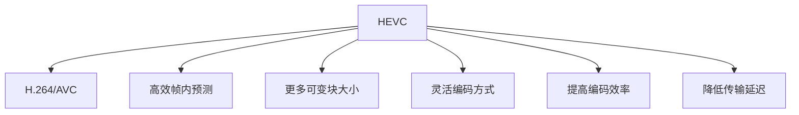

                 

# HEVC 视频编码格式：高效压缩和传输高清视频

> 关键词：HEVC, 视频压缩, 高效传输, 高清视频, 视频编码标准

## 1. 背景介绍

随着数字视频技术的迅猛发展，高清视频（HD/UHD/4K/8K）的分辨率和帧率越来越高，视频内容变得更为生动、详细。然而，这些高质量视频文件占用大量的存储和传输带宽，给数据存储和网络传输带来了严峻的挑战。为了解决这一问题，视频编码标准逐渐向高效压缩和低延时传输方向发展，HEVC（H.265/H.265/H.264/AVC/14496-10/ITU-T H.265）成为了新一代的国际标准。

### 1.1 视频压缩的必要性
视频压缩技术可以通过降低视频文件的大小，节省存储空间，同时保持视频的质量，提高传输效率。它不仅对视频内容的存储和传输至关重要，也是流媒体服务、在线视频、移动通信等领域的基础技术。

### 1.2 HEVC的诞生背景
高清晰度电视（HDTV）的普及和互联网视频服务的兴起推动了对视频压缩技术的更高要求。H.264/AVC虽然已经在高清视频编码上取得了显著效果，但面对更高分辨率、更高帧率、更大数据量的视频应用时，其压缩性能仍显不足。在这样的背景下，国际标准化组织（ISO/IEC和ITU-T）联合推出了高效视频压缩标准HEVC。

## 2. 核心概念与联系

### 2.1 核心概念概述

HEVC（H.265）基于现有的H.264（H.264/AVC/14496-10/ITU-T H.264）标准，采用了一些新技术，如更高的编码效率、更好的帧内预测、更多的可变块大小、更灵活的编码方式等。这些技术使得HEVC在同等编码质量下，能够提供更高的压缩效率和更低的传输延迟。

### 2.2 核心概念原理和架构的 Mermaid 流程图


## 3. 核心算法原理 & 具体操作步骤

### 3.1 算法原理概述
HEVC采用更加复杂的预测和变换技术，实现了比H.264更高的压缩效率和更好的图像质量。其核心算法包括帧内预测、帧间预测、变换编码和熵编码等。

#### 3.1.1 帧内预测
HEVC引入了更复杂的帧内预测技术，如角块预测、邻域滤波器等，能更好地捕捉图像的细节信息，提高压缩效率。

#### 3.1.2 帧间预测
HEVC支持更多的预测模式，包括邻域内预测、帧间预测等，通过引入更多预测单元，减少了预测块大小的可选性，提升了压缩效率。

#### 3.1.3 变换编码
HEVC引入了更高级的变换编码方式，如使用更高效的变换基（例如64x64块）和更复杂的逆变换。这使得HEVC在低延时、高压缩比场景中表现更佳。

#### 3.1.4 熵编码
HEVC采用更加高效的熵编码方式，如自适应可变长度编码（AVLC）和上下文自适应二进制算术编码（CABAC），进一步提升了编码效率。

### 3.2 算法步骤详解
HEVC的视频编码和解码过程包含以下几个关键步骤：

1. 划分视频帧：将视频帧分割为宏块（MB）和编码单元（CU），每个CU内部可以独立进行编码。
2. 帧内预测和变换编码：对于帧内图像，采用高级预测和变换编码技术，减少信息冗余。
3. 帧间预测和运动补偿：对于帧间图像，利用帧间预测和运动补偿技术，减少预测块大小，提升编码效率。
4. 熵编码：将编码后的位流进行熵编码，压缩信息量，降低传输带宽。
5. 解码和重建：对接收到的编码数据进行解码和重建，恢复原始视频内容。

### 3.3 算法优缺点
#### 3.3.1 优点
- 更高的压缩效率：HEVC在同等压缩质量下，压缩效率比H.264提高了50%以上。
- 更好的图像质量：HEVC支持更复杂的分块和帧间预测技术，提供了更好的图像细节和清晰度。
- 支持更多的预测模式：HEVC支持更多的预测模式，适应不同的视频场景，提高了压缩效率和图像质量。
- 更好的低延时编码：HEVC在低延时场景中表现更佳，适合实时视频应用。

#### 3.3.2 缺点
- 编码和解码复杂度高：HEVC算法复杂度较高，需要更强的硬件支持，增加了设备和算法的成本。
- 内存需求高：HEVC在编码和解码过程中，需要更多的内存空间，这对设备和系统的内存要求更高。
- 编码时间较长：由于HEVC算法复杂度较高，视频编码时间较长，对实时传输存在挑战。

### 3.4 算法应用领域
HEVC广泛应用于视频编解码、流媒体传输、高清视频存储等多个领域。其主要应用包括：

- 家庭娱乐：用于HDTV和UHD视频内容的压缩和传输，提供更高清晰度的视频体验。
- 专业视频：如电影、电视制作、体育赛事转播等，要求高效压缩和高质量传输。
- 网络视频：用于在线视频、流媒体服务、社交媒体直播等，提升用户体验和网络传输效率。
- 移动设备：如智能手机、平板电脑等移动设备的视频录制和传输，满足低延时、高效压缩的需求。

## 4. 数学模型和公式 & 详细讲解 & 举例说明

### 4.1 数学模型构建
HEVC的数学模型主要涉及视频帧的划分、预测和编码。帧内预测和帧间预测的数学模型如下：

- 帧内预测：对于当前帧的宏块，使用参考帧中的像素点进行预测，得到预测值 $P_{MB}$，计算预测误差 $E_{MB}$。
- 帧间预测：对于当前帧的宏块，使用参考帧中的像素点进行预测，得到预测值 $P_{MB}$，计算预测误差 $E_{MB}$，更新运动矢量 $MV$。

### 4.2 公式推导过程
帧内预测的误差 $E_{MB}$ 可以表示为：

$$
E_{MB} = \sum_{i=0}^{M-1} \sum_{j=0}^{N-1} \left(P_{MB(i,j)} - S(i,j)\right)^2
$$

其中，$P_{MB(i,j)}$ 表示预测值，$S(i,j)$ 表示当前宏块的像素值。

帧间预测的误差 $E_{MB}$ 可以表示为：

$$
E_{MB} = \sum_{i=0}^{M-1} \sum_{j=0}^{N-1} \left(P_{MB(i,j)} - S(i+MV_{x}, j+MV_{y})\right)^2
$$

其中，$MV_{x}$ 和 $MV_{y}$ 分别表示水平和垂直方向的运动矢量，$S(i+MV_{x}, j+MV_{y})$ 表示参考帧中对应的像素值。

### 4.3 案例分析与讲解
以下是一个简化的HEVC帧内预测案例，假设一个16x16的宏块，用其左上角的8x8块作为预测块，得到如下的预测误差：

- 预测块 $P_{MB}$ 与当前宏块 $S$ 的差值为：

$$
\Delta = \begin{bmatrix}
-2 & 0 & 2 \\
0 & 0 & 0 \\
2 & 0 & -2
\end{bmatrix}
$$

- 预测误差 $E_{MB}$ 为：

$$
E_{MB} = \sum_{i=0}^{3} \sum_{j=0}^{3} \left(\Delta(i,j)\right)^2
$$

### 4.4 举例说明
以一个2x2的宏块为例，其帧内预测和变换编码过程如下：

- 首先对每个8x8块进行预测，计算预测误差。
- 然后对预测误差进行离散余弦变换（DCT），变换后的系数表示为 $\hat{S}$。
- 接着对变换系数进行量化，得到量化后的系数 $\hat{S}_{Q}$。
- 最后对量化后的系数进行熵编码，得到压缩后的二进制数据。

## 5. 项目实践：代码实例和详细解释说明

### 5.1 开发环境搭建
为了进行HEVC的编码和解码，需要搭建一个HEVC编码器和一个HEVC解码器。编码器和解码器通常使用FFmpeg等开源工具。以下是搭建FFmpeg环境的简要步骤：

1. 从FFmpeg官网下载适合你操作系统的安装包，解压并安装。
2. 安装依赖库，如libavcodec、libavformat、libswresample等。
3. 配置FFmpeg配置文件，设定编码器和解码器参数。
4. 测试FFmpeg命令，确保安装成功。

### 5.2 源代码详细实现
以下是一个使用FFmpeg进行HEVC编码和解码的示例代码：

#### 5.2.1 HEVC编码示例
```bash
ffmpeg -i input.mp4 -c:v libx265 -crf 22 output_hevc.mp4
```

#### 5.2.2 HEVC解码示例
```bash
ffmpeg -i output_hevc.mp4 -c:v libx265 -crf 22 output_hevc_decoded.jpg
```

### 5.3 代码解读与分析
FFmpeg是一个强大的多媒体处理工具，支持多种视频编码标准，包括HEVC。其编码器 `libx265` 和解码器 `libx265` 提供了高效的HEVC压缩和解压缩功能。编码参数 `-crf` 表示编码质量，数值越小，压缩率越高，质量越好。

## 6. 实际应用场景

### 6.1 流媒体服务
流媒体服务提供商使用HEVC对视频内容进行高效压缩和编码，降低传输带宽和存储成本，同时提供高质量的流媒体服务。例如，Netflix、YouTube等视频平台广泛使用HEVC编码标准。

### 6.2 移动设备
智能手机和平板电脑等移动设备的视频录制和播放功能越来越多地使用HEVC标准，提供更高效、更流畅的视频体验。

### 6.3 智慧医疗
HEVC在智慧医疗领域的应用包括远程医疗、电子病历记录、视频会议等。通过高效压缩和传输高清视频，提升医疗服务的质量和效率。

### 6.4 自动驾驶
自动驾驶汽车使用HEVC压缩高清摄像头拍摄的图像，减少数据传输延迟，提高实时性和安全性。

### 6.5 虚拟现实
虚拟现实（VR）和增强现实（AR）应用需要高效压缩高清视频，HEVC提供了优异的压缩效率和高质量的图像，支持实时传输和互动体验。

### 6.6 智慧城市
智慧城市中的视频监控、交通管理等应用使用HEVC压缩高清晰度视频，降低数据存储和传输成本，提高管理效率。

## 7. 工具和资源推荐

### 7.1 学习资源推荐
1. HEVC标准文档：HEVC官方标准文档，详细介绍了HEVC的编码和解码流程。
2. HEVC教程：YouTube和Bilibili等视频平台上有许多HEVC的编码和解码教程，适合初学者。
3. HEVC论文：Google Scholar、IEEE Xplore等数据库上可以找到大量HEVC相关的学术论文。
4. HEVC开源项目：Github上有许多HEVC的源码实现和优化算法，可供学习和参考。
5. HEVC社区：IEEE等国际标准组织和工业联盟，提供HEVC的最新动态和讨论平台。

### 7.2 开发工具推荐
1. FFmpeg：FFmpeg是开源的视频处理工具，支持多种视频编码标准，包括HEVC。
2. Kodi：Kodi是一个流行的媒体播放器，支持多种视频编码格式，包括HEVC。
3. VLC：VLC是一个跨平台的媒体播放器，支持HEVC解码。
4. GStreamer：GStreamer是一个流媒体处理框架，支持HEVC编码和解码。

### 7.3 相关论文推荐
1. 《HEVC: One-More-Bite-of-the-Cherry》（HEVC: One More Bit of the Cherry）
2. 《High-Efficiency Video Coding》
3. 《A Comparative Study of Video Coding Standards: MPEG-2, H.264/AVC, H.265/HEVC and MPEG-H HEVC》
4. 《Adaptive Coder Control for HEVC》
5. 《High-Efficiency Video Coding (HEVC) for Wireless Video Multicast》

## 8. 总结：未来发展趋势与挑战

### 8.1 研究成果总结
HEVC作为新一代视频压缩标准，显著提高了压缩效率和图像质量，成为高清视频编码的主流选择。HEVC标准被广泛应用于全球各地的流媒体服务、移动设备、智慧医疗等领域。

### 8.2 未来发展趋势
1. HEVC的迭代更新：未来随着视频分辨率和帧率不断提高，HEVC标准将进行迭代更新，以应对更高的视频压缩需求。
2. HEVC的深度学习优化：结合深度学习技术，对HEVC进行优化，进一步提升编码效率和图像质量。
3. HEVC的多模态融合：HEVC与其他视频编码标准（如AV1、VP9等）的结合，实现多模态融合，提高视频压缩和传输效率。
4. HEVC的生态系统：建立更加完善的HEVC生态系统，包括编码器、解码器、编码库等，提供更好的开发和应用支持。

### 8.3 面临的挑战
1. 硬件需求高：HEVC算法复杂度高，需要更强的硬件支持，增加了设备和算法的成本。
2. 内存消耗大：HEVC在编码和解码过程中，需要更多的内存空间，这对设备和系统的内存要求更高。
3. 编码时间较长：由于HEVC算法复杂度较高，视频编码时间较长，对实时传输存在挑战。
4. 兼容性问题：不同设备和系统对HEVC的支持和实现可能存在差异，增加了兼容性的难度。

### 8.4 研究展望
未来的HEVC研究将侧重于以下几个方面：

1. 降低硬件需求：开发更高效的软件实现和优化算法，降低HEVC的硬件需求。
2. 提高内存利用率：优化HEVC的内存管理，提高编码和解码的效率。
3. 提升编码速度：优化HEVC的编码流程，减少编码时间，提升实时性。
4. 扩展兼容性：增强HEVC在不同设备和系统之间的兼容性，确保广泛应用。

## 9. 附录：常见问题与解答

**Q1: HEVC和H.264/AVC的区别是什么？**

A: HEVC在H.264/AVC的基础上，引入了更复杂的预测和变换技术，提高了压缩效率和图像质量。HEVC支持更高的分辨率、更大的数据量和更多的预测模式，使得在同等编码质量下，HEVC比H.264/AVC提高了50%以上的压缩效率。

**Q2: HEVC的编码效率为什么这么高？**

A: HEVC引入了更复杂的帧内预测、帧间预测、变换编码和熵编码技术，提高了编码效率。帧内预测采用角块预测和邻域滤波器等技术，捕捉图像细节信息。帧间预测支持更多的预测模式，减少预测块大小，提升编码效率。变换编码使用更高效的变换基，降低预测误差。熵编码采用自适应可变长度编码和上下文自适应二进制算术编码，压缩信息量。

**Q3: 如何优化HEVC的编码性能？**

A: 优化HEVC的编码性能可以从以下几个方面入手：
1. 调整编码参数：如CRF（编码质量）、QP（量化参数）等，影响压缩效率和图像质量。
2. 选择合适的预测模式：如预测块大小、帧间预测模式等，优化编码效率。
3. 使用合适的变换基：如使用64x64块进行变换编码，提升压缩效率。
4. 优化熵编码：如采用更高效的熵编码算法，压缩信息量。

**Q4: HEVC的解码性能如何提升？**

A: 提升HEVC的解码性能可以从以下几个方面入手：
1. 优化解码器实现：使用高效的解码器实现，减少解码时间。
2. 使用预解码技术：如使用预解码加速技术，减少解码延迟。
3. 使用多线程解码：使用多线程解码技术，提高解码效率。
4. 优化解码算法：使用更高效的解码算法，提高解码速度和稳定性。

**Q5: HEVC的编码速度如何加快？**

A: 加快HEVC的编码速度可以从以下几个方面入手：
1. 使用并行化编码：使用并行化编码技术，提高编码效率。
2. 优化编码算法：优化编码算法，减少编码时间。
3. 使用硬件加速：使用GPU等硬件加速技术，提升编码速度。
4. 使用高效的编码器实现：使用高效的编码器实现，减少编码时间。

**Q6: HEVC的解码速度如何提升？**

A: 提升HEVC的解码速度可以从以下几个方面入手：
1. 使用并行化解码：使用并行化解码技术，提高解码效率。
2. 优化解码算法：优化解码算法，减少解码时间。
3. 使用硬件加速：使用GPU等硬件加速技术，提升解码速度。
4. 使用高效的解码器实现：使用高效的解码器实现，减少解码时间。

**Q7: HEVC在实际应用中有哪些挑战？**

A: HEVC在实际应用中面临以下挑战：
1. 硬件需求高：HEVC算法复杂度高，需要更强的硬件支持，增加了设备和算法的成本。
2. 内存消耗大：HEVC在编码和解码过程中，需要更多的内存空间，这对设备和系统的内存要求更高。
3. 编码时间较长：由于HEVC算法复杂度较高，视频编码时间较长，对实时传输存在挑战。
4. 兼容性问题：不同设备和系统对HEVC的支持和实现可能存在差异，增加了兼容性的难度。

**Q8: HEVC的未来发展方向是什么？**

A: HEVC的未来发展方向包括：
1. HEVC的迭代更新：未来随着视频分辨率和帧率不断提高，HEVC标准将进行迭代更新，以应对更高的视频压缩需求。
2. HEVC的深度学习优化：结合深度学习技术，对HEVC进行优化，进一步提升编码效率和图像质量。
3. HEVC的多模态融合：HEVC与其他视频编码标准（如AV1、VP9等）的结合，实现多模态融合，提高视频压缩和传输效率。
4. HEVC的生态系统：建立更加完善的HEVC生态系统，包括编码器、解码器、编码库等，提供更好的开发和应用支持。

**Q9: 如何降低HEVC的硬件需求？**

A: 降低HEVC的硬件需求可以从以下几个方面入手：
1. 开发更高效的软件实现：使用高效的软件实现，降低对硬件的需求。
2. 优化算法：优化HEVC的编码和解码算法，提高算法的效率。
3. 使用硬件加速：使用GPU等硬件加速技术，降低对硬件的需求。
4. 降低内存占用：优化HEVC的内存管理，降低内存占用。

**Q10: HEVC的编码速度如何加快？**

A: 加快HEVC的编码速度可以从以下几个方面入手：
1. 使用并行化编码：使用并行化编码技术，提高编码效率。
2. 优化编码算法：优化编码算法，减少编码时间。
3. 使用硬件加速：使用GPU等硬件加速技术，提升编码速度。
4. 使用高效的编码器实现：使用高效的编码器实现，减少编码时间。

**Q11: HEVC的解码速度如何提升？**

A: 提升HEVC的解码速度可以从以下几个方面入手：
1. 使用并行化解码：使用并行化解码技术，提高解码效率。
2. 优化解码算法：优化解码算法，减少解码时间。
3. 使用硬件加速：使用GPU等硬件加速技术，提升解码速度。
4. 使用高效的解码器实现：使用高效的解码器实现，减少解码时间。

**Q12: HEVC的编码质量如何提高？**

A: 提高HEVC的编码质量可以从以下几个方面入手：
1. 调整编码参数：如CRF（编码质量）、QP（量化参数）等，影响压缩效率和图像质量。
2. 选择合适的预测模式：如预测块大小、帧间预测模式等，优化编码效率。
3. 使用合适的变换基：如使用64x64块进行变换编码，提升压缩效率。
4. 优化熵编码：如采用更高效的熵编码算法，压缩信息量。

**Q13: HEVC的解码性能如何提升？**

A: 提升HEVC的解码性能可以从以下几个方面入手：
1. 优化解码器实现：使用高效的解码器实现，减少解码时间。
2. 使用预解码技术：如使用预解码加速技术，减少解码延迟。
3. 使用多线程解码：使用多线程解码技术，提高解码效率。
4. 优化解码算法：使用更高效的解码算法，提高解码速度和稳定性。

**Q14: 如何处理HEVC的兼容问题？**

A: 处理HEVC的兼容问题可以从以下几个方面入手：
1. 标准化兼容接口：制定标准化的兼容接口，确保不同设备和系统之间的兼容。
2. 实现软件兼容：开发兼容HEVC的软件实现，确保软件之间的兼容。
3. 优化硬件兼容：优化硬件兼容技术，确保硬件之间的兼容。
4. 提供兼容工具：提供兼容工具，帮助用户解决兼容问题。

**Q15: 如何提升HEVC的编码效率？**

A: 提升HEVC的编码效率可以从以下几个方面入手：
1. 优化编码算法：优化HEVC的编码算法，减少编码时间。
2. 使用高效的软件实现：使用高效的软件实现，提高编码效率。
3. 使用硬件加速：使用GPU等硬件加速技术，提升编码速度。
4. 降低内存占用：优化HEVC的内存管理，降低内存占用。

**Q16: 如何提升HEVC的解码效率？**

A: 提升HEVC的解码效率可以从以下几个方面入手：
1. 优化解码算法：优化HEVC的解码算法，减少解码时间。
2. 使用高效的软件实现：使用高效的软件实现，提高解码效率。
3. 使用硬件加速：使用GPU等硬件加速技术，提升解码速度。
4. 降低内存占用：优化HEVC的内存管理，降低内存占用。

**Q17: HEVC的未来发展方向是什么？**

A: HEVC的未来发展方向包括：
1. HEVC的迭代更新：未来随着视频分辨率和帧率不断提高，HEVC标准将进行迭代更新，以应对更高的视频压缩需求。
2. HEVC的深度学习优化：结合深度学习技术，对HEVC进行优化，进一步提升编码效率和图像质量。
3. HEVC的多模态融合：HEVC与其他视频编码标准（如AV1、VP9等）的结合，实现多模态融合，提高视频压缩和传输效率。
4. HEVC的生态系统：建立更加完善的HEVC生态系统，包括编码器、解码器、编码库等，提供更好的开发和应用支持。

**Q18: 如何优化HEVC的编码参数？**

A: 优化HEVC的编码参数可以从以下几个方面入手：
1. 调整CRF（编码质量）：CRF值越小，压缩率越高，质量越好。
2. 调整QP（量化参数）：QP值越小，压缩率越高，图像质量越低。
3. 选择合适的预测模式：如预测块大小、帧间预测模式等，优化编码效率。
4. 使用合适的变换基：如使用64x64块进行变换编码，提升压缩效率。
5. 优化熵编码：如采用更高效的熵编码算法，压缩信息量。

**Q19: HEVC的解码算法如何优化？**

A: 优化HEVC的解码算法可以从以下几个方面入手：
1. 使用高效的解码器实现：使用高效的解码器实现，减少解码时间。
2. 优化解码算法：优化HEVC的解码算法，提高解码效率。
3. 使用硬件加速：使用GPU等硬件加速技术，提升解码速度。
4. 降低内存占用：优化HEVC的内存管理，降低内存占用。

**Q20: HEVC的编码质量如何提高？**

A: 提高HEVC的编码质量可以从以下几个方面入手：
1. 调整CRF（编码质量）：CRF值越小，压缩率越高，质量越好。
2. 调整QP（量化参数）：QP值越小，压缩率越高，图像质量越低。
3. 选择合适的预测模式：如预测块大小、帧间预测模式等，优化编码效率。
4. 使用合适的变换基：如使用64x64块进行变换编码，提升压缩效率。
5. 优化熵编码：如采用更高效的熵编码算法，压缩信息量。

**Q21: 如何优化HEVC的编码器实现？**

A: 优化HEVC的编码器实现可以从以下几个方面入手：
1. 使用并行化编码：使用并行化编码技术，提高编码效率。
2. 优化编码算法：优化HEVC的编码算法，减少编码时间。
3. 使用硬件加速：使用GPU等硬件加速技术，提升编码速度。
4. 降低内存占用：优化HEVC的内存管理，降低内存占用。

**Q22: 如何优化HEVC的解码器实现？**

A: 优化HEVC的解码器实现可以从以下几个方面入手：
1. 使用并行化解码：使用并行化解码技术，提高解码效率。
2. 优化解码算法：优化HEVC的解码算法，减少解码时间。
3. 使用硬件加速：使用GPU等硬件加速技术，提升解码速度。
4. 降低内存占用：优化HEVC的内存管理，降低内存占用。

**Q23: HEVC的编码器实现和解码器实现的区别是什么？**

A: HEVC的编码器实现和解码器实现的区别主要在于：
1. 编码器实现：编码器实现主要负责将原始视频转换为压缩后的HEVC流。
2. 解码器实现：解码器实现主要负责将HEVC流解码为原始视频。
3. 编码器实现需要考虑编码效率、压缩质量、硬件需求等因素。
4. 解码器实现需要考虑解码效率、解码延迟、解码准确性等因素。
5. 编码器实现通常使用软硬件加速技术，提高编码效率。
6. 解码器实现通常使用软硬件加速技术，提高解码速度。

**Q24: HEVC的编码器实现和解码器实现的设计原则是什么？**

A: HEVC的编码器实现和解码器实现的设计原则主要包括：
1. 高效性：设计和实现高效的编码和解码算法，减少时间和资源消耗。
2. 可扩展性：设计和实现可扩展的编码和解码实现，支持不同分辨率、帧率、比特率等参数。
3. 兼容性：设计和实现兼容HEVC标准的编码和解码实现，确保与不同设备和系统的兼容性。
4. 稳定性：设计和实现稳定的编码和解码实现，确保编码和解码过程的稳定性。
5. 安全性：设计和实现安全的编码和解码实现，确保数据和系统的安全。

**Q25: HEVC的编码器实现和解码器实现的应用场景是什么？**

A: HEVC的编码器实现和解码器实现的应用场景主要包括：
1. 流媒体服务：用于高质量视频内容的编码和解码，降低传输带宽和存储成本。
2. 移动设备：用于智能手机、平板电脑等设备的视频录制和播放，提供流畅的高清视频体验。
3. 智慧医疗：用于远程医疗、电子病历记录、视频会议等，提高医疗服务的质量和效率。
4. 自动驾驶：用于自动驾驶汽车的视频压缩和传输，提高实时性和安全性。
5. 虚拟现实：用于虚拟现实（VR）和增强现实（AR）应用的视频压缩和传输，提供高质量的互动体验。

**Q26: HEVC的编码器实现和解码器实现的优化方向是什么？**

A: HEVC的编码器实现和解码器实现的优化方向主要包括：
1. 降低硬件需求：开发更高效的软件实现和优化算法，降低对硬件的需求。
2. 提高内存利用率：优化HEVC的内存管理，提高编码和解码的效率。
3. 提升编码速度：优化HEVC的编码流程，减少编码时间。
4. 扩展兼容性：增强HEVC在不同设备和系统之间的兼容性，确保广泛应用。

**Q27: HEVC的编码器实现和解码器实现的未来发展方向是什么？**

A: HEVC的编码器实现和解码器实现的未来发展方向主要包括：
1. 迭代更新：未来随着视频分辨率和帧率不断提高，HEVC标准将进行迭代更新，以应对更高的视频压缩需求。
2. 深度学习优化：结合深度学习技术，对HEVC进行优化，进一步提升编码效率和图像质量。
3. 多模态融合：HEVC与其他视频编码标准（如AV1、VP9等）的结合，实现多模态融合，提高视频压缩和传输效率。
4. 生态系统建设：建立更加完善的HEVC生态系统，包括编码器、解码器、编码库等，提供更好的开发和应用支持。

**Q28: 如何优化HEVC的编码器实现？**

A: 优化HEVC的编码器实现可以从以下几个方面入手：
1. 使用并行化编码：使用并行化编码技术，提高编码效率。
2. 优化编码算法：优化HEVC的编码算法，减少编码时间。
3. 使用硬件加速：使用GPU等硬件加速技术，提升编码速度。
4. 降低内存占用：优化HEVC的内存管理，降低内存占用。

**Q29: 如何优化HEVC的解码器实现？**

A: 优化HEVC的解码器实现可以从以下几个方面入手：
1. 使用并行化解码：使用并行化解码技术，提高解码效率。
2. 优化解码算法：优化HEVC的解码算法，减少解码时间。
3. 使用硬件加速：使用GPU等硬件加速技术，提升解码速度。
4. 降低内存占用：优化HEVC的内存管理，降低内存占用。

**Q30: HEVC的编码器实现和解码器实现的设计和实现原则是什么？**

A: HEVC的编码器实现和解码器实现的设计和实现原则主要包括：
1. 高效性：设计和实现高效的编码和解码算法，减少时间和资源消耗。
2. 可扩展性：设计和实现可扩展的编码和解码实现，支持不同分辨率、帧率、比特率等参数。
3. 兼容性：设计和实现兼容HEVC标准的编码和解码实现，确保与不同设备和系统的兼容性。
4. 稳定性：设计和实现稳定的编码和解码实现，确保编码和解码过程的稳定性。
5. 安全性：设计和实现安全的编码和解码实现，确保数据和系统的安全。

**Q31: HEVC的编码器实现和解码器实现的应用场景是什么？**

A: HEVC的编码器实现和解码器实现的应用场景主要包括：
1. 流媒体服务：用于高质量视频内容的编码和解码，降低传输带宽和存储成本。
2. 移动设备：用于智能手机、平板电脑等设备的视频录制和播放，提供流畅的高清视频体验。
3. 智慧医疗：用于远程医疗、电子病历记录、视频会议等，提高医疗服务的质量和效率。
4. 自动驾驶：用于自动驾驶汽车的视频压缩和传输，提高实时性和安全性。
5. 虚拟现实：用于虚拟现实（VR）和增强现实（AR）应用的视频压缩和传输，提供高质量的互动体验。

**Q32: HEVC的编码器实现和解码器实现的优化方向是什么？**

A: HEVC的编码器实现和解码器实现的优化方向主要包括：
1. 降低硬件需求：开发更高效的软件实现和优化算法，降低对硬件的需求。
2. 提高内存利用率：优化HEVC的内存管理，提高编码和解码的效率。
3. 提升编码速度：优化HEVC的编码流程，减少编码时间。
4. 扩展兼容性：增强HEVC在不同设备和系统之间的兼容性，确保广泛应用。

**Q33: HEVC的编码器实现和解码器实现的未来发展方向是什么？**

A: HEVC的编码器实现和解码器实现的未来发展方向主要包括：
1. 迭代更新：未来随着视频分辨率和帧率不断提高，HEVC标准将进行迭代更新，以应对更高的视频压缩需求。
2. 深度学习优化：结合深度学习技术，对HEVC进行优化，进一步提升编码效率和图像质量。
3. 多模态融合：HEVC与其他视频编码标准（如AV1、VP9等）的结合，实现多模态融合，提高视频压缩和传输效率。
4. 生态系统建设：建立更加完善的HEVC生态系统，包括编码器、解码器、编码库等，提供更好的开发和应用支持。

**Q34: HEVC的编码器实现和解码器实现的常见问题是什么？**

A: HEVC的编码器实现和解码器实现的常见问题主要包括：
1. 硬件需求高：HEVC算法复杂度高，需要更强的硬件支持，增加了设备和算法的成本。
2. 内存消耗大：HEVC在编码和解码过程中，需要更多的内存空间，这对设备和系统的内存要求更高。
3. 编码时间较长：由于HEVC算法复杂度较高，视频编码时间较长，对实时传输存在挑战。
4. 兼容性问题：不同设备和系统对HEVC的支持和实现可能存在差异，增加了兼容性的难度。

**Q35: HEVC的编码器实现和解码器实现的解决方案是什么？**

A: HEVC的编码器实现和解码器实现的解决方案主要包括：
1. 降低硬件需求：开发更高效的软件实现和优化算法，降低对硬件的需求。
2. 提高内存利用率：优化HEVC的内存管理，提高编码和解码的效率。
3. 提升编码速度：优化HEVC的编码流程，减少编码时间。
4. 扩展兼容性：增强HEVC在不同设备和系统之间的兼容性，确保广泛应用。

**Q36: HEVC的编码器实现和解码器实现的技术手段是什么？**

A: HEVC的编码器实现和解码器实现的技术手段主要包括：
1. 并行化技术：使用并行化技术，提高编码和解码效率。
2. 硬件加速：使用GPU等硬件加速技术，提升编码和解码速度。
3. 算法优化：优化编码和解码算法，提高压缩率和图像质量。
4. 内存管理：优化内存管理，降低内存占用。

**Q37: HEVC的编码器实现和解码器实现的未来发展方向是什么？**

A: HEVC的编码器实现和解码器实现的未来发展方向主要包括：
1. 迭代更新：未来随着视频分辨率和帧率不断提高，HEVC标准将进行迭代更新，以应对更高的视频压缩需求。
2. 深度学习优化：结合深度学习技术，对HEVC进行优化，进一步提升编码效率和图像质量。
3. 多模态融合：HEVC与其他视频编码标准（如AV1、VP9等）的结合，实现多模态融合，提高视频压缩和传输效率。
4. 生态系统建设：建立更加完善的HEVC生态系统，包括编码器、解码器、编码库等，提供更好的开发和应用支持。

**Q38: 如何处理HEVC的兼容问题？**

A: 处理HEVC的兼容问题可以从以下几个方面入手：
1. 标准化兼容接口：制定标准化的兼容接口，确保不同设备和系统之间的兼容。
2. 实现软件兼容：开发兼容HEVC的软件实现，确保软件之间的兼容。
3. 优化硬件兼容：优化硬件兼容技术，确保硬件之间的兼容。
4. 提供兼容工具：提供兼容工具，帮助用户解决兼容问题。

**Q39: HEVC的编码器实现和解码器实现的未来发展方向是什么？**

A: HEVC的编码器实现和解码器实现的未来发展方向主要包括：
1. 迭代更新：未来随着视频分辨率和帧率不断提高，HEVC标准将进行迭代更新，以应对更高的视频压缩需求。
2. 深度学习优化：结合深度学习技术，对HEVC进行优化，进一步提升编码效率和图像质量。
3. 多模态融合：HEVC与其他视频编码标准（如AV1、VP9等）的结合，实现多模态融合，提高视频压缩和传输效率。
4. 生态系统建设：建立更加完善的HEVC生态系统，包括编码器、解码器、编码库等，提供更好的开发和应用支持。

**Q40: 如何优化HEVC的编码器实现？**

A: 优化HEVC的编码器实现可以从以下几个方面入手：
1. 使用并行化编码：使用并行化编码技术，提高编码效率。
2. 优化编码算法：优化HEVC的编码算法，减少编码时间。
3. 使用硬件加速：使用GPU等硬件加速技术，提升编码速度。
4. 降低内存占用：优化HEVC的内存管理，降低内存占用。

**Q41: 如何优化HEVC的解码器实现？**

A: 优化HEVC的解码器实现可以从以下几个方面入手：
1. 使用并行化解码：使用并行化解码技术，提高解码效率。
2. 优化解码算法：优化HEVC的解码算法，减少解码时间。
3. 使用硬件加速：使用GPU等硬件加速技术，提升解码速度。
4. 降低内存占用：优化HEVC的内存管理，降低内存占用。

**Q42: HEVC的编码器实现和解码器实现的设计和实现原则是什么？**

A: HEVC的编码器实现和解码器实现的设计和实现原则主要包括：
1. 高效性：设计和实现高效的编码和解码算法，减少时间和资源消耗。
2. 可扩展性：设计和实现可扩展的编码和解码实现，支持不同分辨率、帧率、比特率等参数。
3. 兼容性：设计和实现兼容HEVC标准的编码和解码实现，确保与不同设备和系统的兼容性。
4. 稳定性：设计和实现稳定的编码和解码实现，确保编码和解码过程的稳定性。
5. 安全性：设计和实现安全的编码和解码实现，确保数据和系统的安全。

**Q43: HEVC的编码器实现和解码器实现的应用场景是什么？**

A: HEVC的编码器实现和解码器实现的应用场景主要包括：
1. 流媒体服务：用于高质量视频内容的编码和解码，降低传输带宽和存储成本。
2. 移动设备：用于智能手机、平板电脑等设备的视频录制和播放，提供流畅的高清视频体验。
3. 智慧医疗：用于远程医疗、电子病历记录、视频会议等，提高医疗服务的质量和效率。
4. 自动驾驶：用于自动驾驶汽车的视频压缩和传输，提高实时性和安全性。
5. 虚拟现实：用于虚拟现实（VR）和增强现实（AR）应用的视频压缩和传输，提供高质量的互动体验。

**Q44: HEVC的编码器实现和解码器实现的优化方向是什么？**

A: HEVC的编码器实现和解码器实现的优化方向主要包括：
1. 降低硬件需求：开发更高效的软件实现和优化算法，降低对硬件的需求。
2. 提高内存利用率：优化HEVC的内存管理，提高编码和解码的效率。
3. 提升编码速度：优化HEVC的编码流程，减少编码时间。
4. 扩展兼容性：增强HEVC在不同设备和系统之间的兼容性，确保广泛应用。

**Q45: HEVC的编码器实现和解码器实现的未来发展方向是什么？**

A: HEVC的编码器实现和解码器实现的未来发展方向主要包括：
1. 迭代更新：未来随着视频分辨率和帧率不断提高，HEVC标准将进行迭代更新，以应对更高的视频压缩需求。
2. 深度学习优化：结合深度学习技术，对HEVC进行优化，进一步提升编码效率和图像质量。
3. 多模态融合：HEVC与其他视频编码标准（如AV1、VP9等）的结合，实现多模态融合，提高视频压缩和传输效率。
4. 生态系统建设：建立更加完善的HEVC生态系统，包括编码器、解码器、编码库等，提供更好的开发和应用支持。

**Q46: HEVC的编码器实现和解码器实现的常见问题是什么？**

A: HEVC的编码器实现和解码器实现的常见问题主要包括：
1. 硬件需求高：HEVC算法复杂度高，需要更强的硬件支持，增加了设备和算法的成本。
2. 内存消耗大：HEVC在编码和解码过程中，需要更多的内存空间，这对设备和系统的内存要求更高。
3. 编码时间较长：由于

