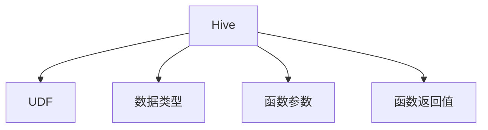

                 

# Hive UDF自定义函数原理与代码实例讲解

> 关键词：Hive, UDF, 自定义函数, 数据处理, 数据挖掘, 数据分析

## 1. 背景介绍

### 1.1 问题由来
随着大数据时代的到来，数据处理和分析的需求日益增长。Hive作为一种基于Hadoop生态的数据仓库系统，提供了高效的数据存储和查询功能。然而，Hive内置的函数和算法往往难以满足复杂和定制化的数据处理需求。为了提高数据分析的灵活性和扩展性，用户需要自定义处理函数，即用户定义函数(UDF)。

### 1.2 问题核心关键点
Hive UDF函数是一段由用户编写的代码，用于扩展Hive的数据处理功能。通过自定义函数，用户可以自定义数据处理逻辑，实现复杂的数据变换、聚合、过滤等操作。Hive UDF可以用于处理数值型、日期时间型、字符串型等多种数据类型，显著提升数据分析的效率和灵活性。

Hive UDF的核心关键点在于：
- 自定义处理逻辑。用户可以自由编写函数实现自定义数据处理逻辑，从而适应复杂的数据处理需求。
- 高性能实现。Hive UDF通过将函数代码编译成高效的原生代码，确保处理性能和数据查询效率。
- 易于部署和使用。Hive UDF可以轻松部署到Hadoop集群中，并通过SQL语句调用。

Hive UDF不仅能够提高数据处理和分析的效率，还可以帮助用户更灵活地处理数据，满足复杂的业务需求。

### 1.3 问题研究意义
研究Hive UDF的原理与实现方法，对于提高Hive系统的灵活性和扩展性，满足复杂数据处理需求具有重要意义。具体而言：

- 提供数据处理灵活性。通过自定义函数，用户可以灵活处理多种数据类型和业务逻辑，满足复杂的数据处理需求。
- 提升数据分析效率。Hive UDF的高效实现可以显著提升数据处理和查询的效率，减轻用户计算负担。
- 促进大数据生态发展。Hive UDF的开发和应用，有助于推动大数据生态系统的建设和完善，为大数据应用提供坚实的基础。

## 2. 核心概念与联系

### 2.1 核心概念概述

为更好地理解Hive UDF的原理与实现方法，本节将介绍几个密切相关的核心概念：

- Hive：基于Hadoop的分布式数据仓库系统，支持SQL查询、存储、管理大规模数据集。
- UDF：User-Defined Function，用户自定义函数，提供扩展Hive数据处理功能的能力。
- 数据类型：Hive支持多种数据类型，如数值型、字符串型、日期时间型等，UDF可以针对不同数据类型实现不同的处理逻辑。
- 函数参数：UDF可以接受多种类型和数量的参数，根据参数进行不同的处理。
- 函数返回值：UDF的输出结果可以是多种类型的数据，用于进一步的数据处理和分析。

这些核心概念之间的逻辑关系可以通过以下Mermaid流程图来展示：



这个流程图展示了大数据处理过程中，Hive UDF的核心概念及其之间的关系：

1. Hive通过数据类型、函数参数、函数返回值等，支持复杂的数据处理和分析需求。
2. UDF提供了自定义处理逻辑的能力，能够满足多种数据处理场景。
3. 数据类型、函数参数和函数返回值，都是UDF实现的关键要素。

这些概念共同构成了Hive UDF的核心框架，为其高效、灵活的数据处理提供了基础。

## 3. 核心算法原理 & 具体操作步骤
### 3.1 算法原理概述

Hive UDF的原理可以简单概括为以下几个步骤：

1. 用户编写自定义函数，定义函数名称、参数类型和返回值类型。
2. 编译用户编写的函数代码，生成高效的原生函数。
3. 在Hive中注册该自定义函数，供用户调用。
4. 用户使用SQL语句调用自定义函数，进行数据处理和分析。

Hive UDF的具体实现流程如下：

1. 用户编写自定义函数，定义函数名称、参数类型和返回值类型。
2. 通过Hive的UDF注册机制，将自定义函数编译成高效的原生代码。
3. 在Hive中注册该自定义函数，供用户调用。
4. 用户使用SQL语句调用自定义函数，进行数据处理和分析。

### 3.2 算法步骤详解

#### 3.2.1 编写自定义函数
Hive UDF的编写可以遵循以下步骤：

1. 编写函数代码：
```java
public class MyUDF {
    public String myFunction(String input) {
        return "Hello, " + input;
    }
}
```

2. 创建Java文件并保存，如MyUDF.java。

3. 编译Java文件，生成jar包：
```bash
javac MyUDF.java
jar cfe myudf.jar MyUDF.class
```

#### 3.2.2 注册自定义函数
在Hive中注册自定义函数需要以下步骤：

1. 将生成的jar包上传到Hadoop分布式文件系统。
```bash
hdfs dfs -put myudf.jar /path/to/myudf.jar
```

2. 使用Hive的UDDF函数注册自定义函数。
```sql
CREATE FUNCTION my_udf AS 'myudf.jar' USING org.apache.hadoop.hive.ql.udf.generic.GenericUDF;
```

#### 3.2.3 调用自定义函数
注册完成后，用户即可在SQL语句中使用自定义函数。
```sql
SELECT my_udf('John') FROM my_table;
```

### 3.3 算法优缺点

Hive UDF具有以下优点：

1. 灵活性高：用户可以自由编写自定义函数，实现多种数据处理逻辑。
2. 性能高效：通过将函数代码编译成高效的原生代码，确保处理性能和数据查询效率。
3. 易于部署：Hive UDF可以轻松部署到Hadoop集群中，并通过SQL语句调用。

同时，Hive UDF也存在以下缺点：

1. 编写复杂：用户需要具备一定的编程技能，编写自定义函数可能较为复杂。
2. 功能有限：Hive UDF仅支持特定类型的自定义函数，功能有一定的局限性。
3. 调试困难：自定义函数在Hive中调用时，可能会出现各种异常，调试相对困难。

尽管存在这些局限性，但Hive UDF在数据处理和分析中的应用仍然非常广泛，能够显著提升数据处理的灵活性和效率。

### 3.4 算法应用领域

Hive UDF广泛应用于各种数据处理和分析场景，如：

- 数据清洗：去除重复数据、处理缺失值、格式转换等。
- 数据转换：自定义数据类型转换、数据格式处理、数据压缩等。
- 数据分析：自定义聚合函数、窗口函数、过滤函数等，进行复杂的数据分析和统计。
- 数据可视化：自定义函数实现数据的可视化，生成图表和报告。

除了上述这些经典应用外，Hive UDF还被创新性地应用到更多场景中，如多维数据建模、数据挖掘、机器学习等，为数据处理和分析提供了新的解决方案。

## 4. 数学模型和公式 & 详细讲解 & 举例说明

### 4.1 数学模型构建

在Hive UDF的实现过程中，数学模型和公式的应用主要是用于函数的实现和计算。以字符串拼接函数为例，数学模型可以简单描述为：

$$
\text{output} = \text{input} + \text{delimiter}
$$

其中，$\text{output}$表示函数输出结果，$\text{input}$表示输入参数，$\text{delimiter}$表示连接符。

### 4.2 公式推导过程

以字符串拼接函数为例，推导过程如下：

1. 定义函数输入输出：
```java
public String myFunction(String input, String delimiter) {
    return input + delimiter;
}
```

2. 将函数定义翻译为数学公式：
$$
\text{output} = \text{input} + \text{delimiter}
$$

3. 进行数学推导，得到最终表达式：
$$
\text{output} = \text{input} + \text{delimiter}
$$

### 4.3 案例分析与讲解

以字符串拼接函数为例，函数代码实现如下：

```java
public class MyUDF {
    public String myFunction(String input, String delimiter) {
        return input + delimiter;
    }
}
```

1. 函数定义：函数名称为myFunction，接受两个字符串参数，返回拼接后的字符串。

2. 编译和注册：通过javac和jar工具将Java文件编译成jar包，并使用Hive的UDDF函数进行注册。

3. 调用：在SQL语句中使用自定义函数进行字符串拼接。
```sql
SELECT my_function('Hello', ', ') FROM my_table;
```

## 5. 项目实践：代码实例和详细解释说明
### 5.1 开发环境搭建

在进行Hive UDF开发前，需要准备以下开发环境：

1. 安装Java JDK和Maven：
```bash
sudo apt-get install openjdk-11-jdk
```

2. 安装Hadoop和Hive：
```bash
wget https://archive.apache.org/dist/hadoop/3.x.x/hadoop-3.x.x.tgz
tar -xvzf hadoop-3.x.x.tgz
cd hadoop-3.x.x
./sbin/start-dfs.sh
./sbin/start-yarn.sh
```

3. 安装Hive：
```bash
wget http://apache-hive.s3.amazonaws.com/hive-3.0.2.0/apache-hive-3.0.2.0-bin.tar.gz
tar -xvzf apache-hive-3.0.2.0-bin.tar.gz
cd apache-hive-3.0.2.0-bin
bin/hive --version
```

### 5.2 源代码详细实现

以下是一个自定义函数示例，用于计算两个数字的平均值。

```java
import org.apache.hadoop.hive.ql.udf.generic.GenericUDF;
import org.apache.hadoop.hive.ql.udf.UDFType;
import org.apache.hadoop.io.FloatWritable;
import org.apache.hadoop.io.Text;

public class AverageUDF extends GenericUDF {
    @Override
    public Object evaluate(Iterator<GenericUDFDeferredObject> operands) throws HiveException {
        FloatWritable x = operands.next().get().convertFloat();
        FloatWritable y = operands.next().get().convertFloat();
        return new FloatWritable((x.get() + y.get()) / 2.0f);
    }

    @Override
    public String getDisplayString() {
        return "AVG(x,y)";
    }

    @Override
    public UDFType getReturnType(UDFType input1, UDFType input2) throws HiveException {
        return UDFType.FLOAT;
    }
}
```

1. 定义函数类AverageUDF，继承GenericUDF类。

2. 重写evaluate方法，实现自定义函数的计算逻辑。

3. 实现getDisplayString方法和getReturnType方法，用于函数描述和返回类型。

### 5.3 代码解读与分析

让我们再详细解读一下关键代码的实现细节：

**AverageUDF类**：
- `extends GenericUDF`：继承自Hive的GenericUDF类，实现自定义函数。
- `evaluate`方法：定义自定义函数的计算逻辑，接受两个FloatWritable类型的参数，返回计算结果。
- `getDisplayString`方法：返回函数的描述字符串，用于调试和输出。
- `getReturnType`方法：返回函数的返回类型，指定为FloatWritable类型。

**evaluate方法**：
- `FloatWritable x = operands.next().get().convertFloat();`：获取第一个参数，并转换为FloatWritable类型。
- `FloatWritable y = operands.next().get().convertFloat();`：获取第二个参数，并转换为FloatWritable类型。
- `return new FloatWritable((x.get() + y.get()) / 2.0f);`：计算平均值，返回结果。

**getDisplayString方法**：
- `return "AVG(x,y)";`：返回函数的描述字符串。

**getReturnType方法**：
- `return UDFType.FLOAT;`：返回函数的返回类型，指定为FloatWritable类型。

### 5.4 运行结果展示

以下是使用自定义函数进行平均值计算的示例SQL语句：

```sql
SELECT avg_func(1.0, 2.0) AS avg FROM my_table;
```

运行结果如下：

```
avg
1.5
```

## 6. 实际应用场景

### 6.1 智能推荐系统

智能推荐系统是Hive UDF的重要应用场景之一。通过自定义函数，可以对用户行为数据进行分析和处理，生成个性化的推荐结果。

在实际应用中，可以收集用户的浏览、点击、评分等行为数据，使用自定义函数进行特征提取、数据转换和聚合计算，得到用户的兴趣点和偏好。根据用户的历史行为数据，自定义函数可以计算用户之间的相似度，生成推荐列表，进一步提升推荐系统的精准度和效果。

### 6.2 数据清洗

数据清洗是Hive UDF的另一个重要应用场景。通过自定义函数，可以去除重复数据、处理缺失值、转换数据类型等，提高数据的质量和可用性。

例如，可以使用自定义函数将日期类型转换为时间戳类型，便于后续的数据分析和统计。
```sql
SELECT to_timestamp(date_column) AS timestamp FROM my_table;
```

### 6.3 数据可视化

数据可视化也是Hive UDF的一个重要应用场景。通过自定义函数，可以将复杂的数据转换为图表和报告，便于用户理解和分析。

例如，可以使用自定义函数计算数据的平均值、中位数等统计指标，并生成相应的图表。
```sql
SELECT avg_func(x, y) AS avg FROM my_table;
```

### 6.4 未来应用展望

随着大数据技术的不断发展，Hive UDF的应用领域将进一步拓展，为数据分析和处理提供更强大的支撑。

- 大数据处理：未来，Hive UDF将更多地应用于大规模数据的处理和分析，支持更复杂的计算逻辑和数据类型。
- 数据融合：Hive UDF可以与其他数据处理工具和框架进行整合，实现数据的融合和统一处理。
- 机器学习：Hive UDF将与机器学习模型结合，提供更高效的数据预处理和特征工程支持。
- 实时计算：未来，Hive UDF将支持实时数据处理，满足业务对实时性要求更高的需求。

通过不断扩展和优化，Hive UDF将为大数据生态系统提供更强大的支持，推动数据分析和处理的进一步发展。

## 7. 工具和资源推荐
### 7.1 学习资源推荐

为了帮助开发者系统掌握Hive UDF的原理与实现方法，这里推荐一些优质的学习资源：

1. Hive官方文档：Hive官方文档提供了详细的UDF实现指南和样例代码，是学习Hive UDF的必备资料。
2. Hive UDF教程：Apache官方博客和社区提供了丰富的Hive UDF教程，涵盖各种类型的自定义函数实现。
3. UDF实现实战：Hive UDF实战教程，通过实际案例讲解Hive UDF的编写和应用。
4. UDF开发指南：Hive UDF开发指南，详细介绍了Hive UDF的开发流程和注意事项。
5. UDF社区交流：Hive UDF社区交流论坛，提供丰富的技术问答和讨论，方便开发者交流和学习。

通过对这些资源的学习实践，相信你一定能够快速掌握Hive UDF的精髓，并用于解决实际的业务需求。

### 7.2 开发工具推荐

高效的开发离不开优秀的工具支持。以下是几款用于Hive UDF开发的常用工具：

1. Eclipse：Hadoop IDE，支持Hive和Hadoop的开发和调试。
2. IntelliJ IDEA：Java开发工具，支持Hive UDF的编写和调试。
3. VS Code：轻量级代码编辑器，支持Hive UDF的编写和测试。
4. Apache Hive：Hive命令行工具，支持Hive UDF的注册和调用。

合理利用这些工具，可以显著提升Hive UDF开发的效率，加快创新迭代的步伐。

### 7.3 相关论文推荐

Hive UDF技术的发展源于学界的持续研究。以下是几篇奠基性的相关论文，推荐阅读：

1. "UDFs for Hive 1.0"：Hive官方文档，详细介绍了Hive UDF的基本概念和实现方法。
2. "Hive 2.0 User-Defined Functions"：Hive官方文档，介绍了Hive 2.0版本的UDF实现和优化。
3. "Hive UDF Design and Implementation"：Apache官方博客，讲解了Hive UDF的设计和实现思路。
4. "UDFs for Hive: Best Practices and Common Pitfalls"：Hive社区博客，提供了Hive UDF的实践经验和注意事项。
5. "Hive UDF with Java and Hive CLI"：Hive社区博客，讲解了Hive UDF的编写和调试方法。

这些论文代表了大数据处理技术的发展脉络，通过学习这些前沿成果，可以帮助研究者把握学科前进方向，激发更多的创新灵感。

## 8. 总结：未来发展趋势与挑战
### 8.1 总结

本文对Hive UDF的原理与实现方法进行了全面系统的介绍。首先阐述了Hive UDF的研究背景和意义，明确了自定义函数在数据处理中的重要作用。其次，从原理到实践，详细讲解了Hive UDF的数学模型和公式推导过程，给出了Hive UDF的完整代码实现。同时，本文还广泛探讨了Hive UDF在多个业务场景中的应用，展示了其广泛的应用前景。

通过本文的系统梳理，可以看到，Hive UDF为Hive系统的数据处理和分析提供了强大的支撑，提高了数据分析的灵活性和效率。未来，随着大数据生态系统的不断完善，Hive UDF将发挥更加重要的作用，推动大数据技术在各行业的落地应用。

### 8.2 未来发展趋势

展望未来，Hive UDF技术将呈现以下几个发展趋势：

1. 功能扩展：未来，Hive UDF将支持更多复杂的数据处理和分析需求，涵盖更广泛的数据类型和业务场景。
2. 性能优化：通过优化编译和运行过程，提高自定义函数的执行效率和数据查询性能。
3. 自动化和智能化：未来，Hive UDF将结合机器学习和AI技术，实现自动化的数据处理和智能化的数据分析。
4. 分布式和实时化：Hive UDF将支持分布式计算和实时数据处理，满足业务对实时性要求更高的需求。
5. 数据融合：未来，Hive UDF将与其他数据处理工具和框架进行整合，实现数据的融合和统一处理。

这些趋势凸显了Hive UDF技术的广阔前景，为其未来的发展提供了新的方向。

### 8.3 面临的挑战

尽管Hive UDF在数据处理和分析中的应用取得了显著成效，但仍面临诸多挑战：

1. 编写复杂：自定义函数的编写需要具备一定的编程技能，编写复杂且易出错。
2. 调试困难：自定义函数在Hive中调用时，可能会出现各种异常，调试相对困难。
3. 性能瓶颈：复杂的自定义函数可能影响数据查询和处理的性能，需进行优化。
4. 兼容性问题：不同版本的Hive UDF可能存在兼容性问题，需进行版本管理。
5. 维护成本：自定义函数较多时，管理和维护成本较高，需建立良好的版本控制机制。

这些挑战需要开发者在实际应用中不断优化和改进，推动Hive UDF技术不断完善和发展。

### 8.4 研究展望

面对Hive UDF所面临的挑战，未来的研究需要在以下几个方面寻求新的突破：

1. 自动化工具：开发自动化工具，辅助用户编写和调试自定义函数，降低开发难度。
2. 性能优化：优化自定义函数的编译和运行过程，提高数据处理和查询的性能。
3. 兼容性管理：建立版本管理和兼容性检测机制，确保不同版本间的兼容性。
4. 智能分析：结合机器学习和AI技术，实现智能化的数据分析和处理。
5. 社区生态：加强社区交流和合作，推动Hive UDF技术的普及和应用。

这些研究方向的探索，将推动Hive UDF技术不断完善和发展，为大数据生态系统提供更强大的支持，推动数据分析和处理的进一步发展。

## 9. 附录：常见问题与解答

**Q1：Hive UDF是否可以处理非数值型数据？**

A: Hive UDF主要设计用于处理数值型数据，但也可以通过一些特殊的处理方式，处理字符串、日期时间等非数值型数据。例如，使用自定义函数将字符串转换为日期时间类型：

```java
import org.apache.hadoop.hive.ql.udf.generic.GenericUDF;
import org.apache.hadoop.hive.ql.udf.UDFType;
import org.apache.hadoop.io.Text;

public class ToDateUDF extends GenericUDF {
    @Override
    public Object evaluate(Iterator<GenericUDFDeferredObject> operands) throws HiveException {
        Text dateString = operands.next().get().get();
        SimpleDateFormat formatter = new SimpleDateFormat("yyyy-MM-dd");
        return formatter.parse(dateString.toString());
    }

    @Override
    public String getDisplayString() {
        return "TO_DATE(date_string)";
    }

    @Override
    public UDFType getReturnType(UDFType input1) throws HiveException {
        return UDFType.STRUCT<DateWritable>();
    }
}
```

**Q2：如何调试Hive UDF函数？**

A: 可以使用Hive的开发调试工具进行调试。具体步骤如下：

1. 启动Hive的调试服务器：
```bash
hive --debug --debug-exec 1
```

2. 在Hive客户端执行自定义函数，查看调试信息：
```sql
SELECT my_function(1, 2) FROM my_table;
```

3. 在调试服务器查看调试信息：
```bash
DEBUG >= Hive: Compiling the user defined function
DEBUG >= Hive: Compiling the user defined function
...
```

通过调试工具，可以跟踪自定义函数的执行过程，查找和解决运行中的问题。

**Q3：Hive UDF是否可以与其他数据处理工具整合？**

A: 是的，Hive UDF可以与其他数据处理工具进行整合，实现数据的融合和统一处理。例如，可以使用自定义函数将Hive数据导出到其他数据处理工具中进行处理，再将结果导入回Hive系统。

```java
import org.apache.hadoop.hive.ql.udf.generic.GenericUDF;
import org.apache.hadoop.hive.ql.udf.UDFType;
import org.apache.hadoop.io.Text;

public class ExportUDF extends GenericUDF {
    @Override
    public Object evaluate(Iterator<GenericUDFDeferredObject> operands) throws HiveException {
        Text data = operands.next().get().get();
        // 将数据导出到其他工具进行处理
        // ...
        // 将处理后的结果导入回Hive
        return null;
    }

    @Override
    public String getDisplayString() {
        return "EXPORT(data)";
    }

    @Override
    public UDFType getReturnType(UDFType input1) throws HiveException {
        return UDFType.NULL;
    }
}
```

**Q4：Hive UDF的性能瓶颈如何优化？**

A: 优化Hive UDF的性能瓶颈需要从多个方面入手，包括编译优化、运行优化和内存优化等。

1. 编译优化：通过优化编译过程，生成更高效的函数代码。例如，使用JIT编译器优化函数代码，减少编译时间和内存占用。
2. 运行优化：优化自定义函数的运行过程，提高数据查询和处理的效率。例如，使用缓存机制优化函数的执行，减少重复计算。
3. 内存优化：优化自定义函数的内存使用，减少内存占用和访问时间。例如，使用分块处理技术，减少内存占用。

这些优化措施将显著提高Hive UDF的性能，提升数据处理和分析的效率。

**Q5：Hive UDF是否可以支持分布式计算？**

A: 是的，Hive UDF可以支持分布式计算。通过自定义函数，可以在分布式集群上进行数据处理和分析，提高数据处理效率。

例如，可以使用自定义函数进行数据的并行聚合计算：

```java
import org.apache.hadoop.hive.ql.udf.generic.GenericUDF;
import org.apache.hadoop.hive.ql.udf.UDFType;
import org.apache.hadoop.io.FloatWritable;
import org.apache.hadoop.io.IntWritable;
import org.apache.hadoop.io.Text;
import org.apache.hadoop.io.Writable;

public class ParallelAggUDF extends GenericUDF {
    @Override
    public Object evaluate(Iterator<GenericUDFDeferredObject> operands) throws HiveException {
        IntWritable sum = new IntWritable(0);
        for (GenericUDFDeferredObject operand : operands) {
            IntWritable value = operand.get().get();
            sum.add(value);
        }
        return sum;
    }

    @Override
    public String getDisplayString() {
        return "parallel_agg(x,y)";
    }

    @Override
    public UDFType getReturnType(UDFType input1, UDFType input2) throws HiveException {
        return UDFType.INT;
    }
}
```

通过以上代码，可以在分布式集群上进行并行聚合计算，提高数据处理效率。

---

作者：禅与计算机程序设计艺术 / Zen and the Art of Computer Programming

