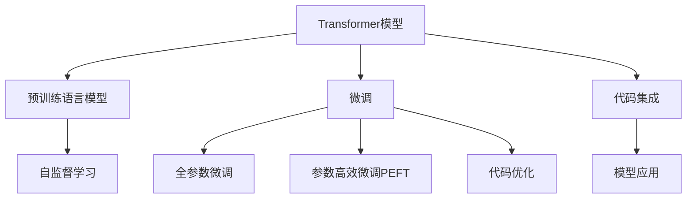

                 

# Hugging Face Transformers 库

> 关键词：Transformer, BERT, GPT, 自然语言处理, 深度学习, 预训练模型

## 1. 背景介绍

### 1.1 问题由来
近年来，随着深度学习技术的飞速发展，自然语言处理(Natural Language Processing, NLP)领域取得了长足的进步。特别是预训练语言模型(Pre-trained Language Models, PLMs)，如BERT、GPT等，以其卓越的性能，吸引了广泛的研究关注。然而，这些模型通常需要海量数据进行预训练，对于特定任务，还需要进行微调(Fine-tuning)，才能充分发挥其潜力。

这一过程中，Hugging Face Transformers库扮演了重要的角色。它是一个由Facebook开发的开源NLP库，提供了丰富的预训练模型和工具，简化了模型的使用和微调过程。本文将深入探讨Transformers库的核心概念和功能，并介绍其在NLP领域的广泛应用。

### 1.2 问题核心关键点
Transformers库通过提供高质量的预训练模型和便捷的API接口，使得开发者能够快速上手，实现复杂的NLP任务。其主要关键点包括：

- **预训练模型**：提供了多种状态艺术的预训练模型，如BERT、GPT等，用于大规模语料上的自监督预训练。
- **微调接口**：提供了丰富的微调API，帮助开发者将预训练模型快速适配到特定任务上。
- **模型集成**：支持多种NLP任务的微调，包括文本分类、情感分析、机器翻译等。
- **代码优化**：使用PyTorch等框架优化模型和训练过程，提升了模型的推理效率和计算性能。

通过理解这些核心点，我们可以更好地把握Transformers库的强大功能和潜力。

## 2. 核心概念与联系

### 2.1 核心概念概述

为更好地理解Transformers库的架构和功能，本节将介绍几个关键概念：

- **Transformer模型**：基于自注意力机制的自编码器模型，通过学习长距离依赖关系，在自然语言处理中取得了卓越表现。
- **预训练语言模型(PLMs)**：在大规模无标签文本上预训练的通用语言模型，如BERT、GPT等。
- **微调(Fine-tuning)**：在预训练模型的基础上，使用特定任务的数据集，通过有监督学习优化模型在该任务上的性能。
- **自监督学习(SSL)**：利用未标注数据，通过自监督学习任务（如掩码语言模型、下一句预测）对模型进行预训练。
- **代码优化**：使用PyTorch等框架对模型和训练过程进行优化，提升推理效率和计算性能。

这些概念之间的逻辑关系可以通过以下Mermaid流程图来展示：



这个流程图展示了Transformer模型从预训练到微调，再到代码优化和集成应用的全流程。

## 3. 核心算法原理 & 具体操作步骤
### 3.1 算法原理概述

Transformer模型和其变体如BERT、GPT等，利用自注意力机制学习长距离依赖关系，适用于大规模预训练任务。其核心算法原理如下：

1. **编码器-解码器结构**：Transformer模型通常采用编码器-解码器结构，编码器负责输入的编码，解码器负责输出。
2. **自注意力机制**：通过自注意力机制，模型可以学习输入序列中不同位置的相互依赖关系，捕捉长距离依赖。
3. **位置编码**：由于序列长度可能变化，位置编码被用来表示序列中每个位置的相对位置。
4. **多头注意力**：通过多头注意力机制，模型可以学习不同维度的表示，增强模型的表达能力。

微调过程则是在预训练模型的基础上，使用特定任务的数据集，通过有监督学习优化模型在该任务上的性能。微调的算法步骤如下：

1. **数据准备**：收集目标任务的标注数据集，划分为训练集、验证集和测试集。
2. **任务适配层设计**：根据任务类型，在预训练模型的顶层添加适当的输出层和损失函数。
3. **设置微调超参数**：选择合适的优化器及其参数，如AdamW、SGD等，设置学习率、批大小、迭代轮数等。
4. **执行梯度训练**：将训练集数据分批次输入模型，前向传播计算损失函数。反向传播计算参数梯度，根据设定的优化算法和学习率更新模型参数。
5. **周期性验证和测试**：在验证集和测试集上评估模型性能，根据性能指标决定是否继续微调。

### 3.2 算法步骤详解

假设我们有一个序列分类任务，目标是将输入的文本分类为正负两个类别。我们首先需要准备数据集，并将其划分为训练集、验证集和测试集。然后，设计合适的输出层和损失函数。

1. **数据准备**：
```python
from torch.utils.data import Dataset, DataLoader
from transformers import AutoTokenizer, AutoModelForSequenceClassification

# 准备数据集
train_dataset = YourTrainingDataset()
val_dataset = YourValidationDataset()
test_dataset = YourTestingDataset()

# 加载模型和分词器
model_name = 'bert-base-cased'
tokenizer = AutoTokenizer.from_pretrained(model_name)
model = AutoModelForSequenceClassification.from_pretrained(model_name, num_labels=2)

# 创建DataLoader
train_loader = DataLoader(train_dataset, batch_size=16, shuffle=True)
val_loader = DataLoader(val_dataset, batch_size=16, shuffle=False)
test_loader = DataLoader(test_dataset, batch_size=16, shuffle=False)
```

2. **任务适配层设计**：
```python
from transformers import BertForSequenceClassification

# 设计输出层
model = BertForSequenceClassification.from_pretrained(model_name, num_labels=2)

# 定义损失函数
criterion = torch.nn.CrossEntropyLoss()
```

3. **设置微调超参数**：
```python
# 设置优化器
optimizer = torch.optim.AdamW(model.parameters(), lr=2e-5)

# 设置评估指标
metric = torchmetrics.Accuracy()
```

4. **执行梯度训练**：
```python
import torch

# 开始训练
for epoch in range(10):
    model.train()
    total_loss = 0.0
    for batch in train_loader:
        inputs = tokenizer(batch['input_ids'], return_tensors='pt', padding='max_length', truncation=True)
        labels = batch['labels']
        
        outputs = model(**inputs)
        loss = outputs.loss
        total_loss += loss.item()
        optimizer.zero_grad()
        loss.backward()
        optimizer.step()

    # 评估模型性能
    model.eval()
    total_metric = 0.0
    for batch in val_loader:
        inputs = tokenizer(batch['input_ids'], return_tensors='pt', padding='max_length', truncation=True)
        labels = batch['labels']
        
        outputs = model(**inputs)
        predictions = torch.argmax(outputs.logits, dim=1)
        metric.update(labels, predictions)
        total_metric += metric.result().item()
```

5. **周期性验证和测试**：
```python
# 在测试集上评估模型性能
model.eval()
total_metric = 0.0
for batch in test_loader:
    inputs = tokenizer(batch['input_ids'], return_tensors='pt', padding='max_length', truncation=True)
    labels = batch['labels']
    
    outputs = model(**inputs)
    predictions = torch.argmax(outputs.logits, dim=1)
    metric.update(labels, predictions)
    total_metric += metric.result().item()
```

### 3.3 算法优缺点

Transformers库在NLP领域的应用具有以下优点：

1. **高效便捷**：提供了预训练模型和微调API，简化了NLP任务的开发过程。
2. **模型多样**：支持多种预训练模型，如BERT、GPT等，适用于多种NLP任务。
3. **参数优化**：通过参数高效微调等技术，减小微调风险，提高模型效率。
4. **广泛应用**：适用于文本分类、情感分析、机器翻译等多个NLP任务。

同时，该库也存在一些局限性：

1. **资源依赖**：需要较高的计算资源，特别是对于大规模预训练模型。
2. **迁移能力有限**：对于领域差异较大的任务，微调效果可能有限。
3. **可解释性不足**：黑盒模型的内部机制难以解释，难以调试和优化。

尽管存在这些局限性，但Transformers库仍然是NLP领域开发的首选工具，其在NLP任务的广泛应用和高效便捷的特性，极大地推动了NLP技术的产业化进程。

### 3.4 算法应用领域

Transformers库在NLP领域的应用已经非常广泛，涵盖了以下多个领域：

1. **文本分类**：如情感分析、主题分类、意图识别等。通过微调使得模型学习文本-标签映射。
2. **命名实体识别**：识别文本中的人名、地名、机构名等特定实体。通过微调使模型掌握实体边界和类型。
3. **关系抽取**：从文本中抽取实体之间的语义关系。通过微调使模型学习实体-关系三元组。
4. **问答系统**：对自然语言问题给出答案。将问题-答案对作为微调数据，训练模型学习匹配答案。
5. **机器翻译**：将源语言文本翻译成目标语言。通过微调使模型学习语言-语言映射。
6. **文本摘要**：将长文本压缩成简短摘要。将文章-摘要对作为微调数据，使模型学习抓取要点。
7. **对话系统**：使机器能够与人自然对话。将多轮对话历史作为上下文，微调模型进行回复生成。

此外，Transformers库在可控文本生成、常识推理、代码生成、数据增强等领域也有广泛应用。

## 4. 数学模型和公式 & 详细讲解  
### 4.1 数学模型构建

假设我们使用BERT模型进行文本分类任务，目标是将输入的文本分类为正负两个类别。我们首先定义模型的输入和输出：

- 输入 $x_i$：一个包含单词序列的输入，用 $x_i=\{x_{i,1}, x_{i,2}, ..., x_{i,N_i}\}$ 表示，其中 $N_i$ 是输入序列的长度。
- 输出 $y_i$：一个包含类别标签的输出，用 $y_i \in \{0, 1\}$ 表示，其中 $y_i=1$ 表示正类，$y_i=0$ 表示负类。

定义模型的损失函数为：

$$
\mathcal{L}(\theta) = -\frac{1}{N} \sum_{i=1}^N \ell(y_i, \hat{y}_i)
$$

其中 $\ell(y_i, \hat{y}_i)$ 是分类任务的损失函数，如交叉熵损失。$\hat{y}_i$ 是模型在输入 $x_i$ 上的预测标签。

在微调过程中，我们使用 $(x_i, y_i)$ 对作为训练数据，更新模型参数 $\theta$ 以最小化损失函数 $\mathcal{L}(\theta)$。

### 4.2 公式推导过程

下面以交叉熵损失函数为例，推导其梯度计算公式。假设模型输出为 $p(y_i|x_i)=\sigma(\theta^T x_i)$，其中 $\sigma$ 是softmax函数。则交叉熵损失函数为：

$$
\ell(y_i, \hat{y}_i) = -y_i \log \hat{y}_i - (1-y_i) \log (1-\hat{y}_i)
$$

将损失函数对参数 $\theta$ 求导，得到：

$$
\frac{\partial \mathcal{L}(\theta)}{\partial \theta} = -\frac{1}{N} \sum_{i=1}^N \frac{\partial \ell(y_i, \hat{y}_i)}{\partial \theta}
$$

根据链式法则，可进一步推导为：

$$
\frac{\partial \mathcal{L}(\theta)}{\partial \theta} = -\frac{1}{N} \sum_{i=1}^N \frac{\partial \ell(y_i, \hat{y}_i)}{\partial \hat{y}_i} \frac{\partial \hat{y}_i}{\partial \theta}
$$

将 $\frac{\partial \ell(y_i, \hat{y}_i)}{\partial \hat{y}_i}$ 代入交叉熵损失函数的导数，得到：

$$
\frac{\partial \mathcal{L}(\theta)}{\partial \theta} = -\frac{1}{N} \sum_{i=1}^N [y_i \frac{\hat{y}_i - y_i}{\hat{y}_i (1-\hat{y}_i)}] \frac{\partial \hat{y}_i}{\partial \theta}
$$

最终，通过反向传播算法，可以得到参数 $\theta$ 的更新公式：

$$
\theta \leftarrow \theta - \eta \frac{\partial \mathcal{L}(\theta)}{\partial \theta}
$$

其中 $\eta$ 是学习率。

### 4.3 案例分析与讲解

假设我们有一个简单的电影评论情感分类任务。我们首先收集了一组电影评论及其对应的情感标签，将数据划分为训练集、验证集和测试集。然后，我们使用BERT模型进行微调，步骤如下：

1. **数据准备**：
```python
from torch.utils.data import Dataset, DataLoader
from transformers import AutoTokenizer, AutoModelForSequenceClassification

# 准备数据集
train_dataset = YourTrainingDataset()
val_dataset = YourValidationDataset()
test_dataset = YourTestingDataset()

# 加载模型和分词器
model_name = 'bert-base-cased'
tokenizer = AutoTokenizer.from_pretrained(model_name)
model = AutoModelForSequenceClassification.from_pretrained(model_name, num_labels=2)

# 创建DataLoader
train_loader = DataLoader(train_dataset, batch_size=16, shuffle=True)
val_loader = DataLoader(val_dataset, batch_size=16, shuffle=False)
test_loader = DataLoader(test_dataset, batch_size=16, shuffle=False)
```

2. **任务适配层设计**：
```python
from transformers import BertForSequenceClassification

# 设计输出层
model = BertForSequenceClassification.from_pretrained(model_name, num_labels=2)

# 定义损失函数
criterion = torch.nn.CrossEntropyLoss()
```

3. **设置微调超参数**：
```python
# 设置优化器
optimizer = torch.optim.AdamW(model.parameters(), lr=2e-5)

# 设置评估指标
metric = torchmetrics.Accuracy()
```

4. **执行梯度训练**：
```python
import torch

# 开始训练
for epoch in range(10):
    model.train()
    total_loss = 0.0
    for batch in train_loader:
        inputs = tokenizer(batch['input_ids'], return_tensors='pt', padding='max_length', truncation=True)
        labels = batch['labels']
        
        outputs = model(**inputs)
        loss = outputs.loss
        total_loss += loss.item()
        optimizer.zero_grad()
        loss.backward()
        optimizer.step()

    # 评估模型性能
    model.eval()
    total_metric = 0.0
    for batch in val_loader:
        inputs = tokenizer(batch['input_ids'], return_tensors='pt', padding='max_length', truncation=True)
        labels = batch['labels']
        
        outputs = model(**inputs)
        predictions = torch.argmax(outputs.logits, dim=1)
        metric.update(labels, predictions)
        total_metric += metric.result().item()
```

5. **周期性验证和测试**：
```python
# 在测试集上评估模型性能
model.eval()
total_metric = 0.0
for batch in test_loader:
    inputs = tokenizer(batch['input_ids'], return_tensors='pt', padding='max_length', truncation=True)
    labels = batch['labels']
    
    outputs = model(**inputs)
    predictions = torch.argmax(outputs.logits, dim=1)
    metric.update(labels, predictions)
    total_metric += metric.result().item()
```

## 5. 项目实践：代码实例和详细解释说明
### 5.1 开发环境搭建

在进行微调实践前，我们需要准备好开发环境。以下是使用Python进行PyTorch开发的环境配置流程：

1. 安装Anaconda：从官网下载并安装Anaconda，用于创建独立的Python环境。

2. 创建并激活虚拟环境：
```bash
conda create -n pytorch-env python=3.8 
conda activate pytorch-env
```

3. 安装PyTorch：根据CUDA版本，从官网获取对应的安装命令。例如：
```bash
conda install pytorch torchvision torchaudio cudatoolkit=11.1 -c pytorch -c conda-forge
```

4. 安装Transformers库：
```bash
pip install transformers
```

5. 安装各类工具包：
```bash
pip install numpy pandas scikit-learn matplotlib tqdm jupyter notebook ipython
```

完成上述步骤后，即可在`pytorch-env`环境中开始微调实践。

### 5.2 源代码详细实现

下面我们以命名实体识别(NER)任务为例，给出使用Transformers库对BERT模型进行微调的PyTorch代码实现。

首先，定义NER任务的数据处理函数：

```python
from transformers import BertTokenizer
from torch.utils.data import Dataset
import torch

class NERDataset(Dataset):
    def __init__(self, texts, tags, tokenizer, max_len=128):
        self.texts = texts
        self.tags = tags
        self.tokenizer = tokenizer
        self.max_len = max_len
        
    def __len__(self):
        return len(self.texts)
    
    def __getitem__(self, item):
        text = self.texts[item]
        tags = self.tags[item]
        
        encoding = self.tokenizer(text, return_tensors='pt', max_length=self.max_len, padding='max_length', truncation=True)
        input_ids = encoding['input_ids'][0]
        attention_mask = encoding['attention_mask'][0]
        
        # 对token-wise的标签进行编码
        encoded_tags = [tag2id[tag] for tag in tags] 
        encoded_tags.extend([tag2id['O']] * (self.max_len - len(encoded_tags)))
        labels = torch.tensor(encoded_tags, dtype=torch.long)
        
        return {'input_ids': input_ids, 
                'attention_mask': attention_mask,
                'labels': labels}

# 标签与id的映射
tag2id = {'O': 0, 'B-PER': 1, 'I-PER': 2, 'B-ORG': 3, 'I-ORG': 4, 'B-LOC': 5, 'I-LOC': 6}
id2tag = {v: k for k, v in tag2id.items()}

# 创建dataset
tokenizer = BertTokenizer.from_pretrained('bert-base-cased')

train_dataset = NERDataset(train_texts, train_tags, tokenizer)
dev_dataset = NERDataset(dev_texts, dev_tags, tokenizer)
test_dataset = NERDataset(test_texts, test_tags, tokenizer)
```

然后，定义模型和优化器：

```python
from transformers import BertForTokenClassification, AdamW

model = BertForTokenClassification.from_pretrained('bert-base-cased', num_labels=len(tag2id))

optimizer = AdamW(model.parameters(), lr=2e-5)
```

接着，定义训练和评估函数：

```python
from torch.utils.data import DataLoader
from tqdm import tqdm
from sklearn.metrics import classification_report

device = torch.device('cuda') if torch.cuda.is_available() else torch.device('cpu')
model.to(device)

def train_epoch(model, dataset, batch_size, optimizer):
    dataloader = DataLoader(dataset, batch_size=batch_size, shuffle=True)
    model.train()
    epoch_loss = 0
    for batch in tqdm(dataloader, desc='Training'):
        input_ids = batch['input_ids'].to(device)
        attention_mask = batch['attention_mask'].to(device)
        labels = batch['labels'].to(device)
        model.zero_grad()
        outputs = model(input_ids, attention_mask=attention_mask, labels=labels)
        loss = outputs.loss
        epoch_loss += loss.item()
        loss.backward()
        optimizer.step()
    return epoch_loss / len(dataloader)

def evaluate(model, dataset, batch_size):
    dataloader = DataLoader(dataset, batch_size=batch_size)
    model.eval()
    preds, labels = [], []
    with torch.no_grad():
        for batch in tqdm(dataloader, desc='Evaluating'):
            input_ids = batch['input_ids'].to(device)
            attention_mask = batch['attention_mask'].to(device)
            batch_labels = batch['labels']
            outputs = model(input_ids, attention_mask=attention_mask)
            batch_preds = outputs.logits.argmax(dim=2).to('cpu').tolist()
            batch_labels = batch_labels.to('cpu').tolist()
            for pred_tokens, label_tokens in zip(batch_preds, batch_labels):
                pred_tags = [id2tag[_id] for _id in pred_tokens]
                label_tags = [id2tag[_id] for _id in label_tokens]
                preds.append(pred_tags[:len(label_tags)])
                labels.append(label_tags)
                
    print(classification_report(labels, preds))
```

最后，启动训练流程并在测试集上评估：

```python
epochs = 5
batch_size = 16

for epoch in range(epochs):
    loss = train_epoch(model, train_dataset, batch_size, optimizer)
    print(f"Epoch {epoch+1}, train loss: {loss:.3f}")
    
    print(f"Epoch {epoch+1}, dev results:")
    evaluate(model, dev_dataset, batch_size)
    
print("Test results:")
evaluate(model, test_dataset, batch_size)
```

以上就是使用PyTorch对BERT进行命名实体识别任务微调的完整代码实现。可以看到，得益于Transformers库的强大封装，我们可以用相对简洁的代码完成BERT模型的加载和微调。

### 5.3 代码解读与分析

让我们再详细解读一下关键代码的实现细节：

**NERDataset类**：
- `__init__`方法：初始化文本、标签、分词器等关键组件。
- `__len__`方法：返回数据集的样本数量。
- `__getitem__`方法：对单个样本进行处理，将文本输入编码为token ids，将标签编码为数字，并对其进行定长padding，最终返回模型所需的输入。

**tag2id和id2tag字典**：
- 定义了标签与数字id之间的映射关系，用于将token-wise的预测结果解码回真实的标签。

**训练和评估函数**：
- 使用PyTorch的DataLoader对数据集进行批次化加载，供模型训练和推理使用。
- 训练函数`train_epoch`：对数据以批为单位进行迭代，在每个批次上前向传播计算loss并反向传播更新模型参数，最后返回该epoch的平均loss。
- 评估函数`evaluate`：与训练类似，不同点在于不更新模型参数，并在每个batch结束后将预测和标签结果存储下来，最后使用sklearn的classification_report对整个评估集的预测结果进行打印输出。

**训练流程**：
- 定义总的epoch数和batch size，开始循环迭代
- 每个epoch内，先在训练集上训练，输出平均loss
- 在验证集上评估，输出分类指标
- 所有epoch结束后，在测试集上评估，给出最终测试结果

可以看到，PyTorch配合Transformers库使得BERT微调的代码实现变得简洁高效。开发者可以将更多精力放在数据处理、模型改进等高层逻辑上，而不必过多关注底层的实现细节。

当然，工业级的系统实现还需考虑更多因素，如模型的保存和部署、超参数的自动搜索、更灵活的任务适配层等。但核心的微调范式基本与此类似。

## 6. 实际应用场景
### 6.1 智能客服系统

基于大语言模型微调的对话技术，可以广泛应用于智能客服系统的构建。传统客服往往需要配备大量人力，高峰期响应缓慢，且一致性和专业性难以保证。而使用微调后的对话模型，可以7x24小时不间断服务，快速响应客户咨询，用自然流畅的语言解答各类常见问题。

在技术实现上，可以收集企业内部的历史客服对话记录，将问题和最佳答复构建成监督数据，在此基础上对预训练对话模型进行微调。微调后的对话模型能够自动理解用户意图，匹配最合适的答案模板进行回复。对于客户提出的新问题，还可以接入检索系统实时搜索相关内容，动态组织生成回答。如此构建的智能客服系统，能大幅提升客户咨询体验和问题解决效率。

### 6.2 金融舆情监测

金融机构需要实时监测市场舆论动向，以便及时应对负面信息传播，规避金融风险。传统的人工监测方式成本高、效率低，难以应对网络时代海量信息爆发的挑战。基于大语言模型微调的文本分类和情感分析技术，为金融舆情监测提供了新的解决方案。

具体而言，可以收集金融领域相关的新闻、报道、评论等文本数据，并对其进行主题标注和情感标注。在此基础上对预训练语言模型进行微调，使其能够自动判断文本属于何种主题，情感倾向是正面、中性还是负面。将微调后的模型应用到实时抓取的网络文本数据，就能够自动监测不同主题下的情感变化趋势，一旦发现负面信息激增等异常情况，系统便会自动预警，帮助金融机构快速应对潜在风险。

### 6.3 个性化推荐系统

当前的推荐系统往往只依赖用户的历史行为数据进行物品推荐，无法深入理解用户的真实兴趣偏好。基于大语言模型微调技术，个性化推荐系统可以更好地挖掘用户行为背后的语义信息，从而提供更精准、多样的推荐内容。

在实践中，可以收集用户浏览、点击、评论、分享等行为数据，提取和用户交互的物品标题、描述、标签等文本内容。将文本内容作为模型输入，用户的后续行为（如是否点击、购买等）作为监督信号，在此基础上微调预训练语言模型。微调后的模型能够从文本内容中准确把握用户的兴趣点。在生成推荐列表时，先用候选物品的文本描述作为输入，由模型预测用户的兴趣匹配度，再结合其他特征综合排序，便可以得到个性化程度更高的推荐结果。

### 6.4 未来应用展望

随着大语言模型和微调方法的不断发展，基于微调范式将在更多领域得到应用，为传统行业带来变革性影响。

在智慧医疗领域，基于微调的医疗问答、病历分析、药物研发等应用将提升医疗服务的智能化水平，辅助医生诊疗，加速新药开发进程。

在智能教育领域，微调技术可应用于作业批改、学情分析、知识推荐等方面，因材施教，促进教育公平，提高教学质量。

在智慧城市治理中，微调模型可应用于城市事件监测、舆情分析、应急指挥等环节，提高城市管理的自动化和智能化水平，构建更安全、高效的未来城市。

此外，在企业生产、社会治理、文娱传媒等众多领域，基于大模型微调的人工智能应用也将不断涌现，为经济社会发展注入新的动力。相信随着技术的日益成熟，微调方法将成为人工智能落地应用的重要范式，推动人工智能技术在更广阔的领域加速渗透。

## 7. 工具和资源推荐
### 7.1 学习资源推荐

为了帮助开发者系统掌握大语言模型微调的理论基础和实践技巧，这里推荐一些优质的学习资源：

1. 《Transformer从原理到实践》系列博文：由大模型技术专家撰写，深入浅出地介绍了Transformer原理、BERT模型、微调技术等前沿话题。

2. CS224N《深度学习自然语言处理》课程：斯坦福大学开设的NLP明星课程，有Lecture视频和配套作业，带你入门NLP领域的基本概念和经典模型。

3. 《Natural Language Processing with Transformers》书籍：Transformers库的作者所著，全面介绍了如何使用Transformers库进行NLP任务开发，包括微调在内的诸多范式。

4. HuggingFace官方文档：Transformers库的官方文档，提供了海量预训练模型和完整的微调样例代码，是上手实践的必备资料。

5. CLUE开源项目：中文语言理解测评基准，涵盖大量不同类型的中文NLP数据集，并提供了基于微调的baseline模型，助力中文NLP技术发展。

通过对这些资源的学习实践，相信你一定能够快速掌握大语言模型微调的精髓，并用于解决实际的NLP问题。
###  7.2 开发工具推荐

高效的开发离不开优秀的工具支持。以下是几款用于大语言模型微调开发的常用工具：

1. PyTorch：基于Python的开源深度学习框架，灵活动态的计算图，适合快速迭代研究。大部分预训练语言模型都有PyTorch版本的实现。

2. TensorFlow：由Google主导开发的开源深度学习框架，生产部署方便，适合大规模工程应用。同样有丰富的预训练语言模型资源。

3. Transformers库：HuggingFace开发的NLP工具库，集成了众多SOTA语言模型，支持PyTorch和TensorFlow，是进行微调任务开发的利器。

4. Weights & Biases：模型训练的实验跟踪工具，可以记录和可视化模型训练过程中的各项指标，方便对比和调优。与主流深度学习框架无缝集成。

5. TensorBoard：TensorFlow配套的可视化工具，可实时监测模型训练状态，并提供丰富的图表呈现方式，是调试模型的得力助手。

6. Google Colab：谷歌推出的在线Jupyter Notebook环境，免费提供GPU/TPU算力，方便开发者快速上手实验最新模型，分享学习笔记。

合理利用这些工具，可以显著提升大语言模型微调任务的开发效率，加快创新迭代的步伐。

### 7.3 相关论文推荐

大语言模型和微调技术的发展源于学界的持续研究。以下是几篇奠基性的相关论文，推荐阅读：

1. Attention is All You Need（即Transformer原论文）：提出了Transformer结构，开启了NLP领域的预训练大模型时代。

2. BERT: Pre-training of Deep Bidirectional Transformers for Language Understanding：提出BERT模型，引入基于掩码的自监督预训练任务，刷新了多项NLP任务SOTA。

3. Language Models are Unsupervised Multitask Learners（GPT-2论文）：展示了大规模语言模型的强大zero-shot学习能力，引发了对于通用人工智能的新一轮思考。

4. Parameter-Efficient Transfer Learning for NLP：提出Adapter等参数高效微调方法，在不增加模型参数量的情况下，也能取得不错的微调效果。

5. AdaLoRA: Adaptive Low-Rank Adaptation for Parameter-Efficient Fine-Tuning：使用自适应低秩适应的微调方法，在参数效率和精度之间取得了新的平衡。

这些论文代表了大语言模型微调技术的发展脉络。通过学习这些前沿成果，可以帮助研究者把握学科前进方向，激发更多的创新灵感。

## 8. 总结：未来发展趋势与挑战

### 8.1 总结

本文对Transformers库的核心概念和功能进行了全面系统的介绍。通过详细讲解微调算法的原理和操作步骤，展示了一系列的代码实例，为开发者提供了参考。同时，本文还探讨了Transformers库在NLP领域的广泛应用，展望了其未来的发展趋势和面临的挑战。

通过本文的系统梳理，可以看到，Transformers库作为NLP领域的重要工具，其强大的预训练模型和便捷的微调API，极大地推动了NLP技术的产业化进程。未来，随着Transformers库的不断优化和更新，相信NLP技术将在更广阔的应用领域大放异彩，深刻影响人类的生产生活方式。

### 8.2 未来发展趋势

展望未来，Transformers库的发展趋势将呈现以下几个方向：

1. **模型规模持续增大**：随着算力成本的下降和数据规模的扩张，预训练语言模型的参数量还将持续增长。超大规模语言模型蕴含的丰富语言知识，有望支撑更加复杂多变的下游任务微调。

2. **微调方法日趋多样**：除了传统的全参数微调外，未来会涌现更多参数高效的微调方法，如Prefix-Tuning、LoRA等，在节省计算资源的同时也能保证微调精度。

3. **持续学习成为常态**：随着数据分布的不断变化，微调模型也需要持续学习新知识以保持性能。如何在不遗忘原有知识的同时，高效吸收新样本信息，将成为重要的研究课题。

4. **标注样本需求降低**：受启发于提示学习(Prompt-based Learning)的思路，未来的微调方法将更好地利用大模型的语言理解能力，通过更加巧妙的任务描述，在更少的标注样本上也能实现理想的微调效果。

5. **多模态微调崛起**：当前的微调主要聚焦于纯文本数据，未来会进一步拓展到图像、视频、语音等多模态数据微调。多模态信息的融合，将显著提升语言模型对现实世界的理解和建模能力。

6. **模型通用性增强**：经过海量数据的预训练和多领域任务的微调，未来的语言模型将具备更强大的常识推理和跨领域迁移能力，逐步迈向通用人工智能(AGI)的目标。

以上趋势凸显了Transformers库的强大潜力，其模型和微调方法的不断演进，必将进一步推动NLP技术的进步和应用场景的拓展。

### 8.3 面临的挑战

尽管Transformers库在NLP领域的应用已经取得了显著成果，但在迈向更加智能化、普适化应用的过程中，它仍面临着诸多挑战：

1. **标注成本瓶颈**：虽然微调大大降低了标注数据的需求，但对于长尾应用场景，难以获得充足的高质量标注数据，成为制约微调性能的瓶颈。如何进一步降低微调对标注样本的依赖，将是一大难题。

2. **模型鲁棒性不足**：当前微调模型面对域外数据时，泛化性能往往大打折扣。对于测试样本的微小扰动，微调模型的预测也容易发生波动。如何提高微调模型的鲁棒性，避免灾难性遗忘，还需要更多理论和实践的积累。

3. **推理效率有待提高**：大规模语言模型虽然精度高，但在实际部署时往往面临推理速度慢、内存占用大等效率问题。如何在保证性能的同时，简化模型结构，提升推理速度，优化资源占用，将是重要的优化方向。

4. **可解释性亟需加强**：当前微调模型更像是"黑盒"系统，难以解释其内部工作机制和决策逻辑。对于医疗、金融等高风险应用，算法的可解释性和可审计性尤为重要。如何赋予微调模型更强的可解释性，将是亟待攻克的难题。

5. **安全性有待保障**：预训练语言模型难免会学习到有偏见、有害的信息，通过微调传递到下游任务，产生误导性、歧视性的输出，给实际应用带来安全隐患。如何从数据和算法层面消除模型偏见，避免恶意用途，确保输出的安全性，也将是重要的研究课题。

6. **知识整合能力不足**：现有的微调模型往往局限于任务内数据，难以灵活吸收和运用更广泛的先验知识。如何让微调过程更好地与外部知识库、规则库等专家知识结合，形成更加全面、准确的信息整合能力，还有很大的想象空间。

正视Transformers库面临的这些挑战，积极应对并寻求突破，将是大语言模型微调走向成熟的必由之路。相信随着学界和产业界的共同努力，这些挑战终将一一被克服，Transformers库必将在构建人机协同的智能时代中扮演越来越重要的角色。

### 8.4 研究展望

面对Transformers库所面临的种种挑战，未来的研究需要在以下几个方面寻求新的突破：

1. **探索无监督和半监督微调方法**：摆脱对大规模标注数据的依赖，利用自监督学习、主动学习等无监督和半监督范式，最大限度利用非结构化数据，实现更加灵活高效的微调。

2. **研究参数高效和计算高效的微调范式**：开发更加参数高效的微调方法，在固定大部分预训练参数的同时，只更新极少量的任务相关参数。同时优化微调模型的计算图，减少前向传播和反向传播的资源消耗，实现更加轻量级、实时性的部署。

3. **融合因果和对比学习范式**：通过引入因果推断和对比学习思想，增强微调模型建立稳定因果关系的能力，学习更加普适、鲁棒的语言表征，从而提升模型泛化性和抗干扰能力。

4. **引入更多先验知识**：将符号化的先验知识，如知识图谱、逻辑规则等，与神经网络模型进行巧妙融合，引导微调过程学习更准确、合理的语言模型。同时加强不同模态数据的整合，实现视觉、语音等多模态信息与文本信息的协同建模。

5. **结合因果分析和博弈论工具**：将因果分析方法引入微调模型，识别出模型决策的关键特征，增强输出解释的因果性和逻辑性。借助博弈论工具刻画人机交互过程，主动探索并规避模型的脆弱点，提高系统稳定性。

6. **纳入伦理道德约束**：在模型训练目标中引入伦理导向的评估指标，过滤和惩罚有偏见、有害的输出倾向。同时加强人工干预和审核，建立模型行为的监管机制，确保输出符合人类价值观和伦理道德。

这些研究方向的探索，必将引领Transformers库的微调技术迈向更高的台阶，为构建安全、可靠、可解释、可控的智能系统铺平道路。面向未来，Transformers库还需要与其他人工智能技术进行更深入的融合，如知识表示、因果推理、强化学习等，多路径协同发力，共同推动自然语言理解和智能交互系统的进步。只有勇于创新、敢于突破，才能不断拓展语言模型的边界，让智能技术更好地造福人类社会。

## 9. 附录：常见问题与解答

**Q1：Transformers库支持哪些预训练语言模型？**

A: Transformers库支持多种状态的预训练语言模型，包括BERT、GPT、T5等。用户可以通过预训练模型名称快速加载模型，进行微调等任务。

**Q2：微调过程中如何设置合适的学习率？**

A: 微调的学习率通常要比预训练时小1-2个数量级，使用2e-5或1e-5的默认值通常比较合适。但具体的学习率还需要根据任务和数据集进行调整，常用的调参方法包括网格搜索、随机搜索等。

**Q3：微调过程中如何缓解过拟合问题？**

A: 过拟合是微调面临的主要挑战之一。常用的缓解方法包括数据增强、正则化、对抗训练等。在数据增强方面，可以使用回译、近义替换等方式扩充训练集。在正则化方面，可以使用L2正则、Dropout、Early Stopping等。对抗训练则是在训练数据中加入对抗样本，提升模型的鲁棒性。

**Q4：微调模型在落地部署时需要注意哪些问题？**

A: 微调模型在实际部署时，需要注意模型的裁剪、量化加速、服务化封装、弹性伸缩、监控告警、安全防护等多个方面。裁剪和量化加速是为了减小模型尺寸，提高推理效率。服务化封装则是将模型封装为标准化服务接口，便于集成调用。弹性伸缩是为了根据请求流量动态调整资源配置，平衡服务质量和成本。监控告警是为了实时采集系统指标，设置异常告警阈值，确保服务稳定性。安全防护则是为了采用访问鉴权、数据脱敏等措施，保障数据和模型安全。

**Q5：微调模型在实际应用中需要注意哪些问题？**

A: 微调模型在实际应用中，需要注意模型的可解释性、安全性、知识整合能力等多个方面。模型的可解释性是指模型内部机制的透明性，方便开发者进行调试和优化。安全性是指模型输出是否符合伦理道德规范，避免有害信息。知识整合能力是指模型是否能灵活吸收和运用外部知识库、规则库等专家知识，形成更全面、准确的信息整合能力。

通过理解Transformers库的核心概念和功能，掌握微调的算法原理和操作步骤，我们能够更好地利用大语言模型，解决实际的NLP问题。随着Transformers库的不断优化和更新，相信NLP技术将在更广阔的应用领域大放异彩，深刻影响人类的生产生活方式。

作者：禅与计算机程序设计艺术 / Zen and the Art of Computer Programming

