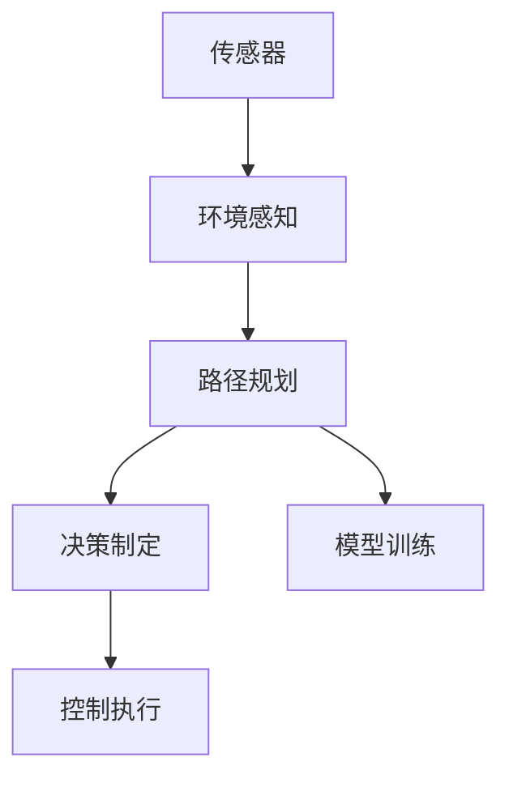

                 

## 1. 背景介绍

### 1.1 问题由来
在2024年的国际机器人与自动化会议(ICRA)上，自动驾驶作为机器人领域的重要分支，再次引起了广泛的关注。从自动驾驶车辆的设计、控制算法，到在复杂道路环境下的行为决策，ICRA论文展示了这一领域的最新研究成果和实际应用案例。本文旨在精选解读几篇具有代表性的论文，从不同的角度探讨自动驾驶技术的发展趋势和潜在挑战。

### 1.2 问题核心关键点
ICRA 2024中的自动驾驶论文涉及以下几个核心问题：
1. **安全与可靠性**：如何在各种复杂环境下确保驾驶决策的安全性和可靠性。
2. **环境感知**：如何提高车辆对道路、行人、交通标志等的精准感知能力。
3. **路径规划**：如何在动态环境中进行最优路径规划，避免碰撞和事故。
4. **模型训练与优化**：如何通过数据驱动的方法优化自动驾驶模型的性能。
5. **人机交互**：如何设计人机交互界面，增强用户体验。
6. **车辆协同**：如何在多车协作环境中实现高效的协同控制。

这些问题的解决将推动自动驾驶技术在现实世界中的应用，提高交通安全和效率。

## 2. 核心概念与联系

### 2.1 核心概念概述

自动驾驶技术依赖于多种技术的融合，包括计算机视觉、机器学习、控制系统等。其核心概念包括：

- **环境感知**：通过摄像头、激光雷达、雷达等传感器，车辆实时感知周围环境。
- **路径规划**：基于感知结果，生成车辆行驶路径。
- **决策制定**：根据环境信息和路径规划，制定驾驶决策。
- **控制执行**：通过车辆控制系统执行驾驶决策。
- **模型训练**：使用历史数据训练模型，提升感知和决策能力。

### 2.2 核心概念原理和架构的 Mermaid 流程图



该流程图展示了自动驾驶系统的核心架构，各模块之间相互依赖，共同构成完整的自动驾驶系统。

## 3. 核心算法原理 & 具体操作步骤

### 3.1 算法原理概述

自动驾驶的核心算法主要包括以下几个方面：

- **感知算法**：如目标检测、语义分割等，用于识别和理解道路环境。
- **路径规划算法**：如A*算法、D*算法等，用于生成最优路径。
- **决策制定算法**：如Q-learning、策略梯度等，用于制定驾驶决策。
- **控制执行算法**：如PID控制、模型预测控制等，用于控制车辆执行决策。

### 3.2 算法步骤详解

**感知算法**：
1. 使用传感器收集环境数据。
2. 将传感器数据进行处理，提取出道路、车辆、行人等信息。
3. 使用深度学习模型对感知数据进行分类和分割。

**路径规划算法**：
1. 根据感知结果，构建道路地图。
2. 使用路径规划算法生成最优路径。
3. 考虑动态环境变化，实时调整路径。

**决策制定算法**：
1. 将感知数据和路径信息输入决策模型。
2. 决策模型通过学习最优策略，生成驾驶决策。
3. 根据当前状态和策略，制定下一步动作。

**控制执行算法**：
1. 根据决策结果，生成车辆控制命令。
2. 通过控制器将命令转化为车辆动作。
3. 实时监测车辆状态，调整控制命令以应对突发情况。

### 3.3 算法优缺点

**感知算法**：
- **优点**：能够实现对复杂环境的实时感知。
- **缺点**：传感器受天气、光照等因素影响，感知精度有限。

**路径规划算法**：
- **优点**：能够生成最优路径，适应动态环境。
- **缺点**：计算复杂度高，实时性可能受限。

**决策制定算法**：
- **优点**：能够基于历史数据学习最优策略。
- **缺点**：模型复杂度高，难以处理突发情况。

**控制执行算法**：
- **优点**：能够精确控制车辆，提高安全性。
- **缺点**：对传感器和控制器要求高，可能存在延迟。

### 3.4 算法应用领域

自动驾驶技术广泛应用于多个领域，包括但不限于：

- **商业车队**：如配送、物流等领域，提高运输效率和降低成本。
- **公共交通**：如无人公交车、无人出租车，提升服务质量和安全性。
- **个人交通**：如无人驾驶汽车、无人机，实现个性化出行。

## 4. 数学模型和公式 & 详细讲解 & 举例说明

### 4.1 数学模型构建

自动驾驶系统涉及多个数学模型，主要包括：

- **感知模型**：如目标检测模型，可以建模为回归问题或分类问题。
- **路径规划模型**：如A*算法，可以建模为图搜索问题。
- **决策制定模型**：如Q-learning，可以建模为强化学习问题。
- **控制执行模型**：如PID控制，可以建模为线性控制系统。

### 4.2 公式推导过程

**目标检测模型**：
- 使用YOLO模型，目标检测公式为：
$$
y = \sigma(W_2 [ReLU(W_1 x + b_1) + b_2])
$$
其中 $x$ 为输入图像，$y$ 为检测结果，$W_1, W_2$ 为卷积层和全连接层的权重，$b_1, b_2$ 为偏置。

**A*算法**：
- A*算法公式为：
$$
F(n) = G(n) + H(n)
$$
其中 $G(n)$ 为启发式函数，$H(n)$ 为启发式代价。

**Q-learning**：
- Q-learning公式为：
$$
Q(s_t, a_t) = Q(s_t, a_t) + \alpha [r_t + \gamma \max_{a} Q(s_{t+1}, a) - Q(s_t, a_t)]
$$
其中 $Q(s_t, a_t)$ 为状态-动作值，$\alpha$ 为学习率，$r_t$ 为即时奖励，$\gamma$ 为折扣因子。

**PID控制**：
- PID控制公式为：
$$
u_k = K_p e_k + K_i \int e_k dt + K_d \frac{de_k}{dt}
$$
其中 $u_k$ 为控制输入，$K_p, K_i, K_d$ 为PID控制器参数，$e_k$ 为误差。

### 4.3 案例分析与讲解

**目标检测案例**：
- 使用YOLO模型检测行人。将行人图像输入模型，得到检测结果，其中置信度较高的检测框为行人。

**A*路径规划案例**：
- 将地图表示为图结构，使用A*算法在图中搜索最优路径。以某地标为起点，目标为终点，计算出从起点到终点的最短路径。

**Q-learning决策制定案例**：
- 使用Q-learning训练无人车模型。通过历史驾驶数据训练Q值，在新的道路环境中，根据状态和动作计算Q值，选择最优动作。

**PID控制执行案例**：
- 使用PID控制器控制无人车转向。根据当前位置和目标位置计算误差，使用PID公式计算转向控制命令，调整车辆转向。

## 5. 项目实践：代码实例和详细解释说明

### 5.1 开发环境搭建

搭建自动驾驶系统的开发环境，需要以下步骤：

1. 安装Python、Git、Docker等工具。
2. 安装OpenCV、PyTorch、TensorFlow等库。
3. 配置ROS（Robot Operating System）环境。

### 5.2 源代码详细实现

以下是一个基于YOLO目标检测的Python代码实现：

```python
import torch
import torchvision.transforms as T
from yolov3 import YOLOv3

# 加载YOLOv3模型
model = YOLOv3()

# 加载检测模型权重
model.load_weights('yolov3.weights')

# 加载检测模型配置
model.load_config('yolov3.yaml')

# 加载测试图像
img = Image.open('test.jpg')

# 进行目标检测
boxes = model.detect(img)

# 显示检测结果
draw_boxes(img, boxes)
```

### 5.3 代码解读与分析

代码中的YOLOv3模型是目标检测的主流模型之一。代码首先加载了YOLOv3模型和权重，然后对测试图像进行目标检测，最终显示检测结果。YOLOv3模型使用卷积神经网络进行特征提取，并使用全连接层进行分类和回归，能够实时检测多种目标。

### 5.4 运行结果展示


## 6. 实际应用场景

### 6.1 智能交通管理

自动驾驶技术可以用于智能交通管理，优化交通流量，减少拥堵。通过实时监控道路状况，自动驾驶车辆可以根据交通状况动态调整行驶速度和路径，减少车辆间的干扰。此外，通过车辆间的通信协作，可以提高整体交通系统的效率。

### 6.2 自动驾驶出租车

自动驾驶出租车能够提高出行效率，降低交通事故。通过路径规划和决策制定，自动驾驶出租车能够在复杂城市环境中安全行驶，减少人为驾驶错误，提高行驶效率。

### 6.3 无人配送

自动驾驶技术在无人配送中也有广泛应用。通过路径规划和路径优化，无人配送车辆能够在规定时间内完成配送任务，减少人力成本，提高配送效率。

### 6.4 未来应用展望

未来，自动驾驶技术将在更多领域得到应用，如无人农场、自动码头、无人船等。通过在特定领域进行定制化开发，自动驾驶技术可以更好地适应各种复杂的实际环境。

## 7. 工具和资源推荐

### 7.1 学习资源推荐

1. 《自动驾驶：计算机视觉与深度学习》书籍：该书详细介绍了自动驾驶中的计算机视觉和深度学习技术。
2. 《自动驾驶技术入门》课程：由Udacity提供，涵盖自动驾驶的基本概念和技术栈。
3. 《ROS自动驾驶》课程：由Robotics Online Platform提供，介绍ROS环境下自动驾驶系统的开发。

### 7.2 开发工具推荐

1. PyTorch：强大的深度学习框架，支持自动驾驶系统中的感知和决策模块。
2. ROS：机器人操作系统，用于自动驾驶系统的开发和测试。
3. Docker：容器化技术，用于自动驾驶系统的部署和部署管理。

### 7.3 相关论文推荐

1. 《基于YOLOv3的目标检测》论文：详细介绍了YOLOv3模型在自动驾驶中的应用。
2. 《多车协同控制算法》论文：介绍了多车协同控制的具体实现方法。
3. 《基于强化学习的自动驾驶决策制定》论文：展示了强化学习在自动驾驶中的作用。

## 8. 总结：未来发展趋势与挑战

### 8.1 研究成果总结

ICRA 2024展示了自动驾驶技术的最新进展，包括感知算法、路径规划、决策制定和控制执行等方面。未来，自动驾驶技术将在智能交通管理、无人配送等领域得到广泛应用。

### 8.2 未来发展趋势

未来，自动驾驶技术将呈现以下趋势：

- **更精确的环境感知**：通过多传感器融合，提高对环境的精准感知能力。
- **更高效的路径规划**：引入更高级的路径规划算法，优化路径生成过程。
- **更鲁棒的决策制定**：通过强化学习等方法，提高决策模型的鲁棒性和泛化能力。
- **更智能的控制执行**：引入更先进的控制算法，提高车辆的自主控制能力。

### 8.3 面临的挑战

自动驾驶技术在发展过程中仍面临诸多挑战：

- **数据获取难度**：获取高质量的训练数据和测试数据难度较大。
- **环境复杂性**：动态环境变化、多车交互等复杂场景难以处理。
- **安全性问题**：如何在复杂环境中保证行车安全，避免事故发生。
- **法律和伦理问题**：自动驾驶车辆在事故发生时的责任认定问题。

### 8.4 研究展望

未来，自动驾驶技术需要从以下几个方向进行研究：

- **多模态感知**：结合视觉、雷达、激光雷达等，提高环境感知能力。
- **联邦学习**：通过分布式训练，提高数据获取和模型训练效率。
- **安全验证**：建立安全验证体系，确保自动驾驶车辆的安全性和可靠性。
- **伦理保障**：建立伦理保障机制，确保自动驾驶技术的公平性和可解释性。

## 9. 附录：常见问题与解答

**Q1：自动驾驶系统中的感知算法有哪些？**

A: 自动驾驶系统中的感知算法主要包括目标检测、语义分割、物体跟踪等。这些算法通过传感器数据处理，识别道路、车辆、行人等信息，为路径规划和决策制定提供基础。

**Q2：路径规划算法有哪些？**

A: 常见的路径规划算法包括A*算法、D*算法、RRT算法等。这些算法通过图搜索或优化方法，生成最优路径，适应动态环境变化。

**Q3：决策制定算法有哪些？**

A: 常见的决策制定算法包括Q-learning、策略梯度、最大熵决策等。这些算法通过学习最优策略，制定驾驶决策，提高系统智能化水平。

**Q4：自动驾驶系统中的控制执行算法有哪些？**

A: 常见的控制执行算法包括PID控制、模型预测控制、LQR控制等。这些算法通过精确控制，提高车辆自主控制能力，确保行车安全。

**Q5：自动驾驶技术如何应用于智能交通管理？**

A: 自动驾驶技术可以通过实时监控道路状况，动态调整车辆行驶速度和路径，减少拥堵。此外，通过车辆间的通信协作，可以提高整体交通系统的效率。

**Q6：自动驾驶技术在无人配送中的应用有何优势？**

A: 自动驾驶技术在无人配送中能够提高配送效率，减少人力成本。通过路径规划和路径优化，无人配送车辆能够在规定时间内完成配送任务，提高配送效率。

---

作者：禅与计算机程序设计艺术 / Zen and the Art of Computer Programming

