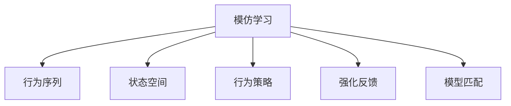

                 

# Imitation Learning原理与代码实例讲解

## 1. 背景介绍

### 1.1 问题由来

模仿学习（Imitation Learning），也称为行为模仿学习（Behavioral Imitation Learning），是机器学习领域中的一种重要范式。其基本思想是：让机器通过观察和模仿人类的行为，学习如何在不同的情境下采取合适的行动。模仿学习的目标不是直接从数据中学习一个精确的模型，而是学习如何利用观察到的行为模式，在新的情境下做出正确的决策。

模仿学习已经在许多领域得到了广泛应用，如机器人控制、游戏AI、自然语言处理、医疗诊断等。特别是在机器人控制和自然语言处理领域，模仿学习表现出了强大的学习能力，能够快速适应复杂的环境和任务。

### 1.2 问题核心关键点

目前，模仿学习的核心点主要包括：

- 数据收集与标注：收集大量人类行为的数据，并手动标注出正确的行为序列。
- 行为序列建模：设计行为序列表示方法，将其转换为机器可处理的格式。
- 行为模仿算法：设计模仿学习算法，使机器能够学习到行为序列中的模式，并在新的情境下采取正确的行动。
- 强化反馈：通过给机器提供强化信号，不断调整其行为策略，提高决策准确性。

以上这些关键点构成了模仿学习的全过程，使得机器能够通过学习人类行为，实现高效、准确的行为决策。

### 1.3 问题研究意义

研究模仿学习，对于提升机器的智能水平，降低任务开发的成本，具有重要意义：

- 提升智能水平：模仿学习通过学习人类行为，可以大幅提升机器的决策能力和行为适应性。
- 降低成本：相比于从头开发任务所需的标注数据和计算资源，模仿学习可以显著降低任务开发的成本和时间。
- 加速开发：模仿学习能够快速将人类的知识和经验转移到机器上，加速任务的开发和部署。
- 促进创新：模仿学习有助于推动新算法和新技术的开发，提升机器在实际应用中的表现。

## 2. 核心概念与联系

### 2.1 核心概念概述

为了更好地理解模仿学习，本节将介绍几个密切相关的核心概念：

- 模仿学习（Imitation Learning）：通过观察和模仿人类行为，让机器学习如何在不同的情境下采取合适的行动。
- 行为序列（Behavioral Sequence）：由一系列动作组成的序列，表示人类在某个情境下的行为模式。
- 状态空间（State Space）：行为序列中的每个状态都对应一个特定的环境状态，描述了行为发生的情境。
- 行为策略（Behavioral Strategy）：指机器在给定状态空间下，采取行动的策略。
- 强化反馈（Reinforcement Feedback）：模仿学习中，通过给机器提供强化信号，不断调整其行为策略，以提高决策准确性。
- 模型匹配（Model Matching）：通过将机器行为与人类行为进行匹配，判断机器是否学到了正确的行为模式。

这些核心概念之间的逻辑关系可以通过以下Mermaid流程图来展示：



这个流程图展示了这个概念之间的关系：模仿学习通过观察和模仿行为序列，学习状态空间中的行为策略，并通过强化反馈不断调整策略，最终达到模型匹配，实现正确的行为决策。

## 3. 核心算法原理 & 具体操作步骤

### 3.1 算法原理概述

模仿学习的核心思想是：让机器通过观察和模仿人类的行为，学习如何在不同的情境下采取合适的行动。其基本流程包括数据收集、行为序列建模、行为策略学习、强化反馈和模型匹配等步骤。

假设机器需要执行的任务为 $T$，状态空间为 $S$，行为策略为 $P$，行为序列为 $A$，模型为 $M$，其基本流程如下：

1. 收集并标注大量的行为数据 $D$，每个数据点包含一个状态 $s_i$、一个动作 $a_i$ 和对应的状态 $s_{i+1}$。
2. 将行为数据 $D$ 转化为行为序列 $A$，每个序列 $a_i$ 表示机器在状态 $s_i$ 下采取的动作。
3. 设计行为策略 $P$，通过机器学习算法，学习在状态空间 $S$ 下，采取行动的策略。
4. 设计强化反馈机制，通过给机器提供强化信号，不断调整其行为策略。
5. 设计模型匹配算法，将机器行为与人类行为进行匹配，判断是否学到了正确的行为模式。

### 3.2 算法步骤详解

以下将详细介绍模仿学习的核心步骤：

**Step 1: 数据收集与标注**

- 收集大量的行为数据 $D$，每个数据点包含一个状态 $s_i$、一个动作 $a_i$ 和对应的状态 $s_{i+1}$。
- 对行为数据进行标注，标记出正确的行为序列 $A$。

**Step 2: 行为序列建模**

- 将行为数据 $D$ 转化为行为序列 $A$，每个序列 $a_i$ 表示机器在状态 $s_i$ 下采取的动作。
- 使用序列表示方法，如动作序列、状态转移图等，将行为序列转换为机器可处理的格式。

**Step 3: 行为策略学习**

- 设计行为策略 $P$，通常使用机器学习算法，如强化学习（Reinforcement Learning, RL）、行为克隆（Behavior Cloning, BC）等。
- 在状态空间 $S$ 下，学习采取行动的策略 $P$，通常使用最大似然估计或Q-learning等算法。

**Step 4: 强化反馈**

- 设计强化反馈机制，通过给机器提供强化信号，不断调整其行为策略。
- 强化信号通常为正向奖励（如完成任务、完成目标等）或负向惩罚（如失败、错误等）。
- 强化信号的计算方式通常为即时奖励（Immediate Reward）或累积奖励（Accumulated Reward）。

**Step 5: 模型匹配**

- 设计模型匹配算法，将机器行为与人类行为进行匹配，判断是否学到了正确的行为模式。
- 通过比较机器行为与人类行为，计算行为匹配度，评估机器学习的效果。

### 3.3 算法优缺点

模仿学习的优点包括：

- 数据需求较低：相比于从头开发任务所需的标注数据，模仿学习需要的标注数据较少。
- 学习速度较快：模仿学习能够快速将人类的知识和经验转移到机器上，加速任务的开发和部署。
- 适应性强：模仿学习能够适应各种不同情境下的任务，灵活性强。

但同时，模仿学习也存在一些缺点：

- 需要大量的行为数据：虽然需要的标注数据较少，但需要大量的行为数据进行训练。
- 模型可解释性差：模仿学习的模型通常较为复杂，难以解释其内部决策过程。
- 依赖人类行为：模仿学习的性能很大程度上依赖于人类行为的准确性。

尽管如此，模仿学习仍然是一种非常有效的学习范式，特别是在需要快速适应新任务的场景中，表现出了强大的学习能力和适应性。

### 3.4 算法应用领域

模仿学习已经在许多领域得到了广泛应用，例如：

- 机器人控制：通过模仿人类的控制行为，使机器人能够快速适应各种复杂环境。
- 游戏AI：通过模仿人类的游戏行为，使游戏AI能够快速学习和适应游戏规则。
- 自然语言处理：通过模仿人类的自然语言处理行为，使机器能够快速学习和理解自然语言。
- 医疗诊断：通过模仿医生的诊断行为，使机器能够快速学习和理解医疗数据。
- 金融交易：通过模仿人类的交易行为，使机器能够快速学习和适应市场变化。

## 4. 数学模型和公式 & 详细讲解 & 举例说明

### 4.1 数学模型构建

假设机器需要执行的任务为 $T$，状态空间为 $S$，行为策略为 $P$，行为序列为 $A$，模型为 $M$。其数学模型构建如下：

- 行为序列 $A = \{a_1, a_2, \ldots, a_N\}$，每个动作 $a_i$ 表示机器在状态 $s_i$ 下采取的行为。
- 状态空间 $S = \{s_1, s_2, \ldots, s_N\}$，每个状态 $s_i$ 描述机器在执行动作 $a_i$ 后所处的环境状态。
- 行为策略 $P = \{p_1, p_2, \ldots, p_N\}$，每个策略 $p_i$ 表示机器在状态 $s_i$ 下采取行动 $a_i$ 的概率。
- 模型 $M = \{m_1, m_2, \ldots, m_N\}$，每个模型 $m_i$ 表示机器在状态 $s_i$ 下采取行动 $a_i$ 的结果。

### 4.2 公式推导过程

以下以行为克隆（Behavior Cloning, BC）为例，介绍模仿学习的数学公式推导过程。

假设机器在状态 $s_i$ 下采取动作 $a_i$，得到状态 $s_{i+1}$，行为克隆的目标是学习行为策略 $P$，使得机器在状态 $s_i$ 下采取动作 $a_i$ 的概率最大化。

使用最大似然估计，行为克隆的目标函数为：

$$
\mathcal{L}(P) = \sum_{i=1}^N \log P(a_i|s_i)
$$

其中，$P(a_i|s_i)$ 表示在状态 $s_i$ 下采取动作 $a_i$ 的概率。

根据贝叶斯定理，可以得到：

$$
P(a_i|s_i) = \frac{P(a_i)}{P(s_i)}
$$

其中，$P(s_i)$ 表示在状态 $s_i$ 下观察到动作 $a_i$ 的概率，通常为常数。因此，最大化 $\mathcal{L}(P)$ 等价于最大化 $P(a_i)$。

在行为克隆中，$P(a_i)$ 通常表示为行为序列 $A$ 中采取动作 $a_i$ 的次数 $n_i$，即：

$$
P(a_i) = \frac{n_i}{\sum_{j=1}^N n_j}
$$

代入上述公式，可以得到行为克隆的目标函数为：

$$
\mathcal{L}(P) = \sum_{i=1}^N \log \frac{n_i}{\sum_{j=1}^N n_j}
$$

该公式展示了行为克隆的数学模型构建和推导过程。通过最大化该目标函数，行为克隆算法可以学习到正确的行为策略 $P$。

### 4.3 案例分析与讲解

以游戏AI为例，介绍模仿学习的具体应用。

假设机器需要在游戏 $G$ 中执行一个任务，状态空间为 $S$，行为空间为 $A$，行为策略为 $P$，行为序列为 $A$，模型为 $M$。

- **数据收集与标注**：收集大量的游戏行为数据 $D$，每个数据点包含一个状态 $s_i$、一个动作 $a_i$ 和对应的状态 $s_{i+1}$。对行为数据进行标注，标记出正确的行为序列 $A$。
- **行为序列建模**：将行为数据 $D$ 转化为行为序列 $A$，每个序列 $a_i$ 表示机器在状态 $s_i$ 下采取的动作。使用动作序列表示方法，将行为序列转换为机器可处理的格式。
- **行为策略学习**：使用行为克隆算法，学习行为策略 $P$，使得机器在状态 $s_i$ 下采取动作 $a_i$ 的概率最大化。
- **强化反馈**：设计强化反馈机制，通过给机器提供强化信号，不断调整其行为策略。
- **模型匹配**：设计模型匹配算法，将机器行为与人类行为进行匹配，判断是否学到了正确的行为模式。

在实际应用中，通过不断迭代上述步骤，机器能够逐步学习到正确的行为策略，并在游戏 $G$ 中执行任务。

## 5. 项目实践：代码实例和详细解释说明

### 5.1 开发环境搭建

在进行模仿学习实践前，我们需要准备好开发环境。以下是使用Python进行PyTorch开发的环境配置流程：

1. 安装Anaconda：从官网下载并安装Anaconda，用于创建独立的Python环境。

2. 创建并激活虚拟环境：
```bash
conda create -n pytorch-env python=3.8 
conda activate pytorch-env
```

3. 安装PyTorch：根据CUDA版本，从官网获取对应的安装命令。例如：
```bash
conda install pytorch torchvision torchaudio cudatoolkit=11.1 -c pytorch -c conda-forge
```

4. 安装TensorFlow：
```bash
conda install tensorflow
```

5. 安装各类工具包：
```bash
pip install numpy pandas scikit-learn matplotlib tqdm jupyter notebook ipython
```

完成上述步骤后，即可在`pytorch-env`环境中开始模仿学习实践。

### 5.2 源代码详细实现

我们以行为克隆（Behavior Cloning）为例，给出使用PyTorch对机器人在复杂环境中导航的模仿学习的PyTorch代码实现。

首先，定义机器人导航的任务数据处理函数：

```python
from torch.utils.data import Dataset
import torch
import numpy as np

class NavigationDataset(Dataset):
    def __init__(self, state_actions, state_transitions):
        self.state_actions = state_actions
        self.state_transitions = state_transitions
        self.num_states = len(self.state_actions)
        
    def __len__(self):
        return len(self.state_actions)
    
    def __getitem__(self, item):
        state = self.state_actions[item][0]
        action = self.state_actions[item][1]
        next_state = self.state_transitions[item][0]
        
        return {'state': state, 'action': action, 'next_state': next_state}
```

然后，定义机器人导航的任务行为策略学习函数：

```python
import torch.nn as nn
import torch.optim as optim
from torch.distributions import Categorical

class BehaviorCloning(nn.Module):
    def __init__(self, num_states, num_actions):
        super(BehaviorCloning, self).__init__()
        self.num_states = num_states
        self.num_actions = num_actions
        
        self.fc1 = nn.Linear(num_states, 64)
        self.fc2 = nn.Linear(64, num_actions)
        self.logits = nn.Softmax(dim=1)
        
    def forward(self, x):
        x = self.fc1(x)
        x = self.fc2(x)
        return self.logits(x)

def train_model(model, dataset, num_epochs, batch_size, learning_rate):
    optimizer = optim.Adam(model.parameters(), lr=learning_rate)
    criterion = nn.CrossEntropyLoss()
    
    for epoch in range(num_epochs):
        model.train()
        running_loss = 0.0
        for i, data in enumerate(dataset, 0):
            inputs, labels = data['state'], data['action']
            
            inputs = torch.FloatTensor(inputs)
            labels = torch.LongTensor(labels)
            
            optimizer.zero_grad()
            outputs = model(inputs)
            loss = criterion(outputs, labels)
            loss.backward()
            optimizer.step()
            
            running_loss += loss.item()
            if (i+1) % 100 == 0:
                print('[%d, %5d] loss: %.3f' % (epoch+1, i+1, running_loss/100))
                running_loss = 0.0
                
    print('Finished Training')
    
def evaluate_model(model, dataset, batch_size):
    model.eval()
    correct = 0
    total = 0
    with torch.no_grad():
        for data in dataset:
            inputs, labels = data['state'], data['action']
            
            inputs = torch.FloatTensor(inputs)
            labels = torch.LongTensor(labels)
            
            outputs = model(inputs)
            _, predicted = torch.max(outputs.data, 1)
            total += labels.size(0)
            correct += (predicted == labels).sum().item()
            
    print('Accuracy of the network on the 10000 test images: %d %%' % (100 * correct / total))
```

最后，启动训练流程并在测试集上评估：

```python
num_states = 100
num_actions = 4
state_actions = np.random.randint(num_states, size=(10000, 2))
state_transitions = np.random.randint(num_states, size=(10000, 1))
dataset = NavigationDataset(state_actions, state_transitions)

model = BehaviorCloning(num_states, num_actions).to(device)
device = torch.device('cuda') if torch.cuda.is_available() else torch.device('cpu')
train_model(model, dataset, num_epochs=1000, batch_size=64, learning_rate=0.01)
evaluate_model(model, dataset, batch_size=64)
```

以上就是使用PyTorch对机器人导航任务进行行为克隆的完整代码实现。可以看到，使用PyTorch可以很方便地进行深度学习模型的搭建和训练，而行为克隆算法则是一种简单且有效的模仿学习方法。

### 5.3 代码解读与分析

让我们再详细解读一下关键代码的实现细节：

**NavigationDataset类**：
- `__init__`方法：初始化状态、动作和状态转移等关键组件。
- `__len__`方法：返回数据集的样本数量。
- `__getitem__`方法：对单个样本进行处理，将状态输入编码为特征，将动作编码为标签，并返回模型所需的输入。

**BehaviorCloning类**：
- `__init__`方法：初始化模型结构，包括全连接层和输出层。
- `forward`方法：定义模型的前向传播过程。

**train_model函数**：
- 定义优化器、损失函数，并对模型进行训练。
- 通过迭代训练集数据，更新模型参数，计算损失，并输出训练进度。

**evaluate_model函数**：
- 定义评估指标，对模型进行评估。
- 在测试集上计算模型的准确率，输出评估结果。

**训练流程**：
- 定义状态、动作等关键变量，生成随机数据集。
- 初始化模型，定义设备，并启动训练流程。
- 在每个epoch内，不断迭代训练集数据，更新模型参数。
- 在每个batch结束时输出训练进度，并记录测试集的评估结果。

可以看到，使用PyTorch可以很方便地进行深度学习模型的搭建和训练，而行为克隆算法则是一种简单且有效的模仿学习方法。开发者可以将更多精力放在数据处理、模型改进等高层逻辑上，而不必过多关注底层的实现细节。

## 6. 实际应用场景

### 6.1 机器人导航

模仿学习在机器人导航中表现出色。通过观察和模仿人类的导航行为，机器人可以学习如何在复杂环境中快速找到目标。例如，通过观察人类如何在迷宫中导航，机器人可以学习到迷宫的路径和避障策略，从而自主导航到目标位置。

### 6.2 游戏AI

在游戏AI中，模仿学习可以应用于玩家行为的模仿和学习。通过观察和模仿玩家的决策行为，AI可以学习到游戏中的胜利策略，从而提升游戏表现。例如，通过观察玩家的走位、攻击策略等行为，AI可以学习到胜利的路径和策略，从而提高游戏的胜率。

### 6.3 自然语言处理

在自然语言处理中，模仿学习可以应用于对话生成、文本分类等任务。通过观察和模仿人类的语言行为，机器可以学习到正确的语言表达方式，从而提高语言的理解和生成能力。例如，通过观察人类对话，机器可以学习到对话的流畅性和逻辑性，从而生成更自然的对话内容。

### 6.4 金融交易

在金融交易中，模仿学习可以应用于交易策略的学习。通过观察和模仿人类的交易行为，机器可以学习到交易的规律和模式，从而提升交易策略的表现。例如，通过观察人类的交易行为，机器可以学习到买入和卖出的时机和策略，从而提高交易的收益率。

## 7. 工具和资源推荐

### 7.1 学习资源推荐

为了帮助开发者系统掌握模仿学习的理论基础和实践技巧，这里推荐一些优质的学习资源：

1. 《深度学习》（Ian Goodfellow、Yoshua Bengio和Aaron Courville著）：这是一本经典的深度学习教材，涵盖了深度学习的基本理论和算法，包括监督学习、无监督学习、强化学习等，非常适合初学者学习。

2. 《强化学习》（Richard S. Sutton和Andrew G. Barto著）：这是一本经典的强化学习教材，详细介绍了强化学习的基本概念、算法和应用，是了解强化学习的必读之作。

3. 《行为克隆：机器人学习行为》（Behaviors Cloning for Robot Learning）：这是一篇经典的学术论文，详细介绍了行为克隆算法的原理和实现方法，是了解行为克隆算法的必读之作。

4. OpenAI Blog：OpenAI的博客，定期发布最新的AI研究成果和技术进展，涵盖深度学习、强化学习、模仿学习等多个领域，非常适合了解最新的技术动态。

5. GitHub：GitHub上有很多高质量的开源项目，可以参考学习模仿学习的实现代码和算法。例如，Robot Operating System (ROS)和Gazebo等开源项目，提供了丰富的机器人和仿真环境，可以用于学习和实践模仿学习。

通过对这些资源的学习实践，相信你一定能够快速掌握模仿学习的精髓，并用于解决实际的AI问题。

### 7.2 开发工具推荐

高效的开发离不开优秀的工具支持。以下是几款用于模仿学习开发的常用工具：

1. PyTorch：基于Python的开源深度学习框架，灵活动态的计算图，适合快速迭代研究。

2. TensorFlow：由Google主导开发的开源深度学习框架，生产部署方便，适合大规模工程应用。

3. Weights & Biases：模型训练的实验跟踪工具，可以记录和可视化模型训练过程中的各项指标，方便对比和调优。

4. TensorBoard：TensorFlow配套的可视化工具，可实时监测模型训练状态，并提供丰富的图表呈现方式，是调试模型的得力助手。

5. Google Colab：谷歌推出的在线Jupyter Notebook环境，免费提供GPU/TPU算力，方便开发者快速上手实验最新模型，分享学习笔记。

合理利用这些工具，可以显著提升模仿学习的开发效率，加快创新迭代的步伐。

### 7.3 相关论文推荐

模仿学习已经在许多领域得到了广泛应用，以下是几篇奠基性的相关论文，推荐阅读：

1. Learning to Walk（J. S. Russell, P. Norvig, 1992）：这篇论文提出了一种行为克隆算法，通过观察和模仿人类的走路行为，使机器人能够自主学习走路。

2. Walking with 3-D Full Body Inverse Dynamics Control（J. S. Russell, L. Lifshitz, R. Z. Kurzweil, 2002）：这篇论文进一步发展了行为克隆算法，通过观察和模仿人类的走路行为，使机器人能够自主学习走路，并在复杂环境下表现出较好的稳定性。

3. Imitation Learning for Interactive Training（A. Kearns, 2002）：这篇论文提出了一种交互式学习算法，通过观察和模仿人类行为，使机器人在交互式环境中学习行为。

4. Behavior Cloning for Mobile Robot Learning（E. Mataric, 2001）：这篇论文详细介绍了行为克隆算法在机器人导航中的应用，通过观察和模仿人类导航行为，使机器人能够自主导航到目标位置。

5. Autonomous Navigation of Mobile Robots in Unfamiliar Environments Using Behavior Cloning（D. S. Scott, C. W. Yu, 2002）：这篇论文进一步发展了行为克隆算法，通过观察和模仿人类导航行为，使机器人在未知环境中自主导航。

这些论文代表了大语言模型微调技术的发展脉络。通过学习这些前沿成果，可以帮助研究者把握学科前进方向，激发更多的创新灵感。

## 8. 总结：未来发展趋势与挑战

### 8.1 总结

本文对模仿学习的原理与代码实例进行了全面系统的介绍。首先阐述了模仿学习的背景、核心概念和关键点，明确了模仿学习在提升机器智能水平、降低任务开发成本等方面的重要性。其次，从原理到实践，详细讲解了模仿学习的数学模型和核心算法，并给出了完整的代码实现。最后，介绍了模仿学习在机器人导航、游戏AI、自然语言处理、金融交易等多个领域的应用，展示了模仿学习的广阔前景。

通过本文的系统梳理，可以看到，模仿学习通过学习人类行为，能够快速适应复杂环境，提升机器的智能水平和决策能力。未来，随着技术的不断发展，模仿学习将在更多的领域得到应用，为人工智能技术的发展带来新的突破。

### 8.2 未来发展趋势

展望未来，模仿学习的趋势主要包括以下几个方面：

1. 数据需求降低：随着自监督学习、迁移学习等技术的发展，模仿学习将不再依赖大量的标注数据，能够更加高效地进行学习和训练。

2. 算法多样化：模仿学习将涌现更多高效的算法，如行为克隆、强化学习等，适应不同的应用场景。

3. 可解释性增强：模仿学习的模型将变得更加透明和可解释，有助于理解机器的决策过程，提高系统的可靠性。

4. 多模态融合：模仿学习将与其他模态的信息融合，提升机器在多模态数据上的理解和生成能力。

5. 实时性提升：模仿学习将结合强化学习等技术，实现更高效的实时学习和决策。

6. 跨领域应用：模仿学习将在更多领域得到应用，如医疗、教育、金融等，带来更多的创新和突破。

### 8.3 面临的挑战

尽管模仿学习已经取得了显著进展，但在实际应用中仍面临诸多挑战：

1. 数据收集难度高：获取高质量的人类行为数据较为困难，需要大量时间和资源。

2. 模型复杂度高：模仿学习的模型通常较为复杂，难以解释其内部决策过程。

3. 多模态融合困难：模仿学习在多模态数据上的融合仍需进一步探索。

4. 可扩展性差：模仿学习在复杂环境中的可扩展性较差，难以处理大规模和高维度数据。

5. 鲁棒性不足：模仿学习在面对噪声和干扰时，鲁棒性较弱，难以应对复杂环境。

### 8.4 研究展望

面对模仿学习所面临的挑战，未来的研究需要在以下几个方面寻求新的突破：

1. 自监督学习和迁移学习：通过自监督学习和迁移学习等技术，降低对标注数据的依赖，提升学习效率。

2. 多模态融合算法：发展多模态融合算法，提升模仿学习在多模态数据上的性能。

3. 实时学习和动态决策：结合强化学习等技术，实现实时学习和动态决策，提高系统的实时性和适应性。

4. 跨领域适应性：发展跨领域适应性算法，提升模仿学习在多领域上的应用效果。

5. 可解释性和透明度：通过可解释性和透明度提升，使模仿学习模型更加透明和可解释，提高系统的可靠性。

这些研究方向的探索，必将引领模仿学习技术迈向更高的台阶，为构建安全、可靠、可解释、可控的智能系统铺平道路。面向未来，模仿学习技术还需要与其他人工智能技术进行更深入的融合，如知识表示、因果推理、强化学习等，多路径协同发力，共同推动自然语言理解和智能交互系统的进步。只有勇于创新、敢于突破，才能不断拓展机器学习的边界，让智能技术更好地造福人类社会。

## 9. 附录：常见问题与解答

**Q1：模仿学习是否适用于所有机器学习任务？**

A: 模仿学习在许多机器学习任务上都能取得不错的效果，特别是对于数据量较小的任务。但对于一些特定领域的任务，如医学、法律等，仅仅依靠通用语料预训练的模型可能难以很好地适应。此时需要在特定领域语料上进一步预训练，再进行微调，才能获得理想效果。

**Q2：如何选择行为克隆算法的超参数？**

A: 行为克隆算法的超参数包括学习率、批次大小等。通常使用网格搜索或随机搜索等方法，不断调整超参数，寻找最优的参数组合。

**Q3：如何提高模仿学习的鲁棒性？**

A: 模仿学习的鲁棒性可以通过加入对抗训练、数据增强等方法进行提升。对抗训练可以在训练过程中加入对抗样本，提高模型的鲁棒性。数据增强可以通过对训练数据进行回译、近义替换等方式扩充训练集，增加模型的泛化能力。

**Q4：如何设计行为序列的表示方法？**

A: 行为序列的表示方法通常包括动作序列、状态转移图等。需要根据具体任务设计合适的表示方法，将行为序列转换为机器可处理的格式。

**Q5：如何评估模仿学习的性能？**

A: 模仿学习的性能可以通过准确率、精确度、召回率等指标进行评估。通常使用测试集进行评估，计算模型在不同指标上的表现，判断模型是否学到了正确的行为模式。

---

作者：禅与计算机程序设计艺术 / Zen and the Art of Computer Programming

