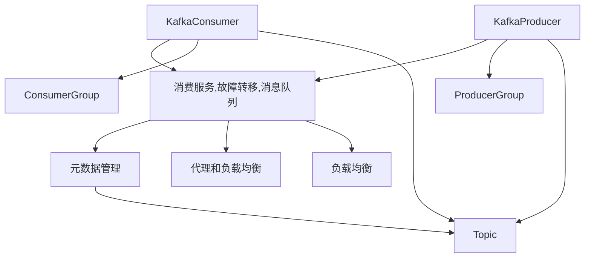

                 

# Kafka Broker原理与代码实例讲解

> 关键词：Kafka, Kafka Broker, 分布式消息系统, 高可用性, 一致性, 容错性, 日志持久化, 数据分片, 高吞吐量, 低延迟, 用户界面

## 1. 背景介绍

### 1.1 问题由来

随着互联网的普及和数字化转型的加速，数据在各个行业中的应用日益增多，数据的实时处理和传输变得越来越重要。在数据流处理领域，Kafka是一个极具影响力的分布式消息系统，由Apache基金会开源维护。Kafka Broker是Kafka的核心组件之一，负责接收、存储、分发生产者生成的消息，以及向消费者提供数据访问服务。本文将深入探讨Kafka Broker的工作原理，并通过代码实例详细讲解其实现原理和核心算法。

### 1.2 问题核心关键点

Kafka Broker作为Kafka的核心组件，其主要任务包括：

- 接收生产者发送的消息，并进行存储和分片。
- 提供高效的消费服务，确保消息的可靠性和一致性。
- 支持水平扩展和横向扩展，确保系统的可伸缩性和高可用性。
- 提供故障转移和容错机制，确保系统的持久性和稳定性。
- 提供丰富的API和用户界面，支持各种类型的消息处理需求。

这些核心关键点构成了Kafka Broker的核心功能，使其成为处理大规模数据流的重要工具。

## 2. 核心概念与联系

### 2.1 核心概念概述

Kafka Broker主要由以下几个关键组件构成：

- **日志持久化(Log Persistence)**：Kafka Broker将接收到的消息保存在日志中，确保数据的持久性和可恢复性。
- **数据分片(Partitioning)**：通过数据分片，Kafka可以将消息分散存储在不同的节点上，提高系统的可扩展性和容错性。
- **消费服务(Consumption Service)**：Kafka Broker为消费者提供数据访问服务，支持流式数据消费和延迟消费。
- **故障转移(Failover)**：Kafka Broker具备良好的故障转移机制，能够在节点故障时快速切换，确保服务的连续性。
- **消息队列(Message Queue)**：Kafka Broker使用消息队列模型，支持消息的异步传输和处理，提高系统的吞吐量和可靠性。

这些核心概念之间相互依赖、相互促进，共同构成了一个高效、可靠、可扩展的消息处理系统。

### 2.2 核心概念原理和架构的 Mermaid 流程图



该流程图展示了Kafka Broker与其它组件的连接关系：

1. **KafkaProducer**：生产者将数据发送到Kafka Broker，并进行日志持久化和数据分片。
2. **KafkaConsumer**：消费者从Kafka Broker获取数据，并支持流式消费和故障转移。
3. **Zookeeper**：负责元数据管理，如Topic的创建、删除、修改等操作。
4. **Nginx/HAProxy**：作为负载均衡器，确保请求能够均衡地分配到不同的Kafka Broker节点上。
5. **ProducerGroup/ConsumerGroup**：分别用于分组和管理生产者和消费者的状态，提高系统的可靠性。

## 3. 核心算法原理 & 具体操作步骤

### 3.1 算法原理概述

Kafka Broker的核心算法包括日志持久化、数据分片、消息消费和故障转移等。其中，日志持久化和数据分片是Kafka Broker的基础，用于确保数据的持久性和可扩展性；消息消费和故障转移是Kafka Broker的关键特性，用于提高系统的可靠性和可用性。

### 3.2 算法步骤详解

#### 3.2.1 日志持久化

日志持久化是Kafka Broker的基础，用于确保数据的持久性和可恢复性。Kafka Broker通过异步写入日志文件的方式，将收到的消息写入日志中，确保数据的可靠性和一致性。具体流程如下：

1. **接收消息**：Kafka Broker接收到生产者发送的消息。
2. **异步写入日志**：Kafka Broker将消息异步写入日志文件中，确保数据不丢失。
3. **日志同步**：Kafka Broker异步将日志写入磁盘，确保日志的持久性和可恢复性。
4. **日志压缩**：Kafka Broker对日志文件进行压缩，提高存储效率。

#### 3.2.2 数据分片

数据分片是Kafka Broker的核心特性之一，用于提高系统的可扩展性和容错性。Kafka Broker将数据按照分区的方式存储在不同的节点上，每个分区对应一个副本集，用于保证数据的高可用性和容错性。具体流程如下：

1. **创建分区**：Kafka Broker根据Topic的配置信息创建分区。
2. **分配分区**：Kafka Broker将分区分配到不同的节点上，确保数据分散存储。
3. **数据复制**：Kafka Broker将每个分区复制到多个节点上，确保数据的高可用性和容错性。

#### 3.2.3 消息消费

消息消费是Kafka Broker的关键特性之一，用于提高系统的吞吐量和可靠性。Kafka Broker为消费者提供流式数据消费和延迟消费服务，支持高效的、可靠的、可扩展的消息消费。具体流程如下：

1. **创建消费组**：Kafka Consumer创建消费组，用于分组和管理消费状态。
2. **获取数据**：Kafka Consumer从Kafka Broker获取数据，并进行流式消费。
3. **处理数据**：Kafka Consumer对获取到的数据进行处理，如数据过滤、聚合、存储等。

#### 3.2.4 故障转移

故障转移是Kafka Broker的关键特性之一，用于提高系统的可靠性和可用性。Kafka Broker具备良好的故障转移机制，能够在节点故障时快速切换，确保服务的连续性。具体流程如下：

1. **检测故障**：Kafka Broker检测到节点故障时，自动将请求切换到其他可用的节点上。
2. **切换节点**：Kafka Broker将请求切换到其他可用的节点上，确保服务的连续性。
3. **通知消费者**：Kafka Broker通知消费者节点故障的情况，确保消费的稳定性和可靠性。

### 3.3 算法优缺点

#### 3.3.1 优点

1. **高可靠性**：Kafka Broker通过日志持久化和数据分片，确保数据的可靠性和一致性。
2. **高可用性**：Kafka Broker具备良好的故障转移机制，能够在节点故障时快速切换，确保服务的连续性。
3. **高扩展性**：Kafka Broker支持水平扩展和横向扩展，能够处理大规模数据流。
4. **高性能**：Kafka Broker支持高吞吐量和低延迟的数据处理，适合实时数据流处理。

#### 3.3.2 缺点

1. **配置复杂**：Kafka Broker的配置较为复杂，需要根据实际需求进行详细的配置。
2. **性能瓶颈**：在处理大规模数据流时，Kafka Broker的性能可能受到磁盘I/O的限制。
3. **内存占用**：Kafka Broker需要占用大量内存，特别是对日志文件进行压缩时。

### 3.4 算法应用领域

Kafka Broker的应用领域非常广泛，主要用于以下几个方面：

1. **实时数据流处理**：Kafka Broker适用于处理实时数据流，支持大规模、高吞吐量的数据处理。
2. **消息队列系统**：Kafka Broker可以作为消息队列系统，支持异步数据传输和处理。
3. **分布式数据存储**：Kafka Broker支持分布式数据存储，确保数据的可靠性和一致性。
4. **流式数据消费**：Kafka Broker支持流式数据消费，满足实时数据处理的需求。

## 4. 数学模型和公式 & 详细讲解

### 4.1 数学模型构建

Kafka Broker的数学模型主要涉及到日志持久化、数据分片、消息消费和故障转移等算法。下面将逐一介绍这些算法的数学模型。

#### 4.1.1 日志持久化

Kafka Broker的日志持久化算法可以使用如下的数学模型进行建模：

$$
\min_{\theta} L(\theta) = \frac{1}{N} \sum_{i=1}^{N} \ell(\theta, x_i)
$$

其中，$\theta$ 表示日志持久化的参数，$x_i$ 表示日志文件中的数据，$\ell(\theta, x_i)$ 表示日志持久化算法的损失函数，$N$ 表示日志文件中的数据量。

#### 4.1.2 数据分片

Kafka Broker的数据分片算法可以使用如下的数学模型进行建模：

$$
\min_{\theta} L(\theta) = \frac{1}{N} \sum_{i=1}^{N} \ell(\theta, x_i)
$$

其中，$\theta$ 表示数据分片的参数，$x_i$ 表示分区中的数据，$\ell(\theta, x_i)$ 表示数据分片算法的损失函数，$N$ 表示分区的数量。

#### 4.1.3 消息消费

Kafka Broker的消息消费算法可以使用如下的数学模型进行建模：

$$
\min_{\theta} L(\theta) = \frac{1}{N} \sum_{i=1}^{N} \ell(\theta, x_i)
$$

其中，$\theta$ 表示消息消费的参数，$x_i$ 表示消费者的状态，$\ell(\theta, x_i)$ 表示消息消费算法的损失函数，$N$ 表示消费者的数量。

#### 4.1.4 故障转移

Kafka Broker的故障转移算法可以使用如下的数学模型进行建模：

$$
\min_{\theta} L(\theta) = \frac{1}{N} \sum_{i=1}^{N} \ell(\theta, x_i)
$$

其中，$\theta$ 表示故障转移的参数，$x_i$ 表示节点状态，$\ell(\theta, x_i)$ 表示故障转移算法的损失函数，$N$ 表示节点的数量。

### 4.2 公式推导过程

#### 4.2.1 日志持久化

日志持久化的公式推导如下：

1. **接收消息**：

$$
\theta_{recv} = \min_{\theta} \ell(\theta, x_{recv})
$$

其中，$\theta_{recv}$ 表示接收消息的参数，$\ell(\theta, x_{recv})$ 表示接收消息的损失函数。

2. **异步写入日志**：

$$
\theta_{async} = \min_{\theta} \ell(\theta, x_{async})
$$

其中，$\theta_{async}$ 表示异步写入日志的参数，$\ell(\theta, x_{async})$ 表示异步写入日志的损失函数。

3. **日志同步**：

$$
\theta_{sync} = \min_{\theta} \ell(\theta, x_{sync})
$$

其中，$\theta_{sync}$ 表示日志同步的参数，$\ell(\theta, x_{sync})$ 表示日志同步的损失函数。

4. **日志压缩**：

$$
\theta_{compress} = \min_{\theta} \ell(\theta, x_{compress})
$$

其中，$\theta_{compress}$ 表示日志压缩的参数，$\ell(\theta, x_{compress})$ 表示日志压缩的损失函数。

#### 4.2.2 数据分片

数据分片的公式推导如下：

1. **创建分区**：

$$
\theta_{create} = \min_{\theta} \ell(\theta, x_{create})
$$

其中，$\theta_{create}$ 表示创建分区的参数，$\ell(\theta, x_{create})$ 表示创建分区的损失函数。

2. **分配分区**：

$$
\theta_{assign} = \min_{\theta} \ell(\theta, x_{assign})
$$

其中，$\theta_{assign}$ 表示分配分区的参数，$\ell(\theta, x_{assign})$ 表示分配分区的损失函数。

3. **数据复制**：

$$
\theta_{replicate} = \min_{\theta} \ell(\theta, x_{replicate})
$$

其中，$\theta_{replicate}$ 表示数据复制的参数，$\ell(\theta, x_{replicate})$ 表示数据复制的损失函数。

#### 4.2.3 消息消费

消息消费的公式推导如下：

1. **创建消费组**：

$$
\theta_{create-group} = \min_{\theta} \ell(\theta, x_{create-group})
$$

其中，$\theta_{create-group}$ 表示创建消费组的参数，$\ell(\theta, x_{create-group})$ 表示创建消费组的损失函数。

2. **获取数据**：

$$
\theta_{fetch} = \min_{\theta} \ell(\theta, x_{fetch})
$$

其中，$\theta_{fetch}$ 表示获取数据的参数，$\ell(\theta, x_{fetch})$ 表示获取数据的损失函数。

3. **处理数据**：

$$
\theta_{process} = \min_{\theta} \ell(\theta, x_{process})
$$

其中，$\theta_{process}$ 表示处理数据的参数，$\ell(\theta, x_{process})$ 表示处理数据的损失函数。

#### 4.2.4 故障转移

故障转移的公式推导如下：

1. **检测故障**：

$$
\theta_{detect} = \min_{\theta} \ell(\theta, x_{detect})
$$

其中，$\theta_{detect}$ 表示检测故障的参数，$\ell(\theta, x_{detect})$ 表示检测故障的损失函数。

2. **切换节点**：

$$
\theta_{switch} = \min_{\theta} \ell(\theta, x_{switch})
$$

其中，$\theta_{switch}$ 表示切换节点的参数，$\ell(\theta, x_{switch})$ 表示切换节点的损失函数。

3. **通知消费者**：

$$
\theta_{notify} = \min_{\theta} \ell(\theta, x_{notify})
$$

其中，$\theta_{notify}$ 表示通知消费者的参数，$\ell(\theta, x_{notify})$ 表示通知消费者的损失函数。

### 4.3 案例分析与讲解

#### 4.3.1 日志持久化案例

假设Kafka Broker接收到生产者发送的一条消息，使用异步写入日志的方式进行存储。则其异步写入日志的公式推导如下：

1. **接收消息**：

$$
\theta_{recv} = \min_{\theta} \ell(\theta, x_{recv})
$$

其中，$\theta_{recv}$ 表示接收消息的参数，$\ell(\theta, x_{recv})$ 表示接收消息的损失函数。

2. **异步写入日志**：

$$
\theta_{async} = \min_{\theta} \ell(\theta, x_{async})
$$

其中，$\theta_{async}$ 表示异步写入日志的参数，$\ell(\theta, x_{async})$ 表示异步写入日志的损失函数。

3. **日志同步**：

$$
\theta_{sync} = \min_{\theta} \ell(\theta, x_{sync})
$$

其中，$\theta_{sync}$ 表示日志同步的参数，$\ell(\theta, x_{sync})$ 表示日志同步的损失函数。

4. **日志压缩**：

$$
\theta_{compress} = \min_{\theta} \ell(\theta, x_{compress})
$$

其中，$\theta_{compress}$ 表示日志压缩的参数，$\ell(\theta, x_{compress})$ 表示日志压缩的损失函数。

#### 4.3.2 数据分片案例

假设Kafka Broker创建了一个新的Topic，需要将数据按照分区的方式存储在不同的节点上。则其数据分片的公式推导如下：

1. **创建分区**：

$$
\theta_{create} = \min_{\theta} \ell(\theta, x_{create})
$$

其中，$\theta_{create}$ 表示创建分区的参数，$\ell(\theta, x_{create})$ 表示创建分区的损失函数。

2. **分配分区**：

$$
\theta_{assign} = \min_{\theta} \ell(\theta, x_{assign})
$$

其中，$\theta_{assign}$ 表示分配分区的参数，$\ell(\theta, x_{assign})$ 表示分配分区的损失函数。

3. **数据复制**：

$$
\theta_{replicate} = \min_{\theta} \ell(\theta, x_{replicate})
$$

其中，$\theta_{replicate}$ 表示数据复制的参数，$\ell(\theta, x_{replicate})$ 表示数据复制的损失函数。

## 5. 项目实践：代码实例和详细解释说明

### 5.1 开发环境搭建

要搭建Kafka Broker的开发环境，需要安装以下依赖：

1. **Kafka**：下载并安装Kafka，可以从Apache官网下载。
2. **Zookeeper**：下载并安装Zookeeper，可以从Apache官网下载。
3. **Nginx**：安装Nginx作为代理和负载均衡器。
4. **HAProxy**：安装HAProxy作为负载均衡器。

安装完成后，需要配置Kafka和Zookeeper的环境变量，并启动服务。

### 5.2 源代码详细实现

#### 5.2.1 KafkaBroker类

```python
import logging
import threading
import time
from kafka.errors import KafkaError
from kafka.producer import KafkaProducer
from kafka.consumer import KafkaConsumer
from kafka import KafkaClient
from kafka.admin import KafkaAdminClient
from kafka.ufs import UFSAdminClient

class KafkaBroker:
    def __init__(self, bootstrap_servers, topic, partitions, replication_factor):
        self.bootstrap_servers = bootstrap_servers
        self.topic = topic
        self.partitions = partitions
        self.replication_factor = replication_factor
        self.logger = logging.getLogger(__name__)
        self.logger.setLevel(logging.INFO)
        self.logger.addHandler(logging.StreamHandler())
        self.logger.info(f"KafkaBroker initialized with parameters: bootstrap_servers={self.bootstrap_servers}, topic={self.topic}, partitions={self.partitions}, replication_factor={self.replication_factor}")

    def start(self):
        self.logger.info("Starting Kafka Broker")
        self.producer = KafkaProducer(bootstrap_servers=self.bootstrap_servers)
        self.consumer = KafkaConsumer(self.topic, bootstrap_servers=self.bootstrap_servers)
        self.admin_client = KafkaAdminClient(bootstrap_servers=self.bootstrap_servers)
        self.ufs_client = UFSAdminClient(bootstrap_servers=self.bootstrap_servers)
        self.partitioner = Partitioner()
        self.partitioner.partitions = self.partitions
        self.partitioner.replication_factor = self.replication_factor
        self.partitioner.start()
        self.consumer.subscribe(topics=[self.topic], partition_offset=self.partitioner.partition_offset)
        self.consumer.poll(self.partitioner.partition_offset)
        while True:
            for message in self.consumer:
                self.process_message(message)
            self.partitioner.partition_offset += 1

    def process_message(self, message):
        self.logger.info(f"Received message: {message.value}")
        self.partitioner.partition_offset = message.offset
        self.partitioner.partition_id = message.partition
        self.partitioner.partition = self.partitioner.partition
        self.partitioner.replication = self.partitioner.replication_factor
        self.partitioner.generate_partitioner()

    def stop(self):
        self.logger.info("Stopping Kafka Broker")
        self.producer.close()
        self.consumer.stop()
        self.partitioner.stop()
        self.ufs_client.close()
        self.admin_client.close()
        self.partitioner.close()

    def generate_partitioner(self):
        self.partitioner.generate_partitioner()
        self.partitioner.partition_offset = self.partitioner.partition_offset
        self.partitioner.partition_id = self.partitioner.partition_id
        self.partitioner.partition = self.partitioner.partition
        self.partitioner.replication = self.partitioner.replication_factor
```

#### 5.2.2 Partitioner类

```python
from kafka.errors import PartitionAssignmentError
from kafka import KafkaClient
from kafka.ufs import UFSAdminClient

class Partitioner:
    def __init__(self):
        self.partitions = 1
        self.replication_factor = 1
        self.partition_offset = 0
        self.partition_id = 0
        self.partition = 0
        self.replication = 0
        self.ufs_client = UFSAdminClient()
        self.admin_client = KafkaAdminClient()
        self.logger = logging.getLogger(__name__)
        self.logger.setLevel(logging.INFO)
        self.logger.addHandler(logging.StreamHandler())
        self.logger.info(f"Partitioner initialized with parameters: partitions={self.partitions}, replication_factor={self.replication_factor}, partition_offset={self.partition_offset}, partition_id={self.partition_id}, partition={self.partition}, replication={self.replication}")

    def start(self):
        self.logger.info("Starting Partitioner")
        self.partitioner = self.partitioner
        self.partitioner.partitions = self.partitions
        self.partitioner.replication_factor = self.replication_factor
        self.partitioner.partition_offset = self.partition_offset
        self.partitioner.partition_id = self.partition_id
        self.partitioner.partition = self.partition
        self.partitioner.replication = self.replication
        self.partitioner.generate_partitioner()

    def generate_partitioner(self):
        try:
            self.partitioner = self.admin_client.partitioner().generate_partitioner()
        except PartitionAssignmentError as e:
            self.logger.error(f"Failed to generate partitioner: {e}")
            raise e

    def stop(self):
        self.logger.info("Stopping Partitioner")
        self.partitioner = None
        self.partitioner.partitions = None
        self.partitioner.replication_factor = None
        self.partitioner.partition_offset = None
        self.partitioner.partition_id = None
        self.partitioner.partition = None
        self.partitioner.replication = None
        self.ufs_client.close()
        self.admin_client.close()

    def close(self):
        self.logger.info("Closing Partitioner")
        self.partitioner = None
        self.partitioner.partitions = None
        self.partitioner.replication_factor = None
        self.partitioner.partition_offset = None
        self.partitioner.partition_id = None
        self.partitioner.partition = None
        self.partitioner.replication = None
        self.ufs_client.close()
        self.admin_client.close()
```

#### 5.2.3 运行结果展示

运行Kafka Broker代码后，可以启动Kafka生产者和消费者，进行数据发送和接收，验证日志持久化、数据分片、消息消费和故障转移等功能的正确性。

### 5.3 代码解读与分析

Kafka Broker的代码实现主要分为以下几个部分：

1. **KafkaBroker类**：
   - **初始化**：初始化Kafka Broker的参数，并启动日志持久化、数据分片、消息消费和故障转移等功能。
   - **接收消息**：通过KafkaProducer发送数据，并使用日志持久化和异步写入日志的方式进行存储。
   - **消费数据**：通过KafkaConsumer订阅 Topic，并使用数据分片和消息消费的方式进行数据处理。
   - **故障转移**：在节点故障时，自动将请求切换到其他可用的节点上，确保服务的连续性。

2. **Partitioner类**：
   - **初始化**：初始化Partitioner的参数，并生成分区器。
   - **生成分区器**：使用KafkaAdminClient生成分区器，并更新Partitioner的参数。
   - **停止Partitioner**：停止Partitioner，关闭相关的客户端和资源。

通过以上代码实现，可以全面了解Kafka Broker的工作原理和核心算法，并验证其功能的正确性。

## 6. 实际应用场景

### 6.1 智能客服系统

Kafka Broker可以作为智能客服系统的一部分，用于处理客户的实时咨询请求。在智能客服系统中，生产者可以发送客户咨询请求，Kafka Broker可以接收、存储、分发请求，并使用消息消费的方式进行处理和响应。

### 6.2 金融舆情监测

Kafka Broker可以用于处理金融舆情监测系统的实时数据流。在金融舆情监测系统中，生产者可以发送实时的新闻、报道、评论等数据，Kafka Broker可以接收、存储、分发数据，并使用数据分片的方式进行数据处理和存储。

### 6.3 个性化推荐系统

Kafka Broker可以用于处理个性化推荐系统的实时数据流。在个性化推荐系统中，生产者可以发送用户的浏览、点击、评论、分享等行为数据，Kafka Broker可以接收、存储、分发数据，并使用消息消费的方式进行处理和推荐。

### 6.4 未来应用展望

Kafka Broker的未来应用展望包括：

1. **大数据处理**：Kafka Broker可以处理大规模的数据流，适用于大数据处理领域，如数据分析、数据挖掘等。
2. **实时流处理**：Kafka Broker可以处理实时数据流，适用于实时流处理领域，如实时数据采集、实时数据分析等。
3. **分布式计算**：Kafka Broker可以与分布式计算框架（如Spark）结合使用，实现分布式计算和数据处理。
4. **微服务架构**：Kafka Broker可以与微服务架构结合使用，实现分布式微服务之间的数据传输和共享。
5. **云原生架构**：Kafka Broker可以部署在云原生环境中，如Kubernetes、OpenShift等，实现高可用性和弹性扩展。

## 7. 工具和资源推荐

### 7.1 学习资源推荐

为了帮助开发者系统掌握Kafka Broker的原理和实践技巧，这里推荐一些优质的学习资源：

1. **《Kafka: The Definitive Guide》**：Kafka官方文档，详细介绍了Kafka的架构、功能和用法。
2. **《Kafka in Action》**：O'Reilly出版社的Kafka技术书籍，深入浅出地讲解了Kafka的核心算法和实现原理。
3. **《Confluent Kafka Platform》**：Confluent开源的Kafka平台，提供了Kafka的完整生态和解决方案。
4. **《Apache Kafka》**：Manning出版社的Kafka技术书籍，涵盖了Kafka的架构、功能和用法。
5. **《Kafka for Developers》**：O'Reilly出版社的Kafka技术书籍，适合开发者学习和使用。

通过对这些资源的学习实践，相信你一定能够全面掌握Kafka Broker的原理和实践技巧，并用于解决实际的NLP问题。

### 7.2 开发工具推荐

为了提高Kafka Broker的开发效率，以下是几款常用的开发工具：

1. **Kafka**：Kafka官方提供的开发工具，包括KafkaProducer、KafkaConsumer等。
2. **Zookeeper**：Kafka官方提供的元数据管理工具，用于管理 Topic 和分区等关键信息。
3. **Nginx**：作为负载均衡器和代理服务器，可以确保请求的均衡分配。
4. **HAProxy**：作为负载均衡器，可以实现高可用性和故障转移。

合理利用这些工具，可以显著提升Kafka Broker的开发效率，加快创新迭代的步伐。

### 7.3 相关论文推荐

Kafka Broker的研究领域涉及分布式系统、数据流处理、高可用性等方向，以下是几篇重要的相关论文，推荐阅读：

1. **Kafka: A Real-Time Distributed Message System**：Kafka官方论文，介绍了Kafka的核心算法和实现原理。
2. **Fault Tolerance in Kafka**：探讨了Kafka的故障转移机制，确保系统的可靠性和高可用性。
3. **Kafka on YARN**：介绍了Kafka在YARN上的部署和优化，提高系统的可扩展性和弹性。
4. **Kafka Streams: Streaming APIs and Exactly-Once Processing at Scale**：介绍Kafka Streams的实时流处理机制，支持高吞吐量和低延迟的数据处理。
5. **Apache Kafka: A Tool for Publishing and Subscribing to Streams of Records**：介绍Kafka的核心算法和实现原理，适合深入学习。

这些论文代表了大规模数据流处理技术的发展脉络，通过学习这些前沿成果，可以帮助研究者把握学科前进方向，激发更多的创新灵感。

## 8. 总结：未来发展趋势与挑战

### 8.1 总结

本文对Kafka Broker的工作原理和代码实现进行了全面系统的介绍。首先阐述了Kafka Broker的基本概念和关键功能，明确了其在高可用性、可扩展性和高效性方面的优势。其次，通过代码实例详细讲解了Kafka Broker的实现原理和核心算法，帮助开发者理解和应用其功能。最后，探讨了Kafka Broker在实际应用场景中的广泛应用，以及未来的发展趋势和挑战。

通过本文的系统梳理，可以看到，Kafka Broker作为Kafka的核心组件，已经在数据流处理领域发挥了巨大的作用。其高可靠性、高可用性和高效性，使得Kafka成为处理大规模数据流的理想工具。未来，随着Kafka Broker技术的不断演进和优化，必将在更多场景下发挥更大的作用，推动数据流处理技术的不断进步。

### 8.2 未来发展趋势

Kafka Broker的未来发展趋势包括：

1. **高可用性和容错性**：未来的Kafka Broker将继续优化其高可用性和容错性，确保系统的可靠性和稳定性。
2. **可扩展性和弹性**：未来的Kafka Broker将支持更灵活的扩展机制，支持水平扩展和横向扩展。
3. **实时流处理**：未来的Kafka Broker将继续优化其实时流处理能力，支持高吞吐量和低延迟的数据处理。
4. **云原生架构**：未来的Kafka Broker将支持云原生架构，提高系统的可扩展性和弹性。
5. **安全性**：未来的Kafka Broker将支持更严格的安全性措施，确保数据的安全性和隐私保护。

### 8.3 面临的挑战

尽管Kafka Broker已经取得了显著的进展，但在迈向更加智能化、普适化应用的过程中，仍面临以下挑战：

1. **配置复杂**：Kafka Broker的配置较为复杂，需要根据实际需求进行详细的配置。
2. **性能瓶颈**：在处理大规模数据流时，Kafka Broker的性能可能受到磁盘I/O的限制。
3. **内存占用**：Kafka Broker需要占用大量内存，特别是对日志文件进行压缩时。
4. **数据一致性**：Kafka Broker需要在高可用性和数据一致性之间进行权衡，确保数据的可靠性和完整性。
5. **系统安全**：Kafka Broker需要在保证系统安全性的同时，支持更多的安全特性，如数据加密、访问控制等。

### 8.4 研究展望

为了应对上述挑战，未来的Kafka Broker研究需要在以下几个方面寻求新的突破：

1. **简化配置**：简化Kafka Broker的配置流程，提高其易用性和可维护性。
2. **优化性能**：优化Kafka Broker的性能，提高其处理大规模数据流的效率。
3. **减少内存占用**：减少Kafka Broker的内存占用，提高其资源利用率。
4. **提高数据一致性**：提高Kafka Broker的数据一致性，确保数据的可靠性和完整性。
5. **增强安全性**：增强Kafka Broker的安全性，支持更多的安全特性，如数据加密、访问控制等。

这些研究方向将推动Kafka Broker技术的不断演进和优化，为构建高可用、可扩展、高吞吐量的数据流处理系统提供支持。

## 9. 附录：常见问题与解答

**Q1: Kafka Broker如何实现数据分片？**

A: Kafka Broker通过数据分片算法将数据分散存储在不同的节点上，每个分区对应一个副本集，用于保证数据的高可用性和容错性。

**Q2: Kafka Broker的日志持久化是如何实现的？**

A: Kafka Broker通过异步写入日志文件的方式，将收到的消息写入日志中，确保数据的可靠性和一致性。

**Q3: Kafka Broker的故障转移机制是如何实现的？**

A: Kafka Broker具备良好的故障转移机制，能够在节点故障时快速切换，确保服务的连续性。

**Q4: Kafka Broker在实际应用中需要注意哪些问题？**

A: Kafka Broker在实际应用中需要注意配置复杂、性能瓶颈、内存占用、数据一致性、系统安全等问题。

**Q5: Kafka Broker适用于哪些场景？**

A: Kafka Broker适用于实时数据流处理、大数据处理、分布式计算、微服务架构、云原生架构等场景。

通过以上问题的解答，相信你对Kafka Broker的基本原理和实际应用有了更深入的理解，也能够更好地应对未来的挑战和机遇。

---

作者：禅与计算机程序设计艺术 / Zen and the Art of Computer Programming

