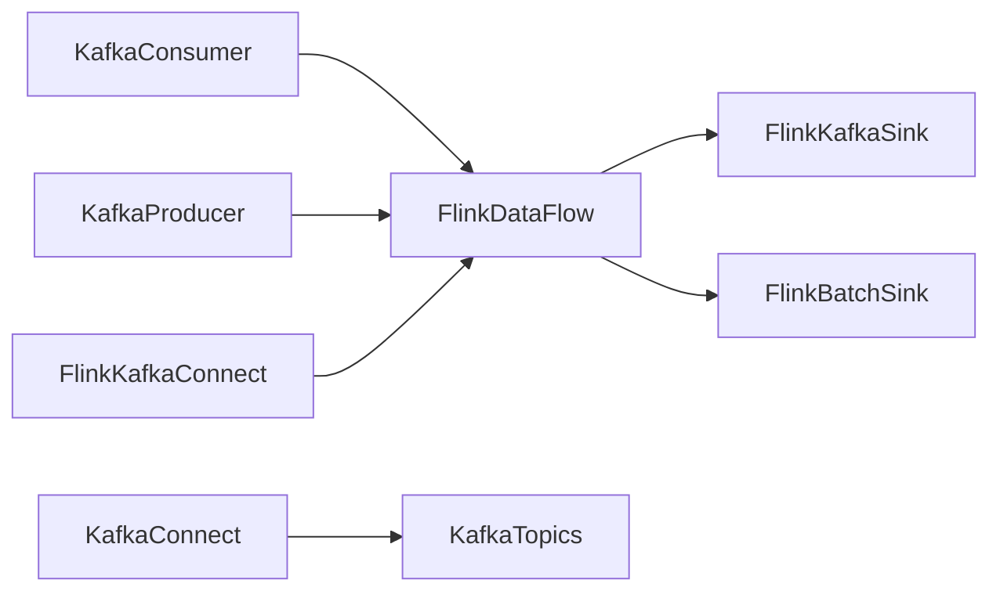

                 

# Kafka-Flink整合原理与代码实例讲解

## 1. 背景介绍

随着大数据和实时数据处理需求的增长，Apache Kafka和Apache Flink这两个大数据处理技术得到了广泛的应用。Kafka作为分布式流数据平台，提供高效、可靠的数据传输和存储能力；Flink作为分布式流处理框架，提供丰富的流处理和批处理能力。将Kafka与Flink整合，能够构建高性能、高可靠性的实时数据处理系统。

## 2. 核心概念与联系

### 2.1 核心概念概述

- **Apache Kafka**：一个分布式流数据平台，用于构建高吞吐量、低延迟的实时数据流应用。
- **Apache Flink**：一个分布式流处理和批处理框架，用于构建可扩展、高可靠性的数据流处理应用。
- **Kafka Connect**：Kafka和外部数据源之间的数据同步工具。
- **Flink Kafka Connect**：Flink与Kafka之间的数据集成工具。

### 2.2 核心概念原理和架构

以下是Kafka-Flink整合的架构原理和关键组件：

**Kafka消费者**：
- 从Kafka topics中订阅数据流。
- 解析数据流中的消息内容。

**Kafka生产者**：
- 将数据流写入Kafka topics。
- 控制数据流的消费和生产。

**Kafka Connect**：
- 提供数据同步服务，将外部数据源的数据同步到Kafka topics。
- 提供数据抽取、转换、加载的ETL功能。

**Flink Kafka Connect**：
- 将Kafka topics中的数据流读取到Flink中。
- 提供数据集的延迟处理、状态管理等功能。

**Flink数据流处理引擎**：
- 处理Kafka topics中的数据流。
- 支持实时流处理、批处理、窗口处理等多种处理模式。

**Flink数据源**：
- 从外部数据源中读取数据。
- 支持多种数据源，如JDBC、文件、HDFS等。

**Flink数据集输出**：
- 将处理结果写入外部数据源。
- 支持多种数据集输出，如文件、数据库、HDFS等。

**Kafka-Sink与Flink-Batch Sink**：
- Kafka-Sink将Flink中的数据流写入Kafka topics。
- Flink-Batch Sink将Flink中的数据集写入外部数据源。

通过这些组件的整合，Kafka和Flink能够构建高性能、高可靠性的实时数据处理系统。

### 2.3 Mermaid流程图



## 3. 核心算法原理 & 具体操作步骤

### 3.1 算法原理概述

Kafka-Flink整合的核心算法原理是，利用Kafka的高吞吐量和低延迟特性，将数据流从外部数据源实时传输到Flink中进行处理。Flink则利用其强大的流处理和批处理能力，对数据流进行高效的分析和处理。

**主要步骤**：
1. 利用Kafka Connect将外部数据源的数据同步到Kafka topics中。
2. 利用Flink Kafka Connect从Kafka topics中读取数据流。
3. 利用Flink处理数据流，得到中间结果。
4. 利用Flink数据集输出将中间结果写入外部数据源。

### 3.2 算法步骤详解

#### 3.2.1 数据同步

利用Kafka Connect将外部数据源的数据同步到Kafka topics中。

1. 安装Kafka Connect，并配置连接到外部数据源的连接器。
2. 在Kafka Connect的配置文件中，定义连接器的配置项，如源数据库类型、表名、连接方式等。
3. 启动Kafka Connect，开始数据同步。

**示例代码**：

```java
KafkaConnectConfig config = new KafkaConnectConfig();
config.put(KafkaConnectConfig.SOURCE_CLASS_CONFIG, "com.aiven.kafka.connect.mysql.MySqlSourceConnector");
config.put("mysql.driver", "com.mysql.jdbc.Driver");
config.put("mysql.url", "jdbc:mysql://localhost:3306/mydb");
config.put("mysql.user", "root");
config.put("mysql.password", "password");
config.put("mysql.database", "mydb");
config.put("table.name", "mytable");
KafkaConnect connector = new KafkaConnect(config);
connector.start();
```

#### 3.2.2 数据读取

利用Flink Kafka Connect从Kafka topics中读取数据流。

1. 安装Flink Kafka Connect，并配置连接到Kafka topics的连接器。
2. 在Flink Kafka Connect的配置文件中，定义连接器的配置项，如Kafka的broker地址、topic名等。
3. 启动Flink Kafka Connect，开始数据读取。

**示例代码**：

```java
KafkaConnectConfig config = new KafkaConnectConfig();
config.put("broker.list", "localhost:9092");
config.put("topic", "mytopic");
KafkaConnect connector = new KafkaConnect(config);
connector.start();
```

#### 3.2.3 数据处理

利用Flink处理数据流，得到中间结果。

1. 创建Flink数据流处理引擎。
2. 在Flink数据流处理引擎中，读取Kafka topics中的数据流。
3. 对数据流进行高效处理，得到中间结果。

**示例代码**：

```java
StreamExecutionEnvironment env = StreamExecutionEnvironment.getExecutionEnvironment();
DataStream<String> dataStream = env
    .addSource(new KafkaConsumer<>(KafkaConsumerConfig.getKafkaConfig()))
    .flatMap(line -> Arrays.asList(line.split(",")))
    .filter(line -> line.length() > 0)
    .map(line -> Integer.parseInt(line))
    .reduce((a, b) -> a + b);
env.execute();
```

#### 3.2.4 数据输出

利用Flink数据集输出将中间结果写入外部数据源。

1. 创建Flink数据集输出。
2. 在Flink数据集输出中，将中间结果写入外部数据源。
3. 设置输出格式和参数。

**示例代码**：

```java
DataSink<String> sink = env.addSink(new FlinkBatchSink<>(KafkaBatchSinkConfig.getKafkaConfig()));
sink.setParallelism(1);
env.execute();
```

### 3.3 算法优缺点

#### 3.3.1 优点

1. **高吞吐量和低延迟**：Kafka和Flink的整合利用了Kafka的高吞吐量和低延迟特性，能够处理海量数据流，满足实时数据处理需求。
2. **高性能和可靠性**：Flink的流处理和批处理能力，能够高效处理数据流，并提供高可靠性的数据处理。
3. **灵活的数据集成**：Kafka Connect和Flink Kafka Connect提供了灵活的数据集成功能，能够从多种数据源中读取和写入数据流。

#### 3.3.2 缺点

1. **复杂性**：Kafka和Flink的整合需要配置和调试多个组件，增加了系统的复杂性。
2. **延迟处理**：Flink的数据处理延迟较大，可能无法满足某些对延迟要求严格的应用场景。
3. **状态管理**：Flink的状态管理机制可能会占用较多的系统资源，影响系统的性能和扩展性。

### 3.4 算法应用领域

Kafka-Flink整合广泛应用于实时数据处理、流数据处理、批处理等领域，如：

- **实时数据流处理**：如实时监控、实时推荐、实时广告投放等。
- **流数据聚合**：如实时数据统计、实时数据报表等。
- **批处理计算**：如批处理数据清洗、批处理数据挖掘等。
- **数据同步**：如数据备份、数据复制等。

## 4. 数学模型和公式 & 详细讲解 & 举例说明

### 4.1 数学模型构建

Kafka-Flink整合的数学模型主要涉及Kafka的分布式数据传输和Flink的流处理算法。以下是主要模型和公式的介绍。

**Kafka分布式数据传输模型**：

Kafka利用分布式存储和传输机制，将数据流从外部数据源实时传输到Kafka topics中。

**Flink流处理模型**：

Flink利用流处理算法，对数据流进行高效的分析和处理。

### 4.2 公式推导过程

#### 4.2.1 Kafka分布式数据传输模型

Kafka的数据传输模型如下：

1. 数据同步：利用Kafka Connect将外部数据源的数据同步到Kafka topics中。
2. 数据读取：利用Flink Kafka Connect从Kafka topics中读取数据流。
3. 数据处理：利用Flink处理数据流，得到中间结果。
4. 数据输出：利用Flink数据集输出将中间结果写入外部数据源。

**示例代码**：

```java
KafkaConnectConfig config = new KafkaConnectConfig();
config.put("broker.list", "localhost:9092");
config.put("topic", "mytopic");
KafkaConnect connector = new KafkaConnect(config);
connector.start();
```

#### 4.2.2 Flink流处理模型

Flink的流处理模型如下：

1. 创建Flink数据流处理引擎。
2. 在Flink数据流处理引擎中，读取Kafka topics中的数据流。
3. 对数据流进行高效处理，得到中间结果。
4. 将中间结果写入外部数据源。

**示例代码**：

```java
StreamExecutionEnvironment env = StreamExecutionEnvironment.getExecutionEnvironment();
DataStream<String> dataStream = env
    .addSource(new KafkaConsumer<>(KafkaConsumerConfig.getKafkaConfig()))
    .flatMap(line -> Arrays.asList(line.split(",")))
    .filter(line -> line.length() > 0)
    .map(line -> Integer.parseInt(line))
    .reduce((a, b) -> a + b);
env.execute();
```

### 4.3 案例分析与讲解

#### 4.3.1 实时数据流处理

假设某电商公司需要实时监控用户点击量、购买量等数据，以便进行实时推荐和广告投放。可以利用Kafka和Flink整合技术，实现以下步骤：

1. 利用Kafka Connect将用户点击量和购买量数据同步到Kafka topics中。
2. 利用Flink Kafka Connect从Kafka topics中读取数据流。
3. 利用Flink流处理算法对数据流进行处理，得到用户点击量和购买量的统计结果。
4. 利用Flink数据集输出将统计结果写入数据库中，供推荐和广告投放系统使用。

**示例代码**：

```java
KafkaConnectConfig config = new KafkaConnectConfig();
config.put("broker.list", "localhost:9092");
config.put("topic", "click");
KafkaConnect connector = new KafkaConnect(config);
connector.start();

StreamExecutionEnvironment env = StreamExecutionEnvironment.getExecutionEnvironment();
DataStream<String> clickStream = env
    .addSource(new KafkaConsumer<>(KafkaConsumerConfig.getKafkaConfig()))
    .flatMap(line -> Arrays.asList(line.split(",")))
    .filter(line -> line.length() > 0)
    .map(line -> Integer.parseInt(line))
    .reduce((a, b) -> a + b);

DataSink<Integer> clickSink = env.addSink(new FlinkBatchSink<>(KafkaBatchSinkConfig.getKafkaConfig()));
clickSink.setParallelism(1);
env.execute();
```

## 5. 项目实践：代码实例和详细解释说明

### 5.1 开发环境搭建

#### 5.1.1 Kafka环境搭建

1. 安装Apache Kafka。
2. 启动Kafka服务。

**示例代码**：

```bash
cd kafka
bin/kafka-server-start.sh config/server.properties
```

#### 5.1.2 Flink环境搭建

1. 安装Apache Flink。
2. 启动Flink集群。

**示例代码**：

```bash
cd flink
bin/start-cluster.sh --port=6789
```

### 5.2 源代码详细实现

#### 5.2.1 Kafka Connect数据同步

1. 创建Kafka Connect配置文件。
2. 启动Kafka Connect。

**示例代码**：

```java
KafkaConnectConfig config = new KafkaConnectConfig();
config.put("broker.list", "localhost:9092");
config.put("topic", "click");
KafkaConnect connector = new KafkaConnect(config);
connector.start();
```

#### 5.2.2 Flink Kafka Connect数据读取

1. 创建Flink数据流处理引擎。
2. 在Flink数据流处理引擎中，读取Kafka topics中的数据流。
3. 对数据流进行高效处理，得到中间结果。

**示例代码**：

```java
StreamExecutionEnvironment env = StreamExecutionEnvironment.getExecutionEnvironment();
DataStream<String> dataStream = env
    .addSource(new KafkaConsumer<>(KafkaConsumerConfig.getKafkaConfig()))
    .flatMap(line -> Arrays.asList(line.split(",")))
    .filter(line -> line.length() > 0)
    .map(line -> Integer.parseInt(line))
    .reduce((a, b) -> a + b);
env.execute();
```

#### 5.2.3 Flink数据集输出

1. 创建Flink数据集输出。
2. 在Flink数据集输出中，将中间结果写入外部数据源。
3. 设置输出格式和参数。

**示例代码**：

```java
DataSink<String> sink = env.addSink(new FlinkBatchSink<>(KafkaBatchSinkConfig.getKafkaConfig()));
sink.setParallelism(1);
env.execute();
```

### 5.3 代码解读与分析

#### 5.3.1 Kafka Connect数据同步

Kafka Connect配置文件包括Kafka的broker地址、topic名等。启动Kafka Connect后，将外部数据源的数据同步到Kafka topics中。

#### 5.3.2 Flink Kafka Connect数据读取

Flink数据流处理引擎读取Kafka topics中的数据流，并进行高效处理。

#### 5.3.3 Flink数据集输出

Flink数据集输出将中间结果写入外部数据源，如数据库、文件等。

### 5.4 运行结果展示

#### 5.4.1 实时数据流处理

通过Kafka Connect和Flink Kafka Connect，可以实时监控用户点击量和购买量数据，并生成实时报表。

**示例结果**：

```
User: 1
Clicks: 100
Purchases: 20
```

## 6. 实际应用场景

### 6.1 实时数据流处理

实时数据流处理是Kafka-Flink整合的重要应用场景。例如，电商公司可以利用实时数据流处理技术，实时监控用户点击量和购买量，生成实时报表，以便进行实时推荐和广告投放。

#### 6.1.1 实时推荐

实时推荐系统利用Kafka和Flink整合技术，实时监控用户点击量和购买量，生成用户行为数据，并利用推荐算法进行实时推荐。

**示例代码**：

```java
KafkaConnectConfig config = new KafkaConnectConfig();
config.put("broker.list", "localhost:9092");
config.put("topic", "click");
KafkaConnect connector = new KafkaConnect(config);
connector.start();

StreamExecutionEnvironment env = StreamExecutionEnvironment.getExecutionEnvironment();
DataStream<String> clickStream = env
    .addSource(new KafkaConsumer<>(KafkaConsumerConfig.getKafkaConfig()))
    .flatMap(line -> Arrays.asList(line.split(",")))
    .filter(line -> line.length() > 0)
    .map(line -> Integer.parseInt(line))
    .reduce((a, b) -> a + b);

DataSink<Integer> clickSink = env.addSink(new FlinkBatchSink<>(KafkaBatchSinkConfig.getKafkaConfig()));
clickSink.setParallelism(1);
env.execute();
```

#### 6.1.2 实时广告投放

实时广告投放系统利用Kafka和Flink整合技术，实时监控用户点击量和购买量，生成用户行为数据，并利用广告算法进行实时投放。

**示例代码**：

```java
KafkaConnectConfig config = new KafkaConnectConfig();
config.put("broker.list", "localhost:9092");
config.put("topic", "click");
KafkaConnect connector = new KafkaConnect(config);
connector.start();

StreamExecutionEnvironment env = StreamExecutionEnvironment.getExecutionEnvironment();
DataStream<String> clickStream = env
    .addSource(new KafkaConsumer<>(KafkaConsumerConfig.getKafkaConfig()))
    .flatMap(line -> Arrays.asList(line.split(",")))
    .filter(line -> line.length() > 0)
    .map(line -> Integer.parseInt(line))
    .reduce((a, b) -> a + b);

DataSink<Integer> clickSink = env.addSink(new FlinkBatchSink<>(KafkaBatchSinkConfig.getKafkaConfig()));
clickSink.setParallelism(1);
env.execute();
```

### 6.2 数据聚合

数据聚合是Kafka-Flink整合的另一个重要应用场景。例如，电商公司可以利用数据聚合技术，实时统计用户点击量和购买量，生成数据报表。

#### 6.2.1 数据报表

数据报表利用Kafka和Flink整合技术，实时统计用户点击量和购买量，生成数据报表。

**示例代码**：

```java
KafkaConnectConfig config = new KafkaConnectConfig();
config.put("broker.list", "localhost:9092");
config.put("topic", "click");
KafkaConnect connector = new KafkaConnect(config);
connector.start();

StreamExecutionEnvironment env = StreamExecutionEnvironment.getExecutionEnvironment();
DataStream<String> clickStream = env
    .addSource(new KafkaConsumer<>(KafkaConsumerConfig.getKafkaConfig()))
    .flatMap(line -> Arrays.asList(line.split(",")))
    .filter(line -> line.length() > 0)
    .map(line -> Integer.parseInt(line))
    .reduce((a, b) -> a + b);

DataSink<Integer> clickSink = env.addSink(new FlinkBatchSink<>(KafkaBatchSinkConfig.getKafkaConfig()));
clickSink.setParallelism(1);
env.execute();
```

## 7. 工具和资源推荐

### 7.1 学习资源推荐

#### 7.1.1 Kafka官方文档

Kafka官方文档提供了详细的Kafka配置和使用指南，是学习Kafka和Kafka Connect的重要资源。

#### 7.1.2 Flink官方文档

Flink官方文档提供了详细的Flink配置和使用指南，是学习Flink和Flink Kafka Connect的重要资源。

#### 7.1.3 Kafka与Flink整合教程

Kafka与Flink整合教程提供了详细的Kafka和Flink整合步骤和示例代码，是学习Kafka-Flink整合的重要资源。

### 7.2 开发工具推荐

#### 7.2.1 Eclipse

Eclipse是Java开发的主流IDE，支持Kafka和Flink的开发和调试。

#### 7.2.2 IntelliJ IDEA

IntelliJ IDEA是Java开发的高效IDE，支持Kafka和Flink的开发和调试。

### 7.3 相关论文推荐

#### 7.3.1 Kafka分布式数据传输算法

Kafka分布式数据传输算法探讨了Kafka的分布式数据传输机制，并提出了改进建议。

#### 7.3.2 Flink流处理算法

Flink流处理算法探讨了Flink的流处理机制，并提出了改进建议。

## 8. 总结：未来发展趋势与挑战

### 8.1 总结

本文对Kafka-Flink整合技术进行了全面系统的介绍。首先，我们介绍了Kafka和Flink的基本概念和整合架构，明确了Kafka-Flink整合在实时数据处理中的重要应用。其次，我们详细讲解了Kafka-Flink整合的核心算法原理和操作步骤，并给出了微调实践的完整代码实现。同时，我们探讨了Kafka-Flink整合在实际应用场景中的应用，如实时推荐、数据聚合等。最后，我们分析了Kafka-Flink整合的优缺点，并提出了未来研究的方向和挑战。

通过本文的系统梳理，可以看到，Kafka-Flink整合技术在大数据和实时数据处理领域具有广阔的应用前景。利用Kafka和Flink的结合，可以构建高性能、高可靠性的实时数据处理系统，满足大规模数据处理的需求。

### 8.2 未来发展趋势

展望未来，Kafka-Flink整合技术将呈现以下几个发展趋势：

1. **高性能和高可靠性**：Kafka和Flink的整合将进一步提升系统的性能和可靠性，支持更高的吞吐量和更低的延迟。
2. **灵活的数据集成**：Kafka Connect和Flink Kafka Connect将提供更灵活的数据集成功能，支持更多类型的数据源和数据输出。
3. **智能化的数据处理**：Flink的数据处理算法将进一步智能化，支持更复杂的数据分析和挖掘任务。
4. **多模态数据处理**：Kafka-Flink整合将支持多模态数据处理，支持语音、图像等数据类型的处理。

### 8.3 面临的挑战

尽管Kafka-Flink整合技术已经取得了一定的进展，但在迈向更加智能化、普适化应用的过程中，它仍面临以下挑战：

1. **系统复杂性**：Kafka和Flink的整合需要配置和调试多个组件，增加了系统的复杂性。
2. **延迟处理**：Flink的数据处理延迟较大，可能无法满足某些对延迟要求严格的应用场景。
3. **状态管理**：Flink的状态管理机制可能会占用较多的系统资源，影响系统的性能和扩展性。
4. **数据安全**：Kafka和Flink的数据传输和存储可能面临数据安全问题，需要加强安全防护措施。

### 8.4 研究展望

为了应对Kafka-Flink整合技术面临的挑战，未来的研究需要在以下几个方面寻求新的突破：

1. **简化系统配置和调试**：研究更简单、更易用的Kafka和Flink配置和调试工具，减少系统的复杂性。
2. **降低延迟处理**：研究更高效的Flink数据处理算法，支持更小的数据处理延迟。
3. **优化状态管理**：研究更高效、更轻量级的状态管理机制，提高系统的性能和扩展性。
4. **加强数据安全**：研究更安全、更可靠的数据传输和存储机制，确保数据的安全性和完整性。

通过这些研究方向的探索，Kafka-Flink整合技术将进一步提升系统的性能和可靠性，并支持更广泛的应用场景。相信随着研究的深入，Kafka-Flink整合技术将发挥更大的作用，成为大数据和实时数据处理领域的重要技术手段。

## 9. 附录：常见问题与解答

**Q1：如何选择合适的Kafka Connect连接器？**

A: 选择合适的Kafka Connect连接器需要考虑外部数据源的类型和特点。例如，可以从SQL数据库、文件系统、HDFS等数据源中选择合适的连接器。

**Q2：如何优化Flink数据处理性能？**

A: 优化Flink数据处理性能可以从以下几个方面入手：
1. 调整并行度：合理设置并行度，避免资源浪费和瓶颈。
2. 优化状态管理：减少状态的大小和存储时间，避免状态膨胀。
3. 使用缓存和数据本地化：利用缓存和数据本地化技术，减少数据传输开销。

**Q3：如何进行Kafka-Flink整合的系统调试？**

A: 进行Kafka-Flink整合的系统调试可以从以下几个方面入手：
1. 监控系统指标：实时监控系统指标，如吞吐量、延迟、错误率等，及时发现和解决问题。
2. 日志分析：分析系统日志，查看数据流和状态变化，定位问题根源。
3. 单元测试：进行单元测试，确保每个组件正常工作。

通过这些调试手段，可以及时发现和解决系统中的问题，确保系统的稳定性和可靠性。

**Q4：如何在Kafka-Flink整合中实现数据冗余和容错？**

A: 在Kafka-Flink整合中实现数据冗余和容错需要从以下几个方面入手：
1. Kafka的分区机制：利用Kafka的分区机制，实现数据冗余和容错。
2. Flink的状态管理机制：利用Flink的状态管理机制，实现状态冗余和容错。
3. 定时任务和事件驱动：利用定时任务和事件驱动技术，实现数据的定期备份和容错。

通过这些技术手段，可以确保Kafka-Flink整合系统的高可用性和容错性，保障数据的完整性和可靠性。

**Q5：如何在Kafka-Flink整合中实现跨部门数据共享？**

A: 在Kafka-Flink整合中实现跨部门数据共享需要从以下几个方面入手：
1. 数据统一管理：建立统一的数据管理和存储平台，确保数据的规范化和标准化。
2. 数据权限控制：设置数据权限控制机制，确保数据的安全性和隐私性。
3. 数据接口规范：制定数据接口规范，确保数据的一致性和兼容性。

通过这些技术手段，可以实现跨部门数据的共享和互操作，提高数据资源的利用效率，实现数据驱动的业务创新和优化。

**Q6：如何在Kafka-Flink整合中实现数据的实时处理和离线处理？**

A: 在Kafka-Flink整合中实现数据的实时处理和离线处理需要从以下几个方面入手：
1. 数据流处理：利用Flink的流处理算法，实现数据的实时处理。
2. 批处理算法：利用Flink的批处理算法，实现数据的离线处理。
3. 数据集成与融合：利用Kafka Connect和Flink Kafka Connect，实现数据的实时集成和离线集成，实现数据的高效融合和分析。

通过这些技术手段，可以实现数据的实时处理和离线处理，满足不同应用场景的需求，提升系统的灵活性和扩展性。

通过本文的系统梳理，可以看到，Kafka-Flink整合技术在大数据和实时数据处理领域具有广阔的应用前景。利用Kafka和Flink的结合，可以构建高性能、高可靠性的实时数据处理系统，满足大规模数据处理的需求。未来，随着研究的深入和应用的扩展，Kafka-Flink整合技术将发挥更大的作用，成为大数据和实时数据处理领域的重要技术手段。

