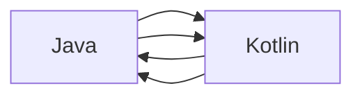

                 

# Kotlin 语言优势：现代 Android 开发语言

## 1. 背景介绍

### 1.1 问题由来

在 Android 开发领域，Java 一直是最广泛使用的语言，因为它与 Java 平台兼容，并且拥有大量的框架和库。然而，Java 面临着许多问题，包括代码可读性差、类型系统繁琐、内存管理复杂、线程模型不直观等。这些问题使得 Android 开发者面临着高生产成本和低开发效率的挑战。

在这样的背景下，Kotlin 作为一种新的编程语言出现，它的设计理念是简化 Java 的复杂性，同时提供了更多的现代编程语言特性。Kotlin 是由 JetBrains 团队开发的，它于 2011 年开始开发，并在 2017 年被 Google 引入 Android 生态系统，从此成为了 Android 开发的官方语言之一。

### 1.2 问题核心关键点

Kotlin 与 Java 相比具有许多优势，包括更好的代码可读性、更强的类型系统、更简单的内存管理、更直观的线程模型等。本文将从这些关键点出发，探讨 Kotlin 在 Android 开发中的优势。

## 2. 核心概念与联系

### 2.1 核心概念概述

为了更好地理解 Kotlin 在 Android 开发中的优势，我们需要先介绍一些核心概念：

- **Java 与 Kotlin 的互操作性**：Kotlin 能够与 Java 无缝集成，这意味着 Java 和 Kotlin 代码可以共同存在于同一个项目中，并且可以互相调用。

- **Lambda 表达式和扩展函数**：Kotlin 提供了 Lambda 表达式和扩展函数，使得代码更简洁易读，同时也简化了并发编程。

- **类与对象的定义**：Kotlin 与 Java 的类定义方式基本相同，但 Kotlin 提供了更多的类型注解和可空性检查，使得代码更安全。

- **空值与非空值类型**：Kotlin 提供了非空值类型，可以帮助开发者避免空指针异常，并且可以检查空值，提高代码的健壮性。

- **延迟加载**：Kotlin 提供了延迟加载（Lazy Initialization）机制，可以在需要时才加载对象，从而提高代码的性能和资源利用率。

- **null 安全型**：Kotlin 提供了 null 安全型（Null-Safety）机制，使得开发者可以更安全地处理 null 值。

这些核心概念共同构成了 Kotlin 语言的优势，使得它在 Android 开发中成为一种更具吸引力的选择。

### 2.2 核心概念原理和架构的 Mermaid 流程图

以下是 Kotlin 与 Java 的互操作性原理和架构的 Mermaid 流程图：



这个流程图展示了 Kotlin 与 Java 的互操作性：

- Java 能够调用 Kotlin 的代码，同时 Kotlin 也能够调用 Java 的代码。
- 这种互操作性使得 Kotlin 和 Java 可以共同存在于同一个项目中，并且可以互相调用。

## 3. 核心算法原理 & 具体操作步骤

### 3.1 算法原理概述

Kotlin 在 Android 开发中的优势体现在多个方面，包括代码可读性、类型系统、内存管理、线程模型等方面。这些优势使得开发者可以更高效地开发 Android 应用，同时也提高了代码的可维护性和可扩展性。

### 3.2 算法步骤详解

Kotlin 在 Android 开发中的应用，可以分为以下几个步骤：

1. **环境搭建**：首先需要在开发机器上安装 Android Studio 和 Kotlin 插件，并将其配置为 Kotlin 语言。

2. **项目初始化**：在 Android Studio 中创建一个新的 Android 项目，并设置其为 Kotlin 语言支持。

3. **代码编写**：在项目中添加 Kotlin 代码，并使用 Java 与 Kotlin 代码共同开发 Android 应用。

4. **编译与运行**：使用 Android Studio 编译项目，并在模拟器或真机上运行。

5. **优化与调试**：使用 Android Studio 的调试工具对项目进行优化和调试，解决可能出现的问题。

### 3.3 算法优缺点

Kotlin 在 Android 开发中的优点包括：

- **代码可读性更好**：Kotlin 提供了更简洁的语法，使得代码更易于阅读和理解。

- **类型系统更严格**：Kotlin 的类型系统更加严格，可以帮助开发者避免一些常见的错误。

- **内存管理更简单**：Kotlin 提供了智能的内存管理机制，减少了内存泄漏的可能性。

- **线程模型更直观**：Kotlin 提供了更直观的线程模型，使得多线程编程更加容易。

- **扩展函数与 Lambda 表达式**：Kotlin 提供了扩展函数和 Lambda 表达式，使得代码更简洁。

- **非空值类型与 null 安全型**：Kotlin 提供了非空值类型和 null 安全型机制，减少了空指针异常的发生。

Kotlin 在 Android 开发中的缺点包括：

- **学习曲线较高**：Kotlin 的语法和特性可能对于一些 Java 开发者来说比较陌生，需要一定的学习成本。

- **工具链不完善**：Kotlin 的生态系统相比于 Java 来说还不是很完善，可能对于一些开发者来说不太方便。

### 3.4 算法应用领域

Kotlin 在 Android 开发中的应用领域包括：

- **UI 设计**：Kotlin 可以用来编写 Android 应用的 UI 代码，如布局、按钮、文本等。

- **数据处理**：Kotlin 可以用来处理数据，如读取和写入文件、数据库操作等。

- **网络编程**：Kotlin 可以用来编写 Android 应用的网络模块，如 HTTP 请求、WebSocket 等。

- **异步编程**：Kotlin 提供了更简洁的异步编程机制，使得异步编程更加容易。

- **测试**：Kotlin 可以用来编写 Android 应用的测试代码，如单元测试、集成测试等。

## 4. 数学模型和公式 & 详细讲解 & 举例说明

### 4.1 数学模型构建

在 Android 应用中，Kotlin 通常用于编写 UI 代码、数据处理、网络编程、异步编程、测试等模块。以下是一个简单的 Kotlin 代码示例，展示了如何定义一个函数：

```kotlin
fun add(a: Int, b: Int): Int {
    return a + b
}
```

这个函数定义了一个名为 `add` 的函数，接受两个整数参数 `a` 和 `b`，并返回它们的和。

### 4.2 公式推导过程

在 Kotlin 中，可以使用 Lambda 表达式和扩展函数来简化代码。以下是一个使用 Lambda 表达式和扩展函数的示例：

```kotlin
val sum = numbers.sumBy { it * 2 }.map { it / 2 }
```

这个示例使用了 Lambda 表达式和扩展函数 `sumBy` 和 `map`。其中 `sumBy` 函数接受一个 Lambda 表达式，计算列表中每个元素的值，并将其累加。`map` 函数接受一个 Lambda 表达式，将计算结果映射到新的列表中。

### 4.3 案例分析与讲解

在 Android 应用中，Kotlin 可以用来编写 UI 代码。以下是一个简单的 Kotlin 代码示例，展示了如何定义一个按钮的点击事件：

```kotlin
val button: Button = findViewById(R.id.button)

button.setOnClickListener {
    // 按钮点击事件处理
}
```

这个示例使用了 Lambda 表达式来定义按钮的点击事件。当按钮被点击时，Lambda 表达式中的代码会被执行。

## 5. 项目实践：代码实例和详细解释说明

### 5.1 开发环境搭建

在 Android 开发中，首先需要安装 Android Studio 和 Kotlin 插件。Android Studio 是 Google 提供的 Android 开发工具，它提供了 Android 应用的开发、测试、调试、发布等功能。Kotlin 插件是 Android Studio 中的一个插件，它提供了 Kotlin 语言的支持。

### 5.2 源代码详细实现

以下是一个简单的 Android 应用的 Kotlin 代码示例，展示了如何使用 Kotlin 编写 UI 代码：

```kotlin
class MainActivity : AppCompatActivity() {
    override fun onCreate(savedInstanceState: Bundle?) {
        super.onCreate(savedInstanceState)
        setContentView(R.layout.activity_main)
        
        val button: Button = findViewById(R.id.button)
        
        button.setOnClickListener {
            // 按钮点击事件处理
        }
    }
}
```

这个示例定义了一个名为 `MainActivity` 的类，它继承自 `AppCompatActivity`。在 `onCreate` 方法中，设置了应用的布局文件 `activity_main.xml`，并使用 `findViewById` 方法获取了按钮控件 `button`。最后，使用 Lambda 表达式定义了按钮的点击事件处理。

### 5.3 代码解读与分析

Kotlin 代码中的注释可以帮助理解代码的含义。例如，在 `MainActivity` 类中，注释说明了 `onCreate` 方法的作用和 `setContentView` 方法的作用。

## 6. 实际应用场景

Kotlin 在 Android 开发中的应用场景非常广泛，以下是几个实际的案例：

### 6.1 智能翻译应用

智能翻译应用是一个典型的 Android 应用，它需要处理文本的输入和输出。Kotlin 可以用来编写智能翻译应用的 UI 代码、数据处理、网络编程等模块。

### 6.2 新闻应用

新闻应用是一个常见的 Android 应用，它需要展示新闻列表、新闻详情等。Kotlin 可以用来编写新闻应用的 UI 代码、数据处理、网络编程等模块。

### 6.3 社交媒体应用

社交媒体应用是一个复杂的 Android 应用，它需要处理用户的登录、发布、点赞、评论等操作。Kotlin 可以用来编写社交媒体应用的 UI 代码、数据处理、网络编程、异步编程等模块。

### 6.4 未来应用展望

随着 Kotlin 生态系统的不断完善，Kotlin 在 Android 开发中的应用前景将更加广阔。未来，Kotlin 将会有更多的功能和工具支持，使得 Android 开发者可以更高效地开发出高质量的 Android 应用。

## 7. 工具和资源推荐

### 7.1 学习资源推荐

为了帮助开发者系统掌握 Kotlin 语言，以下是一些优质的学习资源：

- **Kotlin 官方文档**：Kotlin 的官方文档提供了丰富的教程和示例，是学习 Kotlin 的最佳资源。

- **《Kotlin 实战》书籍**：这本书由 JetBrains 团队编写，详细介绍了 Kotlin 语言的特点和应用，是一本非常实用的 Kotlin 学习书籍。

- **Kotlin Koans**：Kotlin Koans 是一个互动式的学习平台，可以帮助开发者通过实践来学习 Kotlin。

### 7.2 开发工具推荐

Kotlin 在 Android 开发中的应用离不开一些工具的支持。以下是一些常用的开发工具：

- **Android Studio**：Android Studio 是 Google 提供的 Android 开发工具，支持 Kotlin 和 Java 代码的混合开发。

- **Kotlin 插件**：Android Studio 中的 Kotlin 插件提供了 Kotlin 语言的支持，可以方便地编写 Kotlin 代码。

- **Gradle**：Gradle 是一个构建工具，可以用于构建和发布 Android 应用。

### 7.3 相关论文推荐

Kotlin 在 Android 开发中的应用研究是一个不断发展的领域，以下是一些相关的论文：

- **Kotlin for Android Developers**：这篇文章详细介绍了 Kotlin 在 Android 开发中的应用，可以帮助开发者更好地理解 Kotlin 的优缺点。

- **Kotlin in Android Development**：这篇文章介绍了 Kotlin 在 Android 开发中的使用场景和最佳实践。

## 8. 总结：未来发展趋势与挑战

### 8.1 研究成果总结

Kotlin 在 Android 开发中已经取得了广泛的应用，并且表现出许多优势。这些优势包括更好的代码可读性、更严格的类型系统、更简单的内存管理、更直观的线程模型等。这些优势使得 Kotlin 成为 Android 开发的一个重要选择。

### 8.2 未来发展趋势

Kotlin 在 Android 开发中的未来发展趋势包括：

- **生态系统完善**：Kotlin 的生态系统将会更加完善，更多的工具和库将支持 Kotlin。

- **社区活跃**：Kotlin 社区将会更加活跃，更多的开发者将会使用 Kotlin。

- **语言特性完善**：Kotlin 的语言特性将会更加完善，开发者将会更方便地使用 Kotlin。

### 8.3 面临的挑战

Kotlin 在 Android 开发中也面临着一些挑战：

- **学习成本较高**：Kotlin 的语法和特性可能对于一些 Java 开发者来说比较陌生，需要一定的学习成本。

- **工具链不完善**：Kotlin 的生态系统相比于 Java 来说还不是很完善，可能对于一些开发者来说不太方便。

### 8.4 研究展望

Kotlin 在 Android 开发中的应用将会更加广泛，未来的研究需要关注以下几个方向：

- **更多的语言特性**：Kotlin 将会引入更多的语言特性，提高开发效率和代码质量。

- **更多的工具支持**：Kotlin 将会引入更多的工具支持，提高开发效率和代码质量。

- **更多的应用场景**：Kotlin 将会被应用到更多的场景中，提高开发效率和代码质量。

## 9. 附录：常见问题与解答

**Q1: Kotlin 与 Java 互操作性是如何实现的？**

A: Kotlin 与 Java 的互操作性是通过桥接机制实现的。Kotlin 代码可以通过桥接机制调用 Java 代码，反之亦然。这种互操作性使得 Kotlin 和 Java 可以共同存在于同一个项目中，并且可以互相调用。

**Q2: Kotlin 与 Java 代码的混合开发需要注意哪些问题？**

A: 在 Kotlin 与 Java 代码的混合开发中，需要注意以下几个问题：

- **类型转换**：Kotlin 与 Java 代码的类型不一致时需要进行类型转换。

- **访问权限**：Kotlin 与 Java 代码的访问权限不一致时需要进行访问权限控制。

- **代码风格**：Kotlin 与 Java 代码的代码风格不一致时需要进行代码风格的统一。

**Q3: Kotlin 中的 Lambda 表达式和扩展函数有什么优势？**

A: Kotlin 中的 Lambda 表达式和扩展函数具有以下优势：

- **代码简洁**：Lambda 表达式和扩展函数可以使代码更加简洁易读。

- **函数式编程**：Lambda 表达式和扩展函数支持函数式编程，可以使代码更加灵活。

- **减少样板代码**：Lambda 表达式和扩展函数可以减少样板代码，提高开发效率。

**Q4: Kotlin 中的 null 安全型有什么优势？**

A: Kotlin 中的 null 安全型具有以下优势：

- **减少空指针异常**：Kotlin 中的 null 安全型可以减少空指针异常的发生。

- **代码更加健壮**：Kotlin 中的 null 安全型可以使代码更加健壮，提高代码的可靠性。

- **提高开发效率**：Kotlin 中的 null 安全型可以避免开发者手动检查空值，提高开发效率。

**Q5: Kotlin 中的延迟加载有什么优势？**

A: Kotlin 中的延迟加载具有以下优势：

- **资源利用率提高**：Kotlin 中的延迟加载可以在需要时才加载对象，从而提高资源利用率。

- **内存使用减少**：Kotlin 中的延迟加载可以减少对象的创建和销毁，从而减少内存使用。

- **提高性能**：Kotlin 中的延迟加载可以提高应用性能，减少不必要的计算和内存分配。

---

作者：禅与计算机程序设计艺术 / Zen and the Art of Computer Programming

