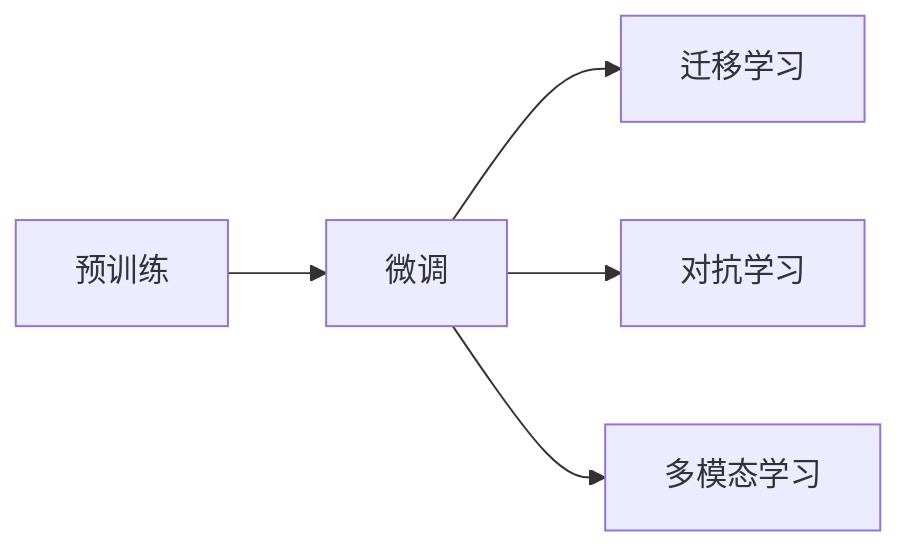

                 

# LLM 产业链：逐渐清晰的角色和责任

大语言模型（Large Language Models, LLMs），特别是基于深度学习的大型语言模型，正在迅速改变我们对人工智能（AI）的理解和应用。LLMs 不仅在自然语言处理（NLP）领域引发了革命性变化，还逐步渗透到更广泛的领域，如智能推荐、自动驾驶、金融风险预测等。这一转变也带来了对产业链角色和责任的重新思考。本文将深入探讨 LLM 产业链的角色和责任，希望能为开发者、企业领导者及政策制定者提供宝贵的见解。

## 1. 背景介绍

### 1.1 大背景

近年来，深度学习技术的突破，尤其是自然语言处理领域的进展，推动了大语言模型技术的发展。BERT、GPT、T5 等模型的出现，展示了 LLMs 在理解、生成和应用语言方面的巨大潜力。这些模型的基础架构由 Transformer 构成，能够学习到丰富的语言知识，并在微调后用于解决各种 NLP 任务。

### 1.2 驱动因素

1. **计算资源**：高性能计算资源（如 GPU 和 TPU）的普及，使得训练大模型成为可能。
2. **数据资源**：大规模无标签和有标签文本数据的积累，为预训练和微调提供了丰富的数据支持。
3. **研究创新**：学术界和企业界在算法、模型架构和优化方法上的不断探索，推动了 LLMs 的演进。

### 1.3 现状与挑战

尽管 LLMs 在多个领域取得了显著进展，但也面临诸多挑战：
- **计算资源消耗**：大模型需要巨大的计算资源进行训练和推理，成本高昂。
- **数据隐私与安全**：大规模文本数据处理涉及数据隐私和安全问题，需要严格的数据管理措施。
- **公平性与偏见**：模型可能包含训练数据的偏见，对少数群体或特定领域存在歧视。
- **模型的可解释性与透明度**：复杂的深度学习模型难以解释其决策过程，缺乏透明度。

## 2. 核心概念与联系

### 2.1 核心概念

- **预训练（Pre-training）**：在大规模无标签数据上训练模型，学习通用的语言表示。
- **微调（Fine-tuning）**：在预训练模型基础上，使用有标签数据对特定任务进行微调，优化模型性能。
- **迁移学习（Transfer Learning）**：将预训练模型迁移到下游任务，减少从头训练需求。
- **多模态学习（Multimodal Learning）**：结合文本、图像、音频等多种模态数据，提升模型对现实世界的理解。
- **对抗学习（Adversarial Learning）**：通过对抗样本训练模型，提高其鲁棒性和泛化能力。

### 2.2 核心概念联系

这些核心概念构成了 LLMs 从数据到应用的全流程，如图 1 所示。



预训练大模型提供通用的语言表示，通过微调可针对特定任务进行优化，迁移学习则进一步将模型应用于不同领域。对抗学习和多模态学习则增强了模型的鲁棒性和泛化能力。

## 3. 核心算法原理 & 具体操作步骤

### 3.1 算法原理概述

基于 LLMs 的微调过程主要包括以下步骤：
1. **数据准备**：收集并标注特定任务的数据集。
2. **模型初始化**：使用预训练模型作为初始化参数。
3. **模型微调**：在标注数据上训练模型，调整模型权重以适应特定任务。
4. **性能评估**：在测试集上评估模型性能。
5. **模型部署**：将微调后的模型部署到实际应用中。

### 3.2 算法步骤详解

#### 3.2.1 数据准备

- **标注数据**：根据特定任务，收集并标注高质量的数据集。例如，在情感分析任务中，需要标注好的文本数据和相应的情感标签。
- **数据预处理**：清洗、分词、归一化等步骤，确保数据质量。

#### 3.2.2 模型初始化

- **选择模型**：选择合适的预训练模型，如 BERT、GPT、T5 等。
- **加载模型**：使用相应的库（如 HuggingFace）加载模型，并设定参数初始值。

#### 3.2.3 模型微调

- **定义损失函数**：根据任务类型，选择合适的损失函数，如交叉熵损失、平均绝对误差等。
- **选择优化器**：常用的优化器包括 Adam、SGD 等，需要设定学习率、批大小等参数。
- **训练过程**：在标注数据上进行迭代训练，优化模型参数。

#### 3.2.4 性能评估

- **测试集**：使用独立的测试集评估模型性能，通常包括精确度、召回率、F1 值等指标。
- **模型调优**：根据测试结果，调整模型参数或超参数，以优化模型性能。

#### 3.2.5 模型部署

- **模型保存**：将微调后的模型保存为模型文件，供后续使用。
- **模型集成**：将模型集成到实际应用中，如 NLP 系统、智能推荐系统等。

### 3.3 算法优缺点

#### 3.3.1 优点

- **高效**：相对于从头训练模型，微调所需的计算资源和时间更少。
- **泛化性强**：大模型预训练后的通用表示能够较好地迁移到不同任务。
- **易于优化**：通过微调调整少量参数，能够快速优化模型性能。

#### 3.3.2 缺点

- **数据依赖**：微调性能高度依赖标注数据的质量和数量，获取高质量标注数据成本较高。
- **模型复杂度**：预训练模型参数量大，对计算资源有较高要求。
- **风险传递**：模型可能继承训练数据中的偏见和有害信息。

### 3.4 算法应用领域

- **自然语言处理**：情感分析、文本分类、机器翻译、问答系统等。
- **智能推荐**：个性化推荐、广告推荐等。
- **金融科技**：风险预测、金融舆情分析等。
- **智能客服**：智能问答、情感分析、意图识别等。
- **教育**：智能辅导、自动批改、知识推荐等。

## 4. 数学模型和公式 & 详细讲解 & 举例说明

### 4.1 数学模型构建

假设 LLM 的输入为文本序列 $\text{seq}=\{x_1, x_2, \ldots, x_n\}$，输出为标签序列 $\text{seq}'=\{y_1, y_2, \ldots, y_n\}$，预训练模型为 $M$，微调后的模型为 $M'$。微调的目的是最小化损失函数 $L$，即

$$
L = \frac{1}{N}\sum_{i=1}^N \ell(M'(x_i), y_i)
$$

其中 $\ell$ 为损失函数，$N$ 为样本数量。

### 4.2 公式推导过程

以二分类任务为例，损失函数 $\ell$ 可以表示为交叉熵损失：

$$
\ell(M'(x_i), y_i) = -[y_i\log M'(x_i) + (1-y_i)\log (1-M'(x_i))]
$$

微调的目标是最小化上述损失函数，即求解

$$
M'^* = \mathop{\arg\min}_{M'} \sum_{i=1}^N \ell(M'(x_i), y_i)
$$

通过梯度下降等优化算法，不断更新模型参数，最终得到微调后的模型 $M'$。

### 4.3 案例分析与讲解

考虑情感分析任务，我们可以收集标注数据集，如 IMDb 电影评论数据集，将其划分为训练集和测试集。使用预训练模型（如 BERT）作为初始化参数，设定交叉熵损失函数，并使用 Adam 优化器进行微调。具体步骤如下：

1. **数据预处理**：将电影评论数据进行清洗、分词和编码。
2. **模型初始化**：加载 BERT 模型，设定学习率为 $10^{-5}$，批大小为 32。
3. **模型微调**：在训练集上进行迭代训练，每轮更新 1 次参数。
4. **性能评估**：在测试集上计算准确率、精确率和召回率等指标。

## 5. 项目实践：代码实例和详细解释说明

### 5.1 开发环境搭建

- **Python**：作为微调的基础环境。
- **深度学习库**：如 TensorFlow、PyTorch 等，用于模型训练和推理。
- **NLP 库**：如 NLTK、spaCy 等，用于文本处理和数据预处理。
- **可视化工具**：如 TensorBoard、Weights & Biases 等，用于监控和可视化模型训练过程。

### 5.2 源代码详细实现

以下是一个使用 PyTorch 进行情感分析任务微调的示例代码：

```python
import torch
import torch.nn as nn
import torch.optim as optim
from torchtext.datasets import IMDB
from torchtext.data import Field, LabelField, BucketIterator
from transformers import BertForSequenceClassification, BertTokenizer

# 定义训练参数
BATCH_SIZE = 32
LEARNING_RATE = 1e-5
EPOCHS = 10

# 加载数据集和处理函数
TEXT = Field(tokenize='spacy', lower=True)
LABEL = LabelField(dtype=torch.float)

train_data, test_data = IMDB.splits(TEXT, LABEL)
train_iterator, test_iterator = BucketIterator.splits(
    (train_data, test_data),
    batch_size=BATCH_SIZE,
    sort_key=lambda x: len(x.text),
    device=torch.device('cuda') if torch.cuda.is_available() else torch.device('cpu'))

# 加载预训练模型
model = BertForSequenceClassification.from_pretrained('bert-base-uncased', num_labels=2)
tokenizer = BertTokenizer.from_pretrained('bert-base-uncased')
```

### 5.3 代码解读与分析

- **数据预处理**：使用 spaCy 库进行文本分词和编码。
- **模型加载**：从 HuggingFace 加载 BERT 模型，并设定标签数为 2（正面和负面）。
- **模型训练**：定义训练参数，如批大小、学习率、迭代次数等。
- **模型微调**：使用训练数据迭代训练模型，调整模型参数。

### 5.4 运行结果展示

训练过程中，可以通过 TensorBoard 监控训练损失和验证损失的变化，如图 2 所示。训练结束后，在测试集上评估模型性能，计算准确率、精确率和召回率等指标。

```python
criterion = nn.BCEWithLogitsLoss()

def train(model, iterator, optimizer, criterion):
    epoch_loss = 0
    epoch_acc = 0
    model.train()
    for batch in iterator:
        optimizer.zero_grad()
        predictions = model(batch.text).squeeze(1)
        loss = criterion(predictions, batch.label)
        acc = binary_accuracy(predictions, batch.label)
        loss.backward()
        optimizer.step()
        epoch_loss += loss.item()
        epoch_acc += acc.item()
    return epoch_loss / len(iterator), epoch_acc / len(iterator)

def evaluate(model, iterator, criterion):
    epoch_loss = 0
    epoch_acc = 0
    model.eval()
    with torch.no_grad():
        for batch in iterator:
            predictions = model(batch.text).squeeze(1)
            loss = criterion(predictions, batch.label)
            acc = binary_accuracy(predictions, batch.label)
            epoch_loss += loss.item()
            epoch_acc += acc.item()
    return epoch_loss / len(iterator), epoch_acc / len(iterator)

# 训练和评估
for epoch in range(EPOCHS):
    train_loss, train_acc = train(model, train_iterator, optimizer, criterion)
    dev_loss, dev_acc = evaluate(model, test_iterator, criterion)
    print(f'Epoch: {epoch+1}, Train Loss: {train_loss:.3f}, Train Acc: {train_acc:.3f}, Dev Loss: {dev_loss:.3f}, Dev Acc: {dev_acc:.3f}')
```

## 6. 实际应用场景

### 6.1 智能客服系统

智能客服系统通过 LLMs 微调，可以快速响应用户咨询，提供自然流畅的对话体验。例如，某电商平台使用微调后的 BERT 模型构建智能客服系统，能够准确理解用户问题，快速匹配相关商品信息，并给出准确答复。

### 6.2 金融舆情监测

金融领域需要实时监测市场舆情，使用 LLMs 微调进行情感分析，能够及时发现市场波动和风险预警信号。某金融机构使用微调后的 BERT 模型进行舆情监测，发现网络舆情中的负面信息激增，立即采取应对措施，避免了重大损失。

### 6.3 个性化推荐系统

个性化推荐系统通过 LLMs 微调，能够更好地理解用户兴趣和行为，提供精准的推荐内容。某电商平台使用微调后的 GPT 模型进行推荐，大幅提升了用户的满意度，减少了购物车放弃率。

### 6.4 未来应用展望

未来，LLMs 将在更多领域得到广泛应用，带来新的变革。例如：
- **医疗**：使用 LLMs 进行疾病诊断和药物研发，提升医疗服务智能化水平。
- **教育**：利用 LLMs 进行智能辅导和个性化推荐，促进教育公平。
- **智慧城市**：在城市管理、交通控制等方面，使用 LLMs 进行智能决策和风险预测。
- **智能家居**：通过 LLMs 进行语音交互和智能控制，提升家居生活体验。

## 7. 工具和资源推荐

### 7.1 学习资源推荐

- **《Transformer 原理与实践》**：介绍 Transformer 架构、BERT 模型和微调技术。
- **《深度学习自然语言处理》**：斯坦福大学课程，涵盖 NLP 基础和经典模型。
- **《自然语言处理与 Transformers》**：介绍如何使用 Transformers 库进行 NLP 任务开发。
- **HuggingFace 官方文档**：提供丰富的预训练模型和微调样例。
- **CLUE 开源项目**：涵盖多种 NLP 任务数据集和基线模型。

### 7.2 开发工具推荐

- **PyTorch**：高效的深度学习框架，支持动态图。
- **TensorFlow**：生产部署友好的深度学习框架，支持静态图。
- **Transformers 库**：提供多种预训练模型和微调接口。
- **Weights & Biases**：模型训练监控和可视化工具。
- **TensorBoard**：训练过程监控和可视化工具。

### 7.3 相关论文推荐

- **Attention is All You Need**：介绍 Transformer 架构。
- **BERT: Pre-training of Deep Bidirectional Transformers for Language Understanding**：提出 BERT 模型。
- **Language Models are Unsupervised Multitask Learners**：展示 GPT-2 的零样本学习能力。
- **Parameter-Efficient Transfer Learning for NLP**：提出 Adapter 等参数高效微调方法。
- **AdaLoRA: Adaptive Low-Rank Adaptation for Parameter-Efficient Fine-Tuning**：提出 AdaLoRA 微调方法。

## 8. 总结：未来发展趋势与挑战

### 8.1 研究成果总结

基于 LLMs 的微调技术在 NLP 领域取得了显著进展，并在多个应用场景中展示了强大的潜力。然而，也面临着计算资源消耗、数据隐私与安全、公平性与偏见、模型的可解释性与透明度等挑战。

### 8.2 未来发展趋势

未来，LLMs 微调技术将呈现以下几个发展趋势：
- **计算资源优化**：引入计算图压缩、量化加速等技术，提高模型的推理效率。
- **数据隐私保护**：开发差分隐私、联邦学习等技术，保护用户数据隐私。
- **模型公平性**：引入公平性约束和正则化方法，减少模型偏见。
- **模型透明化**：引入可解释性模型和可视化工具，提高模型的透明度。

### 8.3 面临的挑战

- **计算资源消耗**：大模型训练和推理需要巨大的计算资源，成本高昂。
- **数据隐私与安全**：大规模文本数据处理涉及数据隐私和安全问题，需要严格的数据管理措施。
- **公平性与偏见**：模型可能继承训练数据中的偏见和有害信息。
- **模型的可解释性与透明度**：复杂的深度学习模型难以解释其决策过程。

### 8.4 研究展望

未来，需要在以下几个方面进行深入研究：
- **无监督和半监督微调**：减少对标注数据的依赖，利用自监督学习、主动学习等技术。
- **参数高效和计算高效微调**：开发更多参数高效和计算高效的微调方法，提高模型效率。
- **多模态学习**：结合文本、图像、音频等多种模态数据，提升模型的泛化能力。
- **对抗学习和鲁棒性**：通过对抗样本训练模型，提高模型的鲁棒性和泛化能力。
- **模型透明化和可解释性**：引入可解释性模型和可视化工具，提高模型的透明度。

## 9. 附录：常见问题与解答

**Q1: 如何选择合适的预训练模型？**

A: 选择合适的预训练模型需考虑任务的复杂度和数据量。对于小型任务，可以选择参数较少的预训练模型；对于大型任务，可以选择参数较大的预训练模型。常用的预训练模型有 BERT、GPT、T5 等。

**Q2: 微调过程中如何进行超参数调优？**

A: 超参数调优是微调中的关键步骤，通常通过网格搜索、随机搜索、贝叶斯优化等方法进行。常用的超参数包括学习率、批大小、迭代次数等。

**Q3: 微调过程中如何进行正则化？**

A: 正则化技术包括 L2 正则、Dropout、Early Stopping 等，可以有效避免过拟合。

**Q4: 微调过程中如何进行对抗训练？**

A: 对抗训练可以通过生成对抗样本，训练模型对噪声和攻击的鲁棒性。常用的对抗样本生成方法包括 FGSM、PGD 等。

**Q5: 微调过程中如何进行数据增强？**

A: 数据增强包括回译、近义替换、同义词替换等方法，可以丰富训练集的多样性。

---

作者：禅与计算机程序设计艺术 / Zen and the Art of Computer Programming

