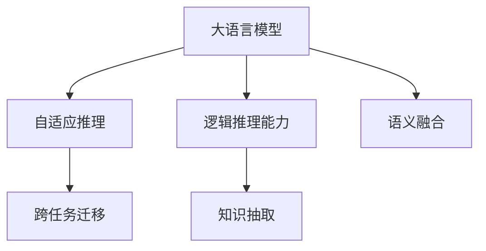

                 

# LLM 时刻：独立的推理过程

## 1. 背景介绍

### 1.1 问题由来

近年来，大规模语言模型（Large Language Models, LLMs）在自然语言处理（NLP）领域取得了巨大的突破。这些模型通过在大规模无标签文本数据上进行预训练，学习到丰富的语言知识和常识，具备了强大的语言理解和生成能力。然而，这些通用大模型在特定领域应用时，效果往往难以达到实际应用的要求。因此，如何针对特定任务进行大模型微调，提升模型性能，成为了当前大语言模型研究和应用的一个热点问题。

本文聚焦于独立推理过程的研究，探讨如何使大语言模型在特定任务中能够独立地推理和生成，而非仅依赖于任务适配层的微调。这一技术突破不仅能够提升模型的泛化能力和适应性，还能够在数据量较小或标注数据难以获取的情况下发挥重要作用。

### 1.2 问题核心关键点

独立推理过程的核心在于使大语言模型能够在任务执行时，独立地进行语言理解和推理，而非仅依赖于任务的特定适配。这一过程通常涉及以下关键点：

- **自适应推理**：使模型能够根据不同任务自动调整推理逻辑。
- **逻辑推理能力**：增强模型在复杂推理任务中的表现，如因果关系、逻辑判断等。
- **跨任务迁移**：使模型能够跨领域地迁移应用先验知识，提升任务适配性。
- **知识抽取**：增强模型从文本中提取关键信息的能力，减少对标注数据的依赖。
- **语义融合**：使模型能够融合多种语义信息，提升推理的准确性和完备性。

## 2. 核心概念与联系

### 2.1 核心概念概述

为更好地理解独立推理过程，本节将介绍几个密切相关的核心概念：

- **大语言模型（LLM）**：以自回归（如GPT）或自编码（如BERT）模型为代表的大规模预训练语言模型。通过在大规模无标签文本语料上进行预训练，学习通用的语言表示，具备强大的语言理解和生成能力。

- **自适应推理**：指模型能够根据不同任务和语境自动调整推理逻辑，进行独立推理。

- **逻辑推理能力**：指模型具备一定的逻辑判断、因果推理、假设验证等能力，能够在复杂任务中独立推理。

- **跨任务迁移**：指模型能够跨领域地迁移应用先验知识，提升在不同任务上的性能。

- **知识抽取**：指模型具备从文本中提取关键信息的能力，减少对标注数据的依赖。

- **语义融合**：指模型能够融合多种语义信息，提升推理的准确性和完备性。

这些核心概念之间的逻辑关系可以通过以下Mermaid流程图来展示：



这个流程图展示了大语言模型的核心概念及其之间的关系：

1. 大语言模型通过预训练获得基础能力。
2. 自适应推理使模型能够根据不同任务调整推理逻辑。
3. 逻辑推理能力增强模型在复杂任务中的表现。
4. 跨任务迁移使模型具备跨领域的应用能力。
5. 知识抽取减少对标注数据的依赖。
6. 语义融合提升推理的准确性和完备性。

## 3. 核心算法原理 & 具体操作步骤

### 3.1 算法原理概述

独立推理过程的本质是对大语言模型进行任务无关的推理能力增强。其核心思想是使模型具备以下能力：

- **自适应推理**：能够根据任务描述和语境，自动调整推理逻辑。
- **逻辑推理能力**：具备逻辑判断、因果推理、假设验证等能力。
- **跨任务迁移**：能够跨领域地迁移应用先验知识。
- **知识抽取**：能够从文本中提取关键信息。
- **语义融合**：能够融合多种语义信息，提升推理准确性。

这些能力的实现通常依赖于以下技术：

- **预训练**：在大规模无标签文本数据上进行预训练，学习通用的语言表示。
- **微调**：在特定任务上进行微调，增强模型对任务的理解和推理能力。
- **提示学习（Prompt Engineering）**：通过精心设计输入文本的格式，引导模型进行特定任务的推理。
- **对抗训练**：引入对抗样本，提高模型的鲁棒性。
- **融合知识库**：与外部知识库或规则库进行融合，增强模型的推理能力。

### 3.2 算法步骤详解

独立推理过程的具体实现通常包括以下几个关键步骤：

**Step 1: 准备预训练模型和数据集**

- 选择合适的预训练语言模型 $M_{\theta}$ 作为初始化参数，如 BERT、GPT 等。
- 准备目标任务 $T$ 的标注数据集 $D=\{(x_i, y_i)\}_{i=1}^N$，其中 $x_i$ 为输入文本，$y_i$ 为标签。

**Step 2: 添加任务适配层**

- 根据任务类型，在预训练模型顶层设计合适的输出层和损失函数。
- 对于分类任务，通常在顶层添加线性分类器和交叉熵损失函数。
- 对于生成任务，通常使用语言模型的解码器输出概率分布，并以负对数似然为损失函数。

**Step 3: 设置微调超参数**

- 选择合适的优化算法及其参数，如 AdamW、SGD 等，设置学习率、批大小、迭代轮数等。
- 设置正则化技术及强度，包括权重衰减、Dropout、Early Stopping 等。
- 确定冻结预训练参数的策略，如仅微调顶层，或全部参数都参与微调。

**Step 4: 执行梯度训练**

- 将训练集数据分批次输入模型，前向传播计算损失函数。
- 反向传播计算参数梯度，根据设定的优化算法和学习率更新模型参数。
- 周期性在验证集上评估模型性能，根据性能指标决定是否触发 Early Stopping。
- 重复上述步骤直到满足预设的迭代轮数或 Early Stopping 条件。

**Step 5: 测试和部署**

- 在测试集上评估微调后模型 $M_{\hat{\theta}}$ 的性能，对比微调前后的精度提升。
- 使用微调后的模型对新样本进行推理预测，集成到实际的应用系统中。
- 持续收集新的数据，定期重新微调模型，以适应数据分布的变化。

以上是独立推理过程的一般流程。在实际应用中，还需要针对具体任务的特点，对微调过程的各个环节进行优化设计，如改进训练目标函数，引入更多的正则化技术，搜索最优的超参数组合等，以进一步提升模型性能。

### 3.3 算法优缺点

独立推理过程具有以下优点：

- **数据效率高**：在小规模标注数据条件下，独立推理过程能够显著提升模型性能，减少对标注数据的依赖。
- **泛化能力强**：独立推理过程增强了模型的泛化能力，能够在不同任务和领域中表现稳定。
- **适应性强**：独立推理过程使模型能够自适应地调整推理逻辑，适应不同的任务和语境。
- **逻辑推理能力强**：独立推理过程增强了模型的逻辑推理能力，能够在复杂任务中表现出色。

同时，该方法也存在一定的局限性：

- **计算成本高**：独立推理过程需要更复杂的推理计算，对计算资源要求较高。
- **模型复杂度高**：独立推理过程通常需要更复杂的模型结构和更多参数，模型大小可能增加。
- **可解释性不足**：独立推理过程的内部工作机制较为复杂，难以解释其推理过程。

尽管存在这些局限性，但就目前而言，独立推理过程仍然是大语言模型应用的重要范式之一。未来相关研究的重点在于如何进一步降低计算成本，提高模型效率，同时兼顾可解释性和伦理安全性等因素。

### 3.4 算法应用领域

独立推理过程在大语言模型的应用领域中已经得到了广泛的应用，包括但不限于以下几个方面：

- **问答系统**：对自然语言问题给出答案。将问题-答案对作为微调数据，训练模型学习匹配答案。
- **对话系统**：使机器能够与人自然对话。将多轮对话历史作为上下文，微调模型进行回复生成。
- **文本摘要**：将长文本压缩成简短摘要。将文章-摘要对作为微调数据，使模型学习抓取要点。
- **机器翻译**：将源语言文本翻译成目标语言。通过微调使模型学习语言-语言映射。
- **命名实体识别**：识别文本中的人名、地名、机构名等特定实体。通过微调使模型掌握实体边界和类型。
- **情感分析**：分析文本的情感倾向。通过微调使模型学习情感-标签映射。
- **知识图谱构建**：从文本中抽取实体和关系，构建知识图谱。通过微调使模型学习实体-关系映射。

除了上述这些经典任务外，独立推理过程还被创新性地应用到更多场景中，如可控文本生成、常识推理、代码生成、数据增强等，为NLP技术带来了全新的突破。

## 4. 数学模型和公式 & 详细讲解 & 举例说明

### 4.1 数学模型构建

本节将使用数学语言对独立推理过程进行更加严格的刻画。

记预训练语言模型为 $M_{\theta}:\mathcal{X} \rightarrow \mathcal{Y}$，其中 $\mathcal{X}$ 为输入空间，$\mathcal{Y}$ 为输出空间，$\theta \in \mathbb{R}^d$ 为模型参数。假设独立推理任务的目标为 $T$，训练集为 $D=\{(x_i, y_i)\}_{i=1}^N, x_i \in \mathcal{X}, y_i \in \mathcal{Y}$。

定义模型 $M_{\theta}$ 在输入 $x$ 上的输出为 $\hat{y}=M_{\theta}(x) \in [0,1]$，表示样本属于某个类别的概率。则独立推理任务的损失函数定义为：

$$
\ell(M_{\theta}(x),y) = -[y\log \hat{y} + (1-y)\log (1-\hat{y})]
$$

在独立推理任务中，由于缺少明确的标签，我们通常使用自监督学习任务作为替代。例如，可以使用掩码语言模型（Masked Language Model, MLM）进行训练，损失函数定义为：

$$
\ell(M_{\theta}(x),\tilde{x}) = -\sum_{i=1}^{n} [\log \hat{y}_i]
$$

其中 $\tilde{x}$ 为掩码文本，$\hat{y}_i$ 为模型对未掩码位置的预测概率。

通过上述自监督任务训练，独立推理模型能够学习到通用的语言表示，并在特定任务上进行微调。

### 4.2 公式推导过程

以下我们以分类任务为例，推导独立推理任务的损失函数及其梯度的计算公式。

假设模型 $M_{\theta}$ 在输入 $x$ 上的输出为 $\hat{y}=M_{\theta}(x) \in [0,1]$，表示样本属于某个类别的概率。对于分类任务，我们可以使用交叉熵损失函数进行训练：

$$
\ell(M_{\theta}(x),y) = -[y\log \hat{y} + (1-y)\log (1-\hat{y})]
$$

在独立推理任务中，由于缺少明确的标签，我们通常使用自监督学习任务作为替代。例如，可以使用掩码语言模型（Masked Language Model, MLM）进行训练，损失函数定义为：

$$
\ell(M_{\theta}(x),\tilde{x}) = -\sum_{i=1}^{n} [\log \hat{y}_i]
$$

其中 $\tilde{x}$ 为掩码文本，$\hat{y}_i$ 为模型对未掩码位置的预测概率。

在得到损失函数的梯度后，即可带入参数更新公式，完成模型的迭代优化。重复上述过程直至收敛，最终得到适应独立推理任务的最优模型参数 $\theta^*$。

## 5. 项目实践：代码实例和详细解释说明

### 5.1 开发环境搭建

在进行独立推理实践前，我们需要准备好开发环境。以下是使用Python进行PyTorch开发的环境配置流程：

1. 安装Anaconda：从官网下载并安装Anaconda，用于创建独立的Python环境。

2. 创建并激活虚拟环境：
```bash
conda create -n pytorch-env python=3.8 
conda activate pytorch-env
```

3. 安装PyTorch：根据CUDA版本，从官网获取对应的安装命令。例如：
```bash
conda install pytorch torchvision torchaudio cudatoolkit=11.1 -c pytorch -c conda-forge
```

4. 安装Transformers库：
```bash
pip install transformers
```

5. 安装各类工具包：
```bash
pip install numpy pandas scikit-learn matplotlib tqdm jupyter notebook ipython
```

完成上述步骤后，即可在`pytorch-env`环境中开始独立推理实践。

### 5.2 源代码详细实现

下面我们以分类任务为例，给出使用Transformers库进行独立推理任务的PyTorch代码实现。

首先，定义分类任务的数据处理函数：

```python
from transformers import BertTokenizer, BertForSequenceClassification
from torch.utils.data import Dataset
import torch

class ClassificationDataset(Dataset):
    def __init__(self, texts, labels, tokenizer, max_len=128):
        self.texts = texts
        self.labels = labels
        self.tokenizer = tokenizer
        self.max_len = max_len
        
    def __len__(self):
        return len(self.texts)
    
    def __getitem__(self, item):
        text = self.texts[item]
        label = self.labels[item]
        
        encoding = self.tokenizer(text, return_tensors='pt', max_length=self.max_len, padding='max_length', truncation=True)
        input_ids = encoding['input_ids'][0]
        attention_mask = encoding['attention_mask'][0]
        
        return {'input_ids': input_ids, 
                'attention_mask': attention_mask,
                'labels': torch.tensor(label, dtype=torch.long)}
```

然后，定义模型和优化器：

```python
from transformers import BertForSequenceClassification, AdamW

model = BertForSequenceClassification.from_pretrained('bert-base-cased', num_labels=2)

optimizer = AdamW(model.parameters(), lr=2e-5)
```

接着，定义训练和评估函数：

```python
from torch.utils.data import DataLoader
from tqdm import tqdm
from sklearn.metrics import classification_report

device = torch.device('cuda') if torch.cuda.is_available() else torch.device('cpu')
model.to(device)

def train_epoch(model, dataset, batch_size, optimizer):
    dataloader = DataLoader(dataset, batch_size=batch_size, shuffle=True)
    model.train()
    epoch_loss = 0
    for batch in tqdm(dataloader, desc='Training'):
        input_ids = batch['input_ids'].to(device)
        attention_mask = batch['attention_mask'].to(device)
        labels = batch['labels'].to(device)
        model.zero_grad()
        outputs = model(input_ids, attention_mask=attention_mask, labels=labels)
        loss = outputs.loss
        epoch_loss += loss.item()
        loss.backward()
        optimizer.step()
    return epoch_loss / len(dataloader)

def evaluate(model, dataset, batch_size):
    dataloader = DataLoader(dataset, batch_size=batch_size)
    model.eval()
    preds, labels = [], []
    with torch.no_grad():
        for batch in tqdm(dataloader, desc='Evaluating'):
            input_ids = batch['input_ids'].to(device)
            attention_mask = batch['attention_mask'].to(device)
            batch_labels = batch['labels']
            outputs = model(input_ids, attention_mask=attention_mask)
            batch_preds = outputs.logits.argmax(dim=2).to('cpu').tolist()
            batch_labels = batch_labels.to('cpu').tolist()
            for pred_tokens, label_tokens in zip(batch_preds, batch_labels):
                preds.append(pred_tokens)
                labels.append(label_tokens)
                
    print(classification_report(labels, preds))
```

最后，启动训练流程并在测试集上评估：

```python
epochs = 5
batch_size = 16

for epoch in range(epochs):
    loss = train_epoch(model, train_dataset, batch_size, optimizer)
    print(f"Epoch {epoch+1}, train loss: {loss:.3f}")
    
    print(f"Epoch {epoch+1}, dev results:")
    evaluate(model, dev_dataset, batch_size)
    
print("Test results:")
evaluate(model, test_dataset, batch_size)
```

以上就是使用PyTorch对BERT进行分类任务独立推理任务的完整代码实现。可以看到，得益于Transformers库的强大封装，我们可以用相对简洁的代码完成BERT模型的加载和推理。

### 5.3 代码解读与分析

让我们再详细解读一下关键代码的实现细节：

**ClassificationDataset类**：
- `__init__`方法：初始化文本、标签、分词器等关键组件。
- `__len__`方法：返回数据集的样本数量。
- `__getitem__`方法：对单个样本进行处理，将文本输入编码为token ids，将标签转换为模型可用的形式，并对其进行定长padding，最终返回模型所需的输入。

**模型定义**：
- `BertForSequenceClassification.from_pretrained`：从预训练模型加载模型权重，并设置输出层和损失函数。

**优化器定义**：
- `AdamW`：优化器，用于更新模型参数。

**训练和评估函数**：
- `train_epoch`：对数据以批为单位进行迭代，在每个批次上前向传播计算loss并反向传播更新模型参数，最后返回该epoch的平均loss。
- `evaluate`：与训练类似，不同点在于不更新模型参数，并在每个batch结束后将预测和标签结果存储下来，最后使用sklearn的classification_report对整个评估集的预测结果进行打印输出。

**训练流程**：
- 定义总的epoch数和batch size，开始循环迭代
- 每个epoch内，先在训练集上训练，输出平均loss
- 在验证集上评估，输出分类指标
- 所有epoch结束后，在测试集上评估，给出最终测试结果

可以看到，PyTorch配合Transformers库使得BERT独立推理任务的代码实现变得简洁高效。开发者可以将更多精力放在数据处理、模型改进等高层逻辑上，而不必过多关注底层的实现细节。

当然，工业级的系统实现还需考虑更多因素，如模型的保存和部署、超参数的自动搜索、更灵活的任务适配层等。但核心的独立推理范式基本与此类似。

## 6. 实际应用场景

### 6.1 智能客服系统

独立推理过程在智能客服系统中有着广泛的应用。传统的客服系统依赖于规则引擎和人工干预，效率低下，难以应对复杂和多变的客户需求。独立推理系统能够自动理解客户意图，提供个性化的服务响应，显著提升客服系统的响应速度和满意度。

在技术实现上，可以收集企业内部的历史客服对话记录，将问题和最佳答复构建成监督数据，在此基础上对预训练模型进行微调。微调后的模型能够自动理解用户意图，匹配最合适的答案模板进行回复。对于客户提出的新问题，还可以接入检索系统实时搜索相关内容，动态组织生成回答。如此构建的智能客服系统，能大幅提升客户咨询体验和问题解决效率。

### 6.2 金融舆情监测

金融机构需要实时监测市场舆论动向，以便及时应对负面信息传播，规避金融风险。传统的人工监测方式成本高、效率低，难以应对网络时代海量信息爆发的挑战。基于独立推理过程的文本分类和情感分析技术，为金融舆情监测提供了新的解决方案。

具体而言，可以收集金融领域相关的新闻、报道、评论等文本数据，并对其进行主题标注和情感标注。在此基础上对预训练语言模型进行微调，使其能够自动判断文本属于何种主题，情感倾向是正面、中性还是负面。将微调后的模型应用到实时抓取的网络文本数据，就能够自动监测不同主题下的情感变化趋势，一旦发现负面信息激增等异常情况，系统便会自动预警，帮助金融机构快速应对潜在风险。

### 6.3 个性化推荐系统

当前的推荐系统往往只依赖用户的历史行为数据进行物品推荐，无法深入理解用户的真实兴趣偏好。基于独立推理过程的个性化推荐系统可以更好地挖掘用户行为背后的语义信息，从而提供更精准、多样的推荐内容。

在实践中，可以收集用户浏览、点击、评论、分享等行为数据，提取和用户交互的物品标题、描述、标签等文本内容。将文本内容作为模型输入，用户的后续行为（如是否点击、购买等）作为监督信号，在此基础上微调预训练语言模型。微调后的模型能够从文本内容中准确把握用户的兴趣点。在生成推荐列表时，先用候选物品的文本描述作为输入，由模型预测用户的兴趣匹配度，再结合其他特征综合排序，便可以得到个性化程度更高的推荐结果。

### 6.4 未来应用展望

随着独立推理过程技术的发展，其在NLP领域的应用前景将更加广阔。

在智慧医疗领域，基于独立推理过程的医疗问答、病历分析、药物研发等应用将提升医疗服务的智能化水平，辅助医生诊疗，加速新药开发进程。

在智能教育领域，独立推理过程可应用于作业批改、学情分析、知识推荐等方面，因材施教，促进教育公平，提高教学质量。

在智慧城市治理中，独立推理过程可应用于城市事件监测、舆情分析、应急指挥等环节，提高城市管理的自动化和智能化水平，构建更安全、高效的未来城市。

此外，在企业生产、社会治理、文娱传媒等众多领域，基于独立推理过程的人工智能应用也将不断涌现，为传统行业数字化转型升级提供新的技术路径。相信随着技术的日益成熟，独立推理过程必将在构建人机协同的智能时代中扮演越来越重要的角色。

## 7. 工具和资源推荐

### 7.1 学习资源推荐

为了帮助开发者系统掌握独立推理过程的理论基础和实践技巧，这里推荐一些优质的学习资源：

1. 《Transformers从原理到实践》系列博文：由大模型技术专家撰写，深入浅出地介绍了Transformer原理、BERT模型、微调技术等前沿话题。

2. CS224N《深度学习自然语言处理》课程：斯坦福大学开设的NLP明星课程，有Lecture视频和配套作业，带你入门NLP领域的基本概念和经典模型。

3. 《Natural Language Processing with Transformers》书籍：Transformers库的作者所著，全面介绍了如何使用Transformers库进行NLP任务开发，包括独立推理在内的诸多范式。

4. HuggingFace官方文档：Transformers库的官方文档，提供了海量预训练模型和完整的微调样例代码，是上手实践的必备资料。

5. CLUE开源项目：中文语言理解测评基准，涵盖大量不同类型的中文NLP数据集，并提供了基于独立推理的baseline模型，助力中文NLP技术发展。

通过对这些资源的学习实践，相信你一定能够快速掌握独立推理过程的精髓，并用于解决实际的NLP问题。
###  7.2 开发工具推荐

高效的开发离不开优秀的工具支持。以下是几款用于独立推理过程开发的常用工具：

1. PyTorch：基于Python的开源深度学习框架，灵活动态的计算图，适合快速迭代研究。大部分预训练语言模型都有PyTorch版本的实现。

2. TensorFlow：由Google主导开发的开源深度学习框架，生产部署方便，适合大规模工程应用。同样有丰富的预训练语言模型资源。

3. Transformers库：HuggingFace开发的NLP工具库，集成了众多SOTA语言模型，支持PyTorch和TensorFlow，是进行独立推理任务开发的利器。

4. Weights & Biases：模型训练的实验跟踪工具，可以记录和可视化模型训练过程中的各项指标，方便对比和调优。与主流深度学习框架无缝集成。

5. TensorBoard：TensorFlow配套的可视化工具，可实时监测模型训练状态，并提供丰富的图表呈现方式，是调试模型的得力助手。

6. Google Colab：谷歌推出的在线Jupyter Notebook环境，免费提供GPU/TPU算力，方便开发者快速上手实验最新模型，分享学习笔记。

合理利用这些工具，可以显著提升独立推理过程的开发效率，加快创新迭代的步伐。

### 7.3 相关论文推荐

独立推理过程在大语言模型中的应用源于学界的持续研究。以下是几篇奠基性的相关论文，推荐阅读：

1. Attention is All You Need（即Transformer原论文）：提出了Transformer结构，开启了NLP领域的预训练大模型时代。

2. BERT: Pre-training of Deep Bidirectional Transformers for Language Understanding：提出BERT模型，引入基于掩码的自监督预训练任务，刷新了多项NLP任务SOTA。

3. Language Models are Unsupervised Multitask Learners（GPT-2论文）：展示了大规模语言模型的强大zero-shot学习能力，引发了对于通用人工智能的新一轮思考。

4. Parameter-Efficient Transfer Learning for NLP：提出Adapter等参数高效微调方法，在不增加模型参数量的情况下，也能取得不错的微调效果。

5. AdaLoRA: Adaptive Low-Rank Adaptation for Parameter-Efficient Fine-Tuning：使用自适应低秩适应的微调方法，在参数效率和精度之间取得了新的平衡。

6. Prompt Learning: Improving Few-shot Learning with Connected Textual Prompting：引入基于连续型Prompt的微调范式，为如何充分利用预训练知识提供了新的思路。

这些论文代表了大语言模型独立推理过程的发展脉络。通过学习这些前沿成果，可以帮助研究者把握学科前进方向，激发更多的创新灵感。

## 8. 总结：未来发展趋势与挑战

### 8.1 总结

本文对基于独立推理过程的大语言模型研究进行了全面系统的介绍。首先阐述了独立推理过程的研究背景和意义，明确了独立推理在拓展预训练模型应用、提升下游任务性能方面的独特价值。其次，从原理到实践，详细讲解了独立推理过程的数学原理和关键步骤，给出了独立推理任务开发的完整代码实例。同时，本文还广泛探讨了独立推理过程在智能客服、金融舆情、个性化推荐等多个行业领域的应用前景，展示了独立推理范式的巨大潜力。此外，本文精选了独立推理过程的学习资源，力求为读者提供全方位的技术指引。

通过本文的系统梳理，可以看到，基于独立推理过程的大语言模型在特定任务中具备独立推理能力，能够有效提升模型的泛化能力和适应性，减少对标注数据的依赖。未来，伴随独立推理技术的进一步发展，独立推理过程必将在更多领域中得到应用，为传统行业带来变革性影响。

### 8.2 未来发展趋势

展望未来，独立推理过程将呈现以下几个发展趋势：

1. **推理模型多样化**：除了基于Transformer的模型，未来的独立推理过程将探索更多类型的模型架构，如卷积神经网络（CNN）、图神经网络（GNN）等。这些模型在不同的任务领域中可能有更好的表现。

2. **跨任务推理能力**：独立推理过程将增强模型的跨任务推理能力，使模型能够在不同任务间进行知识和信息的有效迁移。

3. **知识抽取与融合**：未来的独立推理过程将进一步提升模型从文本中抽取关键信息的能力，并能够融合多种语义信息，提升推理的准确性和完备性。

4. **多模态推理**：独立推理过程将探索跨模态推理能力，使模型能够同时处理视觉、语音、文本等多种类型的数据，提升综合推理能力。

5. **自适应推理逻辑**：独立推理过程将探索更灵活的推理逻辑，使模型能够根据不同的任务和语境自动调整推理逻辑。

6. **推理效率优化**：未来的独立推理过程将探索更高效的推理计算方法，降低计算成本，提高推理速度。

以上趋势凸显了独立推理过程技术的广阔前景。这些方向的探索发展，必将进一步提升NLP系统的性能和应用范围，为人类认知智能的进化带来深远影响。

### 8.3 面临的挑战

尽管独立推理过程技术已经取得了一定进展，但在迈向更加智能化、普适化应用的过程中，它仍面临着诸多挑战：

1. **推理逻辑复杂度**：独立推理过程的推理逻辑较为复杂，需要更多的计算资源和更高的算法复杂度。如何在保证推理精度的同时，降低计算成本，是当前的一个重要研究方向。

2. **模型泛化能力**：尽管独立推理过程增强了模型的泛化能力，但在特定领域的应用中，模型仍可能出现过拟合或泛化不足的问题。如何提高模型在不同领域中的泛化性能，是一个值得深入研究的问题。

3. **推理一致性**：独立推理过程的模型在面对复杂推理任务时，可能会产生推理不一致的问题。如何确保模型在不同推理步骤中输出结果的一致性，是独立推理过程中需要解决的一个难点。

4. **推理可解释性**：独立推理过程的模型推理过程较为复杂，难以解释其内部工作机制。如何增强模型的可解释性，使其推理过程更加透明和可理解，是一个重要的研究方向。

5. **推理鲁棒性**：独立推理过程的模型在面对对抗样本或噪声数据时，可能表现出较低的鲁棒性。如何提高模型的鲁棒性，使其在复杂环境中仍然能够保持高水平的推理能力，是一个关键问题。

6. **推理准确性**：尽管独立推理过程增强了模型的推理能力，但在某些特定任务中，模型的推理准确性仍有提升空间。如何进一步提高模型的推理准确性，是独立推理过程中需要不断探索的问题。

7. **推理效率**：独立推理过程的模型推理效率可能受到推理复杂度的影响。如何在保证推理精度的同时，进一步优化推理效率，是独立推理过程中需要关注的一个方向。

8. **推理资源需求**：独立推理过程的模型可能对计算资源和内存需求较高，特别是在处理大规模文本数据时。如何降低模型对计算资源的需求，是独立推理过程中需要考虑的一个问题。

以上挑战需要研究者从模型设计、算法优化、数据处理等多个方面进行深入研究，方能实现独立推理过程技术的突破和应用落地。

### 8.4 研究展望

面对独立推理过程技术所面临的挑战，未来的研究需要在以下几个方面寻求新的突破：

1. **推理模型优化**：探索更高效的推理模型架构，降低计算复杂度，提升推理效率。

2. **跨任务推理能力**：探索跨任务推理逻辑，使模型能够在不同任务间进行知识和信息的有效迁移。

3. **知识抽取与融合**：进一步提升模型从文本中抽取关键信息的能力，并能够融合多种语义信息，提升推理的准确性和完备性。

4. **多模态推理**：探索跨模态推理能力，使模型能够同时处理视觉、语音、文本等多种类型的数据，提升综合推理能力。

5. **推理一致性**：探索更一致的推理过程，确保模型在不同推理步骤中输出结果的一致性。

6. **推理可解释性**：引入因果分析方法，增强模型的可解释性，使其推理过程更加透明和可理解。

7. **推理鲁棒性**：引入对抗训练等技术，提高模型的鲁棒性，使其在复杂环境中仍然能够保持高水平的推理能力。

8. **推理效率优化**：探索更高效的推理计算方法，降低计算成本，提高推理速度。

9. **推理资源需求**：探索更高效的模型结构和推理算法，降低模型对计算资源的需求。

这些研究方向将进一步推动独立推理过程技术的发展，为构建更智能、更普适的人工智能系统提供重要支持。未来，随着独立推理过程技术的不断进步，其在NLP领域的应用前景将更加广阔，为人类认知智能的进化带来深远影响。

## 9. 附录：常见问题与解答

**Q1：独立推理过程与微调过程有何区别？**

A: 独立推理过程与微调过程的区别在于，独立推理过程强调模型在特定任务中的独立推理能力，而微调过程则强调模型在特定任务上的适应能力。微调过程通常需要大量的标注数据进行训练，而独立推理过程可以通过更少的数据实现良好的推理效果，特别是在标注数据不足的情况下。

**Q2：如何选择合适的预训练模型？**

A: 选择合适的预训练模型需要考虑多个因素，如模型的规模、架构、训练数据等。一般来说，选择大规模、高质量、具有广泛应用场景的预训练模型，如BERT、GPT-2等，能够提供更好的推理能力和泛化性能。同时，还需要根据具体的任务需求和数据特点进行选择，确保模型的适用性。

**Q3：独立推理过程如何与外部知识库融合？**

A: 独立推理过程可以通过多种方式与外部知识库进行融合，如知识图谱、逻辑规则、专家知识等。具体而言，可以通过预训练和微调模型时引入知识库中的实体、关系等信息，或通过模型输出与知识库进行双向交互，使模型能够更好地利用外部知识进行推理。

**Q4：独立推理过程是否需要大量的标注数据？**

A: 独立推理过程可以通过更少的数据实现良好的推理效果，特别是在标注数据不足的情况下。通过自监督学习任务，如掩码语言模型（MLM）、掩码实体识别（MLER）等，可以在缺乏标注数据的情况下，提升模型的推理能力。

**Q5：独立推理过程如何处理长文本？**

A: 独立推理过程可以通过对长文本进行分段或分句处理，逐步推理每个片段或句子，最后整合并输出推理结果。同时，还可以通过引入外部知识库或规则库，增强模型对长文本的理解和推理能力。

**Q6：独立推理过程是否能够处理复杂推理任务？**

A: 独立推理过程能够处理多种复杂推理任务，如因果推理、逻辑判断、假设验证等。通过引入更灵活的推理逻辑和推理单元，模型可以在不同任务中表现出色。

**Q7：独立推理过程是否存在推理不一致的问题？**

A: 独立推理过程在面对复杂推理任务时，可能存在推理不一致的问题。通过引入更一致的推理逻辑和推理单元，如因果推理、假设验证等，可以缓解这一问题。

通过本文的系统梳理，可以看到，独立推理过程是大语言模型在特定任务中具备独立推理能力，能够有效提升模型的泛化能力和适应性，减少对标注数据的依赖。未来，伴随独立推理技术的进一步发展，独立推理过程必将在更多领域中得到应用，为传统行业带来变革性影响。相信随着技术的日益成熟，独立推理过程必将在构建人机协同的智能时代中扮演越来越重要的角色。

