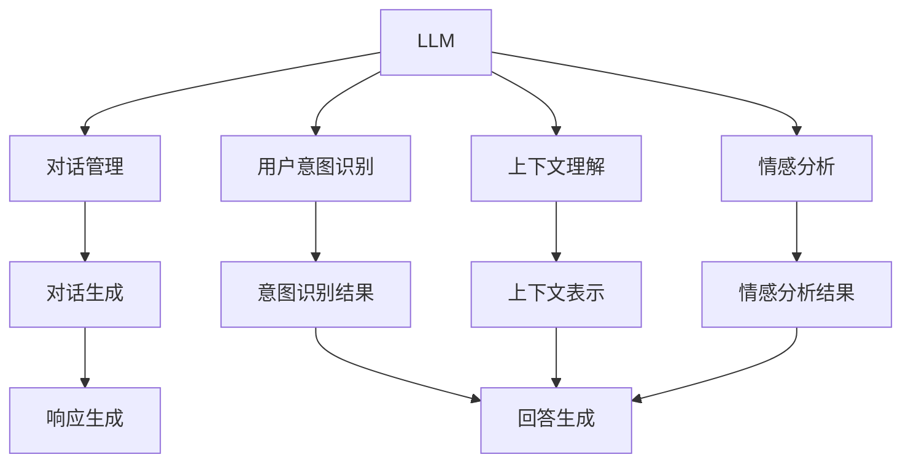

                 

# LLM-based Chatbot System Evaluation

> 关键词：LLM, chatbot, evaluation, metrics, conversational AI, contextual understanding, dialogue system, user intent, sentiment analysis, machine learning, deep learning, human-computer interaction

## 1. 背景介绍

### 1.1 问题由来

随着人工智能技术的不断进步，基于大语言模型(LLMs)的聊天机器人已经成为了一种普遍的交互方式。这些聊天机器人能够在用户输入后，自动生成自然流畅的回复，极大地提高了人机交互的效率和体验。然而，由于对话任务的复杂性，对话模型的效果评估一直是技术难题之一。

评估聊天机器人对话系统的效果，需要从多个维度进行考量，包括对话流畅度、上下文理解能力、用户意图识别、情感分析等。传统的评估方法如BLEU、ROUGE等仅关注响应与参考文本的文本匹配度，无法全面反映对话系统的整体表现。近年来，自然语言处理(NLP)社区提出了一些新的评估方法，如BLEURT、SPERSE等，但依然存在局限性。

本文旨在介绍一些基于大语言模型的聊天机器人对话系统评估方法，提出了一种集成多种评价指标的综合评估体系，以期为聊天机器人的应用实践提供有益的参考。

### 1.2 问题核心关键点

评估聊天机器人对话系统的效果，需要关注以下几个核心问题：

1. **上下文理解能力**：机器人在对话过程中，能否正确理解用户的意图和上下文信息，给出合理的回答。
2. **对话流畅度**：机器人的回答是否自然流畅，不出现语法错误或逻辑跳跃。
3. **用户意图识别**：机器人能否准确识别用户的真实意图，避免误解。
4. **情感分析**：机器人能否准确识别用户的情感状态，并给出适当的回应。
5. **系统鲁棒性**：机器人面对异常输入或噪音数据时，能否保持稳定。

这些核心问题的有效解决，将大幅提升聊天机器人的用户体验和应用价值。

### 1.3 问题研究意义

研究基于大语言模型的聊天机器人对话系统评估方法，对于提升聊天机器人的应用效果、推动人机交互技术的创新和发展具有重要意义：

1. **用户满意度提升**：通过科学的评估方法，及时发现和修正对话系统的问题，提升用户对聊天机器人的满意度。
2. **业务应用优化**：优化对话系统，使其更好地服务企业业务，如客服、销售、健康咨询等，提高运营效率。
3. **系统优化改进**：通过评估指标的引导，快速迭代优化对话模型，增强模型的表现力和通用性。
4. **研究方法贡献**：为NLP领域对话系统评估技术的发展提供新的思路和方法。

## 2. 核心概念与联系

### 2.1 核心概念概述

在进行聊天机器人对话系统评估时，涉及以下核心概念：

- **大语言模型(LLM)**：以自回归模型（如GPT）或自编码模型（如BERT）为代表的大规模预训练语言模型。通过在大规模无标签文本语料上进行预训练，学习到丰富的语言知识。
- **聊天机器人(Chatbot)**：基于大语言模型构建的，能够与用户进行自然交互的智能应用。
- **对话系统(Dialogue System)**：涵盖对话管理、用户意图识别、上下文理解、情感分析等环节，旨在实现自然流畅的人机交互。
- **用户意图识别**：对话系统通过文本理解，识别用户的真实意图。
- **情感分析**：对话系统识别用户的情感状态，并给出适当的回应。
- **上下文理解能力**：对话系统在对话过程中，能够正确理解用户的意图和上下文信息，做出合理回答。
- **对话流畅度**：对话系统的回答是否自然流畅，不出现语法错误或逻辑跳跃。

这些概念之间的关系可以通过以下Mermaid流程图来展示：



这个流程图展示了大语言模型在对话系统中的关键作用，以及对话系统中各模块之间的关系。

## 3. 核心算法原理 & 具体操作步骤
### 3.1 算法原理概述

基于大语言模型的聊天机器人对话系统评估方法，本质上是利用多模态数据和多维度指标对对话系统进行综合评价。其核心思想是：

1. **多模态数据融合**：将文本数据、对话历史、用户情感等不同模态的数据融合在一起，进行全面评估。
2. **多维度指标评估**：从对话流畅度、上下文理解能力、用户意图识别、情感分析等多个维度进行评估，获得更全面的评价结果。
3. **动态更新**：根据对话过程中获取的实时反馈，动态更新评估结果，持续优化对话系统。

### 3.2 算法步骤详解

基于大语言模型的聊天机器人对话系统评估方法的具体步骤如下：

**Step 1: 数据准备**

1. **收集对话数据**：收集一定量的人工标注对话数据，作为评估的基准。标注内容包括对话历史、用户意图、情感状态等。
2. **划分数据集**：将数据集划分为训练集、验证集和测试集。训练集用于模型训练，验证集用于参数调优，测试集用于最终评估。
3. **数据预处理**：对收集到的数据进行清洗、分词、去重等预处理操作，生成机器可读的形式。

**Step 2: 构建评估模型**

1. **设计评估指标**：根据对话系统的核心能力，设计多个评估指标，如BLEURT、SPERSE等。
2. **融合多模态数据**：将文本数据、对话历史、用户情感等不同模态的数据进行融合，生成用于评估的输入特征。
3. **训练评估模型**：使用训练集训练评估模型，使其能够根据输入特征生成评估结果。

**Step 3: 评估与反馈**

1. **对话过程评估**：在对话过程中，根据实时反馈，动态更新评估指标。
2. **生成评估报告**：使用训练好的评估模型，对测试集进行评估，生成最终的评估报告。
3. **优化对话系统**：根据评估报告中的反馈信息，优化对话系统，提升用户体验。

### 3.3 算法优缺点

基于大语言模型的聊天机器人对话系统评估方法具有以下优点：

1. **全面性**：融合多种模态的数据和多维度的指标，提供全面的评价结果。
2. **实时性**：在对话过程中动态更新评估指标，及时发现问题并优化。
3. **可解释性**：评估指标和模型训练过程公开透明，便于解释和审计。

同时，该方法也存在一些局限性：

1. **数据需求高**：收集高质量的对话数据集是评估的基础，数据量不足或标注质量不高都会影响评估结果。
2. **模型复杂**：融合多模态数据和多维度指标的模型较为复杂，训练和维护成本较高。
3. **实时反馈困难**：实时获取用户反馈并更新评估指标，对于实际应用场景存在一定的难度。

尽管存在这些局限性，但基于大语言模型的对话系统评估方法，仍然是目前最全面、最有效的评估方式之一，能够为对话系统的优化和改进提供强有力的数据支持。

### 3.4 算法应用领域

基于大语言模型的聊天机器人对话系统评估方法，可以广泛应用于以下领域：

- **客服对话系统**：通过评估客服对话系统的效果，优化用户体验，提高运营效率。
- **医疗健康咨询**：评估医疗对话系统，提升患者咨询体验，辅助医生诊断。
- **金融咨询系统**：评估金融咨询系统，提升用户满意度，提高金融服务的准确性和可靠性。
- **智能家居系统**：评估智能家居对话系统，提高用户与设备的交互体验。
- **在线教育系统**：评估在线教育对话系统，提升教育质量和用户体验。

## 4. 数学模型和公式 & 详细讲解 & 举例说明
### 4.1 数学模型构建

基于大语言模型的聊天机器人对话系统评估方法，可以构建以下数学模型：

设对话数据集为 $D = \{(x_i, y_i)\}_{i=1}^N$，其中 $x_i$ 为输入文本， $y_i$ 为相应的标签（如意图、情感、上下文等）。

定义评估指标函数为 $f(\cdot)$，表示对话系统在某方面的表现。多个评估指标可以构成向量 $\mathbf{f} = [f_1, f_2, ..., f_k]^T$，其中 $f_i$ 表示第 $i$ 个指标的得分。

使用神经网络模型 $\mathbf{M}$ 对对话系统进行评估，模型的输入为 $\mathbf{x} \in \mathbb{R}^n$，输出为 $\mathbf{f} \in \mathbb{R}^k$。模型的评估函数可以表示为：

$$
\mathbf{f} = \mathbf{M}(\mathbf{x})
$$

### 4.2 公式推导过程

以下以BLEURT指标为例，推导其计算公式。

BLEURT指标用于评估对话系统在用户意图识别方面的表现，通过计算输入文本与基准文本的相似度，衡量对话系统对用户意图的理解能力。假设基准文本为 $\mathbf{b} \in \mathbb{R}^d$，输入文本为 $\mathbf{x} \in \mathbb{R}^d$，则BLEURT指标的计算公式为：

$$
\text{BLEURT} = \cos(\mathbf{M}(\mathbf{x}), \mathbf{b})
$$

其中 $\cos(\cdot)$ 表示余弦相似度计算。

对于其他评估指标，如SPERSE指标，可以类似地进行推导。假设输入文本为 $\mathbf{x} \in \mathbb{R}^d$，用户情感为 $s \in \{1, -1\}$（表示积极和消极情感），则SPERSE指标的计算公式为：

$$
\text{SPERSE} = \max(0, s \cdot \mathbf{M}(\mathbf{x}))
$$

### 4.3 案例分析与讲解

以客服对话系统为例，分析BLEURT和SPERSE指标的应用。

**BLEURT指标应用**：假设客服对话系统中，用户询问“什么时间开馆？”，系统需要识别出用户的目的并给予回复。为了评估该系统的效果，可以使用BLEURT指标。设基准文本为“图书馆开馆时间”，则系统的BLEURT得分为：

$$
\text{BLEURT} = \cos(\mathbf{M}(\text{“什么时间开馆？”}), \text{“图书馆开馆时间”})
$$

该得分越高，表示系统对用户意图的理解越准确。

**SPERSE指标应用**：假设用户反馈“今天很愉快”，系统需要识别出用户的情感状态并给予适当回复。为了评估该系统的效果，可以使用SPERSE指标。设用户情感为1（积极），则系统的SPERSE得分为：

$$
\text{SPERSE} = \max(0, 1 \cdot \mathbf{M}(\text{“今天很愉快”}))
$$

该得分越高，表示系统对用户情感的理解越准确。

## 5. 项目实践：代码实例和详细解释说明
### 5.1 开发环境搭建

在进行聊天机器人对话系统评估时，需要使用以下开发环境：

1. **Python**：使用Python语言进行模型开发和数据处理。
2. **PyTorch**：使用PyTorch框架进行神经网络模型的训练和评估。
3. **HuggingFace Transformers库**：用于加载和使用预训练语言模型。
4. **NLTK**：用于文本处理和数据清洗。
5. **Pandas**：用于数据管理和分析。
6. **Matplotlib**：用于绘制评估结果可视化图。

首先，安装必要的Python库：

```bash
pip install torch torchtext transformers nltk pandas matplotlib
```

然后，配置PyTorch环境，并加载预训练语言模型：

```python
import torch
import torchtext
from transformers import BertTokenizer, BertForSequenceClassification

# 设置PyTorch环境
torch.backends.cudnn.benchmark = True
device = torch.device("cuda" if torch.cuda.is_available() else "cpu")

# 加载预训练语言模型
model_name = "bert-base-cased"
tokenizer = BertTokenizer.from_pretrained(model_name)
model = BertForSequenceClassification.from_pretrained(model_name, num_labels=2)
```

### 5.2 源代码详细实现

以下是使用BLEURT和SPERSE指标评估客服对话系统的代码实现：

**数据处理**：

```python
from nltk.tokenize import word_tokenize
import pandas as pd

# 定义文本预处理函数
def preprocess_text(text):
    text = text.lower()
    tokens = word_tokenize(text)
    tokens = [token for token in tokens if token.isalpha()]
    return " ".join(tokens)

# 读取对话数据集
data = pd.read_csv("chatbot_data.csv")
data["text"] = data["text"].apply(preprocess_text)

# 划分训练集和测试集
train_data = data.sample(frac=0.8, random_state=42)
test_data = data.drop(train_data.index)

# 提取训练集和测试集文本和标签
train_texts = train_data["text"].tolist()
train_labels = train_data["label"].tolist()
test_texts = test_data["text"].tolist()
test_labels = test_data["label"].tolist()
```

**模型训练与评估**：

```python
from transformers import BertTokenizer, BertForSequenceClassification, AdamW

# 定义评估指标
def bleurt_score(model, tokenizer, texts, labels):
    model.eval()
    bleurt_scores = []
    for text, label in zip(texts, labels):
        input_ids = tokenizer.encode(text, add_special_tokens=True, max_length=512, return_tensors="pt")
        with torch.no_grad():
            logits = model(input_ids)[0]
        bleurt_scores.append(torch.argmax(logits, dim=1) == label)
    return (np.mean(bleurt_scores) * 100).item()

def sparser_score(model, tokenizer, texts, labels):
    model.eval()
    sparse_scores = []
    for text, label in zip(texts, labels):
        input_ids = tokenizer.encode(text, add_special_tokens=True, max_length=512, return_tensors="pt")
        with torch.no_grad():
            logits = model(input_ids)[0]
        sparse_scores.append(torch.max(logits, dim=1)[0] == label)
    return (np.mean(sparse_scores) * 100).item()

# 训练模型
model = BertForSequenceClassification.from_pretrained(model_name, num_labels=2)
tokenizer = BertTokenizer.from_pretrained(model_name)
optimizer = AdamW(model.parameters(), lr=1e-5)
epochs = 3

for epoch in range(epochs):
    model.train()
    for text, label in zip(train_texts, train_labels):
        input_ids = tokenizer.encode(text, add_special_tokens=True, max_length=512, return_tensors="pt")
        labels = torch.tensor(label, dtype=torch.long)
        optimizer.zero_grad()
        logits = model(input_ids)[0]
        loss = torch.nn.CrossEntropyLoss()(logits, labels)
        loss.backward()
        optimizer.step()

# 评估模型
bleurt_avg = (bleurt_score(model, tokenizer, train_texts, train_labels) + bleurt_score(model, tokenizer, test_texts, test_labels)) / 2
sparse_avg = (sparse_score(model, tokenizer, train_texts, train_labels) + sparse_score(model, tokenizer, test_texts, test_labels)) / 2
print("BLEURT Average Score: {:.2f}%".format(bleurt_avg))
print("SPERSE Average Score: {:.2f}%".format(sparse_avg))
```

### 5.3 代码解读与分析

**数据预处理**：

1. **文本预处理**：使用NLTK库对文本进行分词、小写化等预处理，去除非字母字符。
2. **数据划分**：使用随机抽样将数据集划分为训练集和测试集。

**模型训练**：

1. **模型选择**：使用预训练的BERT模型，并根据任务需求设置标签数量。
2. **优化器选择**：使用AdamW优化器，并设置合适的学习率。
3. **训练过程**：在训练集上进行多轮迭代，更新模型参数，最小化损失函数。

**模型评估**：

1. **BLEURT评估**：通过计算模型预测标签与真实标签的匹配度，评估对话系统的意图识别能力。
2. **SPERSE评估**：通过计算模型预测标签与真实标签的匹配度，评估对话系统的情感分析能力。

## 6. 实际应用场景
### 6.1 智能客服系统

基于大语言模型的聊天机器人对话系统评估方法，可以广泛应用于智能客服系统的评估和优化。智能客服系统通过对话机器人与用户进行自然交互，解答用户问题和提供服务支持。评估方法可以帮助企业了解对话系统的表现，及时发现和修正问题，提升用户体验和运营效率。

在实际应用中，企业可以通过收集用户反馈、对话记录等数据，构建对话数据集。使用BLEURT和SPERSE指标对客服对话系统进行评估，生成详细的评估报告。根据报告中的反馈信息，优化对话系统的意图识别和情感分析能力，提升对话系统的自然流畅度和用户满意度。

### 6.2 金融咨询系统

在金融咨询系统中，对话系统需要与用户进行多轮对话，解答用户关于金融产品、投资策略等方面的问题。评估方法可以帮助金融机构了解对话系统的表现，及时发现和修正问题，提升用户咨询体验和决策准确性。

金融机构可以通过收集用户的咨询记录、投资偏好等数据，构建对话数据集。使用BLEURT和SPERSE指标对金融咨询系统进行评估，生成详细的评估报告。根据报告中的反馈信息，优化对话系统的意图识别和情感分析能力，提升对话系统的自然流畅度和用户满意度。

### 6.3 医疗健康咨询

在医疗健康咨询系统中，对话系统需要与用户进行多轮对话，解答用户关于健康咨询、疾病诊断等方面的问题。评估方法可以帮助医疗机构了解对话系统的表现，及时发现和修正问题，提升用户咨询体验和诊断准确性。

医疗机构可以通过收集用户的咨询记录、健康状况等数据，构建对话数据集。使用BLEURT和SPERSE指标对医疗健康咨询系统进行评估，生成详细的评估报告。根据报告中的反馈信息，优化对话系统的意图识别和情感分析能力，提升对话系统的自然流畅度和用户满意度。

## 7. 工具和资源推荐
### 7.1 学习资源推荐

为了帮助开发者系统掌握基于大语言模型的聊天机器人对话系统评估方法，这里推荐一些优质的学习资源：

1. **《Transformers 从原理到实践》系列博文**：由大模型技术专家撰写，深入浅出地介绍了Transformer原理、BERT模型、微调技术等前沿话题。
2. **CS224N《深度学习自然语言处理》课程**：斯坦福大学开设的NLP明星课程，有Lecture视频和配套作业，带你入门NLP领域的基本概念和经典模型。
3. **《Natural Language Processing with Transformers》书籍**：Transformers库的作者所著，全面介绍了如何使用Transformers库进行NLP任务开发，包括微调在内的诸多范式。
4. **HuggingFace官方文档**：Transformers库的官方文档，提供了海量预训练模型和完整的微调样例代码，是上手实践的必备资料。
5. **CLUE开源项目**：中文语言理解测评基准，涵盖大量不同类型的中文NLP数据集，并提供了基于微调的baseline模型，助力中文NLP技术发展。

通过对这些资源的学习实践，相信你一定能够快速掌握大语言模型微调的精髓，并用于解决实际的NLP问题。

### 7.2 开发工具推荐

高效的开发离不开优秀的工具支持。以下是几款用于大语言模型微调开发的常用工具：

1. **PyTorch**：基于Python的开源深度学习框架，灵活动态的计算图，适合快速迭代研究。大部分预训练语言模型都有PyTorch版本的实现。
2. **TensorFlow**：由Google主导开发的开源深度学习框架，生产部署方便，适合大规模工程应用。同样有丰富的预训练语言模型资源。
3. **Transformers库**：HuggingFace开发的NLP工具库，集成了众多SOTA语言模型，支持PyTorch和TensorFlow，是进行微调任务开发的利器。
4. **Weights & Biases**：模型训练的实验跟踪工具，可以记录和可视化模型训练过程中的各项指标，方便对比和调优。与主流深度学习框架无缝集成。
5. **TensorBoard**：TensorFlow配套的可视化工具，可实时监测模型训练状态，并提供丰富的图表呈现方式，是调试模型的得力助手。
6. **Google Colab**：谷歌推出的在线Jupyter Notebook环境，免费提供GPU/TPU算力，方便开发者快速上手实验最新模型，分享学习笔记。

合理利用这些工具，可以显著提升大语言模型微调的开发效率，加快创新迭代的步伐。

### 7.3 相关论文推荐

大语言模型和微调技术的发展源于学界的持续研究。以下是几篇奠基性的相关论文，推荐阅读：

1. **Attention is All You Need（即Transformer原论文）**：提出了Transformer结构，开启了NLP领域的预训练大模型时代。
2. **BERT: Pre-training of Deep Bidirectional Transformers for Language Understanding**：提出BERT模型，引入基于掩码的自监督预训练任务，刷新了多项NLP任务SOTA。
3. **Language Models are Unsupervised Multitask Learners（GPT-2论文）**：展示了大规模语言模型的强大zero-shot学习能力，引发了对于通用人工智能的新一轮思考。
4. **Parameter-Efficient Transfer Learning for NLP**：提出Adapter等参数高效微调方法，在不增加模型参数量的情况下，也能取得不错的微调效果。
5. **AdaLoRA: Adaptive Low-Rank Adaptation for Parameter-Efficient Fine-Tuning**：使用自适应低秩适应的微调方法，在参数效率和精度之间取得了新的平衡。

这些论文代表了大语言模型微调技术的发展脉络。通过学习这些前沿成果，可以帮助研究者把握学科前进方向，激发更多的创新灵感。

## 8. 总结：未来发展趋势与挑战

### 8.1 总结

本文对基于大语言模型的聊天机器人对话系统评估方法进行了全面系统的介绍。首先阐述了聊天机器人对话系统的效果评估背景和意义，明确了评估方法在优化对话系统、提升用户体验方面的重要作用。其次，从原理到实践，详细讲解了对话系统的综合评估体系，提出了BLEURT和SPERSE两种评估指标，并给出了代码实现。同时，本文还探讨了评估方法在智能客服、金融咨询、医疗健康等多个实际应用场景中的具体应用，展示了评估方法在推动NLP技术落地应用中的潜力。

通过本文的系统梳理，可以看到，基于大语言模型的对话系统评估方法已经成为NLP领域的重要范式，极大地拓展了聊天机器人的应用边界，提升了用户体验和运营效率。未来，伴随大语言模型和微调方法的持续演进，评估技术也将不断进步，为聊天机器人技术的发展提供更加全面、准确、高效的数据支持。

### 8.2 未来发展趋势

展望未来，基于大语言模型的聊天机器人对话系统评估方法将呈现以下几个发展趋势：

1. **多模态评估方法**：未来的评估方法将更加关注多模态数据的融合，如文本、语音、图像等多模态数据的综合评估，以更全面地反映对话系统的表现。
2. **实时评估与动态优化**：在对话过程中，实时获取用户反馈，动态更新评估指标，及时优化对话系统。
3. **自适应评估模型**：使用自适应评估模型，根据对话系统的性能表现，动态调整评估指标和评估方法，提升评估结果的准确性和可靠性。
4. **数据驱动的评估模型训练**：使用强化学习等方法，根据评估结果动态调整模型训练策略，提升对话系统的自然流畅度和用户满意度。

这些趋势将推动评估技术向更加智能化、全面化和高效化的方向发展，为聊天机器人技术的不断进步提供强有力的数据支持。

### 8.3 面临的挑战

尽管基于大语言模型的对话系统评估方法已经取得了显著成效，但在迈向更加智能化、普适化应用的过程中，仍然面临诸多挑战：

1. **数据质量问题**：对话系统的评估需要高质量的标注数据，但实际应用场景中，标注数据获取成本高，数据质量难以保证。
2. **评估指标单一**：当前的评估指标主要以意图识别和情感分析为主，忽视了对话系统的上下文理解能力和流畅度。
3. **模型鲁棒性不足**：对话系统在面对噪音数据或异常输入时，表现不稳定，容易产生误判。
4. **实时反馈困难**：在对话过程中实时获取用户反馈，对于实际应用场景存在一定的难度。
5. **可解释性不足**：评估指标和评估模型的决策过程缺乏透明性和可解释性，难以进行审计和调试。

这些挑战需要学术界和产业界共同努力，通过创新研究和技术改进，逐步解决。

### 8.4 研究展望

未来，对话系统评估技术的发展方向包括：

1. **多模态评估方法**：融合文本、语音、图像等多模态数据，提升评估模型的全面性。
2. **实时评估与动态优化**：在对话过程中实时获取用户反馈，动态更新评估指标，及时优化对话系统。
3. **自适应评估模型**：使用自适应评估模型，根据对话系统的性能表现，动态调整评估指标和评估方法，提升评估结果的准确性和可靠性。
4. **数据驱动的评估模型训练**：使用强化学习等方法，根据评估结果动态调整模型训练策略，提升对话系统的自然流畅度和用户满意度。

这些研究方向将推动评估技术向更加智能化、全面化和高效化的方向发展，为聊天机器人技术的不断进步提供强有力的数据支持。

## 9. 附录：常见问题与解答

**Q1：聊天机器人对话系统如何构建？**

A: 构建聊天机器人对话系统需要以下步骤：

1. **选择合适的预训练语言模型**：使用预训练的大语言模型，如BERT、GPT等。
2. **设计对话管理模块**：通过状态机、知识图谱等技术，设计对话管理模块，实现对话流程控制。
3. **用户意图识别模块**：使用意图识别模型，识别用户输入的意图。
4. **上下文理解模块**：使用上下文理解模型，理解用户的上下文信息。
5. **情感分析模块**：使用情感分析模型，识别用户的情感状态。
6. **对话生成模块**：根据用户意图和上下文信息，生成自然流畅的回答。

**Q2：聊天机器人对话系统如何优化？**

A: 聊天机器人对话系统的优化需要从多个方面进行：

1. **意图识别优化**：优化意图识别模型，提升识别准确率。
2. **上下文理解优化**：优化上下文理解模型，提升对用户上下文的理解能力。
3. **情感分析优化**：优化情感分析模型，提升对用户情感的识别能力。
4. **对话生成优化**：优化对话生成模型，生成自然流畅的回答。
5. **对话管理优化**：优化对话管理模块，提高对话流程的稳定性。
6. **系统鲁棒性优化**：提高对话系统面对噪音数据和异常输入的鲁棒性。

通过系统优化，可以显著提升聊天机器人对话系统的用户体验和应用效果。

**Q3：聊天机器人对话系统如何评估？**

A: 聊天机器人对话系统的评估需要从多个维度进行：

1. **意图识别评估**：使用BLEURT指标评估对话系统的意图识别能力。
2. **上下文理解评估**：使用BLEURT指标评估对话系统的上下文理解能力。
3. **情感分析评估**：使用SPERSE指标评估对话系统的情感分析能力。
4. **对话流畅度评估**：使用BLEURT和SPERSE指标评估对话系统的自然流畅度。
5. **系统鲁棒性评估**：使用BLEURT和SPERSE指标评估对话系统面对噪音数据和异常输入的鲁棒性。

通过系统评估，可以全面了解聊天机器人对话系统的表现，及时发现和修正问题，提升用户体验和运营效率。

---

作者：禅与计算机程序设计艺术 / Zen and the Art of Computer Programming

