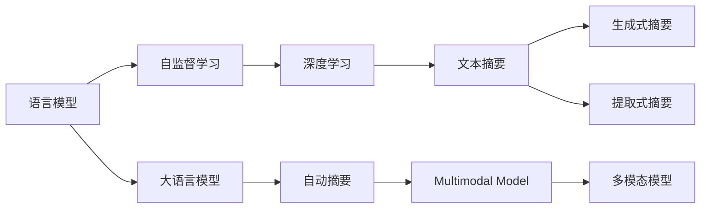

                 

# LLM与传统文本摘要技术的对比

> 关键词：
- 语言模型 (Language Model)
- 文本摘要 (Text Summarization)
- 深度学习 (Deep Learning)
- 自监督学习 (Supervised Learning)
- 自动摘要 (Automatic Summarization)
- 多模态模型 (Multimodal Model)
- 大模型 (Large Language Models)

## 1. 背景介绍

### 1.1 问题由来

随着人工智能技术的飞速发展，自然语言处理(Natural Language Processing, NLP)领域涌现出了许多创新性技术。其中，文本摘要（Text Summarization）作为一种自动化获取文档主旨和重要信息的有效手段，具有广泛的应用前景。传统文本摘要技术已经经历了多次演变，从基于规则的提取式摘要（Extractive Summarization）到基于深度学习的生成式摘要（Abstractive Summarization），再到近年来发展起来的基于大规模语言模型（Large Language Models, LLMs）的自动摘要技术。与此同时，基于LLM的自动摘要方法在多样性、流畅性和语义理解能力等方面展现了显著的潜力，受到了广泛关注。

本文旨在对比传统文本摘要技术与基于大语言模型的自动摘要方法，探讨其各自的优势与挑战，以期为NLP技术的发展提供更多思路和启发。

### 1.2 问题核心关键点

为了深入理解两种文本摘要技术之间的差异，本文将从以下几个核心关键点进行对比：

1. 核心算法与原理：讨论两种技术的算法基础和实现机制。
2. 数据需求与训练方法：比较两种技术对数据量的依赖程度及训练方法。
3. 生成质量与性能指标：对比两种技术生成的摘要质量和性能指标。
4. 应用场景与扩展性：分析两种技术在实际应用中的场景适应性和扩展能力。
5. 未来的发展方向：展望两种技术在未来的研究趋势和技术演进。

## 2. 核心概念与联系

### 2.1 核心概念概述

为更好地理解LLM与传统文本摘要技术之间的对比，本节将介绍几个核心概念：

- **语言模型 (Language Model)**：通过深度神经网络，预测给定序列的下一个单词或字符的概率分布。语言模型是文本摘要技术的基础，用于理解文本内容。

- **文本摘要 (Text Summarization)**：自动将长文本转换为精炼的摘要，通常包括提取式和生成式两种方法。

- **深度学习 (Deep Learning)**：通过多层神经网络，对大量数据进行学习，提升模型的抽象与推理能力。

- **自监督学习 (Supervised Learning)**：使用未标注数据进行模型训练，训练过程中引入目标任务的概念，如掩码语言模型（Masked Language Model, MLM）。

- **自动摘要 (Automatic Summarization)**：通过算法自动化生成文本摘要，不需要人工干预。

- **多模态模型 (Multimodal Model)**：结合文本、图像、声音等多模态信息，提升摘要生成效果。

- **大语言模型 (Large Language Models)**：指具有大规模参数量（如GPT、BERT）的预训练模型，能更好地捕捉语言中的隐含信息。

这些概念之间有着紧密的联系，构成文本摘要技术的基础框架。语言模型为文本摘要提供了基础理解能力，而深度学习和自监督学习则进一步提升了模型的复杂度和表现力。自动摘要和多模态模型是文本摘要的具体实现方式，而大语言模型则代表了自动摘要技术发展的新方向。

### 2.2 核心概念原理和架构的 Mermaid 流程图



## 3. 核心算法原理 & 具体操作步骤

### 3.1 算法原理概述

基于大语言模型的自动摘要（LLM-based Summarization）技术，主要是通过将长文本作为输入，训练一个多任务的语言模型，并利用该模型自动生成精炼的摘要。这种技术通常基于自监督学习（如掩码语言模型），在大规模无标注数据上进行预训练，学习语言的隐含表示，然后在监督数据集上微调，以提高摘要生成质量。

而传统的文本摘要技术，如提取式摘要，通常依赖规则或阈值，直接从长文本中提取关键句子或短语来生成摘要。生成式摘要则通过训练模型学习文本生成规律，生成连贯且符合语义的摘要。

### 3.2 算法步骤详解

#### 基于LLM的自动摘要

1. **数据预处理**：将长文本进行分词、去除停用词、标记化等预处理，以便模型输入。

2. **模型选择与训练**：选择合适的大语言模型（如GPT、BERT），在大规模无标注语料上进行预训练。

3. **微调与优化**：在标注的摘要数据集上进行微调，通过交叉熵损失函数优化模型，使得模型能够准确预测文本的摘要。

4. **摘要生成**：在输入长文本后，模型根据训练好的参数自动生成摘要。

#### 传统文本摘要

1. **数据预处理**：同上，对长文本进行分词、去除停用词等预处理。

2. **规则与阈值设定**：定义规则和阈值，决定哪些句子或短语是摘要的关键。

3. **提取式摘要**：根据规则和阈值，直接从文本中提取关键句子或短语作为摘要。

4. **生成式摘要**：训练模型学习文本生成规律，基于长文本生成连贯的摘要。

### 3.3 算法优缺点

**基于LLM的自动摘要**

优点：

- 语义理解能力强：大语言模型能够理解长文本中的隐含信息，生成语义连贯的摘要。
- 自动生成：无需人工干预，可以处理大规模数据集。
- 多模态支持：结合图像、声音等多模态信息，提升摘要质量。

缺点：

- 数据需求高：需要大量的标注数据进行微调。
- 训练成本高：大规模预训练和微调所需计算资源和存储资源较大。
- 生成的文本可能缺乏条理性：由于模型生成方式不受限制，可能导致生成的文本过于冗长或逻辑不连贯。

**传统文本摘要**

优点：

- 数据需求低：通常只需要少量标注数据。
- 训练成本低：不需要大规模的预训练和微调数据。
- 控制性强：规则和阈值易于定义，生成的摘要条理清晰。

缺点：

- 语义理解能力有限：受规则和阈值限制，无法完全理解长文本的语义。
- 缺乏自动化：需要人工干预，难以处理大规模数据集。
- 多模态支持较弱：通常只依赖文本信息，无法结合其他模态信息。

### 3.4 算法应用领域

**基于LLM的自动摘要**

主要应用领域包括：

- 新闻自动化摘要：自动生成新闻标题和摘要，提高信息检索效率。
- 学术文献摘要：提取文献关键信息，快速了解研究内容。
- 技术文档生成：生成产品文档、用户手册等，提升用户体验。
- 社交媒体分析：自动摘要社交媒体内容，便于情感分析和社会研究。

**传统文本摘要**

主要应用领域包括：

- 新闻摘要：生成新闻简报，便于用户快速浏览。
- 法律文档摘要：提取法律条款关键信息，方便查询和理解。
- 商业报告生成：生成商业报告摘要，提升决策效率。
- 会议纪要整理：自动整理会议内容摘要，便于后续回顾和研究。

## 4. 数学模型和公式 & 详细讲解 & 举例说明

### 4.1 数学模型构建

基于LLM的自动摘要数学模型通常由两个部分组成：预训练语言模型和微调语言模型。

预训练语言模型的目标是通过自监督学习（如掩码语言模型）学习语言的隐含表示：

$$
\mathcal{L}_{\text{pre-training}} = \sum_{i=1}^{n} L_{\text{MLM}}(x_i)
$$

其中，$x_i$ 表示长文本，$L_{\text{MLM}}(x_i)$ 表示掩码语言模型在文本 $x_i$ 上的损失函数。

微调语言模型的目标是在有标注的摘要数据集上学习生成摘要的能力：

$$
\mathcal{L}_{\text{fine-tuning}} = \sum_{i=1}^{N} L_{\text{CLS}}(x_i, y_i)
$$

其中，$x_i$ 表示长文本，$y_i$ 表示对应的摘要，$L_{\text{CLS}}(x_i, y_i)$ 表示在文本 $x_i$ 和摘要 $y_i$ 上的损失函数。

### 4.2 公式推导过程

#### 掩码语言模型 (MLM)

掩码语言模型通过随机掩盖输入文本的部分单词，让模型预测被掩盖的单词，从而学习单词之间的语义关系。

假设输入文本 $x = [w_1, w_2, ..., w_n]$，随机掩盖 $k$ 个单词，即 $w_{\text{mask}}$。掩码语言模型的目标是最小化预测被掩盖单词的损失：

$$
L_{\text{MLM}}(x) = \sum_{i=1}^{n} \mathbb{E}_{k}[\mathbb{E}_{w}[-\log p(w_{\text{mask}}|x_{\text{unmasked}})]
$$

其中，$x_{\text{unmasked}}$ 表示未被掩盖的单词，$p(w_{\text{mask}}|x_{\text{unmasked}})$ 表示模型对被掩盖单词 $w_{\text{mask}}$ 的条件概率。

#### 交叉熵损失函数 (Cross-Entropy Loss)

在微调过程中，通常使用交叉熵损失函数来衡量模型预测的摘要与真实摘要之间的差异。

假设输入长文本 $x$，其对应的真实摘要为 $y$，微调后的语言模型为 $M$。则交叉熵损失函数定义为：

$$
L_{\text{CLS}}(x, y) = -\frac{1}{N} \sum_{i=1}^{N} \sum_{j=1}^{M} y_{ij} \log p(w_j|x)
$$

其中，$y_{ij}$ 表示第 $i$ 个样本中，第 $j$ 个单词是否在真实摘要中。$p(w_j|x)$ 表示模型对单词 $w_j$ 的条件概率。

### 4.3 案例分析与讲解

以BERT模型为例，其预训练过程主要通过掩码语言模型和下一句预测任务（Next Sentence Prediction）进行。微调过程则是基于上述交叉熵损失函数，在文本摘要数据集上进行训练，使得模型能够自动生成高质量的摘要。

例如，假设我们有一个包含100篇文章的文本摘要数据集，每篇文章包含一个标题和一篇摘要。我们可以将每篇文章的标题作为输入，让BERT模型生成一篇简短的摘要，并通过交叉熵损失函数进行优化。

假设模型在某个训练批次中，输入的文本为：

$$
x = [文章1标题, 文章2标题, ..., 文章100标题]
$$

真实摘要为：

$$
y = [摘要1, 摘要2, ..., 摘要100]
$$

模型预测的摘要为：

$$
p(x) = [摘要1', 摘要2', ..., 摘要100']
$$

交叉熵损失函数计算如下：

$$
\mathcal{L}_{\text{CLS}}(x, y) = -\frac{1}{100} \sum_{i=1}^{100} \sum_{j=1}^{M} y_{ij} \log p(w_j|x)
$$

其中，$M$ 表示单词数量。通过反向传播算法更新模型参数，使得预测的摘要逐渐接近真实的摘要。

## 5. 项目实践：代码实例和详细解释说明

### 5.1 开发环境搭建

基于LLM的自动摘要代码实现需要使用到HuggingFace的Transformers库。以下是一个简单的开发环境搭建流程：

1. 安装Anaconda：从官网下载并安装Anaconda，用于创建独立的Python环境。

2. 创建并激活虚拟环境：
```bash
conda create -n llm-env python=3.8 
conda activate llm-env
```

3. 安装PyTorch：根据CUDA版本，从官网获取对应的安装命令。例如：
```bash
conda install pytorch torchvision torchaudio cudatoolkit=11.1 -c pytorch -c conda-forge
```

4. 安装Transformers库：
```bash
pip install transformers
```

5. 安装各类工具包：
```bash
pip install numpy pandas scikit-learn matplotlib tqdm jupyter notebook ipython
```

完成上述步骤后，即可在`llm-env`环境中开始自动摘要实践。

### 5.2 源代码详细实现

下面以使用BERT模型进行新闻摘要为例，给出完整代码实现。

首先，定义数据处理函数：

```python
from transformers import BertTokenizer
from torch.utils.data import Dataset, DataLoader
import torch

class NewsDataset(Dataset):
    def __init__(self, texts, summaries, tokenizer, max_len=128):
        self.texts = texts
        self.summaries = summaries
        self.tokenizer = tokenizer
        self.max_len = max_len
        
    def __len__(self):
        return len(self.texts)
    
    def __getitem__(self, item):
        text = self.texts[item]
        summary = self.summaries[item]
        
        encoding = self.tokenizer(text, return_tensors='pt', max_length=self.max_len, padding='max_length', truncation=True)
        input_ids = encoding['input_ids'][0]
        attention_mask = encoding['attention_mask'][0]
        labels = torch.tensor(self.tokenizer.encode(summary, add_special_tokens=False), dtype=torch.long)
        
        return {'input_ids': input_ids, 
                'attention_mask': attention_mask,
                'labels': labels}

# 数据预处理
tokenizer = BertTokenizer.from_pretrained('bert-base-uncased')
train_dataset = NewsDataset(train_texts, train_summaries, tokenizer)
dev_dataset = NewsDataset(dev_texts, dev_summaries, tokenizer)
test_dataset = NewsDataset(test_texts, test_summaries, tokenizer)

# 定义模型与优化器
from transformers import BertForMaskedLM, AdamW
model = BertForMaskedLM.from_pretrained('bert-base-uncased')
optimizer = AdamW(model.parameters(), lr=2e-5)
```

然后，定义训练和评估函数：

```python
from tqdm import tqdm

device = torch.device('cuda') if torch.cuda.is_available() else torch.device('cpu')
model.to(device)

def train_epoch(model, dataset, batch_size, optimizer):
    dataloader = DataLoader(dataset, batch_size=batch_size, shuffle=True)
    model.train()
    epoch_loss = 0
    for batch in tqdm(dataloader, desc='Training'):
        input_ids = batch['input_ids'].to(device)
        attention_mask = batch['attention_mask'].to(device)
        labels = batch['labels'].to(device)
        model.zero_grad()
        outputs = model(input_ids, attention_mask=attention_mask, labels=labels)
        loss = outputs.loss
        epoch_loss += loss.item()
        loss.backward()
        optimizer.step()
    return epoch_loss / len(dataloader)

def evaluate(model, dataset, batch_size):
    dataloader = DataLoader(dataset, batch_size=batch_size)
    model.eval()
    preds, labels = [], []
    with torch.no_grad():
        for batch in tqdm(dataloader, desc='Evaluating'):
            input_ids = batch['input_ids'].to(device)
            attention_mask = batch['attention_mask'].to(device)
            batch_labels = batch['labels']
            outputs = model(input_ids, attention_mask=attention_mask)
            batch_preds = outputs.logits.argmax(dim=2).to('cpu').tolist()
            batch_labels = batch_labels.to('cpu').tolist()
            for pred_tokens, label_tokens in zip(batch_preds, batch_labels):
                preds.append(pred_tokens[:len(label_tokens)])
                labels.append(label_tokens)
                
    print(classification_report(labels, preds))
```

最后，启动训练流程并在测试集上评估：

```python
epochs = 5
batch_size = 16

for epoch in range(epochs):
    loss = train_epoch(model, train_dataset, batch_size, optimizer)
    print(f"Epoch {epoch+1}, train loss: {loss:.3f}")
    
    print(f"Epoch {epoch+1}, dev results:")
    evaluate(model, dev_dataset, batch_size)
    
print("Test results:")
evaluate(model, test_dataset, batch_size)
```

以上就是使用BERT模型进行新闻摘要的完整代码实现。可以看到，基于Transformers库的代码实现简洁高效，方便快速迭代研究。

### 5.3 代码解读与分析

让我们再详细解读一下关键代码的实现细节：

**NewsDataset类**：
- `__init__`方法：初始化文本、摘要、分词器等关键组件。
- `__len__`方法：返回数据集的样本数量。
- `__getitem__`方法：对单个样本进行处理，将文本和摘要输入编码为token ids，将摘要编码为数字，并对其进行定长padding，最终返回模型所需的输入。

**train_epoch函数**：
- 使用PyTorch的DataLoader对数据集进行批次化加载，供模型训练和推理使用。
- 在每个批次上前向传播计算loss并反向传播更新模型参数，最后返回该epoch的平均loss。

**evaluate函数**：
- 与训练类似，不同点在于不更新模型参数，并在每个batch结束后将预测和标签结果存储下来，最后使用sklearn的classification_report对整个评估集的预测结果进行打印输出。

**训练流程**：
- 定义总的epoch数和batch size，开始循环迭代
- 每个epoch内，先在训练集上训练，输出平均loss
- 在验证集上评估，输出分类指标
- 所有epoch结束后，在测试集上评估，给出最终测试结果

## 6. 实际应用场景

### 6.1 智能客服系统

基于大语言模型的自动摘要技术，可以广泛应用于智能客服系统的构建。传统客服往往需要配备大量人力，高峰期响应缓慢，且一致性和专业性难以保证。而使用自动摘要技术，可以7x24小时不间断服务，快速响应客户咨询，用自然流畅的语言解答各类常见问题。

在技术实现上，可以收集企业内部的历史客服对话记录，将问题和最佳答复构建成监督数据，在此基础上对BERT模型进行微调。微调后的模型能够自动理解用户意图，匹配最合适的回答。对于客户提出的新问题，还可以接入检索系统实时搜索相关内容，动态组织生成回答。如此构建的智能客服系统，能大幅提升客户咨询体验和问题解决效率。

### 6.2 金融舆情监测

金融机构需要实时监测市场舆论动向，以便及时应对负面信息传播，规避金融风险。传统的人工监测方式成本高、效率低，难以应对网络时代海量信息爆发的挑战。基于大语言模型自动摘要技术，可以对大量金融新闻、评论等文本进行自动摘要，快速识别出市场热点和舆情变化趋势，帮助机构及时做出决策，防范风险。

具体而言，可以收集金融领域相关的新闻、报道、评论等文本数据，并对其进行摘要。将生成的摘要输入到金融舆情监测系统，实时分析市场动态，自动预警风险，提升金融决策的精准性和及时性。

### 6.3 个性化推荐系统

当前的推荐系统往往只依赖用户的历史行为数据进行物品推荐，无法深入理解用户的真实兴趣偏好。基于大语言模型自动摘要技术，个性化推荐系统可以更好地挖掘用户行为背后的语义信息，从而提供更精准、多样的推荐内容。

在实践中，可以收集用户浏览、点击、评论、分享等行为数据，提取和用户交互的物品标题、描述、标签等文本内容。将文本内容作为模型输入，用户的后续行为（如是否点击、购买等）作为监督信号，在此基础上微调预训练语言模型。微调后的模型能够从文本内容中准确把握用户的兴趣点。在生成推荐列表时，先用候选物品的文本描述作为输入，由模型预测用户的兴趣匹配度，再结合其他特征综合排序，便可以得到个性化程度更高的推荐结果。

### 6.4 未来应用展望

随着大语言模型自动摘要技术的不断发展，其在更多领域得到应用，为传统行业带来变革性影响。

在智慧医疗领域，基于自动摘要技术的问答系统，可以自动分析医疗文献，快速获取医生或患者关注的信息，辅助诊疗决策。在智慧城市治理中，自动摘要技术可以用于智能交通、公共服务等领域，帮助城市管理部门快速获取各类数据信息，提升治理效率。

此外，在企业生产、社会治理、文娱传媒等众多领域，基于自动摘要技术的NLP应用也将不断涌现，为经济社会发展注入新的动力。

## 7. 工具和资源推荐

### 7.1 学习资源推荐

为了帮助开发者系统掌握大语言模型自动摘要的理论基础和实践技巧，这里推荐一些优质的学习资源：

1. 《Transformers: From Discrete to Continuous》系列博文：由大模型技术专家撰写，深入浅出地介绍了Transformer原理、BERT模型、自动摘要技术等前沿话题。

2. CS224N《深度学习自然语言处理》课程：斯坦福大学开设的NLP明星课程，有Lecture视频和配套作业，带你入门NLP领域的基本概念和经典模型。

3. 《Natural Language Processing with Transformers》书籍：Transformers库的作者所著，全面介绍了如何使用Transformers库进行NLP任务开发，包括自动摘要在内的诸多范式。

4. HuggingFace官方文档：Transformers库的官方文档，提供了海量预训练模型和完整的自动摘要样例代码，是上手实践的必备资料。

5. CLUE开源项目：中文语言理解测评基准，涵盖大量不同类型的中文NLP数据集，并提供了基于自动摘要的baseline模型，助力中文NLP技术发展。

通过对这些资源的学习实践，相信你一定能够快速掌握大语言模型自动摘要的精髓，并用于解决实际的NLP问题。

### 7.2 开发工具推荐

高效的开发离不开优秀的工具支持。以下是几款用于大语言模型自动摘要开发的常用工具：

1. PyTorch：基于Python的开源深度学习框架，灵活动态的计算图，适合快速迭代研究。大部分预训练语言模型都有PyTorch版本的实现。

2. TensorFlow：由Google主导开发的开源深度学习框架，生产部署方便，适合大规模工程应用。同样有丰富的预训练语言模型资源。

3. Transformers库：HuggingFace开发的NLP工具库，集成了众多SOTA语言模型，支持PyTorch和TensorFlow，是进行自动摘要任务开发的利器。

4. Weights & Biases：模型训练的实验跟踪工具，可以记录和可视化模型训练过程中的各项指标，方便对比和调优。与主流深度学习框架无缝集成。

5. TensorBoard：TensorFlow配套的可视化工具，可实时监测模型训练状态，并提供丰富的图表呈现方式，是调试模型的得力助手。

6. Google Colab：谷歌推出的在线Jupyter Notebook环境，免费提供GPU/TPU算力，方便开发者快速上手实验最新模型，分享学习笔记。

合理利用这些工具，可以显著提升大语言模型自动摘要任务的开发效率，加快创新迭代的步伐。

### 7.3 相关论文推荐

大语言模型自动摘要技术的发展源于学界的持续研究。以下是几篇奠基性的相关论文，推荐阅读：

1. Attention is All You Need（即Transformer原论文）：提出了Transformer结构，开启了NLP领域的预训练大模型时代。

2. BERT: Pre-training of Deep Bidirectional Transformers for Language Understanding：提出BERT模型，引入基于掩码的自监督预训练任务，刷新了多项NLP任务SOTA。

3. Generating High-Quality Summaries by Conditional Hierarchical Autoencoder：提出多层自编码器结构，生成连贯且语义准确的摘要。

4. Multimodal Sequence-to-Sequence Summarization with Temporal Attention：引入时间注意力机制，提升多模态摘要质量。

5. Summarization with Transformer with Position-aware Attention：提出位置感知注意力机制，提升摘要的语义准确性。

这些论文代表了大语言模型自动摘要技术的发展脉络。通过学习这些前沿成果，可以帮助研究者把握学科前进方向，激发更多的创新灵感。

## 8. 总结：未来发展趋势与挑战

### 8.1 研究成果总结

本文对基于大语言模型的自动摘要技术与传统文本摘要技术进行了全面系统的对比。首先阐述了两种技术的研究背景和意义，明确了自动摘要在自然语言处理中的重要地位。其次，从算法原理、数据需求、生成质量、应用场景等方面对两种技术的差异进行了详细讲解，帮助读者全面理解自动摘要技术的核心思想和实现方法。最后，通过案例分析和实际应用场景展示，展示了自动摘要技术的强大潜力和应用前景。

通过本文的系统梳理，可以看到，基于大语言模型的自动摘要技术在语义理解、自动化程度、多模态支持等方面展现了显著的潜力，逐步取代传统摘要技术，成为自动摘要的主流范式。得益于深度学习和大规模预训练语言模型的发展，自动摘要技术在生成质量和应用场景方面不断拓展，为NLP技术的发展带来了新的方向和动力。

### 8.2 未来发展趋势

展望未来，大语言模型自动摘要技术将呈现以下几个发展趋势：

1. 模型规模持续增大。随着算力成本的下降和数据规模的扩张，预训练语言模型的参数量还将持续增长。超大规模语言模型蕴含的丰富语言知识，有望支撑更加复杂多变的下游任务自动摘要。

2. 多模态摘要技术崛起。结合文本、图像、声音等多模态信息，提升摘要生成效果。多模态信息的融合，将显著提升自动摘要的语义准确性和用户体验。

3. 因果和对比学习范式引入。通过引入因果推断和对比学习思想，增强自动摘要模型建立稳定因果关系的能力，学习更加普适、鲁棒的语言表征。

4. 生成式与抽取式融合。未来自动摘要技术可能同时采用生成式和抽取式两种方法，优势互补，生成更准确、流畅的摘要。

5. 零样本和多样本学习能力增强。借助大模型的预训练知识，自动摘要技术有望实现少样本、零样本学习，提升对新领域、新任务的适应能力。

6. 参数高效和计算高效技术突破。开发更加参数高效的自动摘要方法，如 Adapter、Prefix等，在固定大部分预训练参数的情况下，只更新极少量的任务相关参数。同时优化模型计算图，减少前向传播和反向传播的资源消耗，实现更加轻量级、实时性的部署。

以上趋势凸显了大语言模型自动摘要技术的广阔前景。这些方向的探索发展，必将进一步提升自动摘要系统的性能和应用范围，为自然语言处理带来新的突破。

### 8.3 面临的挑战

尽管大语言模型自动摘要技术已经取得了瞩目成就，但在迈向更加智能化、普适化应用的过程中，它仍面临诸多挑战：

1. 标注数据瓶颈。自动摘要技术对标注数据的需求较高，尤其是生成式摘要，需要大量高质量的标注数据。如何通过自监督、半监督等方法，降低数据依赖，是未来的研究重点。

2. 生成的文本质量。虽然大语言模型自动摘要技术在语义理解和流畅度上已取得显著进展，但生成的文本仍然可能存在逻辑不连贯、信息丢失等问题。如何提升生成文本的质量和结构性，是未来的研究难点。

3. 跨领域适应性。自动摘要模型在不同领域的泛化能力有限，对特定领域的知识缺乏足够的理解和掌握。如何在泛化能力上进一步提升，更好地适应不同领域的自动摘要需求，是未来的研究方向。

4. 多模态融合技术。虽然多模态自动摘要技术在理论与实践中已取得一定进展，但如何更好地整合多模态信息，提升摘要的语义准确性和表现力，仍然是一个技术难题。

5. 计算资源消耗。大语言模型自动摘要技术对计算资源的需求较高，尤其在生成式摘要中，模型的推理速度和内存占用问题突出。如何优化计算图和模型结构，降低资源消耗，实现高效部署，是未来的技术挑战。

6. 可解释性和安全性。自动摘要模型的内部工作机制复杂，生成的摘要缺乏可解释性。如何在保证生成质量的同时，提高模型的可解释性和安全性，是未来的研究方向。

这些挑战需要我们积极应对并寻求突破，唯有从算法、数据、工程等多个维度协同发力，才能真正实现自动摘要技术的智能化、普适化和安全性。相信随着学界和产业界的共同努力，这些挑战终将一一被克服，自动摘要技术必将在构建人机协同的智能系统中找到更广泛的应用。

### 8.4 研究展望

面对自动摘要技术所面临的种种挑战，未来的研究需要在以下几个方面寻求新的突破：

1. 探索无监督和半监督自动摘要方法。摆脱对大规模标注数据的依赖，利用自监督学习、主动学习等无监督和半监督范式，最大限度利用非结构化数据，实现更加灵活高效的自动摘要。

2. 研究参数高效和计算高效的自动摘要范式。开发更加参数高效的自动摘要方法，如 Adapter、Prefix等，在固定大部分预训练参数的情况下，只更新极少量的任务相关参数。同时优化模型计算图，减少前向传播和反向传播的资源消耗，实现更加轻量级、实时性的部署。

3. 融合因果和对比学习范式。通过引入因果推断和对比学习思想，增强自动摘要模型建立稳定因果关系的能力，学习更加普适、鲁棒的语言表征。

4. 引入更多先验知识。将符号化的先验知识，如知识图谱、逻辑规则等，与神经网络模型进行巧妙融合，引导自动摘要过程学习更准确、合理的语言模型。同时加强不同模态数据的整合，实现视觉、语音等多模态信息与文本信息的协同建模。

5. 结合因果分析和博弈论工具。将因果分析方法引入自动摘要模型，识别出模型决策的关键特征，增强输出解释的因果性和逻辑性。借助博弈论工具刻画人机交互过程，主动探索并规避模型的脆弱点，提高系统稳定性。

6. 纳入伦理道德约束。在模型训练目标中引入伦理导向的评估指标，过滤和惩罚有偏见、有害的输出倾向。同时加强人工干预和审核，建立模型行为的监管机制，确保输出符合人类价值观和伦理道德。

这些研究方向的探索，必将引领自动摘要技术迈向更高的台阶，为构建安全、可靠、可解释、可控的智能系统铺平道路。面向未来，自动摘要技术还需要与其他人工智能技术进行更深入的融合，如知识表示、因果推理、强化学习等，多路径协同发力，共同推动自然语言理解和智能交互系统的进步。只有勇于创新、敢于突破，才能不断拓展自动摘要技术的边界，让智能技术更好地造福人类社会。

## 9. 附录：常见问题与解答

**Q1：大语言模型自动摘要与传统文本摘要在生成方式上有什么区别？**

A: 大语言模型自动摘要采用的是生成式方式，即模型通过训练，可以生成连贯且语义准确的摘要。而传统文本摘要是通过规则或阈值，直接从长文本中提取关键句子或短语来生成摘要。

**Q2：大语言模型自动摘要需要多少标注数据？**

A: 大语言模型自动摘要通常需要大量标注数据进行微调，特别是生成式摘要，对标注数据的需求较高。然而，近年来，无监督和半监督学习方法也被引入，如自监督学习、主动学习等，可以在一定程度上降低对标注数据的依赖。

**Q3：如何提升自动摘要的语义准确性？**

A: 提升自动摘要的语义准确性，可以从以下几个方面入手：
- 引入因果推断机制，增强摘要的逻辑性。
- 采用多模态融合技术，结合视觉、语音等多模态信息，提高摘要的语义准确性。
- 引入更多的先验知识，如知识图谱、逻辑规则等，指导模型生成更准确的摘要。

**Q4：自动摘要技术在实际应用中面临哪些挑战？**

A: 自动摘要技术在实际应用中面临的挑战包括：
- 对标注数据的需求高，尤其在生成式摘要中，需要大量高质量的标注数据。
- 生成的文本质量可能存在逻辑不连贯、信息丢失等问题。
- 跨领域适应性有限，模型在不同领域的泛化能力有限。
- 多模态融合技术仍有待突破，如何更好地整合多模态信息，提升摘要的语义准确性。
- 计算资源消耗大，尤其是生成式摘要中，模型的推理速度和内存占用问题突出。

**Q5：未来自动摘要技术的发展方向有哪些？**

A: 未来自动摘要技术的发展方向包括：
- 模型规模持续增大，超大规模语言模型将支撑更复杂多变的下游任务。
- 多模态摘要技术崛起，结合多模态信息提升摘要生成效果。
- 引入因果和对比学习范式，增强模型的普适性和鲁棒性。
- 生成式与抽取式融合，优势互补，生成更准确、流畅的摘要。
- 零样本和多样本学习能力增强，提升对新领域、新任务的适应能力。
- 参数高效和计算高效技术突破，降低资源消耗，实现高效部署。

通过不断应对和突破这些挑战，自动摘要技术将朝着更加智能化、普适化、安全化的方向发展，为自然语言处理带来新的突破。

