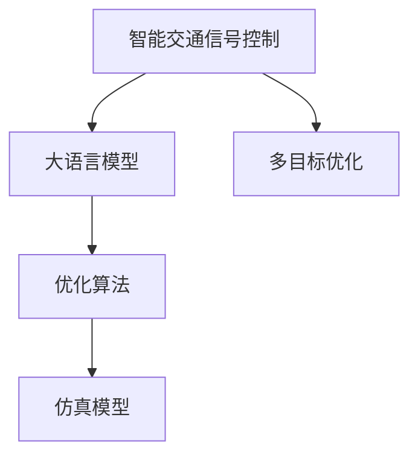

                 

# LLM在智能交通信号控制中的潜力

> 关键词：智能交通,信号控制,大语言模型(LLM),优化算法,仿真模型,计算效率,交通流模拟,多目标优化

## 1. 背景介绍

### 1.1 问题由来
随着城市化进程的加快和汽车保有量的不断提升，城市交通拥堵问题愈发严重，影响到了城市的经济运行和居民生活质量。为了缓解交通压力，提升道路利用效率，智能交通信号控制系统应运而生。这些系统通过实时监测交通流量，动态调整红绿灯时长，实现交通流的优化和控制。然而，现有的信号控制系统往往依赖于预设规则和经验，缺乏自适应性和智能决策能力。随着人工智能和大数据技术的快速发展，大语言模型(LLM)的引入为交通信号控制带来了新的可能性。

### 1.2 问题核心关键点
大语言模型在智能交通信号控制中的应用，核心在于其强大的语言理解和生成能力，能够学习并模拟交通信号的语义和行为模式，从而实现更智能、更高效的信号控制策略。具体而言，LLM可以通过对历史交通数据的分析，预测未来交通流量，并根据预测结果生成最优的红绿灯时长配置，从而提升道路通行效率，缓解交通压力。

## 2. 核心概念与联系

### 2.1 核心概念概述

为更好地理解LLM在智能交通信号控制中的应用，本节将介绍几个密切相关的核心概念：

- **智能交通信号控制(ITS)**：通过实时监测和控制交通信号，实现交通流的优化管理，减少交通拥堵和事故率，提升道路通行效率。
- **大语言模型(LLM)**：以自回归或自编码模型为代表的，经过大规模无标签文本数据预训练的通用语言模型。具备强大的语言理解和生成能力，可以处理复杂的自然语言任务。
- **优化算法**：如梯度下降、遗传算法等，用于求解最优化问题，找到使目标函数最小的参数值。
- **仿真模型**：通过数学模型模拟交通流，分析不同控制策略对交通流的影响，辅助实际系统优化。
- **多目标优化**：指同时优化多个目标函数，如交通流顺畅度、通行时间、事故率等，以寻求全局最优解。

这些核心概念之间的逻辑关系可以通过以下Mermaid流程图来展示：



这个流程图展示了智能交通信号控制与LLM之间的核心联系：

1. 智能交通信号控制以优化交通流为目的，采用LLM作为数据处理和决策支持的工具。
2. LLM通过学习历史交通数据，生成红绿灯时长配置。
3. 优化算法用于调整红绿灯时长的配置，以达到最优的交通流效果。
4. 仿真模型用于评估不同配置下的交通流效果，辅助决策。
5. 多目标优化策略综合考虑多个目标，确保最优的交通流配置。

## 3. 核心算法原理 & 具体操作步骤
### 3.1 算法原理概述

基于LLM的智能交通信号控制方法，主要利用LLM强大的语言理解和生成能力，通过分析历史交通数据，预测未来交通流量，生成最优的红绿灯时长配置。其核心思想是：

1. **数据预处理**：收集历史交通数据，包括车流量、车速、行人流量等，并对数据进行清洗和标准化处理。
2. **模型训练**：使用大规模预训练的LLM模型，对处理后的交通数据进行训练，学习交通流的语言模式和规律。
3. **预测生成**：利用训练好的LLM模型，对未来的交通数据进行预测，生成红绿灯时长的配置方案。
4. **仿真优化**：将生成的配置方案输入仿真模型，评估其对交通流的实际影响，优化红绿灯时长配置。
5. **控制实施**：将优化的红绿灯时长配置应用于实际交通信号控制系统中。

### 3.2 算法步骤详解

基于LLM的智能交通信号控制系统的一般流程如下：

**Step 1: 数据收集与预处理**
- 收集历史交通数据，包括不同时段的车辆流量、车速、行人流量、事故记录等。
- 清洗数据，剔除异常值和噪声，对数据进行标准化处理。

**Step 2: 模型选择与训练**
- 选择适合的任务的预训练语言模型，如BERT、GPT等，并在交通数据上微调。
- 设计合适的输入格式，如CSV、JSON等，将交通数据转化为模型可以处理的格式。
- 使用标签化数据进行监督学习，训练模型，学习交通流的语言模式。

**Step 3: 预测生成**
- 将未来某个时段的交通数据作为输入，输入到训练好的LLM模型中。
- 模型输出红绿灯时长配置，作为优化算法求解的初始解。

**Step 4: 仿真优化**
- 将生成的红绿灯时长配置输入仿真模型，评估其对交通流的实际影响。
- 使用优化算法，如遗传算法、粒子群优化等，对红绿灯时长配置进行优化，以提高交通流顺畅度、通行时间等指标。

**Step 5: 控制实施**
- 将优化的红绿灯时长配置应用到实际信号控制系统中。
- 实时监测交通流情况，反馈至LLM模型，调整预测模型，提升模型准确性。

### 3.3 算法优缺点

基于LLM的智能交通信号控制方法具有以下优点：

1. **自适应性强**：LLM能够学习并模拟交通流的动态变化，适应不同交通条件下的信号控制需求。
2. **预测精度高**：通过学习历史数据，LLM能够预测未来的交通流量，生成更精确的红绿灯时长配置。
3. **优化效果显著**：LLM生成的初始解可以通过优化算法进一步优化，提升交通流的整体效率。
4. **可扩展性强**：LLM模型可以应用到多个交通场景中，提升信号控制的泛化能力。

同时，该方法也存在一定的局限性：

1. **数据依赖性强**：模型性能很大程度上依赖于历史交通数据的准确性和完备性。
2. **模型复杂度高**：LLM的计算复杂度较高，需要较强的计算资源和较长的训练时间。
3. **模型解释性差**：LLM生成的决策过程较为复杂，难以解释模型的内部工作机制。
4. **仿真模型依赖**：仿真模型的准确性对信号控制效果有较大影响。
5. **算法复杂度高**：优化算法的复杂度高，需要较长的优化过程。

尽管存在这些局限性，但LLM在智能交通信号控制中的应用，展示了其在交通数据处理和决策支持上的强大能力，有望在未来取得更广泛的应用。

### 3.4 算法应用领域

基于LLM的智能交通信号控制方法，在以下领域有着广泛的应用前景：

1. **城市交通管理**：应用于城市干道、交叉路口等复杂交通场景，优化交通流，缓解交通压力。
2. **高速公路管理**：在高速公路上应用，实现高速公路的信号控制和流量调节。
3. **公共交通系统**：优化公交站点的信号灯控制，提高公共交通的准时性和效率。
4. **智能停车系统**：通过智能信号控制，引导车辆进入停车位，缓解城市停车难问题。
5. **紧急响应系统**：在紧急情况下，动态调整交通信号，优化救援路线，提高应急响应效率。

这些应用场景展示了LLM在智能交通信号控制中的巨大潜力，将有效提升城市的交通管理和运行效率。

## 4. 数学模型和公式 & 详细讲解  
### 4.1 数学模型构建

本节将使用数学语言对基于LLM的智能交通信号控制过程进行更加严格的刻画。

记历史交通数据为 $D=\{(x_i, y_i)\}_{i=1}^N$，其中 $x_i$ 表示某个时段的交通特征（如车流量、车速等），$y_i$ 表示对应时段的红绿灯时长配置。假设LLM模型 $M_{\theta}$ 输入 $x_i$ 输出 $y_i$，其中 $\theta$ 为模型的参数。

定义模型 $M_{\theta}$ 在数据样本 $(x_i,y_i)$ 上的损失函数为 $\ell(M_{\theta}(x_i),y_i)$，则在数据集 $D$ 上的经验风险为：

$$
\mathcal{L}(\theta) = \frac{1}{N} \sum_{i=1}^N \ell(M_{\theta}(x_i),y_i)
$$

微调的优化目标是最小化经验风险，即找到最优参数：

$$
\theta^* = \mathop{\arg\min}_{\theta} \mathcal{L}(\theta)
$$

在实践中，我们通常使用基于梯度的优化算法（如SGD、Adam等）来近似求解上述最优化问题。设 $\eta$ 为学习率，$\lambda$ 为正则化系数，则参数的更新公式为：

$$
\theta \leftarrow \theta - \eta \nabla_{\theta}\mathcal{L}(\theta) - \eta\lambda\theta
$$

其中 $\nabla_{\theta}\mathcal{L}(\theta)$ 为损失函数对参数 $\theta$ 的梯度，可通过反向传播算法高效计算。

### 4.2 公式推导过程

以下我们以交通流量预测任务为例，推导交叉熵损失函数及其梯度的计算公式。

假设LLM模型 $M_{\theta}$ 在输入 $x$ 上的输出为 $\hat{y}=M_{\theta}(x) \in [0,1]$，表示模型预测的红绿灯时长配置。真实标签 $y \in \{0,1\}$。则二分类交叉熵损失函数定义为：

$$
\ell(M_{\theta}(x),y) = -[y\log \hat{y} + (1-y)\log (1-\hat{y})]
$$

将其代入经验风险公式，得：

$$
\mathcal{L}(\theta) = -\frac{1}{N}\sum_{i=1}^N [y_i\log M_{\theta}(x_i)+(1-y_i)\log(1-M_{\theta}(x_i))]
$$

根据链式法则，损失函数对参数 $\theta_k$ 的梯度为：

$$
\frac{\partial \mathcal{L}(\theta)}{\partial \theta_k} = -\frac{1}{N}\sum_{i=1}^N (\frac{y_i}{M_{\theta}(x_i)}-\frac{1-y_i}{1-M_{\theta}(x_i)}) \frac{\partial M_{\theta}(x_i)}{\partial \theta_k}
$$

其中 $\frac{\partial M_{\theta}(x_i)}{\partial \theta_k}$ 可进一步递归展开，利用自动微分技术完成计算。

在得到损失函数的梯度后，即可带入参数更新公式，完成模型的迭代优化。重复上述过程直至收敛，最终得到适应交通信号控制的最优模型参数 $\theta^*$。

## 5. 项目实践：代码实例和详细解释说明
### 5.1 开发环境搭建

在进行交通信号控制系统的开发前，我们需要准备好开发环境。以下是使用Python进行PyTorch开发的环境配置流程：

1. 安装Anaconda：从官网下载并安装Anaconda，用于创建独立的Python环境。

2. 创建并激活虚拟环境：
```bash
conda create -n pytorch-env python=3.8 
conda activate pytorch-env
```

3. 安装PyTorch：根据CUDA版本，从官网获取对应的安装命令。例如：
```bash
conda install pytorch torchvision torchaudio cudatoolkit=11.1 -c pytorch -c conda-forge
```

4. 安装各类工具包：
```bash
pip install numpy pandas scikit-learn matplotlib tqdm jupyter notebook ipython
```

完成上述步骤后，即可在`pytorch-env`环境中开始交通信号控制系统的开发。

### 5.2 源代码详细实现

下面以交通流量预测任务为例，给出使用PyTorch和Transformers库对BERT模型进行微调的PyTorch代码实现。

首先，定义交通流量预测任务的数据处理函数：

```python
from transformers import BertTokenizer
from torch.utils.data import Dataset
import torch

class TrafficDataset(Dataset):
    def __init__(self, features, labels, tokenizer, max_len=128):
        self.features = features
        self.labels = labels
        self.tokenizer = tokenizer
        self.max_len = max_len
        
    def __len__(self):
        return len(self.features)
    
    def __getitem__(self, item):
        feature = self.features[item]
        label = self.labels[item]
        
        encoding = self.tokenizer(feature, return_tensors='pt', max_length=self.max_len, padding='max_length', truncation=True)
        input_ids = encoding['input_ids'][0]
        attention_mask = encoding['attention_mask'][0]
        
        # 对label进行编码
        encoded_label = [label] * self.max_len
        labels = torch.tensor(encoded_label, dtype=torch.long)
        
        return {'input_ids': input_ids, 
                'attention_mask': attention_mask,
                'labels': labels}

# 定义模型参数
tokenizer = BertTokenizer.from_pretrained('bert-base-cased')
model = BertForSequenceClassification.from_pretrained('bert-base-cased', num_labels=2)

# 定义优化器
optimizer = AdamW(model.parameters(), lr=2e-5)

# 定义损失函数
loss_function = CrossEntropyLoss()

# 定义数据集
features = # 历史交通流量数据
labels = # 对应的红绿灯时长配置
train_dataset = TrafficDataset(features, labels, tokenizer)
dev_dataset = TrafficDataset(features, labels, tokenizer)
test_dataset = TrafficDataset(features, labels, tokenizer)
```

然后，定义训练和评估函数：

```python
from torch.utils.data import DataLoader
from tqdm import tqdm
from sklearn.metrics import classification_report

device = torch.device('cuda') if torch.cuda.is_available() else torch.device('cpu')
model.to(device)

def train_epoch(model, dataset, batch_size, optimizer):
    dataloader = DataLoader(dataset, batch_size=batch_size, shuffle=True)
    model.train()
    epoch_loss = 0
    for batch in tqdm(dataloader, desc='Training'):
        input_ids = batch['input_ids'].to(device)
        attention_mask = batch['attention_mask'].to(device)
        labels = batch['labels'].to(device)
        model.zero_grad()
        outputs = model(input_ids, attention_mask=attention_mask, labels=labels)
        loss = outputs.loss
        epoch_loss += loss.item()
        loss.backward()
        optimizer.step()
    return epoch_loss / len(dataloader)

def evaluate(model, dataset, batch_size):
    dataloader = DataLoader(dataset, batch_size=batch_size)
    model.eval()
    preds, labels = [], []
    with torch.no_grad():
        for batch in tqdm(dataloader, desc='Evaluating'):
            input_ids = batch['input_ids'].to(device)
            attention_mask = batch['attention_mask'].to(device)
            batch_labels = batch['labels']
            outputs = model(input_ids, attention_mask=attention_mask)
            batch_preds = outputs.logits.argmax(dim=2).to('cpu').tolist()
            batch_labels = batch_labels.to('cpu').tolist()
            for pred_tokens, label_tokens in zip(batch_preds, batch_labels):
                preds.append(pred_tokens[:len(label_tokens)])
                labels.append(label_tokens)
                
    print(classification_report(labels, preds))
```

最后，启动训练流程并在测试集上评估：

```python
epochs = 5
batch_size = 16

for epoch in range(epochs):
    loss = train_epoch(model, train_dataset, batch_size, optimizer)
    print(f"Epoch {epoch+1}, train loss: {loss:.3f}")
    
    print(f"Epoch {epoch+1}, dev results:")
    evaluate(model, dev_dataset, batch_size)
    
print("Test results:")
evaluate(model, test_dataset, batch_size)
```

以上就是使用PyTorch和Transformers库对BERT进行交通流量预测任务微调的完整代码实现。可以看到，得益于Transformers库的强大封装，我们可以用相对简洁的代码完成BERT模型的加载和微调。

### 5.3 代码解读与分析

让我们再详细解读一下关键代码的实现细节：

**TrafficDataset类**：
- `__init__`方法：初始化交通数据、标签、分词器等关键组件。
- `__len__`方法：返回数据集的样本数量。
- `__getitem__`方法：对单个样本进行处理，将交通数据输入编码为token ids，将标签编码为数字，并对其进行定长padding，最终返回模型所需的输入。

**模型参数**：
- 定义了交通数据和标签，将其作为模型输入和输出。
- 定义了分词器和BERT模型，用于处理输入和输出。
- 定义了优化器和损失函数，用于模型的训练和评估。

**训练和评估函数**：
- 使用PyTorch的DataLoader对数据集进行批次化加载，供模型训练和推理使用。
- 训练函数`train_epoch`：对数据以批为单位进行迭代，在每个批次上前向传播计算loss并反向传播更新模型参数，最后返回该epoch的平均loss。
- 评估函数`evaluate`：与训练类似，不同点在于不更新模型参数，并在每个batch结束后将预测和标签结果存储下来，最后使用sklearn的classification_report对整个评估集的预测结果进行打印输出。

**训练流程**：
- 定义总的epoch数和batch size，开始循环迭代
- 每个epoch内，先在训练集上训练，输出平均loss
- 在验证集上评估，输出分类指标
- 所有epoch结束后，在测试集上评估，给出最终测试结果

可以看到，PyTorch配合Transformers库使得BERT微调的代码实现变得简洁高效。开发者可以将更多精力放在数据处理、模型改进等高层逻辑上，而不必过多关注底层的实现细节。

当然，工业级的系统实现还需考虑更多因素，如模型的保存和部署、超参数的自动搜索、更灵活的任务适配层等。但核心的微调范式基本与此类似。

## 6. 实际应用场景
### 6.1 智能交通信号控制

基于LLM的智能交通信号控制系统，可以应用于城市交通的多个场景。以下是一些典型应用：

**交叉路口信号控制**：
在城市交叉路口，交通流量复杂多样，信号灯的控制需要根据实时流量动态调整。LLM可以通过学习历史数据，生成最优的红绿灯时长配置，提升交叉路口的通行效率。

**环路信号控制**：
在城市环路中，信号灯需要协调多个方向的车流，避免拥堵和事故。LLM可以生成综合考虑各方向车流量的信号控制策略，优化整个环路的交通流。

**公交系统信号控制**：
在公交系统运营中，公交车按时发车和准时到站是关键指标。LLM可以学习公交车运行时间与信号灯时长的关系，生成最优的信号灯控制方案，提升公交系统的准时性和效率。

**紧急响应系统**：
在紧急情况（如交通事故、消防救援等）下，快速、高效的信号控制可以大大提高应急响应的效率。LLM可以根据紧急事件的类型和位置，动态调整信号灯，优化救援路线。

**自动驾驶信号控制**：
在自动驾驶车辆与交通信号系统交互中，LLM可以学习车辆与信号灯的交互规则，生成智能化的信号控制策略，提升自动驾驶的安全性和效率。

### 6.2 未来应用展望

随着LLM技术的不断发展，其在智能交通信号控制中的应用也将不断拓展，带来更多创新和突破。

**多目标优化**：
未来的交通信号控制系统将更加复杂，需要同时优化多个目标（如通行效率、事故率、能源消耗等）。多目标优化算法可以结合交通流的多个维度，生成全局最优的信号控制策略。

**实时仿真与优化**：
LLM可以实时输入交通流数据，动态生成信号控制方案，并通过仿真模型进行评估优化。这将使得交通信号控制系统更加灵活和智能，能够及时应对突发事件。

**跨模态信号控制**：
交通信号控制不仅需要考虑车辆和行人的流量，还需要考虑其他模态的信息，如交通视频、传感器数据等。跨模态信号控制可以将不同模态的数据融合，生成更全面、更准确的信号控制策略。

**动态调参与自适应**：
未来的交通信号控制系统将具备动态调参能力，根据交通流实时数据自动调整模型参数，保持最优的信号控制策略。

**知识图谱与常识推理**：
在交通信号控制中，引入知识图谱和常识推理技术，可以提升系统的自适应性和智能性。LLM可以结合交通法规、专家知识等，生成更符合人类认知的信号控制策略。

这些应用场景展示了LLM在智能交通信号控制中的巨大潜力，将有效提升城市的交通管理和运行效率。

## 7. 工具和资源推荐
### 7.1 学习资源推荐

为了帮助开发者系统掌握LLM在智能交通信号控制中的应用，这里推荐一些优质的学习资源：

1. 《Transformers: A Survey》论文：综述了当前最先进的Transformer模型及其应用，提供了关于LLM的全面介绍。

2. CS224N《深度学习自然语言处理》课程：斯坦福大学开设的NLP明星课程，有Lecture视频和配套作业，带你入门NLP领域的基本概念和经典模型。

3. 《NLP基础与实践》书籍：详细介绍了NLP技术的基本概念、模型训练和微调等实践技巧，适合NLP初学者。

4. PyTorch官方文档：提供了丰富的学习资源，包括PyTorch框架的使用、TensorBoard可视化等。

5. HuggingFace官方文档：提供了详细的Transformers库使用说明和样例代码，是学习LLM微调的重要参考资料。

通过对这些资源的学习实践，相信你一定能够快速掌握LLM在智能交通信号控制中的应用，并用于解决实际的交通问题。
### 7.2 开发工具推荐

高效的开发离不开优秀的工具支持。以下是几款用于交通信号控制开发的常用工具：

1. PyTorch：基于Python的开源深度学习框架，灵活动态的计算图，适合快速迭代研究。
2. TensorFlow：由Google主导开发的开源深度学习框架，生产部署方便，适合大规模工程应用。
3. Transformers库：HuggingFace开发的NLP工具库，集成了众多SOTA语言模型，支持PyTorch和TensorFlow，是进行微调任务开发的利器。
4. Weights & Biases：模型训练的实验跟踪工具，可以记录和可视化模型训练过程中的各项指标，方便对比和调优。
5. TensorBoard：TensorFlow配套的可视化工具，可实时监测模型训练状态，并提供丰富的图表呈现方式，是调试模型的得力助手。
6. Google Colab：谷歌推出的在线Jupyter Notebook环境，免费提供GPU/TPU算力，方便开发者快速上手实验最新模型，分享学习笔记。

合理利用这些工具，可以显著提升交通信号控制系统的开发效率，加快创新迭代的步伐。

### 7.3 相关论文推荐

LLM在智能交通信号控制中的应用源于学界的持续研究。以下是几篇奠基性的相关论文，推荐阅读：

1. Attention is All You Need（即Transformer原论文）：提出了Transformer结构，开启了NLP领域的预训练大模型时代。

2. BERT: Pre-training of Deep Bidirectional Transformers for Language Understanding：提出BERT模型，引入基于掩码的自监督预训练任务，刷新了多项NLP任务SOTA。

3. Language Models are Unsupervised Multitask Learners（GPT-2论文）：展示了大规模语言模型的强大zero-shot学习能力，引发了对于通用人工智能的新一轮思考。

4. Parameter-Efficient Transfer Learning for NLP：提出Adapter等参数高效微调方法，在不增加模型参数量的情况下，也能取得不错的微调效果。

5. Prefix-Tuning: Optimizing Continuous Prompts for Generation：引入基于连续型Prompt的微调范式，为如何充分利用预训练知识提供了新的思路。

6. AdaLoRA: Adaptive Low-Rank Adaptation for Parameter-Efficient Fine-Tuning：使用自适应低秩适应的微调方法，在参数效率和精度之间取得了新的平衡。

这些论文代表了大语言模型在智能交通信号控制中的应用发展脉络。通过学习这些前沿成果，可以帮助研究者把握学科前进方向，激发更多的创新灵感。

## 8. 总结：未来发展趋势与挑战

### 8.1 总结

本文对基于LLM的智能交通信号控制方法进行了全面系统的介绍。首先阐述了LLM在智能交通信号控制中的应用背景和意义，明确了LLM在处理复杂交通流和动态环境中的独特优势。其次，从原理到实践，详细讲解了LLM微调的数学模型和关键步骤，给出了微调任务开发的完整代码实例。同时，本文还广泛探讨了LLM在智能交通信号控制中的应用场景和未来发展趋势，展示了其在提升城市交通管理和运行效率上的巨大潜力。

通过本文的系统梳理，可以看到，基于LLM的智能交通信号控制方法在处理交通流和动态环境方面展现了强大的能力，有望在未来取得更广泛的应用。

### 8.2 未来发展趋势

展望未来，LLM在智能交通信号控制中的应用将呈现以下几个发展趋势：

1. **多目标优化**：未来的交通信号控制系统将更加复杂，需要同时优化多个目标（如通行效率、事故率、能源消耗等）。多目标优化算法可以结合交通流的多个维度，生成全局最优的信号控制策略。
2. **实时仿真与优化**：LLM可以实时输入交通流数据，动态生成信号控制方案，并通过仿真模型进行评估优化。这将使得交通信号控制系统更加灵活和智能，能够及时应对突发事件。
3. **跨模态信号控制**：交通信号控制不仅需要考虑车辆和行人的流量，还需要考虑其他模态的信息，如交通视频、传感器数据等。跨模态信号控制可以将不同模态的数据融合，生成更全面、更准确的信号控制策略。
4. **动态调参与自适应**：未来的交通信号控制系统将具备动态调参能力，根据交通流实时数据自动调整模型参数，保持最优的信号控制策略。
5. **知识图谱与常识推理**：在交通信号控制中，引入知识图谱和常识推理技术，可以提升系统的自适应性和智能性。LLM可以结合交通法规、专家知识等，生成更符合人类认知的信号控制策略。

这些趋势凸显了LLM在智能交通信号控制中的应用前景，将有效提升城市的交通管理和运行效率。

### 8.3 面临的挑战

尽管LLM在智能交通信号控制中的应用展示了巨大的潜力，但在迈向更加智能化、普适化应用的过程中，它仍面临着诸多挑战：

1. **数据依赖性强**：模型性能很大程度上依赖于历史交通数据的准确性和完备性。
2. **模型复杂度高**：LLM的计算复杂度较高，需要较强的计算资源和较长的训练时间。
3. **模型解释性差**：LLM生成的决策过程较为复杂，难以解释模型的内部工作机制。
4. **仿真模型依赖**：仿真模型的准确性对信号控制效果有较大影响。
5. **算法复杂度高**：优化算法的复杂度高，需要较长的优化过程。

尽管存在这些局限性，但LLM在智能交通信号控制中的应用，展示了其在交通数据处理和决策支持上的强大能力，有望在未来取得更广泛的应用。

### 8.4 研究展望

面对LLM在智能交通信号控制中所面临的挑战，未来的研究需要在以下几个方面寻求新的突破：

1. **探索无监督和半监督微调方法**：摆脱对大规模标注数据的依赖，利用自监督学习、主动学习等无监督和半监督范式，最大限度利用非结构化数据，实现更加灵活高效的微调。
2. **研究参数高效和计算高效的微调范式**：开发更加参数高效的微调方法，在固定大部分预训练参数的同时，只更新极少量的任务相关参数。同时优化微调模型的计算图，减少前向传播和反向传播的资源消耗，实现更加轻量级、实时性的部署。
3. **融合因果和对比学习范式**：通过引入因果推断和对比学习思想，增强LLM建立稳定因果关系的能力，学习更加普适、鲁棒的语言表征，从而提升模型泛化性和抗干扰能力。
4. **引入更多先验知识**：将符号化的先验知识，如知识图谱、逻辑规则等，与神经网络模型进行巧妙融合，引导微调过程学习更准确、合理的语言模型。同时加强不同模态数据的整合，实现视觉、语音等多模态信息与文本信息的协同建模。
5. **结合因果分析和博弈论工具**：将因果分析方法引入LLM模型，识别出模型决策的关键特征，增强输出解释的因果性和逻辑性。借助博弈论工具刻画人机交互过程，主动探索并规避模型的脆弱点，提高系统稳定性。
6. **纳入伦理道德约束**：在模型训练目标中引入伦理导向的评估指标，过滤和惩罚有偏见、有害的输出倾向。同时加强人工干预和审核，建立模型行为的监管机制，确保输出符合人类价值观和伦理道德。

这些研究方向的探索，必将引领LLM在智能交通信号控制技术迈向更高的台阶，为构建安全、可靠、可解释、可控的智能系统铺平道路。面向未来，LLM在智能交通信号控制技术还需要与其他人工智能技术进行更深入的融合，如知识表示、因果推理、强化学习等，多路径协同发力，共同推动自然语言理解和智能交互系统的进步。只有勇于创新、敢于突破，才能不断拓展LLM的边界，让智能技术更好地造福人类社会。

## 9. 附录：常见问题与解答

**Q1：LLM在智能交通信号控制中的应用是否仅限于预测交通流量？**

A: LLM在智能交通信号控制中的应用不仅限于预测交通流量，还可以涵盖更广泛的信号控制任务。例如，可以根据实时交通流数据，动态调整红绿灯时长，优化交叉路口信号控制；根据历史和实时数据，生成最优的环路信号控制策略；综合考虑公交车运行时间和信号灯时长的关系，优化公交系统信号控制；在紧急情况下，动态调整信号灯，优化救援路线等。

**Q2：LLM在智能交通信号控制中的计算复杂度如何？**

A: 由于LLM的参数规模较大，其计算复杂度也较高。在实际应用中，需要合理设计模型结构和超参数，以控制计算资源和训练时间。可以使用参数高效微调方法，如Adapter、LoRA等，在不增加模型参数量的情况下，提高微调效率。同时，可以采用分布式训练、混合精度训练等技术，优化计算资源的使用。

**Q3：LLM在智能交通信号控制中的模型解释性问题如何解决？**

A: LLM的模型解释性问题可以通过引入可解释性技术和方法来解决。例如，可以使用SHAP、LIME等工具，对LLM的预测输出进行可解释性分析，解释模型决策的依据。同时，可以引入符号化知识库和规则库，与神经网络模型进行融合，提高模型的可解释性。

**Q4：LLM在智能交通信号控制中如何应对突发事件？**

A: LLM可以通过引入实时数据和动态调参机制，快速响应突发事件。在检测到异常情况（如交通事故、火灾等）时，LLM可以实时输入突发事件的信息，动态生成最优的信号控制策略。同时，可以结合时间序列分析、专家知识等方法，提高对突发事件的响应能力。

**Q5：LLM在智能交通信号控制中如何保证系统安全性？**

A: LLM在智能交通信号控制中的安全性问题可以通过多方面措施来解决。例如，可以在模型训练目标中引入伦理导向的评估指标，过滤和惩罚有偏见、有害的输出倾向。同时加强人工干预和审核，建立模型行为的监管机制，确保输出符合人类价值观和伦理道德。

这些问题的解答展示了LLM在智能交通信号控制中的应用潜力和局限性，为后续研究提供了重要参考。

---

作者：禅与计算机程序设计艺术 / Zen and the Art of Computer Programming

