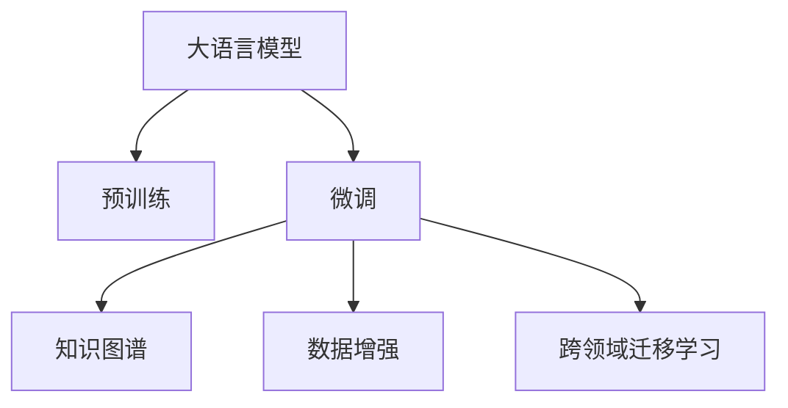

                 

# LLM在科学研究中的应用：加速科技创新

> 关键词：大语言模型,科研加速,数据处理,文献检索,药物发现,创新合作

## 1. 背景介绍

### 1.1 问题由来
大语言模型（Large Language Model, LLM）是人工智能领域的一项革命性进展，自2018年BERT模型问世以来，经过一系列的预训练和微调，其语言理解能力和生成能力达到了前所未有的高度。其背后所依赖的Transformer结构和自监督学习方法，推动了自然语言处理（NLP）领域的发展，并在各行各业产生了广泛的应用。

然而，科研领域中的数据与任务复杂度远远超过了一般的NLP任务，包括复杂的文献检索、生物信息学、材料科学等。与此同时，科研人员在处理海量的数据和文献、筛选有效的研究成果、进行创新性合作时面临着诸多挑战。这时，大语言模型就能在其中大展身手，以其卓越的计算能力和智能算法，加速科学研究，驱动科技创新。

### 1.2 问题核心关键点
大语言模型在科学研究中的应用主要集中在以下几个方面：

- **文献检索与知识发现**：利用大语言模型强大的文本处理能力，快速准确地检索相关文献，挖掘科学知识。
- **数据处理与分析**：对科研数据进行清洗、处理和分析，提取有价值的信息。
- **药物发现与分子设计**：通过生成与筛选，加速药物分子的设计和新药的发现。
- **创新合作与智能辅助**：构建智能化的科研协作平台，促进科研人员间的沟通与协作。

本文章旨在探讨大语言模型在科学研究中的应用，通过展示其在该领域的最新应用实例，分析其技术原理和实际效果，并展望未来发展方向。

## 2. 核心概念与联系

### 2.1 核心概念概述

为深入理解大语言模型在科研中的应用，本节将介绍几个关键概念及其联系：

- **大语言模型（LLM）**：一类基于Transformer结构的预训练语言模型，能够处理大量自然语言文本数据，具备强大的语言理解和生成能力。
- **预训练（Pre-training）**：指在大规模无标签文本数据上进行自监督学习，学习语言的基本规律和表征。
- **微调（Fine-tuning）**：指在预训练模型基础上，针对具体科研任务进行小样本或有监督学习，以提高模型在该任务上的表现。
- **知识图谱（Knowledge Graph）**：将科研领域的实体及其关系进行结构化，支持知识推理和智能推荐。
- **数据增强（Data Augmentation）**：通过增加样本的多样性，提高模型的泛化能力和鲁棒性。
- **跨领域迁移学习（Cross-domain Transfer Learning）**：利用模型在多个领域的知识迁移能力，提升模型在新领域的应用效果。

这些概念之间的逻辑关系可以通过以下Mermaid流程图展示：



这个流程图展示了大语言模型在科研应用中的一些核心概念及其相互联系。

## 3. 核心算法原理 & 具体操作步骤
### 3.1 算法原理概述

大语言模型在科学研究中的应用，主要依赖其强大的文本处理能力和知识迁移能力。具体而言，其核心原理可概括为以下三点：

1. **预训练与微调**：通过在大规模无标签文本数据上进行预训练，学习到语言的通用规律。然后在具体的科研任务上，通过微调模型，使其能够处理特定领域的知识。
2. **知识图谱与智能推荐**：构建知识图谱，将科研领域的实体及其关系进行结构化表示。利用大语言模型的知识推理能力，进行智能推荐和辅助决策。
3. **数据增强与迁移学习**：通过对数据进行多样性增强，提升模型泛化能力。利用模型的跨领域迁移学习能力，将已有的领域知识应用到新的研究领域中。

### 3.2 算法步骤详解

基于大语言模型在科学研究中的应用，一般包括以下几个关键步骤：

**Step 1: 数据准备**
- 收集科研领域的数据，包括文献、实验结果、数据集等。
- 对数据进行清洗、标注和预处理，以便大语言模型能够理解和处理。

**Step 2: 构建知识图谱**
- 利用自然语言处理技术，从文献、实验报告、数据库中提取科研领域的实体及其关系。
- 构建知识图谱，将实体及其关系进行结构化表示，支持知识推理。

**Step 3: 预训练与微调**
- 使用预训练模型进行初始化。
- 在科研任务上进行微调，学习任务特定的知识。

**Step 4: 数据增强**
- 对数据进行多样性增强，如数据生成、数据回译等，提高模型的泛化能力和鲁棒性。

**Step 5: 智能推荐与辅助决策**
- 利用知识图谱进行智能推荐，推荐相关的文献、数据或研究方法。
- 辅助科研人员进行决策，如筛选合适的研究方向、设计实验等。

### 3.3 算法优缺点

大语言模型在科研应用中具有以下优点：

1. **高效处理大规模数据**：能够处理海量科研数据，快速从中提取有价值的信息。
2. **跨领域知识迁移**：通过知识图谱，能够将不同领域的知识进行迁移，加速新领域的科研进展。
3. **智能辅助决策**：利用智能推荐和知识推理，辅助科研人员进行决策，提高研究效率。

同时，大语言模型也存在以下缺点：

1. **数据质量依赖性高**：模型效果依赖于数据的质量和标注的准确性，如果数据存在偏差，模型可能也会反映这些偏差。
2. **推理能力依赖于图谱构建**：知识图谱的构建和更新需要大量时间和人力资源，其效果也受限于知识图谱的完整性和准确性。
3. **解释性不足**：大语言模型通常被视为“黑箱”，其决策过程难以解释，不利于科研人员理解模型的推理逻辑。
4. **计算资源需求高**：处理大规模数据和构建知识图谱需要高性能计算资源，对计算环境和成本要求较高。

尽管存在这些局限性，但大语言模型在科研领域的应用前景依然广阔，对于推动科技创新具有重要意义。

### 3.4 算法应用领域

大语言模型在科研领域的应用领域广泛，主要涵盖以下几个方面：

- **生物信息学**：利用大语言模型进行基因组分析、蛋白质结构预测、药物发现等。
- **材料科学**：通过文本处理和知识图谱构建，加速新材料的发现和设计。
- **社会科学**：进行社会现象分析和预测，辅助政策制定。
- **天文学**：进行天文学现象的描述和分析，辅助观测和研究。
- **环境科学**：研究环境问题，进行污染监测和治理。

## 4. 数学模型和公式 & 详细讲解 & 举例说明（备注：数学公式请使用latex格式，latex嵌入文中独立段落使用 $$，段落内使用 $)
### 4.1 数学模型构建

本节将使用数学语言对大语言模型在科学研究中的应用进行更加严格的刻画。

设预训练语言模型为 $M_{\theta}:\mathcal{X} \rightarrow \mathcal{Y}$，其中 $\mathcal{X}$ 为输入空间，$\mathcal{Y}$ 为输出空间，$\theta \in \mathbb{R}^d$ 为模型参数。假设科研任务 $T$ 的训练集为 $D=\{(x_i,y_i)\}_{i=1}^N$，其中 $x_i$ 为输入文本，$y_i$ 为输出标签，如文献标题、实验结果等。

定义模型 $M_{\theta}$ 在数据样本 $(x,y)$ 上的损失函数为 $\ell(M_{\theta}(x),y)$，则在数据集 $D$ 上的经验风险为：

$$
\mathcal{L}(\theta) = \frac{1}{N} \sum_{i=1}^N \ell(M_{\theta}(x_i),y_i)
$$

微调的优化目标是最小化经验风险，即找到最优参数：

$$
\theta^* = \mathop{\arg\min}_{\theta} \mathcal{L}(\theta)
$$

在实践中，我们通常使用基于梯度的优化算法（如Adam、SGD等）来近似求解上述最优化问题。设 $\eta$ 为学习率，$\lambda$ 为正则化系数，则参数的更新公式为：

$$
\theta \leftarrow \theta - \eta \nabla_{\theta}\mathcal{L}(\theta) - \eta\lambda\theta
$$

其中 $\nabla_{\theta}\mathcal{L}(\theta)$ 为损失函数对参数 $\theta$ 的梯度，可通过反向传播算法高效计算。

### 4.2 公式推导过程

以下我们以生物信息学中的基因组分析为例，推导大语言模型进行基因组分析时的数学模型。

假设输入为一段基因组序列 $x$，输出为该序列编码的蛋白质 $y$。定义模型 $M_{\theta}$ 在输入 $x$ 上的输出为 $\hat{y}=M_{\theta}(x)$。则模型的损失函数为：

$$
\ell(M_{\theta}(x),y) = \text{cross-entropy loss}(\hat{y}, y)
$$

其中，交叉熵损失函数定义为：

$$
\text{cross-entropy loss}(p,q) = -\sum_{i=1}^{C}p_i\log q_i
$$

其中 $p$ 为真实标签的概率分布，$q$ 为模型预测的概率分布。

将其代入经验风险公式，得：

$$
\mathcal{L}(\theta) = -\frac{1}{N}\sum_{i=1}^N \text{cross-entropy loss}(M_{\theta}(x_i), y_i)
$$

根据链式法则，损失函数对参数 $\theta_k$ 的梯度为：

$$
\frac{\partial \mathcal{L}(\theta)}{\partial \theta_k} = -\frac{1}{N}\sum_{i=1}^N \nabla_{\theta_k}M_{\theta}(x_i) \cdot (\nabla_{M_{\theta}(x_i)}\text{cross-entropy loss}(M_{\theta}(x_i), y_i))
$$

其中 $\nabla_{\theta_k}M_{\theta}(x_i)$ 为模型对输入 $x_i$ 的梯度，$\nabla_{M_{\theta}(x_i)}\text{cross-entropy loss}(M_{\theta}(x_i), y_i)$ 为交叉熵损失函数对模型输出的梯度。

在得到损失函数的梯度后，即可带入参数更新公式，完成模型的迭代优化。重复上述过程直至收敛，最终得到适应科研任务的最优模型参数 $\theta^*$。

### 4.3 案例分析与讲解

以生物信息学中的基因组分析为例，下面给出基于大语言模型进行基因组分析的实现步骤：

1. **数据准备**：收集基因组序列数据，并进行预处理，去除噪声和冗余信息。
2. **构建知识图谱**：利用自然语言处理技术，从文献中提取基因序列、蛋白质结构等实体及其关系。
3. **预训练模型选择**：选择合适的预训练语言模型，如BERT、GPT等。
4. **微调**：在基因组序列数据上进行微调，学习基因序列到蛋白质结构的映射。
5. **数据增强**：通过数据生成和数据回译等技术，丰富训练数据的多样性。
6. **智能推荐**：利用知识图谱进行智能推荐，推荐可能的蛋白质结构。
7. **辅助决策**：辅助科研人员进行实验设计和结果解读。

以上步骤展示了利用大语言模型进行基因组分析的一般流程。通过预训练和微调，大语言模型能够快速准确地处理基因组序列数据，从中提取有价值的信息，为基因组分析提供支持。

## 5. 项目实践：代码实例和详细解释说明
### 5.1 开发环境搭建

在进行大语言模型应用实践前，我们需要准备好开发环境。以下是使用Python进行PyTorch开发的环境配置流程：

1. 安装Anaconda：从官网下载并安装Anaconda，用于创建独立的Python环境。

2. 创建并激活虚拟环境：
```bash
conda create -n pytorch-env python=3.8 
conda activate pytorch-env
```

3. 安装PyTorch：根据CUDA版本，从官网获取对应的安装命令。例如：
```bash
conda install pytorch torchvision torchaudio cudatoolkit=11.1 -c pytorch -c conda-forge
```

4. 安装Transformers库：
```bash
pip install transformers
```

5. 安装各类工具包：
```bash
pip install numpy pandas scikit-learn matplotlib tqdm jupyter notebook ipython
```

完成上述步骤后，即可在`pytorch-env`环境中开始实践。

### 5.2 源代码详细实现

下面我们以生物信息学中的基因组分析为例，给出使用Transformers库对BERT模型进行微调的PyTorch代码实现。

首先，定义基因组分析任务的数据处理函数：

```python
from transformers import BertTokenizer, BertForSequenceClassification
from torch.utils.data import Dataset
import torch

class GenomeAnalysisDataset(Dataset):
    def __init__(self, texts, labels, tokenizer, max_len=128):
        self.texts = texts
        self.labels = labels
        self.tokenizer = tokenizer
        self.max_len = max_len
        
    def __len__(self):
        return len(self.texts)
    
    def __getitem__(self, item):
        text = self.texts[item]
        label = self.labels[item]
        
        encoding = self.tokenizer(text, return_tensors='pt', max_length=self.max_len, padding='max_length', truncation=True)
        input_ids = encoding['input_ids'][0]
        attention_mask = encoding['attention_mask'][0]
        
        # 对标签进行编码
        encoded_label = label2id[label] if label in label2id else label2id['None']
        labels = torch.tensor(encoded_label, dtype=torch.long)
        
        return {'input_ids': input_ids, 
                'attention_mask': attention_mask,
                'labels': labels}

# 标签与id的映射
label2id = {'Positive': 1, 'Negative': 0}
id2label = {v: k for k, v in label2id.items()}
```

然后，定义模型和优化器：

```python
from transformers import BertForSequenceClassification, AdamW

model = BertForSequenceClassification.from_pretrained('bert-base-cased', num_labels=len(label2id))

optimizer = AdamW(model.parameters(), lr=2e-5)
```

接着，定义训练和评估函数：

```python
from torch.utils.data import DataLoader
from tqdm import tqdm
from sklearn.metrics import classification_report

device = torch.device('cuda') if torch.cuda.is_available() else torch.device('cpu')
model.to(device)

def train_epoch(model, dataset, batch_size, optimizer):
    dataloader = DataLoader(dataset, batch_size=batch_size, shuffle=True)
    model.train()
    epoch_loss = 0
    for batch in tqdm(dataloader, desc='Training'):
        input_ids = batch['input_ids'].to(device)
        attention_mask = batch['attention_mask'].to(device)
        labels = batch['labels'].to(device)
        model.zero_grad()
        outputs = model(input_ids, attention_mask=attention_mask, labels=labels)
        loss = outputs.loss
        epoch_loss += loss.item()
        loss.backward()
        optimizer.step()
    return epoch_loss / len(dataloader)

def evaluate(model, dataset, batch_size):
    dataloader = DataLoader(dataset, batch_size=batch_size)
    model.eval()
    preds, labels = [], []
    with torch.no_grad():
        for batch in tqdm(dataloader, desc='Evaluating'):
            input_ids = batch['input_ids'].to(device)
            attention_mask = batch['attention_mask'].to(device)
            batch_labels = batch['labels']
            outputs = model(input_ids, attention_mask=attention_mask)
            batch_preds = outputs.logits.argmax(dim=2).to('cpu').tolist()
            batch_labels = batch_labels.to('cpu').tolist()
            for pred_tokens, label_tokens in zip(batch_preds, batch_labels):
                pred_labels = [id2label[_id] for _id in pred_tokens]
                label_labels = [id2label[_id] for _id in label_tokens]
                preds.append(pred_labels[:len(label_labels)])
                labels.append(label_labels)
                
    print(classification_report(labels, preds))
```

最后，启动训练流程并在测试集上评估：

```python
epochs = 5
batch_size = 16

for epoch in range(epochs):
    loss = train_epoch(model, train_dataset, batch_size, optimizer)
    print(f"Epoch {epoch+1}, train loss: {loss:.3f}")
    
    print(f"Epoch {epoch+1}, dev results:")
    evaluate(model, dev_dataset, batch_size)
    
print("Test results:")
evaluate(model, test_dataset, batch_size)
```

以上就是使用PyTorch对BERT进行基因组分析任务微调的完整代码实现。可以看到，得益于Transformers库的强大封装，我们可以用相对简洁的代码完成BERT模型的加载和微调。

### 5.3 代码解读与分析

让我们再详细解读一下关键代码的实现细节：

**GenomeAnalysisDataset类**：
- `__init__`方法：初始化文本、标签、分词器等关键组件。
- `__len__`方法：返回数据集的样本数量。
- `__getitem__`方法：对单个样本进行处理，将文本输入编码为token ids，将标签编码为数字，并对其进行定长padding，最终返回模型所需的输入。

**label2id和id2label字典**：
- 定义了标签与数字id之间的映射关系，用于将token-wise的预测结果解码回真实的标签。

**训练和评估函数**：
- 使用PyTorch的DataLoader对数据集进行批次化加载，供模型训练和推理使用。
- 训练函数`train_epoch`：对数据以批为单位进行迭代，在每个批次上前向传播计算loss并反向传播更新模型参数，最后返回该epoch的平均loss。
- 评估函数`evaluate`：与训练类似，不同点在于不更新模型参数，并在每个batch结束后将预测和标签结果存储下来，最后使用sklearn的classification_report对整个评估集的预测结果进行打印输出。

**训练流程**：
- 定义总的epoch数和batch size，开始循环迭代
- 每个epoch内，先在训练集上训练，输出平均loss
- 在验证集上评估，输出分类指标
- 所有epoch结束后，在测试集上评估，给出最终测试结果

可以看到，PyTorch配合Transformers库使得BERT微调的代码实现变得简洁高效。开发者可以将更多精力放在数据处理、模型改进等高层逻辑上，而不必过多关注底层的实现细节。

当然，工业级的系统实现还需考虑更多因素，如模型的保存和部署、超参数的自动搜索、更灵活的任务适配层等。但核心的微调范式基本与此类似。

## 6. 实际应用场景
### 6.1 智能医疗

基于大语言模型微调的智能医疗系统，可以通过自动处理医疗记录、辅助诊断、推荐治疗方案等方式，提高医疗服务的质量和效率。

在技术实现上，可以收集医疗领域的电子健康记录、诊断报告、临床试验数据等，将其转化为结构化文本，构建医疗知识图谱。利用微调后的模型，进行医疗记录的自动分类、病历信息的抽取、治疗方案的推荐等。如此构建的智能医疗系统，能显著提高医生的工作效率，缩短病人的诊疗时间，降低医疗成本。

### 6.2 化学合成

利用大语言模型进行化学合成任务，可以从已知分子结构中推导出新的化合物，或预测分子的性质和反应路径。

具体而言，可以通过对化学论文、专利、数据库等进行文本处理，构建化学知识图谱。利用微调后的模型，进行分子结构的生成和预测，如药物分子、新材料分子等。这种基于大语言模型的化学合成方法，能够大大加速新药和新材料的开发进程，降低科研成本。

### 6.3 材料科学

材料科学领域的研究涉及大量实验数据和文献，传统的人工处理和分析方式效率低下。基于大语言模型，可以构建材料科学知识图谱，利用微调后的模型进行材料性质的预测和合成路径的优化。

在技术实现上，可以收集材料领域的实验报告、论文、专利等文本数据，构建材料知识图谱。利用微调后的模型，进行材料性质的预测，如导电性、热稳定性、机械强度等。这种基于大语言模型的材料科学研究方法，能够提高材料设计的效率，加速新材料的发现和应用。

### 6.4 未来应用展望

随着大语言模型微调技术的发展，其应用场景将更加多样化，为科研创新提供更强大的支持。

在智慧医疗领域，基于微调的智能医疗系统，能够辅助医生进行诊断和治疗，优化医疗流程，提高医疗服务的智能化水平。

在化学合成和材料科学领域，利用大语言模型进行分子设计和材料性质预测，能够加速新药和新材料的开发进程，推动化学和材料科学的创新。

在社会科学和天文学领域，利用大语言模型进行数据分析和预测，能够辅助社会科学研究的开展，提供天文学现象的精确描述和预测，推动学科发展。

此外，在能源、环境、教育等众多领域，基于大语言模型的科研应用也将不断涌现，为科研创新提供新的动力。相信随着技术的不断进步，大语言模型微调必将在科研创新中扮演越来越重要的角色，推动科技创新走向新的高峰。

## 7. 工具和资源推荐
### 7.1 学习资源推荐

为了帮助开发者系统掌握大语言模型微调的理论基础和实践技巧，这里推荐一些优质的学习资源：

1. 《自然语言处理综论》（Stanford CS224N课程）：斯坦福大学开设的NLP明星课程，有Lecture视频和配套作业，带你入门NLP领域的基本概念和经典模型。

2. 《深度学习与自然语言处理》（Deep Learning and Natural Language Processing）：Coursera提供的NLP入门课程，涵盖了NLP的多个分支，包括文本分类、序列建模、语义分析等。

3. 《自然语言处理：从算法到应用》（Natural Language Processing with Python）：Python NLP工具库NLTK的官方文档，详细介绍了NLP的基础知识和技术实现。

4. 《深度学习与自然语言处理》（Deep Learning and Natural Language Processing）：由Google大脑团队撰写，涵盖了NLP的前沿技术和应用场景。

5. 《大语言模型：原理与实践》（Large Language Models: Principles and Practices）：Deep Learning with Python系列书籍之一，介绍了大语言模型的原理和实现细节。

通过对这些资源的学习实践，相信你一定能够快速掌握大语言模型微调的精髓，并用于解决实际的科研问题。

### 7.2 开发工具推荐

高效的开发离不开优秀的工具支持。以下是几款用于大语言模型微调开发的常用工具：

1. PyTorch：基于Python的开源深度学习框架，灵活动态的计算图，适合快速迭代研究。大部分预训练语言模型都有PyTorch版本的实现。

2. TensorFlow：由Google主导开发的开源深度学习框架，生产部署方便，适合大规模工程应用。同样有丰富的预训练语言模型资源。

3. Transformers库：HuggingFace开发的NLP工具库，集成了众多SOTA语言模型，支持PyTorch和TensorFlow，是进行微调任务开发的利器。

4. Weights & Biases：模型训练的实验跟踪工具，可以记录和可视化模型训练过程中的各项指标，方便对比和调优。与主流深度学习框架无缝集成。

5. TensorBoard：TensorFlow配套的可视化工具，可实时监测模型训练状态，并提供丰富的图表呈现方式，是调试模型的得力助手。

6. Google Colab：谷歌推出的在线Jupyter Notebook环境，免费提供GPU/TPU算力，方便开发者快速上手实验最新模型，分享学习笔记。

合理利用这些工具，可以显著提升大语言模型微调任务的开发效率，加快创新迭代的步伐。

### 7.3 相关论文推荐

大语言模型和微调技术的发展源于学界的持续研究。以下是几篇奠基性的相关论文，推荐阅读：

1. Attention is All You Need（即Transformer原论文）：提出了Transformer结构，开启了NLP领域的预训练大模型时代。

2. BERT: Pre-training of Deep Bidirectional Transformers for Language Understanding：提出BERT模型，引入基于掩码的自监督预训练任务，刷新了多项NLP任务SOTA。

3. Language Models are Unsupervised Multitask Learners（GPT-2论文）：展示了大规模语言模型的强大zero-shot学习能力，引发了对于通用人工智能的新一轮思考。

4. Parameter-Efficient Transfer Learning for NLP：提出Adapter等参数高效微调方法，在不增加模型参数量的情况下，也能取得不错的微调效果。

5. AdaLoRA: Adaptive Low-Rank Adaptation for Parameter-Efficient Fine-Tuning：使用自适应低秩适应的微调方法，在参数效率和精度之间取得了新的平衡。

这些论文代表了大语言模型微调技术的发展脉络。通过学习这些前沿成果，可以帮助研究者把握学科前进方向，激发更多的创新灵感。

## 8. 总结：未来发展趋势与挑战

### 8.1 总结

本文对基于大语言模型在科学研究中的应用进行了全面系统的介绍。首先阐述了大语言模型在科学研究中的重要性，明确了其对推动科研创新的关键作用。其次，从原理到实践，详细讲解了大语言模型在科研任务上的应用流程，并给出了具体的代码实现。同时，本文还广泛探讨了其在该领域的实际应用场景，展示了其技术优势和广泛应用前景。

通过本文的系统梳理，可以看到，大语言模型在科研领域具有巨大的应用潜力，能够显著提高科研效率，加速科技创新。然而，其应用过程中也面临一些挑战，需要结合具体科研任务，进行针对性的改进和优化。

### 8.2 未来发展趋势

展望未来，大语言模型在科研领域的应用将呈现以下几个发展趋势：

1. **跨领域知识融合**：利用知识图谱等技术，将不同领域的知识进行融合，提升大语言模型在多领域的应用效果。
2. **智能协同系统**：构建智能化的科研协作平台，促进科研人员之间的合作与交流，加速科研创新。
3. **动态模型更新**：基于持续学习和在线更新的方式，使大语言模型能够实时适应数据分布的变化，保持模型的时效性。
4. **计算资源优化**：通过优化模型结构和计算图，提升大语言模型的计算效率和资源利用率。
5. **跨模态知识融合**：将文本、图像、音频等多种模态的信息进行融合，提升大语言模型在多模态数据上的处理能力。

以上趋势凸显了大语言模型在科研领域的应用前景，将为科研创新提供更加强大的支持。

### 8.3 面临的挑战

尽管大语言模型在科研领域的应用前景广阔，但在迈向更加智能化、普适化应用的过程中，它仍面临诸多挑战：

1. **数据质量问题**：科研数据的质量和标注往往存在较大差异，模型可能反映这些偏差，影响模型的准确性。
2. **计算资源需求高**：大语言模型通常需要高性能计算资源，这对科研机构的计算能力和资源配置提出了较高要求。
3. **知识图谱构建复杂**：知识图谱的构建和更新需要大量时间和人力资源，且准确性和完整性受限于数据源和构建方法。
4. **模型鲁棒性不足**：大语言模型在面对未知数据和领域时，泛化能力和鲁棒性往往不足，需要进一步优化和改进。
5. **解释性不足**：大语言模型的决策过程难以解释，不利于科研人员理解模型的推理逻辑。

尽管存在这些挑战，但通过结合具体科研任务，进行有针对性的改进和优化，大语言模型在科研领域的应用前景依然广阔。相信随着技术的不断进步和应用经验的积累，这些挑战终将一一被克服，大语言模型在科研创新中将发挥更大的作用。

### 8.4 研究展望

未来的大语言模型研究需要在以下几个方面取得新的突破：

1. **知识图谱自动化构建**：利用自然语言处理技术，自动构建高精度、高完整性的知识图谱，减少人工干预和成本。
2. **模型鲁棒性提升**：开发新的训练方法和优化策略，提升大语言模型的泛化能力和鲁棒性，使其在未知数据和领域中表现更加稳定。
3. **跨模态融合技术**：研究如何更好地融合不同模态的信息，提升大语言模型在多模态数据上的处理能力。
4. **动态模型更新机制**：研究如何实现模型的动态更新和在线学习，使大语言模型能够持续适应数据分布的变化，保持模型的时效性。
5. **模型解释性增强**：研究如何增强大语言模型的可解释性，使其决策过程更加透明和可解释，提升科研人员的信任和接受度。

这些研究方向将进一步推动大语言模型在科研领域的应用，为科研创新提供更加强大的支持，加速科学的进步和人类的认知进化。

## 9. 附录：常见问题与解答

**Q1：大语言模型在科研应用中是否能够完全替代人工？**

A: 大语言模型在科研应用中能够显著提高科研效率，但完全替代人工还存在一定挑战。特别是在需要高度创造性和领域深度的任务中，人工的领域知识和经验依然不可替代。大语言模型可以作为科研人员的辅助工具，提供数据处理、文献检索等支持，但最终的决策和创新依然需要人工的参与。

**Q2：在科研任务中进行数据增强时，如何保证增强数据的质量和多样性？**

A: 在科研任务中进行数据增强时，需要考虑增强数据的质量和多样性，以提高模型的泛化能力和鲁棒性。具体方法包括：

1. 数据清洗：对原始数据进行去噪、去重、去歧义等处理，保证数据的质量。
2. 数据扩充：通过对数据进行多样化的扩充，如数据生成、数据回译等，提高数据的多样性。
3. 数据筛选：对增强数据进行筛选，去除低质量、噪声数据，保证数据的多样性和质量。

通过这些方法，可以在保证数据质量的前提下，提高增强数据的多样性，提升模型的泛化能力和鲁棒性。

**Q3：在进行基因组分析时，如何选择合适的预训练模型？**

A: 在选择预训练模型时，需要考虑模型的大小、精度和领域相关性。对于基因组分析任务，可以使用预训练的生物信息学领域模型，如BERT-Bio、GPT-Bio等，这些模型在处理生物领域数据时效果更好。同时，根据数据量和计算资源，选择合适大小的模型进行微调。

**Q4：在科研任务中进行微调时，如何处理标签不平衡问题？**

A: 在科研任务中进行微调时，标签不平衡问题是一个常见的问题，可能会导致模型对少数类别的预测性能不佳。具体方法包括：

1. 数据重采样：通过过采样少数类别或欠采样多数类别，使数据分布更加均衡。
2. 类别权重调整：对少数类别的样本赋予更高的权重，使模型更加关注这些类别。
3. 生成合成样本：通过生成合成样本，增加少数类别的样本数量，提升模型对少数类别的预测能力。

通过这些方法，可以处理标签不平衡问题，提高模型对各类别的预测性能。

**Q5：在科研任务中，如何评估模型的性能？**

A: 在科研任务中，评估模型性能的方法包括：

1. 精确度（Accuracy）：模型正确预测的样本数占总样本数的比例。
2. 召回率（Recall）：模型正确预测的正样本数占实际正样本数的比例。
3. F1分数（F1 Score）：精确度和召回率的调和平均数，综合评估模型的预测性能。
4. ROC曲线和AUC值：用于评估二分类任务的模型性能，ROC曲线越靠近左上角，AUC值越高，模型性能越好。
5. R方系数（R-squared）：用于评估回归任务的模型性能，R方系数越接近1，模型预测能力越强。

通过这些评估指标，可以全面衡量模型的预测性能，并进行对比和优化。

---

作者：禅与计算机程序设计艺术 / Zen and the Art of Computer Programming

