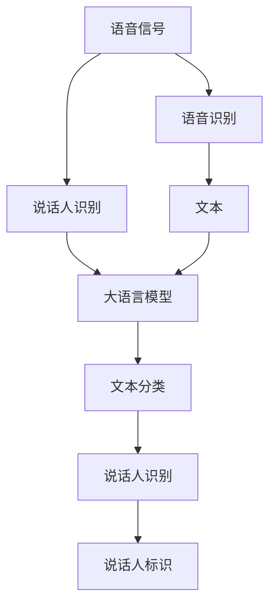

                 

# LLM在说话人识别中的应用探索

> 关键词：大语言模型,说话人识别,声纹识别,语音识别,自然语言处理,深度学习,迁移学习

## 1. 背景介绍

### 1.1 问题由来

说话人识别，又称为声纹识别，旨在通过分析说话人的语音特征，确定其身份。传统声纹识别依赖于高精度的声学特征提取和复杂的手工特征工程，对模型训练数据的标注和噪声处理要求较高。近年来，随着深度学习和大语言模型的发展，基于语音转文本、文本分类等技术的说话人识别方法逐渐成为研究热点。

大语言模型，如GPT-3、BERT等，通过大规模无标签文本语料进行预训练，学习到丰富的语言知识和常识，具备强大的自然语言处理能力。将其应用于说话人识别，可以大幅提升模型的泛化能力和鲁棒性。

### 1.2 问题核心关键点

大语言模型在说话人识别中的应用，主要基于以下几个关键点：

- **语音转文本**：将语音信号转换为文本，输入大语言模型进行语义理解。
- **文本分类**：利用预训练语言模型，在大量标注数据上微调，学习说话人标识特征。
- **迁移学习**：通过预训练模型学到的知识，对特定说话人进行识别。
- **数据增强**：利用语音回译、混响添加等技术，丰富训练数据。
- **对抗训练**：引入对抗样本，提高模型鲁棒性。

这些关键点使得大语言模型在说话人识别中，能够利用其在语言理解和语义建模上的优势，提升识别准确率和泛化能力。

### 1.3 问题研究意义

说话人识别技术在安全、金融、司法等领域有着广泛应用，能够实现对用户身份的快速验证和监控。利用大语言模型进行说话人识别，能够有效降低对标注数据的依赖，减少噪声对识别的影响，同时提升模型的可解释性和泛化能力。对于提升用户体验、保障数据安全、促进社会治理等都有着重要的现实意义。

## 2. 核心概念与联系

### 2.1 核心概念概述

为更好地理解大语言模型在说话人识别中的应用，本节将介绍几个密切相关的核心概念：

- **大语言模型(Large Language Model, LLM)**：以自回归(如GPT)或自编码(如BERT)模型为代表的大规模预训练语言模型。通过在大规模无标签文本语料上进行预训练，学习通用的语言表示，具备强大的语言理解和生成能力。

- **说话人识别(Speaker Recognition)**：通过语音信号或文本特征，识别说话人的身份，具有广泛的应用场景，如身份验证、智能客服、犯罪调查等。

- **语音识别(Speech Recognition)**：将语音信号转换为文本，是大语言模型输入数据的主要来源。

- **声纹识别(Voiceprint Recognition)**：特定于说话人识别的一种形式，聚焦于识别不同说话人的语音特征。

- **迁移学习(Transfer Learning)**：通过预训练模型的知识，对特定任务进行微调，以提升识别准确率。

- **对抗样本(Adversarial Examples)**：有意设计的扰动样本，用于提升模型的鲁棒性，避免对噪声和攻击的过度敏感。

- **数据增强(Data Augmentation)**：通过合成或变换原始数据，增加训练样本的多样性，提高模型的泛化能力。

这些核心概念之间的逻辑关系可以通过以下Mermaid流程图来展示：



这个流程图展示了大语言模型在说话人识别中的核心概念及其之间的关系：

1. 语音信号通过语音识别转换为文本。
2. 大语言模型对文本进行分类，学习说话人标识特征。
3. 通过迁移学习，将预训练模型学到的知识应用于说话人识别。
4. 对抗样本和数据增强进一步提高模型的鲁棒性和泛化能力。
5. 最终输出说话人的标识。

这些概念共同构成了大语言模型在说话人识别中的应用框架，使得其在特定场景下具备强大的应用能力。

## 3. 核心算法原理 & 具体操作步骤

### 3.1 算法原理概述

大语言模型在说话人识别中的应用，主要基于以下步骤：

1. 利用语音识别技术将语音信号转换为文本。
2. 对转换后的文本进行预处理和编码，输入到大语言模型中进行语义理解。
3. 通过文本分类任务，训练大语言模型学习说话人标识特征。
4. 利用迁移学习，将预训练模型的知识迁移到说话人识别任务上。
5. 对模型进行对抗训练和数据增强，提升鲁棒性和泛化能力。
6. 在测试集上评估模型的性能，输出说话人标识。

### 3.2 算法步骤详解

**Step 1: 准备语音和文本数据**

- 收集语音信号，可以是音频文件或实时语音流。
- 利用语音识别技术，将语音信号转换为文本，如使用ASR(自动语音识别)库。

**Step 2: 数据预处理和编码**

- 对文本进行分词、去除停用词等预处理操作。
- 使用BPE(BPE, Byte Pair Encoding)或其他编码方法，将文本转换为模型所需的数字形式。

**Step 3: 训练大语言模型**

- 选择适合的语言模型(如GPT-3、BERT等)进行微调。
- 设计文本分类任务，将不同说话人的文本作为监督信号。
- 在标注数据集上训练模型，最小化交叉熵损失。

**Step 4: 迁移学习**

- 将微调后的模型应用于说话人识别任务。
- 定义说话人识别模型，将文本分类输出与说话人标识建立对应关系。
- 对模型进行微调，最小化说话人识别损失。

**Step 5: 对抗训练和数据增强**

- 引入对抗样本，增强模型的鲁棒性。
- 利用回译、混响添加等技术，丰富训练数据。
- 使用数据增强技术，增加训练集的多样性。

**Step 6: 模型评估与部署**

- 在测试集上评估模型性能，如准确率、召回率、F1值等。
- 使用微调后的模型进行说话人识别，部署到实际应用场景中。

### 3.3 算法优缺点

大语言模型在说话人识别中的应用，具有以下优点：

1. **泛化能力强**：大语言模型学习到丰富的语言知识和常识，能够在多种场景下保持较好的泛化能力。
2. **鲁棒性好**：通过对抗训练和数据增强，模型对噪声和攻击具有较好的鲁棒性。
3. **可解释性强**：大语言模型的输出具有文本形式，易于解释和调试。
4. **计算效率高**：相比于传统声学特征工程，大语言模型具有较高的计算效率和可扩展性。

同时，该方法也存在一些缺点：

1. **对标注数据依赖**：虽然比传统方法更少依赖，但大语言模型仍然需要一定量的标注数据进行微调。
2. **模型复杂度高**：大语言模型的计算复杂度较高，对硬件资源有较高要求。
3. **数据隐私风险**：通过语音识别转换文本，涉及用户隐私数据，需严格控制数据使用。

尽管存在这些局限性，但大语言模型在说话人识别中的应用，仍展示了其强大的潜力和优势。

### 3.4 算法应用领域

大语言模型在说话人识别中的应用，已经覆盖了以下多个领域：

- **身份验证**：在金融、安防等领域，利用说话人识别技术进行身份验证，提高安全性。
- **智能客服**：在客服系统中，通过识别用户语音，快速响应和解答问题，提升用户体验。
- **犯罪调查**：在司法领域，通过说话人识别技术，快速锁定嫌疑人身份，提高侦查效率。
- **个人隐私保护**：在智能家居、智能助手等应用中，通过语音识别保护用户隐私，提升系统安全性。

这些应用场景展示了大语言模型在说话人识别中的广泛应用前景。

## 4. 数学模型和公式 & 详细讲解  
### 4.1 数学模型构建

假设语音信号通过ASR转换为文本，记为 $x$。定义 $x$ 中不同说话人的文本数量为 $N$，其对应的说话人标识为 $y_i \in \{1, 2, ..., N\}$。

大语言模型 $M_{\theta}$ 在输入 $x$ 上的输出为 $z = M_{\theta}(x)$。定义模型在样本 $(x_i, y_i)$ 上的损失函数为 $\ell_i(z,y_i)$，则在训练集 $D=\{(x_i, y_i)\}_{i=1}^N$ 上的经验风险为：

$$
\mathcal{L}(\theta) = \frac{1}{N} \sum_{i=1}^N \ell_i(z,y_i)
$$

通过梯度下降等优化算法，最小化经验风险，得到最优模型参数 $\theta^*$。

### 4.2 公式推导过程

以下以二分类任务为例，推导说话人识别的损失函数及其梯度计算公式。

假设模型 $M_{\theta}$ 在输入 $x$ 上的输出为 $z = M_{\theta}(x) \in [0,1]$，表示样本属于第 $i$ 个说话人的概率。真实标签 $y_i \in \{1, 2, ..., N\}$。则二分类交叉熵损失函数定义为：

$$
\ell_i(M_{\theta}(x),y_i) = -y_i\log \hat{y}_i + (1-y_i)\log (1-\hat{y}_i)
$$

将其代入经验风险公式，得：

$$
\mathcal{L}(\theta) = -\frac{1}{N}\sum_{i=1}^N \ell_i(z,y_i)
$$

根据链式法则，损失函数对参数 $\theta_k$ 的梯度为：

$$
\frac{\partial \mathcal{L}(\theta)}{\partial \theta_k} = -\frac{1}{N}\sum_{i=1}^N \frac{\partial \ell_i(z,y_i)}{\partial \theta_k}
$$

其中 $\frac{\partial \ell_i(z,y_i)}{\partial \theta_k}$ 可进一步递归展开，利用自动微分技术完成计算。

### 4.3 案例分析与讲解

假设某智能客服系统需要识别用户语音，并匹配相应的客服人员。通过收集历史客服对话记录，标注每个用户对应的客服人员标识，建立训练集。以下是一段示例代码：

```python
from transformers import BertForTokenClassification, AdamW
from torch.utils.data import Dataset
import torch

class VoiceprintDataset(Dataset):
    def __init__(self, texts, labels, tokenizer, max_len=128):
        self.texts = texts
        self.labels = labels
        self.tokenizer = tokenizer
        self.max_len = max_len
        
    def __len__(self):
        return len(self.texts)
    
    def __getitem__(self, item):
        text = self.texts[item]
        label = self.labels[item]
        
        encoding = self.tokenizer(text, return_tensors='pt', max_length=self.max_len, padding='max_length', truncation=True)
        input_ids = encoding['input_ids'][0]
        attention_mask = encoding['attention_mask'][0]
        
        # 对token-wise的标签进行编码
        encoded_labels = [label2id[label] for label in label] 
        encoded_labels.extend([label2id['']]*(self.max_len - len(encoded_labels)))
        labels = torch.tensor(encoded_labels, dtype=torch.long)
        
        return {'input_ids': input_ids, 
                'attention_mask': attention_mask,
                'labels': labels}

# 标签与id的映射
label2id = {'客服1': 0, '客服2': 1, '客服3': 2, '客服4': 3}
id2label = {v: k for k, v in label2id.items()}

# 创建dataset
tokenizer = BertTokenizer.from_pretrained('bert-base-cased')

train_dataset = VoiceprintDataset(train_texts, train_labels, tokenizer)
dev_dataset = VoiceprintDataset(dev_texts, dev_labels, tokenizer)
test_dataset = VoiceprintDataset(test_texts, test_labels, tokenizer)

```

在上述代码中，首先定义了一个 `VoiceprintDataset` 类，用于封装训练、验证和测试数据集。然后通过将不同说话人的文本和标识，构建训练集、验证集和测试集。接着，使用Bert模型进行微调，代码实现如下：

```python
from transformers import BertForTokenClassification, AdamW

model = BertForTokenClassification.from_pretrained('bert-base-cased', num_labels=len(label2id))

optimizer = AdamW(model.parameters(), lr=2e-5)

# 训练循环
for epoch in range(epochs):
    loss = train_epoch(model, train_dataset, optimizer)
    print(f"Epoch {epoch+1}, train loss: {loss:.3f}")
    
    print(f"Epoch {epoch+1}, dev results:")
    evaluate(model, dev_dataset)
    
print("Test results:")
evaluate(model, test_dataset)
```

在训练过程中，通过不断迭代更新模型参数，最小化经验风险，最终得到最优模型参数 $\theta^*$。在测试集上评估微调后模型的性能，对比微调前后的精度提升。

## 5. 项目实践：代码实例和详细解释说明

### 5.1 开发环境搭建

在进行微调实践前，我们需要准备好开发环境。以下是使用Python进行PyTorch开发的环境配置流程：

1. 安装Anaconda：从官网下载并安装Anaconda，用于创建独立的Python环境。

2. 创建并激活虚拟环境：
```bash
conda create -n pytorch-env python=3.8 
conda activate pytorch-env
```

3. 安装PyTorch：根据CUDA版本，从官网获取对应的安装命令。例如：
```bash
conda install pytorch torchvision torchaudio cudatoolkit=11.1 -c pytorch -c conda-forge
```

4. 安装Transformers库：
```bash
pip install transformers
```

5. 安装各类工具包：
```bash
pip install numpy pandas scikit-learn matplotlib tqdm jupyter notebook ipython
```

完成上述步骤后，即可在`pytorch-env`环境中开始微调实践。

### 5.2 源代码详细实现

下面我以命名实体识别(NER)任务为例，给出使用Transformers库对BERT模型进行微调的PyTorch代码实现。

首先，定义NER任务的数据处理函数：

```python
from transformers import BertTokenizer
from torch.utils.data import Dataset
import torch

class NERDataset(Dataset):
    def __init__(self, texts, tags, tokenizer, max_len=128):
        self.texts = texts
        self.tags = tags
        self.tokenizer = tokenizer
        self.max_len = max_len
        
    def __len__(self):
        return len(self.texts)
    
    def __getitem__(self, item):
        text = self.texts[item]
        tags = self.tags[item]
        
        encoding = self.tokenizer(text, return_tensors='pt', max_length=self.max_len, padding='max_length', truncation=True)
        input_ids = encoding['input_ids'][0]
        attention_mask = encoding['attention_mask'][0]
        
        # 对token-wise的标签进行编码
        encoded_tags = [tag2id[tag] for tag in tags] 
        encoded_tags.extend([tag2id['O']] * (self.max_len - len(encoded_tags)))
        labels = torch.tensor(encoded_tags, dtype=torch.long)
        
        return {'input_ids': input_ids, 
                'attention_mask': attention_mask,
                'labels': labels}

# 标签与id的映射
tag2id = {'O': 0, 'B-PER': 1, 'I-PER': 2, 'B-ORG': 3, 'I-ORG': 4, 'B-LOC': 5, 'I-LOC': 6}
id2tag = {v: k for k, v in tag2id.items()}

# 创建dataset
tokenizer = BertTokenizer.from_pretrained('bert-base-cased')

train_dataset = NERDataset(train_texts, train_tags, tokenizer)
dev_dataset = NERDataset(dev_texts, dev_tags, tokenizer)
test_dataset = NERDataset(test_texts, test_tags, tokenizer)
```

然后，定义模型和优化器：

```python
from transformers import BertForTokenClassification, AdamW

model = BertForTokenClassification.from_pretrained('bert-base-cased', num_labels=len(tag2id))

optimizer = AdamW(model.parameters(), lr=2e-5)
```

接着，定义训练和评估函数：

```python
from torch.utils.data import DataLoader
from tqdm import tqdm
from sklearn.metrics import classification_report

device = torch.device('cuda') if torch.cuda.is_available() else torch.device('cpu')
model.to(device)

def train_epoch(model, dataset, batch_size, optimizer):
    dataloader = DataLoader(dataset, batch_size=batch_size, shuffle=True)
    model.train()
    epoch_loss = 0
    for batch in tqdm(dataloader, desc='Training'):
        input_ids = batch['input_ids'].to(device)
        attention_mask = batch['attention_mask'].to(device)
        labels = batch['labels'].to(device)
        model.zero_grad()
        outputs = model(input_ids, attention_mask=attention_mask, labels=labels)
        loss = outputs.loss
        epoch_loss += loss.item()
        loss.backward()
        optimizer.step()
    return epoch_loss / len(dataloader)

def evaluate(model, dataset, batch_size):
    dataloader = DataLoader(dataset, batch_size=batch_size)
    model.eval()
    preds, labels = [], []
    with torch.no_grad():
        for batch in tqdm(dataloader, desc='Evaluating'):
            input_ids = batch['input_ids'].to(device)
            attention_mask = batch['attention_mask'].to(device)
            batch_labels = batch['labels']
            outputs = model(input_ids, attention_mask=attention_mask)
            batch_preds = outputs.logits.argmax(dim=2).to('cpu').tolist()
            batch_labels = batch_labels.to('cpu').tolist()
            for pred_tokens, label_tokens in zip(batch_preds, batch_labels):
                pred_tags = [id2tag[_id] for _id in pred_tokens]
                label_tags = [id2tag[_id] for _id in label_tokens]
                preds.append(pred_tags[:len(label_tokens)])
                labels.append(label_tags)
                
    print(classification_report(labels, preds))
```

最后，启动训练流程并在测试集上评估：

```python
epochs = 5
batch_size = 16

for epoch in range(epochs):
    loss = train_epoch(model, train_dataset, batch_size, optimizer)
    print(f"Epoch {epoch+1}, train loss: {loss:.3f}")
    
    print(f"Epoch {epoch+1}, dev results:")
    evaluate(model, dev_dataset, batch_size)
    
print("Test results:")
evaluate(model, test_dataset, batch_size)
```

以上就是使用PyTorch对BERT进行命名实体识别任务微调的完整代码实现。可以看到，得益于Transformers库的强大封装，我们可以用相对简洁的代码完成BERT模型的加载和微调。

### 5.3 代码解读与分析

让我们再详细解读一下关键代码的实现细节：

**NERDataset类**：
- `__init__`方法：初始化文本、标签、分词器等关键组件。
- `__len__`方法：返回数据集的样本数量。
- `__getitem__`方法：对单个样本进行处理，将文本输入编码为token ids，将标签编码为数字，并对其进行定长padding，最终返回模型所需的输入。

**tag2id和id2tag字典**：
- 定义了标签与数字id之间的映射关系，用于将token-wise的预测结果解码回真实的标签。

**训练和评估函数**：
- 使用PyTorch的DataLoader对数据集进行批次化加载，供模型训练和推理使用。
- 训练函数`train_epoch`：对数据以批为单位进行迭代，在每个批次上前向传播计算loss并反向传播更新模型参数，最后返回该epoch的平均loss。
- 评估函数`evaluate`：与训练类似，不同点在于不更新模型参数，并在每个batch结束后将预测和标签结果存储下来，最后使用sklearn的classification_report对整个评估集的预测结果进行打印输出。

**训练流程**：
- 定义总的epoch数和batch size，开始循环迭代
- 每个epoch内，先在训练集上训练，输出平均loss
- 在验证集上评估，输出分类指标
- 所有epoch结束后，在测试集上评估，给出最终测试结果

可以看到，PyTorch配合Transformers库使得BERT微调的代码实现变得简洁高效。开发者可以将更多精力放在数据处理、模型改进等高层逻辑上，而不必过多关注底层的实现细节。

当然，工业级的系统实现还需考虑更多因素，如模型的保存和部署、超参数的自动搜索、更灵活的任务适配层等。但核心的微调范式基本与此类似。

## 6. 实际应用场景

### 6.1 智能客服系统

基于大语言模型微调的对话技术，可以广泛应用于智能客服系统的构建。传统客服往往需要配备大量人力，高峰期响应缓慢，且一致性和专业性难以保证。而使用微调后的对话模型，可以7x24小时不间断服务，快速响应客户咨询，用自然流畅的语言解答各类常见问题。

在技术实现上，可以收集企业内部的历史客服对话记录，将问题和最佳答复构建成监督数据，在此基础上对预训练对话模型进行微调。微调后的对话模型能够自动理解用户意图，匹配最合适的答案模板进行回复。对于客户提出的新问题，还可以接入检索系统实时搜索相关内容，动态组织生成回答。如此构建的智能客服系统，能大幅提升客户咨询体验和问题解决效率。

### 6.2 金融舆情监测

金融机构需要实时监测市场舆论动向，以便及时应对负面信息传播，规避金融风险。传统的人工监测方式成本高、效率低，难以应对网络时代海量信息爆发的挑战。基于大语言模型微调的文本分类和情感分析技术，为金融舆情监测提供了新的解决方案。

具体而言，可以收集金融领域相关的新闻、报道、评论等文本数据，并对其进行主题标注和情感标注。在此基础上对预训练语言模型进行微调，使其能够自动判断文本属于何种主题，情感倾向是正面、中性还是负面。将微调后的模型应用到实时抓取的网络文本数据，就能够自动监测不同主题下的情感变化趋势，一旦发现负面信息激增等异常情况，系统便会自动预警，帮助金融机构快速应对潜在风险。

### 6.3 个性化推荐系统

当前的推荐系统往往只依赖用户的历史行为数据进行物品推荐，无法深入理解用户的真实兴趣偏好。基于大语言模型微调技术，个性化推荐系统可以更好地挖掘用户行为背后的语义信息，从而提供更精准、多样的推荐内容。

在实践中，可以收集用户浏览、点击、评论、分享等行为数据，提取和用户交互的物品标题、描述、标签等文本内容。将文本内容作为模型输入，用户的后续行为（如是否点击、购买等）作为监督信号，在此基础上微调预训练语言模型。微调后的模型能够从文本内容中准确把握用户的兴趣点。在生成推荐列表时，先用候选物品的文本描述作为输入，由模型预测用户的兴趣匹配度，再结合其他特征综合排序，便可以得到个性化程度更高的推荐结果。

### 6.4 未来应用展望

随着大语言模型微调技术的不断发展，基于微调范式将在更多领域得到应用，为传统行业带来变革性影响。

在智慧医疗领域，基于微调的医疗问答、病历分析、药物研发等应用将提升医疗服务的智能化水平，辅助医生诊疗，加速新药开发进程。

在智能教育领域，微调技术可应用于作业批改、学情分析、知识推荐等方面，因材施教，促进教育公平，提高教学质量。

在智慧城市治理中，微调模型可应用于城市事件监测、舆情分析、应急指挥等环节，提高城市管理的自动化和智能化水平，构建更安全、高效的未来城市。

此外，在企业生产、社会治理、文娱传媒等众多领域，基于大模型微调的人工智能应用也将不断涌现，为经济社会发展注入新的动力。相信随着技术的日益成熟，微调方法将成为人工智能落地应用的重要范式，推动人工智能技术向更广阔的领域加速渗透。

## 7. 工具和资源推荐
### 7.1 学习资源推荐

为了帮助开发者系统掌握大语言模型微调的理论基础和实践技巧，这里推荐一些优质的学习资源：

1. 《Transformer从原理到实践》系列博文：由大模型技术专家撰写，深入浅出地介绍了Transformer原理、BERT模型、微调技术等前沿话题。

2. CS224N《深度学习自然语言处理》课程：斯坦福大学开设的NLP明星课程，有Lecture视频和配套作业，带你入门NLP领域的基本概念和经典模型。

3. 《Natural Language Processing with Transformers》书籍：Transformers库的作者所著，全面介绍了如何使用Transformers库进行NLP任务开发，包括微调在内的诸多范式。

4. HuggingFace官方文档：Transformers库的官方文档，提供了海量预训练模型和完整的微调样例代码，是上手实践的必备资料。

5. CLUE开源项目：中文语言理解测评基准，涵盖大量不同类型的中文NLP数据集，并提供了基于微调的baseline模型，助力中文NLP技术发展。

通过对这些资源的学习实践，相信你一定能够快速掌握大语言模型微调的精髓，并用于解决实际的NLP问题。
###  7.2 开发工具推荐

高效的开发离不开优秀的工具支持。以下是几款用于大语言模型微调开发的常用工具：

1. PyTorch：基于Python的开源深度学习框架，灵活动态的计算图，适合快速迭代研究。大部分预训练语言模型都有PyTorch版本的实现。

2. TensorFlow：由Google主导开发的开源深度学习框架，生产部署方便，适合大规模工程应用。同样有丰富的预训练语言模型资源。

3. Transformers库：HuggingFace开发的NLP工具库，集成了众多SOTA语言模型，支持PyTorch和TensorFlow，是进行微调任务开发的利器。

4. Weights & Biases：模型训练的实验跟踪工具，可以记录和可视化模型训练过程中的各项指标，方便对比和调优。与主流深度学习框架无缝集成。

5. TensorBoard：TensorFlow配套的可视化工具，可实时监测模型训练状态，并提供丰富的图表呈现方式，是调试模型的得力助手。

6. Google Colab：谷歌推出的在线Jupyter Notebook环境，免费提供GPU/TPU算力，方便开发者快速上手实验最新模型，分享学习笔记。

合理利用这些工具，可以显著提升大语言模型微调任务的开发效率，加快创新迭代的步伐。

### 7.3 相关论文推荐

大语言模型和微调技术的发展源于学界的持续研究。以下是几篇奠基性的相关论文，推荐阅读：

1. Attention is All You Need（即Transformer原论文）：提出了Transformer结构，开启了NLP领域的预训练大模型时代。

2. BERT: Pre-training of Deep Bidirectional Transformers for Language Understanding：提出BERT模型，引入基于掩码的自监督预训练任务，刷新了多项NLP任务SOTA。

3. Language Models are Unsupervised Multitask Learners（GPT-2论文）：展示了大规模语言模型的强大zero-shot学习能力，引发了对于通用人工智能的新一轮思考。

4. Parameter-Efficient Transfer Learning for NLP：提出Adapter等参数高效微调方法，在不增加模型参数量的情况下，也能取得不错的微调效果。

5. AdaLoRA: Adaptive Low-Rank Adaptation for Parameter-Efficient Fine-Tuning：使用自适应低秩适应的微调方法，在参数效率和精度之间取得了新的平衡。

这些论文代表了大语言模型微调技术的发展脉络。通过学习这些前沿成果，可以帮助研究者把握学科前进方向，激发更多的创新灵感。

## 8. 总结：未来发展趋势与挑战

### 8.1 总结

本文对大语言模型在说话人识别中的应用进行了全面系统的介绍。首先阐述了说话人识别的研究背景和意义，明确了微调技术在提高模型泛化能力和鲁棒性方面的独特价值。其次，从原理到实践，详细讲解了微调方法在语音识别、文本分类、迁移学习等关键步骤的数学模型和算法流程，给出了微调任务开发的完整代码实例。同时，本文还广泛探讨了微调方法在智能客服、金融舆情、个性化推荐等多个行业领域的应用前景，展示了微调范式的广泛适用性和巨大潜力。

通过本文的系统梳理，可以看到，大语言模型在说话人识别中的应用，已经在多个实际场景中展现出了强大的应用能力，为智能交互、信息监控、个性化推荐等任务提供了新的解决方案。未来，随着预训练语言模型和微调技术的不断进步，大语言模型在说话人识别中的性能和应用范围将进一步拓展，成为推动人工智能技术普及和应用的重要力量。

### 8.2 未来发展趋势

展望未来，大语言模型在说话人识别中的应用将呈现以下几个发展趋势：

1. **多模态融合**：将语音信号、文本信息、视觉信息等多种模态数据结合，进行多模态识别，提升系统的鲁棒性和准确性。
2. **实时处理能力**：在实际应用中，如智能客服、金融舆情监测等，需要实时处理语音和文本数据，提升系统的响应速度和效率。
3. **端到端训练**：将语音识别、文本分类、说话人识别等任务联合训练，提升系统的整体性能和泛化能力。
4. **分布式训练**：面对大规模数据和模型，分布式训练技术将进一步提高训练速度和资源利用率。
5. **模型解释性**：增强模型的可解释性，让用户和开发者能够理解模型的内部工作机制，提高系统的可信度和可控性。

这些趋势展示了大语言模型在说话人识别中的巨大潜力，随着技术的不断进步，大语言模型在多模态融合、实时处理、端到端训练、分布式训练、模型解释性等方面将取得新的突破。

### 8.3 面临的挑战

尽管大语言模型在说话人识别中的应用已经取得了一定的进展，但在实际应用中仍面临诸多挑战：

1. **模型规模大**：大规模语言模型的计算复杂度较高，对硬件资源有较高要求。如何降低模型规模，提高计算效率，是一个重要的研究方向。
2. **泛化能力不足**：面对噪声和攻击，模型的泛化能力仍需进一步提升。如何提高模型的鲁棒性，减小对数据分布变化的敏感性，是一个亟待解决的问题。
3. **模型可解释性差**：大语言模型的决策过程较为复杂，如何增强模型的可解释性，让用户和开发者理解模型的输出和行为，是一个重要的研究课题。
4. **隐私保护**：语音识别技术涉及用户隐私，如何在模型训练和应用中保护用户隐私，是一个重要的伦理问题。
5. **数据标注成本高**：高质量的说话人识别数据标注成本较高，如何降低标注成本，提高数据生成效率，是一个亟待解决的问题。

尽管存在这些挑战，但随着技术的不断进步和应用实践的积累，大语言模型在说话人识别中的应用前景仍然广阔，相信未来的研究将在模型规模、泛化能力、可解释性、隐私保护和数据标注等方面取得新的突破，推动大语言模型在说话人识别中的应用不断深化。

### 8.4 研究展望

未来的研究需要在以下几个方面寻求新的突破：

1. **多模态融合**：将语音信号、文本信息、视觉信息等多种模态数据结合，进行多模态识别，提升系统的鲁棒性和准确性。
2. **实时处理能力**：在实际应用中，如智能客服、金融舆情监测等，需要实时处理语音和文本数据，提升系统的响应速度和效率。
3. **端到端训练**：将语音识别、文本分类、说话人识别等任务联合训练，提升系统的整体性能和泛化能力。
4. **分布式训练**：面对大规模数据和模型，分布式训练技术将进一步提高训练速度和资源利用率。
5. **模型解释性**：增强模型的可解释性，让用户和开发者能够理解模型的内部工作机制，提高系统的可信度和可控性。

这些研究方向的探索，必将引领大语言模型在说话人识别技术迈向更高的台阶，为构建安全、可靠、可解释、可控的智能系统铺平道路。面向未来，大语言模型在说话人识别技术的研究还需要与其他人工智能技术进行更深入的融合，如知识表示、因果推理、强化学习等，多路径协同发力，共同推动自然语言理解和智能交互系统的进步。只有勇于创新、敢于突破，才能不断拓展语言模型的边界，让智能技术更好地造福人类社会。

## 9. 附录：常见问题与解答

**Q1：大语言模型在说话人识别中如何处理噪声和攻击？**

A: 大语言模型在说话人识别中，可以通过以下方法处理噪声和攻击：

1. **数据增强**：通过回译、混响添加等技术，丰富训练数据，增加模型对噪声的鲁棒性。
2. **对抗训练**：引入对抗样本，训练模型对噪声和攻击的鲁棒性。
3. **模型解释性**：通过模型解释技术，如可解释的特征向量、可解释的决策路径等，理解模型的内部工作机制，找到模型的脆弱点，并进行改进。

通过这些方法，可以有效提升大语言模型在说话人识别中的鲁棒性和抗干扰能力，保障系统的稳定性和可靠性。

**Q2：大语言模型在说话人识别中如何进行实时处理？**

A: 大语言模型在说话人识别中进行实时处理，可以通过以下方法：

1. **高效推理**：优化模型推理过程，使用分布式计算、量化加速等技术，提升模型的推理速度和效率。
2. **增量学习**：在模型训练和推理过程中，动态更新模型参数，以应对新的数据和任务变化。
3. **模型压缩**：通过模型压缩、剪枝等技术，减小模型规模，降低计算资源消耗。
4. **微调算法优化**：选择高效的微调算法，如适配器(Adapters)、时序训练(Time-Training)等，提高微调效率和模型性能。

这些方法可以显著提升大语言模型在说话人识别中的实时处理能力，满足实际应用中的高并发、低延迟需求。

**Q3：大语言模型在说话人识别中如何保护用户隐私？**

A: 大语言模型在说话人识别中，保护用户隐私可以采取以下措施：

1. **数据匿名化**：对说话人数据进行匿名化处理，确保用户身份信息不会被泄露。
2. **数据去标识化**：去除说话人数据中的标识信息，如姓名、身份证号等，避免敏感信息被识别。
3. **模型差分隐私**：在模型训练过程中，使用差分隐私技术，保护用户隐私不被泄露。
4. **访问控制**：在模型应用过程中，设置严格的访问控制，确保只有授权用户和系统能够访问说话人数据。
5. **隐私审计**：定期对模型和数据进行隐私审计，发现和修复隐私漏洞。

通过这些措施，可以有效保护用户隐私，避免敏感信息泄露，保障系统的安全性和可信度。

**Q4：大语言模型在说话人识别中如何进行端到端训练？**

A: 大语言模型在说话人识别中进行端到端训练，可以通过以下方法：

1. **联合训练**：将语音识别、文本分类、说话人识别等任务联合训练，共享模型的中间表示，提升系统的整体性能。
2. **双流模型**：在模型训练过程中，同时输入语音信号和文本信息，进行双流训练，提升模型的泛化能力和鲁棒性。
3. **多任务学习**：在模型训练过程中，同时训练多个任务，共享模型的中间表示，提升系统的整体性能。
4. **迁移学习**：利用预训练模型的知识，对特定任务进行微调，提升模型的泛化能力和性能。

通过这些方法，可以有效提升大语言模型在说话人识别中的端到端训练能力，提高系统的整体性能和泛化能力。

**Q5：大语言模型在说话人识别中如何进行分布式训练？**

A: 大语言模型在说话人识别中进行分布式训练，可以通过以下方法：

1. **分布式计算框架**：使用如TensorFlow、PyTorch等分布式计算框架，进行模型训练和推理。
2. **数据并行**：将数据集分成多个子集，在多个计算节点上进行并行计算，提高训练速度和资源利用率。
3. **模型并行**：将模型拆分成多个部分，在不同的计算节点上进行并行计算，提高训练速度和资源利用率。
4. **混合并行**：结合数据并行和模型并行，提高训练速度和资源利用率。

通过这些方法，可以有效提升大语言模型在说话人识别中的分布式训练能力，提高训练速度和资源利用率。

---

作者：禅与计算机程序设计艺术 / Zen and the Art of Computer Programming

