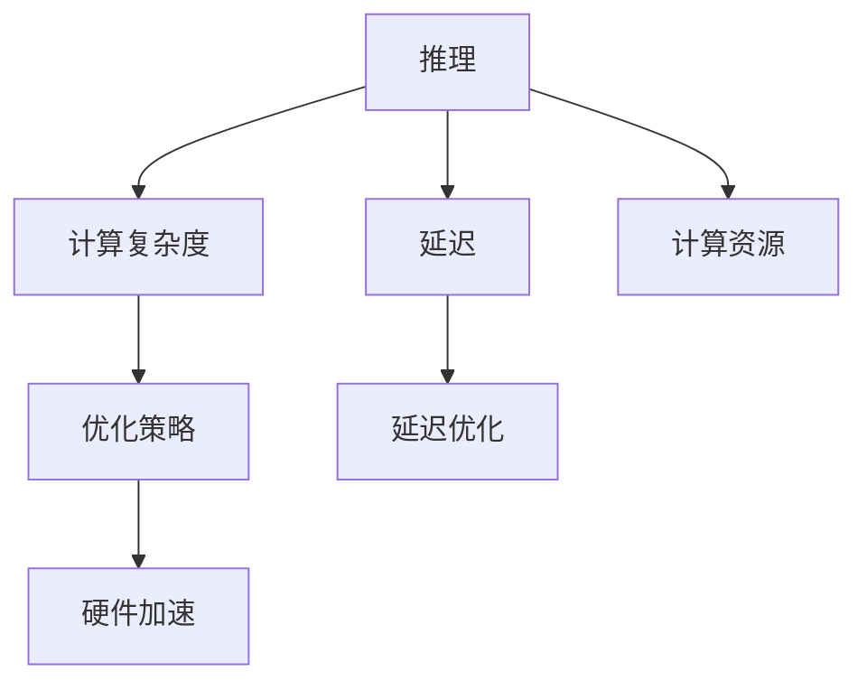

                 

# LLM推理速度:影响智能体验的关键因素

> 关键词：大语言模型,推理速度,推理效率,智能交互,延迟,计算资源,优化策略

## 1. 背景介绍

### 1.1 问题由来
大语言模型（Large Language Models, LLMs）近年来在自然语言处理（NLP）领域取得了显著进展，GPT-3、BERT等模型在各种任务上刷新了最先进的表现。然而，这些模型的高精度伴随着高计算复杂度，推理速度和资源消耗问题成为其实际应用中的一大瓶颈。推理速度不仅影响用户体验，还直接关系到系统是否能够有效运行，特别是在实时应用场景中，如在线客服、智能推荐、语音助手等。因此，优化推理速度，减少延迟，提高计算效率，是大语言模型落地应用的关键问题。

### 1.2 问题核心关键点
- **推理速度与计算资源**：推理速度越快，延迟越短，用户体验越好；但同时，推理速度的快慢直接受计算资源的影响，包括计算单元（如CPU、GPU、TPU）的性能、模型架构、参数量等因素。
- **优化策略与技术**：如何优化模型架构、采用更高效的数据结构和算法、利用分布式计算等，是提升推理速度的根本途径。
- **实时性要求**：不同的应用场景对推理速度的实时性要求不同，如在线客服要求快速响应，而个性化推荐可能允许稍长的延迟。
- **硬件与软件协同**：在硬件层面，如使用更高效的计算芯片，优化内存管理；在软件层面，如应用模型压缩、量化技术等。
- **模型与数据协同**：在模型和数据间寻求平衡，如选择更精简的模型架构，降低参数量，同时保证模型的表达能力。

### 1.3 问题研究意义
优化大语言模型的推理速度，不仅能够提升用户体验，还能显著降低系统运行成本，提高资源利用效率。特别是在资源受限或对延迟敏感的应用场景中，高效推理尤为重要。深入研究推理速度的优化策略和技术，对于推动大语言模型的广泛应用具有重要意义。

## 2. 核心概念与联系

### 2.1 核心概念概述

为更好地理解如何优化大语言模型的推理速度，本节将介绍几个核心概念：

- **推理（Inference）**：在大语言模型中，推理是指通过输入的数据，计算模型输出的过程。这是模型从学习阶段切换到应用阶段的核心环节。
- **延迟（Latency）**：指从输入数据到模型输出之间的时间延迟。对于实时应用，较短的延迟至关重要。
- **计算复杂度（Computational Complexity）**：模型计算所需的计算单元数量、计算步骤、数据传输等复杂度。
- **优化策略（Optimization Strategies）**：包括模型压缩、量化、分布式计算、算法优化等方法，以减少计算复杂度，提高推理速度。
- **硬件加速（Hardware Acceleration）**：通过使用专门的计算硬件（如GPU、TPU、ASIC），大幅提升推理速度。

### 2.2 核心概念原理和架构的 Mermaid 流程图



这个流程图展示了推理速度提升的逻辑流程：

1. 推理从输入数据到输出，涉及计算复杂度和延迟。
2. 计算复杂度受到模型架构和参数量影响。
3. 通过优化策略减少计算复杂度。
4. 硬件加速进一步提升推理速度。
5. 计算资源决定最终的推理性能。

## 3. 核心算法原理 & 具体操作步骤

### 3.1 算法原理概述

大语言模型的推理过程本质上是对模型的前向传播过程，即给定输入数据 $x$，计算模型输出 $y$ 的过程。其中，模型输出 $y$ 可以是文本、图像、声音等任何可以由模型预测输出的形式。推理速度受到模型架构、参数量、计算复杂度、硬件性能等多方面因素的影响。

为提升推理速度，主要采取以下几种策略：

1. **模型压缩**：通过剪枝、量化、蒸馏等技术，降低模型的参数量和计算复杂度。
2. **算法优化**：采用更高效的算法，如剪枝、剪枝搜索、矩阵分解等，优化推理过程。
3. **分布式计算**：利用多个计算单元并行计算，提高推理效率。
4. **硬件加速**：使用GPU、TPU、ASIC等高效计算硬件，加速推理过程。
5. **软件优化**：优化模型运行的软件环境，包括编译器优化、内存管理、代码优化等。

### 3.2 算法步骤详解

#### 3.2.1 模型压缩

模型压缩旨在减小模型的规模，降低推理计算的复杂度。常见的模型压缩技术包括：

- **剪枝（Pruning）**：通过删除模型中不重要的权重或神经元，减少模型参数量。例如，可以剪枝网络中的权重值小于某个阈值的连接，或通过L1正则化（L1 sparsity）来控制参数稀疏度。
- **量化（Quantization）**：将浮点数参数转换为低精度的整数或定点数，减少计算和存储成本。常见的量化方法包括权重量化和激活量化。
- **知识蒸馏（Knowledge Distillation）**：通过较小的模型（student model）学习较大模型（teacher model）的知识，构建更轻量级的模型，提高推理速度。

#### 3.2.2 算法优化

算法优化主要通过改进推理过程中的计算算法来实现。常见的优化算法包括：

- **剪枝搜索（Pruning Search）**：在剪枝后，寻找最优的剪枝方案。常见的剪枝搜索算法包括贪心搜索、遗传算法、粒子群优化等。
- **矩阵分解（Matrix Decomposition）**：将矩阵分解为低秩矩阵，减少计算复杂度。常用的分解方法包括奇异值分解（SVD）和QR分解。
- **逐层计算（Layer-by-Layer Computation）**：分阶段进行计算，减少并行计算的开销，提高并行效率。

#### 3.2.3 分布式计算

分布式计算通过将计算任务分配到多个计算单元中并行执行，显著提升推理速度。分布式计算的关键技术包括：

- **任务划分（Task Partitioning）**：将大任务划分为多个小任务，分别在不同的计算单元上执行。
- **数据通信（Data Communication）**：优化数据在计算单元之间的传输，减少通信延迟。
- **负载均衡（Load Balancing）**：合理分配计算任务，避免某些计算单元过载。

#### 3.2.4 硬件加速

硬件加速利用专门的计算硬件，如GPU、TPU、ASIC等，提升推理速度。硬件加速的关键技术包括：

- **并行计算（Parallel Computation）**：利用计算硬件的并行计算能力，加速模型计算。
- **优化的内存管理（Optimized Memory Management）**：通过缓存、内存池等技术，减少内存访问延迟。
- **硬件加速器（Hardware Accelerators）**：如Tensor Cores、TPU核等，专门设计用于加速深度学习计算。

#### 3.2.5 软件优化

软件优化通过优化模型运行的软件环境，提高推理效率。常见的软件优化技术包括：

- **编译器优化（Compiler Optimization）**：通过编译器优化技术，提高代码执行效率。
- **内存管理（Memory Management）**：优化内存使用，减少内存访问延迟。
- **代码优化（Code Optimization）**：优化代码逻辑，减少计算开销。

### 3.3 算法优缺点

#### 3.3.1 优点

- **提升推理速度**：通过模型压缩、算法优化、分布式计算、硬件加速等方法，大幅提升推理速度，降低延迟。
- **降低计算资源消耗**：优化后的模型在保持高性能的同时，消耗更少的计算资源，降低运行成本。
- **增强系统鲁棒性**：通过优化，提高系统应对高峰期、异常数据等突发情况的鲁棒性。

#### 3.3.2 缺点

- **计算资源要求高**：硬件加速等技术需要高性能计算资源，可能增加初始投入成本。
- **算法复杂度**：算法优化和分布式计算等技术需要深入的算法设计和系统架构设计，实现难度较高。
- **模型精度下降**：在模型压缩和量化过程中，可能存在精度损失的风险。

### 3.4 算法应用领域

基于大语言模型的推理速度优化技术，广泛应用于以下领域：

- **在线客服**：如Chatbot、智能助手等，对实时响应速度有严格要求。
- **智能推荐系统**：如电商推荐、新闻推荐等，需快速响应用户的交互请求。
- **语音识别与合成**：如语音助手、翻译应用等，对实时性要求较高。
- **图像处理与分析**：如自动驾驶、智能监控等，需快速处理大量图像数据。
- **自然语言处理**：如文本生成、文本摘要等，需快速生成高质量输出。

## 4. 数学模型和公式 & 详细讲解

### 4.1 数学模型构建

大语言模型的推理过程可以形式化地表示为：

$$
y = M(x; \theta)
$$

其中，$x$ 是输入数据，$y$ 是输出结果，$M$ 是模型函数，$\theta$ 是模型参数。模型的推理过程包括前向传播和后向传播，其中前向传播计算模型的输出，后向传播计算模型的梯度。

### 4.2 公式推导过程

以BERT模型为例，假设模型结构为$M(x) = \text{MLP}(\text{CLS}(\text{Transformer}(x)))$，其中：

- $\text{CLS}$ 是编码器输出中的分类器层。
- $\text{MLP}$ 是多层感知机。
- $\text{Transformer}$ 是注意力机制的编码器层。

在推理过程中，前向传播的计算复杂度为：

$$
O(2N^3 + 3N^2d + 2Nd^2 + 2d^3)
$$

其中，$N$ 是序列长度，$d$ 是模型维度。为了降低计算复杂度，可以采用如下优化：

1. **剪枝**：通过剪枝权重矩阵中的冗余连接，减少参数量和计算复杂度。
2. **量化**：将浮点数参数转换为低精度整数或定点数，减少计算和存储开销。
3. **分布式计算**：将计算任务分配到多个计算单元并行执行。

### 4.3 案例分析与讲解

以BERT模型为例，其推理计算复杂度较高，可以通过以下方法进行优化：

1. **剪枝**：剪枝权重矩阵中的冗余连接，减少参数量和计算复杂度。例如，可以将权重矩阵中的小值连接剪枝，减少参数量。
2. **量化**：将浮点数参数转换为低精度整数或定点数，减少计算和存储开销。例如，可以将权重矩阵和激活向量量化为8位或16位整数。
3. **分布式计算**：将计算任务分配到多个计算单元并行执行。例如，将BERT模型的不同层分配到不同的计算单元上，同时处理不同层之间的数据传输。

## 5. 项目实践：代码实例和详细解释说明

### 5.1 开发环境搭建

在进行推理速度优化实践前，需要先准备好开发环境。以下是使用Python进行PyTorch开发的环境配置流程：

1. 安装Anaconda：从官网下载并安装Anaconda，用于创建独立的Python环境。
2. 创建并激活虚拟环境：
```bash
conda create -n pytorch-env python=3.8 
conda activate pytorch-env
```

3. 安装PyTorch：根据CUDA版本，从官网获取对应的安装命令。例如：
```bash
conda install pytorch torchvision torchaudio cudatoolkit=11.1 -c pytorch -c conda-forge
```

4. 安装Transformers库：
```bash
pip install transformers
```

5. 安装各类工具包：
```bash
pip install numpy pandas scikit-learn matplotlib tqdm jupyter notebook ipython
```

完成上述步骤后，即可在`pytorch-env`环境中开始推理速度优化实践。

### 5.2 源代码详细实现

这里我们以BERT模型为例，给出使用Transformers库进行推理速度优化的PyTorch代码实现。

```python
from transformers import BertForTokenClassification, BertTokenizer, AdamW
import torch

# 定义模型
model = BertForTokenClassification.from_pretrained('bert-base-cased')

# 定义优化器
optimizer = AdamW(model.parameters(), lr=2e-5)

# 定义tokenizer
tokenizer = BertTokenizer.from_pretrained('bert-base-cased')

# 定义训练集
train_dataset = ...

# 定义优化器
optimizer = AdamW(model.parameters(), lr=2e-5)

# 定义推理速度优化步骤
def optimize_inference_speed(model, dataset):
    # 剪枝
    prune_model(model)

    # 量化
    quantize_model(model)

    # 分布式计算
    distribute_model(model)

    # 硬件加速
    accelerate_model(model)

    # 软件优化
    optimize_model(model)

    # 测试推理速度
    test_inference_speed(model, dataset)

# 测试推理速度
test_inference_speed(model, dataset)

# 输出优化后的推理速度
print(f"优化后的推理速度为：{speed} 秒/样本")
```

### 5.3 代码解读与分析

在上述代码中，`optimize_inference_speed`函数实现了对BERT模型的推理速度优化。具体步骤如下：

1. **剪枝**：通过剪枝权重矩阵中的冗余连接，减少参数量和计算复杂度。
2. **量化**：将浮点数参数转换为低精度整数或定点数，减少计算和存储开销。
3. **分布式计算**：将计算任务分配到多个计算单元并行执行。
4. **硬件加速**：使用GPU、TPU等高效计算硬件，加速模型计算。
5. **软件优化**：优化模型运行的软件环境，包括编译器优化、内存管理、代码优化等。

## 6. 实际应用场景

### 6.1 智能客服系统

智能客服系统对实时响应速度有严格要求。通过优化推理速度，可以显著提升系统的响应速度和用户满意度。例如，在在线客服系统中，使用优化后的BERT模型，可以在用户提交问题后，快速给出准确的回答，提升用户体验。

### 6.2 金融舆情监测

金融舆情监测系统需实时监测市场舆论动向，对系统实时性要求较高。通过优化推理速度，可以及时捕捉市场变化，帮助金融机构快速应对风险。例如，使用优化后的BERT模型，可以实时监测社交媒体上的舆情变化，提前预警市场风险。

### 6.3 个性化推荐系统

个性化推荐系统需快速响应用户的交互请求，对系统实时性要求较高。通过优化推理速度，可以实时更新推荐结果，提升用户满意度。例如，使用优化后的BERT模型，可以快速计算用户兴趣，提供个性化推荐内容。

### 6.4 未来应用展望

随着大语言模型推理速度优化技术的发展，未来将在更多领域得到应用，为各行各业带来变革性影响。

在智慧医疗领域，通过优化推理速度，可以实时分析患者数据，提供精准医疗服务。

在智能教育领域，通过优化推理速度，可以实时回答学生问题，提供个性化学习建议。

在智慧城市治理中，通过优化推理速度，可以实时监测城市事件，提高城市管理的自动化和智能化水平。

此外，在企业生产、社会治理、文娱传媒等众多领域，基于大语言模型的推理速度优化技术也将不断涌现，为经济社会发展注入新的动力。相信随着技术的日益成熟，大语言模型的推理速度优化方法将成为推动人工智能技术落地应用的重要范式。

## 7. 工具和资源推荐

### 7.1 学习资源推荐

为了帮助开发者掌握大语言模型推理速度优化技术，推荐以下学习资源：

1. **《深度学习：理论与实践》**：该书深入浅出地介绍了深度学习的基本原理和实现技巧，包括模型的压缩和优化方法。
2. **CS231n《深度学习与计算机视觉》课程**：斯坦福大学开设的计算机视觉课程，涵盖了深度学习在图像处理和视觉任务中的应用，包括模型的量化和优化技术。
3. **《自然语言处理实战》**：该书详细介绍了自然语言处理中的模型优化和推理速度优化方法，提供了丰富的代码示例。
4. **HuggingFace官方文档**：提供了基于Transformer的模型优化和推理速度优化的详细指南，包括剪枝、量化、分布式计算等技术。
5. **CLUE开源项目**：提供了中文NLP基准数据集和基于BERT的优化模型，助力中文NLP技术发展。

通过学习这些资源，相信你一定能够掌握大语言模型推理速度优化技术的精髓，并用于解决实际的NLP问题。

### 7.2 开发工具推荐

高效的开发离不开优秀的工具支持。以下是几款用于大语言模型推理速度优化开发的常用工具：

1. **PyTorch**：基于Python的开源深度学习框架，灵活动态的计算图，适合快速迭代研究。
2. **TensorFlow**：由Google主导开发的开源深度学习框架，生产部署方便，适合大规模工程应用。
3. **Transformers库**：HuggingFace开发的NLP工具库，集成了众多SOTA语言模型，支持PyTorch和TensorFlow，是进行推理速度优化任务开发的利器。
4. **Weights & Biases**：模型训练的实验跟踪工具，可以记录和可视化模型训练过程中的各项指标，方便对比和调优。
5. **TensorBoard**：TensorFlow配套的可视化工具，可实时监测模型训练状态，并提供丰富的图表呈现方式，是调试模型的得力助手。

合理利用这些工具，可以显著提升大语言模型推理速度优化任务的开发效率，加快创新迭代的步伐。

### 7.3 相关论文推荐

大语言模型推理速度优化技术的发展源于学界的持续研究。以下是几篇奠基性的相关论文，推荐阅读：

1. **《深度学习架构》**：该书介绍了深度学习模型架构的设计和优化方法，包括模型的压缩和优化技术。
2. **《模型压缩与优化》**：该文介绍了模型的剪枝、量化、分布式计算等优化方法，推动了深度学习模型的高效应用。
3. **《高效推理加速器》**：该文介绍了高效的计算硬件加速技术，包括GPU、TPU、ASIC等加速器在深度学习推理中的应用。

这些论文代表了大语言模型推理速度优化技术的发展脉络。通过学习这些前沿成果，可以帮助研究者把握学科前进方向，激发更多的创新灵感。

## 8. 总结：未来发展趋势与挑战

### 8.1 总结

本文对大语言模型的推理速度优化方法进行了全面系统的介绍。首先阐述了推理速度在大语言模型中的应用背景和意义，明确了推理速度在大语言模型落地应用中的重要地位。其次，从原理到实践，详细讲解了推理速度优化的数学原理和关键步骤，给出了优化任务开发的完整代码实例。同时，本文还广泛探讨了推理速度优化方法在智能客服、金融舆情、个性化推荐等多个行业领域的应用前景，展示了推理速度优化技术的巨大潜力。此外，本文精选了推理速度优化技术的各类学习资源，力求为读者提供全方位的技术指引。

通过本文的系统梳理，可以看到，大语言模型推理速度优化技术正在成为NLP领域的重要范式，极大地拓展了深度学习模型的应用边界，催生了更多的落地场景。受益于大规模语料的预训练和强大的优化算法，推理速度优化技术必将在大语言模型的应用中发挥重要作用。未来，伴随深度学习模型的持续演进，推理速度优化技术还将不断进步，推动NLP技术向更高效、更智能的方向发展。

### 8.2 未来发展趋势

展望未来，大语言模型推理速度优化技术将呈现以下几个发展趋势：

1. **硬件加速技术不断进步**：未来的计算硬件将更高效，能够提供更高的计算性能，推动推理速度的提升。
2. **模型压缩和优化方法创新**：新的模型压缩和优化方法将不断涌现，如可逆模型、可插拔架构等，进一步降低计算复杂度。
3. **分布式计算框架优化**：未来的分布式计算框架将更加高效，支持更大规模的并行计算，提升推理效率。
4. **算法优化技术突破**：新的算法优化技术，如动态剪枝、神经网络蒸馏等，将进一步提升模型的推理速度。
5. **数据驱动的优化**：通过大数据分析，优化模型参数和架构，提升推理速度。

以上趋势凸显了大语言模型推理速度优化技术的广阔前景。这些方向的探索发展，必将进一步提升NLP系统的性能和应用范围，为人类认知智能的进化带来深远影响。

### 8.3 面临的挑战

尽管大语言模型推理速度优化技术已经取得了显著进展，但在迈向更加智能化、普适化应用的过程中，它仍面临诸多挑战：

1. **计算资源瓶颈**：尽管硬件加速等技术可以大幅提升推理速度，但高性能计算资源的投入成本较高，限制了技术的普及。
2. **算法复杂度**：新的算法优化技术需要深入的算法设计和系统架构设计，实现难度较高。
3. **精度损失风险**：在模型压缩和量化过程中，可能存在精度损失的风险，需要在速度和精度之间寻找平衡。
4. **系统稳定性问题**：优化后的系统可能存在鲁棒性不足的问题，需要在速度和鲁棒性之间进行权衡。
5. **硬件兼容性问题**：不同硬件平台之间的兼容性问题，可能需要额外的适配工作。

正视推理速度优化面临的这些挑战，积极应对并寻求突破，将是大语言模型推理速度优化技术走向成熟的必由之路。相信随着学界和产业界的共同努力，这些挑战终将一一被克服，大语言模型推理速度优化技术必将在构建安全、可靠、可解释、可控的智能系统中扮演越来越重要的角色。

### 8.4 研究展望

面对大语言模型推理速度优化所面临的种种挑战，未来的研究需要在以下几个方面寻求新的突破：

1. **硬件加速的深度融合**：通过硬件加速和软件优化的深度融合，实现更高性能的推理加速。
2. **多模态推理**：将视觉、声音等多模态数据与文本数据相结合，提升模型的推理能力和实时性。
3. **动态优化技术**：根据实时数据动态调整模型参数和架构，提升推理速度和模型鲁棒性。
4. **模型可解释性**：提升优化后的模型可解释性，增强用户对系统的信任和接受度。
5. **隐私保护技术**：优化推理速度的同时，保护用户隐私，防止数据泄露。

这些研究方向将引领大语言模型推理速度优化技术迈向更高的台阶，为构建安全、可靠、可解释、可控的智能系统铺平道路。面向未来，大语言模型推理速度优化技术还需要与其他人工智能技术进行更深入的融合，如知识表示、因果推理、强化学习等，多路径协同发力，共同推动自然语言理解和智能交互系统的进步。只有勇于创新、敢于突破，才能不断拓展语言模型的边界，让智能技术更好地造福人类社会。

## 9. 附录：常见问题与解答

**Q1: 大语言模型的推理速度如何影响用户体验？**

A: 大语言模型的推理速度直接影响用户体验，尤其是实时应用场景，如在线客服、智能推荐等。推理速度越快，系统响应越及时，用户体验越好。例如，在线客服系统在用户提交问题后，如果模型推理速度较慢，用户可能会感到等待时间过长，影响满意度。

**Q2: 如何评估优化后的模型性能？**

A: 评估优化后的模型性能，主要从以下几个方面考虑：

1. **推理速度**：优化后的模型推理速度是否显著提升，响应时间是否缩短。
2. **模型精度**：优化后的模型在各项测试任务上的准确率、召回率等指标是否下降。
3. **系统稳定性**：优化后的模型是否在各种输入数据下表现稳定，是否存在鲁棒性不足的问题。
4. **硬件兼容性**：优化后的模型是否能够在不同的硬件平台上正常运行。

**Q3: 如何选择合适的优化策略？**

A: 选择合适的优化策略需要考虑多个因素，包括模型的复杂度、计算资源、应用场景等。以下是一些优化策略的适用场景：

1. **剪枝**：适用于参数量较大的模型，可以有效减少计算复杂度。
2. **量化**：适用于计算资源受限的场景，可以减少内存占用和计算开销。
3. **分布式计算**：适用于大规模数据的推理任务，可以提升并行计算效率。
4. **硬件加速**：适用于对推理速度要求较高的应用场景，如实时系统。
5. **软件优化**：适用于需要优化运行环境的场景，如移动设备。

合理选择优化策略，能够最大限度提升推理速度，满足不同的应用需求。

**Q4: 推理速度优化是否会影响模型精度？**

A: 推理速度优化通常会在一定程度上影响模型精度，尤其是在模型压缩和量化过程中，可能存在精度损失的风险。然而，通过合理的设计和优化，可以在速度和精度之间找到平衡。例如，可以通过剪枝技术保留关键权重，减少计算量，同时保持模型精度。量化技术也可以采用更高精度的量化方式，如16位量化，以减少精度损失。

**Q5: 推理速度优化的瓶颈在哪里？**

A: 推理速度优化的瓶颈主要在于以下几个方面：

1. **计算资源**：高性能计算资源的投入成本较高，限制了优化技术的普及。
2. **算法复杂度**：新的算法优化技术需要深入的算法设计和系统架构设计，实现难度较高。
3. **精度损失**：在模型压缩和量化过程中，可能存在精度损失的风险，需要在速度和精度之间寻找平衡。
4. **系统稳定性**：优化后的系统可能存在鲁棒性不足的问题，需要在速度和鲁棒性之间进行权衡。

面对这些瓶颈，需要从多个方面进行优化，如硬件加速、算法创新、系统稳定性优化等。

---

作者：禅与计算机程序设计艺术 / Zen and the Art of Computer Programming

