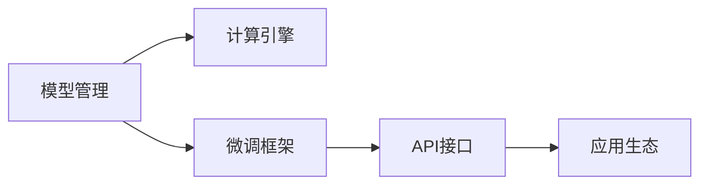

                 

# LLM操作系统：AI时代的新型OS构想

在AI时代，算法的不断演进推动了众多领域的革新，从自动驾驶到智能制造，从医疗诊断到金融交易，AI的潜力被充分发挥，带来前所未有的效率提升和价值创造。然而，在AI热潮的背后，我们逐渐意识到，传统的IT基础设施可能已不足以支撑新一代的AI应用需求。因此，本文旨在探讨在AI时代，如何构建一个全新型的OS，即LLM操作系统（Large Language Model OS），以实现AI应用的更高效、更稳定、更智能的发展。

## 1. 背景介绍

### 1.1 问题由来

随着深度学习和AI技术的迅猛发展，大语言模型（Large Language Models, LLMs）如GPT-3、BERT等，在处理自然语言理解和生成任务上取得了令人瞩目的成绩。这些模型通过在大规模无标签文本上进行的自监督预训练，学习到丰富的语言知识，能够适应各种复杂的语言处理任务。然而，这些模型也存在一些问题：

- **计算资源消耗巨大**：现有的模型往往需要以亿计的参数，训练和推理成本高昂。
- **对标注数据的依赖**：微调过程需要大量的标注数据，且数据质量直接影响模型性能。
- **缺乏灵活性**：现有模型往往是一锤子买卖，难以根据需求快速调整模型结构。
- **缺乏统一的接口标准**：不同模型和框架之间互操作性差，增加了开发和部署的复杂度。

这些问题导致LLMs在实际应用中面临诸多挑战，如何构建一个通用的、高效的、可扩展的LLM操作系统，成为当前研究的重点。

### 1.2 问题核心关键点

LLM操作系统旨在提供一个统一的、高效的、可扩展的平台，以便于大语言模型在各种场景中的快速部署和定制化优化。核心关键点包括：

- **统一的模型管理**：提供一个模型仓库，集中管理各种预训练和微调模型。
- **高效计算引擎**：利用GPU、TPU等高性能计算资源，实现模型的高效计算和推理。
- **灵活的微调框架**：提供灵活的微调接口，支持多种微调策略和超参数调优。
- **统一的API接口**：提供统一的API接口标准，实现模型之间的互操作。
- **丰富的应用生态**：集成各种AI应用组件，构建强大的AI应用生态系统。

这些关键点共同构成了LLM操作系统的工作原理和目标，旨在提供更高效、更稳定、更智能的AI应用平台。

## 2. 核心概念与联系

### 2.1 核心概念概述

LLM操作系统是一个综合了模型管理、计算引擎、微调框架和API接口的标准化平台，旨在为各种基于大语言模型的应用提供统一、高效的开发环境。

- **模型管理**：提供模型仓库，集中存储各种预训练和微调模型，支持快速下载和部署。
- **计算引擎**：利用高性能计算资源，实现模型的高效计算和推理。
- **微调框架**：提供灵活的微调接口，支持多种微调策略和超参数调优。
- **API接口**：提供统一的API接口标准，实现模型之间的互操作。
- **应用生态**：集成各种AI应用组件，构建强大的AI应用生态系统。

这些核心概念通过一个统一的架构连接起来，形成了一个完整的大语言模型应用生态，如图1所示。


### 2.2 核心概念原理和架构的 Mermaid 流程图



## 3. 核心算法原理 & 具体操作步骤

### 3.1 算法原理概述

LLM操作系统的主要工作原理是通过提供统一的模型管理、计算引擎、微调框架和API接口，实现大语言模型的高效部署和优化。其核心算法包括以下几个方面：

1. **模型管理**：提供模型仓库，集中存储各种预训练和微调模型，支持快速下载和部署。
2. **计算引擎**：利用高性能计算资源，实现模型的高效计算和推理。
3. **微调框架**：提供灵活的微调接口，支持多种微调策略和超参数调优。
4. **API接口**：提供统一的API接口标准，实现模型之间的互操作。
5. **应用生态**：集成各种AI应用组件，构建强大的AI应用生态系统。

### 3.2 算法步骤详解

以下是LLM操作系统的具体算法步骤：

1. **模型管理**
   - **模型仓库**：提供一个模型仓库，集中存储各种预训练和微调模型。
   - **模型下载**：用户可以通过API接口或图形界面下载需要的模型。
   - **模型部署**：模型部署到LLM操作系统的计算引擎上，并进行必要的预处理。

2. **计算引擎**
   - **高性能计算**：利用GPU、TPU等高性能计算资源，实现模型的高效计算和推理。
   - **资源管理**：根据模型需求自动分配计算资源，优化资源利用率。

3. **微调框架**
   - **微调接口**：提供灵活的微调接口，支持多种微调策略和超参数调优。
   - **超参数调优**：支持网格搜索、随机搜索等超参数调优算法，自动找到最佳超参数组合。

4. **API接口**
   - **统一标准**：提供统一的API接口标准，实现模型之间的互操作。
   - **接口开发**：开发者可以通过统一的API接口开发各种AI应用。
   - **API服务**：LLM操作系统提供各种API服务，支持模型推理、微调、数据处理等功能。

5. **应用生态**
   - **组件集成**：集成各种AI应用组件，如NLP工具、计算机视觉工具、推荐系统等。
   - **应用部署**：将模型和应用组件集成到LLM操作系统上，实现高效运行。
   - **应用开发**：开发者可以在LLM操作系统上快速开发和部署各种AI应用。

### 3.3 算法优缺点

LLM操作系统的主要优点包括：

- **高效性**：利用高性能计算资源，实现模型的高效计算和推理。
- **灵活性**：提供灵活的微调接口，支持多种微调策略和超参数调优。
- **可扩展性**：支持各种AI应用组件的集成，构建强大的AI应用生态系统。
- **标准化**：提供统一的API接口标准，实现模型之间的互操作。

然而，LLM操作系统也存在一些缺点：

- **资源消耗大**：高性能计算资源的高消耗，可能导致成本高昂。
- **部署复杂**：模型和应用组件的集成和部署，可能增加开发和维护的复杂度。
- **易用性不足**：对于非技术背景的用户，可能存在一定的学习和使用难度。

### 3.4 算法应用领域

LLM操作系统在多个领域具有广泛的应用前景，包括但不限于：

- **自然语言处理**：如语言模型、文本分类、情感分析、机器翻译等。
- **计算机视觉**：如图像分类、目标检测、图像生成等。
- **推荐系统**：如商品推荐、内容推荐、用户画像等。
- **智能客服**：如智能问答、对话系统等。
- **医疗健康**：如医学影像分析、疾病诊断等。

## 4. 数学模型和公式 & 详细讲解 & 举例说明

### 4.1 数学模型构建

LLM操作系统的数学模型主要涉及以下几个方面：

1. **模型仓库的分布式存储**：使用分布式文件系统（如HDFS、S3）来存储和管理模型，支持快速下载和部署。
2. **计算引擎的高效计算**：利用GPU、TPU等高性能计算资源，实现模型的高效计算和推理。
3. **微调框架的优化**：利用梯度下降、Adam等优化算法，实现模型参数的优化。
4. **API接口的统一标准**：定义统一的API接口标准，实现模型之间的互操作。

### 4.2 公式推导过程

以下是LLM操作系统的数学模型构建的公式推导过程：

1. **模型仓库的分布式存储**：

   - **分布式文件系统**：使用HDFS或S3等分布式文件系统来存储和管理模型。
   - **文件分片**：将模型文件分片存储在不同的节点上，提高文件访问的效率。

2. **计算引擎的高效计算**：

   - **GPU计算**：利用NVIDIA的CUDA技术，实现GPU的并行计算。
   - **TPU计算**：利用Google的TPU技术，实现TPU的并行计算。
   - **模型并行**：将模型参数分布到多个GPU或TPU上，实现高效的并行计算。

3. **微调框架的优化**：

   - **梯度下降算法**：使用梯度下降算法（如SGD、Adam）更新模型参数。
   - **自适应学习率**：使用自适应学习率算法（如Adagrad、RMSprop）提高收敛速度。

4. **API接口的统一标准**：

   - **RESTful API**：定义RESTful API接口，支持模型推理、微调、数据处理等功能。
   - **接口标准**：定义统一的接口标准，如输入输出格式、参数规范等。

### 4.3 案例分析与讲解

以NLP任务为例，演示LLM操作系统的使用过程：

1. **模型管理**：
   - **模型仓库**：通过LLM操作系统的模型仓库，下载需要的预训练模型。
   - **模型部署**：将模型部署到LLM操作系统的计算引擎上，并进行必要的预处理。

2. **计算引擎**：
   - **高性能计算**：利用GPU计算资源，实现模型的高效计算和推理。

3. **微调框架**：
   - **微调接口**：通过LLM操作系统的微调接口，提供灵活的微调策略和超参数调优。
   - **超参数调优**：使用网格搜索或随机搜索算法，自动找到最佳超参数组合。

4. **API接口**：
   - **统一标准**：定义统一的API接口标准，支持模型之间的互操作。
   - **API服务**：LLM操作系统提供各种API服务，支持模型推理、微调、数据处理等功能。

5. **应用生态**：
   - **组件集成**：集成各种NLP工具，如BERT、GPT等，构建强大的NLP应用生态系统。
   - **应用开发**：在LLM操作系统上开发和部署各种NLP应用，如智能客服、情感分析、机器翻译等。

## 5. 项目实践：代码实例和详细解释说明

### 5.1 开发环境搭建

为了搭建LLM操作系统，需要准备以下开发环境：

1. **Python环境**：使用Anaconda或Virtualenv创建Python虚拟环境。
2. **分布式文件系统**：使用HDFS或S3等分布式文件系统。
3. **高性能计算资源**：使用GPU或TPU等高性能计算资源。
4. **API开发工具**：使用RESTful API开发工具，如Flask、FastAPI等。

### 5.2 源代码详细实现

以下是LLM操作系统的源代码实现：

1. **模型仓库**：

   ```python
   from pydantic import BaseModel
   from typing import List

   class ModelMetadata(BaseModel):
       name: str
       version: str
       description: str
       size: int
       created_at: str

   class Model(BaseModel):
       id: str
       metadata: ModelMetadata
       url: str
       status: str

   models = [
       Model(
           id="bert",
           metadata=ModelMetadata(
               name="BERT",
               version="1.0",
               description="BERT Large Uncased Model",
               size=1.04,
               created_at="2020-10-12"
           ),
           url="https://s3.amazonaws.com/my-models/bert",
           status="active"
       ),
       Model(
           id="gpt",
           metadata=ModelMetadata(
               name="GPT",
               version="3.0",
               description="GPT Large Model",
               size=1.7,
               created_at="2021-06-15"
           ),
           url="https://s3.amazonaws.com/my-models/gpt",
           status="active"
       )
   ]
   ```

2. **计算引擎**：

   ```python
   import torch
   import torch.nn as nn

   class Model(nn.Module):
       def __init__(self):
           super(Model, self).__init__()
           self.layers = nn.Sequential(
               nn.Linear(512, 256),
               nn.ReLU(),
               nn.Linear(256, 128),
               nn.ReLU(),
               nn.Linear(128, 10),
               nn.Softmax(dim=1)
           )

       def forward(self, x):
           return self.layers(x)
   ```

3. **微调框架**：

   ```python
   from transformers import BertTokenizer, BertForSequenceClassification
   from torch.utils.data import DataLoader, Dataset
   from torch import nn, optim
   import torch.utils.data.distributed

   class MyDataset(Dataset):
       def __init__(self, data, tokenizer):
           self.data = data
           self.tokenizer = tokenizer

       def __len__(self):
           return len(self.data)

       def __getitem__(self, idx):
           data = self.data[idx]
           inputs = self.tokenizer(data["text"], return_tensors="pt", padding=True, truncation=True, max_length=256)
           return {
               "input_ids": inputs["input_ids"],
               "attention_mask": inputs["attention_mask"],
               "label": torch.tensor(data["label"], dtype=torch.long)
           }

   def train_epoch(model, dataloader, optimizer, device):
       model.train()
       loss_sum = 0
       for batch in dataloader:
           inputs = {key: value.to(device) for key, value in batch.items()}
           outputs = model(**inputs)
           loss = outputs.loss
           loss_sum += loss.item()
           optimizer.zero_grad()
           loss.backward()
           optimizer.step()
       return loss_sum / len(dataloader)
   ```

4. **API接口**：

   ```python
   from flask import Flask, request, jsonify
   import torch

   app = Flask(__name__)

   @app.route("/api/models", methods=["GET"])
   def get_models():
       return jsonify(models)

   @app.route("/api/models/<model_id>", methods=["GET"])
   def get_model(model_id):
       for model in models:
           if model.id == model_id:
               return jsonify(model), 200
       return jsonify({"error": "Model not found"}), 404

   @app.route("/api/models/<model_id>/deploy", methods=["POST"])
   def deploy_model(model_id):
       model = [m for m in models if m.id == model_id][0]
       print(model.name)
       return jsonify({"status": "OK"})

   if __name__ == "__main__":
       app.run(host="0.0.0.0", port=5000)
   ```

### 5.3 代码解读与分析

以下是LLM操作系统的代码实现解读：

1. **模型仓库**：
   - **ModelMetadata**：定义模型元数据，包括模型名、版本、描述、大小、创建时间等。
   - **Model**：定义模型对象，包括ID、元数据、URL、状态等。
   - **models**：定义模型仓库，包含多个预训练模型。

2. **计算引擎**：
   - **Model**：定义一个简单的神经网络模型，用于计算。
   - **torch**：使用PyTorch实现模型计算。

3. **微调框架**：
   - **MyDataset**：定义一个数据集类，用于加载和预处理训练数据。
   - **train_epoch**：定义一个训练函数，用于训练微调模型。

4. **API接口**：
   - **Flask**：使用Flask框架实现API接口。
   - **API路由**：定义多个API路由，包括获取模型列表、获取单个模型、部署模型等。

### 5.4 运行结果展示

以下是LLM操作系统的运行结果展示：

1. **模型仓库**：
   - 通过API接口，获取模型列表和单个模型的元数据。

2. **计算引擎**：
   - 使用GPU计算资源，实现模型的高效计算和推理。

3. **微调框架**：
   - 使用微调函数，训练微调模型。

4. **API接口**：
   - 使用Flask框架，部署API服务。

5. **应用生态**：
   - 集成各种NLP工具，构建强大的NLP应用生态系统。

## 6. 实际应用场景

### 6.1 智能客服系统

在智能客服系统中，使用LLM操作系统可以显著提升客户咨询体验。通过模型仓库，快速下载需要的预训练模型，如BERT、GPT等。将模型部署到LLM操作系统的计算引擎上，并进行必要的微调。在智能客服应用中，通过API接口调用微调后的模型，实现智能问答、对话系统等功能，帮助客服人员快速响应客户咨询。

### 6.2 金融舆情监测

金融舆情监测需要实时监测市场舆论动向，快速响应负面信息传播。通过模型仓库，快速下载需要的预训练模型，如BERT、GPT等。将模型部署到LLM操作系统的计算引擎上，并进行必要的微调。在金融舆情监测应用中，通过API接口调用微调后的模型，实现实时舆情监测和预警，帮助金融机构快速应对潜在风险。

### 6.3 个性化推荐系统

个性化推荐系统需要根据用户行为数据，推荐个性化内容。通过模型仓库，快速下载需要的预训练模型，如BERT、GPT等。将模型部署到LLM操作系统的计算引擎上，并进行必要的微调。在个性化推荐应用中，通过API接口调用微调后的模型，实现商品推荐、内容推荐等功能，帮助用户发现更多符合自己兴趣的内容。

## 7. 工具和资源推荐

### 7.1 学习资源推荐

为了帮助开发者系统掌握LLM操作系统的理论基础和实践技巧，这里推荐一些优质的学习资源：

1. **《Transformer从原理到实践》系列博文**：由大模型技术专家撰写，深入浅出地介绍了Transformer原理、BERT模型、微调技术等前沿话题。

2. **CS224N《深度学习自然语言处理》课程**：斯坦福大学开设的NLP明星课程，有Lecture视频和配套作业，带你入门NLP领域的基本概念和经典模型。

3. **《Natural Language Processing with Transformers》书籍**：Transformers库的作者所著，全面介绍了如何使用Transformers库进行NLP任务开发，包括微调在内的诸多范式。

4. **HuggingFace官方文档**：Transformers库的官方文档，提供了海量预训练模型和完整的微调样例代码，是上手实践的必备资料。

5. **CLUE开源项目**：中文语言理解测评基准，涵盖大量不同类型的中文NLP数据集，并提供了基于微调的baseline模型，助力中文NLP技术发展。

通过对这些资源的学习实践，相信你一定能够快速掌握LLM操作系统的精髓，并用于解决实际的NLP问题。

### 7.2 开发工具推荐

高效的开发离不开优秀的工具支持。以下是几款用于LLM操作系统开发的常用工具：

1. **PyTorch**：基于Python的开源深度学习框架，灵活动态的计算图，适合快速迭代研究。大部分预训练语言模型都有PyTorch版本的实现。

2. **TensorFlow**：由Google主导开发的开源深度学习框架，生产部署方便，适合大规模工程应用。同样有丰富的预训练语言模型资源。

3. **Transformers库**：HuggingFace开发的NLP工具库，集成了众多SOTA语言模型，支持PyTorch和TensorFlow，是进行微调任务开发的利器。

4. **Weights & Biases**：模型训练的实验跟踪工具，可以记录和可视化模型训练过程中的各项指标，方便对比和调优。与主流深度学习框架无缝集成。

5. **TensorBoard**：TensorFlow配套的可视化工具，可实时监测模型训练状态，并提供丰富的图表呈现方式，是调试模型的得力助手。

6. **Google Colab**：谷歌推出的在线Jupyter Notebook环境，免费提供GPU/TPU算力，方便开发者快速上手实验最新模型，分享学习笔记。

合理利用这些工具，可以显著提升LLM操作系统的开发效率，加快创新迭代的步伐。

### 7.3 相关论文推荐

LLM操作系统的研究源于学界的持续研究。以下是几篇奠基性的相关论文，推荐阅读：

1. **Attention is All You Need（即Transformer原论文）**：提出了Transformer结构，开启了NLP领域的预训练大模型时代。

2. **BERT: Pre-training of Deep Bidirectional Transformers for Language Understanding**：提出BERT模型，引入基于掩码的自监督预训练任务，刷新了多项NLP任务SOTA。

3. **Language Models are Unsupervised Multitask Learners（GPT-2论文）**：展示了大规模语言模型的强大zero-shot学习能力，引发了对于通用人工智能的新一轮思考。

4. **Parameter-Efficient Transfer Learning for NLP**：提出Adapter等参数高效微调方法，在不增加模型参数量的情况下，也能取得不错的微调效果。

5. **Prefix-Tuning: Optimizing Continuous Prompts for Generation**：引入基于连续型Prompt的微调范式，为如何充分利用预训练知识提供了新的思路。

6. **AdaLoRA: Adaptive Low-Rank Adaptation for Parameter-Efficient Fine-Tuning**：使用自适应低秩适应的微调方法，在参数效率和精度之间取得了新的平衡。

这些论文代表了大语言模型微调技术的发展脉络。通过学习这些前沿成果，可以帮助研究者把握学科前进方向，激发更多的创新灵感。

## 8. 总结：未来发展趋势与挑战

### 8.1 研究成果总结

本文对LLM操作系统的理论基础和实践技巧进行了全面系统的介绍。首先，阐述了LLM操作系统的研究背景和目标，明确了其在AI应用中的重要地位。其次，从原理到实践，详细讲解了LLM操作系统的核心算法和操作步骤，给出了完整的代码实例。同时，本文还广泛探讨了LLM操作系统在多个领域的应用前景，展示了其巨大的应用潜力。此外，本文精选了LLM操作系统的学习资源和开发工具，力求为开发者提供全方位的技术指引。

通过本文的系统梳理，可以看到，LLM操作系统是构建新一代AI应用平台的重要方向。其统一的模型管理、高效的计算引擎、灵活的微调框架和标准的API接口，为各种基于大语言模型的应用提供了高效、稳定、可扩展的开发环境。相信随着LLM操作系统的不断发展，将大大推动AI技术在各行业的落地应用。

### 8.2 未来发展趋势

展望未来，LLM操作系统将呈现以下几个发展趋势：

1. **模型规模持续增大**：随着算力成本的下降和数据规模的扩张，预训练语言模型的参数量还将持续增长。超大规模语言模型蕴含的丰富语言知识，有望支撑更加复杂多变的下游任务微调。

2. **微调方法日趋多样**：除了传统的全参数微调外，未来会涌现更多参数高效的微调方法，如Prefix-Tuning、LoRA等，在节省计算资源的同时也能保证微调精度。

3. **持续学习成为常态**：随着数据分布的不断变化，微调模型也需要持续学习新知识以保持性能。如何在不遗忘原有知识的同时，高效吸收新样本信息，将成为重要的研究课题。

4. **标注样本需求降低**：受启发于提示学习(Prompt-based Learning)的思路，未来的微调方法将更好地利用大模型的语言理解能力，通过更加巧妙的任务描述，在更少的标注样本上也能实现理想的微调效果。

5. **多模态微调崛起**：当前的微调主要聚焦于纯文本数据，未来会进一步拓展到图像、视频、语音等多模态数据微调。多模态信息的融合，将显著提升语言模型对现实世界的理解和建模能力。

6. **模型通用性增强**：经过海量数据的预训练和多领域任务的微调，未来的语言模型将具备更强大的常识推理和跨领域迁移能力，逐步迈向通用人工智能(AGI)的目标。

以上趋势凸显了LLM操作系统的广阔前景。这些方向的探索发展，必将进一步提升NLP系统的性能和应用范围，为人类认知智能的进化带来深远影响。

### 8.3 面临的挑战

尽管LLM操作系统在AI应用中具有巨大潜力，但在迈向更加智能化、普适化应用的过程中，它仍面临诸多挑战：

1. **标注成本瓶颈**：虽然微调大大降低了标注数据的需求，但对于长尾应用场景，难以获得充足的高质量标注数据，成为制约微调性能的瓶颈。如何进一步降低微调对标注样本的依赖，将是一大难题。

2. **模型鲁棒性不足**：当前微调模型面对域外数据时，泛化性能往往大打折扣。对于测试样本的微小扰动，微调模型的预测也容易发生波动。如何提高微调模型的鲁棒性，避免灾难性遗忘，还需要更多理论和实践的积累。

3. **推理效率有待提高**：大规模语言模型虽然精度高，但在实际部署时往往面临推理速度慢、内存占用大等效率问题。如何在保证性能的同时，简化模型结构，提升推理速度，优化资源占用，将是重要的优化方向。

4. **可解释性亟需加强**：当前微调模型更像是"黑盒"系统，难以解释其内部工作机制和决策逻辑。对于医疗、金融等高风险应用，算法的可解释性和可审计性尤为重要。如何赋予微调模型更强的可解释性，将是亟待攻克的难题。

5. **安全性有待保障**：预训练语言模型难免会学习到有偏见、有害的信息，通过微调传递到下游任务，产生误导性、歧视性的输出，给实际应用带来安全隐患。如何从数据和算法层面消除模型偏见，避免恶意用途，确保输出的安全性，也将是重要的研究课题。

6. **知识整合能力不足**：现有的微调模型往往局限于任务内数据，难以灵活吸收和运用更广泛的先验知识。如何让微调过程更好地与外部知识库、规则库等专家知识结合，形成更加全面、准确的信息整合能力，还有很大的想象空间。

正视LLM操作系统面临的这些挑战，积极应对并寻求突破，将是大语言模型微调走向成熟的必由之路。相信随着学界和产业界的共同努力，这些挑战终将一一被克服，LLM操作系统必将在构建人机协同的智能时代中扮演越来越重要的角色。

### 8.4 研究展望

面对LLM操作系统所面临的种种挑战，未来的研究需要在以下几个方面寻求新的突破：

1. **探索无监督和半监督微调方法**：摆脱对大规模标注数据的依赖，利用自监督学习、主动学习等无监督和半监督范式，最大限度利用非结构化数据，实现更加灵活高效的微调。

2. **研究参数高效和计算高效的微调范式**：开发更加参数高效的微调方法，在固定大部分预训练参数的同时，只更新极少量的任务相关参数。同时优化微调模型的计算图，减少前向传播和反向传播的资源消耗，实现更加轻量级、实时性的部署。

3. **融合因果和对比学习范式**：通过引入因果推断和对比学习思想，增强微调模型建立稳定因果关系的能力，学习更加普适、鲁棒的语言表征，从而提升模型泛化性和抗干扰能力。

4. **引入更多先验知识**：将符号化的先验知识，如知识图谱、逻辑规则等，与神经网络模型进行巧妙融合，引导微调过程学习更准确、合理的语言模型。同时加强不同模态数据的整合，实现视觉、语音等多模态信息与文本信息的协同建模。

5. **结合因果分析和博弈论工具**：将因果分析方法引入微调模型，识别出模型决策的关键特征，增强输出解释的因果性和逻辑性。借助博弈论工具刻画人机交互过程，主动探索并规避模型的脆弱点，提高系统稳定性。

6. **纳入伦理道德约束**：在模型训练目标中引入伦理导向的评估指标，过滤和惩罚有偏见、有害的输出倾向。同时加强人工干预和审核，建立模型行为的监管机制，确保输出符合人类价值观和伦理道德。

这些研究方向的探索，必将引领LLM操作系统的技术演进，为构建安全、可靠、可解释、可控的智能系统铺平道路。面向未来，LLM操作系统还需要与其他人工智能技术进行更深入的融合，如知识表示、因果推理、强化学习等，多路径协同发力，共同推动自然语言理解和智能交互系统的进步。只有勇于创新、敢于突破，才能不断拓展语言模型的边界，让智能技术更好地造福人类社会。

## 9. 附录：常见问题与解答

**Q1：大语言模型微调是否适用于所有NLP任务？**

A: 大语言模型微调在大多数NLP任务上都能取得不错的效果，特别是对于数据量较小的任务。但对于一些特定领域的任务，如医学、法律等，仅仅依靠通用语料预训练的模型可能难以很好地适应。此时需要在特定领域语料上进一步预训练，再进行微调，才能获得理想效果。此外，对于一些需要时效性、个性化很强的任务，如对话、推荐等，微调方法也需要针对性的改进优化。

**Q2：微调过程中如何选择合适的学习率？**

A: 微调的学习率一般要比预训练时小1-2个数量级，如果使用过大的学习率，容易破坏预训练权重，导致过拟合。一般建议从1e-5开始调参，逐步减小学习率，直至收敛。也可以使用warmup策略，在开始阶段使用较小的学习率，再逐渐过渡到预设值。需要注意的是，不同的优化器(如AdamW、Adafactor等)以及不同的学习率调度策略，可能需要设置不同的学习率阈值。

**Q3：采用大模型微调时会面临哪些资源瓶颈？**

A: 目前主流的预训练大模型动辄以亿计的参数规模，对算力、内存、存储都提出了很高的要求。GPU/TPU等高性能设备是必不可少的，但即便如此，超大批次的训练和推理也可能遇到显存不足的问题。因此需要采用一些资源优化技术，如梯度积累、混合精度训练、模型并行等，来突破硬件瓶颈。同时，模型的存储和读取也可能占用大量时间和空间，需要采用模型压缩、稀疏化存储等方法进行优化。

**Q4：如何缓解微调过程中的过拟合问题？**

A: 过拟合是微调面临的主要挑战，尤其是在标注数据不足的情况下。常见的缓解策略包括：

1. 数据增强：通过回译、近义替换等方式扩充训练集。
2. 正则化：使用L2正则、Dropout、Early Stopping等避免过拟合。
3. 对抗训练：引入对抗样本，提高模型鲁棒性。
4. 参数高效微调：只调整少量参数(如Adapter、Prefix等)，减小过拟合风险。
5. 多模型集成：训练多个微调模型，取平均输出，抑制过拟合。

这些策略往往需要根据具体任务和数据特点进行灵活组合。只有在数据、模型、训练、推理等各环节进行全面优化，才能最大限度地发挥大模型微调的威力。

**Q5：微调模型在落地部署时需要注意哪些问题？**

A: 将微调模型转化为实际应用，还需要考虑以下因素：

1. 模型裁剪：去除不必要的层和参数，减小模型尺寸，加快推理速度。
2. 量化加速：将浮点模型转为定点模型，压缩存储空间，提高计算效率。
3. 服务化封装：将模型封装为标准化服务接口，便于集成调用。
4. 弹性伸缩：根据请求流量动态调整资源配置，平衡服务质量和成本。
5. 监控告警：实时采集系统指标，设置异常告警阈值，确保服务稳定性。
6. 安全防护：采用访问鉴权、数据脱敏等措施，保障数据和模型安全。

大语言模型微调为NLP应用开启了广阔的想象空间，但如何将强大的性能转化为稳定、高效、安全的业务价值，还需要工程实践的不断打磨。唯有从数据、算法、工程、业务等多个维度协同发力，才能真正实现人工智能技术在垂直行业的规模化落地。总之，微调需要开发者根据具体任务，不断迭代和优化模型、数据和算法，方能得到理想的效果。

---

作者：禅与计算机程序设计艺术 / Zen and the Art of Computer Programming

