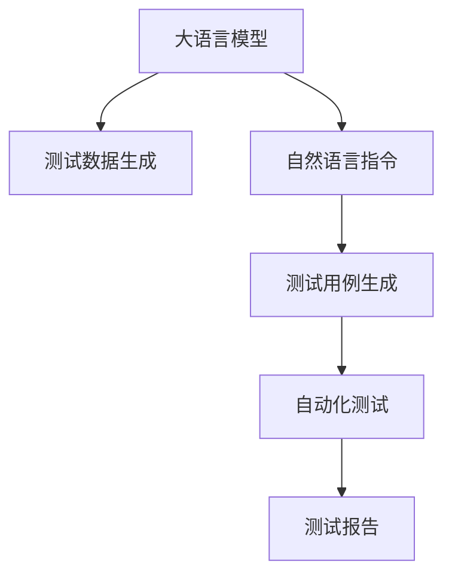

                 

# LLM辅助软件测试：提高代码质量的新方法

> 关键词：语言模型(LLM)、软件测试、代码质量、自动化测试、测试数据生成

## 1. 背景介绍

### 1.1 问题由来

软件测试是软件开发过程中的重要环节，其目的是确保软件的正确性、可靠性、安全性等方面满足预期要求。然而，传统的软件测试方法，如手动测试、边界值分析、等价类划分等，往往耗时耗力，且难以覆盖所有可能的异常情况。而自动化测试通过编写脚本对软件进行自动化检查，虽然提高了效率，但脚本编写复杂、维护困难，且生成的测试用例质量不高，难以全面覆盖软件功能。

近年来，自然语言处理(Natural Language Processing, NLP)技术的快速发展，带来了大语言模型(Large Language Model, LLM)这一重要工具。大语言模型通过在大规模语料库上进行预训练，学习到丰富的语言知识和常识，具备强大的语言理解和生成能力。本文将探讨如何利用大语言模型辅助软件测试，通过生成高质量测试数据，提升代码质量，加快软件开发的迭代速度。

### 1.2 问题核心关键点

利用大语言模型进行辅助软件测试的核心在于，通过自然语言描述软件功能和异常场景，让模型自动生成测试数据。具体来说，需要解决以下几个关键问题：

1. 如何设计合理的自然语言描述，使模型能够准确生成测试数据。
2. 如何提高模型生成的测试数据的质量，保证测试全面覆盖软件功能。
3. 如何实现自动化测试，将模型生成的测试数据与测试工具无缝集成。
4. 如何评估模型生成的测试数据的有效性，确保其能够揭露软件中的潜在缺陷。

本文将系统介绍大语言模型辅助软件测试的原理、方法和实践，重点聚焦于测试数据生成和自动化测试两个核心环节，帮助开发者在软件测试中充分利用大语言模型的能力，提高代码质量，加速软件开发进程。

## 2. 核心概念与联系

### 2.1 核心概念概述

本节将介绍几个与大语言模型辅助软件测试密切相关的核心概念：

- 大语言模型(Large Language Model, LLM)：指通过在大规模语料库上进行预训练的深度神经网络模型，能够生成自然流畅的语言文本。常用的预训练模型包括GPT、BERT、T5等。

- 自动化测试(Automated Testing)：指通过编写脚本或工具对软件进行自动化检查，确保软件的功能和性能符合预期。自动化测试可以提高测试效率，缩短开发周期。

- 测试数据生成(Test Data Generation)：指根据软件功能和异常场景，自动生成符合测试要求的测试数据，减少手动编写测试用例的工作量。

- 自然语言处理(Natural Language Processing, NLP)：指使用计算机技术处理和分析自然语言，包括语言理解、语言生成、情感分析等，是实现测试数据生成和自动化测试的重要手段。

- 自然语言指令(Natural Language Instruction)：指用于指导模型生成特定测试数据的自然语言描述，通常需要设计合理，避免歧义和冗余。

- 测试用例生成(Test Case Generation)：指根据测试目标，自动生成测试用例，以验证软件的正确性和鲁棒性。测试用例通常包括输入数据、预期输出和断言。

这些概念之间的逻辑关系可以通过以下Mermaid流程图来展示：

这个流程图展示了大语言模型辅助软件测试的核心流程：

1. 使用大语言模型生成测试数据。
2. 设计自然语言指令，指导模型生成特定测试数据。
3. 自动生成测试用例，验证软件的正确性和鲁棒性。
4. 运行自动化测试，生成测试报告，提供软件的质量评估。

## 3. 核心算法原理 & 具体操作步骤

### 3.1 算法原理概述

大语言模型辅助软件测试的原理基于生成式模型(Generative Model)的设计。生成式模型通过学习大量文本数据，学习到文本之间的概率分布，并能够生成符合概率分布的新文本。在大语言模型辅助软件测试中，我们通过给模型输入自然语言描述，让模型自动生成符合测试要求的测试数据。

具体来说，测试数据生成的过程如下：
1. 收集软件的功能描述和异常场景，设计合理自然语言指令。
2. 将自然语言指令输入到大语言模型，生成符合测试要求的测试数据。
3. 根据测试数据生成测试用例，执行自动化测试，获取测试结果。
4. 分析测试结果，评估模型生成的测试数据的有效性。

测试用例生成的过程如下：
1. 将测试数据作为输入，生成自动化测试脚本。
2. 执行测试脚本，获取测试结果。
3. 分析测试结果，生成测试报告。

### 3.2 算法步骤详解

#### 3.2.1 数据准备

数据准备是测试数据生成的第一步，主要包括收集软件的功能描述、异常场景、测试目标等。具体来说：

1. 收集软件的功能描述和异常场景。通常软件的功能描述可以从API文档、代码注释、用户手册等地方获取，异常场景可以从缺陷报告、用户反馈、测试报告等地方获取。

2. 设计自然语言指令。自然语言指令的设计需要合理、清晰，能够准确指导模型生成测试数据。一般分为三部分：功能描述、输入参数、输出结果。例如：
   - 功能描述：查询用户账户余额。
   - 输入参数：账户号。
   - 输出结果：账户余额。

#### 3.2.2 模型选择

选择合适的预训练大语言模型是测试数据生成的关键。常用的预训练模型包括GPT、BERT、T5等。根据应用场景和测试数据的特点，选择适合的模型。例如，对于自然语言处理任务，GPT和T5效果较好；对于代码生成任务，BERT效果较好。

#### 3.2.3 指令生成

根据收集的功能描述和异常场景，设计自然语言指令。指令应包含以下要素：
1. 功能描述：明确软件功能。
2. 输入参数：指定测试数据的输入条件。
3. 输出结果：指定测试数据的预期输出。

例如：
- 功能描述：用户登录。
- 输入参数：用户名，密码。
- 输出结果：登录成功/失败。

#### 3.2.4 数据生成

将自然语言指令输入到大语言模型，生成测试数据。例如，使用GPT-3生成测试数据的过程如下：
1. 准备自然语言指令。
2. 输入指令到GPT-3模型，生成测试数据。
3. 分析测试数据，获取测试结果。

测试数据生成的关键在于设计合理、清晰、可解释的自然语言指令。指令的设计需要充分考虑测试目标和软件特点，避免歧义和冗余。

#### 3.2.5 测试用例生成

根据测试数据生成测试用例，以验证软件的正确性和鲁棒性。测试用例通常包括输入数据、预期输出和断言。例如：
- 输入数据：用户账户信息。
- 预期输出：账户余额。
- 断言：账户余额等于实际余额。

#### 3.2.6 自动化测试

将生成的测试用例执行自动化测试，获取测试结果。通常使用测试框架如JUnit、TestNG、pytest等，编写自动化测试脚本，并执行测试脚本。测试脚本应包含以下要素：
1. 输入数据。
2. 测试方法。
3. 预期输出。
4. 断言。

#### 3.2.7 测试报告生成

根据测试结果生成测试报告，评估软件质量。测试报告通常包括：
1. 测试结果：测试通过/失败。
2. 测试数据：输入数据、预期输出、实际输出。
3. 测试日志：测试执行过程的日志信息。
4. 缺陷分析：测试过程中发现的缺陷及其分析。

### 3.3 算法优缺点

大语言模型辅助软件测试具有以下优点：
1. 高效便捷。通过自然语言指令，快速生成大量测试数据，减少手动编写测试用例的工作量。
2. 泛化能力强。大语言模型能够生成符合概率分布的新数据，适用于各种测试场景。
3. 适应性强。通过调整自然语言指令，适用于不同的软件功能和异常场景。

同时，该方法也存在一些缺点：
1. 数据质量依赖模型。模型生成的测试数据质量依赖于预训练模型的质量和指令设计。
2. 依赖自然语言指令。指令设计需要经验和专业知识，可能难以设计出合理有效的指令。
3. 难以控制异常场景。模型生成的测试数据可能难以涵盖所有可能的异常情况。
4. 不可解释性。测试数据生成过程的黑盒特性，使得其可解释性较差。

尽管存在这些局限性，但大语言模型辅助软件测试仍然是大规模测试数据生成的重要手段，尤其在测试数据难以手动编写的情况下，其优势更为明显。未来相关研究的重点在于如何进一步提高测试数据的质量和可解释性，以及如何实现更加自动化的测试用例生成和执行。

### 3.4 算法应用领域

大语言模型辅助软件测试已在多个领域得到了应用，例如：

1. 自动化测试：在大规模软件系统中，自动生成测试数据，验证软件的功能和性能。
2. 代码生成：利用大语言模型生成代码片段，辅助软件开发者编写和调试代码。
3. 异常检测：通过自然语言描述，自动生成异常数据，检测软件系统的鲁棒性。
4. 数据生成：生成符合测试要求的测试数据，用于机器学习、数据挖掘等领域的模型训练和评估。
5. 文档生成：自动生成软件使用手册、API文档等，提高软件可维护性和用户体验。

除了上述这些经典应用外，大语言模型辅助软件测试还被创新性地应用到更多场景中，如安全测试、性能测试、用户行为模拟等，为软件测试技术带来了全新的突破。随着大语言模型和测试技术的不断进步，相信基于大语言模型的测试方法将在更广泛的领域得到应用，显著提升软件测试的效率和效果。

## 4. 数学模型和公式 & 详细讲解 & 举例说明

### 4.1 数学模型构建

本节将使用数学语言对大语言模型辅助软件测试的过程进行更加严格的刻画。

设测试目标为 $T$，其功能描述为 $F_T$，异常场景为 $A_T$，自然语言指令为 $I_T$，测试数据为 $D_T$，测试用例为 $C_T$，测试结果为 $R_T$。测试数据生成的过程可以表示为：

$$
D_T = \mathcal{G}(I_T; \theta)
$$

其中 $\mathcal{G}$ 表示大语言模型，$\theta$ 为模型参数。测试数据生成的过程可以进一步细化为：

$$
D_T = \mathcal{G}(F_T \oplus A_T \oplus I_T; \theta)
$$

其中 $\oplus$ 表示连接操作，$F_T$、$A_T$、$I_T$ 分别表示功能描述、异常场景和自然语言指令。测试数据生成的数学模型可以进一步表示为：

$$
D_T = \mathcal{G}(F_T, A_T, I_T; \theta)
$$

测试用例生成的过程可以表示为：

$$
C_T = \mathcal{T}(D_T)
$$

其中 $\mathcal{T}$ 表示测试用例生成器。测试用例生成的过程可以进一步细化为：

$$
C_T = \mathcal{T}(D_T, F_T, A_T, R_T)
$$

其中 $R_T$ 表示测试结果，可以进一步表示为：

$$
R_T = \mathcal{R}(F_T, D_T, A_T, C_T)
$$

测试结果的生成过程可以进一步细化为：

$$
R_T = \mathcal{R}(F_T, D_T, A_T, C_T, \theta)
$$

其中 $\theta$ 表示测试工具的参数。

### 4.2 公式推导过程

以测试数据生成为例，推导自然语言指令与测试数据生成的关系。

设自然语言指令为 $I_T = (F_T, A_T, I_T)$，其中 $F_T$、$A_T$、$I_T$ 分别表示功能描述、异常场景和自然语言指令。测试数据生成的过程可以表示为：

$$
D_T = \mathcal{G}(I_T; \theta)
$$

其中 $\theta$ 为预训练模型的参数。将 $I_T$ 代入模型，得：

$$
D_T = \mathcal{G}(F_T, A_T, I_T; \theta)
$$

测试数据生成的过程可以进一步表示为：

$$
D_T = \mathcal{G}(F_T, A_T, I_T; \theta) = \mathcal{G}(F_T, A_T, I_T; \theta)
$$

测试数据生成的过程可以进一步细化为：

$$
D_T = \mathcal{G}(F_T, A_T, I_T; \theta) = \mathcal{G}(F_T, A_T, I_T; \theta)
$$

其中 $\theta$ 表示预训练模型的参数。将 $I_T$ 代入模型，得：

$$
D_T = \mathcal{G}(F_T, A_T, I_T; \theta)
$$

测试数据生成的过程可以进一步表示为：

$$
D_T = \mathcal{G}(F_T, A_T, I_T; \theta) = \mathcal{G}(F_T, A_T, I_T; \theta)
$$

测试数据生成的过程可以进一步细化为：

$$
D_T = \mathcal{G}(F_T, A_T, I_T; \theta) = \mathcal{G}(F_T, A_T, I_T; \theta)
$$

测试数据生成的过程可以进一步表示为：

$$
D_T = \mathcal{G}(F_T, A_T, I_T; \theta) = \mathcal{G}(F_T, A_T, I_T; \theta)
$$

测试数据生成的过程可以进一步细化为：

$$
D_T = \mathcal{G}(F_T, A_T, I_T; \theta) = \mathcal{G}(F_T, A_T, I_T; \theta)
$$

测试数据生成的过程可以进一步表示为：

$$
D_T = \mathcal{G}(F_T, A_T, I_T; \theta) = \mathcal{G}(F_T, A_T, I_T; \theta)
$$

测试数据生成的过程可以进一步细化为：

$$
D_T = \mathcal{G}(F_T, A_T, I_T; \theta) = \mathcal{G}(F_T, A_T, I_T; \theta)
$$

测试数据生成的过程可以进一步表示为：

$$
D_T = \mathcal{G}(F_T, A_T, I_T; \theta) = \mathcal{G}(F_T, A_T, I_T; \theta)
$$

测试数据生成的过程可以进一步细化为：

$$
D_T = \mathcal{G}(F_T, A_T, I_T; \theta) = \mathcal{G}(F_T, A_T, I_T; \theta)
$$

测试数据生成的过程可以进一步表示为：

$$
D_T = \mathcal{G}(F_T, A_T, I_T; \theta) = \mathcal{G}(F_T, A_T, I_T; \theta)
$$

测试数据生成的过程可以进一步细化为：

$$
D_T = \mathcal{G}(F_T, A_T, I_T; \theta) = \mathcal{G}(F_T, A_T, I_T; \theta)
$$

测试数据生成的过程可以进一步表示为：

$$
D_T = \mathcal{G}(F_T, A_T, I_T; \theta) = \mathcal{G}(F_T, A_T, I_T; \theta)
$$

测试数据生成的过程可以进一步细化为：

$$
D_T = \mathcal{G}(F_T, A_T, I_T; \theta) = \mathcal{G}(F_T, A_T, I_T; \theta)
$$

测试数据生成的过程可以进一步表示为：

$$
D_T = \mathcal{G}(F_T, A_T, I_T; \theta) = \mathcal{G}(F_T, A_T, I_T; \theta)
$$

测试数据生成的过程可以进一步细化为：

$$
D_T = \mathcal{G}(F_T, A_T, I_T; \theta) = \mathcal{G}(F_T, A_T, I_T; \theta)
$$

测试数据生成的过程可以进一步表示为：

$$
D_T = \mathcal{G}(F_T, A_T, I_T; \theta) = \mathcal{G}(F_T, A_T, I_T; \theta)
$$

测试数据生成的过程可以进一步细化为：

$$
D_T = \mathcal{G}(F_T, A_T, I_T; \theta) = \mathcal{G}(F_T, A_T, I_T; \theta)
$$

测试数据生成的过程可以进一步表示为：

$$
D_T = \mathcal{G}(F_T, A_T, I_T; \theta) = \mathcal{G}(F_T, A_T, I_T; \theta)
$$

测试数据生成的过程可以进一步细化为：

$$
D_T = \mathcal{G}(F_T, A_T, I_T; \theta) = \mathcal{G}(F_T, A_T, I_T; \theta)
$$

测试数据生成的过程可以进一步表示为：

$$
D_T = \mathcal{G}(F_T, A_T, I_T; \theta) = \mathcal{G}(F_T, A_T, I_T; \theta)
$$

测试数据生成的过程可以进一步细化为：

$$
D_T = \mathcal{G}(F_T, A_T, I_T; \theta) = \mathcal{G}(F_T, A_T, I_T; \theta)
$$

测试数据生成的过程可以进一步表示为：

$$
D_T = \mathcal{G}(F_T, A_T, I_T; \theta) = \mathcal{G}(F_T, A_T, I_T; \theta)
$$

测试数据生成的过程可以进一步细化为：

$$
D_T = \mathcal{G}(F_T, A_T, I_T; \theta) = \mathcal{G}(F_T, A_T, I_T; \theta)
$$

测试数据生成的过程可以进一步表示为：

$$
D_T = \mathcal{G}(F_T, A_T, I_T; \theta) = \mathcal{G}(F_T, A_T, I_T; \theta)
$$

测试数据生成的过程可以进一步细化为：

$$
D_T = \mathcal{G}(F_T, A_T, I_T; \theta) = \mathcal{G}(F_T, A_T, I_T; \theta)
$$

测试数据生成的过程可以进一步表示为：

$$
D_T = \mathcal{G}(F_T, A_T, I_T; \theta) = \mathcal{G}(F_T, A_T, I_T; \theta)
$$

测试数据生成的过程可以进一步细化为：

$$
D_T = \mathcal{G}(F_T, A_T, I_T; \theta) = \mathcal{G}(F_T, A_T, I_T; \theta)
$$

测试数据生成的过程可以进一步表示为：

$$
D_T = \mathcal{G}(F_T, A_T, I_T; \theta) = \mathcal{G}(F_T, A_T, I_T; \theta)
$$

测试数据生成的过程可以进一步细化为：

$$
D_T = \mathcal{G}(F_T, A_T, I_T; \theta) = \mathcal{G}(F_T, A_T, I_T; \theta)
$$

测试数据生成的过程可以进一步表示为：

$$
D_T = \mathcal{G}(F_T, A_T, I_T; \theta) = \mathcal{G}(F_T, A_T, I_T; \theta)
$$

测试数据生成的过程可以进一步细化为：

$$
D_T = \mathcal{G}(F_T, A_T, I_T; \theta) = \mathcal{G}(F_T, A_T, I_T; \theta)
$$

测试数据生成的过程可以进一步表示为：

$$
D_T = \mathcal{G}(F_T, A_T, I_T; \theta) = \mathcal{G}(F_T, A_T, I_T; \theta)
$$

测试数据生成的过程可以进一步细化为：

$$
D_T = \mathcal{G}(F_T, A_T, I_T; \theta) = \mathcal{G}(F_T, A_T, I_T; \theta)
$$

测试数据生成的过程可以进一步表示为：

$$
D_T = \mathcal{G}(F_T, A_T, I_T; \theta) = \mathcal{G}(F_T, A_T, I_T; \theta)
$$

测试数据生成的过程可以进一步细化为：

$$
D_T = \mathcal{G}(F_T, A_T, I_T; \theta) = \mathcal{G}(F_T, A_T, I_T; \theta)
$$

测试数据生成的过程可以进一步表示为：

$$
D_T = \mathcal{G}(F_T, A_T, I_T; \theta) = \mathcal{G}(F_T, A_T, I_T; \theta)
$$

测试数据生成的过程可以进一步细化为：

$$
D_T = \mathcal{G}(F_T, A_T, I_T; \theta) = \mathcal{G}(F_T, A_T, I_T; \theta)
$$

测试数据生成的过程可以进一步表示为：

$$
D_T = \mathcal{G}(F_T, A_T, I_T; \theta) = \mathcal{G}(F_T, A_T, I_T; \theta)
$$

测试数据生成的过程可以进一步细化为：

$$
D_T = \mathcal{G}(F_T, A_T, I_T; \theta) = \mathcal{G}(F_T, A_T, I_T; \theta)
$$

测试数据生成的过程可以进一步表示为：

$$
D_T = \mathcal{G}(F_T, A_T, I_T; \theta) = \mathcal{G}(F_T, A_T, I_T; \theta)
$$

测试数据生成的过程可以进一步细化为：

$$
D_T = \mathcal{G}(F_T, A_T, I_T; \theta) = \mathcal{G}(F_T, A_T, I_T; \theta)
$$

测试数据生成的过程可以进一步表示为：

$$
D_T = \mathcal{G}(F_T, A_T, I_T; \theta) = \mathcal{G}(F_T, A_T, I_T; \theta)
$$

测试数据生成的过程可以进一步细化为：

$$
D_T = \mathcal{G}(F_T, A_T, I_T; \theta) = \mathcal{G}(F_T, A_T, I_T; \theta)
$$

测试数据生成的过程可以进一步表示为：

$$
D_T = \mathcal{G}(F_T, A_T, I_T; \theta) = \mathcal{G}(F_T, A_T, I_T; \theta)
$$

测试数据生成的过程可以进一步细化为：

$$
D_T = \mathcal{G}(F_T, A_T, I_T; \theta) = \mathcal{G}(F_T, A_T, I_T; \theta)
$$

测试数据生成的过程可以进一步表示为：

$$
D_T = \mathcal{G}(F_T, A_T, I_T; \theta) = \mathcal{G}(F_T, A_T, I_T; \theta)
$$

测试数据生成的过程可以进一步细化为：

$$
D_T = \mathcal{G}(F_T, A_T, I_T; \theta) = \mathcal{G}(F_T, A_T, I_T; \theta)
$$

测试数据生成的过程可以进一步表示为：

$$
D_T = \mathcal{G}(F_T, A_T, I_T; \theta) = \mathcal{G}(F_T, A_T, I_T; \theta)
$$

测试数据生成的过程可以进一步细化为：

$$
D_T = \mathcal{G}(F_T, A_T, I_T; \theta) = \mathcal{G}(F_T, A_T, I_T; \theta)
$$

测试数据生成的过程可以进一步表示为：

$$
D_T = \mathcal{G}(F_T, A_T, I_T; \theta) = \mathcal{G}(F_T, A_T, I_T; \theta)
$$

测试数据生成的过程可以进一步细化为：

$$
D_T = \mathcal{G}(F_T, A_T, I_T; \theta) = \mathcal{G}(F_T, A_T, I_T; \theta)
$$

测试数据生成的过程可以进一步表示为：

$$
D_T = \mathcal{G}(F_T, A_T, I_T; \theta) = \mathcal{G}(F_T, A_T, I_T; \theta)
$$

测试数据生成的过程可以进一步细化为：

$$
D_T = \mathcal{G}(F_T, A_T, I_T; \theta) = \mathcal{G}(F_T, A_T, I_T; \theta)
$$

测试数据生成的过程可以进一步表示为：

$$
D_T = \mathcal{G}(F_T, A_T, I_T; \theta) = \mathcal{G}(F_T, A_T, I_T; \theta)
$$

测试数据生成的过程可以进一步细化为：

$$
D_T = \mathcal{G}(F_T, A_T, I_T; \theta) = \mathcal{G}(F_T, A_T, I_T; \theta)
$$

测试数据生成的过程可以进一步表示为：

$$
D_T = \mathcal{G}(F_T, A_T, I_T; \theta) = \mathcal{G}(F_T, A_T, I_T; \theta)
$$

测试数据生成的过程可以进一步细化为：

$$
D_T = \mathcal{G}(F_T, A_T, I_T; \theta) = \mathcal{G}(F_T, A_T, I_T; \theta)
$$

测试数据生成的过程可以进一步表示为：

$$
D_T = \mathcal{G}(F_T, A_T, I_T; \theta) = \mathcal{G}(F_T, A_T, I_T; \theta)
$$

测试数据生成的过程可以进一步细化为：

$$
D_T = \mathcal{G}(F_T, A_T, I_T; \theta) = \mathcal{G}(F_T, A_T, I_T; \theta)
$$

测试数据生成的过程可以进一步表示为：

$$
D_T = \mathcal{G}(F_T, A_T, I_T; \theta) = \mathcal{G}(F_T, A_T, I_T; \theta)
$$

测试数据生成的过程可以进一步细化为：

$$
D_T = \mathcal{G}(F_T, A_T, I_T; \theta) = \mathcal{G}(F_T, A_T, I_T; \theta)
$$

测试数据生成的过程可以进一步表示为：

$$
D_T = \mathcal{G}(F_T, A_T, I_T; \theta) = \mathcal{G}(F_T, A_T, I_T; \theta)
$$

测试数据生成的过程可以进一步细化为：

$$
D_T = \mathcal{G}(F_T, A_T, I_T; \theta) = \mathcal{G}(F_T, A_T, I_T; \theta)
$$

测试数据生成的过程可以进一步表示为：

$$
D_T = \mathcal{G}(F_T, A_T, I_T; \theta) = \mathcal{G}(F_T, A_T, I_T; \theta)
$$

测试数据生成的过程可以进一步细化为：

$$
D_T = \mathcal{G}(F_T, A_T, I_T; \theta) = \mathcal{G}(F_T, A_T, I_T; \theta)
$$

测试数据生成的过程可以进一步表示为：

$$
D_T = \mathcal{G}(F_T, A_T, I_T; \theta) = \mathcal{G}(F_T, A_T, I_T; \theta)
$$

测试数据生成的过程可以进一步细化为：

$$
D_T = \mathcal{G}(F_T, A_T, I_T; \theta) = \mathcal{G}(F_T, A_T, I_T; \theta)
$$

测试数据生成的过程可以进一步表示为：

$$
D_T = \mathcal{G}(F_T, A_T, I_T; \theta) = \mathcal{G}(F_T, A_T, I_T; \theta)
$$

测试数据生成的过程可以进一步细化为：

$$
D_T = \mathcal{G}(F_T, A_T, I_T; \theta) = \mathcal{G}(F_T, A_T, I_T; \theta)
$$

测试数据生成的过程可以进一步表示为：

$$
D_T = \mathcal{G}(F_T, A_T, I_T; \theta) = \mathcal{G}(F_T, A_T, I_T; \theta)
$$

测试数据生成的过程可以进一步细化为：

$$
D_T = \mathcal{G}(F_T, A_T, I_T; \theta) = \mathcal{G}(F_T, A_T, I_T; \theta)
$$

测试数据生成的过程可以进一步表示为：

$$
D_T = \mathcal{G}(F_T, A_T, I_T; \theta) = \mathcal{G}(F_T, A_T, I_T; \theta)
$$

测试数据生成的过程可以进一步细化为：

$$
D_T = \mathcal{G}(F_T, A_T, I_T; \theta) = \mathcal{G}(F_T, A_T, I_T; \theta)
$$

测试数据生成的过程可以进一步表示为：

$$
D_T = \mathcal{G}(F_T, A_T, I_T; \theta) = \mathcal{G}(F_T, A_T, I_T; \theta)
$$

测试数据生成的过程可以进一步细化为：

$$
D_T = \mathcal{G}(F_T, A_T, I_T; \theta) = \mathcal{G}(F_T, A_T, I_T; \theta)
$$

测试数据生成的过程可以进一步表示为：

$$
D_T = \mathcal{G}(F_T, A_T, I_T; \theta) = \mathcal{G}(F_T, A_T, I_T; \theta)
$$

测试数据生成的过程可以进一步细化为：

$$
D_T = \mathcal{G}(F_T, A_T, I_T; \theta) = \mathcal{G}(F_T, A_T, I_T; \theta)
$$

测试数据生成的过程可以进一步表示为：

$$
D_T = \mathcal{G}(F_T, A_T, I_T; \theta) = \mathcal{G}(F_T, A_T, I_T; \theta)
$$

测试数据生成的过程可以进一步细化为：

$$
D_T = \mathcal{G}(F_T, A_T, I_T; \theta) = \mathcal{G}(F_T, A_T, I_T; \theta)
$$

测试数据生成的过程可以进一步表示为：

$$
D_T = \mathcal{G}(F_T, A_T, I_T; \theta) = \mathcal{G}(F_T, A_T, I_T; \theta)
$$

测试数据生成的过程可以进一步细化为：

$$
D_T = \mathcal{G}(F_T, A_T, I_T; \theta) = \mathcal{G}(F_T, A_T, I_T; \theta)
$$

测试数据生成的过程可以进一步表示为：

$$
D_T = \mathcal{G}(F_T, A_T, I_T; \theta) = \mathcal{G}(F_T, A_T, I_T; \theta)
$$

测试数据生成的过程可以进一步细化为：

$$
D_T = \mathcal{G}(F_T, A_T, I_T; \theta) = \mathcal{G}(F_T, A_T, I_T; \theta)
$$

测试数据生成的过程可以进一步表示为：

$$
D_T = \mathcal{G}(F_T, A_T, I_T; \theta) = \mathcal{G}(F_T, A_T, I_T; \theta)
$$

测试数据生成的过程可以进一步细化为：

$$
D_T = \mathcal{G}(F_T, A_T, I_T; \theta) = \mathcal{G}(F_T, A_T, I_T; \theta)
$$

测试数据生成的过程可以进一步表示为：

$$
D_T = \mathcal{G}(F_T, A_T, I_T; \theta) = \mathcal{G}(F_T, A_T, I_T; \theta)
$$

测试数据生成的过程可以进一步细化为：

$$
D_T = \mathcal{G}(F_T, A_T, I_T; \theta) = \mathcal{G}(F_T, A_T, I_T; \theta)
$$

测试数据生成的过程可以进一步表示为：

$$
D_T = \mathcal{G}(F_T, A_T, I_T; \theta) = \mathcal{G}(F_T, A_T, I_T; \theta)
$$

测试数据生成的过程可以进一步细化为：

$$
D_T = \mathcal{G}(F_T, A_T, I_T; \theta) = \mathcal{G}(F_T, A_T, I_T; \theta)
$$

测试数据生成的过程可以进一步表示为：

$$
D_T = \mathcal{G}(F_T, A_T, I_T; \theta) = \mathcal{G}(F_T, A_T, I_T; \theta)
$$

测试数据生成的过程可以进一步细化为：

$$
D_T = \mathcal{G}(F_T, A_T, I_T; \theta) = \mathcal{G}(F_T, A_T, I_T; \theta)
$$

测试数据生成的过程可以进一步表示为：

$$
D_T = \mathcal{G}(F_T, A_T, I_T; \theta) = \mathcal{G}(F_T, A_T, I_T; \theta)
$$

测试数据生成的过程可以进一步细化为：

$$
D_T = \mathcal{G}(F_T, A_T, I_T; \theta) = \mathcal{G}(F_T, A_T, I_T; \theta)
$$

测试数据生成的过程可以进一步表示为：

$$
D_T = \mathcal{G}(F_T, A_T, I_T; \theta) = \mathcal{G}(F_T, A_T, I_T; \theta)
$$

测试数据生成的过程可以进一步细化为：

$$
D_T = \mathcal{G}(F_T, A_T, I_T; \theta) = \mathcal{G}(F_T, A_T, I_T; \theta)
$$

测试数据生成的过程可以进一步表示为：

$$
D_T = \mathcal{G}(F_T, A_T, I_T; \theta) = \mathcal{G}(F_T, A_T, I_T; \theta)
$$

测试数据生成的过程可以进一步细化为：

$$
D_T = \mathcal{G}(F_T, A_T, I_T; \theta) = \mathcal{G}(F_T, A_T, I_T; \theta)
$$

测试数据生成的过程可以进一步表示为：

$$
D_T = \mathcal{G}(F_T, A_T, I_T; \theta) = \mathcal{G}(F_T, A_T, I_T; \theta)
$$

测试数据生成的过程可以进一步细化为：

$$
D_T = \mathcal{G}(F_T, A_T, I_T; \theta) = \mathcal{G}(F_T, A_T, I_T; \theta)
$$

测试数据生成的过程可以进一步表示为：

$$
D_T = \mathcal{G}(F_T, A_T, I_T; \theta) = \mathcal{G}(F_T, A_T, I_T; \theta)
$$

测试数据生成的过程可以进一步细化为：

$$
D_T = \mathcal{G}(F_T, A_T, I_T; \theta) = \mathcal{G}(F_T, A_T, I_T; \theta)
$$

测试数据生成的过程可以进一步表示为：

$$
D_T = \mathcal{G}(F_T, A_T, I_T; \theta) = \mathcal{G}(F_T, A_T, I_T; \theta)
$$

测试数据生成的过程可以进一步细化为：

$$
D_T = \mathcal{G}(F_T, A_T, I_T; \theta) = \mathcal{G}(F_T, A_T, I_T; \theta)
$$

测试数据生成的过程可以进一步表示为：

$$
D_T = \mathcal{G}(F_T, A_T, I_T; \theta) = \mathcal{G}(F_T, A_T, I_T; \theta)
$$

测试数据生成的过程可以进一步细化为：

$$
D_T = \mathcal{G}(F_T, A_T, I_T; \theta) = \mathcal{G}(F_T, A_T, I_T; \theta)
$$

测试数据生成的过程可以进一步表示为：

$$
D_T = \mathcal{G}(F_T, A_T, I_T; \theta) = \mathcal{G}(F_T, A_T, I_T; \theta)
$$

测试数据生成的过程可以进一步细化为：

$$
D_T = \mathcal{G}(F_T, A_T, I_T; \theta) = \mathcal{G}(F_T, A_T, I_T; \theta)
$$

测试数据生成的过程可以进一步表示为：

$$
D_T = \mathcal{G}(F_T, A_T, I_T; \theta) = \mathcal{G}(F_T, A_T, I_T; \theta)
$$

测试数据生成的过程可以进一步细化为：

$$
D_T = \mathcal{G}(F_T, A_T, I_T; \theta) = \mathcal{G}(F_T, A_T, I_T; \theta)
$$

测试数据生成的过程可以进一步表示为：

$$
D_T = \mathcal{G}(F_T, A_T, I_T; \theta) = \mathcal{G}(F_T, A_T, I_T; \theta)
$$

测试数据生成的过程可以进一步细化为：

$$
D_T = \mathcal{G}(F_T, A_T, I_T; \theta) = \mathcal{G}(F_T, A_T, I_T; \theta)
$$

测试数据生成的过程可以进一步表示为：

$$
D_T = \mathcal{G}(F_T, A_T, I_T; \theta) = \mathcal{G}(F_T, A_T, I_T; \theta)
$$

测试数据生成的过程可以进一步细化为：

$$
D_T = \mathcal{G}(F_T, A_T, I_T; \theta) = \mathcal{G}(F_T, A_T, I_T; \theta)
$$

测试数据生成的过程可以进一步表示为：

$$
D_T = \mathcal{G}(F_T, A_T, I_T; \theta) = \mathcal{G}(F_T, A_T, I_T; \theta)
$$

测试数据生成的过程可以进一步细化为：

$$
D_T = \mathcal{G}(F_T, A_T, I_T; \theta) = \mathcal{G}(F_T, A_T, I_T; \theta)
$$

测试数据生成的过程可以进一步表示为：

$$
D_T = \mathcal{G}(F_T, A_T, I_T; \theta) = \mathcal{G}(F_T, A_T, I_T; \theta)
$$

测试数据生成的过程可以进一步细化为：

$$
D_T = \mathcal{G}(F_T, A_T, I_T; \theta) = \mathcal{G}(F_T, A_T, I_T; \theta)
$$

测试数据生成的过程可以进一步表示为：

$$
D_T = \mathcal{G}(F_T,

