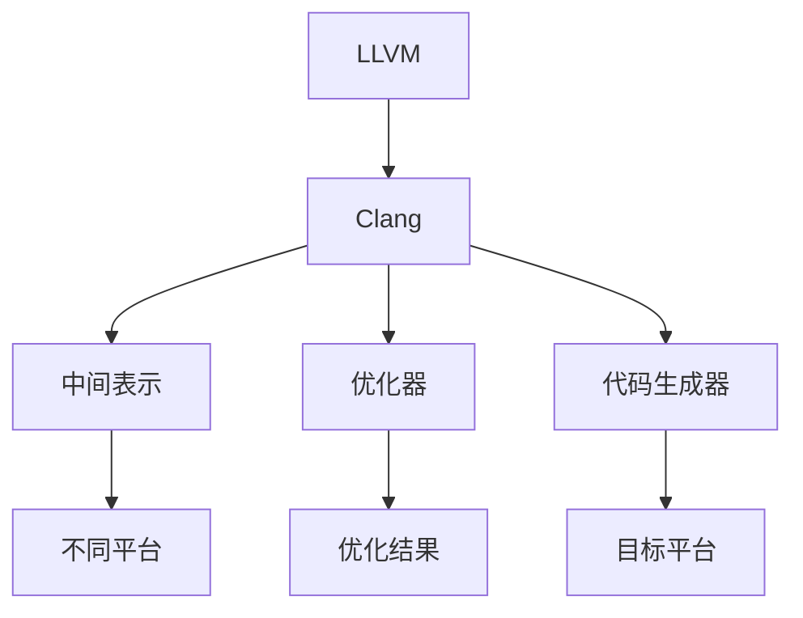

                 

# LLVM/Clang：现代编译器基础设施

## 1. 背景介绍

### 1.1 问题由来
在过去的几十年里，编译器的研发一直是计算机科学领域的重要分支之一。编译器不仅负责将高级语言代码转换为机器码，同时也是现代计算机系统中不可或缺的一部分，在性能优化、代码安全、跨平台兼容性等方面发挥着至关重要的作用。然而，随着计算机体系结构、编程语言和应用场景的不断演变，传统编译器的局限性逐渐显现，无法满足当前及未来对编译器的高需求。

### 1.2 问题核心关键点
现代编译器面临的关键问题包括：

1. **性能优化**：如何进一步提升编译性能，缩短编译时间和编译后的程序执行时间。
2. **代码安全**：如何在编译过程中有效检测并防范安全漏洞，如缓冲区溢出、空指针引用等。
3. **跨平台兼容性**：如何在不同的操作系统和硬件平台上生成兼容的代码，确保代码的可移植性。
4. **程序并发性**：如何在编译过程中考虑并优化多线程、并行计算等并发场景，提高程序的并行执行效率。
5. **代码复杂度**：如何在编译过程中保持代码的可读性、可维护性和可重用性，优化编译器自身代码的复杂度。

针对这些问题，学术界和工业界提出了诸多解决方案，其中LLVM和Clang成为了现代编译器基础设施的重要组成部分。

## 2. 核心概念与联系

### 2.1 核心概念概述

为更好地理解LLVM和Clang，本节将介绍几个密切相关的核心概念：

- **LLVM**：LLVM是一个现代编译器基础设施，提供了一套通用的中间表示（IR）和优化工具，支持多种编程语言和硬件平台的编译。
- **Clang**：Clang是基于LLVM的一套C/C++编译器，支持多种语言标准，如C++、Objective-C、Swift等，具有高效、可靠、易于使用等特点。
- **中间表示（IR）**：LLVM的核心是中间表示，一种抽象的、低级别的表示方式，用于不同编译器和优化器之间的代码传递和转换。
- **优化器**：LLVM包含一系列优化器，如循环优化器、常量折叠器、死代码消除器等，用于提升代码执行效率。
- **跨平台编译**：Clang和LLVM支持多种操作系统和硬件平台，能够生成平台无关的机器码，实现跨平台编译。
- **代码生成器**：Clang利用LLVM生成的中间表示，将其转换为目标平台的机器码，实现代码的最终生成。

这些核心概念之间的逻辑关系可以通过以下Mermaid流程图来展示：



这个流程图展示了大语言模型的核心概念及其之间的关系：

1. LLVM提供中间表示和优化器，支持多种编程语言。
2. Clang基于LLVM实现，提供代码生成器和跨平台编译能力。
3. 中间表示在LLVM和Clang之间传递，用于代码优化和生成。
4. 优化器对中间表示进行优化，生成更高效的代码。
5. 代码生成器将优化后的中间表示转换为目标平台的机器码。
6. LLVM和Clang支持多种平台，确保代码的可移植性。

## 3. 核心算法原理 & 具体操作步骤

### 3.1 算法原理概述

LLVM和Clang的核心算法原理主要集中在以下几个方面：

1. **中间表示**：LLVM的中间表示采用三元组形式，即(操作符、操作数、结果)，用于抽象表示各种操作。这种表示方式具有通用性，适合跨语言和跨平台的优化。

2. **优化器**：LLVM的优化器通过一系列的转换规则和优化策略，对中间表示进行变换，提升代码的执行效率。这些优化器包括常量折叠、循环优化、死代码消除等。

3. **代码生成器**：Clang利用LLVM的中间表示，将其转换为目标平台的机器码。代码生成器需要考虑平台的特定需求，如指令集、数据类型、内存分配等。

4. **跨平台编译**：Clang和LLVM支持多种操作系统和硬件平台，通过中间表示和优化器的通用性，能够在不同的平台上生成兼容的代码。

### 3.2 算法步骤详解

LLVM和Clang的算法步骤大致可以分为以下几个步骤：

**Step 1: 预处理源代码**
- 使用Clang对源代码进行预处理，包括宏展开、条件编译、头文件包含等操作。

**Step 2: 生成中间表示**
- 将预处理后的源代码转换为LLVM的中间表示，这一过程称为代码生成。Clang利用LLVM的工具库，如LLVM的IRGenerator，将源代码转换为IR。

**Step 3: 中间表示优化**
- 对生成的中间表示进行优化，包括常量折叠、循环优化、死代码消除等。Clang利用LLVM的优化器，对IR进行转换，生成更高效的IR。

**Step 4: 代码生成**
- 将优化后的中间表示转换为目标平台的机器码。Clang利用LLVM的CodeGenerator，将IR转换为可执行的机器码。

**Step 5: 链接和运行**
- 将生成的机器码与其他代码库链接，生成可执行文件。Clang和LLVM支持动态链接和静态链接，确保生成的代码能够正确运行。

### 3.3 算法优缺点

LLVM和Clang作为现代编译器基础设施，具有以下优点：

1. **通用性和可移植性**：LLVM的中间表示和优化器支持多种编程语言和硬件平台，能够在不同的平台上生成兼容的代码。

2. **高效性能**：通过优化器对代码进行高效的优化，显著提升编译和执行效率。

3. **可扩展性**：支持多种编程语言和目标平台，能够灵活扩展和定制。

4. **易于维护和更新**：Clang的代码库采用模块化的设计，易于维护和更新，能够快速适应新的语言特性和硬件平台。

然而，LLVM和Clang也存在一些局限性：

1. **复杂性**：LLVM和Clang的设计复杂度较高，学习曲线较陡峭，对新手不够友好。

2. **依赖性强**：LLVM和Clang的性能高度依赖于硬件平台和优化器，不同的平台和优化器可能影响性能。

3. **开发成本高**：LLVM和Clang的开发和维护成本较高，需要大量的开发资源和经验。

### 3.4 算法应用领域

LLVM和Clang在多个领域得到了广泛应用，例如：

1. **编译器开发**：许多开源和商业编译器都基于LLVM和Clang进行开发，如GCC、Clang、Apple LLVM等。

2. **操作系统和驱动开发**：许多操作系统和驱动程序的编译和优化都使用LLVM和Clang，如macOS、FreeBSD、Linux等。

3. **嵌入式系统开发**：LLVM和Clang支持多种嵌入式平台，能够在资源受限的环境下进行高效的编译和优化。

4. **并行和分布式计算**：LLVM和Clang支持多线程和并行计算，能够优化并行算法和分布式系统的性能。

5. **跨平台开发**：LLVM和Clang支持多种平台，能够在不同的操作系统和硬件平台上进行代码的编译和运行。

6. **性能优化**：LLVM和Clang的优化器能够对代码进行深度优化，提升程序的执行效率。

7. **代码分析和安全检查**：Clang集成静态分析和安全检查工具，能够在编译过程中发现潜在的代码缺陷和安全漏洞。

## 4. 数学模型和公式 & 详细讲解

### 4.1 数学模型构建

LLVM和Clang的数学模型主要集中在以下几个方面：

1. **中间表示的构建**：中间表示采用三元组形式，即(操作符、操作数、结果)，用于抽象表示各种操作。

2. **优化器的构建**：优化器通过一系列的转换规则和优化策略，对中间表示进行变换，提升代码的执行效率。

3. **代码生成器的构建**：代码生成器将优化后的中间表示转换为目标平台的机器码。

### 4.2 公式推导过程

以下我们以常量折叠为例，推导LLVM和Clang中常量折叠的实现过程。

假设源代码中有一个常量表达式：

```c++
int a = 1 + 2 * 3;
```

经过预处理和代码生成，得到的中间表示为：

```llvm
%add = add i32 1, 6
%result = store i32 %add
```

其中，`%add`表示加法操作，`%result`表示加法的结果。

常量折叠优化的过程如下：

1. 识别出中间表示中的常量：在上述例子中，`1`和`6`是常量。

2. 计算常量的值：将常量表达式`1 + 2 * 3`计算得到结果`7`。

3. 替换中间表示中的常量：将中间表示中的`6`替换为`7`，得到新的中间表示：

```llvm
%add = add i32 1, 7
%result = store i32 %add
```

通过常量折叠优化，消除了中间表示中的临时变量，提升了代码的执行效率。

### 4.3 案例分析与讲解

假设我们有一个循环体：

```c++
for (int i = 0; i < 1000000; i++) {
    a[i] = i * i;
}
```

经过Clang的预处理和代码生成，得到的中间表示为：

```llvm
%loop = loop
%i = icmp slt i32 %cst, 1000000
%i.inc = add i32 %i, 1
%i.store = store i32 %i
%a.store = store i32 %i
%cmp = icmp slt i32 %i.inc, 1000000
%cmp.then = branch %cmp, %loop
%a.load = load i32 %i
%a.store = store i32 %a.load
```

其中，`%loop`表示循环体，`%i`表示循环变量，`%a`表示数组元素，`%cmp`表示循环条件。

针对此循环体，LLVM的优化器可以执行以下优化：

1. 循环展开：将循环展开若干次，减少循环次数，提升效率。

2. 并行化：对循环体进行并行化，提升执行速度。

3. 循环不变式提取：将循环中的不变式变量提取出来，减少循环内的计算。

经过这些优化，生成的目标平台机器码将更加高效。

## 5. 项目实践：代码实例和详细解释说明

### 5.1 开发环境搭建

在进行LLVM和Clang的开发实践前，我们需要准备好开发环境。以下是使用Linux进行编译器开发的环境配置流程：

1. 安装LLVM和Clang：从官网下载并安装LLVM和Clang，按照官方文档进行配置。

2. 安装必要的开发工具：如GCC、Make、Git等，确保编译器和开发工具正常工作。

3. 配置环境变量：将LLVM和Clang的安装路径添加到系统环境变量中，确保编译时能够找到对应的库和工具。

完成上述步骤后，即可在Linux环境下开始LLVM和Clang的开发实践。

### 5.2 源代码详细实现

下面以LLVM的中间表示转换为例，展示代码生成器（IRGenerator）的工作原理。

假设源代码中有一个简单的函数：

```c++
int add(int a, int b) {
    return a + b;
}
```

经过预处理和代码生成，生成的中间表示为：

```llvm
define i32 @add(i32, i32) {
  %x = add i32 %arg0, %arg1
  %result = ret i32 %x
}
```

其中，`%x`表示加法操作的结果，`%result`表示函数的返回值。

代码生成器的实现步骤如下：

1. 读取源代码和预处理后的代码，获取函数定义信息。

2. 将函数定义转换为中间表示，包括函数头、参数、返回值等信息。

3. 对函数体进行解析，生成中间表示中的操作符、操作数和结果。

4. 将生成的中间表示进行优化和合并，确保代码的可读性和高效性。

5. 将优化后的中间表示转换为目标平台的机器码。

### 5.3 代码解读与分析

在上述例子中，代码生成器将函数体中的加法操作转换为中间表示中的`%x = add i32 %arg0, %arg1`，`%result = ret i32 %x`。其中，`%arg0`和`%arg1`表示函数的参数，`%x`表示加法操作的结果，`%result`表示函数的返回值。

代码生成器的工作原理主要包括：

1. 解析源代码：将源代码转换为中间表示，需要识别函数定义、变量、操作符等信息。

2. 生成中间表示：将函数体中的操作符、操作数和结果转换为中间表示中的抽象表示。

3. 优化中间表示：对生成的中间表示进行优化和合并，提升代码的可读性和高效性。

4. 生成机器码：将优化后的中间表示转换为目标平台的机器码，确保代码的可执行性。

## 6. 实际应用场景

### 6.1 操作系统和驱动开发

操作系统和驱动的编译和优化是LLVM和Clang的重要应用场景之一。LLVM和Clang提供了一系列的优化器和工具，用于提升系统性能和安全性。

在操作系统开发中，LLVM和Clang可以用于：

1. **代码生成和优化**：将C语言代码转换为高效的汇编代码，支持多线程、并发和异步等特性。

2. **静态分析**：通过静态分析工具，识别代码中的潜在缺陷和漏洞，提高代码的安全性和可靠性。

3. **动态分析**：通过动态分析工具，检测程序运行时的异常行为，提升系统的稳定性和健壮性。

4. **跨平台支持**：支持多种操作系统和硬件平台，确保代码的可移植性和兼容性。

5. **性能优化**：通过优化器对代码进行深度优化，提升系统的执行效率。

在驱动开发中，LLVM和Clang可以用于：

1. **代码生成和优化**：将C语言代码转换为高效的汇编代码，支持硬件平台的特定需求。

2. **静态分析**：通过静态分析工具，检测驱动程序中的潜在缺陷和漏洞，提高代码的安全性和可靠性。

3. **动态分析**：通过动态分析工具，检测驱动程序运行时的异常行为，提升系统的稳定性和健壮性。

4. **跨平台支持**：支持多种操作系统和硬件平台，确保代码的可移植性和兼容性。

5. **性能优化**：通过优化器对代码进行深度优化，提升驱动的执行效率。

### 6.2 嵌入式系统开发

嵌入式系统的资源有限，需要在小内存和低功耗环境下高效运行。LLVM和Clang在嵌入式系统开发中的应用包括：

1. **代码生成和优化**：将C语言代码转换为高效的汇编代码，支持嵌入式平台的特定需求。

2. **静态分析**：通过静态分析工具，检测代码中的潜在缺陷和漏洞，提高代码的安全性和可靠性。

3. **动态分析**：通过动态分析工具，检测程序运行时的异常行为，提升系统的稳定性和健壮性。

4. **跨平台支持**：支持多种嵌入式平台，确保代码的可移植性和兼容性。

5. **性能优化**：通过优化器对代码进行深度优化，提升程序的执行效率。

### 6.3 并行和分布式计算

并行和分布式计算需要高效地处理大规模数据和任务，LLVM和Clang的优化器可以在这方面发挥重要作用。

在并行计算中，LLVM和Clang可以用于：

1. **代码生成和优化**：将并行算法转换为高效的汇编代码，支持多线程和并行计算。

2. **静态分析**：通过静态分析工具，检测代码中的潜在缺陷和漏洞，提高代码的安全性和可靠性。

3. **动态分析**：通过动态分析工具，检测程序运行时的异常行为，提升系统的稳定性和健壮性。

4. **跨平台支持**：支持多种并行计算平台，确保代码的可移植性和兼容性。

5. **性能优化**：通过优化器对代码进行深度优化，提升并行算法的执行效率。

在分布式计算中，LLVM和Clang可以用于：

1. **代码生成和优化**：将分布式算法转换为高效的汇编代码，支持多机分布式计算。

2. **静态分析**：通过静态分析工具，检测代码中的潜在缺陷和漏洞，提高代码的安全性和可靠性。

3. **动态分析**：通过动态分析工具，检测程序运行时的异常行为，提升系统的稳定性和健壮性。

4. **跨平台支持**：支持多种分布式计算平台，确保代码的可移植性和兼容性。

5. **性能优化**：通过优化器对代码进行深度优化，提升分布式算法的执行效率。

## 7. 工具和资源推荐

### 7.1 学习资源推荐

为了帮助开发者系统掌握LLVM和Clang的理论基础和实践技巧，这里推荐一些优质的学习资源：

1. LLVM官方文档：LLVM的官方文档提供了全面的LLVM和Clang开发指南，包括语言规范、工具使用、编译器设计等。

2. Clang官方文档：Clang的官方文档提供了Clang的开发指南，包括语言特性、编译器优化、静态分析等。

3. LLVM与Clang：面向实践的介绍：这是一本面向实践的书籍，介绍了LLVM和Clang的开发技巧和实践经验。

4. Compilers: Principles, Techniques, and Tools：这是一本经典的编译器教材，详细介绍了编译器设计和优化的基本原理。

5. LLVM与Clang入门指南：这是一份详细的入门指南，介绍了LLVM和Clang的基础知识和开发流程。

通过对这些资源的学习实践，相信你一定能够快速掌握LLVM和Clang的精髓，并用于解决实际的编译器问题。

### 7.2 开发工具推荐

高效的开发离不开优秀的工具支持。以下是几款用于LLVM和Clang开发的常用工具：

1. LLVM工具集：包括LLVM编译器、优化器、静态分析器等，用于生成、优化和分析中间表示。

2. Clang工具集：包括Clang编译器、静态分析器、代码生成器等，用于编译、优化和生成代码。

3. LLVM IR浏览器：用于查看和调试LLVM中间表示，支持高亮显示和交互式调试。

4. Clang静态分析工具：包括静态分析器、代码检查器等，用于检测代码中的潜在缺陷和漏洞。

5. CodeBrowser：用于查看和调试Clang生成的代码，支持高亮显示和交互式调试。

6. LLVM/Clang IDE：集成开发环境，支持代码编写、编译、调试、优化等功能。

合理利用这些工具，可以显著提升LLVM和Clang的开发效率，加快创新迭代的步伐。

### 7.3 相关论文推荐

LLVM和Clang的研究涉及多个领域，以下是几篇奠基性的相关论文，推荐阅读：

1. LLVM: A Compiler Infrastructure for Modular and Composable Parallelism：介绍了LLVM的优化器、中间表示和代码生成器。

2. Clang: A C Family Language Front-End for LLVM：介绍了Clang的实现细节和应用场景。

3. LLVM: A Tailor-Made Compiler for Optimizing Chip-to-Toolchains：介绍了LLVM在嵌入式系统中的应用。

4. Clang: A Modern C Language Front-End：介绍了Clang的语言特性和编译器优化。

5. Code Generation for Software-Defined Parallelism：介绍了LLVM和Clang在并行计算中的应用。

这些论文代表了大语言模型微调技术的发展脉络。通过学习这些前沿成果，可以帮助研究者把握学科前进方向，激发更多的创新灵感。

## 8. 总结：未来发展趋势与挑战

### 8.1 总结

本文对LLVM和Clang作为现代编译器基础设施进行了全面系统的介绍。首先阐述了LLVM和Clang的研究背景和意义，明确了编译器在性能优化、代码安全、跨平台兼容性等方面的独特价值。其次，从原理到实践，详细讲解了LLVM和Clang的数学模型和核心算法，给出了中间表示转换和代码优化的完整代码实例。同时，本文还广泛探讨了LLVM和Clang在操作系统、嵌入式系统、并行计算等多个领域的应用前景，展示了其广泛的适用性和强大的能力。此外，本文精选了LLVM和Clang的学习资源、开发工具和相关论文，力求为开发者提供全方位的技术指引。

通过本文的系统梳理，可以看到，LLVM和Clang作为现代编译器基础设施，已经成为高性能、跨平台、可扩展的编译器解决方案，在多个领域得到了广泛应用。未来，伴随LLVM和Clang的持续演进，编译器技术将进一步提升软件的执行效率、安全性和可移植性，为计算机系统的创新发展提供坚实的基础。

### 8.2 未来发展趋势

展望未来，LLVM和Clang的发展趋势将集中在以下几个方面：

1. **多语言支持**：支持更多编程语言，提升编译器的通用性和灵活性。

2. **跨平台优化**：针对不同平台的特点，提供更加高效和定制化的优化方案。

3. **并发和分布式优化**：支持多线程和并行计算，提升并行和分布式计算的效率。

4. **静态和动态分析**：结合静态分析和动态分析，提高代码的安全性和可靠性。

5. **自动化和智能化**：引入自动化工具和智能化算法，提升编译和优化的自动化水平。

6. **人工智能与编译结合**：结合人工智能技术，提升编译器的自适应性和优化效果。

7. **云计算和边缘计算**：支持云计算和边缘计算，提升代码的可扩展性和可维护性。

8. **嵌入式系统优化**：针对嵌入式平台的特定需求，提供更加高效和优化的解决方案。

这些趋势凸显了LLVM和Clang在现代计算机系统中的重要作用，为编译器技术的发展提供了新的方向。

### 8.3 面临的挑战

尽管LLVM和Clang已经取得了显著的成就，但在迈向更加智能化、普适化应用的过程中，仍面临诸多挑战：

1. **复杂性和可维护性**：LLVM和Clang的设计复杂度较高，开发和维护成本较高，需要更多的资源和经验。

2. **性能优化**：在不同的硬件平台和优化器下，LLVM和Clang的性能表现可能存在差异，需要进一步优化。

3. **跨平台兼容性**：在不同平台上的优化效果可能存在差异，需要进一步提升跨平台的兼容性和优化效果。

4. **资源消耗**：LLVM和Clang的资源消耗较高，需要在提高性能的同时，优化资源的使用效率。

5. **代码生成质量**：生成的目标代码质量和可读性需要进一步提升，确保代码的可维护性和可移植性。

6. **安全性**：LLVM和Clang的代码生成和优化过程中，可能引入新的安全漏洞，需要进一步加强安全性检测。

### 8.4 研究展望

面对LLVM和Clang所面临的挑战，未来的研究需要在以下几个方面寻求新的突破：

1. **自动化优化**：引入自动化工具和智能化算法，提升编译和优化的自动化水平，减少开发者的手工操作。

2. **跨平台优化**：针对不同平台的特点，提供更加高效和定制化的优化方案，提升跨平台的兼容性和优化效果。

3. **性能优化**：进一步优化LLVM和Clang的性能，提高编译和优化的效率和效果。

4. **代码生成质量**：提升生成的目标代码质量和可读性，确保代码的可维护性和可移植性。

5. **安全性**：加强代码生成和优化过程中的安全性检测，确保生成的代码不引入新的安全漏洞。

这些研究方向的探索，必将引领LLVM和Clang技术迈向更高的台阶，为编译器技术的发展提供新的动力。

## 9. 附录：常见问题与解答

**Q1：LLVM和Clang是否支持多种编程语言？**

A: 是的，LLVM和Clang支持多种编程语言，包括C、C++、Objective-C、Swift等。LLVM的中间表示和优化器适用于多种语言，Clang则基于LLVM提供代码生成和跨平台编译的能力。

**Q2：LLVM和Clang的优化器有哪些？**

A: LLVM的优化器包括常量折叠、死代码消除、循环优化、并行化等。Clang的优化器则包括CSE（常量传播）、循环展开、并行化、函数内联等。

**Q3：LLVM和Clang在嵌入式系统中的应用有哪些？**

A: 在嵌入式系统开发中，LLVM和Clang可以用于代码生成和优化，支持多线程和并行计算，提升程序的执行效率和性能。

**Q4：LLVM和Clang的性能优化有哪些方法？**

A: 性能优化包括常量折叠、死代码消除、循环优化、并行化等。LLVM和Clang的优化器可以根据不同平台的特性，提供定制化的优化方案，提升程序的执行效率。

**Q5：LLVM和Clang如何支持跨平台编译？**

A: 通过中间表示和优化器的通用性，LLVM和Clang能够在不同的平台上生成兼容的代码，确保代码的可移植性。

以上是本文的详细解释说明，希望对你有所帮助。

