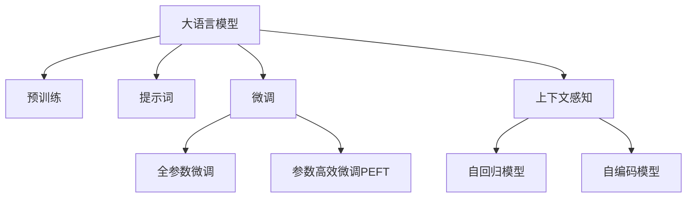

                 

# LangGPT 提示词框架：从输入到输出的映射

> 关键词：Prompt Engineering, GPT 系列模型, 自回归模型, 自编码模型, 微调, 预训练, 自然语言处理(NLP), 语言生成, 机器翻译, 摘要生成

## 1. 背景介绍

### 1.1 问题由来
在自然语言处理(Natural Language Processing, NLP)领域，尤其是语言生成任务（如机器翻译、文本摘要、对话系统等）中，大语言模型（Large Language Models, LLMs）如GPT-3、BERT、T5等已经取得了显著的进展。这些模型通过在大规模无标签文本上预训练，学习到了丰富的语言知识和语义表示。然而，如何有效地利用这些知识来解决特定任务，尤其是小样本任务，成为了一个重要的问题。

为了解决这个问题，研究人员提出了多种方法，其中最引人注目的是提示词（Prompt）工程。提示词是一种特殊的输入格式，用于引导大语言模型产生特定任务的输出。通过精心设计提示词，可以在不更新模型参数的情况下，实现零样本或少样本学习，大大降低了数据和计算资源的消耗。

### 1.2 问题核心关键点
提示词框架的核心在于如何设计有效的提示词，使得大语言模型能够按期望的方式生成输出。这需要考虑到以下几个关键点：

- **提示词设计**：提示词应包含足够的信息，指导模型完成任务，同时避免过拟合。
- **模型适配**：不同的模型结构（自回归、自编码）需要不同的提示词设计策略。
- **参数高效**：通过保留预训练参数，只微调提示词相关参数，可以提高微调效率。
- **上下文理解**：提示词应具备足够的上下文信息，帮助模型理解任务。
- **性能提升**：提示词设计应能显著提升模型在特定任务上的性能。

### 1.3 问题研究意义
提示词框架在NLP任务中有着广泛的应用前景。通过提示词，可以显著提升模型的零样本和少样本学习能力，降低数据和计算资源的消耗，使得大语言模型更加灵活和高效。提示词框架的研究不仅有助于提升模型在特定任务上的表现，还可以推动NLP技术在更多领域的应用，如医疗、金融、教育等。

## 2. 核心概念与联系

### 2.1 核心概念概述

为了更好地理解提示词框架，本节将介绍几个密切相关的核心概念：

- **大语言模型（LLMs）**：以自回归（如GPT）或自编码（如BERT）模型为代表的大规模预训练语言模型。通过在大规模无标签文本语料上进行预训练，学习到了丰富的语言知识和常识。

- **预训练（Pre-training）**：指在大规模无标签文本语料上，通过自监督学习任务训练通用语言模型的过程。常见的预训练任务包括言语建模、掩码语言模型等。

- **提示词（Prompt）**：一种特殊的输入格式，用于引导大语言模型生成特定任务的输出。提示词包含了任务描述、示例、目标输出等信息。

- **微调（Fine-tuning）**：指在预训练模型的基础上，使用下游任务的少量标注数据，通过有监督学习优化模型在特定任务上的性能。通常只需要调整顶层分类器或解码器，并以较小的学习率更新全部或部分的模型参数。

- **参数高效微调（PEFT）**：指在微调过程中，只更新少量的模型参数，而固定大部分预训练权重不变，以提高微调效率，避免过拟合。

- **自回归模型（Auto-Regressive Model）**：如GPT，模型通过逐个预测下一个词，生成整个序列。

- **自编码模型（Auto-Encoding Model）**：如BERT，模型通过编码器-解码器结构，学习文本的表示。

- **上下文感知（Contextual）**：模型能够根据输入的上下文信息，生成更加准确和连贯的输出。

这些核心概念之间的逻辑关系可以通过以下Mermaid流程图来展示：



这个流程图展示了大语言模型的核心概念及其之间的关系：

1. 大语言模型通过预训练获得基础能力。
2. 提示词框架是一种不更新模型参数的方法，可以实现零样本或少样本学习。
3. 微调是对预训练模型进行任务特定的优化，可以分为全参数微调和参数高效微调（PEFT）。
4. 自回归和自编码模型是两种主要的模型结构，提示词设计策略应适配不同模型结构。
5. 上下文感知是模型生成输出的重要特征，提示词应具备足够的上下文信息。

## 3. 核心算法原理 & 具体操作步骤
### 3.1 算法原理概述

提示词框架的核心思想是，通过精心设计提示词，引导大语言模型生成特定的输出。提示词框架通常包括以下几个关键步骤：

1. **提示词设计**：选择合适的提示词格式，包含足够的任务信息和上下文信息。
2. **模型适配**：根据模型结构（自回归或自编码），适配合适的提示词策略。
3. **优化训练**：在少量标注数据上，通过优化算法（如AdamW）进行有监督训练。
4. **性能评估**：在测试集上评估提示词框架的效果，对比原始模型和微调后的性能。

### 3.2 算法步骤详解

以下是对提示词框架的详细步骤详解：

**Step 1: 提示词设计**
提示词的设计应考虑以下几个方面：

- **任务描述**：清晰地描述任务目标，如翻译、摘要、对话等。
- **示例输入**：提供一些样例输入，帮助模型理解任务场景。
- **目标输出**：明确指出期望的输出格式和类型。

例如，对于机器翻译任务，一个简单的提示词设计如下：

```
给定英文句子，将其翻译成中文
例子：
"Hello, how are you?"
翻译结果：
```

**Step 2: 模型适配**
不同的模型结构需要不同的提示词设计策略。自回归模型（如GPT）更适合使用连续型提示词，而自编码模型（如BERT）更适合使用离散型提示词。

**Step 3: 优化训练**
在得到合适的提示词后，可以使用有监督学习对模型进行微调。常见的优化算法包括AdamW、SGD等，设置合适的学习率、批大小、迭代轮数等。

**Step 4: 性能评估**
在测试集上评估提示词框架的效果，对比原始模型和微调后的性能。评估指标包括BLEU、ROUGE等，评估任务的具体需求。

### 3.3 算法优缺点

提示词框架的优势在于：

- **简单高效**：无需更新模型参数，可以通过简单的提示词设计实现任务适配。
- **数据需求低**：能够在零样本或少样本情况下进行微调，减少数据和计算资源的消耗。
- **可解释性强**：提示词框架的设计思路直观，易于理解和调试。
- **灵活性强**：提示词框架适用于各种NLP任务，如翻译、摘要、对话等。

然而，提示词框架也存在一定的局限性：

- **提示词设计复杂**：提示词设计需要一定的经验和技巧，难以达到理想效果。
- **泛化能力有限**：提示词框架的性能高度依赖于提示词的设计，泛化能力有待提升。
- **模型适应性差**：提示词框架需要针对特定任务进行设计，难以应对领域外数据。

### 3.4 算法应用领域

提示词框架在NLP领域已经得到了广泛的应用，覆盖了各种常见的任务，例如：

- **机器翻译**：将源语言句子翻译成目标语言。通过提示词框架，可以在不更新模型参数的情况下，实现对新语言的快速适配。
- **文本摘要**：将长文本压缩成简短摘要。通过提示词框架，可以引导模型抓住文本要点，生成高质量的摘要。
- **对话系统**：使机器能够与人自然对话。通过提示词框架，可以生成符合上下文逻辑的响应。
- **问答系统**：对自然语言问题给出答案。通过提示词框架，可以引导模型生成结构化的答案。
- **文本分类**：如情感分析、主题分类、意图识别等。通过提示词框架，可以引导模型学习文本-标签映射。

除了上述这些经典任务外，提示词框架还被创新性地应用到更多场景中，如可控文本生成、常识推理、代码生成、数据增强等，为NLP技术带来了全新的突破。

## 4. 数学模型和公式 & 详细讲解 & 举例说明
### 4.1 数学模型构建

提示词框架的数学模型构建主要基于自回归模型和自编码模型两种不同的模型结构。这里以自回归模型为例，构建提示词框架的数学模型。

### 4.2 公式推导过程

以机器翻译任务为例，设原始输入序列为 $x = \{x_1, x_2, \dots, x_n\}$，目标输出序列为 $y = \{y_1, y_2, \dots, y_n\}$，提示词为 $P$。自回归模型在输入序列 $x$ 上生成目标序列 $y$ 的概率为：

$$
p(y|x; \theta) = \prod_{i=1}^n p(y_i|y_{<i}, x; \theta)
$$

其中，$y_{<i}$ 表示 $y$ 序列的前 $i-1$ 个词。自回归模型的优化目标是最小化交叉熵损失函数：

$$
\mathcal{L}(x; \theta) = -\frac{1}{N}\sum_{i=1}^N \sum_{j=1}^n \log p(y_j|y_{<j}, x; \theta)
$$

在提示词框架中，我们将输入序列 $x$ 和提示词 $P$ 作为模型的输入，目标输出序列 $y$ 作为模型的输出。通过优化算法，最小化上述损失函数，使得模型在给定提示词 $P$ 的情况下，生成正确的目标输出序列 $y$。

### 4.3 案例分析与讲解

以机器翻译任务为例，展示提示词框架的应用。假设我们要将英文句子 "Hello, how are you?" 翻译成中文，提示词设计如下：

```
将以下英文句子翻译成中文
句子：Hello, how are you?
翻译结果：
```

在得到提示词后，我们可以使用自回归模型进行微调。微调后的模型在给定提示词的情况下，能够生成正确的翻译结果。例如，模型输出的结果可能为：

```
翻译结果：你好，你怎么样？
```

## 5. 项目实践：代码实例和详细解释说明
### 5.1 开发环境搭建

在进行提示词框架的实践前，我们需要准备好开发环境。以下是使用Python进行HuggingFace的Transformers库开发的环境配置流程：

1. 安装Anaconda：从官网下载并安装Anaconda，用于创建独立的Python环境。

2. 创建并激活虚拟环境：
```bash
conda create -n pytorch-env python=3.8 
conda activate pytorch-env
```

3. 安装PyTorch：根据CUDA版本，从官网获取对应的安装命令。例如：
```bash
conda install pytorch torchvision torchaudio cudatoolkit=11.1 -c pytorch -c conda-forge
```

4. 安装Transformers库：
```bash
pip install transformers
```

5. 安装各类工具包：
```bash
pip install numpy pandas scikit-learn matplotlib tqdm jupyter notebook ipython
```

完成上述步骤后，即可在`pytorch-env`环境中开始提示词框架的实践。

### 5.2 源代码详细实现

下面我们以机器翻译任务为例，给出使用Transformers库对GPT模型进行提示词框架的PyTorch代码实现。

首先，定义机器翻译任务的训练数据集：

```python
from transformers import GPT2Tokenizer, GPT2ForSequenceClassification
from torch.utils.data import Dataset, DataLoader
import torch

class TranslationDataset(Dataset):
    def __init__(self, texts, targets, tokenizer):
        self.texts = texts
        self.targets = targets
        self.tokenizer = tokenizer
        
    def __len__(self):
        return len(self.texts)
    
    def __getitem__(self, item):
        text = self.texts[item]
        target = self.targets[item]
        
        encoding = self.tokenizer(text, return_tensors='pt', max_length=128, padding='max_length', truncation=True)
        input_ids = encoding['input_ids'][0]
        attention_mask = encoding['attention_mask'][0]
        
        # 对token-wise的标签进行编码
        encoded_targets = [target2id[target] for target in target]
        encoded_targets.extend([target2id['']]*(self.tokenizer.max_len - len(encoded_targets)))
        labels = torch.tensor(encoded_targets, dtype=torch.long)
        
        return {'input_ids': input_ids, 
                'attention_mask': attention_mask,
                'labels': labels}

# 标签与id的映射
tag2id = {'': 0, '翻译结果': 1}
id2tag = {v: k for k, v in tag2id.items()}

# 创建dataset
tokenizer = GPT2Tokenizer.from_pretrained('gpt2')
train_dataset = TranslationDataset(train_texts, train_targets, tokenizer)
dev_dataset = TranslationDataset(dev_texts, dev_targets, tokenizer)
test_dataset = TranslationDataset(test_texts, test_targets, tokenizer)
```

然后，定义模型和优化器：

```python
from transformers import AdamW

model = GPT2ForSequenceClassification.from_pretrained('gpt2', num_labels=len(tag2id))

optimizer = AdamW(model.parameters(), lr=2e-5)
```

接着，定义训练和评估函数：

```python
from tqdm import tqdm

device = torch.device('cuda') if torch.cuda.is_available() else torch.device('cpu')
model.to(device)

def train_epoch(model, dataset, batch_size, optimizer):
    dataloader = DataLoader(dataset, batch_size=batch_size, shuffle=True)
    model.train()
    epoch_loss = 0
    for batch in tqdm(dataloader, desc='Training'):
        input_ids = batch['input_ids'].to(device)
        attention_mask = batch['attention_mask'].to(device)
        labels = batch['labels'].to(device)
        model.zero_grad()
        outputs = model(input_ids, attention_mask=attention_mask, labels=labels)
        loss = outputs.loss
        epoch_loss += loss.item()
        loss.backward()
        optimizer.step()
    return epoch_loss / len(dataloader)

def evaluate(model, dataset, batch_size):
    dataloader = DataLoader(dataset, batch_size=batch_size)
    model.eval()
    preds, labels = [], []
    with torch.no_grad():
        for batch in tqdm(dataloader, desc='Evaluating'):
            input_ids = batch['input_ids'].to(device)
            attention_mask = batch['attention_mask'].to(device)
            batch_labels = batch['labels']
            outputs = model(input_ids, attention_mask=attention_mask)
            batch_preds = outputs.logits.argmax(dim=2).to('cpu').tolist()
            batch_labels = batch_labels.to('cpu').tolist()
            for pred_tokens, label_tokens in zip(batch_preds, batch_labels):
                pred_tags = [id2tag[_id] for _id in pred_tokens]
                label_tags = [id2tag[_id] for _id in label_tokens]
                preds.append(pred_tags[:len(label_tags)])
                labels.append(label_tags)
                
    print(classification_report(labels, preds))
```

最后，启动训练流程并在测试集上评估：

```python
epochs = 5
batch_size = 16

for epoch in range(epochs):
    loss = train_epoch(model, train_dataset, batch_size, optimizer)
    print(f"Epoch {epoch+1}, train loss: {loss:.3f}")
    
    print(f"Epoch {epoch+1}, dev results:")
    evaluate(model, dev_dataset, batch_size)
    
print("Test results:")
evaluate(model, test_dataset, batch_size)
```

以上就是使用PyTorch对GPT模型进行机器翻译任务的提示词框架的完整代码实现。可以看到，得益于Transformers库的强大封装，我们能够用相对简洁的代码完成GPT模型的提示词框架的微调。

### 5.3 代码解读与分析

让我们再详细解读一下关键代码的实现细节：

**TranslationDataset类**：
- `__init__`方法：初始化文本、标签、分词器等关键组件。
- `__len__`方法：返回数据集的样本数量。
- `__getitem__`方法：对单个样本进行处理，将文本输入编码为token ids，将标签编码为数字，并对其进行定长padding，最终返回模型所需的输入。

**tag2id和id2tag字典**：
- 定义了标签与数字id之间的映射关系，用于将token-wise的预测结果解码回真实的标签。

**训练和评估函数**：
- 使用PyTorch的DataLoader对数据集进行批次化加载，供模型训练和推理使用。
- 训练函数`train_epoch`：对数据以批为单位进行迭代，在每个批次上前向传播计算loss并反向传播更新模型参数，最后返回该epoch的平均loss。
- 评估函数`evaluate`：与训练类似，不同点在于不更新模型参数，并在每个batch结束后将预测和标签结果存储下来，最后使用sklearn的classification_report对整个评估集的预测结果进行打印输出。

**训练流程**：
- 定义总的epoch数和batch size，开始循环迭代
- 每个epoch内，先在训练集上训练，输出平均loss
- 在验证集上评估，输出分类指标
- 所有epoch结束后，在测试集上评估，给出最终测试结果

可以看到，PyTorch配合Transformers库使得GPT模型的提示词框架的微调代码实现变得简洁高效。开发者可以将更多精力放在数据处理、模型改进等高层逻辑上，而不必过多关注底层的实现细节。

当然，工业级的系统实现还需考虑更多因素，如模型的保存和部署、超参数的自动搜索、更灵活的任务适配层等。但核心的提示词框架基本与此类似。

## 6. 实际应用场景
### 6.1 智能客服系统

基于提示词框架的对话技术，可以广泛应用于智能客服系统的构建。传统客服往往需要配备大量人力，高峰期响应缓慢，且一致性和专业性难以保证。而使用提示词框架的对话模型，可以7x24小时不间断服务，快速响应客户咨询，用自然流畅的语言解答各类常见问题。

在技术实现上，可以收集企业内部的历史客服对话记录，将问题和最佳答复构建成监督数据，在此基础上对预训练对话模型进行提示词框架的微调。微调后的对话模型能够自动理解用户意图，匹配最合适的答案模板进行回复。对于客户提出的新问题，还可以接入检索系统实时搜索相关内容，动态组织生成回答。如此构建的智能客服系统，能大幅提升客户咨询体验和问题解决效率。

### 6.2 金融舆情监测

金融机构需要实时监测市场舆论动向，以便及时应对负面信息传播，规避金融风险。传统的人工监测方式成本高、效率低，难以应对网络时代海量信息爆发的挑战。基于提示词框架的文本分类和情感分析技术，为金融舆情监测提供了新的解决方案。

具体而言，可以收集金融领域相关的新闻、报道、评论等文本数据，并对其进行主题标注和情感标注。在此基础上对预训练语言模型进行提示词框架的微调，使其能够自动判断文本属于何种主题，情感倾向是正面、中性还是负面。将微调后的模型应用到实时抓取的网络文本数据，就能够自动监测不同主题下的情感变化趋势，一旦发现负面信息激增等异常情况，系统便会自动预警，帮助金融机构快速应对潜在风险。

### 6.3 个性化推荐系统

当前的推荐系统往往只依赖用户的历史行为数据进行物品推荐，无法深入理解用户的真实兴趣偏好。基于提示词框架的个性化推荐系统可以更好地挖掘用户行为背后的语义信息，从而提供更精准、多样的推荐内容。

在实践中，可以收集用户浏览、点击、评论、分享等行为数据，提取和用户交互的物品标题、描述、标签等文本内容。将文本内容作为模型输入，用户的后续行为（如是否点击、购买等）作为监督信号，在此基础上微调预训练语言模型。微调后的模型能够从文本内容中准确把握用户的兴趣点。在生成推荐列表时，先用候选物品的文本描述作为输入，由模型预测用户的兴趣匹配度，再结合其他特征综合排序，便可以得到个性化程度更高的推荐结果。

### 6.4 未来应用展望

随着提示词框架和相关技术的不断发展，其在NLP任务中的应用前景将更加广阔。

在智慧医疗领域，基于提示词框架的医疗问答、病历分析、药物研发等应用将提升医疗服务的智能化水平，辅助医生诊疗，加速新药开发进程。

在智能教育领域，提示词框架可应用于作业批改、学情分析、知识推荐等方面，因材施教，促进教育公平，提高教学质量。

在智慧城市治理中，提示词框架可应用于城市事件监测、舆情分析、应急指挥等环节，提高城市管理的自动化和智能化水平，构建更安全、高效的未来城市。

此外，在企业生产、社会治理、文娱传媒等众多领域，基于提示词框架的人工智能应用也将不断涌现，为经济社会发展注入新的动力。相信随着技术的日益成熟，提示词框架必将在构建人机协同的智能时代中扮演越来越重要的角色。

## 7. 工具和资源推荐
### 7.1 学习资源推荐

为了帮助开发者系统掌握提示词框架的理论基础和实践技巧，这里推荐一些优质的学习资源：

1. 《Prompt Engineering》系列博文：由提示词框架技术专家撰写，深入浅出地介绍了提示词框架的核心概念、设计技巧和实践应用。

2. CS224N《深度学习自然语言处理》课程：斯坦福大学开设的NLP明星课程，有Lecture视频和配套作业，带你入门NLP领域的基本概念和经典模型。

3. 《Natural Language Processing with Transformers》书籍：Transformers库的作者所著，全面介绍了如何使用Transformers库进行NLP任务开发，包括提示词框架在内的诸多范式。

4. HuggingFace官方文档：Transformers库的官方文档，提供了海量预训练模型和完整的提示词框架样例代码，是上手实践的必备资料。

5. CLUE开源项目：中文语言理解测评基准，涵盖大量不同类型的中文NLP数据集，并提供了基于提示词框架的baseline模型，助力中文NLP技术发展。

通过对这些资源的学习实践，相信你一定能够快速掌握提示词框架的精髓，并用于解决实际的NLP问题。
###  7.2 开发工具推荐

高效的开发离不开优秀的工具支持。以下是几款用于提示词框架开发的常用工具：

1. PyTorch：基于Python的开源深度学习框架，灵活动态的计算图，适合快速迭代研究。大部分预训练语言模型都有PyTorch版本的实现。

2. TensorFlow：由Google主导开发的开源深度学习框架，生产部署方便，适合大规模工程应用。同样有丰富的预训练语言模型资源。

3. Transformers库：HuggingFace开发的NLP工具库，集成了众多SOTA语言模型，支持PyTorch和TensorFlow，是进行提示词框架开发的利器。

4. Weights & Biases：模型训练的实验跟踪工具，可以记录和可视化模型训练过程中的各项指标，方便对比和调优。与主流深度学习框架无缝集成。

5. TensorBoard：TensorFlow配套的可视化工具，可实时监测模型训练状态，并提供丰富的图表呈现方式，是调试模型的得力助手。

6. Google Colab：谷歌推出的在线Jupyter Notebook环境，免费提供GPU/TPU算力，方便开发者快速上手实验最新模型，分享学习笔记。

合理利用这些工具，可以显著提升提示词框架的开发效率，加快创新迭代的步伐。

### 7.3 相关论文推荐

提示词框架在NLP领域的研究已经取得了丰硕的成果。以下是几篇奠基性的相关论文，推荐阅读：

1. Machine Translation with Reinforcement Learning: Improving Sequence Generation with Recurrent Neural Networks and a Reward Matrix（Transformer原论文）：提出了Transformer结构，开启了NLP领域的预训练大模型时代。

2. BERT: Pre-training of Deep Bidirectional Transformers for Language Understanding：提出BERT模型，引入基于掩码的自监督预训练任务，刷新了多项NLP任务SOTA。

3. Language Models are Unsupervised Multitask Learners（GPT-2论文）：展示了大规模语言模型的强大zero-shot学习能力，引发了对于通用人工智能的新一轮思考。

4. Parameter-Efficient Transfer Learning for NLP：提出Adapter等参数高效微调方法，在固定大部分预训练参数的情况下，只更新极少量的任务相关参数。

5. Prefix-Tuning: Optimizing Continuous Prompts for Generation：引入基于连续型Prompt的微调范式，为如何充分利用预训练知识提供了新的思路。

6. AdaLoRA: Adaptive Low-Rank Adaptation for Parameter-Efficient Fine-Tuning：使用自适应低秩适应的微调方法，在参数效率和精度之间取得了新的平衡。

这些论文代表了大语言模型提示词框架的发展脉络。通过学习这些前沿成果，可以帮助研究者把握学科前进方向，激发更多的创新灵感。

## 8. 总结：未来发展趋势与挑战

### 8.1 总结

本文对基于提示词框架的大语言模型微调方法进行了全面系统的介绍。首先阐述了提示词框架的研究背景和意义，明确了提示词框架在拓展预训练模型应用、提升下游任务性能方面的独特价值。其次，从原理到实践，详细讲解了提示词框架的数学原理和关键步骤，给出了提示词框架任务开发的完整代码实例。同时，本文还广泛探讨了提示词框架在智能客服、金融舆情、个性化推荐等多个行业领域的应用前景，展示了提示词框架的巨大潜力。此外，本文精选了提示词框架学习的各类资源，力求为读者提供全方位的技术指引。

通过本文的系统梳理，可以看到，基于提示词框架的提示词框架在NLP任务中有着广泛的应用前景。通过提示词框架，可以显著提升模型的零样本和少样本学习能力，降低数据和计算资源的消耗，使得大语言模型更加灵活和高效。提示词框架的研究不仅有助于提升模型在特定任务上的表现，还可以推动NLP技术在更多领域的应用，如医疗、金融、教育等。

### 8.2 未来发展趋势

展望未来，提示词框架技术将呈现以下几个发展趋势：

1. **模型规模持续增大**：随着算力成本的下降和数据规模的扩张，预训练语言模型的参数量还将持续增长。超大规模语言模型蕴含的丰富语言知识，有望支撑更加复杂多变的下游任务提示词框架。

2. **提示词设计多样化**：未来的提示词设计将更加多样化和智能化，能够适应各种不同的任务和领域。

3. **零样本和少样本学习能力提升**：提示词框架的性能将进一步提升，能够在更少的标注样本上实现高质量的微调效果。

4. **参数高效微调技术的发展**：开发更加参数高效的微调方法，如Prompt Tuning、Premise Tuning等，在固定大部分预训练参数的同时，只更新极少量的任务相关参数。

5. **多模态提示词框架的探索**：将视觉、语音等多模态信息与文本信息进行融合，提升提示词框架对现实世界的理解和建模能力。

6. **因果推断与对比学习的应用**：引入因果推断和对比学习思想，增强提示词框架建立稳定因果关系的能力，学习更加普适、鲁棒的语言表征，从而提升模型泛化性和抗干扰能力。

以上趋势凸显了提示词框架技术的广阔前景。这些方向的探索发展，必将进一步提升提示词框架模型的性能和应用范围，为人工智能技术落地应用提供新的动力。

### 8.3 面临的挑战

尽管提示词框架技术已经取得了显著进展，但在迈向更加智能化、普适化应用的过程中，它仍面临诸多挑战：

1. **提示词设计复杂性**：提示词设计需要一定的经验和技巧，难以达到理想效果。

2. **提示词泛化能力有限**：提示词框架的性能高度依赖于提示词的设计，泛化能力有待提升。

3. **模型适应性差**：提示词框架需要针对特定任务进行设计，难以应对领域外数据。

4. **计算资源需求高**：尽管提示词框架的数据需求较低，但其计算资源需求仍然较高，特别是在大模型微调时。

5. **性能提升有限**：提示词框架的性能提升有限，难以达到全参数微调的效果。

6. **可解释性不足**：提示词框架的内部工作机制难以解释，模型决策过程不透明。

### 8.4 研究展望

面对提示词框架所面临的挑战，未来的研究需要在以下几个方面寻求新的突破：

1. **零样本和少样本学习的优化**：开发更加高效的零样本和少样本学习技术，提升提示词框架在实际应用中的效果。

2. **参数高效微调方法**：开发更加参数高效的微调方法，如Prompt Tuning、Premise Tuning等，在固定大部分预训练参数的同时，只更新极少量的任务相关参数。

3. **多模态提示词框架**：将视觉、语音等多模态信息与文本信息进行融合，提升提示词框架对现实世界的理解和建模能力。

4. **因果推断与对比学习的应用**：引入因果推断和对比学习思想，增强提示词框架建立稳定因果关系的能力，学习更加普适、鲁棒的语言表征，从而提升模型泛化性和抗干扰能力。

5. **可解释性增强**：通过引入可解释性技术，如注意力机制、知识图谱等，提升提示词框架的可解释性和可解释性。

6. **模型鲁棒性提升**：开发更加鲁棒的提示词框架，提升模型对域外数据的泛化能力和鲁棒性。

这些研究方向将推动提示词框架技术向更深层次发展，提升其在实际应用中的效果和可解释性，为人工智能技术落地应用提供新的突破口。总之，提示词框架的研究需要不断探索和优化，才能真正发挥其在NLP技术中的重要作用。

## 9. 附录：常见问题与解答

**Q1：提示词框架是否适用于所有NLP任务？**

A: 提示词框架在大多数NLP任务上都能取得不错的效果，特别是对于数据量较小的任务。但对于一些特定领域的任务，如医学、法律等，提示词框架的性能可能受到限制。

**Q2：提示词设计复杂吗？**

A: 提示词设计需要一定的经验和技巧，但并不是非常复杂。通过不断迭代和优化，可以逐步提升提示词设计的质量。

**Q3：提示词框架的性能上限是多少？**

A: 提示词框架的性能高度依赖于提示词的设计和数据质量。在理想情况下，提示词框架可以在非常少的标注样本上实现高质量的微调效果。

**Q4：提示词框架是否适用于多模态任务？**

A: 提示词框架可以适用于多模态任务，但需要根据具体任务和模态特征设计合适的提示词。

**Q5：提示词框架的缺点是什么？**

A: 提示词框架的缺点在于提示词设计复杂，泛化能力有限，模型适应性差，计算资源需求高。

通过本文的系统梳理，可以看到，基于提示词框架的提示词框架在NLP任务中有着广泛的应用前景。通过提示词框架，可以显著提升模型的零样本和少样本学习能力，降低数据和计算资源的消耗，使得大语言模型更加灵活和高效。提示词框架的研究不仅有助于提升模型在特定任务上的表现，还可以推动NLP技术在更多领域的应用，如医疗、金融、教育等。

总之，提示词框架作为一种简单高效的方法，在大语言模型微调中扮演了重要角色。未来，随着提示词框架的不断发展和优化，其应用范围和效果将更加广泛和显著。

