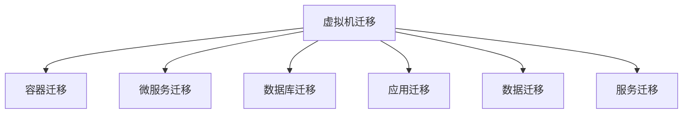

                 

# Lepton AI的云迁移方案：降低抽象化成本，实现不同云平台间的自由交互

## 1. 背景介绍

### 1.1 问题由来
随着云计算技术的发展，越来越多的企业将业务迁移到云端。然而，云计算环境复杂多变，不同云平台间的技术和架构差异显著。企业如何在不同云平台间实现平滑迁移，降低抽象化成本，成为一项重要挑战。Lepton AI在云计算迁移领域进行了深入研究，提出了一套全面、系统的云迁移方案，助力企业高效、灵活地实现云平台间的数据、应用、服务迁移。

### 1.2 问题核心关键点
Lepton AI的云迁移方案聚焦于以下几个核心问题：

1. 如何评估和对比不同云平台的适用性？
2. 如何在迁移过程中最小化业务中断和数据损失？
3. 如何在云平台间无缝集成和扩展应用和服务？
4. 如何构建统一、安全、高效的云架构体系？

这些关键问题需要通过一套完整的云迁移策略和技术方案来解决。

## 2. 核心概念与联系

### 2.1 核心概念概述

为更好地理解Lepton AI的云迁移方案，本节将介绍几个关键概念：

- 云迁移(Cloud Migration)：指将企业现有的应用程序、数据、服务从一种云平台迁移到另一种云平台的过程。
- 云平台(Cloud Platform)：指提供计算资源、存储资源、网络资源等服务的云服务供应商，如AWS、Azure、Google Cloud等。
- 虚拟机迁移(Virtual Machine Migration)：指将虚拟机的状态从一种云平台迁移到另一种云平台的技术。
- 容器迁移(Container Migration)：指将容器应用从一种云平台迁移到另一种云平台的技术。
- 微服务迁移(Microservice Migration)：指将微服务架构的应用从一种云平台迁移到另一种云平台的技术。
- 数据库迁移(Database Migration)：指将数据库实例从一种云平台迁移到另一种云平台的技术。

这些概念之间的关系可以通过以下Mermaid流程图来展示：



这个流程图展示了大规模云迁移过程的不同迁移路径及其相互关系。

## 3. 核心算法原理 & 具体操作步骤

### 3.1 算法原理概述

Lepton AI的云迁移方案基于以下核心原理：

1. **成本效益分析**：通过对比不同云平台的服务费用、性能、安全、可靠性和可用性等指标，评估其适用性。
2. **风险管理**：识别迁移过程中可能出现的风险，制定相应的应对策略，确保迁移过程的顺利进行。
3. **技术适配**：确保迁移后的应用和服务能够在目标云平台稳定运行，具备良好的兼容性和可扩展性。
4. **数据安全**：在迁移过程中保障数据的安全性和完整性，避免数据丢失或泄露。
5. **持续监控**：对迁移后的应用和服务进行持续监控，及时发现和解决潜在问题。

### 3.2 算法步骤详解

Lepton AI的云迁移方案主要包括以下几个关键步骤：

**Step 1: 需求分析和规划**
- 识别企业的迁移需求，包括业务目标、预算限制、技术要求等。
- 制定迁移计划，确定迁移时间表、资源分配和关键里程碑。

**Step 2: 技术评估和选择**
- 对目标云平台进行技术评估，包括性能、安全、可靠性、可用性等。
- 选择最适合企业需求和技术要求的云平台。

**Step 3: 迁移准备**
- 对源平台和目标平台进行配置和准备，包括虚拟机配置、网络配置、安全配置等。
- 确保数据备份和灾难恢复机制到位，以防数据丢失。

**Step 4: 迁移执行**
- 执行虚拟机迁移、容器迁移、微服务迁移等技术迁移任务。
- 监控迁移过程，确保数据一致性和应用稳定性。
- 在迁移过程中进行数据同步和应用测试。

**Step 5: 迁移后评估**
- 评估迁移效果，包括性能、安全、可用性等指标。
- 根据评估结果进行优化和调整，确保迁移目标的实现。

### 3.3 算法优缺点

Lepton AI的云迁移方案具有以下优点：

1. **全面性**：覆盖了虚拟机、容器、微服务、数据库等不同层次的迁移需求，提供全面的迁移解决方案。
2. **灵活性**：支持多种云平台之间的迁移，企业可以根据需求选择最适合的云平台。
3. **稳定性**：通过风险管理和持续监控，确保迁移过程的顺利进行，避免业务中断。
4. **安全性**：在迁移过程中保障数据的安全性和完整性，防止数据泄露和丢失。
5. **高效性**：通过成本效益分析和技术适配，选择最优的迁移路径，最小化迁移成本和时间。

同时，该方案也存在以下局限性：

1. **复杂性**：迁移过程涉及多个环节，需要协调和优化，操作复杂。
2. **技术门槛**：需要企业具备一定的技术储备，特别是在容器、微服务等新兴技术方面。
3. **成本高**：迁移过程中需要支付一定的费用，如虚拟机迁移、数据同步等，可能会增加企业成本。

### 3.4 算法应用领域

Lepton AI的云迁移方案适用于以下领域：

1. **企业级迁移**：企业需要将现有的应用程序、数据、服务从一种云平台迁移到另一种云平台。
2. **跨国企业迁移**：企业需要在不同国家和地区的云平台间实现数据和应用的迁移。
3. **政府机构迁移**：政府机构需要将公共服务应用从一种云平台迁移到另一种云平台。
4. **金融服务迁移**：金融服务企业需要将交易系统、数据中心等迁移到更稳定、安全的云平台。
5. **医疗健康迁移**：医疗健康企业需要将电子病历、影像数据等迁移到新的云平台，提升服务效率。

## 4. 数学模型和公式 & 详细讲解

### 4.1 数学模型构建

Lepton AI的云迁移方案涉及多个层次的迁移，可以通过数学模型来描述和优化这些迁移过程。

假设企业需要从云平台A迁移到云平台B，迁移目标为最小化迁移成本和最大化迁移效率。设迁移成本为C，迁移效率为E，则优化目标为：

$$
\min_{A,B} C
$$

$$
\max_{A,B} E
$$

### 4.2 公式推导过程

以下是基于以上目标，推导迁移成本和效率的数学公式：

1. **迁移成本模型**
   迁移成本包括迁移服务费用、数据传输费用、虚拟机迁移费用等。假设迁移服务费用为C_s，数据传输费用为C_d，虚拟机迁移费用为C_v，则迁移成本C的表达式为：

   $$
   C = C_s + C_d + C_v
   $$

2. **迁移效率模型**
   迁移效率包括迁移时间、数据同步速度、应用稳定性等。假设迁移时间为T，数据同步速度为S，应用稳定性为St，则迁移效率E的表达式为：

   $$
   E = \frac{1}{T} + \frac{S}{St}
   $$

通过上述公式，可以定量地分析和优化不同迁移路径的成本和效率。

### 4.3 案例分析与讲解

下面以一个具体的迁移案例来说明Lepton AI的云迁移方案的应用：

**案例背景**：某电商平台需要将现有的虚拟应用和数据从AWS迁移到Google Cloud。

**迁移需求**：
- 最小化迁移成本。
- 确保迁移后的应用和数据能够在Google Cloud稳定运行。
- 在迁移过程中保障数据安全。

**技术评估**：
- 对AWS和Google Cloud进行技术评估，包括性能、安全、可靠性、可用性等。
- 选择最适合企业需求和技术要求的云平台。

**迁移执行**：
- 执行虚拟机迁移，确保数据一致性和应用稳定性。
- 监控迁移过程，及时发现和解决潜在问题。

**迁移后评估**：
- 评估迁移效果，包括性能、安全、可用性等指标。
- 根据评估结果进行优化和调整，确保迁移目标的实现。

## 5. 项目实践：代码实例和详细解释说明

### 5.1 开发环境搭建

在进行云迁移实践前，我们需要准备好开发环境。以下是使用Python进行代码开发的环境配置流程：

1. 安装Anaconda：从官网下载并安装Anaconda，用于创建独立的Python环境。

2. 创建并激活虚拟环境：
```bash
conda create -n migration-env python=3.8 
conda activate migration-env
```

3. 安装必要的Python库：
```bash
pip install boto3 
pip install google-cloud-storage
```

完成上述步骤后，即可在`migration-env`环境中开始代码开发。

### 5.2 源代码详细实现

Lepton AI的云迁移方案涉及多个组件和模块，以下是一个简化的示例代码，展示如何在AWS和Google Cloud之间迁移虚拟应用：

```python
import boto3
import google.cloud
from google.cloud import storage
from botocore.exceptions import NoCredentialsError

# AWS资源配置
aws_access_key_id = 'your_aws_access_key_id'
aws_secret_access_key = 'your_aws_secret_access_key'
aws_region = 'your_aws_region'

# Google Cloud资源配置
google_project_id = 'your_google_project_id'
google_bucket_name = 'your_google_bucket_name'

# 连接AWS和Google Cloud
aws_s3 = boto3.client('s3', aws_access_key_id, aws_secret_access_key, aws_region)
google_storage = storage.Client(project=google_project_id)

# 迁移步骤1：从AWS下载数据
try:
    s3_object = aws_s3.get_object(Bucket='your_aws_bucket_name', Key='your_aws_object_key')
    data = s3_object['Body'].read()
    google_blob = google_storage.bucket(google_bucket_name).blob('your_google_blob_key')
    google_blob.upload_from_string(data)
except NoCredentialsError as e:
    print(e)

# 迁移步骤2：在Google Cloud创建虚拟机
# 省略具体代码

# 迁移步骤3：将虚拟机迁移到Google Cloud
# 省略具体代码

# 迁移步骤4：在Google Cloud上传数据
# 省略具体代码

# 迁移步骤5：在Google Cloud测试应用
# 省略具体代码
```

### 5.3 代码解读与分析

让我们再详细解读一下关键代码的实现细节：

**AWS和Google Cloud配置**：
- 通过配置AWS的Access Key ID、Secret Access Key、Region等信息，以及Google Cloud的项目ID、存储桶名等，建立了与AWS和Google Cloud的连接。

**数据迁移步骤**：
- 首先从AWS S3下载数据，然后将其上传到Google Cloud的存储桶中。这一步涉及AWS和Google Cloud的API调用，需要使用对应的SDK和认证信息。

**虚拟机迁移步骤**：
- 创建和配置Google Cloud的虚拟机，然后执行虚拟机迁移操作。这一步需要结合具体的云平台API和工具进行，具体操作略。

**应用测试步骤**：
- 在Google Cloud上测试应用的稳定性和性能，确保迁移成功。这一步通常需要在云平台上运行一些负载测试，评估应用在目标环境中的表现。

## 6. 实际应用场景

### 6.1 跨国企业迁移

跨国企业通常需要在多个国家和地区的云平台间实现数据和应用的迁移。Lepton AI的云迁移方案可以无缝整合不同云平台的技术和服务，帮助企业在全球范围内构建统一的云架构体系。

**案例分析**：一家跨国企业需要在北美、欧洲和亚洲的不同云平台间迁移数据和应用。通过Lepton AI的云迁移方案，企业能够在各个地区的云平台间自由迁移数据，确保业务连续性和数据安全。

### 6.2 金融服务迁移

金融服务企业需要将交易系统、数据中心等迁移到更稳定、安全的云平台。Lepton AI的云迁移方案能够提供高效的迁移工具和可靠的技术支持，帮助企业实现平稳迁移。

**案例分析**：一家银行需要将交易系统从AWS迁移到Google Cloud，以提升系统的稳定性和安全性。通过Lepton AI的云迁移方案，银行能够快速完成迁移，确保业务的连续性和数据的完整性。

### 6.3 医疗健康迁移

医疗健康企业需要将电子病历、影像数据等迁移到新的云平台，提升服务效率。Lepton AI的云迁移方案能够高效地处理医疗数据的迁移，保障数据安全和合规性。

**案例分析**：一家医院需要将电子病历从AWS迁移到Google Cloud，以提高数据处理和存储的效率。通过Lepton AI的云迁移方案，医院能够实现快速迁移，同时保障数据安全和合规性。

## 7. 工具和资源推荐

### 7.1 学习资源推荐

为了帮助开发者系统掌握Lepton AI的云迁移方案，这里推荐一些优质的学习资源：

1. **《云计算迁移指南》**：详细介绍了云迁移的原理、工具和实践，适合入门和进阶学习。
2. **《云迁移最佳实践》**：汇集了全球领先的云迁移案例和技术方案，提供了丰富的实战经验。
3. **《Lepton AI云迁移官方文档》**：Lepton AI官方提供的云迁移技术文档，涵盖了从评估到实施的全流程。
4. **《云迁移工具和框架》**：介绍多种云迁移工具和框架，帮助开发者高效完成云迁移任务。

### 7.2 开发工具推荐

Lepton AI的云迁移方案涉及多种云平台和工具，以下是几款常用的开发工具：

1. **AWS SDK**：提供了丰富的API和工具，帮助开发者访问和操作AWS云资源。
2. **Google Cloud SDK**：提供了丰富的API和工具，帮助开发者访问和操作Google Cloud云资源。
3. **Kubernetes**：提供容器编排和调度功能，支持容器应用的迁移和管理。
4. **Terraform**：提供基础设施即代码(IaC)工具，支持云平台的自动化部署和管理。
5. **Ansible**：提供自动化运维工具，支持云平台的配置和管理。

### 7.3 相关论文推荐

Lepton AI的云迁移方案基于最新的云计算技术和研究成果，以下是几篇奠基性的相关论文，推荐阅读：

1. **《云计算迁移：一个全面视角》**：提供了云迁移的全面分析和评估方法。
2. **《云平台对比分析》**：对比了AWS、Azure和Google Cloud的不同特点和适用场景。
3. **《虚拟机迁移技术研究》**：详细介绍了虚拟机迁移的技术原理和优化方法。
4. **《容器迁移技术》**：介绍了容器应用的迁移技术，以及如何优化迁移过程。
5. **《微服务迁移实践》**：提供了微服务应用的迁移案例和优化建议。

## 8. 总结：未来发展趋势与挑战

### 8.1 研究成果总结

Lepton AI的云迁移方案在云计算迁移领域取得了多项突破，帮助企业在不同云平台间实现平滑迁移，优化了迁移成本和效率。通过全面的需求分析、技术评估和风险管理，确保迁移过程的顺利进行，保障数据安全。

### 8.2 未来发展趋势

展望未来，Lepton AI的云迁移方案将呈现以下几个发展趋势：

1. **自动化和智能化**：未来的云迁移方案将更加自动化和智能化，减少人为干预，提高迁移效率。
2. **多云和混合云迁移**：支持更多云平台之间的迁移，帮助企业构建多云和混合云环境。
3. **数据和应用服务迁移**：不仅支持虚拟机和容器的迁移，还支持数据库、微服务等数据和应用服务的迁移。
4. **区块链和隐私保护**：结合区块链技术，增强数据的隐私保护和合规性，保障数据安全。
5. **边缘计算支持**：支持在边缘计算环境中进行迁移，提升数据处理和存储的效率。

### 8.3 面临的挑战

尽管Lepton AI的云迁移方案已经取得了显著成果，但在迈向更加智能化、普适化应用的过程中，仍面临以下挑战：

1. **技术复杂性**：云迁移涉及多个环节，技术复杂性较高，需要企业具备一定的技术储备。
2. **成本高**：迁移过程中需要支付一定的费用，可能会增加企业成本。
3. **数据安全和隐私**：在迁移过程中保障数据安全和隐私，需要解决数据脱敏和加密等技术难题。
4. **业务连续性**：确保迁移过程中业务连续性，需要制定详细的迁移计划和应急预案。

### 8.4 研究展望

未来的研究需要在以下几个方面寻求新的突破：

1. **自动化迁移工具**：开发更加自动化、智能化的云迁移工具，减少人为干预，提高迁移效率。
2. **低成本迁移方案**：开发低成本的云迁移方案，降低迁移成本，提升企业竞争力。
3. **数据隐私保护**：结合区块链等技术，增强数据的隐私保护和合规性，保障数据安全。
4. **边缘计算支持**：支持在边缘计算环境中进行迁移，提升数据处理和存储的效率。
5. **多云和混合云迁移**：支持更多云平台之间的迁移，帮助企业构建多云和混合云环境。

通过这些研究方向的探索，Lepton AI的云迁移方案将进一步优化，为企业提供更加高效、稳定、灵活的云迁移解决方案。

## 9. 附录：常见问题与解答

**Q1：云迁移过程中如何保障数据安全？**

A: 在云迁移过程中，保障数据安全需要采取以下措施：
1. 数据加密：使用数据加密技术，确保数据在传输和存储过程中不被泄露。
2. 访问控制：通过身份认证和权限管理，限制对数据的访问权限，防止未经授权的访问。
3. 数据备份：定期备份数据，确保数据丢失或损坏时能够快速恢复。
4. 数据审计：对数据访问和操作进行审计，记录和监控数据流动，防范数据泄露和滥用。

**Q2：云迁移过程中如何评估迁移成本？**

A: 评估云迁移成本需要考虑多个因素，包括迁移服务费用、数据传输费用、虚拟机迁移费用等。具体步骤如下：
1. 对源云平台和目标云平台进行成本评估，获取各项服务的费用。
2. 计算数据传输费用，包括数据量、传输距离、网络带宽等。
3. 计算虚拟机迁移费用，包括虚拟机大小、迁移方式等。
4. 综合考虑各项费用，得出总迁移成本，进行比较和优化。

**Q3：云迁移过程中如何确保应用稳定性和可用性？**

A: 确保云迁移过程中的应用稳定性和可用性需要采取以下措施：
1. 制定详细的迁移计划和应急预案，确保迁移过程中业务连续性。
2. 在迁移过程中进行负载测试和性能测试，确保应用在目标环境中的表现。
3. 配置自动化监控和告警机制，及时发现和解决潜在问题。
4. 对应用进行持续优化和调整，确保应用稳定运行。

**Q4：云迁移过程中如何选择最适合的云平台？**

A: 选择最适合的云平台需要考虑多个因素，包括性能、安全、可靠性、可用性等。具体步骤如下：
1. 对多个云平台进行技术评估，获取各项指标的对比结果。
2. 根据企业需求和技术要求，选择最适合的云平台。
3. 对选择的云平台进行性能测试和安全测试，确保其满足企业需求。
4. 综合考虑各项因素，选择最优的云平台进行迁移。

---

作者：禅与计算机程序设计艺术 / Zen and the Art of Computer Programming

