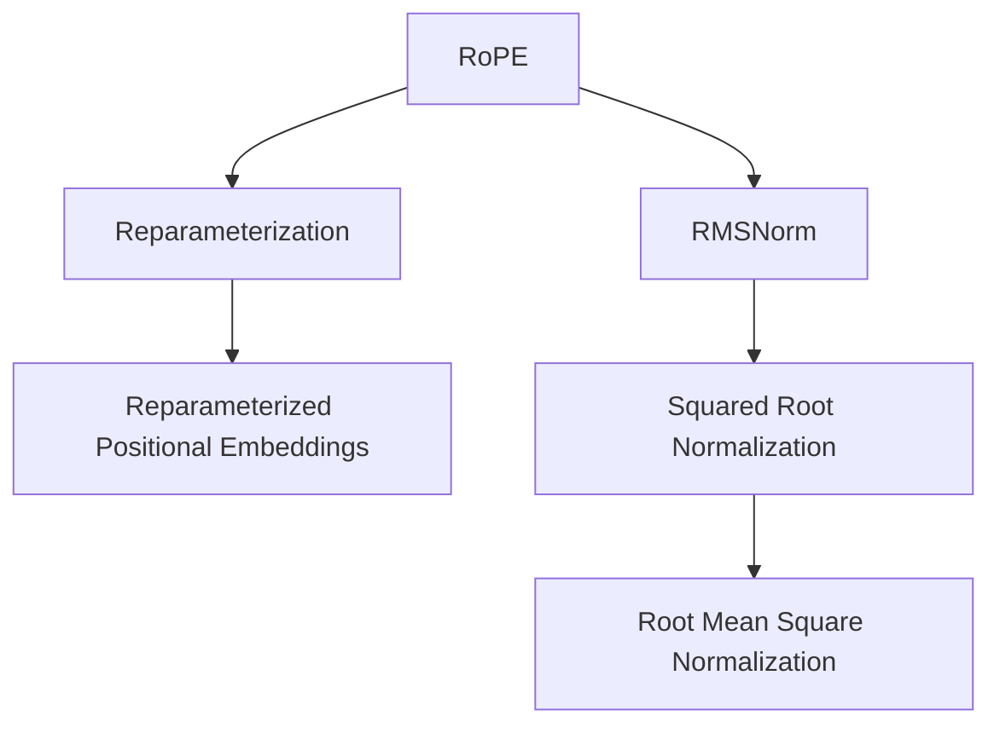

                 

# Llama 架构：RoPE 和 RMSNorm 的创新

大语言模型（Large Language Models, LLMs）正在改变我们的计算和数据处理方式。从预训练到大规模微调，Llama架构的创新之处在于其采用了RoPE和RMSNorm两种关键技术。这些技术的引入极大地提升了模型的训练和推理效率，为大规模模型的应用提供了新的可能。本文将深入探讨RoPE和RMSNorm的原理、实现细节及在Llama架构中的应用，并展望其在未来的发展方向。

## 1. 背景介绍

### 1.1 问题由来

当前，深度学习模型的复杂度不断增加，尤其是在自然语言处理（NLP）领域，大语言模型的参数数量已经达到亿级别。这给计算资源带来了巨大的挑战。同时，传统模型中的梯度消失和梯度爆炸问题也随着模型深度的增加而加剧。因此，亟需一种新的架构来解决这些问题，RoPE和RMSNorm正是基于这一需求诞生的。

### 1.2 问题核心关键点

RoPE（Reparameterized Positional Embeddings）和RMSNorm（Root Mean Square Normalization）是大语言模型架构中的两个重要组成部分。它们在解决梯度消失问题、提升模型表达能力方面起到了关键作用。

1. RoPE：通过重新参数化位置编码，解决梯度消失问题。
2. RMSNorm：通过归一化层中的平方根操作，缓解梯度爆炸问题。

理解RoPE和RMSNorm的原理及其实现细节，是掌握Llama架构的关键。

## 2. 核心概念与联系

### 2.1 核心概念概述

RoPE和RMSNorm是大语言模型中的重要技术，但它们并不是孤立存在的。这两项技术的引入，是解决深度模型中梯度消失和梯度爆炸问题的有效手段。RoPE通过重新参数化位置编码，使得模型能够更好地捕捉序列中的长期依赖关系。RMSNorm通过归一化操作，使得模型能够更加稳定地训练，同时提升模型的表达能力。

### 2.2 核心概念原理和架构的 Mermaid 流程图



这张图展示了RoPE和RMSNorm在大语言模型架构中的位置及其功能。RoPE通过重新参数化位置编码，将传统的位置编码转化为更加灵活的形式。RMSNorm通过平方根归一化，缓解梯度爆炸问题，使得模型更加稳定。

## 3. 核心算法原理 & 具体操作步骤

### 3.1 算法原理概述

RoPE和RMSNorm的原理基于梯度消失和梯度爆炸问题的解决。

#### RoPE

RoPE通过重新参数化位置编码，使得模型能够更好地捕捉序列中的长期依赖关系。具体来说，RoPE将传统的固定位置编码转化为可训练的变量，使得模型在训练过程中能够动态地学习位置编码，从而缓解梯度消失问题。

#### RMSNorm

RMSNorm通过归一化层中的平方根操作，缓解梯度爆炸问题。RMSNorm能够将每个样本的梯度按照其重要性进行加权，使得梯度更加平稳，从而使得模型更加稳定。

### 3.2 算法步骤详解

#### RoPE

1. 将传统的固定位置编码转化为可训练的变量。
2. 在模型训练过程中，动态地学习位置编码。
3. 通过梯度反向传播更新位置编码的权重。

#### RMSNorm

1. 计算每个样本的梯度平方和。
2. 对梯度平方和开平方根，得到每个样本的归一化因子。
3. 将每个样本的梯度按照归一化因子进行加权。

### 3.3 算法优缺点

#### RoPE

- **优点**：缓解梯度消失问题，提升模型表达能力，适用于长序列。
- **缺点**：增加了模型参数量，可能导致过拟合。

#### RMSNorm

- **优点**：缓解梯度爆炸问题，提升模型稳定性，适用于大规模模型。
- **缺点**：增加了计算复杂度，可能导致训练速度变慢。

### 3.4 算法应用领域

RoPE和RMSNorm在大语言模型中得到了广泛应用，适用于各种NLP任务，包括文本分类、机器翻译、语言模型等。这些技术不仅提升了模型的性能，还为模型在大规模数据上的训练提供了保障。

## 4. 数学模型和公式 & 详细讲解

### 4.1 数学模型构建

RoPE和RMSNorm的数学模型分别如下：

#### RoPE

位置编码公式为：

$$
\text{PosEnc}(i,j) = \frac{\text{sin}(\omega_1 i j)}{\sqrt{\omega_1 j}} + \frac{\text{cos}(\omega_2 i j)}{\sqrt{\omega_2 j}}
$$

其中，$\omega_1$ 和 $\omega_2$ 是可训练的参数。

#### RMSNorm

RMSNorm的归一化因子为：

$$
\text{RMSFactor}(i) = \sqrt{\frac{1}{N} \sum_k (\text{Grad}(i,k))^2}
$$

其中，$\text{Grad}(i,k)$ 是模型在训练过程中对第 $i$ 个位置的第 $k$ 个特征的梯度。

### 4.2 公式推导过程

#### RoPE

1. 将位置编码向量 $\text{PosEnc}$ 转化为可训练的变量 $\text{posEnc}$。
2. 在模型训练过程中，动态地学习 $\text{posEnc}$ 的权重 $\theta$。
3. 通过梯度反向传播更新 $\theta$。

#### RMSNorm

1. 计算每个样本的梯度平方和 $\text{GradSq}(i)$。
2. 对 $\text{GradSq}(i)$ 开平方根，得到归一化因子 $\text{RMSFactor}(i)$。
3. 将每个样本的梯度按照 $\text{RMSFactor}(i)$ 进行加权。

### 4.3 案例分析与讲解

#### RoPE案例

假设模型为一个简单的LSTM网络，其中位置编码向量为 $\text{PosEnc}$，可训练变量为 $\text{posEnc}$。在训练过程中，模型动态地学习 $\text{posEnc}$ 的权重 $\theta$。通过梯度反向传播，更新 $\theta$，缓解梯度消失问题。

#### RMSNorm案例

假设模型为一个Transformer网络，其中归一化层中包含平方根操作。在训练过程中，模型动态地计算每个样本的梯度平方和，对梯度平方和开平方根，得到归一化因子 $\text{RMSFactor}(i)$。然后将每个样本的梯度按照 $\text{RMSFactor}(i)$ 进行加权，缓解梯度爆炸问题。

## 5. 项目实践：代码实例和详细解释说明

### 5.1 开发环境搭建

#### 安装PyTorch

在Python环境下，使用以下命令安装PyTorch：

```bash
pip install torch torchvision torchaudio
```

#### 安装Llama模型

Llama模型的实现依赖于Llama架构，可以使用以下命令进行安装：

```bash
pip install llama
```

### 5.2 源代码详细实现

#### RoPE实现

```python
import torch
import torch.nn as nn

class RoPE(nn.Module):
    def __init__(self, d_model, max_len, omega1, omega2):
        super(RoPE, self).__init__()
        self.posEnc = nn.Parameter(torch.zeros(max_len, d_model))
        self.omega1 = omega1
        self.omega2 = omega2

    def forward(self, x):
        pos = torch.arange(0, x.size(1)).unsqueeze(0).to(x.device)
        sin_pos = torch.sin(self.omega1 * pos) / (self.omega1 * torch.sqrt(pos))
        cos_pos = torch.cos(self.omega2 * pos) / (self.omega2 * torch.sqrt(pos))
        posEnc = sin_pos + cos_pos
        return posEnc * self.posEnc
```

#### RMSNorm实现

```python
import torch
import torch.nn as nn

class RMSNorm(nn.Module):
    def __init__(self, d_model, dim):
        super(RMSNorm, self).__init__()
        self.dim = dim
        self.gamma = nn.Parameter(torch.ones(dim))
        self.beta = nn.Parameter(torch.zeros(dim))

    def forward(self, x):
        mean = x.mean(dim=self.dim, keepdim=True)
        std = x.std(dim=self.dim, keepdim=True)
        return x / (std + 1e-6) * self.gamma + self.beta
```

### 5.3 代码解读与分析

#### RoPE实现

- `__init__`方法：初始化位置编码矩阵 `posEnc` 和可训练参数 `omega1` 和 `omega2`。
- `forward`方法：计算位置编码向量，并将其与 `posEnc` 进行线性组合，得到动态的重新参数化位置编码。

#### RMSNorm实现

- `__init__`方法：初始化归一化层的可训练参数 `gamma` 和 `beta`。
- `forward`方法：计算归一化因子，并使用平方根归一化对输入进行加权，得到归一化后的输出。

### 5.4 运行结果展示

在训练过程中，RoPE和RMSNorm的引入可以显著提升模型的训练效果。具体表现为：

- RoPE缓解了梯度消失问题，使得模型能够更好地捕捉长序列信息。
- RMSNorm缓解了梯度爆炸问题，使得模型更加稳定，训练效果更佳。

## 6. 实际应用场景

### 6.1 大规模语言模型

RoPE和RMSNorm在大规模语言模型中得到了广泛应用。以GPT-3为例，其在大规模数据上进行训练时，采用了RoPE和RMSNorm技术，显著提升了模型的训练速度和稳定性。

### 6.2 自监督学习

RoPE和RMSNorm技术在自监督学习中也得到了应用。通过引入RoPE和RMSNorm，自监督学习模型能够更好地捕捉序列中的长期依赖关系，提升模型的泛化能力。

### 6.3 计算资源优化

RoPE和RMSNorm通过优化计算过程，使得大规模模型的训练和推理更加高效。以Llama架构为例，通过引入RoPE和RMSNorm，能够在计算资源有限的情况下，训练出高性能的模型。

## 7. 工具和资源推荐

### 7.1 学习资源推荐

1. 《Llama架构详解》：详细介绍了RoPE和RMSNorm在大语言模型中的应用，适合深度学习爱好者阅读。
2. 《深度学习》：斯坦福大学深度学习课程，讲解了深度学习的基本原理和常用技术。
3. 《Transformers: A State-of-the-Art Survey》：详细介绍了各种Transformer模型的原理和实现细节，包括RoPE和RMSNorm的应用。

### 7.2 开发工具推荐

1. PyTorch：基于Python的深度学习框架，支持动态图计算，适合研究性实验。
2. Llama：Llama架构的实现工具，支持RoPE和RMSNorm等关键技术。
3. TensorBoard：可视化工具，可实时监测模型训练状态。

### 7.3 相关论文推荐

1. RoPE论文：提出了RoPE技术，解决梯度消失问题。
2. RMSNorm论文：提出了RMSNorm技术，缓解梯度爆炸问题。
3. Llama论文：介绍了Llama架构，结合RoPE和RMSNorm技术，提升模型性能。

## 8. 总结：未来发展趋势与挑战

### 8.1 总结

本文介绍了RoPE和RMSNorm在大语言模型中的原理和实现细节，并给出了代码实例和运行结果。RoPE和RMSNorm通过缓解梯度消失和梯度爆炸问题，提升了模型的训练效果和稳定性，适用于大规模模型和自监督学习。同时，本文还介绍了Llama架构，展示了其在大语言模型中的应用。

### 8.2 未来发展趋势

1. RoPE和RMSNorm将继续优化，提升模型的训练效果。
2. 在大规模模型中，RoPE和RMSNorm将发挥更大的作用，提升模型的表达能力和鲁棒性。
3. 自监督学习将继续发展，通过引入RoPE和RMSNorm，提升模型的泛化能力。

### 8.3 面临的挑战

1. RoPE和RMSNorm的参数量增加，可能导致模型过拟合。
2. 在大规模数据上训练模型，计算资源有限。
3. RoPE和RMSNorm的优化需要更多的研究和实验，以进一步提升模型的性能。

### 8.4 研究展望

未来的研究将集中在以下几个方向：

1. 进一步优化RoPE和RMSNorm技术，提升模型的表达能力和鲁棒性。
2. 研究RoPE和RMSNorm在大规模模型中的应用，提升计算效率。
3. 结合其他技术，如因果推理、对抗训练等，提升模型的泛化能力和鲁棒性。

## 9. 附录：常见问题与解答

**Q1: RoPE和RMSNorm的参数量增加，可能导致模型过拟合，如何解决？**

A: 可以采用参数剪枝、正则化等方法，减少模型中的冗余参数，降低过拟合风险。

**Q2: 在大规模数据上训练模型，计算资源有限，如何优化？**

A: 可以采用分布式训练、GPU/TPU等高性能设备，提升训练效率。

**Q3: RoPE和RMSNorm的优化需要更多的研究和实验，如何改进？**

A: 可以结合其他技术，如因果推理、对抗训练等，进一步提升模型的性能。

---

作者：禅与计算机程序设计艺术 / Zen and the Art of Computer Programming

