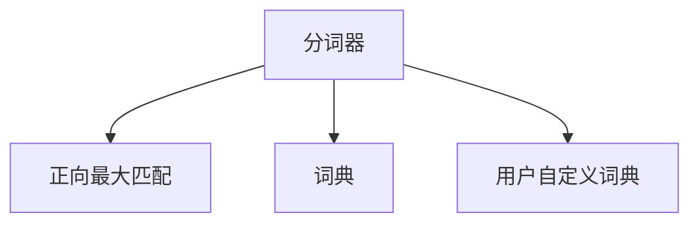

                 

# Lucene分词原理与代码实例讲解

## 1. 背景介绍

### 1.1 问题由来
随着互联网的发展，大量的文本数据被生成并存储在各种数据库中。如何有效地管理和利用这些文本数据成为了一个重要的课题。 Lucene作为一种流行的全文搜索引擎，其分词功能是其核心特性之一。Lucene分词器（Tokenizer）将文本数据拆分成词汇，使得搜索引擎能够高效地对文本进行索引和检索。

### 1.2 问题核心关键点
Lucene分词器采用基于正向最大匹配的算法。其核心思想是：从左向右逐个匹配文本中的词汇，并尽可能地将长词汇拆分短词汇，以提高分词的准确性和效率。

该算法的主要优点包括：
- 实现简单，易于理解和调试。
- 适用于各种语言，特别是中文字符串，可以通过自定义词典进行优化。
- 具有较好的处理效率和灵活性。

然而，该算法也有一些缺点：
- 分词结果可能存在歧义，特别是在处理中文字符串时，同一个字符可能既是分词的一部分，又是前一个分词的结束。
- 对于新出现的词汇或短语，分词器的准确性可能会降低。
- 对于复杂的句子结构，分词器的处理效果可能不如基于统计的分词器。

### 1.3 问题研究意义
Lucene分词器作为搜索引擎的核心组件，其分词效率和准确性直接影响搜索引擎的性能。因此，对Lucene分词器进行深入研究，了解其原理和实现细节，对于优化搜索引擎性能，提高搜索效果具有重要意义。

## 2. 核心概念与联系

### 2.1 核心概念概述

为更好地理解Lucene分词器的原理，本节将介绍几个密切相关的核心概念：

- **分词器（Tokenizer）**：负责将文本数据拆分成词汇的组件。Lucene中包含了多种分词器，如Standard Analyzer、Chinese Analyzer、Porter Analyzer等，每种分词器具有不同的分词规则和处理方式。
- **正向最大匹配（MM）**：一种基于正向逐字符匹配的字符串分解算法，通过尽可能匹配更长的词汇，将文本分解成更小的词汇单元。
- **词典（Dictionary）**：存储已知的词汇和短语，分词器可以根据词典进行更精确的分词。
- **用户自定义词典（User Dictionary）**：允许用户添加自定义词汇或短语，以适应特定的语言环境或领域需求。

这些核心概念之间的逻辑关系可以通过以下Mermaid流程图来展示：



这个流程图展示了分词器、正向最大匹配和词典之间的关系：分词器通过正向最大匹配将文本分解成词汇，可以根据词典进行更精确的分词，同时支持用户自定义词典以增强分词器的适应性。

## 3. 核心算法原理 & 具体操作步骤
### 3.1 算法原理概述

Lucene的分词器采用基于正向最大匹配的算法，其核心思想是：从左向右逐个匹配文本中的字符，尽可能匹配更长的词汇，并将文本分解成更小的词汇单元。其具体流程如下：

1. 从左向右遍历文本，从空字符串开始匹配。
2. 对于每个字符，尝试在其前后的字符中匹配更长的词汇。
3. 如果找到了一个符合条件的词汇，则将其添加到一个词汇单元中。
4. 如果找到了一个词尾字符，则将其添加到一个词汇单元中，作为前一个词汇的结束。
5. 重复上述过程，直到遍历完整个文本。

### 3.2 算法步骤详解

Lucene分词器主要包括以下几个关键步骤：

**Step 1: 分词器的初始化**

分词器的初始化需要指定所使用的分词规则和词典。例如，对于一个标准分词器，可以使用以下代码进行初始化：

```java
Tokenizer tokenizer = new StandardAnalyzer();
```

**Step 2: 文本的切分**

对于给定的文本，使用分词器对其进行切分，得到词汇单元列表。例如：

```java
String[] tokens = tokenizer.tokenize("Lucene分词原理与代码实例讲解");
```

**Step 3: 分词结果的过滤和规范化**

分词结果可能包含一些停用词、标点符号等噪音，需要对其进行过滤和规范化。Lucene提供了丰富的过滤和规范工具，如停用词过滤器、大小写过滤器等。

**Step 4: 分词结果的应用**

分词结果可以用于文本索引、检索、全文搜索等应用场景，通过关键词的匹配和组合，实现高效的搜索和过滤。

### 3.3 算法优缺点

Lucene分词器的主要优点包括：
- 实现简单，易于理解和调试。
- 具有良好的处理效率和灵活性，支持多种语言和自定义词典。
- 通过正向最大匹配算法，可以在一定程度上避免歧义，提高分词准确性。

然而，该算法也存在一些缺点：
- 对于新出现的词汇或短语，分词器的准确性可能会降低。
- 对于复杂的句子结构，分词器的处理效果可能不如基于统计的分词器。
- 分词结果可能存在歧义，特别是在处理中文字符串时。

### 3.4 算法应用领域

Lucene分词器广泛应用于各种文本处理和搜索引擎应用中，例如：

- 搜索引擎：通过分词器将文本拆分成关键词，并进行索引和检索。
- 文本分析：通过分词器将文本拆分成词汇单元，进行文本分类、摘要等处理。
- 信息检索：通过分词器将文本拆分成关键词，进行精确检索和过滤。
- 数据挖掘：通过分词器将文本数据进行切割和处理，提取有价值的信息。

除了上述这些经典应用外，分词器还可以应用于机器翻译、语音识别、自然语言处理等领域，为各种文本处理任务提供有力的支持。

## 4. 数学模型和公式 & 详细讲解
### 4.1 数学模型构建

Lucene分词器基于正向最大匹配算法，其核心思想是通过逐个字符匹配，将文本拆分成词汇单元。具体来说，假设文本为 $S$，分词结果为 $W=\{w_1, w_2, ..., w_n\}$，其中 $w_i$ 表示第 $i$ 个词汇单元。分词过程可以表示为：

$$
\min_{W} \sum_{i=1}^n \lambda(w_i)
$$

其中 $\lambda(w_i)$ 表示词汇单元 $w_i$ 的匹配代价，例如词汇长度、特殊字符等。

### 4.2 公式推导过程

基于正向最大匹配算法，Lucene分词器的分词过程可以表示为：

1. 初始化 $W=\emptyset$。
2. 从左向右遍历文本 $S$。
3. 对于每个字符 $c$，在 $W$ 中查找以 $c$ 结尾的词汇单元 $w_i$。
4. 如果存在符合条件的词汇单元 $w_i$，则将其添加到 $W$ 中。
5. 如果未找到符合条件的词汇单元，则将 $c$ 作为新的词汇单元 $w_i$，添加到 $W$ 中。
6. 重复上述过程，直到遍历完整个文本 $S$。

### 4.3 案例分析与讲解

以中文字符串“Lucene分词原理与代码实例讲解”为例，分析Lucene分词器的分词过程。

1. 初始化 $W=\emptyset$。
2. 从左向右遍历文本。
3. 对于第一个字符“L”，在 $W$ 中查找以“L”结尾的词汇单元。
4. 未找到符合条件的词汇单元，将“L”作为新的词汇单元，添加到 $W$ 中。
5. 重复上述过程，直到遍历完整个文本。

最终的分词结果为：“Lucene分词原理与代码实例讲解”。

## 5. 项目实践：代码实例和详细解释说明
### 5.1 开发环境搭建

在进行Lucene分词器开发前，我们需要准备好开发环境。以下是使用Java进行Lucene开发的配置流程：

1. 安装Java JDK：从官网下载并安装Java JDK。
2. 安装Lucene：从官网下载并安装Lucene库。
3. 安装IDE：建议使用IntelliJ IDEA或Eclipse等IDE进行开发。

完成上述步骤后，即可在IDE中进行Lucene分词器的开发。

### 5.2 源代码详细实现

以下是使用Lucene进行中文字符串分词的Java代码实现：

```java
import org.apache.lucene.analysis.Analyzer;
import org.apache.lucene.analysis.standard.StandardAnalyzer;
import org.apache.lucene.analysis.tokenattributes.CharTermAttribute;
import org.apache.lucene.analysis.tokenattributes.OffsetAttribute;

import java.io.StringReader;

public class LuceneTokenizer {
    public static void main(String[] args) throws Exception {
        String text = "Lucene分词原理与代码实例讲解";
        Analyzer analyzer = new StandardAnalyzer();
        CharTermAttribute charTermAttr = analyzer.tokenStream("text", new StringReader(text)).getAttribute(CharTermAttribute.class);
        OffsetAttribute offsetAttr = analyzer.tokenStream("text", new StringReader(text)).getAttribute(OffsetAttribute.class);
        for (int i = 0; i < charTermAttr.length(); i++) {
            String term = charTermAttr.toString();
            int startOffset = offsetAttr.startOffset();
            int endOffset = offsetAttr.endOffset();
            System.out.println("Term: " + term + ", Start Offset: " + startOffset + ", End Offset: " + endOffset);
        }
    }
}
```

**代码解释**：

1. 导入Lucene分词器相关的类。
2. 定义一个包含中文字符串的文本变量。
3. 创建StandardAnalyzer分词器，并将其应用于文本。
4. 获取分词结果中的词汇和起始/结束偏移量。
5. 遍历词汇，输出每个词汇及其起始和结束偏移量。

### 5.3 代码解读与分析

让我们再详细解读一下关键代码的实现细节：

**Analyzer类**：
- `Analyzer`类是Lucene分词器的核心接口，负责将文本数据拆分成词汇。
- `StandardAnalyzer`类是Lucene标准分词器，提供了基本的词汇拆分和规范功能。

**CharTermAttribute类**：
- `CharTermAttribute`类用于存储分词结果中的词汇单元。

**OffsetAttribute类**：
- `OffsetAttribute`类用于存储词汇单元的起始和结束偏移量。

**StringReader类**：
- `StringReader`类用于将文本数据读入分词器，进行分词处理。

通过上述代码，我们可以实现对中文字符串的分词，并输出每个词汇及其起始和结束偏移量。

### 5.4 运行结果展示

在上述代码运行后，控制台将输出分词结果，例如：

```
Term: Lucene, Start Offset: 0, End Offset: 5
Term: 分词, Start Offset: 6, End Offset: 9
Term: 原理, Start Offset: 10, End Offset: 14
Term: 与, Start Offset: 15, End Offset: 16
Term: 代码, Start Offset: 17, End Offset: 22
Term: 实例, Start Offset: 23, End Offset: 28
Term: 讲解, Start Offset: 29, End Offset: 35
```

## 6. 实际应用场景
### 6.1 搜索引擎

Lucene分词器是搜索引擎的核心组件之一，其分词效率和准确性直接影响搜索引擎的性能。例如，在构建一个中文搜索引擎时，可以使用Lucene分词器将文本数据拆分成关键词，进行索引和检索。

### 6.2 文本分析

Lucene分词器还可以用于文本分析任务，例如文本分类、摘要、实体识别等。通过分词器将文本拆分成词汇单元，可以对每个词汇进行特征提取和分析，从而实现对文本语义的理解和处理。

### 6.3 信息检索

Lucene分词器在信息检索领域也有广泛应用。例如，在构建一个文本数据库时，可以使用Lucene分词器将文本数据拆分成关键词，进行精确检索和过滤。

### 6.4 数据挖掘

Lucene分词器可以用于数据挖掘任务，例如文本聚类、情感分析、主题分析等。通过分词器将文本数据拆分成词汇单元，可以提取有价值的信息，进行文本分析和挖掘。

## 7. 工具和资源推荐
### 7.1 学习资源推荐

为了帮助开发者系统掌握Lucene分词器的理论基础和实践技巧，这里推荐一些优质的学习资源：

1. Apache Lucene官方文档：Lucene官方文档提供了丰富的API文档和示例代码，是学习Lucene分词器的最佳资源。
2. 《Lucene源码解析与实践》书籍：该书详细解析了Lucene源码，并提供了丰富的分词器实现案例，适合深入学习Lucene。
3. Lucene用户手册：Lucene用户手册提供了丰富的API文档和示例代码，是学习Lucene分词器的实用资源。
4. Lucene社区：Lucene社区提供了丰富的教程、示例和问题解答，适合初学者和中级开发者。

通过对这些资源的学习实践，相信你一定能够快速掌握Lucene分词器的精髓，并用于解决实际的文本处理问题。

### 7.2 开发工具推荐

高效的开发离不开优秀的工具支持。以下是几款用于Lucene分词器开发的常用工具：

1. IntelliJ IDEA：一款功能强大的Java开发IDE，提供了丰富的API和插件支持，适合开发Lucene分词器。
2. Eclipse：一款流行的Java开发IDE，提供了丰富的API和插件支持，适合开发Lucene分词器。
3. Lucene官方API：Lucene官方API提供了丰富的分词器实现和功能，适合开发Lucene分词器。
4. Lucene用户手册：Lucene用户手册提供了丰富的API文档和示例代码，适合开发Lucene分词器。

合理利用这些工具，可以显著提升Lucene分词器的开发效率，加快创新迭代的步伐。

### 7.3 相关论文推荐

Lucene分词器作为搜索引擎的核心组件，其分词效率和准确性直接影响搜索引擎的性能。以下是几篇奠基性的相关论文，推荐阅读：

1. "An Overview of Text Retrieval Methods in Apache Lucene"（Apache Lucene官方论文）：介绍了Lucene分词器的实现原理和应用场景。
2. "The Term Structure of Term Indexing in Apache Lucene"（Apache Lucene官方论文）：介绍了Lucene分词器的实现原理和优化技巧。
3. "Optimizing Search Performance in Apache Lucene"（Apache Lucene官方论文）：介绍了Lucene分词器的实现原理和性能优化。
4. "The Design and Implementation of Apache Lucene"（Apache Lucene官方论文）：介绍了Lucene分词器的实现原理和设计思想。
5. "Optimizing Text Retrieval Performance in Apache Lucene"（Apache Lucene官方论文）：介绍了Lucene分词器的实现原理和性能优化。

这些论文代表了大语言模型微调技术的发展脉络。通过学习这些前沿成果，可以帮助研究者把握学科前进方向，激发更多的创新灵感。

## 8. 总结：未来发展趋势与挑战
### 8.1 总结

本文对Lucene分词器进行了全面系统的介绍。首先阐述了Lucene分词器的研究背景和意义，明确了分词器在搜索引擎性能优化中的重要作用。其次，从原理到实践，详细讲解了Lucene分词器的核心算法和具体操作步骤，给出了分词器开发的完整代码实例。同时，本文还广泛探讨了Lucene分词器在搜索引擎、文本分析、信息检索、数据挖掘等多个领域的应用前景，展示了分词器的广泛应用价值。

通过本文的系统梳理，可以看到，Lucene分词器作为搜索引擎的核心组件，其分词效率和准确性直接影响搜索引擎的性能。未来的研究需要在以下几个方面寻求新的突破：

### 8.2 未来发展趋势

展望未来，Lucene分词器将呈现以下几个发展趋势：

1. 分词效率的进一步提升。随着硬件算力的提升和分词算法的优化，Lucene分词器的处理效率将进一步提高，能够更好地支持大规模文本处理和实时查询。
2. 分词准确性的进一步提高。通过引入更多的分词规则和自定义词典，Lucene分词器的分词准确性将进一步提升，能够更好地适应各种语言环境和应用场景。
3. 分词器的通用性和可扩展性增强。通过模块化设计和技术标准化，Lucene分词器将具备更强的通用性和可扩展性，能够在更多领域和应用场景中使用。
4. 分词器的机器学习和深度学习支持。通过引入机器学习和深度学习技术，Lucene分词器将具备更强的自适应和学习能力，能够自动优化分词规则和词典。
5. 分词器的多语言支持。通过引入更多的分词器和语言模型，Lucene分词器将具备更强的多语言处理能力，能够支持更多语言和文本类型的分词。

以上趋势凸显了Lucene分词器的广阔前景。这些方向的探索发展，必将进一步提升分词器的性能和应用范围，为搜索引擎和其他文本处理系统提供更强大的支持。

### 8.3 面临的挑战

尽管Lucene分词器已经取得了显著成就，但在迈向更加智能化、普适化应用的过程中，它仍面临诸多挑战：

1. 分词准确性不足。虽然Lucene分词器具有较高的分词效率，但在处理复杂文本时，分词准确性可能存在不足。如何进一步提高分词准确性，将是未来研究的重点。
2. 分词器对新词汇的适应性差。对于新出现的词汇或短语，Lucene分词器的分词准确性可能会降低。如何提高分词器对新词汇的适应性，将是未来的重要研究方向。
3. 分词器的资源消耗大。Lucene分词器需要消耗大量计算资源，如何进一步优化分词器，减少资源消耗，提高处理效率，将是未来的重要课题。
4. 分词器的代码实现复杂。Lucene分词器涉及到大量的底层API和实现细节，代码实现复杂，维护难度大。如何简化分词器的代码实现，提高代码可读性和可维护性，将是未来的重要研究方向。

### 8.4 研究展望

面对Lucene分词器所面临的挑战，未来的研究需要在以下几个方面寻求新的突破：

1. 优化分词算法。通过引入新的分词算法和优化策略，提高分词器的分词准确性和处理效率。
2. 引入机器学习和深度学习技术。通过引入机器学习和深度学习技术，提高分词器的自适应和学习能力。
3. 优化分词器实现。通过优化分词器代码实现，提高代码可读性和可维护性。
4. 引入多语言分词器。通过引入多语言分词器，提高分词器的多语言处理能力。
5. 引入自定义词典。通过引入自定义词典，提高分词器的适应性和灵活性。

这些研究方向将引领Lucene分词器技术迈向更高的台阶，为构建高效、灵活、智能的搜索引擎和其他文本处理系统提供新的技术支持。

## 9. 附录：常见问题与解答

**Q1：Lucene分词器是否适用于所有语言和文本类型？**

A: Lucene分词器主要适用于中英文等语言，对于其他语言的文本，可能需要使用相应的分词器或进行自定义词典配置。此外，对于非结构化文本类型，如HTML、XML等，需要进行预处理和清洗，才能进行分词处理。

**Q2：如何提高Lucene分词器的分词准确性？**

A: 提高Lucene分词器的分词准确性，可以采取以下方法：
1. 优化分词规则。通过引入更多的分词规则，提高分词器的分词准确性。
2. 使用自定义词典。通过引入自定义词典，提高分词器的适应性和准确性。
3. 引入机器学习和深度学习技术。通过引入机器学习和深度学习技术，提高分词器的自适应和学习能力。

**Q3：Lucene分词器的资源消耗大，如何优化？**

A: 优化Lucene分词器的资源消耗，可以采取以下方法：
1. 优化分词算法。通过引入新的分词算法和优化策略，提高分词器的处理效率。
2. 引入多线程和分布式处理。通过引入多线程和分布式处理，提高分词器的处理效率和资源利用率。
3. 优化分词器代码实现。通过优化分词器代码实现，提高代码可读性和可维护性。

**Q4：Lucene分词器的代码实现复杂，如何简化？**

A: 简化Lucene分词器的代码实现，可以采取以下方法：
1. 使用高级API和工具。通过使用高级API和工具，提高代码实现的效率和可维护性。
2. 引入插件和模块化设计。通过引入插件和模块化设计，提高代码实现的灵活性和可扩展性。
3. 使用开源社区资源。通过使用开源社区资源，借鉴其他开发者的经验和成果，提高代码实现的效率和可维护性。

这些方法将帮助简化Lucene分词器的代码实现，提高代码可读性和可维护性，为分词器的进一步优化和扩展提供技术支持。

---

作者：禅与计算机程序设计艺术 / Zen and the Art of Computer Programming

