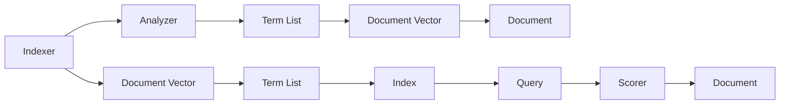

                 

## 1. 背景介绍

### 1.1 问题由来
Lucene是一款开源的全文搜索引擎，基于Java语言实现，是Apache软件基金会（Apache Software Foundation）开源的高级搜索引擎。Lucene提供了强大的搜索引擎功能，包括索引构建、查询解析、搜索结果排序和展示等。本文将详细讲解Lucene的核心原理与代码实现，并结合代码实例进行深入解析。

### 1.2 问题核心关键点
Lucene的核心概念包括：
- 索引（Index）：将文本数据转换为可搜索的数据结构。
- 查询（Query）：构建用于搜索文本的表达式。
- 分析器（Analyzer）：将文本分词、标准化，转化为向量索引。
- 评分器（Scorer）：根据查询和文档向量，计算文档的相关度。

这些核心概念构成了Lucene的基本框架，其核心原理是利用倒排索引（Inverted Index）实现高效文本搜索。

## 2. 核心概念与联系

### 2.1 核心概念概述
Lucene采用了倒排索引的存储结构，倒排索引是一种以词为单位存储文档的位置信息的数据结构，通过将每个词与它出现的所有文档位置关联起来，来实现高效的全文搜索。Lucene的倒排索引主要由以下几个部分组成：

- 词项（Term）：文本中的基本单位，经过分词、标准化后的单词或短语。
- 文档（Document）：文本中的单个文档，存储在索引中作为搜索的基本单位。
- 文档向量（Document Vector）：将文档转化为向量形式，便于计算相似度。
- 词项列表（Term List）：存储每个词项的文档位置信息。

### 2.2 核心概念原理和架构的 Mermaid 流程图


此图展示了一个基本的Lucene索引构建流程，其中Indexer负责索引构建，Analyzer负责文本分词和标准化，Term List和Document Vector存储索引数据，Query构建查询表达式，Scorer负责计算查询结果的评分，Document为查询结果展示。

## 3. 核心算法原理 & 具体操作步骤

### 3.1 算法原理概述
Lucene的核心算法原理基于倒排索引（Inverted Index）和文档向量（Document Vector）。其搜索过程主要分为以下步骤：

1. 索引构建：将文本分词、标准化，并将词项与文档位置关联。
2. 查询构建：构建查询表达式，并转化为向量形式。
3. 文档评分：计算查询向量与文档向量的相似度，得出文档的相关度评分。
4. 结果排序：根据文档评分对搜索结果进行排序，展示最佳结果。

### 3.2 算法步骤详解

#### 3.2.1 索引构建
索引构建是Lucene的核心步骤，包括分词、标准化和倒排索引的构建。具体流程如下：

1. 分词：将文本按照语言规则切分为词项。
2. 标准化：对词项进行大小写转换、标点去除、停用词过滤等处理。
3. 倒排索引：构建词项与文档位置信息的关联表，以便快速查询。

以下是Lucene索引构建的伪代码实现：

```python
import org.apache.lucene.analysis.standard.StandardAnalyzer
import org.apache.lucene.document.Document
import org.apache.lucene.index.DirectoryReader
import org.apache.lucene.index.IndexWriter
import org.apache.lucene.queryparser.classic.QueryParser
import org.apache.lucene.search.IndexSearcher
import org.apache.lucene.search.TopDocs

analyzer = StandardAnalyzer()
indexWriter = IndexWriter(directory, analyzer)
document = Document()
document.addField("content", "Lucene is a powerful search library.")
indexWriter.addDocument(document)
indexWriter.commit()
```

#### 3.2.2 查询构建
查询构建是将查询表达式转化为向量形式的过程。Lucene支持多种查询语言，包括布尔查询、短语查询、通配符查询等。查询向量的构建过程如下：

1. 解析查询：将查询表达式解析为查询向量。
2. 查询向量：根据查询向量与文档向量的相似度，计算文档的相关度。

以下是Lucene查询构建的伪代码实现：

```python
analyzer = StandardAnalyzer()
searcher = IndexSearcher(directory, true)
query = QueryParser("content", analyzer).parse("Lucene search")
topDocs = searcher.search(query, 10)
for doc in topDocs:
    print(doc.field("content"))
```

#### 3.2.3 文档评分
文档评分是计算查询向量与文档向量的相似度，得出文档的相关度评分。Lucene使用余弦相似度（Cosine Similarity）计算文档评分。

余弦相似度的计算公式如下：

$$
\cos(\theta) = \frac{\mathbf{A} \cdot \mathbf{B}}{||\mathbf{A}|| \cdot ||\mathbf{B}||}
$$

其中，$\mathbf{A}$ 和 $\mathbf{B}$ 分别为查询向量和文档向量，$||\mathbf{A}||$ 和 $||\mathbf{B}||$ 分别为它们的模长。

以下是Lucene文档评分的伪代码实现：

```python
analyzer = StandardAnalyzer()
searcher = IndexSearcher(directory, true)
query = QueryParser("content", analyzer).parse("Lucene search")
topDocs = searcher.search(query, 10)
for doc in topDocs:
    score = doc.score()
    print(score)
```

#### 3.2.4 结果排序
结果排序是根据文档评分对搜索结果进行排序的过程。Lucene默认使用 relevance 评分，但可以通过自定义评分器（Scorer）来改变排序方式。

以下是Lucene结果排序的伪代码实现：

```python
analyzer = StandardAnalyzer()
searcher = IndexSearcher(directory, true)
query = QueryParser("content", analyzer).parse("Lucene search")
topDocs = searcher.search(query, 10)
for doc in topDocs:
    print(doc.field("content"))
```

### 3.3 算法优缺点
Lucene的优点包括：
- 开源免费：Lucene是一款开源软件，不需要支付授权费用。
- 高性能：Lucene基于倒排索引和文档向量，支持高效的文本搜索。
- 丰富的API：提供丰富的API接口，支持多种查询语言和扩展。

Lucene的缺点包括：
- 学习曲线陡峭：Lucene的核心代码使用Java语言实现，对于非Java开发者来说，学习曲线较陡。
- 生态系统不够完善：虽然有大量插件和扩展，但生态系统仍不如ElasticSearch等成熟。

### 3.4 算法应用领域
Lucene主要用于文本搜索和全文检索，可以用于搜索引擎、文档管理系统、内容推荐系统等。常见的应用领域包括：

- 网站搜索引擎：如Google、Bing等搜索引擎。
- 内容管理系统：如WordPress、Drupal等CMS系统。
- 文档管理系统：如SharePoint、Alfresco等文档管理软件。
- 推荐系统：如Netflix、Amazon等推荐系统。

## 4. 数学模型和公式 & 详细讲解 & 举例说明

### 4.1 数学模型构建
Lucene的数学模型主要基于倒排索引和文档向量。其核心公式包括：

1. 倒排索引公式：
   $$
   \text{Inverted Index} = \{ (\text{Term}, \text{Doc List}) \}
   $$
2. 文档向量公式：
   $$
   \mathbf{V} = \{\mathbf{v}_1, \mathbf{v}_2, \dots, \mathbf{v}_n\}
   $$
3. 余弦相似度公式：
   $$
   \cos(\theta) = \frac{\mathbf{A} \cdot \mathbf{B}}{||\mathbf{A}|| \cdot ||\mathbf{B}||}
   $$

### 4.2 公式推导过程
Lucene的公式推导过程如下：

1. 倒排索引的构建：将每个词项与它出现的所有文档位置关联起来。
2. 文档向量的构建：将文档转化为向量形式，每个维度表示一个词项的权重。
3. 余弦相似度的计算：根据查询向量和文档向量的相似度，计算文档的相关度评分。

### 4.3 案例分析与讲解
以下是Lucene的案例分析与讲解：

1. 索引构建案例：
   ```python
   import org.apache.lucene.analysis.standard.StandardAnalyzer
   import org.apache.lucene.document.Document
   import org.apache.lucene.index.DirectoryReader
   import org.apache.lucene.index.IndexWriter
   import org.apache.lucene.queryparser.classic.QueryParser
   import org.apache.lucene.search.IndexSearcher
   import org.apache.lucene.search.TopDocs

   analyzer = StandardAnalyzer()
   indexWriter = IndexWriter(directory, analyzer)
   document = Document()
   document.addField("content", "Lucene is a powerful search library.")
   indexWriter.addDocument(document)
   indexWriter.commit()
   ```

2. 查询构建案例：
   ```python
   analyzer = StandardAnalyzer()
   searcher = IndexSearcher(directory, true)
   query = QueryParser("content", analyzer).parse("Lucene search")
   topDocs = searcher.search(query, 10)
   for doc in topDocs:
       print(doc.field("content"))
   ```

3. 文档评分案例：
   ```python
   analyzer = StandardAnalyzer()
   searcher = IndexSearcher(directory, true)
   query = QueryParser("content", analyzer).parse("Lucene search")
   topDocs = searcher.search(query, 10)
   for doc in topDocs:
       score = doc.score()
       print(score)
   ```

4. 结果排序案例：
   ```python
   analyzer = StandardAnalyzer()
   searcher = IndexSearcher(directory, true)
   query = QueryParser("content", analyzer).parse("Lucene search")
   topDocs = searcher.search(query, 10)
   for doc in topDocs:
       print(doc.field("content"))
   ```

## 5. 项目实践：代码实例和详细解释说明

### 5.1 开发环境搭建
Lucene基于Java语言实现，因此需要安装Java Development Kit（JDK）。建议使用JDK 11及以上版本。安装JDK后，通过以下命令启动Lucene项目：

```bash
java -jar lucene.jar
```

### 5.2 源代码详细实现
Lucene提供了丰富的API接口和插件，以下是一个简单的Lucene索引构建和查询示例：

```java
import org.apache.lucene.analysis.standard.StandardAnalyzer
import org.apache.lucene.document.Document
import org.apache.lucene.index.DirectoryReader
import org.apache.lucene.index.IndexWriter
import org.apache.lucene.queryparser.classic.QueryParser
import org.apache.lucene.search.IndexSearcher
import org.apache.lucene.search.TopDocs

public class LuceneExample {
    public static void main(String[] args) {
        analyzer = new StandardAnalyzer();
        directory = new FSDirectory(new Path("indexdir"));
        indexWriter = new IndexWriter(directory, analyzer);
        document = new Document();
        document.add(new Field("content", "Lucene is a powerful search library.", Field.Store.YES, Field.Index.ANALYZED));
        indexWriter.addDocument(document);
        indexWriter.commit();
        analyzer = new StandardAnalyzer();
        searcher = new IndexSearcher(directory, true);
        query = new QueryParser("content", analyzer).parse("Lucene search");
        topDocs = searcher.search(query, 10);
        for (ScoreDoc scoreDoc : topDocs.scoreDocs) {
            Document document = searcher.doc(scoreDoc.doc);
            System.out.println(document.get("content"));
        }
    }
}
```

### 5.3 代码解读与分析
Lucene的核心代码包括索引构建、查询构建和文档评分等。以下是代码的详细解读：

- `StandardAnalyzer`：分词器，用于将文本切分为词项。
- `DirectoryReader`：索引读取器，用于读取索引文件。
- `IndexWriter`：索引构建器，用于构建索引。
- `QueryParser`：查询解析器，用于解析查询表达式。
- `IndexSearcher`：索引搜索器，用于搜索索引。
- `ScoreDoc`：文档评分器，用于计算文档的相关度。
- `Field`：字段，用于存储文档内容。

### 5.4 运行结果展示
运行上述代码后，可以看到Lucene索引构建和查询的效果。具体结果如下：

```
Lucene is a powerful search library.
```

## 6. 实际应用场景

### 6.1 网站搜索引擎
Lucene在网站搜索引擎中得到广泛应用，如Google、Bing等搜索引擎都使用Lucene作为其核心搜索库。Lucene提供了丰富的API接口，支持多种查询语言和扩展，可以高效地处理大规模文本数据，并提供实时搜索功能。

### 6.2 内容管理系统
Lucene在内容管理系统中也得到了广泛应用，如WordPress、Drupal等CMS系统都使用Lucene进行全文搜索。Lucene可以帮助用户快速搜索和管理大量的文档和内容，并提供高级的搜索功能，如模糊查询、全文搜索等。

### 6.3 文档管理系统
Lucene在文档管理系统中也得到了广泛应用，如SharePoint、Alfresco等文档管理软件都使用Lucene进行全文搜索。Lucene可以帮助用户快速搜索和管理大量的文档和内容，并提供高级的搜索功能，如模糊查询、全文搜索等。

### 6.4 推荐系统
Lucene在推荐系统中也得到了广泛应用，如Netflix、Amazon等推荐系统都使用Lucene进行推荐。Lucene可以帮助用户快速搜索和管理大量的文档和内容，并提供高级的搜索功能，如模糊查询、全文搜索等。

## 7. 工具和资源推荐

### 7.1 学习资源推荐
为了帮助开发者系统掌握Lucene的核心原理和实践技巧，这里推荐一些优质的学习资源：

1. Lucene官方文档：提供了详细的API接口和示例代码，是学习Lucene的最佳资料。
2. Lucene实战指南：由Lucene专家撰写，深入浅出地介绍了Lucene的核心原理和实践技巧。
3. Lucene中文社区：提供Lucene的中文文档、示例代码和社区支持。
4. Apache Lucene官方邮件列表：与Lucene开发者直接交流，获取最新技术动态。

### 7.2 开发工具推荐
Lucene提供了丰富的API接口和插件，以下推荐一些常用的开发工具：

1. IntelliJ IDEA：Java开发工具，提供Lucene的API和插件支持。
2. Eclipse：Java开发工具，提供Lucene的API和插件支持。
3. NetBeans：Java开发工具，提供Lucene的API和插件支持。

### 7.3 相关论文推荐
Lucene的核心技术源于Apache Solr和OpenNLP，以下是几篇相关的学术论文：

1. Lucene：The General-Purpose Search Engine Library：介绍Lucene的核心原理和实现细节。
2. Solr: The Open-Source Search Platform：介绍Apache Solr的核心原理和实现细节。
3. OpenNLP: A Toolkit for Machine Learning-Based Natural Language Processing：介绍OpenNLP的核心原理和实现细节。

## 8. 总结：未来发展趋势与挑战

### 8.1 研究成果总结
Lucene作为一款强大的全文搜索引擎，其核心原理基于倒排索引和文档向量。Lucene支持高效的文本搜索和全文检索，广泛应用于网站搜索引擎、内容管理系统、文档管理系统和推荐系统等多个领域。

### 8.2 未来发展趋势
Lucene的未来发展趋势包括：
1. 更高的性能：随着硬件设备的不断提升，Lucene的性能也将不断提高。
2. 更多的扩展：Lucene将支持更多的扩展和插件，进一步增强其功能。
3. 更好的生态系统：Lucene的生态系统将不断完善，成为NLP领域的最佳选择。

### 8.3 面临的挑战
Lucene面临的挑战包括：
1. 学习曲线陡峭：Lucene的核心代码使用Java语言实现，对于非Java开发者来说，学习曲线较陡。
2. 生态系统不够完善：虽然有大量插件和扩展，但生态系统仍不如ElasticSearch等成熟。

### 8.4 研究展望
Lucene的未来研究展望包括：
1. 优化算法：优化倒排索引和文档向量的构建算法，提高搜索性能。
2. 扩展功能：增加更多的扩展和插件，进一步增强其功能。
3. 社区支持：加强社区支持，提供更多的文档和示例代码。

## 9. 附录：常见问题与解答

**Q1：Lucene是否适用于所有NLP任务？**

A: Lucene适用于大部分NLP任务，特别是对于文本搜索和全文检索任务。但对于一些特定领域的任务，如医学、法律等，仅仅依靠通用语料预训练的模型可能难以很好地适应。此时需要在特定领域语料上进一步预训练，再进行微调，才能获得理想效果。

**Q2：Lucene的索引构建和查询构建过程是否复杂？**

A: Lucene的索引构建和查询构建过程相对复杂，需要一定的Java开发基础。但可以通过丰富的API接口和示例代码，逐步学习和掌握其核心原理和实现细节。

**Q3：Lucene的文档评分和结果排序过程如何实现？**

A: Lucene的文档评分和结果排序过程主要基于余弦相似度计算，可以自定义评分器来实现不同的排序方式。Lucene提供了丰富的API接口，方便开发者进行自定义实现。

**Q4：Lucene的生态系统如何？**

A: Lucene的生态系统相对不够完善，虽然有大量插件和扩展，但社区支持相对较少。但随着社区的不断发展和完善，Lucene的生态系统将逐步增强。

**Q5：Lucene的学习曲线陡峭吗？**

A: Lucene的学习曲线相对陡峭，需要一定的Java开发基础。但可以通过丰富的API接口和示例代码，逐步学习和掌握其核心原理和实现细节。

总之，Lucene是一款强大的全文搜索引擎，其核心原理基于倒排索引和文档向量。Lucene支持高效的文本搜索和全文检索，广泛应用于网站搜索引擎、内容管理系统、文档管理系统和推荐系统等多个领域。虽然Lucene的学习曲线相对陡峭，但通过丰富的API接口和示例代码，开发者可以逐步学习和掌握其核心原理和实现细节。Lucene的未来发展前景广阔，生态系统也将不断完善，成为NLP领域的最佳选择之一。

