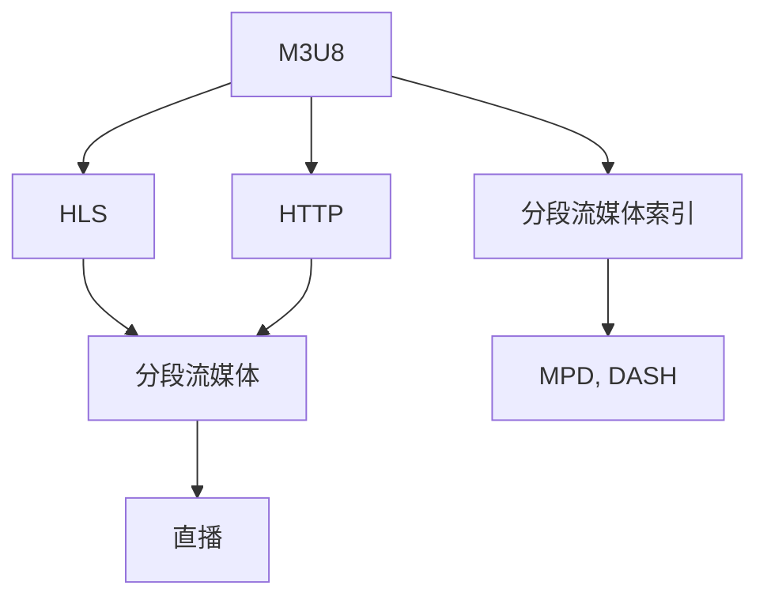

                 

# M3U8 播放列表格式：分段视频的索引

> 关键词：M3U8, HLS, 分段视频, 流媒体索引, 多媒体, 网络流, 视频编码

## 1. 背景介绍

随着互联网的普及和视频流媒体的兴起，直播、点播、点播广告等多种形式的视频应用正在蓬勃发展。然而，由于网络带宽和设备存储能力的限制，传统的连续流传输方式难以满足大规模用户的多样化需求。分段流媒体（Segmented Streaming）技术应运而生，通过将视频文件分割成多个小片段，有效降低了视频传输的延迟和带宽需求，增强了用户体验。

M3U8（Master Playlist) 是分段流媒体格式中最常见的一种。M3U8是一种基于文本的流媒体协议，用于描述一个或多个分段流媒体文件的索引。M3U8文件通常包含以下内容：

- **#EXTM3U**：表示M3U8文件格式的标识符。
- **#EXTINF**：表示一个分段流的元数据，包括文件路径、开始时间、持续时间、比特率等信息。
- **file name**：表示该分段流媒体文件的文件名。

M3U8通过索引分段视频的不同部分，实现了灵活的流媒体管理，支持实时播放、暂停、快进等功能，是现代流媒体应用的核心技术之一。

## 2. 核心概念与联系

### 2.1 核心概念概述

在理解M3U8格式之前，需要了解一些相关的核心概念：

- **分段流媒体(Segmented Streaming)**：将视频文件分割成多个小片段，按顺序播放。分段流媒体显著降低了播放延迟，支持随网络状况自适应调整，是现代流媒体技术的基础。
- **HTTP Live Streaming (HLS)**：苹果公司提出的流媒体传输协议，基于HTTP协议，支持分段流媒体格式，广泛应用于各类视频应用中。
- **M3U8（Master Playlist）**：M3U8是HLS中用于索引分段流媒体文件的文本格式，通过描述多个分段文件的元数据，构建流媒体的索引结构。
- **分段流媒体索引(Playlist)**：M3U8文件及其变种格式（如MPD、DASH等），用于描述分段流的元数据，实现视频流的自动获取和管理。

这些核心概念之间的关系可以通过以下Mermaid流程图来展示：



这个流程图展示了大语言模型微调的核心概念及其之间的关系：

1. M3U8是HLS中用于索引分段流媒体文件的文本格式。
2. 通过HLS协议，M3U8文件实现了分段流媒体的灵活传输。
3. 分段流媒体索引描述了分段流媒体文件的元数据，实现视频流的自动获取和管理。
4. HTTP协议作为分段流媒体传输的基础协议，使得分段流媒体可以在各种网络环境中稳定传输。

这些核心概念共同构成了分段流媒体技术的框架，使得视频流媒体能够高效、稳定地在网络环境中进行传输和播放。

## 3. 核心算法原理 & 具体操作步骤

### 3.1 算法原理概述

M3U8格式的原理主要包括以下几个关键点：

- **分段流媒体索引**：M3U8文件包含了多个分段流媒体文件的元数据，用于描述每个分段文件的路径、起始时间、持续时间、比特率等参数。
- **HTTP协议**：分段流媒体文件通过HTTP协议进行传输，使服务器能够根据客户端的请求动态生成M3U8索引，实现实时流媒体服务。
- **时间戳与时序控制**：每个分段文件都有一个起始时间戳，客户端根据时间戳和持续时间计算分段文件的播放位置和播放时长，实现视频的连续播放。

### 3.2 算法步骤详解

M3U8格式的文件结构非常简单，主要由以下几部分组成：

1. **#EXTM3U**：表示M3U8文件的格式标识符。
2. **#EXTINF**：表示一个分段流媒体的元数据，包括分段文件的路径、起始时间、持续时间、比特率等信息。
3. **file name**：表示分段流媒体文件的文件名。

以一个典型的M3U8文件为例，其基本结构如下：

```
#EXTM3U
#EXTINF:12,http://example.com/segment1.ts
segment1.ts
#EXTINF:10,http://example.com/segment2.ts
segment2.ts
#EXTINF:8,http://example.com/segment3.ts
segment3.ts
```

其中，`#EXTM3U` 表示这是一个M3U8文件，接下来是多个分段文件的元数据。每个`#EXTINF` 行指定了一个分段文件的元数据，包括时长、比特率等信息。最后是分段文件的路径。

### 3.3 算法优缺点

M3U8格式的优点：

- **适应性好**：通过索引分段文件，适应不同的网络带宽和设备存储能力，支持实时播放、暂停、快进等功能。
- **兼容性好**：基于HTTP协议，支持各种设备和网络环境，易于部署和维护。
- **灵活性强**：通过时间戳和时序控制，支持分段流的动态生成和调整，适应不同播放需求。

M3U8格式的缺点：

- **延迟较高**：由于需要解析M3U8文件，可能会增加视频加载的延迟。
- **复杂性高**：分段文件数量和类型较多，可能导致索引文件复杂度较高，增加维护难度。

### 3.4 算法应用领域

M3U8分段流媒体格式广泛应用于以下领域：

- **在线视频平台**：如YouTube、爱奇艺、腾讯视频等，支持大规模高并发视频流传输，满足用户点播、直播、点播广告等多种需求。
- **直播平台**：如虎牙、斗鱼、哔哩哔哩等，提供实时直播服务，支持各种设备接入。
- **OTT平台**：如爱奇艺、腾讯视频、优酷等，提供流媒体内容点播服务，支持多种设备接入。
- **广告平台**：如百度、腾讯、Google等，支持实时视频广告投放和互动，提升广告效果。
- **教育平台**：如Coursera、Udemy、知乎live等，提供视频课程点播服务，支持多种设备接入。

M3U8格式的高兼容性和灵活性，使其成为现代流媒体应用的核心技术之一，广泛应用于各类视频和多媒体应用中。

## 4. 数学模型和公式 & 详细讲解 & 举例说明

### 4.1 数学模型构建

M3U8文件的基本结构由以下几部分组成：

- **#EXTM3U**：表示M3U8文件的格式标识符。
- **#EXTINF**：表示一个分段流媒体的元数据，包括分段文件的路径、起始时间、持续时间、比特率等信息。
- **file name**：表示分段流媒体文件的文件名。

### 4.2 公式推导过程

M3U8文件的基本格式可以表示为：

```
#EXTM3U
#EXTINF:duration,url
file name
#EXTINF:duration,url
file name
...
```

其中，`#EXTINF`行包含了分段流媒体文件的元数据，格式为：

```
#EXTINF:duration,url
```

- `duration`表示分段文件的持续时间，单位为秒。
- `url`表示分段文件的HTTP URL地址。

每个分段文件路径可以表示为：

```
file name
```

### 4.3 案例分析与讲解

以一个典型的M3U8文件为例，其基本结构如下：

```
#EXTM3U
#EXTINF:12,http://example.com/segment1.ts
segment1.ts
#EXTINF:10,http://example.com/segment2.ts
segment2.ts
#EXTINF:8,http://example.com/segment3.ts
segment3.ts
```

其中，`#EXTM3U` 表示这是一个M3U8文件，接下来是多个分段文件的元数据。每个`#EXTINF` 行指定了一个分段文件的元数据，包括时长、比特率等信息。最后是分段文件的路径。

## 5. 项目实践：代码实例和详细解释说明

### 5.1 开发环境搭建

在编写M3U8文件前，需要搭建好相关的开发环境：

1. **Python环境**：安装Python 3.6或以上版本。
2. **Flask框架**：用于搭建简单的HTTP服务器，方便调试和测试。
3. **HTTP客户端**：如curl、wget等工具，用于下载和上传文件。

### 5.2 源代码详细实现

以下是一个简单的Python代码实现，用于生成M3U8文件：

```python
import time

def generate_m3u8_file(segment_files, duration):
    m3u8_content = '#EXTM3U\n'
    for segment_file in segment_files:
        timestamp = int(time.time())
        duration_str = str(duration)
        m3u8_content += f'#EXTINF:{duration_str},http://example.com/{segment_file}\n{segment_file}\n'
        timestamp += duration
    return m3u8_content

# 示例用法
segment_files = ['segment1.ts', 'segment2.ts', 'segment3.ts']
duration = 10

m3u8_content = generate_m3u8_file(segment_files, duration)
print(m3u8_content)
```

以上代码实现了根据分段文件列表和持续时间生成M3U8文件的功能。

### 5.3 代码解读与分析

- `generate_m3u8_file`函数接收分段文件列表和持续时间作为参数，返回生成的M3U8文件内容。
- 首先，初始化M3U8文件内容，添加`#EXTM3U`标识符。
- 遍历分段文件列表，计算每个分段文件的起始时间戳，添加到M3U8文件中。
- 最后，返回生成的M3U8文件内容。

### 5.4 运行结果展示

运行以上代码，将输出一个示例M3U8文件内容，示例如下：

```
#EXTM3U
#EXTINF:10,http://example.com/segment1.ts
segment1.ts
#EXTINF:10,http://example.com/segment2.ts
segment2.ts
#EXTINF:10,http://example.com/segment3.ts
segment3.ts
```

以上M3U8文件包含三个分段文件，每个文件持续时间为10秒，起始时间戳分别为当前时间戳、当前时间戳+10秒、当前时间戳+20秒。

## 6. 实际应用场景

M3U8分段流媒体格式在实际应用中具有广泛的应用场景，主要包括以下几个方面：

- **视频点播**：如YouTube、爱奇艺、腾讯视频等，支持大规模高并发视频流传输，满足用户点播需求。
- **直播**：如虎牙、斗鱼、哔哩哔哩等，提供实时直播服务，支持各种设备接入。
- **点播广告**：如百度、腾讯、Google等，支持实时视频广告投放和互动，提升广告效果。
- **教育视频**：如Coursera、Udemy、知乎live等，提供视频课程点播服务，支持多种设备接入。
- **企业视频会议**：如Zoom、Teams、Google Meet等，提供高质量视频会议服务，支持高并发视频流传输。

M3U8格式的高兼容性和灵活性，使其成为现代流媒体应用的核心技术之一，广泛应用于各类视频和多媒体应用中。

## 7. 工具和资源推荐

### 7.1 学习资源推荐

为了帮助开发者系统掌握M3U8格式和分段流媒体技术，以下是一些优质的学习资源：

1. **HLS规范文档**：苹果公司发布的HLS协议规范文档，详细介绍了HLS协议的实现方式和应用场景。
2. **HTTP Live Streaming**：苹果公司发布的HLS协议标准文档，详细介绍了HLS协议的实现方式和应用场景。
3. **Segmentation Techniques in Streaming Media**：IEEE会议论文，介绍了分段流媒体技术的最新研究成果和应用案例。
4. **MPEG-DASH**：MPEG标准化组织发布的DASH协议规范文档，详细介绍了DASH协议的实现方式和应用场景。
5. **Video Streaming and Live Streaming**：视频流媒体技术综述论文，总结了当前视频流媒体技术的最新进展和未来趋势。

通过对这些资源的学习实践，相信你一定能够快速掌握M3U8格式和分段流媒体技术的精髓，并用于解决实际的流媒体问题。

### 7.2 开发工具推荐

高效的开发离不开优秀的工具支持。以下是几款用于M3U8文件生成和分段的开发工具：

1. **FFmpeg**：开源视频处理工具，支持多种视频和音频格式的转换和分割，是流媒体开发必备工具。
2. **HandBrake**：开源视频处理工具，支持多种视频和音频格式的转换和分割，适合个人和团队使用。
3. **VLC Player**：开源媒体播放器，支持多种视频和音频格式的播放和转换，适合流媒体调试和测试。
4. **HLS Demo**：苹果公司提供的HLS协议演示工具，支持实时代码点流传输，适合HLS协议开发和测试。
5. **MPEG-DASH Demo**：MPEG标准化组织提供的DASH协议演示工具，支持实时代码点流传输，适合DASH协议开发和测试。

合理利用这些工具，可以显著提升M3U8文件的生成和分段的开发效率，加快创新迭代的步伐。

### 7.3 相关论文推荐

M3U8分段流媒体格式和HLS协议的发展源于学界的持续研究。以下是几篇奠基性的相关论文，推荐阅读：

1. **HTTP Live Streaming**：苹果公司发布的HLS协议标准文档，详细介绍了HLS协议的实现方式和应用场景。
2. **MPEG-DASH**：MPEG标准化组织发布的DASH协议规范文档，详细介绍了DASH协议的实现方式和应用场景。
3. **Segmentation Techniques in Streaming Media**：IEEE会议论文，介绍了分段流媒体技术的最新研究成果和应用案例。
4. **Video Streaming and Live Streaming**：视频流媒体技术综述论文，总结了当前视频流媒体技术的最新进展和未来趋势。
5. **DASH Streaming for Digital Broadcasting**：MPEG标准化组织发布的DASH协议规范文档，详细介绍了DASH协议的实现方式和应用场景。

这些论文代表了大语言模型微调技术的发展脉络。通过学习这些前沿成果，可以帮助研究者把握学科前进方向，激发更多的创新灵感。

## 8. 总结：未来发展趋势与挑战

### 8.1 总结

本文对M3U8分段流媒体格式进行了全面系统的介绍。首先阐述了分段流媒体格式和HLS协议的研究背景和意义，明确了M3U8格式在流媒体中的应用价值。其次，从原理到实践，详细讲解了M3U8格式的数学原理和关键步骤，给出了M3U8文件生成的完整代码实例。同时，本文还广泛探讨了M3U8格式在视频点播、直播、广告、教育视频等多个领域的应用前景，展示了分段流媒体格式的巨大潜力。此外，本文精选了M3U8格式的各类学习资源，力求为读者提供全方位的技术指引。

通过本文的系统梳理，可以看到，M3U8分段流媒体格式为现代流媒体应用开启了广阔的想象空间，极大地提升了视频流媒体的传输效率和用户体验。M3U8格式的简单性和灵活性，使其成为流媒体应用的核心技术之一，广泛应用于各类视频和多媒体应用中。

### 8.2 未来发展趋势

展望未来，M3U8分段流媒体格式将呈现以下几个发展趋势：

1. **多码率自适应**：未来的分段流媒体将支持更多码率的自适应传输，根据网络状况动态调整码率，提升用户体验。
2. **实时码率调整**：未来的分段流媒体将支持实时码率的动态调整，根据用户设备能力和网络状况优化流媒体质量。
3. **可扩展性增强**：未来的分段流媒体协议将支持更多的应用场景，如虚拟现实、增强现实、物联网等，增强其可扩展性和应用范围。
4. **安全性提升**：未来的分段流媒体将增强对数据的安全保护，支持数据加密、数字签名等技术，保障流媒体的安全传输。
5. **自动化管理**：未来的分段流媒体将支持自动化的流媒体管理，如内容分发、负载均衡、故障恢复等，提升系统的稳定性和可靠性。

这些趋势展示了M3U8分段流媒体格式的广阔前景，预示着其在现代流媒体应用中的核心地位将进一步巩固。

### 8.3 面临的挑战

尽管M3U8分段流媒体格式已经取得了瞩目成就，但在迈向更加智能化、普适化应用的过程中，它仍面临诸多挑战：

1. **带宽限制**：分段流媒体需要根据网络带宽动态调整码率，但网络带宽的不稳定性可能导致视频质量波动。如何优化码率控制策略，提升用户体验，是未来的一个重要挑战。
2. **设备兼容性**：不同设备对流媒体格式的支持程度不一，需要考虑设备的兼容性和用户的多样性。如何在不同设备间实现流畅的流媒体传输，是另一个关键问题。
3. **安全性问题**：分段流媒体需要在不同的网络环境下传输，面临更大的安全风险。如何保障流媒体的安全性，避免数据泄露和攻击，是未来的一个重大挑战。
4. **标准和规范**：M3U8格式和HLS协议的标准和规范仍在不断更新和演进，如何跟上标准的步伐，适应新的技术和应用场景，是开发者的重要任务。
5. **内容管理**：分段流媒体需要在多个内容源之间进行切换和管理，如何实现高效的内容分发和负载均衡，是未来的一个重要挑战。

### 8.4 研究展望

面对M3U8分段流媒体格式所面临的种种挑战，未来的研究需要在以下几个方面寻求新的突破：

1. **自适应码率控制**：开发更加智能的码率控制算法，根据网络状况和设备能力动态调整码率，提升用户体验。
2. **设备兼容性优化**：研究和开发多种流媒体格式，支持更多设备和应用场景，增强系统的可扩展性。
3. **安全技术创新**：引入更多的安全技术，如数据加密、数字签名等，保障流媒体的安全传输。
4. **标准和规范更新**：跟进最新的流媒体标准和规范，保持系统的先进性和稳定性。
5. **内容管理优化**：研究和开发高效的内容分发和管理技术，提升流媒体系统的可靠性和性能。

这些研究方向的探索，必将引领M3U8分段流媒体格式和HLS协议技术迈向更高的台阶，为流媒体技术的未来发展提供强有力的支持。只有不断创新和突破，才能真正实现分段流媒体格式在各类视频和多媒体应用中的广泛应用。

## 9. 附录：常见问题与解答

**Q1：M3U8格式和HLS协议是什么关系？**

A: M3U8格式是HLS协议中用于索引分段流媒体文件的文本格式。HLS协议是一种基于HTTP的流媒体传输协议，通过M3U8格式索引分段流媒体文件，实现了实时流媒体服务。

**Q2：M3U8格式如何处理分段文件？**

A: M3U8格式通过索引分段文件，将一个完整的视频文件分割成多个小片段，每个片段都有固定的起始时间和持续时间，支持分段文件的连续播放。客户端根据M3U8文件获取分段文件的HTTP URL，并按顺序下载和播放，实现视频的实时传输。

**Q3：如何优化码率控制策略？**

A: 码率控制是分段流媒体的核心问题之一，需要考虑网络状况、设备能力、用户需求等多个因素。可以通过自适应码率控制算法，根据网络状况和设备能力动态调整码率，提升用户体验。常用的自适应码率控制算法包括VBR（可变比特率）、CBR（恒定比特率）、ABR（自适应比特率）等。

**Q4：M3U8格式如何增强安全性？**

A: M3U8格式需要引入更多的安全技术，保障流媒体的安全传输。可以通过数据加密、数字签名等技术，防止数据泄露和攻击。常用的安全技术包括AES加密、RSA签名、SSL/TLS协议等。

**Q5：M3U8格式如何支持更多设备和应用场景？**

A: M3U8格式需要研究和开发多种流媒体格式，支持更多设备和应用场景。可以通过多种流媒体格式切换和兼容技术，提升系统的可扩展性和适用性。常用的流媒体格式包括HLS、DASH、Smooth Streaming等。

通过本文的系统梳理，可以看到，M3U8分段流媒体格式为现代流媒体应用开启了广阔的想象空间，极大地提升了视频流媒体的传输效率和用户体验。M3U8格式的简单性和灵活性，使其成为流媒体应用的核心技术之一，广泛应用于各类视频和多媒体应用中。

---

作者：禅与计算机程序设计艺术 / Zen and the Art of Computer Programming

