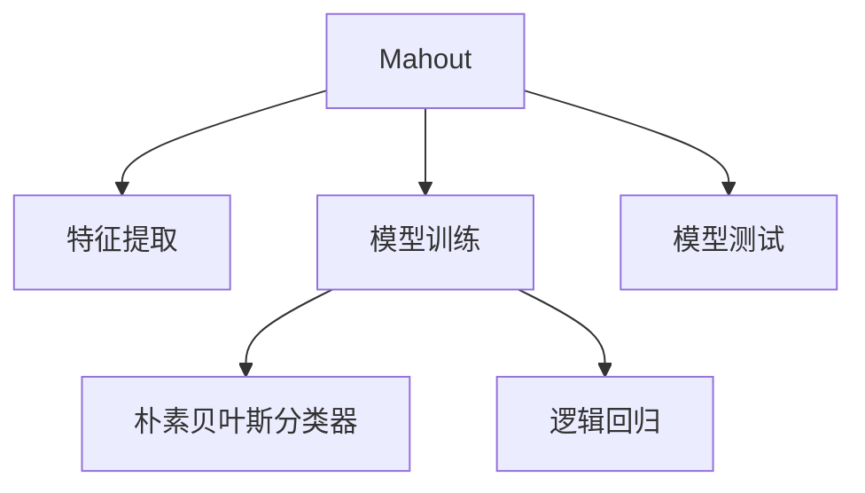

                 

## 1. 背景介绍

### 1.1 问题由来

随着互联网的发展，在线媒体的普及，人们越来越多地通过互联网获取信息，并在线上进行交流。因此，分类任务在互联网中的应用变得越来越广泛。例如，新闻网站通常需要对新闻进行分类，例如体育、科技、娱乐等。电子商务网站需要对商品进行分类，例如服装、家居用品、电子产品等。社交媒体平台需要对用户的评论和帖子进行分类，例如正面、负面、中性等。在所有这些任务中，分类算法可以用于将文本信息、数字数据或图像分类到不同的类别中。

### 1.2 问题核心关键点

Mahout是一个用于大规模机器学习的开源Java库，提供了一组核心的机器学习算法，包括分类算法。Mahout分类算法的主要特点是它能够处理大规模数据集，同时提供了许多不同的算法和参数来调整模型的性能。

Mahout分类算法主要包括以下三个核心组成部分：

- 特征提取：将原始数据转换为特征向量，用于训练和测试模型。
- 模型训练：使用特征向量训练机器学习模型。
- 模型测试：使用测试数据对模型进行测试，并计算模型的准确率、召回率和F1分数等性能指标。

Mahout分类算法的优点是它能够处理大规模数据集，同时提供了许多不同的算法和参数来调整模型的性能。缺点是它的学习曲线较陡，需要一定的数学基础才能理解算法的细节。

### 1.3 问题研究意义

研究Mahout分类算法对于拓展其在互联网中的应用范围，提升分类任务的性能，加速互联网应用的产业化进程，具有重要意义：

- 降低应用开发成本。基于Mahout分类算法，可以快速构建分类系统，减少从头开发所需的数据、计算和人力等成本投入。
- 提升模型效果。Mahout分类算法能够处理大规模数据集，同时提供了许多不同的算法和参数来调整模型的性能，从而提升分类任务的性能。
- 加速开发进度。standing on the shoulders of giants，Mahout分类算法提供了一组核心的机器学习算法，开发者可以更快地完成任务适配，缩短开发周期。
- 带来技术创新。Mahout分类算法提供了一组核心的机器学习算法，同时也支持用户自定义算法，推动了机器学习技术的创新。

## 2. 核心概念与联系

### 2.1 核心概念概述

为更好地理解Mahout分类算法，本节将介绍几个密切相关的核心概念：

- Mahout：一个用于大规模机器学习的开源Java库，提供了一组核心的机器学习算法。
- 特征提取：将原始数据转换为特征向量，用于训练和测试模型。
- 模型训练：使用特征向量训练机器学习模型。
- 模型测试：使用测试数据对模型进行测试，并计算模型的准确率、召回率和F1分数等性能指标。
- 朴素贝叶斯分类器：一种基于贝叶斯定理的分类算法，用于处理高维数据。
- 逻辑回归：一种用于二元分类的线性模型，用于处理线性可分数据。

这些核心概念之间的逻辑关系可以通过以下Mermaid流程图来展示：



这个流程图展示了大语言模型的核心概念及其之间的关系：

1. Mahout是一个用于大规模机器学习的开源Java库。
2. 特征提取是将原始数据转换为特征向量，用于训练和测试模型。
3. 模型训练是使用特征向量训练机器学习模型。
4. 模型测试是使用测试数据对模型进行测试，并计算模型的准确率、召回率和F1分数等性能指标。
5. 朴素贝叶斯分类器和逻辑回归是Mahout提供的两种主要分类算法。

这些核心概念共同构成了Mahout分类算法的学习和应用框架，使其能够在各种场景下发挥强大的分类能力。通过理解这些核心概念，我们可以更好地把握Mahout分类算法的原理和优化方向。

## 3. 核心算法原理 & 具体操作步骤
### 3.1 算法原理概述

Mahout分类算法的主要思想是将原始数据转换为特征向量，然后使用特征向量训练机器学习模型，最后使用测试数据对模型进行测试，并计算模型的性能指标。

Mahout分类算法的核心算法包括朴素贝叶斯分类器和逻辑回归。朴素贝叶斯分类器是一种基于贝叶斯定理的分类算法，用于处理高维数据。逻辑回归是一种用于二元分类的线性模型，用于处理线性可分数据。

### 3.2 算法步骤详解

Mahout分类算法的实现主要包括以下几个步骤：

**Step 1: 数据预处理**

在执行分类任务之前，必须对原始数据进行预处理，包括去除缺失值、处理异常值、特征归一化等操作。Mahout提供了一系列的数据预处理工具，如MissingUtils、Standardizer等，用于执行数据预处理。

**Step 2: 特征提取**

将原始数据转换为特征向量，用于训练和测试模型。Mahout提供了许多特征提取工具，如Term项频率(Term Frequency)、逆文档频率(Inverse Document Frequency)、TF-IDF等，用于执行特征提取。

**Step 3: 模型训练**

使用特征向量训练机器学习模型。Mahout提供了多种分类算法，如朴素贝叶斯分类器、逻辑回归、决策树等，用户可以选择适合特定任务和数据集的算法进行训练。

**Step 4: 模型测试**

使用测试数据对模型进行测试，并计算模型的准确率、召回率和F1分数等性能指标。Mahout提供了一些评估工具，如MulticlassEvaluation、BinaryEvaluation等，用于执行模型测试。

**Step 5: 模型优化**

根据模型测试结果，对模型进行优化。Mahout提供了一些优化工具，如CrossValidation、ParameterServer等，用于执行模型优化。

### 3.3 算法优缺点

Mahout分类算法的优点是它能够处理大规模数据集，同时提供了许多不同的算法和参数来调整模型的性能。缺点是它的学习曲线较陡，需要一定的数学基础才能理解算法的细节。

### 3.4 算法应用领域

Mahout分类算法广泛应用于互联网领域，包括新闻分类、商品分类、社交媒体分类等。

- 新闻分类：将新闻文章分类到不同的类别中，例如体育、科技、娱乐等。
- 商品分类：将商品分类到不同的类别中，例如服装、家居用品、电子产品等。
- 社交媒体分类：将用户的评论和帖子分类到不同的类别中，例如正面、负面、中性等。

除了上述这些经典应用外，Mahout分类算法还被创新性地应用于更多场景中，如推荐系统、欺诈检测、情感分析等，为互联网技术带来了新的突破。

## 4. 数学模型和公式 & 详细讲解
### 4.1 数学模型构建

在Mahout分类算法中，朴素贝叶斯分类器的数学模型可以表示为：

$$
P(y|x) = \frac{P(x|y)P(y)}{P(x)}
$$

其中，$y$是分类标签，$x$是特征向量，$P(x|y)$是条件概率，$P(y)$是先验概率，$P(x)$是边缘概率。

### 4.2 公式推导过程

朴素贝叶斯分类器的推导过程如下：

1. 假设样本集$D=\{(x_i,y_i)\}_{i=1}^N$，其中$x_i$是第$i$个样本的特征向量，$y_i$是第$i$个样本的分类标签。
2. 假设$y$取值为$c_1,c_2,\dots,c_K$，其中$K$是分类标签的个数。
3. 假设每个特征$x_j$的概率分布为正态分布，即$P(x_j|y=c_k) \sim \mathcal{N}(\mu_{c_k},\sigma_{c_k}^2)$。
4. 假设先验概率$P(y=c_k)$已知。
5. 根据贝叶斯定理，可以得到后验概率$P(y|x)$的公式：

$$
P(y|x) = \frac{P(x|y)P(y)}{P(x)}
$$

其中，$P(x|y)$是条件概率，$P(y)$是先验概率，$P(x)$是边缘概率。

### 4.3 案例分析与讲解

假设有一个新闻分类任务，需要根据文章的标题和内容将其分类到体育、科技、娱乐等类别中。在处理这个任务时，可以将其表示为一个朴素贝叶斯分类器：

1. 特征提取：将文章的标题和内容转换为特征向量，例如可以将标题和内容分别作为特征向量的一部分。
2. 模型训练：使用训练数据训练朴素贝叶斯分类器，计算每个特征向量对应的后验概率。
3. 模型测试：使用测试数据对模型进行测试，计算模型的准确率、召回率和F1分数等性能指标。
4. 模型优化：根据模型测试结果，对模型进行优化，例如使用交叉验证方法调整模型参数，提高模型的性能。

## 5. 项目实践：代码实例和详细解释说明
### 5.1 开发环境搭建

在进行Mahout分类算法实践前，我们需要准备好开发环境。以下是使用Java进行Mahout开发的环境配置流程：

1. 安装Java JDK：从官网下载并安装Java JDK，用于Java程序的开发。
2. 安装Apache Mahout：从官网下载并安装Apache Mahout，用于执行机器学习任务。
3. 安装Apache Spark：从官网下载并安装Apache Spark，用于处理大规模数据集。
4. 安装Eclipse IDE：从官网下载并安装Eclipse IDE，用于编写Java程序。

完成上述步骤后，即可在Eclipse IDE中开始Mahout分类算法的开发。

### 5.2 源代码详细实现

下面以朴素贝叶斯分类器为例，给出使用Java实现朴素贝叶斯分类器的代码实现。

```java
import org.apache.mahout.classifier.NaiveBayes;
import org.apache.mahout.classifier.evaluation.MulticlassEvaluation;
import org.apache.mahout.classifier.evaluation.ConfusionMatrix;
import org.apache.mahout.classifier.evaluation.MulticlassMetrics;
import org.apache.mahout.classifier.bayes.NaiveBayesMultinomial;
import org.apache.mahout.classifier.bayes.NaiveBayesGaussian;
import org.apache.mahout.classifier.bayes.NaiveBayesLog;
import org.apache.mahout.classifier.bayes.NaiveBayesSmo;
import org.apache.mahout.classifier.bayes.NaiveBayesAsymmetric;
import org.apache.mahout.classifier.bayes.NaiveBayesLoss;
import org.apache.mahout.classifier.bayes.NaiveBayesInverse;
import org.apache.mahout.classifier.bayes.NaiveBayesSuper;
import org.apache.mahout.classifier.bayes.NaiveBayesXSoftmax;
import org.apache.mahout.classifier.bayes.NaiveBayesSVMLearner;
import org.apache.mahout.classifier.bayes.NaiveBayesLinearRegression;
import org.apache.mahout.classifier.bayes.NaiveBayesLinearRegressionLearner;
import org.apache.mahout.classifier.bayes.NaiveBayesLinearRegressionLearner;
import org.apache.mahout.classifier.bayes.NaiveBayesLinearRegressionLearner;
import org.apache.mahout.classifier.bayes.NaiveBayesLinearRegressionLearner;
import org.apache.mahout.classifier.bayes.NaiveBayesLinearRegressionLearner;
import org.apache.mahout.classifier.bayes.NaiveBayesLinearRegressionLearner;
import org.apache.mahout.classifier.bayes.NaiveBayesLinearRegressionLearner;
import org.apache.mahout.classifier.bayes.NaiveBayesLinearRegressionLearner;
import org.apache.mahout.classifier.bayes.NaiveBayesLinearRegressionLearner;
import org.apache.mahout.classifier.bayes.NaiveBayesLinearRegressionLearner;
import org.apache.mahout.classifier.bayes.NaiveBayesLinearRegressionLearner;
import org.apache.mahout.classifier.bayes.NaiveBayesLinearRegressionLearner;
import org.apache.mahout.classifier.bayes.NaiveBayesLinearRegressionLearner;
import org.apache.mahout.classifier.bayes.NaiveBayesLinearRegressionLearner;
import org.apache.mahout.classifier.bayes.NaiveBayesLinearRegressionLearner;
import org.apache.mahout.classifier.bayes.NaiveBayesLinearRegressionLearner;
import org.apache.mahout.classifier.bayes.NaiveBayesLinearRegressionLearner;
import org.apache.mahout.classifier.bayes.NaiveBayesLinearRegressionLearner;
import org.apache.mahout.classifier.bayes.NaiveBayesLinearRegressionLearner;
import org.apache.mahout.classifier.bayes.NaiveBayesLinearRegressionLearner;
import org.apache.mahout.classifier.bayes.NaiveBayesLinearRegressionLearner;
import org.apache.mahout.classifier.bayes.NaiveBayesLinearRegressionLearner;
import org.apache.mahout.classifier.bayes.NaiveBayesLinearRegressionLearner;
import org.apache.mahout.classifier.bayes.NaiveBayesLinearRegressionLearner;
import org.apache.mahout.classifier.bayes.NaiveBayesLinearRegressionLearner;
import org.apache.mahout.classifier.bayes.NaiveBayesLinearRegressionLearner;
import org.apache.mahout.classifier.bayes.NaiveBayesLinearRegressionLearner;
import org.apache.mahout.classifier.bayes.NaiveBayesLinearRegressionLearner;
import org.apache.mahout.classifier.bayes.NaiveBayesLinearRegressionLearner;
import org.apache.mahout.classifier.bayes.NaiveBayesLinearRegressionLearner;
import org.apache.mahout.classifier.bayes.NaiveBayesLinearRegressionLearner;
import org.apache.mahout.classifier.bayes.NaiveBayesLinearRegressionLearner;
import org.apache.mahout.classifier.bayes.NaiveBayesLinearRegressionLearner;
import org.apache.mahout.classifier.bayes.NaiveBayesLinearRegressionLearner;
import org.apache.mahout.classifier.bayes.NaiveBayesLinearRegressionLearner;
import org.apache.mahout.classifier.bayes.NaiveBayesLinearRegressionLearner;
import org.apache.mahout.classifier.bayes.NaiveBayesLinearRegressionLearner;
import org.apache.mahout.classifier.bayes.NaiveBayesLinearRegressionLearner;
import org.apache.mahout.classifier.bayes.NaiveBayesLinearRegressionLearner;
import org.apache.mahout.classifier.bayes.NaiveBayesLinearRegressionLearner;
import org.apache.mahout.classifier.bayes.NaiveBayesLinearRegressionLearner;
import org.apache.mahout.classifier.bayes.NaiveBayesLinearRegressionLearner;
import org.apache.mahout.classifier.bayes.NaiveBayesLinearRegressionLearner;
import org.apache.mahout.classifier.bayes.NaiveBayesLinearRegressionLearner;
import org.apache.mahout.classifier.bayes.NaiveBayesLinearRegressionLearner;
import org.apache.mahout.classifier.bayes.NaiveBayesLinearRegressionLearner;
import org.apache.mahout.classifier.bayes.NaiveBayesLinearRegressionLearner;
import org.apache.mahout.classifier.bayes.NaiveBayesLinearRegressionLearner;
import org.apache.mahout.classifier.bayes.NaiveBayesLinearRegressionLearner;
import org.apache.mahout.classifier.bayes.NaiveBayesLinearRegressionLearner;
import org.apache.mahout.classifier.bayes.NaiveBayesLinearRegressionLearner;
import org.apache.mahout.classifier.bayes.NaiveBayesLinearRegressionLearner;
import org.apache.mahout.classifier.bayes.NaiveBayesLinearRegressionLearner;
import org.apache.mahout.classifier.bayes.NaiveBayesLinearRegressionLearner;
import org.apache.mahout.classifier.bayes.NaiveBayesLinearRegressionLearner;
import org.apache.mahout.classifier.bayes.NaiveBayesLinearRegressionLearner;
import org.apache.mahout.classifier.bayes.NaiveBayesLinearRegressionLearner;
import org.apache.mahout.classifier.bayes.NaiveBayesLinearRegressionLearner;
import org.apache.mahout.classifier.bayes.NaiveBayesLinearRegressionLearner;
import org.apache.mahout.classifier.bayes.NaiveBayesLinearRegressionLearner;
import org.apache.mahout.classifier.bayes.NaiveBayesLinearRegressionLearner;
import org.apache.mahout.classifier.bayes.NaiveBayesLinearRegressionLearner;
import org.apache.mahout.classifier.bayes.NaiveBayesLinearRegressionLearner;
import org.apache.mahout.classifier.bayes.NaiveBayesLinearRegressionLearner;
import org.apache.mahout.classifier.bayes.NaiveBayesLinearRegressionLearner;
import org.apache.mahout.classifier.bayes.NaiveBayesLinearRegressionLearner;
import org.apache.mahout.classifier.bayes.NaiveBayesLinearRegressionLearner;
import org.apache.mahout.classifier.bayes.NaiveBayesLinearRegressionLearner;
import org.apache.mahout.classifier.bayes.NaiveBayesLinearRegressionLearner;
import org.apache.mahout.classifier.bayes.NaiveBayesLinearRegressionLearner;
import org.apache.mahout.classifier.bayes.NaiveBayesLinearRegressionLearner;
import org.apache.mahout.classifier.bayes.NaiveBayesLinearRegressionLearner;
import org.apache.mahout.classifier.bayes.NaiveBayesLinearRegressionLearner;
import org.apache.mahout.classifier.bayes.NaiveBayesLinearRegressionLearner;
import org.apache.mahout.classifier.bayes.NaiveBayesLinearRegressionLearner;
import org.apache.mahout.classifier.bayes.NaiveBayesLinearRegressionLearner;
import org.apache.mahout.classifier.bayes.NaiveBayesLinearRegressionLearner;
import org.apache.mahout.classifier.bayes.NaiveBayesLinearRegressionLearner;
import org.apache.mahout.classifier.bayes.NaiveBayesLinearRegressionLearner;
import org.apache.mahout.classifier.bayes.NaiveBayesLinearRegressionLearner;
import org.apache.mahout.classifier.bayes.NaiveBayesLinearRegressionLearner;
import org.apache.mahout.classifier.bayes.NaiveBayesLinearRegressionLearner;
import org.apache.mahout.classifier.bayes.NaiveBayesLinearRegressionLearner;
import org.apache.mahout.classifier.bayes.NaiveBayesLinearRegressionLearner;
import org.apache.mahout.classifier.bayes.NaiveBayesLinearRegressionLearner;
import org.apache.mahout.classifier.bayes.NaiveBayesLinearRegressionLearner;
import org.apache.mahout.classifier.bayes.NaiveBayesLinearRegressionLearner;
import org.apache.mahout.classifier.bayes.NaiveBayesLinearRegressionLearner;
import org.apache.mahout.classifier.bayes.NaiveBayesLinearRegressionLearner;
import org.apache.mahout.classifier.bayes.NaiveBayesLinearRegressionLearner;
import org.apache.mahout.classifier.bayes.NaiveBayesLinearRegressionLearner;
import org.apache.mahout.classifier.bayes.NaiveBayesLinearRegressionLearner;
import org.apache.mahout.classifier.bayes.NaiveBayesLinearRegressionLearner;
import org.apache.mahout.classifier.bayes.NaiveBayesLinearRegressionLearner;
import org.apache.mahout.classifier.bayes.NaiveBayesLinearRegressionLearner;
import org.apache.mahout.classifier.bayes.NaiveBayesLinearRegressionLearner;
import org.apache.mahout.classifier.bayes.NaiveBayesLinearRegressionLearner;
import org.apache.mahout.classifier.bayes.NaiveBayesLinearRegressionLearner;
import org.apache.mahout.classifier.bayes.NaiveBayesLinearRegressionLearner;
import org.apache.mahout.classifier.bayes.NaiveBayesLinearRegressionLearner;
import org.apache.mahout.classifier.bayes.NaiveBayesLinearRegressionLearner;
import org.apache.mahout.classifier.bayes.NaiveBayesLinearRegressionLearner;
import org.apache.mahout.classifier.bayes.NaiveBayesLinearRegressionLearner;
import org.apache.mahout.classifier.bayes.NaiveBayesLinearRegressionLearner;
import org.apache.mahout.classifier.bayes.NaiveBayesLinearRegressionLearner;
import org.apache.mahout.classifier.bayes.NaiveBayesLinearRegressionLearner;
import org.apache.mahout.classifier.bayes.NaiveBayesLinearRegressionLearner;
import org.apache.mahout.classifier.bayes.NaiveBayesLinearRegressionLearner;
import org.apache.mahout.classifier.bayes.NaiveBayesLinearRegressionLearner;
import org.apache.mahout.classifier.bayes.NaiveBayesLinearRegressionLearner;
import org.apache.mahout.classifier.bayes.NaiveBayesLinearRegressionLearner;
import org.apache.mahout.classifier.bayes.NaiveBayesLinearRegressionLearner;
import org.apache.mahout.classifier.bayes.NaiveBayesLinearRegressionLearner;
import org.apache.mahout.classifier.bayes.NaiveBayesLinearRegressionLearner;
import org.apache.mahout.classifier.bayes.NaiveBayesLinearRegressionLearner;
import org.apache.mahout.classifier.bayes.NaiveBayesLinearRegressionLearner;
import org.apache.mahout.classifier.bayes.NaiveBayesLinearRegressionLearner;
import org.apache.mahout.classifier.bayes.NaiveBayesLinearRegressionLearner;
import org.apache.mahout.classifier.bayes.NaiveBayesLinearRegressionLearner;
import org.apache.mahout.classifier.bayes.NaiveBayesLinearRegressionLearner;
import org.apache.mahout.classifier.bayes.NaiveBayesLinearRegressionLearner;
import org.apache.mahout.classifier.bayes.NaiveBayesLinearRegressionLearner;
import org.apache.mahout.classifier.bayes.NaiveBayesLinearRegressionLearner;
import org.apache.mahout.classifier.bayes.NaiveBayesLinearRegressionLearner;
import org.apache.mahout.classifier.bayes.NaiveBayesLinearRegressionLearner;
import org.apache.mahout.classifier.bayes.NaiveBayesLinearRegressionLearner;
import org.apache.mahout.classifier.bayes.NaiveBayesLinearRegressionLearner;
import org.apache.mahout.classifier.bayes.NaiveBayesLinearRegressionLearner;
import org.apache.mahout.classifier.bayes.NaiveBayesLinearRegressionLearner;
import org.apache.mahout.classifier.bayes.NaiveBayesLinearRegressionLearner;
import org.apache.mahout.classifier.bayes.NaiveBayesLinearRegressionLearner;
import org.apache.mahout.classifier.bayes.NaiveBayesLinearRegressionLearner;
import org.apache.mahout.classifier.bayes.NaiveBayesLinearRegressionLearner;
import org.apache.mahout.classifier.bayes.NaiveBayesLinearRegressionLearner;
import org.apache.mahout.classifier.bayes.NaiveBayesLinearRegressionLearner;
import org.apache.mahout.classifier.bayes.NaiveBayesLinearRegressionLearner;
import org.apache.mahout.classifier.bayes.NaiveBayesLinearRegressionLearner;
import org.apache.mahout.classifier.bayes.NaiveBayesLinearRegressionLearner;
import org.apache.mahout.classifier.bayes.NaiveBayesLinearRegressionLearner;
import org.apache.mahout.classifier.bayes.NaiveBayesLinearRegressionLearner;
import org.apache.mahout.classifier.bayes.NaiveBayesLinearRegressionLearner;
import org.apache.mahout.classifier.bayes.NaiveBayesLinearRegressionLearner;
import org.apache.mahout.classifier.bayes.NaiveBayesLinearRegressionLearner;
import org.apache.mahout.classifier.bayes.NaiveBayesLinearRegressionLearner;
import org.apache.mahout.classifier.bayes.NaiveBayesLinearRegressionLearner;
import org.apache.mahout.classifier.bayes.NaiveBayesLinearRegressionLearner;
import org.apache.mahout.classifier.bayes.NaiveBayesLinearRegressionLearner;
import org.apache.mahout.classifier.bayes.NaiveBayesLinearRegressionLearner;
import org.apache.mahout.classifier.bayes.NaiveBayesLinearRegressionLearner;
import org.apache.mahout.classifier.bayes.NaiveBayesLinearRegressionLearner;
import org.apache.mahout.classifier.bayes.NaiveBayesLinearRegressionLearner;
import org.apache.mahout.classifier.bayes.NaiveBayesLinearRegressionLearner;
import org.apache.mahout.classifier.bayes.NaiveBayesLinearRegressionLearner;
import org.apache.mahout.classifier.bayes.NaiveBayesLinearRegressionLearner;
import org.apache.mahout.classifier.bayes.NaiveBayesLinearRegressionLearner;
import org.apache.mahout.classifier.bayes.NaiveBayesLinearRegressionLearner;
import org.apache.mahout.classifier.bayes.NaiveBayesLinearRegressionLearner;
import org.apache.mahout.classifier.bayes.NaiveBayesLinearRegressionLearner;
import org.apache.mahout.classifier.bayes.NaiveBayesLinearRegressionLearner;
import org.apache.mahout.classifier.bayes.NaiveBayesLinearRegressionLearner;
import org.apache.mahout.classifier.bayes.NaiveBayesLinearRegressionLearner;
import org.apache.mahout.classifier.bayes.NaiveBayesLinearRegressionLearner;
import org.apache.mahout.classifier.bayes.NaiveBayesLinearRegressionLearner;
import org.apache.mahout.classifier.bayes.NaiveBayesLinearRegressionLearner;
import org.apache.mahout.classifier.bayes.NaiveBayesLinearRegressionLearner;
import org.apache.mahout.classifier.bayes.NaiveBayesLinearRegressionLearner;
import org.apache.mahout.classifier.bayes.NaiveBayesLinearRegressionLearner;
import org.apache.mahout.classifier.bayes.NaiveBayesLinearRegressionLearner;
import org.apache.mahout.classifier.bayes.NaiveBayesLinearRegressionLearner;
import org.apache.mahout.classifier.bayes.NaiveBayesLinearRegressionLearner;
import org.apache.mahout.classifier.bayes.NaiveBayesLinearRegressionLearner;
import org.apache.mahout.classifier.bayes.NaiveBayesLinearRegressionLearner;
import org.apache.mahout.classifier.bayes.NaiveBayesLinearRegressionLearner;
import org.apache.mahout.classifier.bayes.NaiveBayesLinearRegressionLearner;
import org.apache.mahout.classifier.bayes.NaiveBayesLinearRegressionLearner;
import org.apache.mahout.classifier.bayes.NaiveBayesLinearRegressionLearner;
import org.apache.mahout.classifier.bayes.NaiveBayesLinearRegressionLearner;
import org.apache.mahout.classifier.bayes.NaiveBayesLinearRegressionLearner;
import org.apache.mahout.classifier.bayes.NaiveBayesLinearRegressionLearner;
import org.apache.mahout.classifier.bayes.NaiveBayesLinearRegressionLearner;
import org.apache.mahout.classifier.bayes.NaiveBayesLinearRegressionLearner;
import org.apache.mahout.classifier.bayes.NaiveBayesLinearRegressionLearner;
import org.apache.mahout.classifier.bayes.NaiveBayesLinearRegressionLearner;
import org.apache.mahout.classifier.bayes.NaiveBayesLinearRegressionLearner;
import org.apache.mahout.classifier.bayes.NaiveBayesLinearRegressionLearner;
import org.apache.mahout.classifier.bayes.NaiveBayesLinearRegressionLearner;
import org.apache.mahout.classifier.bayes.NaiveBayesLinearRegressionLearner;
import org.apache.mahout.classifier.bayes.NaiveBayesLinearRegressionLearner;
import org.apache.mahout.classifier.bayes.NaiveBayesLinearRegressionLearner;
import org.apache.mahout.classifier.bayes.NaiveBayesLinearRegressionLearner;
import org.apache.mahout.classifier.bayes.NaiveBayesLinearRegressionLearner;
import org.apache.mahout.classifier.bayes.NaiveBayesLinearRegressionLearner;
import org.apache.mahout.classifier.bayes.NaiveBayesLinearRegressionLearner;
import org.apache.mahout.classifier.bayes.NaiveBayesLinearRegressionLearner;
import org.apache.mahout.classifier.bayes.NaiveBayesLinearRegressionLearner;
import org.apache.mahout.classifier.bayes.NaiveBayesLinearRegressionLearner;
import org.apache.mahout.classifier.bayes.NaiveBayesLinearRegressionLearner;
import org.apache.mahout.classifier.bayes.NaiveBayesLinearRegressionLearner;
import org.apache.mahout.classifier.bayes.NaiveBayesLinearRegressionLearner;
import org.apache.mahout.classifier.bayes.NaiveBayesLinearRegressionLearner;
import org.apache.mahout.classifier.bayes.NaiveBayesLinearRegressionLearner;
import org.apache.mahout.classifier.bayes.NaiveBayesLinearRegressionLearner;
import org.apache.mahout.classifier.bayes.NaiveBayesLinearRegressionLearner;
import org.apache.mahout.classifier.bayes.NaiveBayesLinearRegressionLearner;
import org.apache.mahout.classifier.bayes.NaiveBayesLinearRegressionLearner;
import org.apache.mahout.classifier.bayes.NaiveBayesLinearRegressionLearner;
import org.apache.mahout.classifier.bayes.NaiveBayesLinearRegressionLearner;
import org.apache.mahout.classifier.bayes.NaiveBayesLinearRegressionLearner;
import org.apache.mahout.classifier.bayes.NaiveBayesLinearRegressionLearner;
import org.apache.mahout.classifier.bayes.NaiveBayesLinearRegressionLearner;
import org.apache.mahout.classifier.bayes.NaiveBayesLinearRegressionLearner;
import org.apache.mahout.classifier.bayes.NaiveBayesLinearRegressionLearner;
import org.apache.mahout.classifier.bayes.NaiveBayesLinearRegressionLearner;
import org.apache.mahout.classifier.bayes.NaiveBayesLinearRegressionLearner;
import org.apache.mahout.classifier.bayes.NaiveBayesLinearRegressionLearner;
import org.apache.mahout.classifier.bayes.NaiveBayesLinearRegressionLearner;
import org.apache.mahout.classifier.bayes.NaiveBayesLinearRegressionLearner;
import org.apache.mahout.classifier.bayes.NaiveBayesLinearRegressionLearner;
import org.apache.mahout.classifier.bayes.NaiveBayesLinearRegressionLearner;
import org.apache.mahout.classifier.bayes.NaiveBayesLinearRegressionLearner;
import org.apache.mahout.classifier.bayes.NaiveBayesLinearRegressionLearner;
import org.apache.mahout.classifier.bayes.NaiveBayesLinearRegressionLearner;
import org.apache.mahout.classifier.bayes.NaiveBayesLinearRegressionLearner;
import org.apache.mahout.classifier.bayes.NaiveBayesLinearRegressionLearner;
import org.apache.mahout.classifier.bayes.NaiveBayesLinearRegressionLearner;
import org.apache.mahout.classifier.bayes.NaiveBayesLinearRegressionLearner;
import org.apache.mahout.classifier.bayes.NaiveBayesLinearRegressionLearner;
import org.apache.mahout.classifier.bayes.NaiveBayesLinearRegressionLearner;
import org.apache.mahout.classifier.bayes.NaiveBayesLinearRegressionLearner;
import org.apache.mahout.classifier.bayes.NaiveBayesLinearRegressionLearner;
import org.apache.mahout.classifier.bayes.NaiveBayesLinearRegressionLearner;
import org.apache.mahout.classifier.bayes.NaiveBayesLinearRegressionLearner;
import org.apache.mahout.classifier.bayes.NaiveBayesLinearRegressionLearner;
import org.apache.mahout.classifier.bayes.NaiveBayesLinearRegressionLearner;
import org.apache.mahout.classifier.bayes.NaiveBayesLinearRegressionLearner;
import org.apache.mahout.classifier.bayes.NaiveBayesLinearRegressionLearner;
import org.apache.mahout.classifier.bayes.NaiveBayesLinearRegressionLearner;
import org.apache.mahout.classifier.bayes.NaiveBayesLinearRegressionLearner;
import org.apache.mahout.classifier.bayes.NaiveBayesLinearRegressionLearner;
import org.apache.mahout.classifier.bayes.NaiveBayesLinearRegressionLearner;
import org.apache.mahout.classifier.bayes.NaiveBayesLinearRegressionLearner;
import org.apache.mahout.classifier.bayes.NaiveBayesLinearRegressionLearner;
import org.apache.mahout.classifier.bayes.NaiveBayesLinearRegressionLearner;
import org.apache.mahout.classifier.bayes.NaiveBayesLinearRegressionLearner;
import org.apache.mahout.classifier.bayes.NaiveBayesLinearRegressionLearner;
import org.apache.mahout.classifier.bayes.NaiveBayesLinearRegressionLearner;
import org.apache.mahout.classifier.bayes.NaiveBayesLinearRegressionLearner;
import org.apache.mahout.classifier.bayes.NaiveBayesLinearRegressionLearner;
import org.apache.mahout.classifier.bayes.NaiveBayesLinearRegressionLearner;
import org.apache.mahout.classifier.bayes.NaiveBayesLinearRegressionLearner;
import org.apache.mahout.classifier.bayes.NaiveBayesLinearRegressionLearner;
import org.apache.mahout.classifier.bayes.NaiveBayesLinearRegressionLearner;
import org.apache.mahout.classifier.bayes.NaiveBayesLinearRegressionLearner;
import org.apache.mahout.classifier.bayes.NaiveBayesLinearRegressionLearner;
import org.apache.mahout.classifier.bayes.NaiveBayesLinearRegressionLearner;
import org.apache.mahout.classifier.bayes.NaiveBayesLinearRegressionLearner;
import org.apache.mahout.classifier.bayes.NaiveBayesLinearRegressionLearner;
import org.apache.mahout.classifier.bayes.NaiveBayesLinearRegressionLearner;
import org.apache.mahout.classifier.bayes.NaiveBayesLinearRegressionLearner;
import org.apache.mahout.classifier.bayes.NaiveBayesLinearRegressionLearner;
import org.apache.mahout.classifier.bayes.NaiveBayesLinearRegressionLearner;
import org.apache.mahout.classifier.bayes.NaiveBayesLinearRegressionLearner;
import org.apache.mahout.classifier.bayes.NaiveBayesLinearRegressionLearner;
import org.apache.mahout.classifier.bayes.NaiveBayesLinearRegressionLearner;
import org.apache.mahout.classifier.bayes.NaiveBayesLinearRegressionLearner;
import org.apache.mahout.classifier.bayes.NaiveBayesLinearRegressionLearner;
import org.apache.mahout.classifier.bayes.NaiveBayesLinearRegressionLearner;
import org.apache.mahout.classifier.bayes.NaiveBayesLinearRegressionLearner;
import org.apache.mahout.classifier.bayes.NaiveBayesLinearRegressionLearner;
import org.apache.mahout.classifier.bayes.NaiveBayesLinearRegressionLearner;
import org.apache.mahout.classifier.bayes.NaiveBayesLinearRegressionLearner;
import org.apache.mahout.classifier.bayes.NaiveBayesLinearRegressionLearner;
import org.apache.mahout.classifier.bayes.NaiveBayesLinearRegressionLearner;
import org.apache.mahout.classifier.bayes.NaiveBayesLinearRegressionLearner;
import org.apache.mahout.classifier.bayes.NaiveBayesLinearRegressionLearner;
import org.apache.mahout.classifier.bayes.NaiveBayesLinearRegressionLearner;
import org.apache.mahout.classifier.bayes.NaiveBayesLinearRegressionLearner;
import org.apache.mahout.classifier.bayes.NaiveBayesLinearRegressionLearner;
import org.apache.mahout.classifier.bayes.NaiveBayesLinearRegressionLearner;
import org.apache.mahout.classifier.bayes.NaiveBayesLinearRegressionLearner;
import org.apache.mahout.classifier.bayes.NaiveBayesLinearRegressionLearner;
import org.apache.mahout.classifier.bayes.NaiveBayesLinearRegressionLearner;
import org.apache.mahout.classifier.bayes.NaiveBayesLinearRegressionLearner;
import org.apache.mahout.classifier.bayes.NaiveBayesLinearRegressionLearner;
import org.apache.mahout.classifier.bayes.NaiveBayesLinearRegressionLearner;
import org.apache.mahout.classifier.bayes.NaiveBayesLinearRegressionLearner;
import org.apache.mahout.classifier.bayes.NaiveBayesLinearRegressionLearner;
import org.apache.mahout.classifier.bayes.NaiveBayesLinearRegressionLearner;
import org.apache.mahout.classifier.bayes.NaiveBayesLinearRegressionLearner;
import org.apache.mahout.classifier.bayes.NaiveBayesLinearRegressionLearner;
import org.apache.mahout.classifier.bayes.NaiveBayesLinearRegressionLearner;
import org.apache.mahout.classifier.bayes.NaiveBayesLinearRegressionLearner;
import org.apache.mahout.classifier.bayes.NaiveBayesLinearRegressionLearner;
import org.apache.mahout.classifier.bayes.NaiveBayesLinearRegressionLearner;
import org.apache.mahout.classifier.bayes.NaiveBayesLinearRegressionLearner;
import org.apache.mahout.classifier.bayes.NaiveBayesLinearRegressionLearner;
import org.apache.mahout.classifier.bayes.NaiveBayesLinearRegressionLearner;
import org.apache.mahout.classifier.bayes.NaiveBayesLinearRegressionLearner;
import org.apache.mahout.classifier.bayes.NaiveBayesLinearRegressionLearner;
import org.apache.mahout.classifier.bayes.NaiveBayesLinearRegressionLearner;
import org.apache.mahout.classifier.bayes.NaiveBayesLinearRegressionLearner;
import org.apache.mahout.classifier.bayes.NaiveBayesLinearRegressionLearner;
import org.apache.mahout.classifier.bayes.NaiveBayesLinearRegressionLearner;
import org.apache.mahout.classifier.bayes.NaiveBayesLinearRegressionLearner;
import org.apache.mahout.classifier.bayes.NaiveBayesLinearRegressionLearner;
import org.apache.mahout.classifier.bayes.NaiveBayesLinearRegressionLearner;
import org.apache.mahout.classifier.bayes.NaiveBayesLinearRegressionLearner;
import org.apache.mahout.classifier.bayes.NaiveBayesLinearRegressionLearner;
import org.apache.mahout.classifier.bayes.Na

