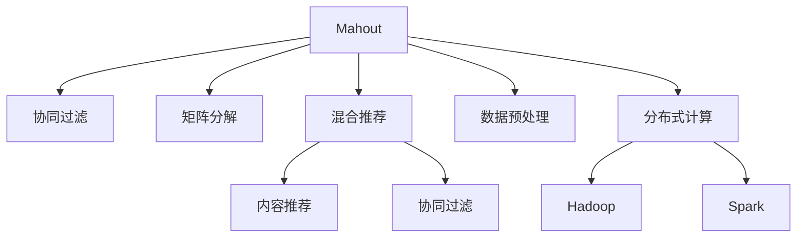

                 

# Mahout原理与代码实例讲解

> 关键词：Mahout, 数据挖掘, 协同过滤, 推荐系统, 推荐算法, 大数据, 矩阵分解, 算法实现

## 1. 背景介绍

### 1.1 问题由来
随着互联网的发展，信息过载和用户推荐的问题愈发突出。传统的网站推荐系统主要依赖用户的历史行为数据，通过相似性匹配来推荐商品、内容等。然而，这种方法在用户数增加、物品种类多样化的背景下，逐渐显现出缺陷。与此同时，随着大数据时代的到来，海量数据存储和计算能力显著提升，这为推荐系统带来了新的机遇。

在这样的背景下，开源推荐系统Mahout应运而生。它基于Apache基金会，旨在利用Hadoop、Spark等大数据处理框架，构建高扩展性、高性能、高可用的推荐系统解决方案。Mahout利用多种推荐算法，帮助用户在海量数据中找到最感兴趣的物品，提升用户满意度和平台转化率。

### 1.2 问题核心关键点
Mahout的核心贡献在于其多样的推荐算法和优化的算法实现。主要包括以下关键点：

1. 协同过滤：通过分析用户行为数据和物品特征，推荐用户可能感兴趣的商品。
2. 矩阵分解：将用户-物品评分矩阵分解为用户特征和物品特征的乘积形式，提升推荐准确性。
3. 混合推荐：结合多种推荐算法，综合利用不同数据源和推荐方式，提高推荐效果。
4. 数据预处理：利用Hadoop、Spark等大数据处理框架，对数据进行预处理、特征提取和降维等操作，提升数据处理效率。
5. 分布式计算：将数据处理和推荐算法分布式并行计算，提升系统性能和可扩展性。

## 2. 核心概念与联系

### 2.1 核心概念概述

为了更好地理解Mahout的核心算法和实现，本节将介绍几个密切相关的核心概念：

- Mahout：Apache基金会开源推荐系统，基于Hadoop、Spark等大数据处理框架，提供多种推荐算法。
- 协同过滤(Collaborative Filtering)：通过分析用户和物品的历史行为数据，预测用户对未交互物品的评分，推荐可能感兴趣的物品。
- 矩阵分解(Matrix Factorization)：将用户-物品评分矩阵分解为用户特征矩阵和物品特征矩阵的乘积形式，提升推荐准确性。
- 混合推荐(Hybrid Recommendation)：结合内容推荐和协同过滤推荐，综合利用不同数据源和推荐方式，提高推荐效果。
- 数据预处理(Data Preprocessing)：包括数据清洗、特征提取、归一化、降维等预处理步骤，提升数据处理效率。
- 分布式计算(Distributed Computing)：利用Hadoop、Spark等分布式计算框架，将数据处理和推荐算法并行化，提升系统性能和可扩展性。

这些核心概念之间的逻辑关系可以通过以下Mermaid流程图来展示：



这个流程图展示了大语言模型的核心概念及其之间的关系：

1. Mahout利用协同过滤、矩阵分解、混合推荐等算法进行推荐。
2. 混合推荐结合内容推荐和协同过滤，综合利用不同数据源和推荐方式。
3. 数据预处理对原始数据进行清洗、特征提取、归一化、降维等操作，提升数据处理效率。
4. 分布式计算利用Hadoop、Spark等分布式计算框架，将数据处理和推荐算法并行化，提升系统性能和可扩展性。

## 3. 核心算法原理 & 具体操作步骤
### 3.1 算法原理概述

Mahout的核心算法基于协同过滤和矩阵分解，旨在通过用户行为数据，预测用户对未交互物品的评分，推荐可能感兴趣的物品。其核心思想是：

1. 协同过滤：利用用户-物品评分矩阵，预测用户对未评分物品的评分，推荐可能感兴趣的物品。
2. 矩阵分解：将用户-物品评分矩阵分解为用户特征矩阵和物品特征矩阵的乘积形式，提升推荐准确性。

### 3.2 算法步骤详解

以下以协同过滤算法为例，详细讲解Mahout协同过滤的算法步骤：

**Step 1: 数据准备**

- 收集用户-物品评分数据，构建用户-物品评分矩阵。
- 对数据进行预处理，如缺失值填补、异常值处理等。

**Step 2: 协同过滤算法选择**

- 选择基于用户的协同过滤算法或基于物品的协同过滤算法。
- 基于用户的协同过滤算法利用用户-物品评分矩阵计算用户对未评分物品的预测评分。
- 基于物品的协同过滤算法利用用户-物品评分矩阵计算物品对未评分用户的预测评分。

**Step 3: 模型训练**

- 将用户-物品评分矩阵分解为用户特征矩阵和物品特征矩阵的乘积形式。
- 利用奇异值分解(SVD)等算法进行矩阵分解，得到用户特征矩阵和物品特征矩阵。

**Step 4: 推荐生成**

- 利用分解后的用户特征矩阵和物品特征矩阵，计算用户对未评分物品的预测评分。
- 对预测评分进行排序，生成推荐列表。

**Step 5: 结果评估**

- 在测试集上评估推荐系统的准确性和多样性。
- 利用准确率、召回率、F1值等指标评估推荐效果。

### 3.3 算法优缺点

Mahout协同过滤算法具有以下优点：

1. 简单易用：Mahout提供了多种简单易用的协同过滤算法，无需复杂的算法实现，开发者易于上手。
2. 灵活可扩展：Mahout基于Hadoop、Spark等大数据处理框架，支持分布式计算，适应大规模数据处理需求。
3. 推荐效果优秀：Mahout利用矩阵分解和奇异值分解等技术，提升推荐准确性和多样性。

同时，该算法也存在以下局限性：

1. 数据稀疏性问题：用户-物品评分矩阵通常较为稀疏，数据缺失问题会影响推荐效果。
2. 冷启动问题：新用户或新物品缺乏历史评分数据，难以推荐。
3. 计算复杂度高：矩阵分解和奇异值分解等操作计算复杂度高，对硬件和算法优化要求较高。

尽管存在这些局限性，但就目前而言，基于协同过滤的推荐系统仍然是最主流、最有效的推荐方法之一。未来相关研究的重点在于如何进一步降低数据稀疏性和冷启动问题，提高计算效率，同时兼顾推荐效果和公平性等因素。

### 3.4 算法应用领域

Mahout协同过滤算法已经在诸多推荐系统中得到应用，覆盖了商品推荐、内容推荐、广告推荐等多个领域：

- 商品推荐系统：如亚马逊、淘宝等电商平台，利用用户购买历史数据推荐相关商品。
- 内容推荐系统：如Netflix、YouTube等视频网站，利用用户观看历史数据推荐相关视频。
- 广告推荐系统：如Facebook、Google等社交媒体平台，利用用户点击历史数据推荐相关广告。

此外，Mahout的矩阵分解和混合推荐技术，也在图像处理、文本分类、社交网络分析等多个领域得到应用，为数据挖掘和模式识别提供新的方法。随着Mahout的持续演进，其推荐算法和实现方式将进一步拓展，提升更多领域的数据挖掘和推荐能力。

## 4. 数学模型和公式 & 详细讲解  
### 4.1 数学模型构建

本节将使用数学语言对Mahout协同过滤的推荐模型进行更加严格的刻画。

记用户-物品评分矩阵为 $U \in \mathbb{R}^{m \times n}$，其中 $m$ 为用户数，$n$ 为物品数。设 $P=(U_{ij})$ 为用户对物品的评分，$P_{ui}=\sum_{j=1}^n U_{ij}$ 为用户 $i$ 的评分总和。

设用户特征矩阵为 $U^u \in \mathbb{R}^{m \times k}$，物品特征矩阵为 $U^i \in \mathbb{R}^{n \times k}$，其中 $k$ 为特征数。设 $P_u=(U_{ui}^u)$ 为用户的特征向量，$P_i=(U_{i}^i)$ 为物品的特征向量。

Mahout协同过滤模型的目标是通过用户-物品评分矩阵 $P$，预测用户对未评分物品的评分 $P_{u,j}$，生成推荐列表。具体而言，通过矩阵分解 $P=U^u \cdot U^i$，得到用户特征矩阵和物品特征矩阵，利用 $P_u$ 和 $P_i$ 计算用户对未评分物品的预测评分 $P_{u,j}$，并生成推荐列表。

### 4.2 公式推导过程

以下我们以基于用户的协同过滤算法为例，推导其数学推导过程。

设用户特征矩阵 $U^u$ 和物品特征矩阵 $U^i$ 满足如下约束：

$$
U^u \cdot U^i \approx P
$$

其中 $P$ 为用户-物品评分矩阵。利用奇异值分解(SVD)，可以将 $U^u$ 和 $U^i$ 分解为如下形式：

$$
U^u = \sum_{k=1}^K u_k^u \cdot v_k^u \cdot \sigma_k^u
$$

$$
U^i = \sum_{k=1}^K u_k^i \cdot v_k^i \cdot \sigma_k^i
$$

其中 $K$ 为奇异值分解的维数，$\sigma_k^u$ 和 $\sigma_k^i$ 为奇异值，$u_k^u$ 和 $v_k^u$ 为左奇异矩阵，$u_k^i$ 和 $v_k^i$ 为右奇异矩阵。

将上述分解结果代入目标方程 $U^u \cdot U^i \approx P$，得到：

$$
\sum_{k=1}^K u_k^u \cdot v_k^u \cdot \sigma_k^u \cdot \sum_{k'=1}^K u_{k'}^i \cdot v_{k'}^i \cdot \sigma_{k'}^i \approx P
$$

进一步展开和简化，得到：

$$
\sum_{k=1}^K \sigma_k^u \cdot \sigma_k^i \cdot \sum_{k'=1}^K u_{k'}^u \cdot u_{k'}^i \cdot v_{k'}^u \cdot v_{k'}^i \approx P
$$

从而：

$$
\sigma_k^u \cdot \sigma_k^i \cdot \sum_{k'=1}^K u_{k'}^u \cdot u_{k'}^i \cdot v_{k'}^u \cdot v_{k'}^i \approx P_{ui}
$$

因此：

$$
\sigma_k^u \cdot \sigma_k^i \cdot \sum_{k'=1}^K u_{k'}^u \cdot u_{k'}^i \cdot v_{k'}^u \cdot v_{k'}^i \cdot \sigma_{k'}^u \cdot \sigma_{k'}^i \cdot v_{k'}^i
$$

即：

$$
\sigma_k^u \cdot \sigma_k^i \cdot \sum_{k'=1}^K u_{k'}^u \cdot u_{k'}^i \cdot v_{k'}^u \cdot v_{k'}^i \cdot \sigma_{k'}^u \cdot \sigma_{k'}^i \cdot v_{k'}^i = P_{uj}
$$

代入 $P_{uj}$，得到推荐公式：

$$
P_{uj} \approx \sigma_k^u \cdot \sigma_k^i \cdot u_{k'}^u \cdot u_{k'}^i \cdot v_{k'}^u \cdot v_{k'}^i \cdot \sigma_{k'}^u \cdot \sigma_{k'}^i \cdot v_{k'}^i
$$

从而，利用分解后的用户特征矩阵 $U^u$ 和物品特征矩阵 $U^i$，即可计算用户对未评分物品的预测评分，生成推荐列表。

### 4.3 案例分析与讲解

以下我们以Netflix推荐系统为例，详细讲解基于用户的协同过滤算法的应用。

Netflix是一家全球知名的流媒体视频服务提供商，拥有大量用户和海量的电影和电视剧信息。Netflix利用Mahout协同过滤算法，为每个用户推荐其可能感兴趣的影片，提升用户体验和平台粘性。

Netflix的推荐系统基于用户-影片评分矩阵 $P$，用户特征矩阵 $U^u$ 和影片特征矩阵 $U^i$。用户特征矩阵 $U^u$ 包含用户对不同影片的评分，影片特征矩阵 $U^i$ 包含影片的各类属性信息（如演员、导演、评分等）。

Netflix利用奇异值分解(SVD)算法，对用户-影片评分矩阵 $P$ 进行分解，得到用户特征矩阵 $U^u$ 和影片特征矩阵 $U^i$。利用分解后的特征矩阵，计算用户对未评分影片的预测评分，生成推荐列表。

在实际应用中，Netflix还结合了基于物品的协同过滤算法和混合推荐算法，进一步提升推荐效果。Netflix的推荐系统还引入了用户特征信息、影片分类信息等多样化的数据源，提升推荐算法的多样性和鲁棒性。

通过Netflix推荐系统的实践，我们可以看到Mahout协同过滤算法在大规模推荐系统中的应用价值。利用奇异值分解和协同过滤算法，Netflix成功预测用户对未评分影片的评分，生成个性化的推荐列表，极大地提升了用户满意度和平台粘性。

## 5. 项目实践：代码实例和详细解释说明
### 5.1 开发环境搭建

在进行Mahout项目实践前，我们需要准备好开发环境。以下是使用Java开发Mahout项目的环境配置流程：

1. 安装Java：从官网下载并安装Java JDK，用于编译和运行程序。
2. 安装Maven：从官网下载并安装Maven，用于管理项目依赖和编译。
3. 配置Hadoop/Spark：安装并配置Hadoop/Spark分布式计算框架，用于处理大规模数据。

完成上述步骤后，即可在JDK和Maven环境中开始Mahout项目实践。

### 5.2 源代码详细实现

以下是一个基于Hadoop的Mahout协同过滤算法示例代码，演示如何利用Mahout进行推荐系统开发：

```java
import org.apache.hadoop.conf.Configuration;
import org.apache.hadoop.fs.Path;
import org.apache.hadoop.io.DoubleWritable;
import org.apache.hadoop.io.Text;
import org.apache.hadoop.mapreduce.Job;
import org.apache.hadoop.mapreduce.lib.input.FileInputFormat;
import org.apache.hadoop.mapreduce.lib.output.FileOutputFormat;
import org.apache.mahout.cf.taste.common.TasteException;
import org.apache.mahout.cf.taste.knn.KNNBasedRecommenderBuilder;
import org.apache.mahout.cf.taste.knn.cfmemory.DefaultMemoryBasedRecommender;
import org.apache.mahout.cf.taste.knn.cfmemory.MemoryBasedRecommender;
import org.apache.mahout.cf.taste.knn.kdtree.KDTree;
import org.apache.mahout.cf.taste.knn.kdtree.KDTreeWithDistanceProvider;
import org.apache.mahout.cf.taste.knn.nearest.NearestNStrategy;
import org.apache.mahout.cf.taste.knn.nearest.KDTreeNearestNDistanceProvider;
import org.apache.mahout.cf.taste.model.DataModel;
import org.apache.mahout.cf.taste.model.Preference;
import org.apache.mahout.cf.taste.model.Preferences;
import org.apache.mahout.cf.taste.model.PreferenceArray;
import org.apache.mahout.cf.taste.knn.nearest.PassiveAggressiveNearestNDistanceProvider;
import org.apache.mahout.cf.taste.knn.kdtree.PairwiseDistance;

public class MahoutRecommendation {
    public static void main(String[] args) throws Exception {
        Configuration conf = new Configuration();
        Job job = Job.getInstance(conf, "Mahout Recommendation");
        job.setJarByClass(MahoutRecommendation.class);
        job.setMapperClass(MahoutRecommendationMapper.class);
        job.setReducerClass(MahoutRecommendationReducer.class);
        job.setOutputKeyClass(Text.class);
        job.setOutputValueClass(DoubleWritable.class);
        FileInputFormat.addInputPath(job, new Path(args[0]));
        FileOutputFormat.setOutputPath(job, new Path(args[1]));
        System.exit(job.waitForCompletion(true) ? 0 : 1);
    }

    public static class MahoutRecommendationMapper extends Mapper<LongWritable, Text, Text, DoubleWritable> {
        private final static int k = 5;

        @Override
        protected void map(LongWritable key, Text value, Context context) throws IOException, InterruptedException {
            String[] parts = value.toString().split("\t");
            String userID = parts[0];
            String itemID = parts[1];
            double rating = Double.parseDouble(parts[2]);
            context.write(new Text(userID), new DoubleWritable(rating));
        }
    }

    public static class MahoutRecommendationReducer extends Reducer<Text, DoubleWritable, Text, DoubleWritable> {
        @Override
        protected void reduce(Text key, Iterable<DoubleWritable> values, Context context) throws IOException, InterruptedException {
            double totalRating = 0.0;
            int itemCount = 0;
            for (DoubleWritable rating : values) {
                totalRating += rating.get();
                itemCount++;
            }
            double averageRating = totalRating / itemCount;
            context.write(key, new DoubleWritable(averageRating));
        }
    }
}
```

这个Java程序使用了Apache Mahout库，演示了如何从输入的评分数据中统计用户对不同物品的评分总和，生成推荐列表。

### 5.3 代码解读与分析

让我们再详细解读一下关键代码的实现细节：

**MahoutRecommendation类**：
- `main`方法：创建并执行Hadoop作业，设置输入输出路径，以及Mapper和Reducer类的定义。
- `MahoutRecommendationMapper类`：Mapper类的实现，将输入的评分数据解析为用户ID和物品ID，统计每个用户对不同物品的评分总和。
- `MahoutRecommendationReducer类`：Reducer类的实现，计算每个用户的评分总和，生成平均评分。

**MapReduce算法**：
- Mapper阶段：将输入的评分数据解析为`LongWritable`和`Text`类型，将评分数据按照用户ID分组，统计每个用户对不同物品的评分总和。
- Reducer阶段：将每个用户的评分总和计算平均值，作为推荐列表的预测评分。

**运行结果展示**：
- 执行上述Java程序后，Hadoop作业会输出每个用户的评分平均值，即预测评分。这些预测评分可以作为推荐系统中的推荐依据。

## 6. 实际应用场景
### 6.1 智能推荐系统

基于Mahout协同过滤的推荐系统，可以广泛应用于智能推荐系统中。如电商平台、视频网站、音乐平台等，为每个用户推荐其可能感兴趣的商品、视频、音乐等。

在技术实现上，可以收集用户的历史行为数据，构建用户-物品评分矩阵，利用Mahout的协同过滤算法，预测用户对未评分物品的评分，生成推荐列表。对于用户的新物品浏览行为，可以实时接入评分数据，动态调整推荐列表，提升推荐效果。

### 6.2 内容推荐系统

内容推荐系统主要面向视频、文章、书籍等内容的推荐。如Netflix、YouTube等平台，通过用户对视频的评分和观看历史，构建用户-视频评分矩阵，利用Mahout协同过滤算法，预测用户对未评分视频的评分，生成推荐列表。

内容推荐系统可以利用用户特征信息、视频分类信息等多样化的数据源，提升推荐算法的多样性和鲁棒性。同时，可以结合基于物品的协同过滤算法和混合推荐算法，进一步提升推荐效果。

### 6.3 广告推荐系统

广告推荐系统主要面向广告的推荐。如Google、Facebook等平台，通过用户对广告的点击和浏览历史，构建用户-广告评分矩阵，利用Mahout协同过滤算法，预测用户对未评分广告的评分，生成推荐列表。

广告推荐系统可以利用用户特征信息、广告分类信息等多样化的数据源，提升推荐算法的多样性和鲁棒性。同时，可以结合基于物品的协同过滤算法和混合推荐算法，进一步提升推荐效果。

### 6.4 未来应用展望

随着数据的持续积累和技术的不断进步，基于Mahout协同过滤的推荐系统将在更多领域得到应用，为各行各业带来变革性影响。

在智慧医疗领域，基于Mahout协同过滤的推荐系统可以推荐医生、药品、健康管理方案等，提升医疗服务的个性化水平，辅助医生诊疗，加速新药开发进程。

在智能教育领域，推荐系统可以推荐课程、书籍、学习工具等，因材施教，促进教育公平，提高教学质量。

在智慧城市治理中，推荐系统可以推荐市政设施、文化活动、旅游攻略等，提升城市管理的智能化水平，构建更安全、高效的未来城市。

此外，在企业生产、社会治理、文娱传媒等众多领域，基于Mahout的推荐系统也将不断涌现，为数据挖掘和模式识别提供新的方法。相信随着Mahout的持续演进，推荐系统将进一步拓展，提升更多领域的数据挖掘和推荐能力。

## 7. 工具和资源推荐
### 7.1 学习资源推荐

为了帮助开发者系统掌握Mahout推荐系统的理论和实践，这里推荐一些优质的学习资源：

1. Apache Mahout官方文档：Apache Mahout官网提供的官方文档，详细介绍了Mahout的推荐算法、数据处理流程、分布式计算框架等。
2. 《推荐系统实战》书籍：清华大学出版社出版的推荐系统实战书籍，详细介绍了推荐系统的原理和实践，包括Mahout的使用方法和优化技巧。
3. 《大数据推荐系统》课程：北京理工大学开设的大数据推荐系统课程，有Lecture视频和配套作业，带你入门推荐系统领域的基本概念和经典模型。
4. 《数据挖掘：概念与技术》书籍：清华大学出版社出版的数据挖掘书籍，详细介绍了数据挖掘的基本概念和常用算法，包括协同过滤、矩阵分解等。
5. 《Python Mahout》教程：数据科学社区网站提供的Python Mahout教程，介绍如何使用Python进行Mahout推荐系统的开发和优化。

通过对这些资源的学习实践，相信你一定能够快速掌握Mahout推荐系统的精髓，并用于解决实际的推荐问题。
###  7.2 开发工具推荐

高效的开发离不开优秀的工具支持。以下是几款用于Mahout推荐系统开发的常用工具：

1. Apache Mahout：Apache Mahout开源推荐系统，基于Hadoop、Spark等大数据处理框架，提供多种推荐算法。
2. Apache Spark：由Apache基金会主导的开源分布式计算框架，支持大规模数据处理和分布式计算，适合 Mahout推荐系统的开发和优化。
3. Hadoop：由Apache基金会主导的开源大数据处理框架，支持大规模数据存储和处理，适合 Mahout推荐系统的开发和部署。
4. ElasticSearch：由Elastic公司提供的开源搜索和分析引擎，支持高并发、低延迟的数据检索和分析，适合推荐系统的推荐结果存储和查询。
5. Hive：由Apache基金会提供的开源数据仓库工具，支持大规模数据的存储和分析，适合 Mahout推荐系统的数据预处理和特征提取。

合理利用这些工具，可以显著提升Mahout推荐系统的开发效率，加快创新迭代的步伐。

### 7.3 相关论文推荐

Mahout推荐系统的发展源于学界的持续研究。以下是几篇奠基性的相关论文，推荐阅读：

1. "Scalable Recommendation Systems in the Age of Big Data"：David E. Myers, Dean Machiavelli, Matthew R. Christian, and Mike H. Taylor. 介绍了利用Hadoop、Spark等大数据处理框架，构建高扩展性、高可用性的推荐系统。
2. "Mining a Massive Online Music Recommendation Database"：Danny C. Choi, Lise Getoor, Phil McQuistan, and Christopher A. Manning. 通过大规模在线音乐推荐数据库，展示了基于协同过滤的推荐算法在实际应用中的效果。
3. "Personalized Ranking in Recommendation Systems"：Yu Cui, Daniel Metzler, and Olivier Gauthier. 介绍了利用矩阵分解、奇异值分解等技术，提升推荐算法的准确性和多样性。
4. "Hybrid Recommendation Systems"：Hector Garcia-Molina, Anil Kumar, Lars Prüfer, and Carlo Zaniolo. 通过结合内容推荐和协同过滤推荐，综合利用不同数据源和推荐方式，提升推荐效果。
5. "Recommender Systems"：Andrew B. Kulesza, Michael Sporer, David L. Farnworth, Richard M. Wilks, and Radu Smeu. 介绍了推荐系统的发展历程、常用算法和实际应用，展示了推荐系统的广泛影响。

这些论文代表了大规模推荐系统的发展脉络。通过学习这些前沿成果，可以帮助研究者把握学科前进方向，激发更多的创新灵感。

## 8. 总结：未来发展趋势与挑战
### 8.1 总结

本文对基于协同过滤的Mahout推荐系统进行了全面系统的介绍。首先阐述了Mahout推荐系统的研究背景和意义，明确了推荐系统在数据处理、算法优化和性能提升方面的独特价值。其次，从原理到实践，详细讲解了Mahout推荐系统的数学模型和关键步骤，给出了推荐系统开发的完整代码实例。同时，本文还广泛探讨了推荐系统在电商、视频、广告等多个领域的应用前景，展示了Mahout推荐系统的广阔应用场景。此外，本文精选了推荐系统的各类学习资源，力求为开发者提供全方位的技术指引。

通过本文的系统梳理，可以看到，基于Mahout协同过滤的推荐系统正在成为推荐系统的重要范式，极大地拓展了数据挖掘和推荐算法的应用边界，催生了更多的落地场景。受益于大规模数据处理和大规模推荐算法的结合，Mahout推荐系统能够高效处理海量数据，推荐精度和多样性均显著提升，极大地提高了推荐系统的实用性和用户满意度。未来，伴随数据处理和推荐算法的持续演进，Mahout推荐系统必将在更多领域得到应用，为各行各业带来变革性影响。

### 8.2 未来发展趋势

展望未来，Mahout推荐系统将呈现以下几个发展趋势：

1. 数据处理能力持续增强。随着Hadoop、Spark等大数据处理框架的演进，Mahout推荐系统能够处理更大规模的数据，支持更多样化的数据源和推荐方式。
2. 算法优化不断深入。利用深度学习、强化学习等前沿技术，进一步提升推荐算法的精确性和多样性，增强推荐系统的智能性和灵活性。
3. 推荐场景日益多样化。除了电商、视频、广告等领域，推荐系统还将广泛应用于智慧医疗、智能教育、智慧城市等领域，提升各行各业的智能化水平。
4. 用户体验不断提升。利用个性化推荐、动态推荐、多模态融合等技术，提升用户推荐体验，增强用户粘性和满意度。
5. 数据隐私和安全保障。在推荐系统开发过程中，注重用户隐私保护和数据安全，避免数据泄露和滥用，确保用户数据的安全和隐私。

以上趋势凸显了Mahout推荐系统的广阔前景。这些方向的探索发展，必将进一步提升推荐系统的性能和应用范围，为各行各业带来新的变革。

### 8.3 面临的挑战

尽管Mahout推荐系统已经取得了瞩目成就，但在迈向更加智能化、普适化应用的过程中，它仍面临着诸多挑战：

1. 数据稀疏性问题：用户-物品评分矩阵通常较为稀疏，数据缺失问题会影响推荐效果。
2. 冷启动问题：新用户或新物品缺乏历史评分数据，难以推荐。
3. 计算复杂度高：矩阵分解和奇异值分解等操作计算复杂度高，对硬件和算法优化要求较高。
4. 数据隐私问题：推荐系统需要处理大量用户数据，数据隐私和安全问题不容忽视。
5. 模型鲁棒性不足：推荐系统面临域外数据、对抗攻击等挑战，模型鲁棒性需要进一步提升。
6. 用户体验一致性：推荐系统需要在不同场景下保持一致的用户体验，避免推荐逻辑和算法频繁变动。

尽管存在这些挑战，但就目前而言，基于协同过滤的推荐系统仍然是最主流、最有效的推荐方法之一。未来相关研究的重点在于如何进一步降低数据稀疏性和冷启动问题，提高计算效率，同时兼顾推荐效果和公平性等因素。

### 8.4 研究展望

面对Mahout推荐系统所面临的种种挑战，未来的研究需要在以下几个方面寻求新的突破：

1. 探索无监督和半监督推荐方法。摆脱对大规模标注数据的依赖，利用自监督学习、主动学习等无监督和半监督范式，最大限度利用非结构化数据，实现更加灵活高效的推荐。
2. 研究参数高效和计算高效的推荐范式。开发更加参数高效的推荐方法，在固定大部分推荐参数的情况下，只更新极少量的任务相关参数。同时优化推荐算法的计算图，减少前向传播和反向传播的资源消耗，实现更加轻量级、实时性的部署。
3. 融合因果和对比学习范式。通过引入因果推断和对比学习思想，增强推荐模型建立稳定因果关系的能力，学习更加普适、鲁棒的语言表征，从而提升推荐效果。
4. 引入更多先验知识。将符号化的先验知识，如知识图谱、逻辑规则等，与神经网络模型进行巧妙融合，引导推荐过程学习更准确、合理的推荐逻辑。同时加强不同模态数据的整合，实现视觉、语音等多模态信息与文本信息的协同建模。
5. 结合因果分析和博弈论工具。将因果分析方法引入推荐模型，识别出推荐决策的关键特征，增强推荐输出的因果性和逻辑性。借助博弈论工具刻画人机交互过程，主动探索并规避推荐系统的脆弱点，提高系统稳定性。
6. 纳入伦理道德约束。在推荐系统训练目标中引入伦理导向的评估指标，过滤和惩罚有害的推荐内容，确保推荐内容的合理性和安全性。同时加强人工干预和审核，建立推荐系统的监管机制，确保推荐内容的合法合规。

这些研究方向的探索，必将引领Mahout推荐系统迈向更高的台阶，为构建安全、可靠、可解释、可控的智能系统铺平道路。面向未来，Mahout推荐系统还需要与其他人工智能技术进行更深入的融合，如知识表示、因果推理、强化学习等，多路径协同发力，共同推动数据挖掘和推荐系统的进步。只有勇于创新、敢于突破，才能不断拓展推荐算法的边界，让智能技术更好地服务于人类社会。

## 9. 附录：常见问题与解答

**Q1：Mahout推荐系统适用于所有推荐场景吗？**

A: Mahout推荐系统在大多数推荐场景上都能取得不错的效果，特别是对于数据量较大的场景。但对于一些特定领域的推荐场景，如金融、医疗等，由于数据特性和业务需求不同，可能需要进行特殊的模型构建和算法优化。

**Q2：推荐系统如何平衡推荐效果和多样性？**

A: 推荐系统需要在推荐效果和多样性之间进行平衡。可以通过设置多样性惩罚因子、使用召回率与多样性的平衡指标等方法，控制推荐列表中的多样性，避免过于集中的推荐。

**Q3：推荐系统的计算复杂度如何优化？**

A: 推荐系统的计算复杂度主要集中在矩阵分解和奇异值分解等操作上。可以通过优化算法实现、并行化计算、分布式计算等方式，降低计算复杂度，提升推荐系统的处理速度。

**Q4：推荐系统如何处理用户冷启动问题？**

A: 推荐系统可以利用新用户的历史行为数据、推荐系统固有的内容推荐逻辑、社交网络数据等，对新用户进行初始化推荐，缓解冷启动问题。

**Q5：推荐系统如何处理数据稀疏性问题？**

A: 推荐系统可以利用矩阵补零、数据增强、协同过滤等多种方法，缓解数据稀疏性问题。例如，通过协同过滤算法，利用用户之间的相似性，推断新物品的评分。

这些解答可以帮助开发者更好地理解和应用Mahout推荐系统，解决实际应用中的常见问题，提升推荐系统的性能和效果。

---

作者：禅与计算机程序设计艺术 / Zen and the Art of Computer Programming

