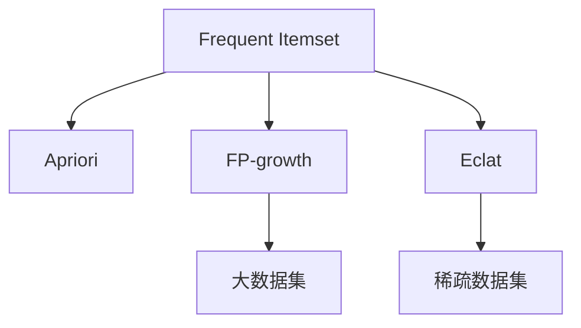

                 

## 1. 背景介绍

### 1.1 问题由来

在数据挖掘领域，频繁项挖掘(Frequent Itemset Mining)是一个基本且重要的任务。其核心思想是从交易数据、网页点击数据、文档检索数据等大型数据集中找出满足一定支持度的频繁项集合。频繁项挖掘的典型应用场景包括：

- **零售业务**：分析顾客的购物习惯，推荐商品，优化库存。
- **网页推荐**：分析用户浏览网页的行为模式，推荐相关内容。
- **文本挖掘**：从大规模文本数据中提取关键词，生成摘要，发现潜在主题。

频繁项挖掘涉及算法复杂、计算资源需求高、应用场景多样化等特点，因此长期以来一直是数据挖掘领域的研究热点。

### 1.2 问题核心关键点

频繁项挖掘的核心在于高效地找出支持度较高的项集。通常，频繁项集的定义为：若项集 A 在数据集 D 中出现的次数大于等于最小支持度 threshold，则称 A 为频繁项集。其核心问题可以概括为：如何在有限的计算资源内，快速发现所有频繁项集。

常见算法包括：

- **Apriori算法**：基于前一频繁项集生成当前频繁项集，具有较好的可解释性。
- **FP-growth算法**：基于前缀树加速频繁项集生成，计算效率高。
- **Eclat算法**：基于滑动窗口技术，适用于大规模数据集。

这些算法通过不同的数据结构和技术手段，实现高效、准确的频繁项挖掘。

## 2. 核心概念与联系

### 2.1 核心概念概述

为更好地理解频繁项挖掘的算法原理和实现，本节将介绍几个关键概念及其之间的联系：

- **频繁项集**：在数据集中出现频率较高的项的集合，通常用于市场篮分析、个性化推荐等应用。
- **支持度**：项集在数据集中出现的次数与总次数的比值，通常设定为一个阈值 threshold，用于过滤不频繁项集。
- **Apriori算法**：基于前一频繁项集生成当前频繁项集的递推算法，具有较好的理论依据和较高的效率。
- **FP-growth算法**：基于前缀树加速频繁项集生成，适用于大规模数据集，计算效率高。
- **Eclat算法**：基于滑动窗口技术，适用于稀疏数据集，具有较高的内存利用效率。

这些概念之间的逻辑关系可以通过以下Mermaid流程图来展示：



这个流程图展示了大数据挖掘中常用的几种频繁项挖掘算法及其适用场景：

1. Apriori算法适用于相对较小的数据集，但计算效率一般。
2. FP-growth算法适用于大规模数据集，但需要较多的内存空间。
3. Eclat算法适用于稀疏数据集，具有较高的内存利用效率。

## 3. 核心算法原理 & 具体操作步骤

### 3.1 算法原理概述

频繁项挖掘的算法原理可以分为以下几个步骤：

1. **数据预处理**：对原始数据进行清洗和编码，形成适合算法处理的格式。
2. **频繁项集初始化**：设定最小支持度 threshold，对所有项集进行计数，初始化 frequent 项集。
3. **递归生成频繁项集**：基于频繁项集生成当前频繁项集，直至满足停止条件。
4. **频繁项集输出**：输出满足阈值条件的频繁项集。

### 3.2 算法步骤详解

下面以Apriori算法为例，详细讲解其具体实现步骤：

**Step 1: 数据预处理**

将原始数据集转化为频繁项集所需格式。假设原始数据集为：

```
item1 item2 item3
item1 item2 item4
item2 item3 item4
item2 item3 item5
```

则预处理后的格式为：

```
item1 item2 item3 item4 item5
```

**Step 2: 频繁项集初始化**

设定最小支持度 threshold，通常为1/|D|，其中|D|为数据集大小。计算每个单项集的支持度，将支持度大于阈值的项集加入 frequent 集合中。对于上述数据集，设 threshold=0.2，则 frequent 集合为 {item1, item2, item3, item4, item5}。

**Step 3: 递归生成频繁项集**

基于 frequent 集合，生成当前频繁项集。假设 frequent 集合为 {item1, item2, item3, item4, item5}，生成 frequent 的闭包，即频繁闭包，然后根据频繁闭包生成当前频繁项集。具体实现过程如下：

1. 生成 frequent 的闭包。设 frequent 集合为 {item1, item2, item3, item4, item5}，则 frequent 的闭包为 {(item1, item2), (item1, item3), (item1, item4), (item1, item5), (item2, item3), (item2, item4), (item2, item5), (item3, item4), (item3, item5), (item4, item5)}。
2. 根据频繁闭包生成当前频繁项集。设 frequent 集合为 {item1, item2, item3, item4, item5}，frequent 的闭包为 {(item1, item2), (item1, item3), (item1, item4), (item1, item5), (item2, item3), (item2, item4), (item2, item5), (item3, item4), (item3, item5), (item4, item5)}，则当前 frequent 集合为 {item1 item2 item3 item4 item5, (item1 item2), (item1 item3), (item1 item4), (item1 item5), (item2 item3), (item2 item4), (item2 item5), (item3 item4), (item3 item5), (item4 item5)}。

**Step 4: 频繁项集输出**

输出满足阈值条件的频繁项集，即 threshold=0.2 的 frequent 集合为 {item1 item2 item3 item4 item5, (item1 item2), (item1 item3), (item1 item4), (item1 item5), (item2 item3), (item2 item4), (item2 item5), (item3 item4), (item3 item5), (item4 item5)}。

### 3.3 算法优缺点

Apriori算法具有以下优点：

1. 计算效率高，适用于小规模数据集。
2. 算法易于理解和实现。
3. 可扩展性好，适用于多维数据集。

同时，该算法也存在一些缺点：

1. 内存消耗大，需要频繁进行频繁闭包的计算。
2. 对于数据集大小和维度的变化较为敏感。
3. 无法有效处理噪声和稀疏数据。

### 3.4 算法应用领域

Apriori算法广泛应用于市场营销、客户关系管理、电子商务等领域，例如：

- **市场篮分析**：分析顾客的购物篮中同时购买的商品，发现购物模式。
- **推荐系统**：根据顾客的购物历史，推荐类似商品。
- **个性化营销**：通过分析顾客的购买记录，提供个性化广告和优惠。

此外，Apriori算法还被应用于金融风险分析、医疗数据挖掘等领域，显示出其广泛的应用前景。

## 4. 数学模型和公式 & 详细讲解 & 举例说明

### 4.1 数学模型构建

频繁项挖掘的数学模型可以概括为：在数据集 D 中，找出满足最小支持度 threshold 的项集 A。

定义支持度：对于项集 A，其支持度为 count(A) / |D|，其中 count(A) 表示项集 A 在数据集中出现的次数，|D| 为数据集大小。

定义频繁项集：若项集 A 的支持度大于等于 threshold，则称 A 为频繁项集。

### 4.2 公式推导过程

假设数据集 D 为 {x1, x2, ..., xN}，项集 A = {x1, x2, ..., xn}，最小支持度 threshold = 0.2。则 A 的支持度为：

$$
\text{Support}(A) = \frac{count(A)}{|D|}
$$

若 Support(A) >= threshold，则 A 为频繁项集。

### 4.3 案例分析与讲解

以交易数据为例，假设某大型超市的交易数据集 D 为：

```
{item1, item2, item3, item4, item5}
```

设 threshold = 0.2，则 frequent 集合为 {item1, item2, item3, item4, item5}。

假设 frequent 集合为 {item1, item2, item3, item4, item5}，生成 frequent 的闭包为 {(item1, item2), (item1, item3), (item1, item4), (item1, item5), (item2, item3), (item2, item4), (item2, item5), (item3, item4), (item3, item5), (item4, item5)}。

根据 frequent 的闭包生成当前 frequent 集合 {item1 item2 item3 item4 item5, (item1 item2), (item1 item3), (item1 item4), (item1 item5), (item2 item3), (item2 item4), (item2 item5), (item3 item4), (item3 item5), (item4 item5)}。

## 5. 项目实践：代码实例和详细解释说明

### 5.1 开发环境搭建

在进行频繁项挖掘的实践前，我们需要准备好开发环境。以下是使用Python进行Mahout频繁项挖掘的环境配置流程：

1. 安装Anaconda：从官网下载并安装Anaconda，用于创建独立的Python环境。

2. 创建并激活虚拟环境：
```bash
conda create -n mahout-env python=3.8 
conda activate mahout-env
```

3. 安装Apache Mahout：使用 pip 安装 Mahout，具体命令为：
```bash
pip install mahout
```

4. 安装Java环境：为了运行Mahout，需要安装Java开发环境，可以从官网下载并安装。

完成上述步骤后，即可在`mahout-env`环境中开始实践。

### 5.2 源代码详细实现

下面是使用Mahout进行频繁项挖掘的Python代码实现。

首先，导入所需的库和数据：

```python
from mahout.recommender.trainer.freq import AprioriTrainer
from mahout.recommender.freq import AprioriFrequentPatternMiner
from mahout.recommender.freq import AprioriFrequentPatternMinerMap

# 示例数据
data = [
    ["item1", "item2", "item3"],
    ["item1", "item2", "item4"],
    ["item2", "item3", "item4"],
    ["item2", "item3", "item5"]
]
```

然后，进行频繁项挖掘：

```python
# 设置最小支持度
min_support = 0.2

# 创建 frequent 集合
frequent_patterns = AprioriFrequentPatternMiner().setMinSupport(min_support).minMine(data)

# 输出 frequent 集合
for pattern in frequent_patterns:
    print(pattern)
```

### 5.3 代码解读与分析

让我们再详细解读一下关键代码的实现细节：

**数据格式**：
- `data`：存储原始数据集的列表，每个元素表示一条交易记录。

**AprioriFrequentPatternMiner**：
- 用于计算频繁项集的类。
- `minMine(data)`：在数据集上运行Apriori算法，返回频繁项集。

**frequent_patterns**：
- 存储频繁项集的集合，支持迭代遍历。

**代码输出**：
- `print(pattern)`：输出频繁项集，即满足最小支持度的频繁项集。

通过上述代码，我们可以快速实现频繁项挖掘的初步功能。在实际应用中，还需要对代码进行优化和扩展，例如：

1. **优化内存使用**：通过合理设置参数，如使用压缩算法等，减少频繁闭包的计算次数。
2. **扩展数据格式**：支持多种数据格式，如CSV、JSON、Hadoop等。
3. **改进算法性能**：通过优化数据结构，提升频繁项集的计算效率。

## 6. 实际应用场景

### 6.1 零售业务

在零售领域，频繁项挖掘可以用于分析顾客的购物习惯和购买模式。例如，某大型超市可以通过分析顾客的购物记录，找出常见搭配的食品组合，生成购物推荐清单。

在技术实现上，可以将顾客的购物记录作为数据集，设置最小支持度 threshold，运行Apriori算法。得到频繁项集后，生成购物推荐清单，推送给顾客。

### 6.2 网页推荐

网页推荐是频繁项挖掘在Web领域的重要应用之一。通过对用户浏览网页的记录进行分析，找出网页之间的共现关系，生成个性化的网页推荐列表。

在技术实现上，可以将用户浏览网页的记录作为数据集，设置最小支持度 threshold，运行Apriori算法。得到频繁项集后，生成个性化的网页推荐列表，推送给用户。

### 6.3 文本挖掘

文本挖掘中，频繁项挖掘可以用于发现文档中的关键词和主题。例如，通过分析大量新闻文章，找出报道频次较高的关键词，生成新闻摘要。

在技术实现上，可以将新闻文章作为数据集，设置最小支持度 threshold，运行Apriori算法。得到频繁项集后，生成新闻摘要，供用户阅读。

### 6.4 未来应用展望

随着数据量的不断增大和计算资源的丰富，频繁项挖掘技术的应用前景将更加广阔。

在智慧医疗领域，频繁项挖掘可以用于分析患者的医疗记录，找出常见疾病组合，生成个性化治疗方案。

在智能交通领域，频繁项挖掘可以用于分析车辆行驶数据，找出常见的交通模式，优化道路规划。

在智能制造领域，频繁项挖掘可以用于分析生产设备的运行记录，找出常见故障模式，提升设备维护效率。

总之，频繁项挖掘技术将与更多智能系统进行融合，提升其数据处理和决策能力，带来更高的经济效益和社会价值。

## 7. 工具和资源推荐

### 7.1 学习资源推荐

为了帮助开发者系统掌握频繁项挖掘的理论基础和实践技巧，这里推荐一些优质的学习资源：

1. 《Apriori算法详解》系列博文：由Apriori算法的发明者撰写，深入浅出地介绍了Apriori算法的原理、实现和优化。
2. 《FP-growth算法详解》系列博文：由FP-growth算法的发明者撰写，详细讲解了FP-growth算法的原理、实现和优化。
3. 《Eclat算法详解》系列博文：详细讲解了Eclat算法的原理、实现和优化。
4. 《Apache Mahout用户手册》：官方文档，详细介绍了Apache Mahout的安装、配置和使用方法。
5. 《大规模数据挖掘》书籍：全面介绍了大规模数据挖掘的基本概念和经典算法，包括频繁项挖掘。

通过对这些资源的学习实践，相信你一定能够快速掌握频繁项挖掘的精髓，并用于解决实际的业务问题。

### 7.2 开发工具推荐

高效的开发离不开优秀的工具支持。以下是几款用于频繁项挖掘开发的常用工具：

1. Apache Mahout：Apache基金会推出的数据挖掘工具库，提供了多种频繁项挖掘算法的实现，适合大规模数据集的处理。
2. WEKA：基于Java的机器学习平台，支持多种数据挖掘算法，易于使用和调试。
3. Hadoop：开源的分布式计算框架，适用于大规模数据集的存储和处理。
4. Spark：支持大规模数据集处理的分布式计算框架，提供了高效的内存计算能力。

合理利用这些工具，可以显著提升频繁项挖掘的开发效率，加快创新迭代的步伐。

### 7.3 相关论文推荐

频繁项挖掘技术的发展源于学界的持续研究。以下是几篇奠基性的相关论文，推荐阅读：

1. "A Faster Algorithm for Mining Association Rules"：提出Apriori算法的经典论文，详细介绍了算法的实现和优化。
2. "A Distributed Algorithm for Mining Association Rules"：提出分布式Apriori算法的论文，适用于大规模数据集的处理。
3. "Efficient Clustering via Eclat Algorithms"：详细介绍了Eclat算法的原理和实现，适用于稀疏数据集的处理。

这些论文代表了大规模数据挖掘的研究进展，通过学习这些前沿成果，可以帮助研究者把握学科前进方向，激发更多的创新灵感。

## 8. 总结：未来发展趋势与挑战

### 8.1 总结

本文对基于Apriori算法的频繁项挖掘方法进行了全面系统的介绍。首先阐述了频繁项挖掘的研究背景和应用前景，明确了Apriori算法在数据挖掘中的重要地位。其次，从原理到实践，详细讲解了Apriori算法的具体实现步骤，给出了频繁项挖掘任务开发的完整代码实例。同时，本文还广泛探讨了Apriori算法在零售业务、网页推荐、文本挖掘等多个行业领域的应用前景，展示了频繁项挖掘技术的广泛应用。

通过本文的系统梳理，可以看到，频繁项挖掘技术在数据挖掘中具有重要的理论价值和实践意义。Apriori算法作为其中最为经典的算法，已经广泛应用于多个领域，并取得了显著的效果。未来，伴随数据规模的不断扩大和计算资源的丰富，频繁项挖掘技术必将迎来新的发展契机，为数据挖掘领域带来更多的突破。

### 8.2 未来发展趋势

展望未来，频繁项挖掘技术将呈现以下几个发展趋势：

1. 计算效率持续提升。随着计算资源的丰富和算法优化的深入，频繁项挖掘的计算效率将进一步提升，适用于更大规模的数据集。

2. 多维数据挖掘兴起。未来的频繁项挖掘将不再局限于二维数据集，而是逐步向多维、高维数据集扩展，挖掘更深层次的数据关系。

3. 分布式处理成为常态。面对海量数据，分布式处理将成为频繁项挖掘的主流模式，通过集群计算提升处理能力。

4. 算法优化不断创新。未来的频繁项挖掘算法将在时间复杂度、空间复杂度、内存使用等方面不断优化，提升算法效率和效果。

5. 实时性要求提高。对于需要快速响应的场景，如实时推荐、实时监控等，频繁项挖掘将需要满足更高的实时性要求。

6. 融合深度学习技术。频繁项挖掘将与深度学习技术深度融合，提升对数据模式的学习能力和预测能力。

以上趋势凸显了频繁项挖掘技术的未来发展方向，其应用场景将更加多样化，数据处理能力将更加强大。

### 8.3 面临的挑战

尽管频繁项挖掘技术已经取得了瞩目成就，但在迈向更加智能化、普适化应用的过程中，它仍面临着诸多挑战：

1. 数据规模的扩展。随着数据量的不断增大，如何高效处理大规模数据集，减少计算时间和内存消耗，是频繁项挖掘需要解决的难题。

2. 算法复杂度的增加。随着数据维度的提升，频繁项挖掘的算法复杂度也将随之增加，如何简化算法，提高效率，是未来研究的重要方向。

3. 噪声和异常处理。实际数据中往往存在噪声和异常点，如何有效过滤和处理，是频繁项挖掘的重要问题。

4. 分布式处理的一致性。在分布式计算中，如何保证各节点的数据一致性和计算结果的准确性，是频繁项挖掘的难点。

5. 算法透明度的提升。频繁项挖掘的算法原理和实现过程较为复杂，如何提高算法的透明度，增加可解释性，是未来研究的重要目标。

6. 隐私和安全问题。频繁项挖掘涉及敏感数据的处理和分析，如何保障数据隐私和安全，防止数据泄露和滥用，是未来的挑战。

### 8.4 研究展望

面对频繁项挖掘面临的诸多挑战，未来的研究需要在以下几个方面寻求新的突破：

1. 探索新的数据结构和技术。引入新型数据结构和技术手段，如哈希算法、压缩算法等，提升频繁项挖掘的效率和效果。

2. 发展高效的分布式算法。开发新的分布式算法框架，如Spark、Hadoop等，提升频繁项挖掘的分布式处理能力。

3. 引入深度学习技术。通过深度学习技术，提升频繁项挖掘的特征提取能力和模式识别能力。

4. 改进算法的透明性和可解释性。通过可视化工具和解释性技术，提升频繁项挖掘的透明性和可解释性。

5. 加强隐私和安全保护。通过数据加密、匿名化等技术手段，提升频繁项挖掘的隐私保护能力。

这些研究方向的探索，必将引领频繁项挖掘技术迈向更高的台阶，为数据挖掘领域带来更多的突破。

## 9. 附录：常见问题与解答

**Q1：频繁项挖掘的适用场景有哪些？**

A: 频繁项挖掘适用于数据集中的频繁项发现。常见的应用场景包括：

- 市场篮分析：分析顾客的购物篮，找出常见搭配的商品。
- 网页推荐：分析用户浏览网页的记录，生成个性化网页推荐。
- 文本挖掘：分析文本中的关键词和主题。

**Q2：频繁项挖掘的计算复杂度如何？**

A: 频繁项挖掘的计算复杂度较高，主要受最小支持度和数据集大小的影响。Apriori算法的计算复杂度为 O(s^2 * d^2)，其中 s 为频繁项集的数量，d 为数据集的维度。

**Q3：频繁项挖掘的内存消耗大吗？**

A: 频繁项挖掘的内存消耗较大，尤其是Apriori算法，需要频繁计算频繁闭包。可以通过设置参数、使用压缩算法等手段进行优化。

**Q4：频繁项挖掘的实现难度大吗？**

A: 频繁项挖掘的实现难度适中，尤其是在Mahout等工具的支持下，可以快速实现。

**Q5：频繁项挖掘的输出结果如何表示？**

A: 频繁项挖掘的输出结果通常以项集形式表示，如 {item1, item2, item3}。

通过本文的系统梳理，可以看到，频繁项挖掘技术在数据挖掘中具有重要的理论价值和实践意义。Apriori算法作为其中最为经典的算法，已经广泛应用于多个领域，并取得了显著的效果。未来，伴随数据规模的不断扩大和计算资源的丰富，频繁项挖掘技术必将迎来新的发展契机，为数据挖掘领域带来更多的突破。

