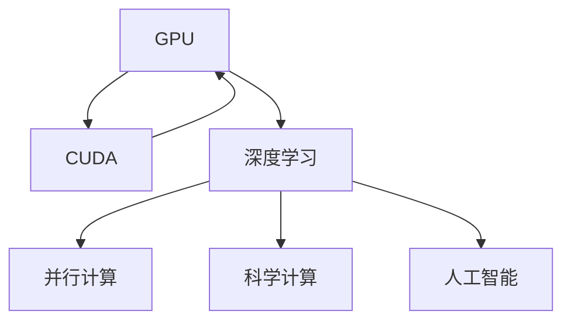

                 

# NVIDIA与GPU的发明

> 关键词：GPU, CUDA, 深度学习, 计算加速, 科学计算, 人工智能

## 1. 背景介绍

### 1.1 问题由来

在过去的几十年里，计算机技术迅猛发展，而其中最为显著的进步之一，便是由NVIDIA公司发明的图形处理器（GPU）。GPU最初被设计用于图形渲染，但很快就被发现其强大的并行计算能力可以显著提升各种科学计算和深度学习的效率。

### 1.2 问题核心关键点

GPU的发明，从根本上改变了计算机计算的方式，推动了深度学习技术的快速发展。其核心关键点在于：

1. 并行计算：GPU能够同时处理多个计算任务，大大提升了数据并行处理能力。
2. 加速深度学习：通过大量浮点运算单元，GPU能够在短时间内处理大量神经网络数据，显著加速深度学习模型的训练和推理。
3. 通用计算：GPU除了图形处理，还可以用于通用计算任务，如科学计算、数据处理等。
4. 硬件与软件的结合：NVIDIA推出的CUDA平台，将GPU的计算能力与编程语言无缝结合，极大地简化了深度学习的开发和部署。

## 2. 核心概念与联系

### 2.1 核心概念概述

为更好地理解NVIDIA与GPU的发明，本节将介绍几个密切相关的核心概念：

- **图形处理器（GPU）**：一种专为加速图形渲染和计算密集型任务而设计的硬件，拥有大量可并行工作的计算单元。
- **CUDA**：由NVIDIA开发的并行计算平台和编程模型，提供了一组库和工具，用于访问和优化GPU的计算能力。
- **深度学习**：基于神经网络理论，通过大量的数据和计算，使计算机具有类似人类的学习能力和智能，能够进行复杂的模式识别和决策。
- **并行计算**：同时执行多个计算任务，以提高计算效率的技术。
- **科学计算**：利用计算机进行复杂的数学计算和数据处理，是高性能计算的重要应用领域。
- **人工智能（AI）**：通过模拟人类智能，使计算机能够执行学习、推理、感知等任务，是现代科技发展的核心方向。

这些概念之间的逻辑关系可以通过以下Mermaid流程图来展示：



这个流程图展示了大语言模型的核心概念及其之间的关系：

1. GPU提供了强大的并行计算能力，使得深度学习模型能够在短时间内处理大量数据。
2. CUDA平台将GPU的计算能力与编程语言无缝结合，大大简化了深度学习的开发和部署。
3. 深度学习利用GPU的计算能力，显著加速了模型训练和推理过程。
4. 并行计算是GPU处理数据的基础，同时也被广泛应用于科学计算和人工智能。
5. 科学计算和人工智能是深度学习的重要应用领域，GPU的计算能力为其提供了强大的支持。

## 3. 核心算法原理 & 具体操作步骤

### 3.1 算法原理概述

NVIDIA与GPU的发明，从根本上改变了计算机科学计算和深度学习的计算方式。其核心算法原理在于：

- **并行计算**：GPU能够同时处理多个计算任务，大大提升了数据并行处理能力。
- **优化计算路径**：通过CUDA平台，NVIDIA优化了GPU的计算路径，使得并行计算能够高效地执行。
- **加速神经网络**：GPU的浮点运算单元可以同时处理大量的神经网络数据，显著加速深度学习模型的训练和推理。

### 3.2 算法步骤详解

NVIDIA与GPU的发明涉及多个步骤，包括硬件设计、软件开发和应用推广等。以下是详细的步骤：

**Step 1: GPU硬件设计**
- NVIDIA开始设计并生产专门的图形处理器GPU，集成大量可并行工作的计算单元。
- GPU的架构设计使其能够高效处理大量并行计算任务。

**Step 2: CUDA平台的开发**
- NVIDIA开发了CUDA平台，提供了一组库和工具，用于访问和优化GPU的计算能力。
- CUDA平台将GPU的计算能力与编程语言无缝结合，使得程序员可以更高效地编写并行计算程序。

**Step 3: 深度学习算法优化**
- NVIDIA与深度学习研究机构合作，优化深度学习算法，使其能够高效地运行在GPU上。
- 通过引入并行计算和优化计算路径，深度学习模型能够在大规模数据上快速训练和推理。

**Step 4: GPU的广泛应用**
- GPU在图形渲染、科学计算和深度学习等多个领域得到广泛应用。
- NVIDIA不断优化GPU和CUDA平台，推动了高性能计算和人工智能技术的快速发展。

**Step 5: 市场推广和生态建设**
- NVIDIA通过与软件开发商和研究机构的合作，推广GPU在科学计算和深度学习中的应用。
- 构建了GPU生态系统，推动了GPU在各行各业的应用，加速了技术的普及和落地。

### 3.3 算法优缺点

NVIDIA与GPU的发明具有以下优点：
1. 显著提升了计算效率。GPU的并行计算能力使得深度学习模型能够在短时间内处理大量数据，加速了模型的训练和推理。
2. 推动了深度学习的发展。GPU的计算能力为深度学习提供了强大的硬件支持，推动了深度学习技术的快速发展。
3. 促进了科学计算和人工智能的发展。GPU在科学计算和人工智能中的应用，提升了这些领域的计算效率，推动了技术的普及和应用。

同时，该技术也存在一些缺点：
1. 能耗较高。GPU在处理大量并行计算任务时，需要消耗大量电力。
2. 成本较高。GPU的生产和维护成本相对较高，限制了其在某些领域的应用。
3. 依赖于NVIDIA生态系统。由于CUDA平台的限制，其他硬件厂商难以与NVIDIA的GPU完全兼容。
4. 缺乏通用性。GPU在图形处理方面表现出色，但在通用计算任务上，可能不如通用CPU高效。

尽管存在这些局限性，但就目前而言，NVIDIA与GPU的发明仍然是推动计算技术发展的关键力量，为深度学习、科学计算和人工智能提供了强大的硬件支持。

### 3.4 算法应用领域

NVIDIA与GPU的发明在多个领域得到了广泛应用：

- **图形渲染**：GPU最初被设计用于图形渲染，能够高效处理复杂的图形渲染任务。
- **深度学习**：通过GPU的并行计算能力，深度学习模型能够在短时间内处理大量数据，加速了模型的训练和推理。
- **科学计算**：GPU在科学计算中的应用广泛，包括天气预报、金融建模、生物信息学等。
- **人工智能**：GPU在人工智能中的应用，推动了智能推荐、语音识别、自然语言处理等技术的快速发展。
- **自动驾驶**：GPU在自动驾驶领域的应用，推动了无人驾驶汽车技术的研发和普及。

除了上述这些领域，GPU的应用还在不断扩展，未来将有望在更多的领域发挥重要作用。

## 4. 数学模型和公式 & 详细讲解

### 4.1 数学模型构建

在深度学习的训练过程中，模型的目标是最小化损失函数。假设有一个深度神经网络 $f_{\theta}(x)$，其中 $\theta$ 为模型参数，$x$ 为输入数据，$y$ 为输出标签。

定义损失函数 $L$ 为：

$$
L(\theta) = \frac{1}{N}\sum_{i=1}^N L_i(f_{\theta}(x_i), y_i)
$$

其中 $L_i$ 为单个样本的损失函数，可以采用交叉熵损失、均方误差损失等。

在训练过程中，模型的目标是最小化损失函数 $L$，即求解：

$$
\theta^* = \mathop{\arg\min}_{\theta} L(\theta)
$$

通过反向传播算法，可以高效计算损失函数对模型参数的梯度，进而更新模型参数，使得模型预测输出逼近真实标签。

### 4.2 公式推导过程

以一个简单的深度神经网络为例，其前向传播过程可以表示为：

$$
h_i = f_w(h_{i-1}), \quad i=1,\ldots,L
$$

其中 $h_i$ 为第 $i$ 层的输出，$f_w$ 为激活函数，$w$ 为权重矩阵，$L$ 为网络深度。

后向传播过程可以表示为：

$$
\frac{\partial L}{\partial w} = \frac{\partial L}{\partial z} \cdot \frac{\partial z}{\partial w} = \frac{\partial L}{\partial h} \cdot \frac{\partial h}{\partial z} \cdot \frac{\partial z}{\partial w}
$$

其中 $\frac{\partial L}{\partial z}$ 为损失函数对输出层的梯度，$\frac{\partial h}{\partial z}$ 为输出层对上一层的梯度，$\frac{\partial z}{\partial w}$ 为上一层对权重的梯度。

通过链式法则，可以递归计算出每一层对权重的梯度。

### 4.3 案例分析与讲解

以图像分类任务为例，假设输入图像为 $x$，输出标签为 $y$，使用卷积神经网络（CNN）进行训练。

- **前向传播**：通过卷积层、池化层和全连接层，将输入图像 $x$ 转换为分类器输出的概率分布 $y_{pred}$。
- **损失计算**：采用交叉熵损失函数，计算模型预测输出与真实标签之间的差异。
- **反向传播**：使用链式法则计算每个权重对损失函数的梯度，并使用梯度下降算法更新模型参数。

通过反向传播算法，模型可以高效地训练和更新，从而提升分类精度。

## 5. 项目实践：代码实例和详细解释说明

### 5.1 开发环境搭建

在进行深度学习开发前，我们需要准备好开发环境。以下是使用Python进行PyTorch开发的环境配置流程：

1. 安装Anaconda：从官网下载并安装Anaconda，用于创建独立的Python环境。

2. 创建并激活虚拟环境：
```bash
conda create -n pytorch-env python=3.8 
conda activate pytorch-env
```

3. 安装PyTorch：根据CUDA版本，从官网获取对应的安装命令。例如：
```bash
conda install pytorch torchvision torchaudio cudatoolkit=11.1 -c pytorch -c conda-forge
```

4. 安装各类工具包：
```bash
pip install numpy pandas scikit-learn matplotlib tqdm jupyter notebook ipython
```

完成上述步骤后，即可在`pytorch-env`环境中开始深度学习开发。

### 5.2 源代码详细实现

下面我们以图像分类任务为例，给出使用PyTorch和CUDA对卷积神经网络进行训练的PyTorch代码实现。

首先，定义卷积神经网络的类：

```python
import torch
import torch.nn as nn
import torch.nn.functional as F

class Net(nn.Module):
    def __init__(self):
        super(Net, self).__init__()
        self.conv1 = nn.Conv2d(3, 6, 5)
        self.pool = nn.MaxPool2d(2, 2)
        self.conv2 = nn.Conv2d(6, 16, 5)
        self.fc1 = nn.Linear(16 * 5 * 5, 120)
        self.fc2 = nn.Linear(120, 84)
        self.fc3 = nn.Linear(84, 10)

    def forward(self, x):
        x = F.relu(self.conv1(x))
        x = self.pool(x)
        x = F.relu(self.conv2(x))
        x = self.pool(x)
        x = x.view(-1, 16 * 5 * 5)
        x = F.relu(self.fc1(x))
        x = F.relu(self.fc2(x))
        x = self.fc3(x)
        return x
```

然后，定义训练和评估函数：

```python
import torch.optim as optim

device = torch.device('cuda' if torch.cuda.is_available() else 'cpu')
model = Net().to(device)

criterion = nn.CrossEntropyLoss()
optimizer = optim.SGD(model.parameters(), lr=0.001, momentum=0.9)

def train(model, train_loader, criterion, optimizer, device):
    model.train()
    for epoch in range(num_epochs):
        for i, (inputs, labels) in enumerate(train_loader):
            inputs = inputs.to(device)
            labels = labels.to(device)
            optimizer.zero_grad()
            outputs = model(inputs)
            loss = criterion(outputs, labels)
            loss.backward()
            optimizer.step()
            if i % 100 == 99:
                print('Epoch [%d/%d], Step [%d/%d], Loss: %.4f' % (epoch + 1, num_epochs, i + 1, len(train_loader), loss.item()))

def test(model, test_loader, criterion, device):
    model.eval()
    correct = 0
    total = 0
    with torch.no_grad():
        for inputs, labels in test_loader:
            inputs = inputs.to(device)
            labels = labels.to(device)
            outputs = model(inputs)
            _, predicted = torch.max(outputs.data, 1)
            total += labels.size(0)
            correct += (predicted == labels).sum().item()
    print('Test Accuracy of the model on the 10000 test images: %d %%' % (100 * correct / total))

train_loader = torch.utils.data.DataLoader(train_set, batch_size=64, shuffle=True)
test_loader = torch.utils.data.DataLoader(test_set, batch_size=64, shuffle=False)

train(model, train_loader, criterion, optimizer, device)
test(model, test_loader, criterion, device)
```

以上代码实现了使用卷积神经网络进行图像分类的过程。可以看到，PyTorch和CUDA的结合，使得深度学习模型的开发和训练变得简洁高效。

### 5.3 代码解读与分析

让我们再详细解读一下关键代码的实现细节：

**Net类**：
- `__init__`方法：初始化卷积层、池化层和全连接层。
- `forward`方法：定义前向传播过程，通过卷积层、池化层和全连接层，将输入图像转换为分类器输出的概率分布。

**训练函数**：
- `train_loader`和`test_loader`：加载训练集和测试集，设置批大小和随机化。
- `optimizer`：定义优化器，使用随机梯度下降算法。
- `train`函数：在训练集上迭代训练，每100个批次输出一次训练误差。
- `test`函数：在测试集上评估模型性能，输出分类准确率。

**测试函数**：
- 计算分类准确率，输出测试结果。

通过这些代码，可以看到PyTorch和CUDA结合的深度学习开发流程。PyTorch提供了强大的深度学习框架和自动微分功能，CUDA加速了计算过程，使得模型训练和推理变得高效。

## 6. 实际应用场景

### 6.1 图形渲染

GPU最初被设计用于图形渲染，能够高效处理复杂的图形渲染任务。例如，在3D图形渲染中，GPU可以同时处理成千上万的像素点，实现流畅的动画效果。

### 6.2 深度学习

通过GPU的并行计算能力，深度学习模型能够在短时间内处理大量数据，加速了模型的训练和推理。例如，在大规模图像识别任务中，GPU可以显著提升模型训练的速度和精度。

### 6.3 科学计算

GPU在科学计算中的应用广泛，包括天气预报、金融建模、生物信息学等。例如，在气象模拟中，GPU可以处理大规模的气象数据，提升模拟精度和速度。

### 6.4 人工智能

GPU在人工智能中的应用，推动了智能推荐、语音识别、自然语言处理等技术的快速发展。例如，在自然语言处理中，GPU可以高效处理文本数据，提升语言模型的性能。

### 6.5 自动驾驶

GPU在自动驾驶领域的应用，推动了无人驾驶汽车技术的研发和普及。例如，在自动驾驶中，GPU可以处理大量的传感器数据，提升算法的实时性和准确性。

## 7. 工具和资源推荐

### 7.1 学习资源推荐

为了帮助开发者系统掌握深度学习、GPU计算和CUDA平台的相关知识，这里推荐一些优质的学习资源：

1. NVIDIA的官方文档：NVIDIA提供的详细文档，介绍了CUDA平台的各项功能和使用方式。
2. PyTorch官方教程：PyTorch官方提供的教程和示例代码，帮助开发者快速上手深度学习开发。
3. Coursera深度学习课程：由斯坦福大学Andrew Ng教授授课的深度学习课程，介绍了深度学习的基本概念和常用算法。
4. TensorFlow官方文档：TensorFlow官方提供的详细文档，介绍了TensorFlow的各项功能和API。
5. Kaggle深度学习竞赛：Kaggle提供的深度学习竞赛，通过实际项目提升开发者的实战能力。

通过对这些资源的学习实践，相信你一定能够快速掌握深度学习和GPU计算的精髓，并用于解决实际的NLP问题。

### 7.2 开发工具推荐

高效的开发离不开优秀的工具支持。以下是几款用于深度学习和GPU计算开发的常用工具：

1. PyTorch：基于Python的开源深度学习框架，灵活动态的计算图，适合快速迭代研究。
2. TensorFlow：由Google主导开发的开源深度学习框架，生产部署方便，适合大规模工程应用。
3. CUDA：NVIDIA开发的并行计算平台和编程模型，提供了一组库和工具，用于访问和优化GPU的计算能力。
4. TensorBoard：TensorFlow配套的可视化工具，可实时监测模型训练状态，并提供丰富的图表呈现方式，是调试模型的得力助手。
5. Weights & Biases：模型训练的实验跟踪工具，可以记录和可视化模型训练过程中的各项指标，方便对比和调优。

合理利用这些工具，可以显著提升深度学习和GPU计算任务的开发效率，加快创新迭代的步伐。

### 7.3 相关论文推荐

深度学习和GPU计算的发展源于学界的持续研究。以下是几篇奠基性的相关论文，推荐阅读：

1. "Neural Networks and Deep Learning"（深度学习和神经网络）：Michael Nielsen的深度学习教材，介绍了深度学习的原理和常用算法。
2. "The Design and Implementation of CUDA"（CUDA的设计和实现）：NVIDIA的CUDA白皮书，介绍了CUDA平台的各项功能和实现细节。
3. "Accelerating Deep Neural Networks with CUDA"（使用CUDA加速深度神经网络）：David Flynn等人的论文，介绍了GPU加速深度神经网络的技术和方法。
4. "GPU Computing Gems"（GPU计算技巧）：NVIDIA编写的GPU计算技巧手册，提供了大量的GPU计算优化技巧和方法。
5. "Deep Learning with GPUs"（使用GPU进行深度学习）：Ronan Collobert的论文，介绍了使用GPU进行深度学习的技术和方法。

这些论文代表了大语言模型微调技术的发展脉络。通过学习这些前沿成果，可以帮助研究者把握学科前进方向，激发更多的创新灵感。

## 8. 总结：未来发展趋势与挑战

### 8.1 总结

本文对NVIDIA与GPU的发明进行了全面系统的介绍。首先阐述了GPU的发明背景和核心关键点，明确了GPU在深度学习、科学计算和人工智能中的应用价值。其次，从原理到实践，详细讲解了GPU和CUDA平台的技术细节，给出了深度学习开发和训练的完整代码实现。同时，本文还广泛探讨了GPU在多个领域的应用前景，展示了GPU计算技术的强大潜力。

通过本文的系统梳理，可以看到，NVIDIA与GPU的发明从根本上改变了计算机的计算方式，推动了深度学习、科学计算和人工智能技术的快速发展。未来，伴随GPU技术的持续演进和应用扩展，GPU计算技术必将为更多的领域带来变革性的影响。

### 8.2 未来发展趋势

展望未来，GPU计算技术将呈现以下几个发展趋势：

1. 计算性能持续提升。随着工艺和架构的改进，GPU的计算性能将进一步提升，能够处理更加复杂的计算任务。
2. 应用领域更加广泛。除了图形渲染和科学计算，GPU将在更多领域得到应用，如自动驾驶、金融建模、医疗诊断等。
3. 与CPU协同工作。未来GPU和CPU将更紧密地协同工作，实现更高效的计算资源利用。
4. 多模态计算。未来GPU将支持多模态计算，能够处理图像、视频、语音等多种数据类型。
5. 通用化趋势。随着CUDA平台的优化，GPU的通用计算能力将进一步增强，能够处理更多的计算密集型任务。

以上趋势凸显了GPU计算技术的广阔前景。这些方向的探索发展，必将进一步提升GPU的计算能力和应用范围，为深度学习、科学计算和人工智能的发展注入新的动力。

### 8.3 面临的挑战

尽管GPU计算技术已经取得了瞩目成就，但在迈向更加智能化、普适化应用的过程中，它仍面临着诸多挑战：

1. 能耗问题。GPU在处理大量并行计算任务时，需要消耗大量电力。如何降低能耗，提升能效比，将是未来需要解决的问题。
2. 成本问题。GPU的生产和维护成本相对较高，限制了其在某些领域的应用。如何降低成本，提升性价比，将是重要的研究方向。
3. 与CPU的协同问题。尽管GPU和CPU可以协同工作，但在多线程处理、内存管理等方面仍存在一些挑战。如何优化协同工作机制，提升计算效率，将是重要的优化方向。
4. 多模态计算问题。未来GPU将支持多模态计算，但在图像、视频、语音等不同数据类型的处理上，仍存在一些技术难题。如何提升多模态计算能力，将是重要的研究方向。
5. 通用计算问题。尽管GPU的通用计算能力不断增强，但在通用计算任务上，可能仍不如通用CPU高效。如何提升GPU的通用计算能力，将是重要的研究方向。

尽管存在这些挑战，但通过不断的研究和创新，GPU计算技术将不断突破，为深度学习、科学计算和人工智能的发展提供更加强大的计算支持。

### 8.4 研究展望

面对GPU计算面临的种种挑战，未来的研究需要在以下几个方面寻求新的突破：

1. 优化计算路径。通过改进GPU架构和计算路径，提升GPU的计算性能和能效比。
2. 降低能耗。通过优化GPU的设计和算法，降低能耗，提升计算效率。
3. 提升通用计算能力。通过改进GPU的计算路径和优化算法，提升GPU的通用计算能力，使其能够处理更多的计算密集型任务。
4. 支持多模态计算。通过优化GPU的多模态计算能力，提升其在图像、视频、语音等不同数据类型的处理能力。
5. 增强协同工作机制。通过优化GPU和CPU的协同工作机制，提升计算效率，降低系统复杂度。

这些研究方向的探索，必将引领GPU计算技术迈向更高的台阶，为深度学习、科学计算和人工智能的发展提供更加强大的计算支持。相信随着学界和产业界的共同努力，这些挑战终将一一被克服，GPU计算技术必将在构建人机协同的智能时代中扮演越来越重要的角色。

## 9. 附录：常见问题与解答

**Q1：深度学习模型如何在GPU上高效训练？**

A: 深度学习模型在GPU上高效训练的关键在于并行计算和优化计算路径。GPU的并行计算能力能够同时处理大量计算任务，加速模型训练。同时，通过优化计算路径，可以进一步提升计算效率。例如，使用CUDA平台提供的库和工具，可以高效地编写并行计算程序，充分利用GPU的计算能力。

**Q2：GPU在处理大规模数据时，如何提升计算效率？**

A: GPU在处理大规模数据时，可以通过批量处理和多线程并行计算，提升计算效率。例如，在深度学习中，可以使用批量数据加载和批处理，减少数据加载时间，提升模型训练速度。同时，通过多线程并行计算，可以进一步提升计算效率。

**Q3：GPU的计算路径如何优化？**

A: GPU的计算路径优化可以通过CUDA平台提供的库和工具实现。例如，使用CUDA的CUDA C++编程语言，可以高效地编写并行计算程序，优化GPU的计算路径。同时，使用CUDA提供的优化工具和库，可以进一步提升计算效率。

**Q4：GPU的通用计算能力如何提升？**

A: GPU的通用计算能力可以通过改进GPU架构和优化计算路径提升。例如，引入支持通用计算的GPU架构，如NVIDIA的Volta架构，可以提升GPU的通用计算能力。同时，通过优化计算路径，可以进一步提升计算效率。

**Q5：GPU的能耗如何降低？**

A: GPU的能耗可以通过优化设计和使用低功耗架构降低。例如，使用更高效的计算路径和算法，可以降低计算过程中的能耗。同时，通过优化GPU的设计和制造工艺，也可以降低能耗。

这些问题的解答，展示了GPU计算技术的核心原理和优化方法。通过不断的研究和实践，相信GPU计算技术将不断提升，为深度学习、科学计算和人工智能的发展提供更加强大的计算支持。

---

作者：禅与计算机程序设计艺术 / Zen and the Art of Computer Programming

