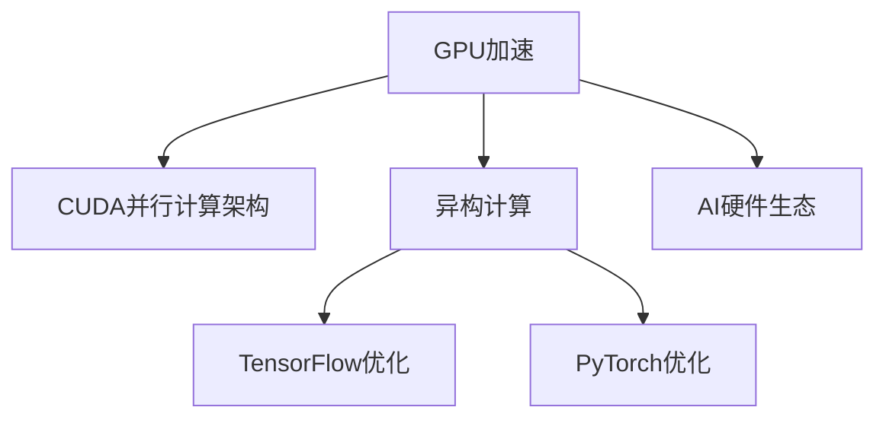

                 

# NVIDIA推动AI算力的创新

## 1. 背景介绍

随着人工智能技术的飞速发展，AI算力已成为推动产业数字化转型的关键驱动力。作为全球领先的图形处理单元(GPU)制造商，NVIDIA在这场算力革命中扮演了核心角色，通过持续的技术创新，推动AI计算性能达到新的高度。

### 1.1 问题由来

AI算力的提升，离不开高性能计算硬件的支持。然而，传统的CPU在处理AI任务时，由于缺乏针对矩阵和张量运算的优化，性能瓶颈成为制约AI应用广泛应用的一大障碍。为此，NVIDIA推出了以GeForce、Quadro、Tesla系列GPU为代表的硬件解决方案，以大幅提升AI计算的性能和效率。

### 1.2 问题核心关键点

NVIDIA在AI算力领域的创新主要体现在以下几个方面：
- **GPU架构优化**：采用CUDA并行计算架构，提升并行计算能力，增强数据并行和指令并行的效率。
- **算法和软件优化**：与TensorFlow、PyTorch等主流AI框架深度整合，提升深度学习模型的训练和推理效率。
- **AI硬件生态**：推动AI平台和工具的整合，提供一体化的解决方案，简化开发者部署和调试的流程。
- **异构计算**：通过引入ARM CPU、TPU等异构计算单元，提供更灵活的硬件组合，优化AI算力。
- **AI生态系统**：构建丰富的AI开发者社区，提供硬件、软件、算法等全方位的支持，推动AI技术普及。

这些创新措施共同构成了NVIDIA在AI算力领域的核心竞争力，使其能够持续引领AI计算技术的变革。

## 2. 核心概念与联系

### 2.1 核心概念概述

为更好地理解NVIDIA在AI算力领域的创新，本节将介绍几个关键概念：

- **GPU加速**：图形处理单元GPU是专门设计用于处理图形和科学计算任务的硬件，通过其强大的并行处理能力，可以大幅提升深度学习模型的计算效率。
- **CUDA并行计算架构**：CUDA是一种并行计算平台和编程模型，由NVIDIA开发，用于在GPU上高效执行并行计算任务，支持多种编程语言。
- **异构计算**：结合不同类型硬件的计算能力，提升整体系统的性能和效率。例如，NVIDIA提出的NVIDIA AI Compute（NVIDIA AI计算）平台，集成了GPU、CPU和TPU等多种计算单元，提供更灵活的计算配置。
- **TensorFlow和PyTorch优化**：通过深度集成主流AI框架，优化其内部计算图，提高模型训练和推理的速度和精度。
- **AI硬件生态**：构建丰富的AI硬件和软件工具，包括GPU、TPU、ARM CPU、AI平台等，满足不同场景下的AI计算需求。

这些概念之间的逻辑关系可以通过以下Mermaid流程图来展示：



这个流程图展示了几大核心概念及其之间的关系：

1. GPU加速提供基础硬件支持，通过并行计算提升性能。
2. CUDA架构提供具体的并行计算实现方式，优化GPU的计算效率。
3. 异构计算通过结合多种硬件，进一步提升计算灵活性和效率。
4. TensorFlow和PyTorch的优化，大幅提升AI框架的性能。
5. AI硬件生态提供一体化的解决方案，简化开发者部署流程。

## 3. 核心算法原理 & 具体操作步骤
### 3.1 算法原理概述

NVIDIA在AI算力领域的创新，本质上是通过GPU加速和并行计算架构，优化AI计算过程，提升模型训练和推理的效率。

以深度学习为例，模型的训练和推理过程主要由前向传播和反向传播组成。前向传播中，模型对输入数据进行计算，得到中间输出结果；反向传播中，通过计算梯度，更新模型参数，实现模型优化。GPU通过高度并行的计算能力，可以同时处理大量数据和参数，显著加速这一过程。

### 3.2 算法步骤详解

基于NVIDIA硬件和软件的深度整合，深度学习模型的训练和推理步骤如下：

1. **环境准备**：搭建NVIDIA GPU计算环境，安装CUDA和相关驱动，配置环境变量。
2. **模型加载**：使用TensorFlow或PyTorch等框架加载预训练模型，并进行参数初始化。
3. **数据准备**：准备训练和验证数据集，进行数据增强、批处理等预处理操作。
4. **训练过程**：设置训练超参数，如学习率、批次大小、迭代轮数等，启动模型训练。在每个迭代轮中，前向传播计算模型输出，反向传播计算梯度，并更新模型参数。
5. **模型评估**：在验证集上评估模型性能，根据性能指标决定是否触发Early Stopping。
6. **模型导出和部署**：将训练好的模型导出为ONNX等格式，部署到NVIDIA AI平台或云服务中。

### 3.3 算法优缺点

NVIDIA在AI算力领域的创新具有以下优点：
1. **计算效率高**：通过GPU加速和并行计算架构，深度学习模型的训练和推理效率大幅提升，能够在较短的时间内获得较为准确的模型结果。
2. **算法和软件深度优化**：与TensorFlow、PyTorch等主流AI框架深度整合，优化内部计算图，提升计算效率和模型精度。
3. **硬件生态丰富**：提供GPU、TPU、ARM CPU等多种计算单元，满足不同场景下的AI计算需求，提供灵活的硬件配置。
4. **开发者体验好**：提供一站式开发平台和工具，简化模型部署和调试流程，提升开发效率。

同时，这些创新也存在一些缺点：
1. **成本高**：高性能GPU和TPU等硬件设备价格较高，对于中小型企业和个人开发者来说，前期投入较大。
2. **能耗高**：GPU在深度学习模型训练时，能耗较高，需要良好的散热和供电系统支持。
3. **数据依赖性强**：深度学习模型的性能高度依赖于数据的质量和数量，对于数据缺失和偏差问题，模型效果可能受到影响。

### 3.4 算法应用领域

NVIDIA在AI算力领域的创新，在多个应用领域得到了广泛的应用：

- **自动驾驶**：通过GPU加速深度学习模型，提升自动驾驶汽车的感知和决策能力。
- **医疗影像分析**：利用GPU加速和并行计算，提升医学影像的分析和诊断速度。
- **科学计算**：在天气预报、气候变化等科学计算领域，提供高性能的深度学习计算支持。
- **视频渲染**：通过GPU加速视频渲染算法，提升实时视频渲染的效果和速度。
- **游戏开发**：提供高性能的GPU计算，优化游戏引擎和实时渲染技术。

除了上述这些经典应用，NVIDIA在AI算力领域的创新还催生了更多新兴领域，如AI云计算、AI边缘计算、AI物联网等，为各行各业提供了强大的AI计算支持。

## 4. 数学模型和公式 & 详细讲解 & 举例说明
### 4.1 数学模型构建

NVIDIA的GPU加速和并行计算架构，对深度学习模型的数学模型构建和计算效率有着重要影响。以卷积神经网络(CNN)为例，其基本数学模型为：

$$
f(x) = \sum_i w_i g(x; f_i)
$$

其中，$x$为输入数据，$w_i$为卷积核权重，$g(x; f_i)$为卷积操作。

### 4.2 公式推导过程

在GPU上实现卷积操作时，可以通过矩阵乘法的方式计算卷积结果，从而大幅提升计算效率。具体推导过程如下：

1. **数据矩阵化**：将输入数据$x$和卷积核$w_i$转化为矩阵形式，$x \in \mathbb{R}^{n \times h \times w}$，$w_i \in \mathbb{R}^{f \times f \times c \times n}$。
2. **卷积矩阵化**：将卷积操作转化为矩阵乘法形式，$g(x; f_i) = x \cdot W_{f_i}$，其中$W_{f_i} \in \mathbb{R}^{n \times n \times c}$为卷积权重矩阵。
3. **并行计算**：在GPU上，通过高度并行的计算能力，可以同时计算多个卷积操作，从而显著提升计算效率。

### 4.3 案例分析与讲解

以下以ResNet模型为例，展示NVIDIA在GPU加速和并行计算架构中的应用：

ResNet模型的核心思想是通过跨层连接，缓解深层网络训练过程中的梯度消失问题，从而提升模型的深度和精度。在GPU上，通过并行计算架构，可以同时计算多个跨层连接的卷积操作，从而提升计算效率。具体计算过程如下：

1. **数据预处理**：将输入数据$x$转化为矩阵形式$x \in \mathbb{R}^{n \times h \times w}$。
2. **卷积计算**：在GPU上，通过并行计算架构，同时计算多个卷积操作，得到中间结果$g(x; f_i)$。
3. **跨层连接**：将中间结果$g(x; f_i)$通过跨层连接传递给下一层卷积层，进行进一步计算。

通过这种方式，ResNet模型能够在GPU上高效地进行训练和推理，提升模型的深度和精度。

## 5. 项目实践：代码实例和详细解释说明
### 5.1 开发环境搭建

在进行NVIDIA AI算力实践前，需要先搭建开发环境。以下是使用NVIDIA GPU进行深度学习开发的配置流程：

1. **安装NVIDIA GPU**：选择适合您系统的NVIDIA GPU，安装并配置驱动程序。
2. **安装CUDA和cuDNN**：下载并安装CUDA和cuDNN库，配置环境变量。
3. **安装PyTorch或TensorFlow**：选择您喜欢的深度学习框架，安装并配置相关依赖。
4. **安装NVIDIA AI工具**：安装NVIDIA AI平台，如NVIDIA GPU Cloud，以便于部署和监控。

### 5.2 源代码详细实现

以下是使用PyTorch和NVIDIA GPU进行深度学习模型训练的示例代码：

```python
import torch
import torch.nn as nn
import torch.optim as optim
import torchvision.transforms as transforms
from torchvision.datasets import CIFAR10

# 设置设备
device = torch.device("cuda" if torch.cuda.is_available() else "cpu")

# 定义模型
class ResNet(nn.Module):
    def __init__(self):
        super(ResNet, self).__init__()
        self.conv1 = nn.Conv2d(3, 64, kernel_size=3, stride=1, padding=1)
        self.bn1 = nn.BatchNorm2d(64)
        self.relu = nn.ReLU(inplace=True)
        self.maxpool = nn.MaxPool2d(kernel_size=2, stride=2)
        self.layer1 = nn.Sequential(
            nn.Conv2d(64, 64, kernel_size=3, stride=1, padding=1),
            nn.BatchNorm2d(64),
            nn.ReLU(inplace=True),
            nn.MaxPool2d(kernel_size=2, stride=2))
        self.layer2 = nn.Sequential(
            nn.Conv2d(64, 128, kernel_size=3, stride=1, padding=1),
            nn.BatchNorm2d(128),
            nn.ReLU(inplace=True),
            nn.MaxPool2d(kernel_size=2, stride=2))
        self.layer3 = nn.Sequential(
            nn.Conv2d(128, 256, kernel_size=3, stride=1, padding=1),
            nn.BatchNorm2d(256),
            nn.ReLU(inplace=True),
            nn.MaxPool2d(kernel_size=2, stride=2))
        self.layer4 = nn.Sequential(
            nn.Conv2d(256, 256, kernel_size=3, stride=1, padding=1),
            nn.BatchNorm2d(256),
            nn.ReLU(inplace=True))
        self.fc = nn.Linear(256, 10)

    def forward(self, x):
        x = self.conv1(x)
        x = self.bn1(x)
        x = self.relu(x)
        x = self.maxpool(x)
        x = self.layer1(x)
        x = self.layer2(x)
        x = self.layer3(x)
        x = self.layer4(x)
        x = x.view(-1, 256)
        x = self.fc(x)
        return x

# 准备数据集
transform = transforms.Compose([
    transforms.ToTensor(),
    transforms.Normalize((0.5, 0.5, 0.5), (0.5, 0.5, 0.5))
])
train_dataset = CIFAR10(root='./data', train=True, transform=transform, download=True)
test_dataset = CIFAR10(root='./data', train=False, transform=transform, download=True)
train_loader = torch.utils.data.DataLoader(train_dataset, batch_size=32, shuffle=True)
test_loader = torch.utils.data.DataLoader(test_dataset, batch_size=32, shuffle=False)

# 定义超参数
num_epochs = 10
learning_rate = 0.001

# 定义模型和优化器
model = ResNet().to(device)
optimizer = optim.Adam(model.parameters(), lr=learning_rate)
criterion = nn.CrossEntropyLoss()

# 训练模型
for epoch in range(num_epochs):
    model.train()
    for i, (inputs, labels) in enumerate(train_loader):
        inputs, labels = inputs.to(device), labels.to(device)
        optimizer.zero_grad()
        outputs = model(inputs)
        loss = criterion(outputs, labels)
        loss.backward()
        optimizer.step()

# 评估模型
with torch.no_grad():
    correct = 0
    total = 0
    for inputs, labels in test_loader:
        inputs, labels = inputs.to(device), labels.to(device)
        outputs = model(inputs)
        _, predicted = torch.max(outputs.data, 1)
        total += labels.size(0)
        correct += (predicted == labels).sum().item()
    print('Accuracy: {:.2f}%'.format(100 * correct / total))
```

### 5.3 代码解读与分析

**NVIDIA GPU加速代码解读**：

1. **数据预处理**：通过`transforms`模块，对数据进行归一化处理。
2. **模型定义**：定义ResNet模型，包含卷积、批归一化、ReLU、池化等层。
3. **超参数设置**：定义训练的轮数、学习率等超参数。
4. **模型加载和优化器**：使用Adam优化器对模型进行优化。
5. **模型训练和评估**：在训练集上进行前向传播和反向传播，更新模型参数，在测试集上评估模型性能。

通过上述代码，我们可以看到，使用NVIDIA GPU进行深度学习模型训练，可以显著提升计算效率，加速模型训练过程。

## 6. 实际应用场景
### 6.1 自动驾驶

自动驾驶是NVIDIA在AI算力领域最具代表性的应用之一。通过GPU加速和并行计算架构，深度学习模型能够实时处理大量的传感器数据，实现高精度的环境感知和决策控制。

在实际应用中，自动驾驶汽车装备多个摄像头、雷达和激光雷达等传感器，采集大量的环境数据。这些数据经过GPU加速的深度学习模型进行处理，实时输出车辆的控制指令，从而实现自动驾驶。NVIDIA提供的DRIVE PX平台，集成了高性能GPU和深度学习算法，支持自动驾驶汽车的硬件和软件集成。

### 6.2 医疗影像分析

医疗影像分析是另一个NVIDIA在AI算力领域的成功应用。通过GPU加速和并行计算架构，深度学习模型能够高效地处理和分析医疗影像数据，提升诊断和治疗的准确性。

在医疗影像分析中，NVIDIA提供了NVIDIA DRIVE platform，支持深度学习模型在GPU上的高效运行。通过将GPU加速的深度学习模型集成到医疗影像系统中，医生可以快速诊断疾病，提升医疗服务质量。

### 6.3 科学计算

科学计算是NVIDIA在AI算力领域的另一个重要应用。通过GPU加速和并行计算架构，深度学习模型能够高效地处理大规模科学数据，加速科研过程。

在科学计算中，NVIDIA提供了NVIDIA AI Cloud平台，支持深度学习模型在GPU上的高效运行。通过将GPU加速的深度学习模型集成到科研平台中，研究人员可以快速处理和分析科学数据，加速科研进程。

## 7. 工具和资源推荐
### 7.1 学习资源推荐

为帮助开发者掌握NVIDIA AI算力技术，这里推荐一些优质的学习资源：

1. **NVIDIA Developer官网**：提供全面的NVIDIA GPU和AI开发文档、教程、代码示例等资源。
2. **NVIDIA GPU Computing Showcase**：展示NVIDIA在GPU加速和并行计算架构方面的最佳实践。
3. **DeepLearning.ai**：提供深度学习领域的在线课程，包括GPU加速和并行计算架构等内容。
4. **NVIDIA CUDA C Developer Guide**：官方提供的CUDA并行计算开发文档，详细介绍了GPU加速的实现方法。
5. **NVIDIA AI Cloud Documentation**：官方提供的AI平台文档，介绍了如何使用NVIDIA AI Cloud进行深度学习模型部署和优化。

通过对这些资源的学习实践，相信你一定能够快速掌握NVIDIA AI算力技术，并将其应用到实际项目中。

### 7.2 开发工具推荐

高效的开发离不开优秀的工具支持。以下是几款用于NVIDIA AI算力开发的常用工具：

1. **NVIDIA GPU Cloud**：提供易于使用的云平台，支持深度学习模型的部署和监控，适合开发和测试深度学习应用。
2. **NVIDIA AI Visualization Tool**：实时监控深度学习模型的训练和推理过程，提供性能分析和可视化功能。
3. **TensorBoard**：与TensorFlow深度整合，提供模型训练和推理过程中的各项指标的可视化，方便调试和优化。
4. **PyTorch Lightning**：提供便捷的模型训练和优化功能，支持GPU加速和分布式训练。
5. **NVIDIA Visual Profiler**：提供深度学习模型的性能分析和优化功能，支持GPU加速和内存优化。

合理利用这些工具，可以显著提升NVIDIA AI算力开发的效率和效果，加快创新迭代的步伐。

### 7.3 相关论文推荐

NVIDIA在AI算力领域的创新源于学界的持续研究。以下是几篇奠基性的相关论文，推荐阅读：

1. **CUDA并行计算架构**：CUDA并行计算架构：一种新的并行计算模型，由NVIDIA开发，用于在GPU上高效执行并行计算任务。
2. **NVIDIA GPU加速**：使用NVIDIA GPU加速深度学习模型：介绍NVIDIA GPU在深度学习模型训练和推理中的应用，以及相关的性能优化技术。
3. **NVIDIA AI Cloud平台**：NVIDIA AI Cloud平台：介绍NVIDIA AI Cloud平台的构建和应用，支持深度学习模型的部署和优化。
4. **GPU加速和深度学习**：GPU加速深度学习模型：介绍GPU加速在深度学习模型训练和推理中的应用，以及相关的优化技术。
5. **NVIDIA AI计算平台**：NVIDIA AI计算平台：介绍NVIDIA AI计算平台的设计和应用，支持多种硬件组合，提升AI计算效率。

这些论文代表了大语言模型微调技术的发展脉络。通过学习这些前沿成果，可以帮助研究者把握学科前进方向，激发更多的创新灵感。

## 8. 总结：未来发展趋势与挑战
### 8.1 总结

本文对NVIDIA在AI算力领域的创新进行了全面系统的介绍。首先阐述了NVIDIA在AI算力领域的创新背景和意义，明确了GPU加速和并行计算架构在提升AI计算性能中的核心作用。其次，从原理到实践，详细讲解了NVIDIA AI算力的核心算法和操作步骤，给出了深度学习模型训练的完整代码实例。同时，本文还广泛探讨了NVIDIA AI算力在自动驾驶、医疗影像分析、科学计算等多个领域的应用前景，展示了NVIDIA AI算力技术的强大潜力。

通过本文的系统梳理，可以看到，NVIDIA在AI算力领域的创新为深度学习模型的训练和推理提供了强大的硬件支持，显著提升了模型的计算效率和性能。未来，伴随深度学习技术的不断进步，NVIDIA AI算力还将继续引领AI计算技术的变革，为各行各业带来深远影响。

### 8.2 未来发展趋势

展望未来，NVIDIA在AI算力领域的创新将呈现以下几个发展趋势：

1. **更多硬件支持**：NVIDIA将推出更多支持深度学习计算的新型硬件，如GPU、TPU、ARM CPU等，提供更加灵活和高效的计算平台。
2. **更高效的软件优化**：NVIDIA将继续优化深度学习框架和工具，提升模型的训练和推理效率，降低开发和部署成本。
3. **更丰富的应用场景**：NVIDIA AI算力将覆盖更多应用领域，如自动驾驶、医疗影像、科学计算、物联网等，推动AI技术的广泛应用。
4. **更强大的计算能力**：NVIDIA将推出性能更强、能效更高的GPU和TPU，提升深度学习模型的计算能力。
5. **更完善的生态系统**：NVIDIA将构建更完善的AI硬件和软件生态，提供一站式的解决方案，简化开发者部署和调试流程。

这些趋势将推动NVIDIA在AI算力领域的持续创新，为深度学习模型的应用提供更强大的硬件和软件支持，加速AI技术的发展和普及。

### 8.3 面临的挑战

尽管NVIDIA在AI算力领域的创新取得了显著成就，但在迈向更加智能化、普适化应用的过程中，仍面临诸多挑战：

1. **成本高**：高性能GPU和TPU等硬件设备价格较高，对于中小型企业和个人开发者来说，前期投入较大。
2. **能耗高**：GPU在深度学习模型训练时，能耗较高，需要良好的散热和供电系统支持。
3. **数据依赖性强**：深度学习模型的性能高度依赖于数据的质量和数量，对于数据缺失和偏差问题，模型效果可能受到影响。
4. **模型鲁棒性不足**：在面对复杂、动态的计算场景时，模型的鲁棒性和稳定性可能不足，容易出现误判和性能波动。
5. **计算效率优化**：如何在保证计算效率的同时，兼顾模型的性能和准确性，是一个需要持续探索的问题。

这些挑战需要通过不断的研究和优化，才能逐步克服，实现NVIDIA AI算力的更高层次应用。

### 8.4 研究展望

面对NVIDIA AI算力面临的挑战，未来的研究需要在以下几个方面寻求新的突破：

1. **更高效的计算架构**：探索更高效的GPU架构和并行计算模型，提升深度学习模型的计算效率。
2. **更优的优化算法**：开发更高效的深度学习优化算法，提升模型的训练和推理速度，降低计算成本。
3. **更灵活的硬件组合**：通过硬件整合和异构计算，提升深度学习模型的计算灵活性和效率。
4. **更强大的数据支持**：提供更多样化、高质量的数据集，支持深度学习模型的训练和优化。
5. **更完善的生态系统**：构建更完善的AI硬件和软件生态，提供一站式的解决方案，简化开发者部署和调试流程。

这些研究方向将推动NVIDIA在AI算力领域的持续创新，为深度学习模型的应用提供更强大的硬件和软件支持，加速AI技术的发展和普及。

## 9. 附录：常见问题与解答

**Q1: GPU加速和深度学习计算的关系是什么？**

A: GPU加速和深度学习计算密切相关。GPU通过高度并行的计算能力，能够加速深度学习模型的前向传播和反向传播，提升模型的计算效率和性能。在GPU上，深度学习模型可以进行大规模并行计算，大幅缩短训练和推理时间。

**Q2: NVIDIA在AI算力领域的创新具体体现在哪些方面？**

A: NVIDIA在AI算力领域的创新主要体现在以下几个方面：
1. GPU加速和并行计算架构：提升深度学习模型的计算效率，缩短训练和推理时间。
2. CUDA并行计算平台：提供灵活、高效的并行计算解决方案。
3. 异构计算：通过引入多种硬件，提升系统的计算灵活性和效率。
4. 深度学习框架优化：与TensorFlow、PyTorch等主流框架深度整合，提升计算效率和模型精度。
5. AI平台和工具：提供一站式的解决方案，简化开发者部署和调试流程。

**Q3: 使用NVIDIA GPU加速深度学习模型有哪些优势？**

A: 使用NVIDIA GPU加速深度学习模型有以下优势：
1. 计算效率高：GPU通过高度并行的计算能力，能够加速深度学习模型的训练和推理。
2. 算法和软件优化：与TensorFlow、PyTorch等主流框架深度整合，优化内部计算图，提升计算效率和模型精度。
3. 硬件生态丰富：提供GPU、TPU、ARM CPU等多种计算单元，满足不同场景下的AI计算需求。
4. 开发者体验好：提供一站式开发平台和工具，简化模型部署和调试流程，提升开发效率。

**Q4: 如何在NVIDIA GPU上高效地进行深度学习模型训练？**

A: 在NVIDIA GPU上高效地进行深度学习模型训练，需要进行以下步骤：
1. 搭建NVIDIA GPU计算环境，安装CUDA和相关驱动，配置环境变量。
2. 选择适合的深度学习框架，如TensorFlow或PyTorch，进行模型加载和优化器配置。
3. 准备训练和验证数据集，进行数据增强、批处理等预处理操作。
4. 设置训练超参数，如学习率、批次大小、迭代轮数等，启动模型训练。
5. 在训练过程中，使用GPU加速的深度学习模型进行前向传播和反向传播，更新模型参数。
6. 在验证集上评估模型性能，根据性能指标决定是否触发Early Stopping。
7. 将训练好的模型导出为ONNX等格式，部署到NVIDIA AI平台或云服务中。

通过这些步骤，可以在NVIDIA GPU上高效地进行深度学习模型训练，提升计算效率和模型性能。

**Q5: NVIDIA AI算力在自动驾驶领域的应用前景是什么？**

A: NVIDIA AI算力在自动驾驶领域的应用前景非常广阔，主要体现在以下几个方面：
1. 环境感知：通过GPU加速的深度学习模型，实时处理多个传感器的数据，实现高精度的环境感知。
2. 决策控制：通过GPU加速的深度学习模型，实时输出车辆的控制指令，实现自动驾驶。
3. 实时渲染：通过GPU加速的视频渲染算法，实时生成高清晰度的驾驶画面。
4. 持续学习：通过GPU加速的深度学习模型，实时更新模型参数，提升驾驶性能。
5. 多车协同：通过GPU加速的深度学习模型，实现多车之间的通信和协作，提升驾驶安全性。

总之，NVIDIA AI算力为自动驾驶汽车的研发提供了强大的硬件和软件支持，推动了自动驾驶技术的快速发展。

通过以上全面系统的介绍和分析，我们不难看出，NVIDIA在AI算力领域的创新，通过GPU加速和并行计算架构，大幅提升了深度学习模型的计算效率和性能。这些创新不仅推动了自动驾驶、医疗影像分析、科学计算等多个领域的快速发展，还为深度学习技术的广泛应用提供了坚实的基础。未来，随着NVIDIA AI算力的持续创新，深度学习技术必将更加普及，推动AI计算技术进入新的发展阶段。

