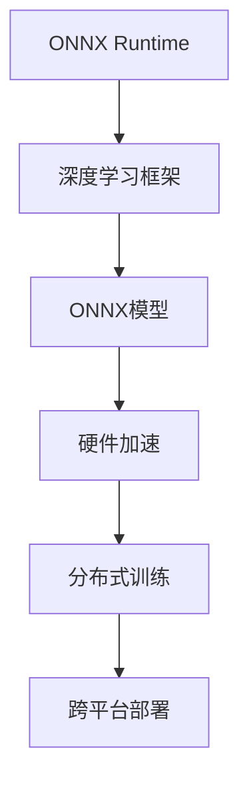

                 

# ONNX Runtime 跨平台：在不同设备上部署模型

> 关键词：模型部署, 跨平台, ONNX Runtime, 深度学习, 硬件加速, 模型优化, 分布式训练, 推理引擎, 可移植性

## 1. 背景介绍

随着深度学习模型的广泛应用，如何在不同设备上高效地部署和运行这些模型成为了一个重要的研究问题。传统的模型部署通常需要针对特定硬件平台进行优化，增加了开发和维护的复杂度。为了解决这一问题，ONNX（Open Neural Network Exchange）应运而生。

ONNX是一个开放标准的模型交换格式，旨在促进不同深度学习框架和硬件平台之间的互操作性。通过ONNX，开发者可以跨平台地构建、训练、优化和部署模型，极大地提升了模型的可移植性和效率。

本文将深入探讨ONNX Runtime及其跨平台部署机制，帮助你理解如何使用ONNX Runtime在不同设备上高效地部署和运行深度学习模型。

## 2. 核心概念与联系

### 2.1 核心概念概述

- **ONNX Runtime**：ONNX Runtime是ONNX基金会开发的一个跨平台的推理引擎，支持多种深度学习框架和硬件平台，能够在不同的硬件环境中高效运行ONNX模型。

- **模型交换格式**：ONNX是一种开源的模型交换格式，用于在多种深度学习框架和硬件平台之间进行模型的序列化和反序列化。

- **跨平台部署**：跨平台部署指的是模型可以在不同的硬件平台和操作系统上运行，不需要针对特定平台进行重写和优化。

- **分布式训练**：分布式训练指的是将大规模深度学习模型在不同节点上进行并行训练，以加速模型训练过程。

- **硬件加速**：硬件加速指的是使用GPU、FPGA、ASIC等硬件设备来加速模型的推理和训练过程。

### 2.2 核心概念原理和架构的 Mermaid 流程图



这个流程图展示了ONNX Runtime在深度学习模型部署中的作用：首先，模型被转换为ONNX格式，然后通过ONNX Runtime在不同硬件平台上进行推理和训练，最终实现跨平台的部署。

## 3. 核心算法原理 & 具体操作步骤

### 3.1 算法原理概述

ONNX Runtime的核心算法原理基于两个关键技术：模型优化和硬件加速。模型优化旨在提升模型的性能和效率，硬件加速则通过使用专门的硬件设备来加速模型的推理和训练过程。

- **模型优化**：模型优化通过剪枝、量化、融合等技术减少模型大小和计算量，提升模型的运行速度和内存使用效率。

- **硬件加速**：硬件加速通过使用GPU、FPGA、ASIC等硬件设备来加速模型的推理和训练过程。ONNX Runtime支持多种硬件加速技术，包括GPU、DSP、ARM NEON等。

### 3.2 算法步骤详解

1. **模型转换**：将现有的深度学习模型转换为ONNX格式。这个过程通常涉及到使用ONNX工具链，如ONNX Converters、ONNX PyTorch、ONNX MXNet等，将模型导出为ONNX格式。

2. **模型优化**：使用ONNX Runtime提供的优化工具，如ONNX optimizer，对ONNX模型进行剪枝、量化、融合等操作，提升模型性能。

3. **硬件加速**：根据目标硬件设备，选择合适的硬件加速技术，如使用ONNX Runtime的GPU加速器、DSP加速器等。

4. **模型部署**：将优化后的ONNX模型部署到目标硬件设备上，并使用ONNX Runtime进行推理或训练。

5. **性能监控**：通过ONNX Runtime提供的性能监控工具，实时监控模型的推理性能和资源使用情况，调整优化策略，确保最佳性能。

### 3.3 算法优缺点

**优点**：

- **跨平台部署**：ONNX Runtime支持多种硬件平台，如CPU、GPU、FPGA等，能够实现模型在不同平台之间的无缝部署。

- **模型优化**：ONNX Runtime提供了丰富的模型优化工具，如剪枝、量化、融合等，能够显著提升模型的性能和效率。

- **硬件加速**：ONNX Runtime支持多种硬件加速技术，能够充分利用硬件资源，提升模型推理和训练的速度。

**缺点**：

- **学习曲线**：由于ONNX Runtime涉及多种工具和技术，新手可能需要较长时间才能熟悉其使用。

- **性能损失**：在模型优化和硬件加速过程中，可能存在一定的性能损失，需要权衡优化和性能之间的关系。

### 3.4 算法应用领域

ONNX Runtime广泛应用于各种深度学习模型部署场景，包括但不限于：

- **计算机视觉**：图像分类、目标检测、图像分割等。

- **自然语言处理**：文本分类、情感分析、机器翻译等。

- **语音识别**：语音识别、语音合成、语音情感分析等。

- **医疗图像**：医学图像分析、疾病诊断、影像重建等。

- **自动驾驶**：目标检测、场景理解、路径规划等。

- **智能推荐**：个性化推荐、广告投放、用户行为分析等。

## 4. 数学模型和公式 & 详细讲解

### 4.1 数学模型构建

ONNX Runtime的数学模型主要基于深度学习模型。常见的深度学习模型包括卷积神经网络(CNN)、循环神经网络(RNN)、变换器(Transformer)等。

以卷积神经网络为例，其数学模型可以表示为：

$$
y = \sigma(\sum_{i=1}^{n} W_i x_i + b_i)
$$

其中，$x_i$ 是输入特征，$W_i$ 是权重，$b_i$ 是偏置，$\sigma$ 是激活函数。

### 4.2 公式推导过程

- **前向传播**：在ONNX Runtime中，深度学习模型的前向传播过程可以表示为：

$$
y = f(x; \theta)
$$

其中，$f$ 表示模型的前向传播过程，$x$ 表示输入，$\theta$ 表示模型的参数。

- **反向传播**：在ONNX Runtime中，深度学习模型的反向传播过程可以表示为：

$$
\frac{\partial y}{\partial x} = \frac{\partial f(x; \theta)}{\partial x}
$$

其中，$\frac{\partial y}{\partial x}$ 表示输出对输入的梯度。

### 4.3 案例分析与讲解

假设有一个简单的全连接神经网络模型，其数学模型可以表示为：

$$
y = \sigma(\sum_{i=1}^{n} W_i x_i + b_i)
$$

在ONNX Runtime中，我们可以将其转换为ONNX格式，并进行优化和部署。

```python
import onnx
import onnxruntime as ort

# 定义模型
class SimpleNet(nn.Module):
    def __init__(self):
        super(SimpleNet, self).__init__()
        self.fc = nn.Linear(10, 1)
    
    def forward(self, x):
        return self.fc(x)

# 训练模型
model = SimpleNet()
model.train()
criterion = nn.BCEWithLogitsLoss()
optimizer = torch.optim.SGD(model.parameters(), lr=0.01)

# 定义训练数据
x_train = torch.randn(10, 10)
y_train = torch.randn(10, 1)

# 训练模型
for epoch in range(10):
    optimizer.zero_grad()
    y_pred = model(x_train)
    loss = criterion(y_pred, y_train)
    loss.backward()
    optimizer.step()

# 导出模型为ONNX格式
onnx_model = onnx.ModelProto()
onnx_model.graph = onnx.helper.make_graph(
    model,
    name="SimpleNet",
    inputs=[onnx.helper.make_tensor_value_info("input", onnx.TensorProto.FLOAT, (10, 10))],
    outputs=[onnx.helper.make_tensor_value_info("output", onnx.TensorProto.FLOAT, (10, 1))]
)

# 保存模型
onnx.save(onnx_model, "simple_net.onnx")

# 加载模型
ort_session = ort.InferenceSession("simple_net.onnx")

# 获取模型输入输出信息
input_name = ort_session.get_inputs()[0].name
output_name = ort_session.get_outputs()[0].name

# 执行推理
input_data = np.random.rand(10, 10).astype(np.float32)
results = ort_session.run([output_name], {input_name: input_data})
```

## 5. 项目实践：代码实例和详细解释说明

### 5.1 开发环境搭建

- **安装 ONNX Runtime**：使用pip安装 ONNX Runtime：

  ```bash
  pip install onnxruntime
  ```

- **安装相关依赖**：安装TensorFlow、PyTorch、CUDA等深度学习框架及其依赖。

### 5.2 源代码详细实现

以下是一个使用ONNX Runtime进行模型推理的示例代码：

```python
import onnxruntime as ort

# 加载模型
session = ort.InferenceSession("simple_net.onnx")

# 获取模型输入输出信息
input_name = session.get_inputs()[0].name
output_name = session.get_outputs()[0].name

# 准备输入数据
input_data = np.random.rand(10, 10).astype(np.float32)

# 执行推理
results = session.run([output_name], {input_name: input_data})

# 打印输出结果
print(results[0])
```

### 5.3 代码解读与分析

- **模型加载**：使用`InferenceSession`加载模型，并获取输入输出信息。

- **准备输入数据**：准备模型推理所需的输入数据，并将其转换为ONNX Runtime支持的格式。

- **执行推理**：使用`run`方法执行模型推理，并获取输出结果。

### 5.4 运行结果展示

执行上述代码后，可以得到模型输出的结果。

## 6. 实际应用场景

### 6.1 分布式训练

在分布式训练中，ONNX Runtime可以方便地将深度学习模型部署到多个节点上进行并行训练。通过ONNX Runtime的分布式训练接口，可以实现模型的负载均衡、通信优化等功能。

### 6.2 推理加速

在推理场景中，ONNX Runtime支持多种硬件加速技术，如CPU、GPU、DSP等。通过选择合适的硬件设备，可以显著提升模型推理的速度和效率。

### 6.3 模型优化

ONNX Runtime提供了丰富的模型优化工具，如剪枝、量化、融合等，能够帮助开发者优化模型，提升模型性能和效率。

### 6.4 未来应用展望

未来的 ONNX Runtime 将支持更多的硬件平台和深度学习框架，实现更加灵活的模型部署和优化。同时，ONNX Runtime还将结合人工智能技术，提供更加智能化、自动化的推理和训练功能。

## 7. 工具和资源推荐

### 7.1 学习资源推荐

- **官方文档**：ONNX Runtime官方文档提供了详细的教程和API参考，适合初学者入门学习。

- **ONNX Tutorial**：ONNX基金会提供的官方教程，涵盖了ONNX的基本概念和应用场景。

- **深度学习框架文档**：各大深度学习框架提供的ONNX转换和优化工具文档，如TensorFlow、PyTorch等。

### 7.2 开发工具推荐

- **PyTorch**：深度学习框架，支持多种深度学习模型和优化算法。

- **ONNX Runtime**：跨平台推理引擎，支持多种深度学习模型和硬件平台。

- **TensorFlow**：深度学习框架，支持分布式训练和硬件加速。

### 7.3 相关论文推荐

- **ONNX: A Compiled Intermediate Representation for Deep Learning**：介绍ONNX的基本概念和设计理念。

- **ONNX Runtime: Cross-Platform Inference with Optimizations**：介绍ONNX Runtime的优化和硬件加速技术。

- **ONNX Model Zoo**：ONNX基金会提供的模型库，包含各种深度学习模型和优化示例。

## 8. 总结：未来发展趋势与挑战

### 8.1 研究成果总结

ONNX Runtime通过其跨平台、分布式、硬件加速等特性，极大地提升了深度学习模型的可移植性和性能。未来的 ONNX Runtime 将支持更多的深度学习框架和硬件平台，实现更加灵活和高效的模型部署和优化。

### 8.2 未来发展趋势

1. **跨平台支持**：未来的 ONNX Runtime 将支持更多的硬件平台和深度学习框架，实现更加灵活的模型部署和优化。

2. **分布式训练**：未来的 ONNX Runtime 将支持更加灵活和高效的分布式训练技术，提升模型训练速度和效率。

3. **硬件加速**：未来的 ONNX Runtime 将结合最新的硬件加速技术，提升模型的推理速度和效率。

4. **模型优化**：未来的 ONNX Runtime 将提供更多的模型优化工具，提升模型的性能和效率。

### 8.3 面临的挑战

1. **学习曲线**：ONNX Runtime涉及多种工具和技术，新手可能需要较长时间才能熟悉其使用。

2. **性能损失**：在模型优化和硬件加速过程中，可能存在一定的性能损失，需要权衡优化和性能之间的关系。

### 8.4 研究展望

未来的研究将集中在以下几个方向：

1. **跨平台优化**：优化 ONNX Runtime 的跨平台性能，提升模型的可移植性。

2. **分布式训练**：研究分布式训练算法和策略，提升模型训练速度和效率。

3. **硬件加速**：研究新的硬件加速技术，提升模型的推理和训练速度。

4. **模型优化**：研究更多的模型优化工具和技术，提升模型的性能和效率。

5. **自动化优化**：研究自动化模型优化工具，减少人工干预和优化工作量。

## 9. 附录：常见问题与解答

**Q1: ONNX Runtime 支持哪些硬件平台？**

A: ONNX Runtime 支持 CPU、GPU、DSP、ARM NEON 等多种硬件平台。

**Q2: 如何在 ONNX Runtime 中进行分布式训练？**

A: ONNX Runtime 提供了一个分布式训练 API，可以在多个节点上进行并行训练。需要根据具体应用场景选择合适的分布式训练算法和策略。

**Q3: 如何优化 ONNX Runtime 中的模型？**

A: 可以使用 ONNX Runtime 提供的优化工具，如剪枝、量化、融合等，提升模型的性能和效率。

---

作者：禅与计算机程序设计艺术 / Zen and the Art of Computer Programming

